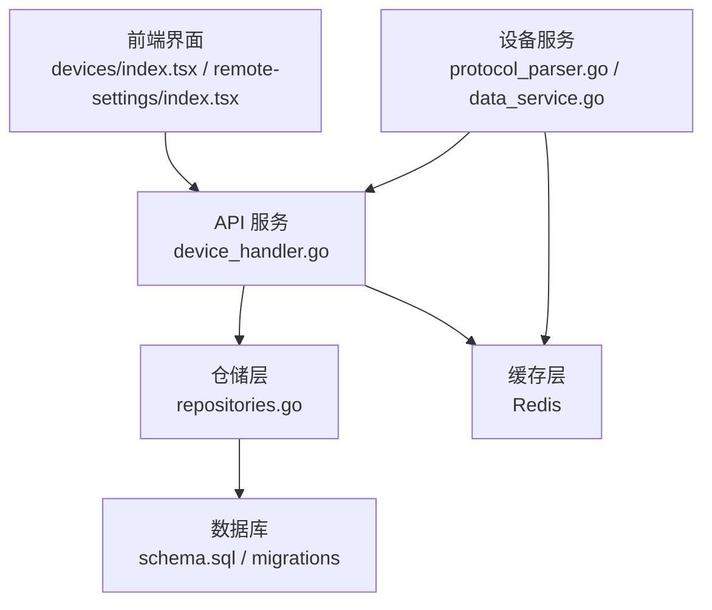
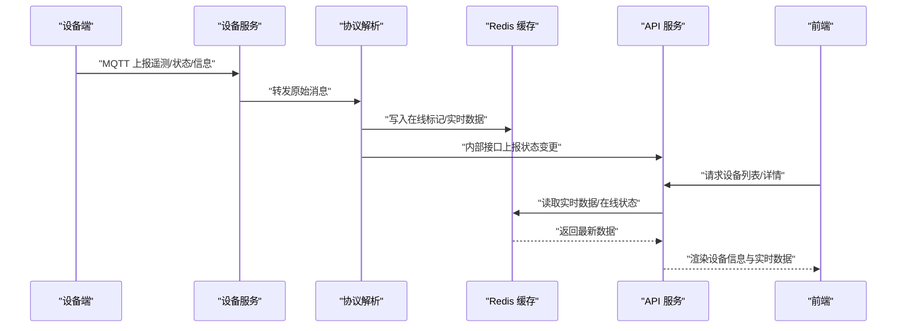
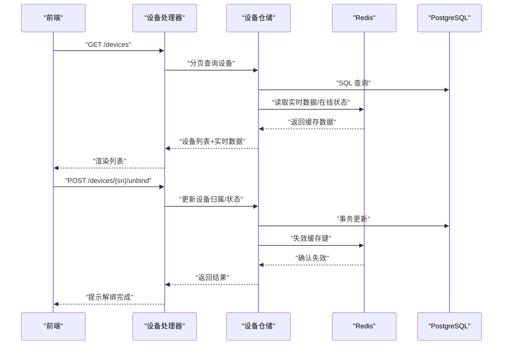
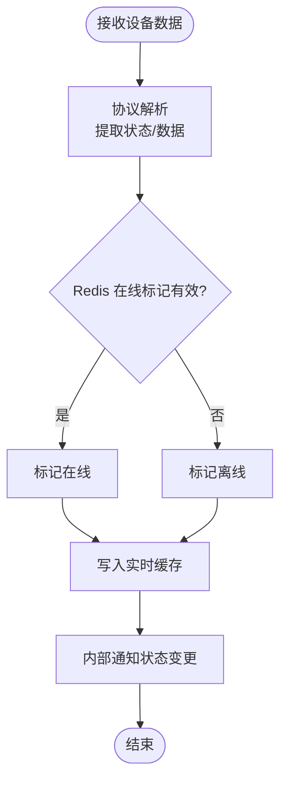
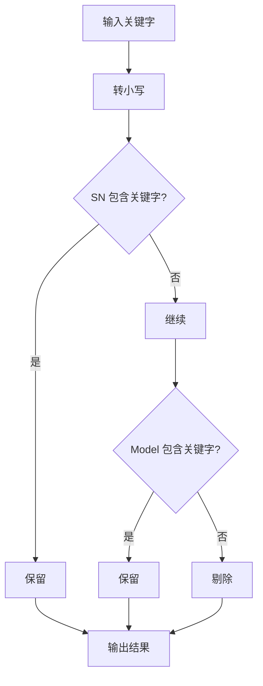
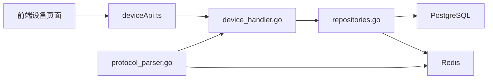

# 设备管理模块

<cite>
**本文档引用的文件**
- [device_handler.go](file://inv_api_server/internal/handler/device_handler.go)
- [repositories.go](file://inv_api_server/internal/repository/repositories.go)
- [models.go](file://inv_api_server/internal/model/models.go)
- [device.go](file://inv_device_server/internal/model/device.go)
- [protocol_parser.go](file://inv_device_server/internal/service/protocol_parser.go)
- [data_service.go](file://inv_device_server/internal/service/data_service.go)
- [deviceApi.ts](file://inv-admin-frontend/src/services/deviceApi.ts)
- [devices/index.tsx](file://inv-admin-frontend/src/pages/devices/index.tsx)
- [remote-settings/index.tsx](file://inv-admin-frontend/src/pages/remote-settings/index.tsx)
- [devices.ts](file://inv-admin-frontend/src/locales/devices.ts)
- [schema.sql](file://database/schema.sql)
- [001_init_schema.up.sql](file://database/migrations/001_init_schema.up.sql)
</cite>

## 目录
1. [简介](#简介)
2. [项目结构](#项目结构)
3. [核心组件](#核心组件)
4. [架构总览](#架构总览)
5. [详细组件分析](#详细组件分析)
6. [依赖关系分析](#依赖关系分析)
7. [性能考虑](#性能考虑)
8. [故障排除指南](#故障排除指南)
9. [结论](#结论)

## 简介
本文件为设备管理模块的全面实现文档，覆盖设备 CRUD 操作、状态管理、实时数据更新、搜索与过滤、详情页设计、缓存与离线支持以及数据同步机制，并提供性能优化与用户体验改进建议。文档基于实际代码仓库进行分析，确保内容可追溯至具体源码文件。

## 项目结构
设备管理模块由三层组成：
- 前端界面层：负责设备列表、详情、控制与远程设置等交互
- API 服务层：提供设备相关的 REST 接口与业务逻辑
- 设备服务层：负责设备数据接入、协议解析、缓存与状态同步

图表来源
- [device_handler.go](file://inv_api_server/internal/handler/device_handler.go)
- [repositories.go](file://inv_api_server/internal/repository/repositories.go)
- [schema.sql](file://database/schema.sql)
- [protocol_parser.go](file://inv_device_server/internal/service/protocol_parser.go)
- [data_service.go](file://inv_device_server/internal/service/data_service.go)

章节来源
- [device_handler.go](file://inv_api_server/internal/handler/device_handler.go)
- [repositories.go](file://inv_api_server/internal/repository/repositories.go)
- [schema.sql](file://database/schema.sql)

## 核心组件
- 设备模型与数据结构：定义设备基本信息、实时数据与运行时聚合缓存
- 设备仓储：提供设备查询、分页、状态更新、缓存失效与离线标记等能力
- 设备处理器：封装设备 CRUD、绑定/解绑、控制命令下发等接口
- 设备服务：负责协议解析、在线状态判定、实时数据缓存与状态防抖
- 前端服务与页面：提供设备列表、搜索过滤、详情展示与远程控制

章节来源
- [models.go](file://inv_api_server/internal/model/models.go)
- [device.go](file://inv_device_server/internal/model/device.go)
- [repositories.go](file://inv_api_server/internal/repository/repositories.go)
- [device_handler.go](file://inv_api_server/internal/handler/device_handler.go)
- [protocol_parser.go](file://inv_device_server/internal/service/protocol_parser.go)
- [deviceApi.ts](file://inv-admin-frontend/src/services/deviceApi.ts)
- [devices/index.tsx](file://inv-admin-frontend/src/pages/devices/index.tsx)

## 架构总览
设备管理采用“设备服务采集 -> 协议解析 -> 缓存 -> API 查询”的链路，结合 Redis 实现实时状态与数据缓存，保障高并发下的低延迟响应。

图表来源
- [protocol_parser.go](file://inv_device_server/internal/service/protocol_parser.go)
- [repositories.go](file://inv_api_server/internal/repository/repositories.go)
- [device_handler.go](file://inv_api_server/internal/handler/device_handler.go)

## 详细组件分析

### 设备 CRUD 与绑定/解绑
- 列表获取：支持按站点过滤、分页与排序；后端通过仓储层查询并合并实时数据
- 详情展示：返回设备基础信息与当前实时数据，实时数据优先来自缓存
- 绑定/解绑：通过内部接口与仓储层更新设备归属关系，同时清理相关缓存键

图表来源
- [device_handler.go](file://inv_api_server/internal/handler/device_handler.go)
- [repositories.go](file://inv_api_server/internal/repository/repositories.go)

章节来源
- [device_handler.go](file://inv_api_server/internal/handler/device_handler.go)
- [repositories.go](file://inv_api_server/internal/repository/repositories.go)

### 设备状态管理与实时数据更新
- 在线状态检测：优先使用 Redis 中的在线时间戳判断，超过阈值标记离线；同时结合数据库状态与设备最后在线时间
- 实时数据缓存：以设备 SN 为前缀的键空间存储最新遥测与状态，支持扫描扩展字段
- 状态防抖：对频繁上报的状态进行去抖，避免重复通知与抖动

图表来源
- [protocol_parser.go](file://inv_device_server/internal/service/protocol_parser.go)
- [repositories.go](file://inv_api_server/internal/repository/repositories.go)

章节来源
- [protocol_parser.go](file://inv_device_server/internal/service/protocol_parser.go)
- [repositories.go](file://inv_api_server/internal/repository/repositories.go)

### 设备搜索与过滤
- 前端搜索：在设备列表页面支持关键字模糊匹配 SN 与型号
- 远程设置页面：提供设备选择器，支持搜索与状态标签展示
- 后端过滤：仓储层支持按站点、状态、关键词等条件组合查询

图表来源
- [devices/index.tsx](file://inv-admin-frontend/src/pages/devices/index.tsx)
- [remote-settings/index.tsx](file://inv-admin-frontend/src/pages/remote-settings/index.tsx)
- [repositories.go](file://inv_api_server/internal/repository/repositories.go)

章节来源
- [devices/index.tsx](file://inv-admin-frontend/src/pages/devices/index.tsx)
- [remote-settings/index.tsx](file://inv-admin-frontend/src/pages/remote-settings/index.tsx)
- [repositories.go](file://inv_api_server/internal/repository/repositories.go)

### 设备详情页面设计
- 信息展示：展示设备基础信息（型号、厂商、额定功率等）与实时数据卡片
- 参数配置：通过动态字段渲染与控制指令下发实现参数配置
- 操作按钮：支持解绑、删除、创建 OTA 任务等操作，具备二次确认与反馈

章节来源
- [devices.ts](file://inv-admin-frontend/src/locales/devices.ts)
- [devices/index.tsx](file://inv-admin-frontend/src/pages/devices/index.tsx)

### 数据缓存策略、离线支持与数据同步
- 缓存键空间：以 "realtime:latest:{sn}" 为主键，扩展键 "realtime:latest:{sn}:*" 存放子域数据
- 离线判定：若设备最后在线时间早于阈值且 Redis 无近期在线标记，则标记为离线
- 同步机制：设备服务写入 Redis，API 服务优先读取缓存，必要时回退到数据库；删除设备时主动失效缓存键

章节来源
- [repositories.go](file://inv_api_server/internal/repository/repositories.go)
- [protocol_parser.go](file://inv_device_server/internal/service/protocol_parser.go)

### 性能优化与用户体验改进
- 前端缓存：使用 React Query 的 staleTime 与查询键管理，减少重复请求
- 后端索引：数据库迁移脚本包含性能索引，提升查询效率
- 状态防抖：降低无效状态通知频率，减少系统抖动
- 批量操作：支持批量解绑与删除，提升管理效率

章节来源
- [remote-settings/index.tsx](file://inv-admin-frontend/src/pages/remote-settings/index.tsx)
- [devices.ts](file://inv-admin-frontend/src/locales/devices.ts)
- [002_add_performance_indexes.up.sql](file://database/migrations/002_add_performance_indexes.up.sql)

## 依赖关系分析
- 前端依赖 API 服务提供的设备接口，通过 deviceApi.ts 封装调用
- API 服务依赖仓储层访问数据库与 Redis 缓存
- 设备服务依赖 MQTT/Redis/Kafka 管道，负责数据采集与状态同步

图表来源
- [deviceApi.ts](file://inv-admin-frontend/src/services/deviceApi.ts)
- [device_handler.go](file://inv_api_server/internal/handler/device_handler.go)
- [repositories.go](file://inv_api_server/internal/repository/repositories.go)
- [protocol_parser.go](file://inv_device_server/internal/service/protocol_parser.go)

章节来源
- [deviceApi.ts](file://inv-admin-frontend/src/services/deviceApi.ts)
- [device_handler.go](file://inv_api_server/internal/handler/device_handler.go)
- [repositories.go](file://inv_api_server/internal/repository/repositories.go)
- [protocol_parser.go](file://inv_device_server/internal/service/protocol_parser.go)

## 性能考虑
- 缓存命中率：通过合理的键命名与扫描策略，最大化缓存命中，减少数据库压力
- 查询优化：利用数据库索引与分页，避免全表扫描
- 状态防抖：降低无效状态上报频率，减少网络与计算开销
- 前端懒加载：详情页与远程设置页面按需加载数据，缩短首屏时间

## 故障排除指南
- 设备状态异常：检查 Redis 中 "device:online" 键是否正确更新；核对设备最后在线时间与数据库状态一致性
- 实时数据缺失：确认缓存键 "realtime:latest:{sn}" 是否存在，是否存在扩展键
- 列表为空或过滤无效：检查前端查询参数与后端仓储层过滤条件映射

章节来源
- [repositories.go](file://inv_api_server/internal/repository/repositories.go)
- [protocol_parser.go](file://inv_device_server/internal/service/protocol_parser.go)

## 结论
设备管理模块通过清晰的分层架构与完善的缓存策略，实现了高效稳定的设备 CRUD、状态管理与实时数据展示。建议持续优化查询索引、完善错误监控与告警，进一步提升系统的可靠性与用户体验。