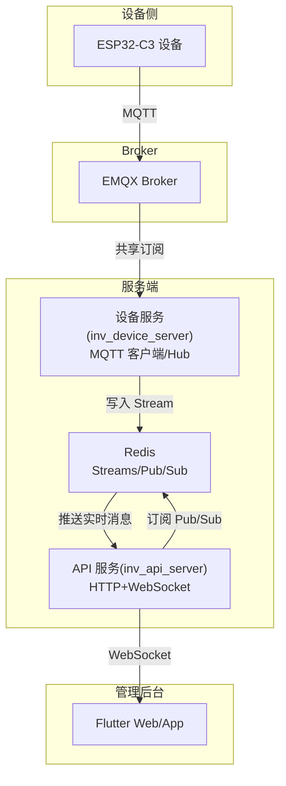
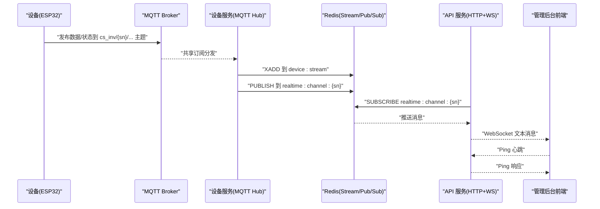
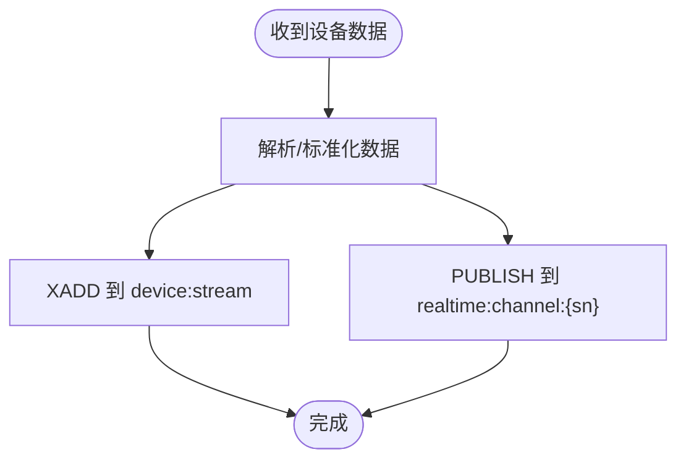
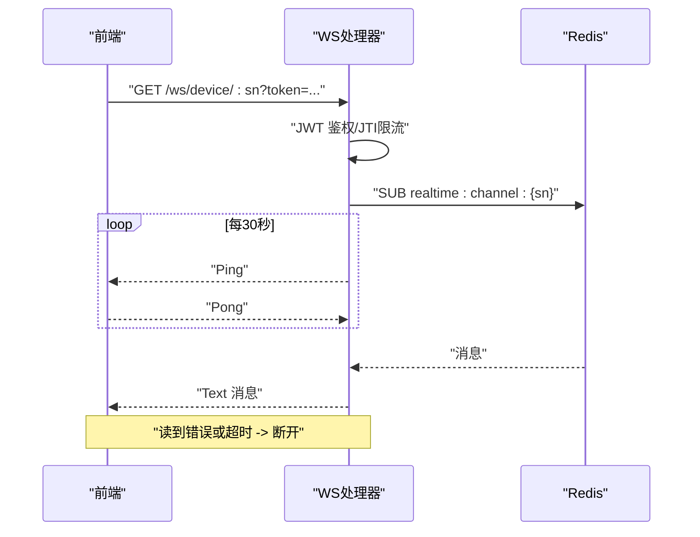
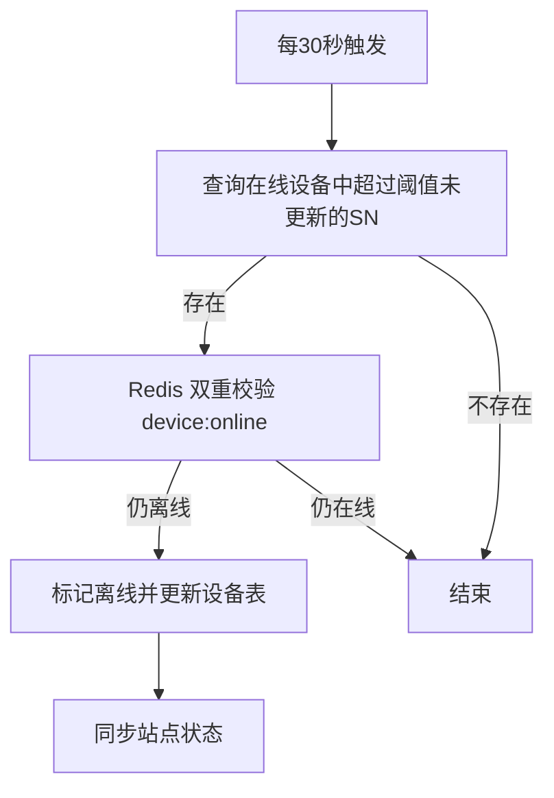
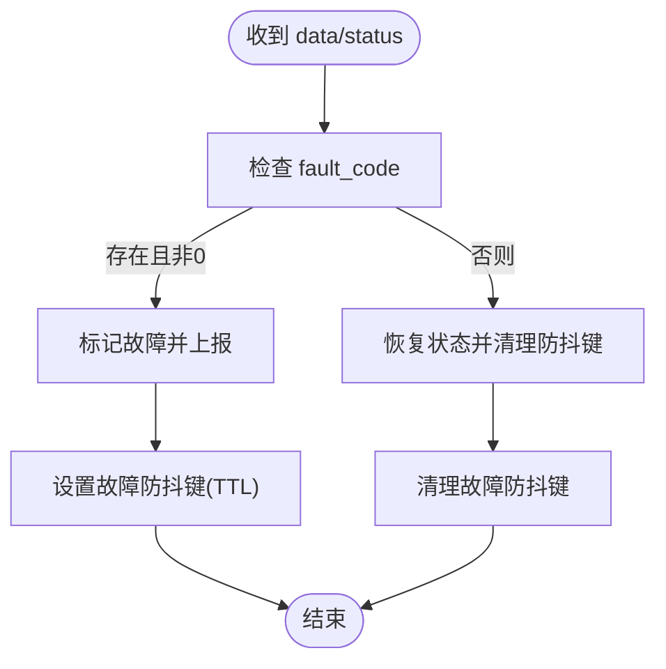
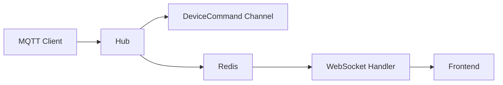

# 通信集成

<cite>
**本文引用的文件**
- [inv_device_server/internal/mqtt/client.go](file://inv_device_server/internal/mqtt/client.go)
- [inv_device_server/internal/mqtt/stream_consumer.go](file://inv_device_server/internal/mqtt/stream_consumer.go)
- [inv_api_server/internal/handler/ws_handler.go](file://inv_api_server/internal/handler/ws_handler.go)
- [inv_api_server/cmd/main.go](file://inv_api_server/cmd/main.go)
- [inv_api_server/internal/repository/repositories.go](file://inv_api_server/internal/repository/repositories.go)
- [inv_device_server/internal/model/device.go](file://inv_device_server/internal/model/device.go)
- [inv_device_server/internal/service/protocol_parser.go](file://inv_device_server/internal/service/protocol_parser.go)
- [inv_api_server/internal/config/config.go](file://inv_api_server/internal/config/config.go)
- [README.md](file://README.md)
</cite>

## 目录
1. [引言](#引言)
2. [项目结构](#项目结构)
3. [核心组件](#核心组件)
4. [架构总览](#架构总览)
5. [详细组件分析](#详细组件分析)
6. [依赖分析](#依赖分析)
7. [性能考虑](#性能考虑)
8. [故障排查指南](#故障排查指南)
9. [结论](#结论)
10. [附录](#附录)

## 引言
本文件面向“通信集成模块”的实现与运维，围绕以下目标展开：MQTT 客户端连接管理、主题订阅与消息处理；WebSocket 实时推送与心跳/断线重连；实时数据监听、状态更新与 UI 同步；网络状态检测与异常处理；通信安全（TLS、认证与数据保护）；以及通信性能优化、流量控制与离线支持策略。文档以仓库现有实现为依据，结合架构图与流程图进行说明，帮助读者快速理解系统在设备直连、服务端转发与前端展示之间的完整链路。

## 项目结构
该系统采用“设备直连 MQTT + 服务端中转 + 管理后台 WebSocket 推送”的分层设计：
- 设备侧通过 MQTT 主题向 Broker 上报数据与状态，服务端通过共享订阅接收并处理。
- 服务端将实时数据写入 Redis Stream，并通过 Redis Pub/Sub 推送给管理后台 WebSocket。
- 管理后台通过 WebSocket 接收实时消息，完成 UI 同步与状态展示。



图表来源
- [README.md:1-31](file://README.md#L1-L31)
- [inv_device_server/internal/mqtt/client.go:146-257](file://inv_device_server/internal/mqtt/client.go#L146-L257)
- [inv_device_server/internal/mqtt/stream_consumer.go:16-29](file://inv_device_server/internal/mqtt/stream_consumer.go#L16-L29)
- [inv_api_server/internal/handler/ws_handler.go:39-122](file://inv_api_server/internal/handler/ws_handler.go#L39-L122)

章节来源
- [README.md:1-31](file://README.md#L1-L31)

## 核心组件
- MQTT 客户端与 Hub：负责连接 Broker、订阅主题、处理设备上报、下发命令、维护设备在线状态。
- Redis Stream/Pub/Sub：作为设备服务与 API 服务之间的异步桥接，承载高吞吐实时数据。
- WebSocket 处理器：负责鉴权、心跳保活、消息推送与断线处理。
- 心跳检测与离线判定：定时扫描设备在线状态，对长时间无心跳的设备标记离线并同步站点状态。
- 协议解析与状态上报：对设备数据进行解析与标准化，必要时主动上报设备状态（如故障）。

章节来源
- [inv_device_server/internal/mqtt/client.go:20-144](file://inv_device_server/internal/mqtt/client.go#L20-L144)
- [inv_device_server/internal/mqtt/stream_consumer.go:16-29](file://inv_device_server/internal/mqtt/stream_consumer.go#L16-L29)
- [inv_api_server/internal/handler/ws_handler.go:39-122](file://inv_api_server/internal/handler/ws_handler.go#L39-L122)
- [inv_api_server/cmd/main.go:165-182](file://inv_api_server/cmd/main.go#L165-L182)
- [inv_device_server/internal/service/protocol_parser.go:285-609](file://inv_device_server/internal/service/protocol_parser.go#L285-L609)

## 架构总览
下图展示了从设备到前端的完整通信路径，包括 MQTT 订阅、数据落盘、Redis 推送与 WebSocket 展示。



图表来源
- [inv_device_server/internal/mqtt/client.go:164-176](file://inv_device_server/internal/mqtt/client.go#L164-L176)
- [inv_device_server/internal/mqtt/stream_consumer.go:16-29](file://inv_device_server/internal/mqtt/stream_consumer.go#L16-L29)
- [inv_api_server/internal/handler/ws_handler.go:87-121](file://inv_api_server/internal/handler/ws_handler.go#L87-L121)

## 详细组件分析

### MQTT 客户端与 Hub
- 连接管理
  - 自动选择协议方案（mqtt/tls），支持用户名密码认证。
  - 保持连接与会话持久化，设置 KeepAlive 与 SessionExpiry。
  - 连接成功后订阅多类主题，覆盖数据、状态、OTA 状态与命令结果。
- 主题订阅与消息处理
  - 状态主题区分设备主动在线与 LWT 离线，避免错误更新心跳。
  - 非状态主题视为有效数据，更新 Hub 在线统计与最后数据时间。
  - 分别处理 OTA 状态、OTA 命令确认与命令执行结果回调。
- 命令下发
  - 支持两类命令主题：通用 cs_inv/{sn}/cmd 与 OTA 专用 cs_inv/{sn}/ota/cmd。
  - 对 OTA 命令可直接发送原始 JSON；普通命令序列化为统一格式。
- 在线状态维护
  - Hub 使用 Redis Hash 记录设备在线时间戳，提供查询与批量在线 SN 获取。
  - 统计指标包含数据接收量、命令发送量、最后数据时间与在线客户端数量。

```mermaid
classDiagram
class Client {
-cm : ConnectionManager
-config : MQTTConfig
-hub : Hub
-onOtaStatus(sn,payload)
-onOtaCmdAck(sn,payload)
-onStatusChange(sn,online)
-onCmdResult(sn,payload)
+Connect(ctx) error
-handleCommands(ctx)
-sendCommand(ctx, cmd)
+Disconnect()
}
class Hub {
-rdb : redis.Client
-cmdChan : chan DeviceCommand
-stats : MQTTStats
+MarkDeviceOnline(sn)
+IsDeviceOnline(sn) bool
+GetOnlineDeviceSNs() []string
+GetCmdChan() chan<- DeviceCommand
+GetStats() MQTTStats
}
class DeviceCommand {
+DeviceSN : string
+CmdType : string
+Params : map[string]interface{}
+RawPayload : []byte
}
Client --> Hub : "依赖"
Hub --> DeviceCommand : "消费"
```

图表来源
- [inv_device_server/internal/mqtt/client.go:20-144](file://inv_device_server/internal/mqtt/client.go#L20-L144)
- [inv_device_server/internal/mqtt/client.go:270-339](file://inv_device_server/internal/mqtt/client.go#L270-L339)

章节来源
- [inv_device_server/internal/mqtt/client.go:146-257](file://inv_device_server/internal/mqtt/client.go#L146-L257)
- [inv_device_server/internal/mqtt/client.go:270-339](file://inv_device_server/internal/mqtt/client.go#L270-L339)
- [inv_device_server/internal/mqtt/client.go:79-137](file://inv_device_server/internal/mqtt/client.go#L79-L137)

### Redis Stream 与 Pub/Sub
- Stream 写入
  - 设备服务将解析后的数据以 XADD 形式写入 device:stream，限制最大长度，保证流式数据的吞吐与持久性。
- Pub/Sub 推送
  - 同时向 realtime:channel:{sn} 发布文本消息，供 API 服务订阅并推送到 WebSocket。



图表来源
- [inv_device_server/internal/mqtt/stream_consumer.go:16-29](file://inv_device_server/internal/mqtt/stream_consumer.go#L16-L29)

章节来源
- [inv_device_server/internal/mqtt/stream_consumer.go:16-29](file://inv_device_server/internal/mqtt/stream_consumer.go#L16-L29)

### WebSocket 实时推送与心跳
- 鉴权与连接数限制
  - 通过查询参数 token 进行 JWT 鉴权，限制同一 JTI 的并发连接数上限。
- 心跳保活
  - 后台定时发送 Ping，设置写入超时，读到错误或超时即认为断开并清理资源。
- 消息推送
  - 订阅指定设备的实时通道，收到消息后以文本帧推送至前端。



图表来源
- [inv_api_server/internal/handler/ws_handler.go:39-122](file://inv_api_server/internal/handler/ws_handler.go#L39-L122)

章节来源
- [inv_api_server/internal/handler/ws_handler.go:39-122](file://inv_api_server/internal/handler/ws_handler.go#L39-L122)

### 心跳检测与离线判定
- 定时任务
  - 后台启动心跳检查任务，周期性扫描长时间无心跳的设备。
- 离线判定
  - 查询数据库中状态为在线且超过阈值未更新的设备，二次校验 Redis 在线表，避免误判。
- 状态同步
  - 对标记离线的设备同步更新所属站点状态，减少无效查询。



图表来源
- [inv_api_server/cmd/main.go:165-182](file://inv_api_server/cmd/main.go#L165-L182)
- [inv_api_server/internal/repository/repositories.go:1656-1689](file://inv_api_server/internal/repository/repositories.go#L1656-L1689)
- [inv_api_server/internal/repository/repositories.go:1696-1707](file://inv_api_server/internal/repository/repositories.go#L1696-L1707)

章节来源
- [inv_api_server/cmd/main.go:165-182](file://inv_api_server/cmd/main.go#L165-L182)
- [inv_api_server/internal/repository/repositories.go:1656-1689](file://inv_api_server/internal/repository/repositories.go#L1656-L1689)
- [inv_api_server/internal/repository/repositories.go:1696-1707](file://inv_api_server/internal/repository/repositories.go#L1696-L1707)

### 协议解析与状态上报
- 状态防抖与故障上报
  - 对设备状态变化进行防抖，避免频繁上报；当检测到故障时主动上报故障状态，并设置防抖键 TTL，防止被后续正常状态覆盖。
- 字段映射与存储
  - 根据设备模型元数据对字段进行映射与标准化，构建数据库存储结构；同时保留兼容字段便于查询。



图表来源
- [inv_device_server/internal/service/protocol_parser.go:528-609](file://inv_device_server/internal/service/protocol_parser.go#L528-L609)

章节来源
- [inv_device_server/internal/service/protocol_parser.go:285-609](file://inv_device_server/internal/service/protocol_parser.go#L285-L609)

### 数据模型与标准化
- 设备实时聚合结构
  - 将不同主题的数据标准化为统一的实时结构，包含 AC、电池、PV、系统状态、能量等字段，便于前端渲染与缓存。

章节来源
- [inv_device_server/internal/model/device.go:170-202](file://inv_device_server/internal/model/device.go#L170-L202)

## 依赖分析
- 组件耦合
  - 设备服务的 Hub 与 Client 通过命令通道解耦，命令通过 Channel 异步下发，降低阻塞风险。
  - API 服务通过 Redis 与设备服务解耦，仅依赖 Pub/Sub 通道，具备良好的扩展性。
- 外部依赖
  - MQTT 客户端依赖 autopaho/paho，使用共享订阅实现多实例负载均衡。
  - Redis 提供 Stream 与 Pub/Sub，支撑高吞吐与低延迟的实时推送。
  - JWT 用于 WebSocket 鉴权，配置集中于配置文件。



图表来源
- [inv_device_server/internal/mqtt/client.go:139-144](file://inv_device_server/internal/mqtt/client.go#L139-L144)
- [inv_api_server/internal/handler/ws_handler.go:39-122](file://inv_api_server/internal/handler/ws_handler.go#L39-L122)

章节来源
- [inv_device_server/internal/mqtt/client.go:139-144](file://inv_device_server/internal/mqtt/client.go#L139-L144)
- [inv_api_server/internal/handler/ws_handler.go:39-122](file://inv_api_server/internal/handler/ws_handler.go#L39-L122)

## 性能考虑
- 流量控制
  - MQTT 订阅使用 QoS 1，保障消息可达；命令通道使用 Channel 缓冲，容量为 10000，避免突发命令阻塞。
  - Redis Stream 限制最大长度，避免无限增长导致内存压力。
- 心跳与保活
  - WebSocket 心跳周期 30 秒，写超时 10 秒，及时发现断连并释放资源。
- 离线与降级
  - 心跳检查定期清理离线设备，减少无效查询；前端可根据离线状态提示与降级展示。
- 扩展性
  - 共享订阅与多实例部署，提升设备服务横向扩展能力；API 服务通过 Pub/Sub 与设备服务解耦。

章节来源
- [inv_device_server/internal/mqtt/client.go:75-77](file://inv_device_server/internal/mqtt/client.go#L75-L77)
- [inv_device_server/internal/mqtt/stream_consumer.go:13-14](file://inv_device_server/internal/mqtt/stream_consumer.go#L13-L14)
- [inv_api_server/internal/handler/ws_handler.go:102-103](file://inv_api_server/internal/handler/ws_handler.go#L102-L103)
- [inv_api_server/cmd/main.go:165-182](file://inv_api_server/cmd/main.go#L165-L182)

## 故障排查指南
- MQTT 连接失败
  - 检查 Broker 地址、端口与 TLS 方案是否匹配；确认用户名密码正确；查看 OnConnectError 回调日志。
- 订阅不到消息
  - 确认主题通配符匹配规则；检查共享订阅组配置；验证 OnPublishReceived 是否被触发。
- 命令下发失败
  - 查看命令通道是否阻塞；确认目标主题是否正确；检查 RawPayload 与序列化逻辑。
- WebSocket 推送中断
  - 检查鉴权 token 是否有效；确认 JTI 并发连接数限制；观察 Ping/Pong 是否正常；查看写超时与读错误。
- 设备离线误判
  - 检查心跳阈值与 Redis 在线表；确认数据库查询与双重校验逻辑；关注站点状态同步是否及时。

章节来源
- [inv_device_server/internal/mqtt/client.go:178-180](file://inv_device_server/internal/mqtt/client.go#L178-L180)
- [inv_device_server/internal/mqtt/client.go:226-235](file://inv_device_server/internal/mqtt/client.go#L226-L235)
- [inv_api_server/internal/handler/ws_handler.go:48-53](file://inv_api_server/internal/handler/ws_handler.go#L48-L53)
- [inv_api_server/internal/handler/ws_handler.go:111-113](file://inv_api_server/internal/handler/ws_handler.go#L111-L113)
- [inv_api_server/internal/repository/repositories.go:1672-1687](file://inv_api_server/internal/repository/repositories.go#L1672-L1687)

## 结论
该通信集成模块以 MQTT 为核心，结合 Redis Stream/Pub/Sub 与 WebSocket，实现了设备直连、服务端中转与前端实时展示的完整闭环。通过共享订阅、心跳检测、命令通道缓冲与鉴权限流等机制，系统在可靠性、扩展性与性能方面均具备良好表现。建议在生产环境中持续关注连接与订阅健康度、心跳阈值与离线判定策略、以及前端 UI 的离线降级体验。

## 附录
- 通信安全
  - MQTT：支持 TLS 与用户名密码认证；Broker 端内置 JWT 验签，过期自动断连。
  - WebSocket：基于 JWT token 鉴权，限制并发连接数，降低滥用风险。
- 配置要点
  - 服务器端口、读写超时、JWT 密钥与过期时间、Redis 连接参数等集中于配置文件，支持环境变量注入。

章节来源
- [README.md:8-29](file://README.md#L8-L29)
- [inv_api_server/internal/config/config.go:124-127](file://inv_api_server/internal/config/config.go#L124-L127)
- [inv_api_server/internal/config/config.go:149-152](file://inv_api_server/internal/config/config.go#L149-L152)