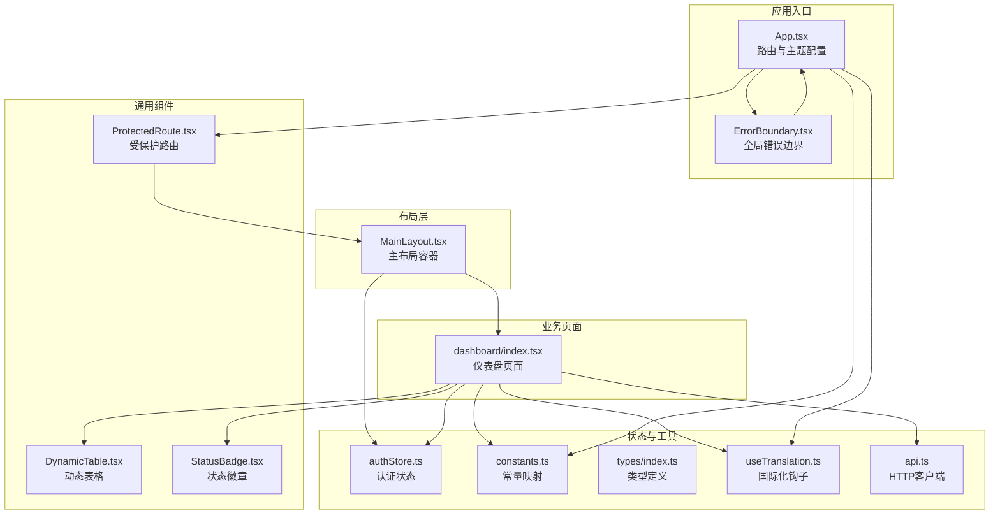
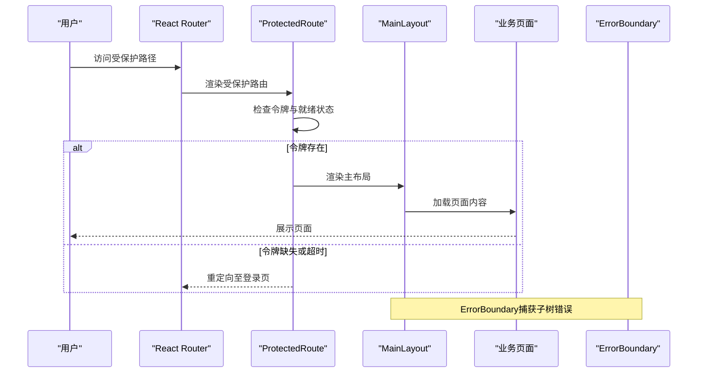
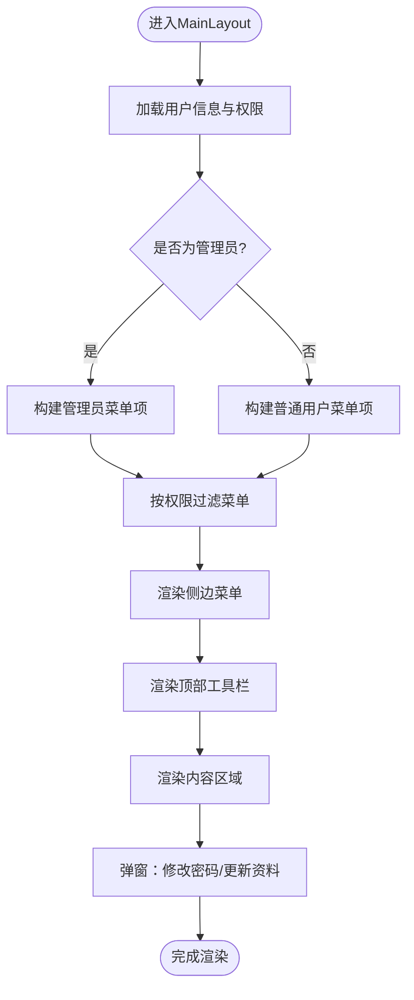
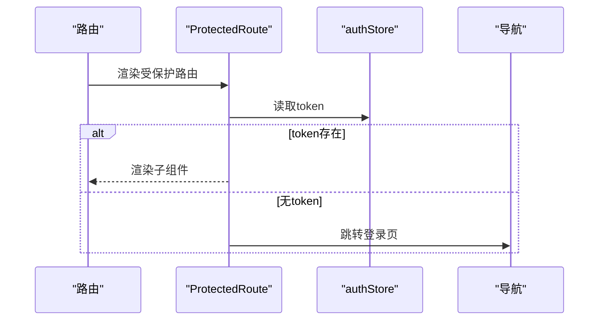
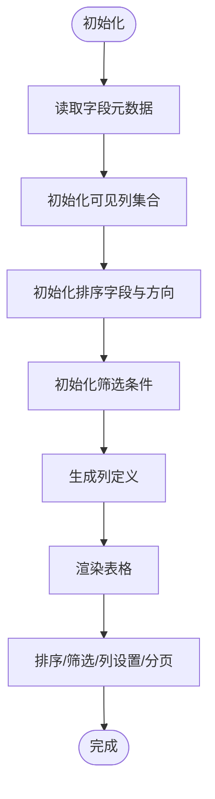
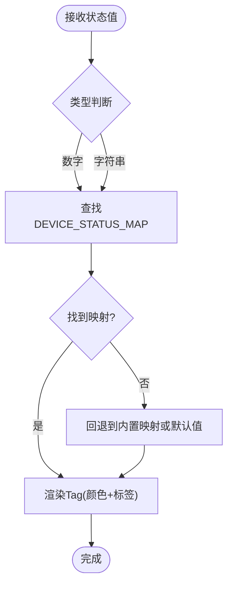
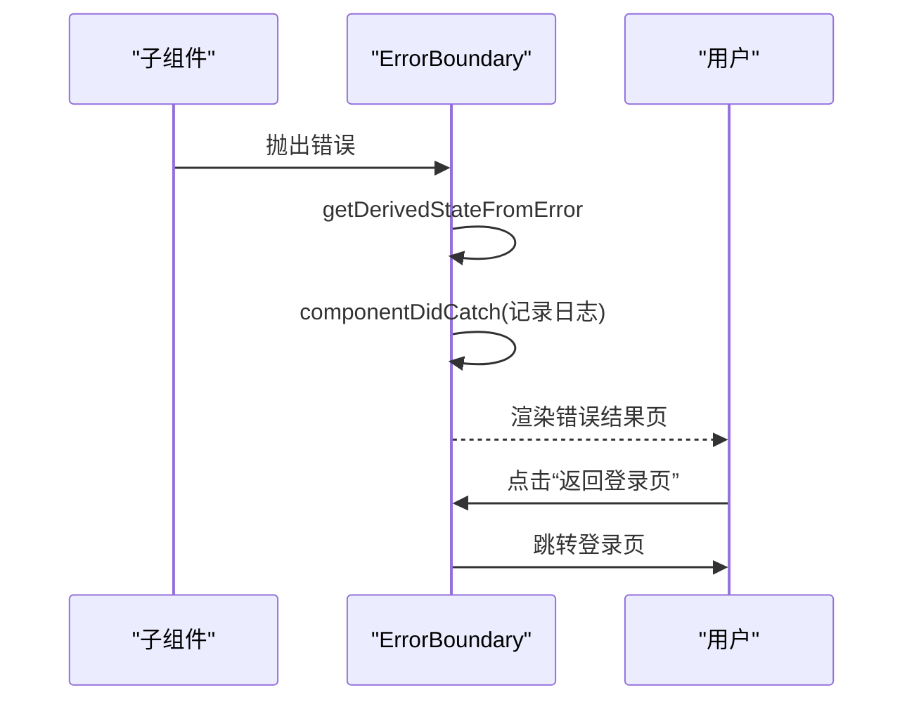
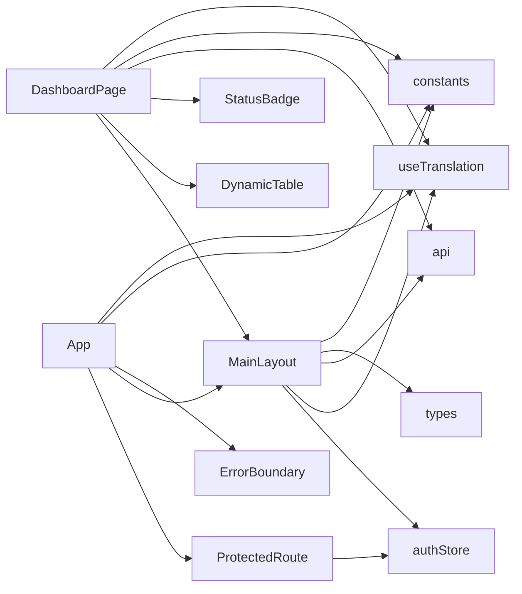

# UI组件系统

<cite>
**本文档引用的文件**
- [MainLayout.tsx](file://inv-admin-frontend/src/layouts/MainLayout.tsx)
- [ProtectedRoute.tsx](file://inv-admin-frontend/src/components/ProtectedRoute.tsx)
- [DynamicTable.tsx](file://inv-admin-frontend/src/components/DynamicTable.tsx)
- [StatusBadge.tsx](file://inv-admin-frontend/src/components/StatusBadge.tsx)
- [ErrorBoundary.tsx](file://inv-admin-frontend/src/components/ErrorBoundary.tsx)
- [authStore.ts](file://inv-admin-frontend/src/stores/authStore.ts)
- [constants.ts](file://inv-admin-frontend/src/utils/constants.ts)
- [index.ts](file://inv-admin-frontend/src/types/index.ts)
- [useTranslation.ts](file://inv-admin-frontend/src/hooks/useTranslation.ts)
- [App.tsx](file://inv-admin-frontend/src/App.tsx)
- [vite.config.ts](file://inv-admin-frontend/vite.config.ts)
- [global.css](file://inv-admin-frontend/src/global.css)
- [dashboard/index.tsx](file://inv-admin-frontend/src/pages/dashboard/index.tsx)
- [api.ts](file://inv-admin-frontend/src/services/api.ts)
</cite>

## 目录
1. [简介](#简介)
2. [项目结构](#项目结构)
3. [核心组件](#核心组件)
4. [架构总览](#架构总览)
5. [详细组件分析](#详细组件分析)
6. [依赖关系分析](#依赖关系分析)
7. [性能考虑](#性能考虑)
8. [故障排查指南](#故障排查指南)
9. [结论](#结论)
10. [附录](#附录)

## 简介
本文件面向管理后台UI组件系统，围绕基于Ant Design Pro的组件库进行使用与定制说明，重点覆盖以下方面：
- 主布局组件MainLayout：侧边栏导航、顶部工具栏、面包屑导航的配置与交互
- 受保护路由组件ProtectedRoute：权限验证机制、JWT令牌检查与拦截逻辑
- 动态表格组件DynamicTable：数据渲染、排序筛选、分页与列可见性控制
- 状态徽章StatusBadge：颜色编码与状态显示逻辑
- 错误边界ErrorBoundary：全局错误捕获与降级处理
- 组件库样式定制、主题配置与响应式设计实现

## 项目结构
前端采用Vite + React + TypeScript技术栈，Ant Design作为UI基础库，Zustand管理状态，Axios封装HTTP请求，React Router负责路由。

**图表来源**
- [App.tsx:46-155](file://inv-admin-frontend/src/App.tsx#L46-L155)
- [MainLayout.tsx:65-387](file://inv-admin-frontend/src/layouts/MainLayout.tsx#L65-L387)
- [ProtectedRoute.tsx:10-48](file://inv-admin-frontend/src/components/ProtectedRoute.tsx#L10-L48)
- [DynamicTable.tsx:33-198](file://inv-admin-frontend/src/components/DynamicTable.tsx#L33-L198)
- [StatusBadge.tsx:14-21](file://inv-admin-frontend/src/components/StatusBadge.tsx#L14-L21)
- [authStore.ts:21-68](file://inv-admin-frontend/src/stores/authStore.ts#L21-L68)
- [constants.ts:1-128](file://inv-admin-frontend/src/utils/constants.ts#L1-L128)
- [types/index.ts:1-110](file://inv-admin-frontend/src/types/index.ts#L1-L110)
- [useTranslation.ts:4-19](file://inv-admin-frontend/src/hooks/useTranslation.ts#L4-L19)
- [api.ts:1-64](file://inv-admin-frontend/src/services/api.ts#L1-L64)

**章节来源**
- [App.tsx:46-155](file://inv-admin-frontend/src/App.tsx#L46-L155)
- [vite.config.ts:1-22](file://inv-admin-frontend/vite.config.ts#L1-L22)

## 核心组件
- 主布局MainLayout：提供侧边菜单、顶部工具栏、用户下拉菜单、语言与时区切换、密码与个人资料修改弹窗等
- 受保护路由ProtectedRoute：基于令牌的鉴权守卫，避免未登录访问受保护页面
- 动态表格DynamicTable：根据字段元数据动态生成列，支持列显隐、排序、筛选与分页
- 状态徽章StatusBadge：根据设备状态映射展示颜色与标签
- 错误边界ErrorBoundary：捕获子树内错误，提供重试与查看详情能力

**章节来源**
- [MainLayout.tsx:65-387](file://inv-admin-frontend/src/layouts/MainLayout.tsx#L65-L387)
- [ProtectedRoute.tsx:10-48](file://inv-admin-frontend/src/components/ProtectedRoute.tsx#L10-L48)
- [DynamicTable.tsx:33-198](file://inv-admin-frontend/src/components/DynamicTable.tsx#L33-L198)
- [StatusBadge.tsx:14-21](file://inv-admin-frontend/src/components/StatusBadge.tsx#L14-L21)
- [ErrorBoundary.tsx:13-67](file://inv-admin-frontend/src/components/ErrorBoundary.tsx#L13-L67)

## 架构总览
系统通过App.tsx统一配置Ant Design主题与国际化，并将全局错误边界包裹在路由外层。受保护路由组件用于保护页面资源，主布局承载导航与用户操作，业务页面通过服务层与API交互。

**图表来源**
- [App.tsx:107-149](file://inv-admin-frontend/src/App.tsx#L107-L149)
- [ProtectedRoute.tsx:14-30](file://inv-admin-frontend/src/components/ProtectedRoute.tsx#L14-L30)
- [MainLayout.tsx:207-383](file://inv-admin-frontend/src/layouts/MainLayout.tsx#L207-L383)

**章节来源**
- [App.tsx:46-155](file://inv-admin-frontend/src/App.tsx#L46-L155)

## 详细组件分析

### 主布局组件MainLayout
- 侧边栏导航
  - 管理员与普通用户的菜单项差异由角色决定，菜单项包含权限标识，渲染前会过滤无权限项
  - 支持折叠/展开，移动端自动折叠
- 顶部工具栏
  - 左侧折叠按钮，移动端与桌面端行为不同
  - 语言切换（中文/英文），时区选择（下拉列表）
  - 用户头像、昵称、角色徽章与下拉菜单（修改密码、修改资料、退出登录）
- 内容区域
  - 使用Outlet渲染子路由页面
  - 弹窗：修改密码、更新个人资料
- 权限与国际化
  - 通过store中的hasPermission判断菜单项显示
  - 使用自定义useTranslation钩子进行文案翻译

**图表来源**
- [MainLayout.tsx:93-105](file://inv-admin-frontend/src/layouts/MainLayout.tsx#L93-L105)
- [MainLayout.tsx:207-383](file://inv-admin-frontend/src/layouts/MainLayout.tsx#L207-L383)

**章节来源**
- [MainLayout.tsx:65-387](file://inv-admin-frontend/src/layouts/MainLayout.tsx#L65-L387)
- [authStore.ts:40-52](file://inv-admin-frontend/src/stores/authStore.ts#L40-L52)
- [constants.ts:2-7](file://inv-admin-frontend/src/utils/constants.ts#L2-L7)

### 受保护路由组件ProtectedRoute
- 令牌检查
  - 读取store中的token，若不存在则等待订阅或超时后跳转登录
- 安全策略
  - 在路由挂载阶段即进行鉴权，避免未授权访问
  - 防抖等待期间显示加载动画，提升用户体验

**图表来源**
- [ProtectedRoute.tsx:10-48](file://inv-admin-frontend/src/components/ProtectedRoute.tsx#L10-L48)
- [authStore.ts:30-38](file://inv-admin-frontend/src/stores/authStore.ts#L30-L38)

**章节来源**
- [ProtectedRoute.tsx:10-48](file://inv-admin-frontend/src/components/ProtectedRoute.tsx#L10-L48)

### 动态表格组件DynamicTable
- 字段元数据驱动
  - 通过FieldMeta数组定义列顺序、名称、类型、单位、是否显示与排序权重
- 渲染与格式化
  - 根据字段类型进行格式化（整数、浮点、布尔、字符串）
  - 支持为数值附加单位显示
- 排序与筛选
  - 点击列标题触发排序，支持升/降序切换
  - 提供每列筛选输入框，支持多字段组合筛选
- 列可见性控制
  - 通过弹出面板勾选显示/隐藏列，支持恢复默认
- 分页与滚动
  - 默认分页配置可传入；支持横向滚动以适配宽表

**图表来源**
- [DynamicTable.tsx:33-198](file://inv-admin-frontend/src/components/DynamicTable.tsx#L33-L198)

**章节来源**
- [DynamicTable.tsx:33-198](file://inv-admin-frontend/src/components/DynamicTable.tsx#L33-L198)

### 状态徽章StatusBadge
- 映射规则
  - 支持数字与字符串两种状态值，优先使用设备状态映射，其次使用内置映射
  - 不匹配时回退到原始值并使用默认颜色
- 渲染
  - 使用Ant Design的Tag组件展示带颜色的状态标签

**图表来源**
- [StatusBadge.tsx:14-21](file://inv-admin-frontend/src/components/StatusBadge.tsx#L14-L21)
- [constants.ts:9-16](file://inv-admin-frontend/src/utils/constants.ts#L9-L16)

**章节来源**
- [StatusBadge.tsx:14-21](file://inv-admin-frontend/src/components/StatusBadge.tsx#L14-L21)
- [constants.ts:9-16](file://inv-admin-frontend/src/utils/constants.ts#L9-L16)

### 错误边界ErrorBoundary
- 捕获机制
  - 使用静态方法getDerivedStateFromError捕获错误
  - 在componentDidCatch记录错误上下文
- 降级处理
  - 展示错误结果页，提供返回登录页与查看详情按钮
  - 详情按钮弹窗展示错误消息与堆栈

**图表来源**
- [ErrorBoundary.tsx:19-30](file://inv-admin-frontend/src/components/ErrorBoundary.tsx#L19-L30)
- [ErrorBoundary.tsx:32-63](file://inv-admin-frontend/src/components/ErrorBoundary.tsx#L32-L63)

**章节来源**
- [ErrorBoundary.tsx:13-67](file://inv-admin-frontend/src/components/ErrorBoundary.tsx#L13-L67)

### 组件库样式定制、主题配置与响应式设计
- 主题配置
  - 通过ConfigProvider设置Ant Design主题参数，包括主色、成功/警告/错误色、圆角、字体、背景色等
  - 对Button、Card、Table、Menu、Input、Select等组件进行细粒度主题定制
- 响应式设计
  - 使用Grid断点在移动端自动折叠侧边栏
  - 移动端侧边栏与桌面端交互差异处理
- 全局样式
  - 引入Inter字体，优化卡片悬停、按钮按压、菜单过渡、滚动条等视觉细节
  - 页面过渡动画、模态框动画与关键高亮样式

**章节来源**
- [App.tsx:55-99](file://inv-admin-frontend/src/App.tsx#L55-L99)
- [MainLayout.tsx:83-89](file://inv-admin-frontend/src/layouts/MainLayout.tsx#L83-L89)
- [global.css:1-135](file://inv-admin-frontend/src/global.css#L1-L135)

## 依赖关系分析
- 组件耦合
  - MainLayout依赖认证状态、国际化与API服务，承担用户交互与页面容器职责
  - ProtectedRoute仅依赖认证状态，职责单一
  - DynamicTable与StatusBadge为纯展示组件，依赖外部传入的数据与配置
- 外部依赖
  - Ant Design与ProComponents提供UI基础
  - Axios与Zustand分别负责HTTP与状态管理
  - React Router负责路由控制

**图表来源**
- [MainLayout.tsx:15-21](file://inv-admin-frontend/src/layouts/MainLayout.tsx#L15-L21)
- [dashboard/index.tsx:14-20](file://inv-admin-frontend/src/pages/dashboard/index.tsx#L14-L20)
- [ProtectedRoute.tsx:4](file://inv-admin-frontend/src/components/ProtectedRoute.tsx#L4)
- [App.tsx:6-33](file://inv-admin-frontend/src/App.tsx#L6-L33)

**章节来源**
- [App.tsx:1-38](file://inv-admin-frontend/src/App.tsx#L1-L38)
- [package.json:12-28](file://inv-admin-frontend/package.json#L12-L28)

## 性能考虑
- 表格性能
  - DynamicTable内部使用useMemo与useCallback缓存计算结果，减少不必要的重渲染
  - 支持横向滚动与小尺寸表格，降低DOM复杂度
- 路由与状态
  - ProtectedRoute在挂载阶段快速判定，避免无效渲染
  - authStore使用持久化中间件，减少刷新后的重复登录
- 请求与鉴权
  - API拦截器统一注入Authorization头，401时尝试刷新令牌，失败则登出并跳转登录页

**章节来源**
- [DynamicTable.tsx:69-86](file://inv-admin-frontend/src/components/DynamicTable.tsx#L69-L86)
- [ProtectedRoute.tsx:14-30](file://inv-admin-frontend/src/components/ProtectedRoute.tsx#L14-L30)
- [authStore.ts:21-68](file://inv-admin-frontend/src/stores/authStore.ts#L21-L68)
- [api.ts:14-50](file://inv-admin-frontend/src/services/api.ts#L14-L50)

## 故障排查指南
- 登录后仍被重定向到登录页
  - 检查ProtectedRoute的令牌等待逻辑与store中的token状态
  - 确认App路由配置中受保护路由包裹正确
- 无法看到某些菜单项
  - 检查用户权限列表与菜单项的permission标识是否匹配
  - 确认hasPermission的实现与用户角色
- 表格无数据显示
  - 检查字段元数据fields是否为空
  - 确认dataSource是否正确传入且非空
- 状态徽章颜色不正确
  - 检查传入的状态值类型与映射键是否存在
  - 确认DEVICE_STATUS_MAP与内置映射的覆盖逻辑
- 页面报错崩溃
  - 查看ErrorBoundary的错误详情与堆栈
  - 检查控制台日志定位具体组件

**章节来源**
- [ProtectedRoute.tsx:14-30](file://inv-admin-frontend/src/components/ProtectedRoute.tsx#L14-L30)
- [authStore.ts:40-52](file://inv-admin-frontend/src/stores/authStore.ts#L40-L52)
- [DynamicTable.tsx:175-177](file://inv-admin-frontend/src/components/DynamicTable.tsx#L175-L177)
- [StatusBadge.tsx:14-18](file://inv-admin-frontend/src/components/StatusBadge.tsx#L14-L18)
- [ErrorBoundary.tsx:23-25](file://inv-admin-frontend/src/components/ErrorBoundary.tsx#L23-L25)

## 结论
该UI组件系统以Ant Design为基础，结合Zustand与Axios实现了清晰的鉴权、国际化与主题体系；主布局、受保护路由、动态表格与状态徽章等组件职责明确、扩展性强。通过合理的缓存与拦截策略，兼顾了易用性与性能表现。建议后续持续完善权限模型与国际化文案，增强组件的可测试性与可维护性。

## 附录
- 开发与构建
  - Vite开发服务器端口与代理配置
  - 依赖包版本与脚本命令
- 页面示例
  - 仪表盘页面展示了动态表格与状态徽章的实际使用场景

**章节来源**
- [vite.config.ts:12-21](file://inv-admin-frontend/vite.config.ts#L12-L21)
- [package.json:6-38](file://inv-admin-frontend/package.json#L6-L38)
- [dashboard/index.tsx:44-448](file://inv-admin-frontend/src/pages/dashboard/index.tsx#L44-L448)