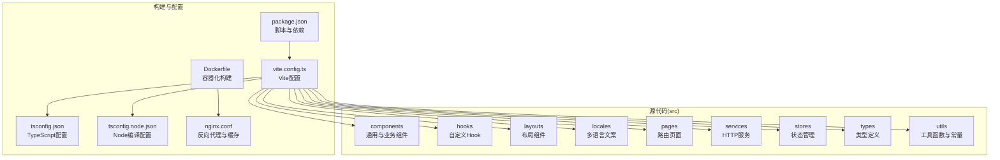
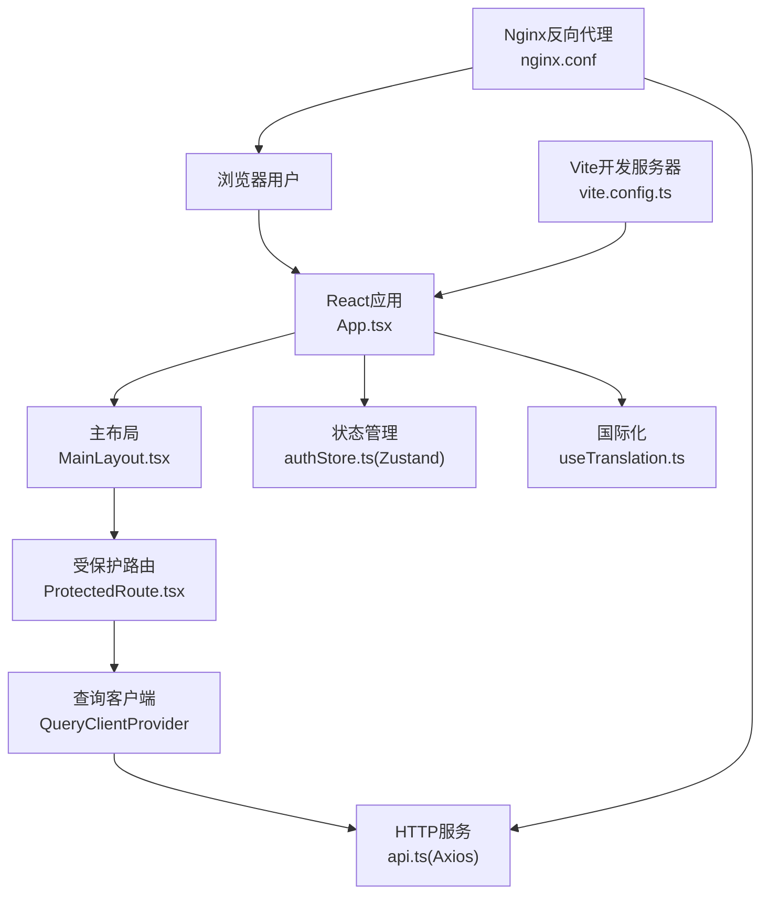
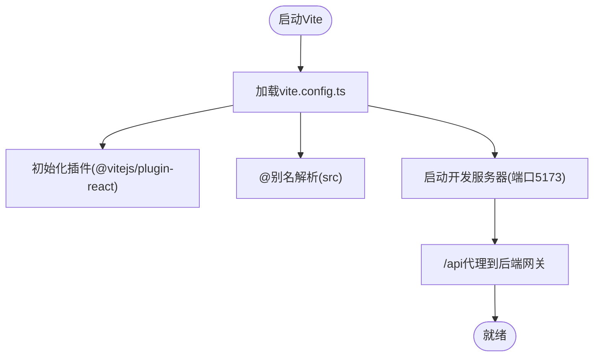
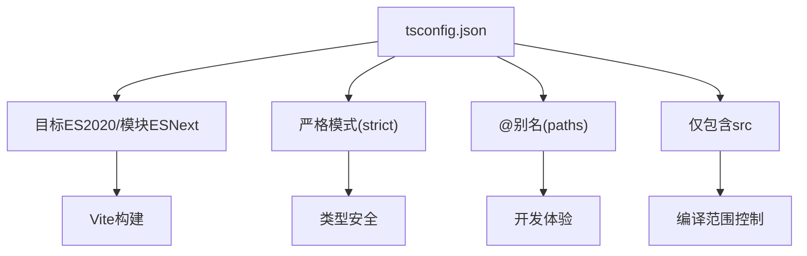
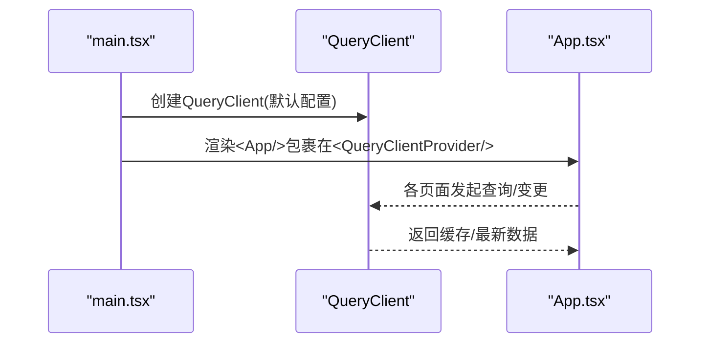
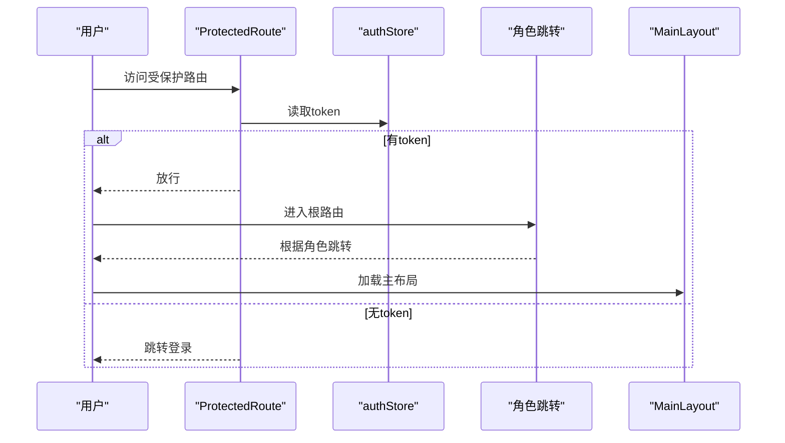
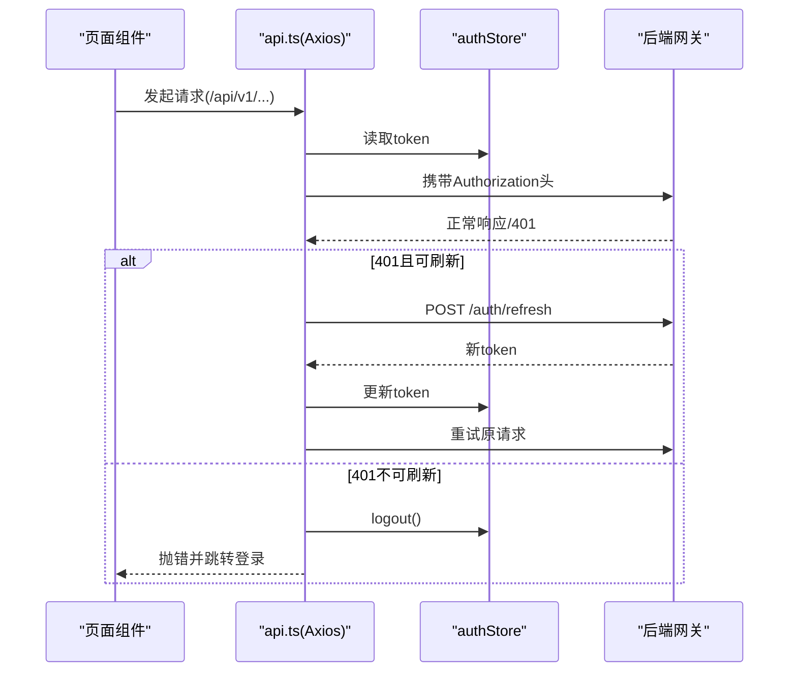
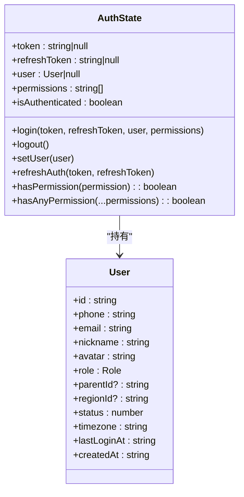
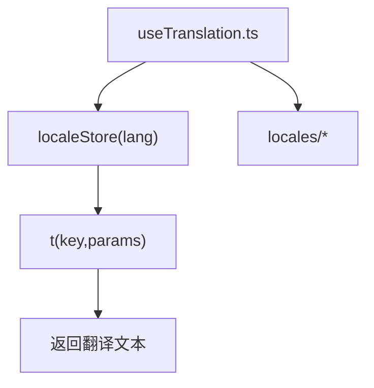
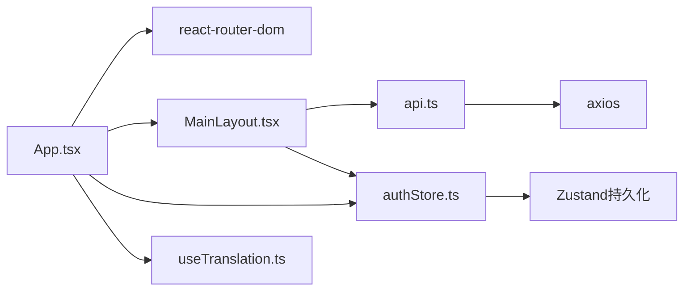

# 前端架构设计

<cite>
**本文档引用的文件**
- [package.json](file://inv-admin-frontend/package.json)
- [vite.config.ts](file://inv-admin-frontend/vite.config.ts)
- [tsconfig.json](file://inv-admin-frontend/tsconfig.json)
- [tsconfig.node.json](file://inv-admin-frontend/tsconfig.node.json)
- [main.tsx](file://inv-admin-frontend/src/main.tsx)
- [App.tsx](file://inv-admin-frontend/src/App.tsx)
- [MainLayout.tsx](file://inv-admin-frontend/src/layouts/MainLayout.tsx)
- [ProtectedRoute.tsx](file://inv-admin-frontend/src/components/ProtectedRoute.tsx)
- [api.ts](file://inv-admin-frontend/src/services/api.ts)
- [authStore.ts](file://inv-admin-frontend/src/store/authStore.ts)
- [useTranslation.ts](file://inv-admin-frontend/src/hooks/useTranslation.ts)
- [index.ts](file://inv-admin-frontend/src/types/index.ts)
- [constants.ts](file://inv-admin-frontend/src/utils/constants.ts)
- [format.ts](file://inv-admin-frontend/src/utils/format.ts)
- [Dockerfile](file://inv-admin-frontend/Dockerfile)
- [nginx.conf](file://inv-admin-frontend/nginx.conf)
</cite>

## 目录
1. [引言](#引言)
2. [项目结构](#项目结构)
3. [核心组件](#核心组件)
4. [架构总览](#架构总览)
5. [详细组件分析](#详细组件分析)
6. [依赖关系分析](#依赖关系分析)
7. [性能考虑](#性能考虑)
8. [故障排查指南](#故障排查指南)
9. [结论](#结论)
10. [附录](#附录)

## 引言
本文件面向管理后台前端团队，系统性阐述基于 React 18 + TypeScript 的现代前端架构设计，重点覆盖 Vite 构建工具配置与优化、开发/生产环境差异、目录结构与模块化组织、TypeScript 最佳实践、状态管理与权限控制、国际化与本地化、以及构建与部署流水线。目标是帮助新成员快速理解系统设计思想，并在后续迭代中保持一致性与可维护性。

## 项目结构
管理后台前端位于 inv-admin-frontend 目录，采用按功能域分层的模块化组织方式：
- src/components：通用 UI 组件与业务组件（如动态表单渲染、状态徽章等）
- src/hooks：自定义 Hook（如国际化、字段元数据）
- src/layouts：布局组件（主布局、侧边栏、头部等）
- src/locales：多语言文案（按页面域划分）
- src/pages：路由页面（按业务模块划分）
- src/services：HTTP 服务封装与拦截器
- src/stores：状态管理（Zustand + 持久化）
- src/types：全局类型定义
- src/utils：工具函数与常量
- 配置文件：package.json、vite.config.ts、tsconfig.json、Dockerfile、nginx.conf

图表来源
- [package.json:1-38](file://inv-admin-frontend/package.json#L1-L38)
- [vite.config.ts:1-22](file://inv-admin-frontend/vite.config.ts#L1-L22)
- [tsconfig.json:1-26](file://inv-admin-frontend/tsconfig.json#L1-L26)
- [tsconfig.node.json](file://inv-admin-frontend/tsconfig.node.json)
- [Dockerfile:1-26](file://inv-admin-frontend/Dockerfile#L1-L26)
- [nginx.conf:1-40](file://inv-admin-frontend/nginx.conf#L1-L40)

章节来源
- [package.json:1-38](file://inv-admin-frontend/package.json#L1-L38)
- [vite.config.ts:1-22](file://inv-admin-frontend/vite.config.ts#L1-L22)
- [tsconfig.json:1-26](file://inv-admin-frontend/tsconfig.json#L1-L26)

## 核心组件
- 应用入口与查询客户端：在应用根部注入 QueryClientProvider，统一配置查询行为（重试次数、过期时间、窗口焦点重取等），确保页面级数据请求的一致性与性能。
- 路由与权限：BrowserRouter + Routes 定义完整路由树；ProtectedRoute 实现登录态校验与权限拦截；MainLayout 提供菜单、头部、侧边栏与用户操作面板。
- 状态管理：Zustand + persist 实现认证状态、权限与用户信息持久化，支持权限判断与角色跳转。
- 国际化：useTranslation Hook 结合 locales 目录实现按语言切换与占位符替换。
- HTTP 服务：Axios 封装，统一 baseURL、超时、凭证携带；请求/响应拦截器处理鉴权与刷新逻辑。
- 类型系统：集中于 types/index.ts，涵盖用户、设备、固件、告警、工单等核心实体与通用响应结构。

章节来源
- [main.tsx:1-27](file://inv-admin-frontend/src/main.tsx#L1-L27)
- [App.tsx:1-158](file://inv-admin-frontend/src/App.tsx#L1-L158)
- [ProtectedRoute.tsx:1-48](file://inv-admin-frontend/src/components/ProtectedRoute.tsx#L1-L48)
- [MainLayout.tsx:1-387](file://inv-admin-frontend/src/layouts/MainLayout.tsx#L1-L387)
- [authStore.ts:1-68](file://inv-admin-frontend/src/stores/authStore.ts#L1-L68)
- [useTranslation.ts:1-19](file://inv-admin-frontend/src/hooks/useTranslation.ts#L1-L19)
- [api.ts:1-64](file://inv-admin-frontend/src/services/api.ts#L1-L64)
- [index.ts:1-110](file://inv-admin-frontend/src/types/index.ts#L1-L110)

## 架构总览
前端采用“路由驱动 + 组件化 + 状态管理 + 国际化 + 类型约束”的整体架构，结合 Vite 开发体验与 Nginx 生产代理，形成从开发到部署的闭环。

图表来源
- [App.tsx:1-158](file://inv-admin-frontend/src/App.tsx#L1-L158)
- [MainLayout.tsx:1-387](file://inv-admin-frontend/src/layouts/MainLayout.tsx#L1-L387)
- [ProtectedRoute.tsx:1-48](file://inv-admin-frontend/src/components/ProtectedRoute.tsx#L1-L48)
- [main.tsx:1-27](file://inv-admin-frontend/src/main.tsx#L1-L27)
- [api.ts:1-64](file://inv-admin-frontend/src/services/api.ts#L1-L64)
- [authStore.ts:1-68](file://inv-admin-frontend/src/stores/authStore.ts#L1-L68)
- [useTranslation.ts:1-19](file://inv-admin-frontend/src/hooks/useTranslation.ts#L1-L19)
- [vite.config.ts:1-22](file://inv-admin-frontend/vite.config.ts#L1-L22)
- [nginx.conf:1-40](file://inv-admin-frontend/nginx.conf#L1-L40)

## 详细组件分析

### Vite 构建与开发服务器配置
- 插件与解析：启用 @vitejs/plugin-react，配置路径别名 @ 指向 src，提升导入便捷性。
- 开发服务器：默认端口 5173，配置 /api 前缀代理至后端网关地址，便于前后端联调。
- 环境变量：当前未见显式环境变量文件，建议在开发阶段通过 .env 文件区分 API 地址与功能开关。

图表来源
- [vite.config.ts:1-22](file://inv-admin-frontend/vite.config.ts#L1-L22)

章节来源
- [vite.config.ts:1-22](file://inv-admin-frontend/vite.config.ts#L1-L22)

### TypeScript 配置最佳实践
- 编译目标与模块：ES2020 目标、ESNext 模块、bundler 模式，配合 Vite 使用。
- 严格模式：开启 strict、noUnusedLocals/noUnusedParameters、noFallthroughCasesInSwitch 等，提升类型安全。
- 路径映射：baseUrl 与 paths 配合 @ 别名，统一相对路径。
- 仅包含 src：避免将测试或示例文件纳入编译范围。

图表来源
- [tsconfig.json:1-26](file://inv-admin-frontend/tsconfig.json#L1-L26)

章节来源
- [tsconfig.json:1-26](file://inv-admin-frontend/tsconfig.json#L1-L26)

### 应用入口与查询客户端
- QueryClient 默认配置：关闭窗口焦点重取、设定查询重试与过期时间、禁用变更重试，平衡用户体验与网络开销。
- 根节点挂载：StrictMode 包裹，确保严格模式下的潜在问题暴露。

图表来源
- [main.tsx:1-27](file://inv-admin-frontend/src/main.tsx#L1-L27)
- [App.tsx:1-158](file://inv-admin-frontend/src/App.tsx#L1-L158)

章节来源
- [main.tsx:1-27](file://inv-admin-frontend/src/main.tsx#L1-L27)

### 路由、权限与角色跳转
- 路由树：登录页、无权限页、大屏、仪表盘、设备、告警、用户、系统配置、工单、并行管理、门户、监控、远程设置、批量设置、运维日志等。
- 权限控制：ProtectedRoute 在有 Token 时放行，否则跳转登录；MainLayout 根据角色过滤菜单项并提供角色跳转。
- 角色跳转：根据用户角色自动跳转到对应首页（安装商 -> 设备页，终端用户 -> 门户页，其他 -> 仪表盘）。

图表来源
- [App.tsx:35-44](file://inv-admin-frontend/src/App.tsx#L35-L44)
- [ProtectedRoute.tsx:1-48](file://inv-admin-frontend/src/components/ProtectedRoute.tsx#L1-L48)
- [authStore.ts:1-68](file://inv-admin-frontend/src/stores/authStore.ts#L1-L68)
- [MainLayout.tsx:1-387](file://inv-admin-frontend/src/layouts/MainLayout.tsx#L1-L387)

章节来源
- [App.tsx:1-158](file://inv-admin-frontend/src/App.tsx#L1-L158)
- [ProtectedRoute.tsx:1-48](file://inv-admin-frontend/src/components/ProtectedRoute.tsx#L1-L48)
- [authStore.ts:1-68](file://inv-admin-frontend/src/stores/authStore.ts#L1-L68)

### HTTP 服务与鉴权拦截
- 基础配置：baseURL 指向 /api/v1，超时 15 秒，withCredentials 用于跨域携带 Cookie。
- 请求拦截：自动附加 Bearer Token。
- 响应拦截：401 且非刷新请求时尝试使用 refresh_token 刷新令牌；刷新失败则登出并跳转登录页。

图表来源
- [api.ts:1-64](file://inv-admin-frontend/src/services/api.ts#L1-L64)
- [authStore.ts:1-68](file://inv-admin-frontend/src/stores/authStore.ts#L1-L68)

章节来源
- [api.ts:1-64](file://inv-admin-frontend/src/services/api.ts#L1-L64)
- [authStore.ts:1-68](file://inv-admin-frontend/src/stores/authStore.ts#L1-L68)

### 状态管理与权限模型
- Zustand Store：包含 token、refreshToken、user、permissions、isAuthenticated 等字段，提供 login/logout/setUser/refreshAuth/hasPermission/hasAnyPermission 方法。
- 持久化：使用 persist 中间件，仅持久化必要字段，减少存储体积。
- 权限判定：超级管理员与代理商拥有最高权限；普通用户按 permissions 数组进行细粒度校验。

图表来源
- [authStore.ts:1-68](file://inv-admin-frontend/src/stores/authStore.ts#L1-L68)
- [index.ts:8-21](file://inv-admin-frontend/src/types/index.ts#L8-L21)

章节来源
- [authStore.ts:1-68](file://inv-admin-frontend/src/stores/authStore.ts#L1-L68)
- [index.ts:1-110](file://inv-admin-frontend/src/types/index.ts#L1-L110)

### 国际化与本地化
- useTranslation Hook：根据当前语言返回对应文案，支持占位符替换。
- 多语言目录：locales 下按页面域划分语言包，便于维护与扩展。

图表来源
- [useTranslation.ts:1-19](file://inv-admin-frontend/src/hooks/useTranslation.ts#L1-L19)

章节来源
- [useTranslation.ts:1-19](file://inv-admin-frontend/src/hooks/useTranslation.ts#L1-L19)

### 工具函数与常量
- constants.ts：角色映射、设备状态、告警级别、任务状态、颜色与图表配色等常量，统一业务语义。
- format.ts：安全数字转换与格式化工具，保证 UI 展示稳定性。

章节来源
- [constants.ts:1-128](file://inv-admin-frontend/src/utils/constants.ts#L1-L128)
- [format.ts:1-13](file://inv-admin-frontend/src/utils/format.ts#L1-L13)

## 依赖关系分析
- 组件耦合：App.tsx 作为顶层容器，依赖路由、布局、权限与国际化；MainLayout 依赖权限与服务；ProtectedRoute 依赖 authStore。
- 外部依赖：React 18、Ant Design、@tanstack/react-query、axios、zustand、socket.io-client 等。
- 构建链路：Vite -> React 组件 -> Axios 请求 -> 后端网关；Docker/Nginx 提供生产部署与反向代理。

图表来源
- [App.tsx:1-158](file://inv-admin-frontend/src/App.tsx#L1-L158)
- [MainLayout.tsx:1-387](file://inv-admin-frontend/src/layouts/MainLayout.tsx#L1-L387)
- [ProtectedRoute.tsx:1-48](file://inv-admin-frontend/src/components/ProtectedRoute.tsx#L1-L48)
- [api.ts:1-64](file://inv-admin-frontend/src/services/api.ts#L1-L64)
- [authStore.ts:1-68](file://inv-admin-frontend/src/stores/authStore.ts#L1-L68)
- [useTranslation.ts:1-19](file://inv-admin-frontend/src/hooks/useTranslation.ts#L1-L19)

章节来源
- [package.json:12-36](file://inv-admin-frontend/package.json#L12-L36)

## 性能考虑
- 查询缓存：QueryClient 默认过期时间与重试策略平衡了实时性与网络压力。
- 代码分割：建议按路由拆分页面组件，利用 React.lazy 与 Suspense 实现懒加载。
- 图片与静态资源：生产环境通过 Nginx 设置长缓存与 immutable 标记，提升二次访问速度。
- 代理与跨域：开发环境使用 Vite 代理，生产环境由 Nginx 统一转发，避免 CORS 复杂配置。
- 打包优化：Vite 默认 Rollup 打包，建议开启压缩与 Tree Shaking；对第三方库按需引入以减小体积。

## 故障排查指南
- 登录后白屏或无限跳转登录
  - 检查 ProtectedRoute 是否正确订阅 token 变化，确认初始 ready 状态与超时逻辑。
  - 确认 authStore 是否成功持久化 token 与用户信息。
- 401 未自动刷新
  - 检查响应拦截器是否正确识别 401 并触发刷新流程；确认 refresh_token 存储与传递。
  - 确保 /auth/refresh 接口可用且返回新的 access_token。
- 菜单权限不生效
  - 检查 hasPermission/hasAnyPermission 的权限数组来源与角色判定逻辑。
  - 确认后端返回的权限列表与前端常量一致。
- 国际化文案缺失
  - 检查 locales 对应键是否存在，确认 useTranslation 的语言切换逻辑。
- 开发代理无效
  - 检查 vite.config.ts 中 /api 代理配置与后端网关地址是否一致。
- 生产静态资源 404
  - 检查 Nginx try_files 与 root 配置；确认构建产物 dist 已正确复制到镜像。

章节来源
- [ProtectedRoute.tsx:1-48](file://inv-admin-frontend/src/components/ProtectedRoute.tsx#L1-L48)
- [authStore.ts:1-68](file://inv-admin-frontend/src/stores/authStore.ts#L1-L68)
- [api.ts:1-64](file://inv-admin-frontend/src/services/api.ts#L1-L64)
- [MainLayout.tsx:1-387](file://inv-admin-frontend/src/layouts/MainLayout.tsx#L1-L387)
- [useTranslation.ts:1-19](file://inv-admin-frontend/src/hooks/useTranslation.ts#L1-L19)
- [vite.config.ts:1-22](file://inv-admin-frontend/vite.config.ts#L1-L22)
- [nginx.conf:1-40](file://inv-admin-frontend/nginx.conf#L1-L40)

## 结论
该前端架构以 React 18 与 TypeScript 为基础，结合 Vite 的高效开发体验与 Ant Design 的成熟生态，形成了清晰的模块化结构与完善的权限、国际化、状态管理与 HTTP 服务体系。通过合理的构建与部署配置，能够稳定支撑管理后台的日常运营与持续迭代。

## 附录

### 开发与生产环境差异化配置建议
- 开发环境(.env.development)
  - API_BASE_URL: http://localhost:8080/api/v1
  - VITE_API_PREFIX: /api
  - NODE_ENV: development
- 生产环境(.env.production)
  - API_BASE_URL: https://your-domain.com/api/v1
  - VITE_API_PREFIX: /api
  - NODE_ENV: production
- 在代码中通过 import.meta.env.VITE_API_PREFIX 与 import.meta.env.VITE_API_BASE_URL 动态拼接最终请求地址，确保开发与生产一致。

### 构建与部署流程
- 本地构建
  - npm run build：生成 dist 目录
  - npm run preview：本地预览构建结果
- 容器化部署
  - Dockerfile 使用多阶段构建：Node 构建 -> Alpine + Nginx 提供静态服务
  - nginx.conf 配置 /api 代理到后端网关，/ws 升级为 WebSocket
- 部署要点
  - 确保 dist 内容被复制到 Nginx root
  - 设置静态资源缓存与安全头
  - 通过反向代理实现 TLS 终止与健康检查

章节来源
- [Dockerfile:1-26](file://inv-admin-frontend/Dockerfile#L1-L26)
- [nginx.conf:1-40](file://inv-admin-frontend/nginx.conf#L1-L40)
- [package.json:6-11](file://inv-admin-frontend/package.json#L6-L11)