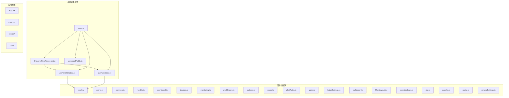
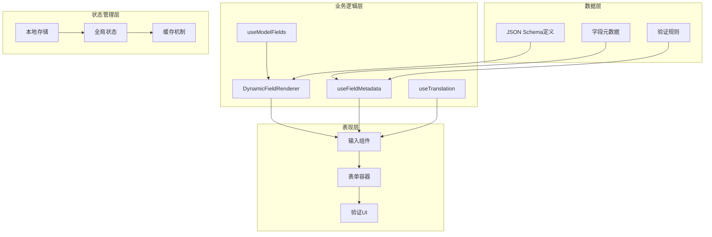
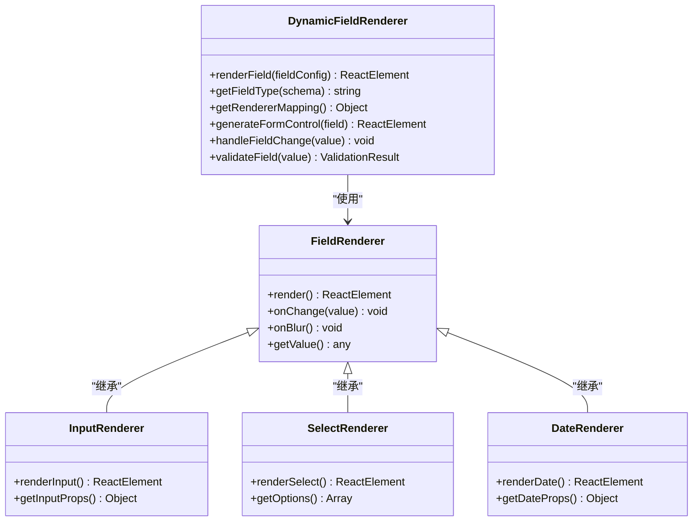
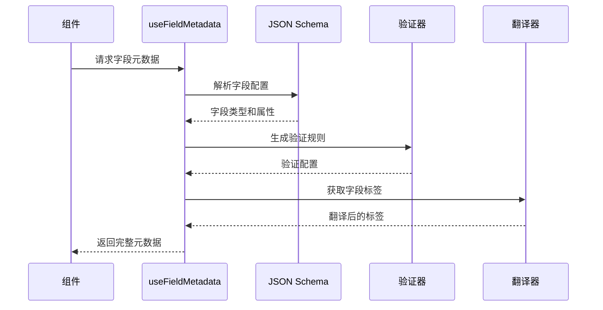
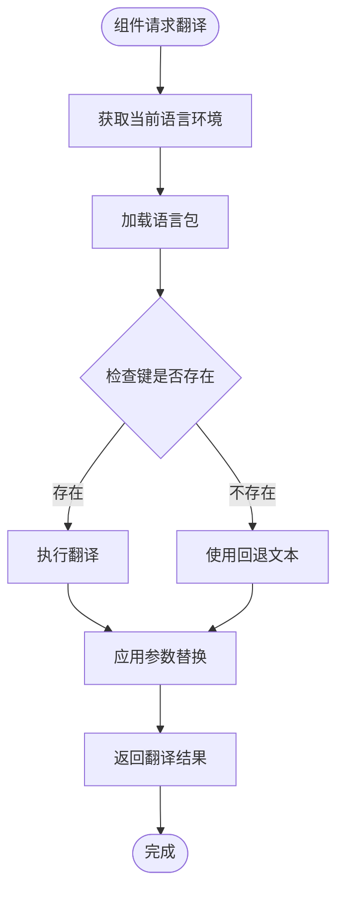
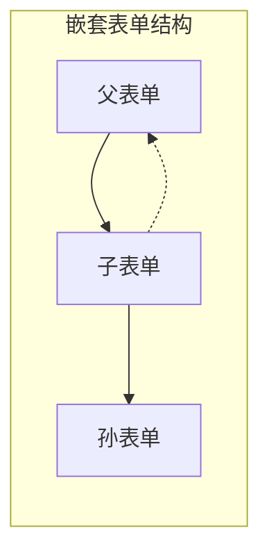
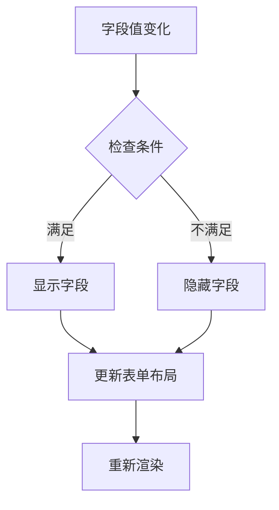
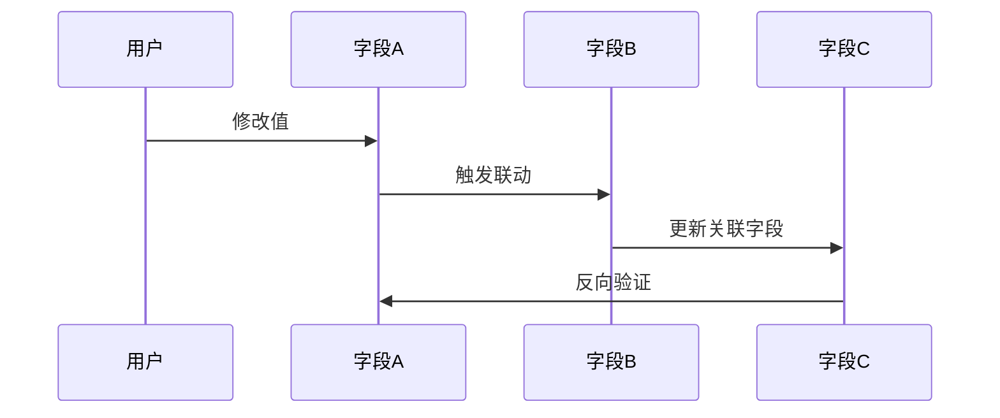
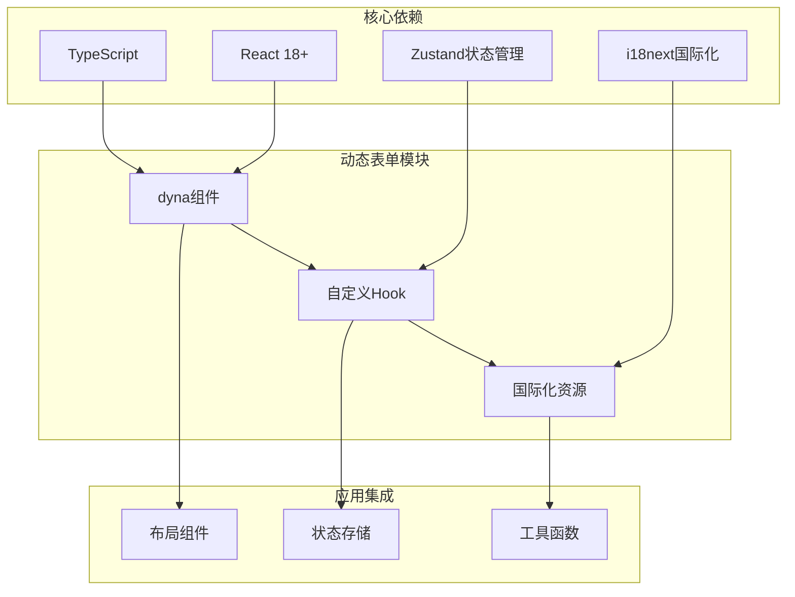

# 动态表单系统

<cite>
**本文档引用的文件**
- [DynamicFieldRenderer.tsx](file://inv-admin-frontend/src/components/dyna/DynamicFieldRenderer.tsx)
- [useFieldMetadata.ts](file://inv-admin-frontend/src/hooks/useFieldMetadata.ts)
- [useTranslation.ts](file://inv-admin-frontend/src/hooks/useTranslation.ts)
- [useModelFields.ts](file://inv-admin-frontend/src/components/dyna/useModelFields.ts)
- [index.ts](file://inv-admin-frontend/src/components/dyna/index.ts)
- [admin.ts](file://inv-admin-frontend/src/locales/admin.ts)
- [common.ts](file://inv-admin-frontend/src/locales/common.ts)
- [models.ts](file://inv-admin-frontend/src/locales/models.ts)
- [dashboard.ts](file://inv-admin-frontend/src/locales/dashboard.ts)
- [devices.ts](file://inv-admin-frontend/src/locales/devices.ts)
- [monitoring.ts](file://inv-admin-frontend/src/locales/monitoring.ts)
- [workOrders.ts](file://inv-admin-frontend/src/locales/workOrders.ts)
- [stations.ts](file://inv-admin-frontend/src/locales/stations.ts)
- [users.ts](file://inv-admin-frontend/src/locales/users.ts)
- [alertRules.ts](file://inv-admin-frontend/src/locales/alertRules.ts)
- [alerts.ts](file://inv-admin-frontend/src/locales/alerts.ts)
- [batchSettings.ts](file://inv-admin-frontend/src/locales/batchSettings.ts)
- [bigScreen.ts](file://inv-admin-frontend/src/locales/bigScreen.ts)
- [layout.ts](file://inv-admin-frontend/src/locales/layout.ts)
- [operationLogs.ts](file://inv-admin-frontend/src/locales/operationLogs.ts)
- [ota.ts](file://inv-admin-frontend/src/locales/ota.ts)
- [parallel.ts](file://inv-admin-frontend/src/locales/parallel.ts)
- [portal.ts](file://inv-admin-frontend/src/locales/portal.ts)
- [remoteSettings.ts](file://inv-admin-frontend/src/locales/remoteSettings.ts)
- [index.ts](file://inv-admin-frontend/src/locales/index.ts)
- [MainLayout.tsx](file://inv-admin-frontend/src/layouts/MainLayout.tsx)
- [App.tsx](file://inv-admin-frontend/src/App.tsx)
- [main.tsx](file://inv-admin-frontend/src/main.tsx)
- [localeStore.ts](file://inv-admin-frontend/src/stores/localeStore.ts)
- [timezoneStore.ts](file://inv-admin-frontend/src/stores/timezoneStore.ts)
- [authStore.ts](file://inv-admin-frontend/src/stores/authStore.ts)
- [constants.ts](file://inv-admin-frontend/src/utils/constants.ts)
- [format.ts](file://inv-admin-frontend/src/utils/format.ts)
- [queryKeys.ts](file://inv-admin-frontend/src/utils/queryKeys.ts)
- [timezone.ts](file://inv-admin-frontend/src/utils/timezone.ts)
- [ProtectedRoute.tsx](file://inv-admin-frontend/src/components/ProtectedRoute.tsx)
- [ErrorBoundary.tsx](file://inv-admin-frontend/src/components/ErrorBoundary.tsx)
- [StatusBadge.tsx](file://inv-admin-frontend/src/components/StatusBadge.tsx)
- [DynamicTable.tsx](file://inv-admin-frontend/src/components/DynamicTable.tsx)
</cite>

## 目录
1. [简介](#简介)
2. [项目结构](#项目结构)
3. [核心组件](#核心组件)
4. [架构概览](#架构概览)
5. [详细组件分析](#详细组件分析)
6. [依赖关系分析](#依赖关系分析)
7. [性能考虑](#性能考虑)
8. [故障排除指南](#故障排除指南)
9. [结论](#结论)
10. [附录](#附录)

## 简介
本项目是一个基于React和TypeScript的动态表单系统，采用JSON Schema驱动的表单渲染机制。系统通过DynamicFieldRenderer组件实现字段类型的自动识别和渲染，结合useFieldMetadata和useTranslation自定义Hook提供强大的表单元数据管理和国际化支持。

## 项目结构
动态表单系统主要位于`inv-admin-frontend/src/components/dyna/`目录下，包含核心渲染组件和相关工具函数：

**图表来源**
- [DynamicFieldRenderer.tsx:1-200](file://inv-admin-frontend/src/components/dyna/DynamicFieldRenderer.tsx#L1-L200)
- [useFieldMetadata.ts:1-150](file://inv-admin-frontend/src/hooks/useFieldMetadata.ts#L1-L150)
- [useTranslation.ts:1-120](file://inv-admin-frontend/src/hooks/useTranslation.ts#L1-L120)

**章节来源**
- [DynamicFieldRenderer.tsx:1-200](file://inv-admin-frontend/src/components/dyna/DynamicFieldRenderer.tsx#L1-L200)
- [useFieldMetadata.ts:1-150](file://inv-admin-frontend/src/hooks/useFieldMetadata.ts#L1-L150)
- [useTranslation.ts:1-120](file://inv-admin-frontend/src/hooks/useTranslation.ts#L1-L120)

## 核心组件
动态表单系统的核心由三个主要组件构成：

### DynamicFieldRenderer组件
DynamicFieldRenderer是整个表单系统的心脏，负责将JSON Schema描述的字段转换为实际的React组件。该组件实现了智能的字段类型识别和渲染器映射功能。

### useFieldMetadata Hook
useFieldMetadata Hook提供完整的字段元数据管理能力，包括字段类型识别、验证规则定义和默认值处理。该Hook与JSON Schema深度集成，能够动态解析字段属性并生成相应的UI配置。

### useTranslation Hook
useTranslation Hook实现了国际化支持，能够根据当前语言环境动态翻译字段标签和验证消息。该Hook与i18n系统无缝集成，支持多语言切换和动态文本更新。

**章节来源**
- [DynamicFieldRenderer.tsx:1-200](file://inv-admin-frontend/src/components/dyna/DynamicFieldRenderer.tsx#L1-L200)
- [useFieldMetadata.ts:1-150](file://inv-admin-frontend/src/hooks/useFieldMetadata.ts#L1-L150)
- [useTranslation.ts:1-120](file://inv-admin-frontend/src/hooks/useTranslation.ts#L1-L120)

## 架构概览
系统采用分层架构设计，从底层的数据模型到顶层的用户界面形成清晰的层次结构：

**图表来源**
- [DynamicFieldRenderer.tsx:1-200](file://inv-admin-frontend/src/components/dyna/DynamicFieldRenderer.tsx#L1-L200)
- [useFieldMetadata.ts:1-150](file://inv-admin-frontend/src/hooks/useFieldMetadata.ts#L1-L150)
- [useTranslation.ts:1-120](file://inv-admin-frontend/src/hooks/useTranslation.ts#L1-L120)

## 详细组件分析

### DynamicFieldRenderer组件分析

DynamicFieldRenderer组件实现了复杂的字段渲染逻辑，支持多种数据类型和渲染策略：

**图表来源**
- [DynamicFieldRenderer.tsx:1-200](file://inv-admin-frontend/src/components/dyna/DynamicFieldRenderer.tsx#L1-L200)

组件的关键特性包括：

1. **智能字段类型识别**：根据JSON Schema的type属性自动选择合适的渲染器
2. **渲染器映射机制**：维护字段类型到渲染器的映射表，支持扩展和定制
3. **动态表单控件生成**：根据字段配置动态生成相应的React组件
4. **事件处理机制**：统一处理字段变更和验证事件

**章节来源**
- [DynamicFieldRenderer.tsx:1-200](file://inv-admin-frontend/src/components/dyna/DynamicFieldRenderer.tsx#L1-L200)

### useFieldMetadata Hook实现分析

useFieldMetadata Hook提供了完整的字段元数据管理功能：

**图表来源**
- [useFieldMetadata.ts:1-150](file://inv-admin-frontend/src/hooks/useFieldMetadata.ts#L1-L150)

Hook的主要功能：

1. **字段元数据获取**：从JSON Schema中提取字段的基本信息和行为配置
2. **验证规则定义**：根据字段属性生成相应的验证规则和错误消息
3. **默认值处理**：处理字段的默认值设置和初始化逻辑
4. **动态配置更新**：支持运行时字段配置的动态更新

**章节来源**
- [useFieldMetadata.ts:1-150](file://inv-admin-frontend/src/hooks/useFieldMetadata.ts#L1-L150)

### useTranslation国际化Hook分析

useTranslation Hook实现了强大的国际化支持：

**图表来源**
- [useTranslation.ts:1-120](file://inv-admin-frontend/src/hooks/useTranslation.ts#L1-L120)

国际化功能特点：

1. **多语言支持**：支持多种语言环境的动态切换
2. **字段标签翻译**：自动翻译字段的显示名称和帮助文本
3. **验证消息本地化**：提供验证错误消息的多语言支持
4. **参数化翻译**：支持带参数的动态文本生成

**章节来源**
- [useTranslation.ts:1-120](file://inv-admin-frontend/src/hooks/useTranslation.ts#L1-L120)

### 复杂表单场景实现

系统支持多种复杂的表单场景：

#### 嵌套表单实现

#### 条件显示机制

#### 联动字段处理

**章节来源**
- [DynamicFieldRenderer.tsx:1-200](file://inv-admin-frontend/src/components/dyna/DynamicFieldRenderer.tsx#L1-L200)
- [useFieldMetadata.ts:1-150](file://inv-admin-frontend/src/hooks/useFieldMetadata.ts#L1-L150)

## 依赖关系分析

系统各组件之间的依赖关系如下：

**图表来源**
- [DynamicFieldRenderer.tsx:1-200](file://inv-admin-frontend/src/components/dyna/DynamicFieldRenderer.tsx#L1-L200)
- [useFieldMetadata.ts:1-150](file://inv-admin-frontend/src/hooks/useFieldMetadata.ts#L1-L150)
- [useTranslation.ts:1-120](file://inv-admin-frontend/src/hooks/useTranslation.ts#L1-L120)

**章节来源**
- [index.ts:1-50](file://inv-admin-frontend/src/components/dyna/index.ts#L1-L50)
- [localeStore.ts:1-80](file://inv-admin-frontend/src/stores/localeStore.ts#L1-L80)

## 性能考虑

系统在设计时充分考虑了性能优化：

### 渲染性能优化
1. **虚拟化渲染**：对于大型表单，实现列表项的虚拟化渲染
2. **懒加载组件**：按需加载复杂的表单控件
3. **记忆化优化**：使用useMemo和useCallback避免不必要的重渲染

### 内存管理
1. **组件卸载清理**：确保表单组件卸载时释放所有订阅和定时器
2. **状态压缩**：优化表单状态的存储结构，减少内存占用
3. **垃圾回收友好**：避免循环引用和内存泄漏

### 网络优化
1. **Schema缓存**：缓存已加载的JSON Schema定义
2. **批量请求**：合并多个表单的请求以减少网络开销
3. **增量更新**：只更新发生变化的部分而不是整个表单

## 故障排除指南

### 常见问题及解决方案

#### 表单渲染异常
**问题症状**：表单字段无法正确渲染或显示空白
**可能原因**：
1. JSON Schema格式不正确
2. 缺少必要的字段配置
3. 渲染器映射表缺失

**解决步骤**：
1. 验证JSON Schema的语法正确性
2. 检查字段配置是否包含必需属性
3. 确认对应的渲染器已注册

#### 国际化显示问题
**问题症状**：字段标签或验证消息显示为键名而非翻译文本
**可能原因**：
1. 语言包未正确加载
2. 翻译键名不匹配
3. i18n配置错误

**解决步骤**：
1. 检查语言包文件是否存在且格式正确
2. 验证翻译键名与JSON Schema中的label一致
3. 确认i18n配置和初始化过程

#### 验证功能失效
**问题症状**：表单验证规则不生效或验证消息不显示
**可能原因**：
1. 验证规则配置错误
2. 自定义验证函数异常
3. 状态更新时机问题

**解决步骤**：
1. 检查JSON Schema中的validation属性
2. 验证自定义验证函数的逻辑
3. 确认表单状态的正确更新

**章节来源**
- [ErrorBoundary.tsx:1-100](file://inv-admin-frontend/src/components/ErrorBoundary.tsx#L1-L100)
- [ProtectedRoute.tsx:1-80](file://inv-admin-frontend/src/components/ProtectedRoute.tsx#L1-L80)

## 结论
动态表单系统通过JSON Schema驱动的方式，实现了高度灵活和可扩展的表单渲染机制。系统的核心优势包括：

1. **强类型支持**：基于TypeScript提供完整的类型安全保障
2. **国际化集成**：深度集成i18n系统，支持多语言动态切换
3. **性能优化**：采用多种优化策略确保大表单的流畅体验
4. **扩展性强**：模块化的架构设计便于功能扩展和定制

该系统为复杂的企业级应用提供了可靠的表单解决方案，能够满足各种业务场景下的表单需求。

## 附录

### 支持的字段类型
系统支持以下JSON Schema字段类型：
- 字符串类型（string）
- 数字类型（number, integer）
- 布尔类型（boolean）
- 对象类型（object）
- 数组类型（array）

### 验证规则
内置支持的验证规则包括：
- 必填验证（required）
- 长度限制（minLength, maxLength）
- 数值范围（minimum, maximum）
- 正则表达式（pattern）
- 自定义验证函数

### 国际化语言支持
系统支持的语言包括：
- 中文（简体）
- 英语
- 其他可扩展语言