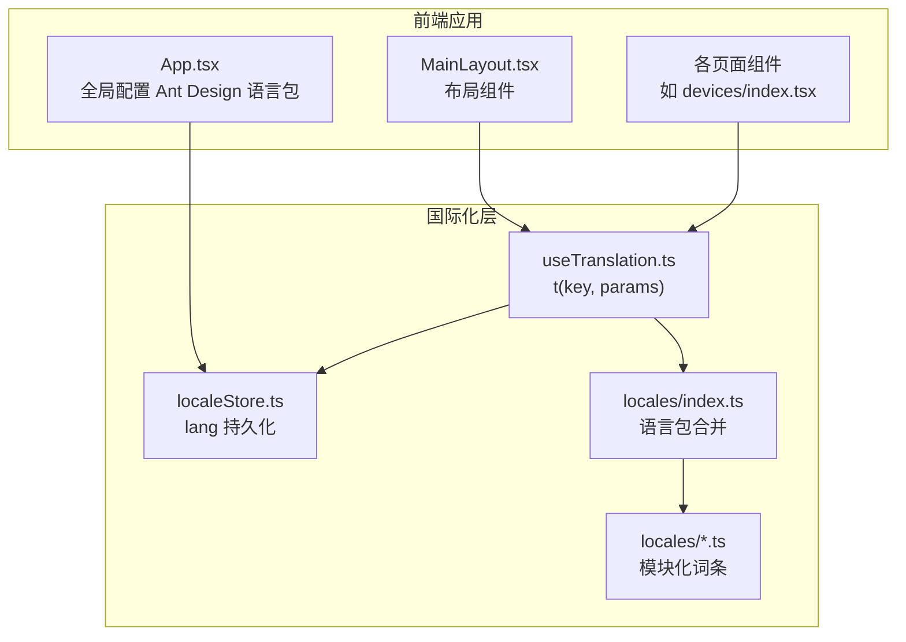
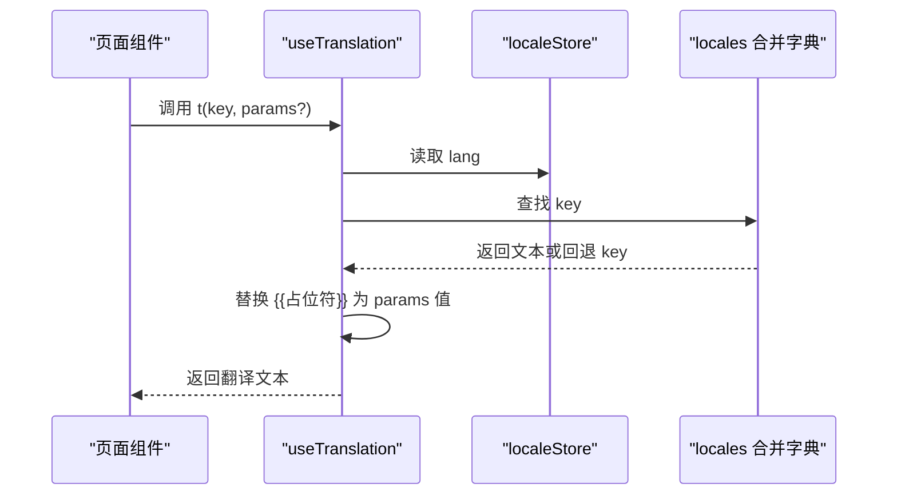
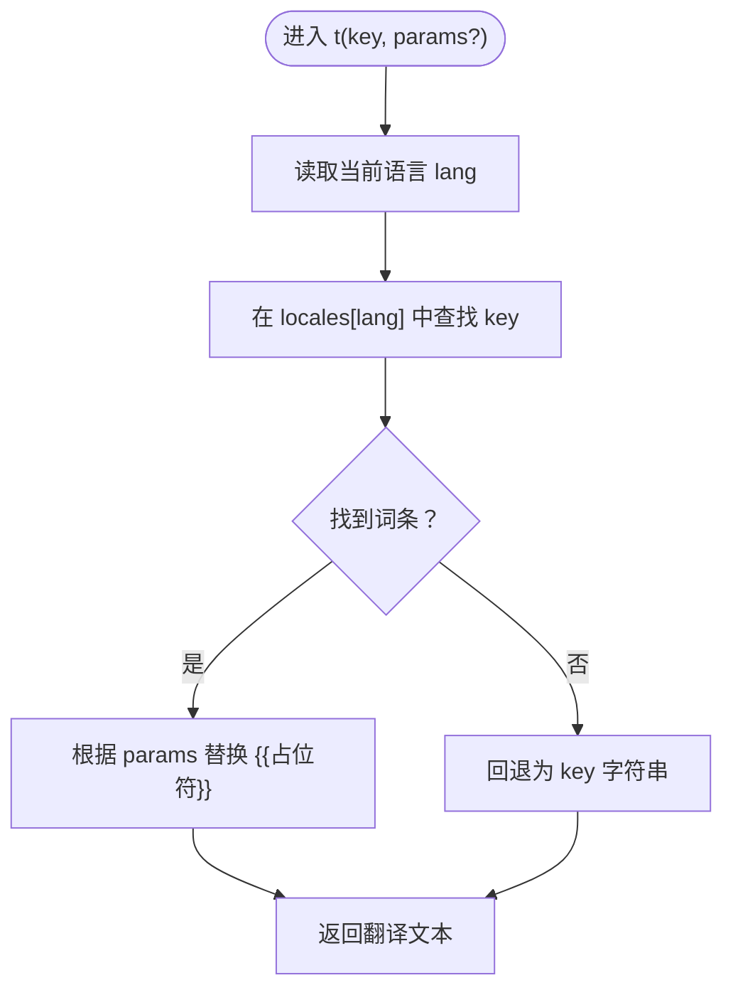
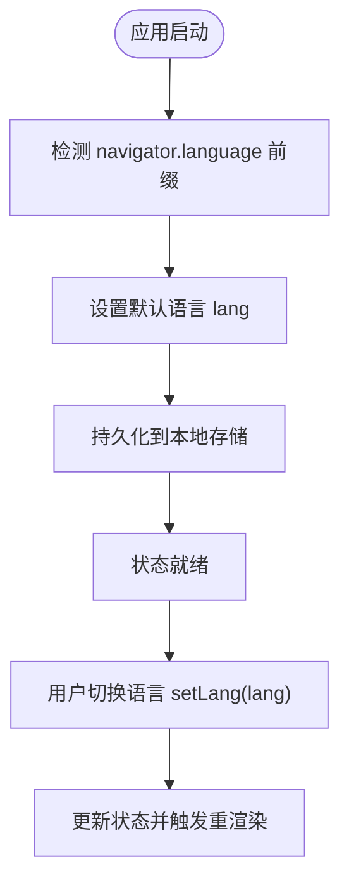
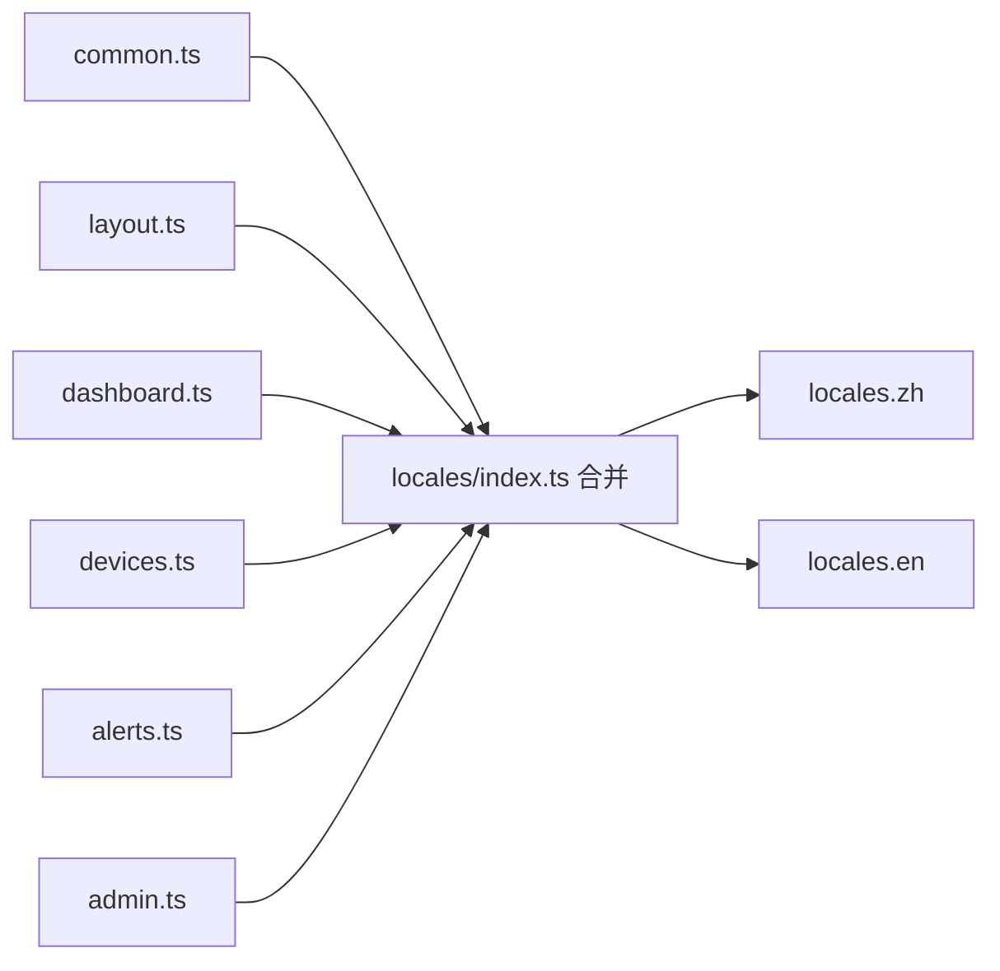
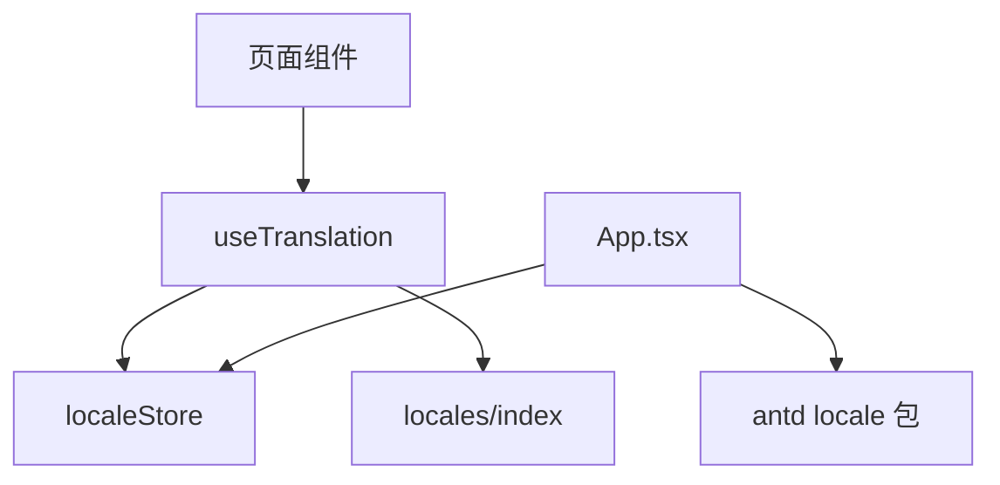

# 国际化系统

<cite>
**本文引用的文件**
- [useTranslation.ts](file://inv-admin-frontend/src/hooks/useTranslation.ts)
- [localeStore.ts](file://inv-admin-frontend/src/stores/localeStore.ts)
- [locales/index.ts](file://inv-admin-frontend/src/locales/index.ts)
- [locales/admin.ts](file://inv-admin-frontend/src/locales/admin.ts)
- [locales/devices.ts](file://inv-admin-frontend/src/locales/devices.ts)
- [locales/alerts.ts](file://inv-admin-frontend/src/locales/alerts.ts)
- [locales/common.ts](file://inv-admin-frontend/src/locales/common.ts)
- [locales/layout.ts](file://inv-admin-frontend/src/locales/layout.ts)
- [locales/dashboard.ts](file://inv-admin-frontend/src/locales/dashboard.ts)
- [App.tsx](file://inv-admin-frontend/src/App.tsx)
- [package.json](file://inv-admin-frontend/package.json)
</cite>

## 目录
1. [简介](#简介)
2. [项目结构](#项目结构)
3. [核心组件](#核心组件)
4. [架构总览](#架构总览)
5. [详细组件分析](#详细组件分析)
6. [依赖关系分析](#依赖关系分析)
7. [性能考量](#性能考量)
8. [故障排查指南](#故障排查指南)
9. [结论](#结论)
10. [附录：新增语言支持步骤](#附录新增语言支持步骤)

## 简介
本文件面向管理后台的国际化系统，系统采用“模块化语言包 + 自定义 Hook + 状态存储”的轻量实现方案，覆盖前端页面文本、菜单、提示语等多场景。语言包以模块划分（如 admin.ts、devices.ts、alerts.ts 等），通过统一入口合并生成 zh/en 两套字典；自定义 Hook 提供词条查找与占位符替换能力；状态层负责语言选择、持久化与回退逻辑；UI 层通过 ConfigProvider 切换 Ant Design 的本地化。

## 项目结构
国际化相关代码主要分布在以下位置：
- hooks：useTranslation 自定义 Hook，提供 t(lang) 查找与参数替换
- stores：localeStore 管理语言状态与持久化
- locales：按功能域拆分的语言包，统一导出合并
- App.tsx：全局配置 Ant Design 语言包与主题

图表来源
- [App.tsx:46-56](file://inv-admin-frontend/src/App.tsx#L46-L56)
- [useTranslation.ts:1-19](file://inv-admin-frontend/src/hooks/useTranslation.ts#L1-L19)
- [localeStore.ts:1-22](file://inv-admin-frontend/src/stores/localeStore.ts#L1-L22)
- [locales/index.ts:1-70](file://inv-admin-frontend/src/locales/index.ts#L1-L70)

章节来源
- [App.tsx:1-158](file://inv-admin-frontend/src/App.tsx#L1-L158)
- [useTranslation.ts:1-19](file://inv-admin-frontend/src/hooks/useTranslation.ts#L1-L19)
- [localeStore.ts:1-22](file://inv-admin-frontend/src/stores/localeStore.ts#L1-L22)
- [locales/index.ts:1-70](file://inv-admin-frontend/src/locales/index.ts#L1-L70)

## 核心组件
- useTranslation Hook
  - 作用：从 localeStore 获取当前语言，基于 locales 合并字典进行词条查找，支持双花括号占位符替换
  - 关键点：若词条不存在，回退为 key 本身；支持传入 params 对象进行字符串替换
- localeStore 状态
  - 作用：维护 lang 字段，初始化为浏览器语言（zh 前缀优先）；提供 setLang 修改语言；通过持久化中间件将语言偏好保存至本地存储
  - 关键点：Lang 类型限定为 'zh' | 'en'；持久化键名固定，避免跨环境冲突
- 语言包合并
  - 作用：将 common、layout、dashboard、devices、alerts 等模块词条按语言合并为 zh/en 两套字典
  - 关键点：使用 merge 函数浅合并，保证同名 key 后写入覆盖；便于按功能域维护与扩展

章节来源
- [useTranslation.ts:4-16](file://inv-admin-frontend/src/hooks/useTranslation.ts#L4-L16)
- [localeStore.ts:4-19](file://inv-admin-frontend/src/stores/localeStore.ts#L4-L19)
- [locales/index.ts:22-67](file://inv-admin-frontend/src/locales/index.ts#L22-L67)

## 架构总览
下面的时序图展示了页面渲染时的国际化调用链：组件通过 useTranslation 获取 t(lang)，t 内部读取 localeStore.lang 并在 locales 中查找对应词条，最终返回翻译文本。

图表来源
- [useTranslation.ts:4-16](file://inv-admin-frontend/src/hooks/useTranslation.ts#L4-L16)
- [localeStore.ts:6-8](file://inv-admin-frontend/src/stores/localeStore.ts#L6-L8)
- [locales/index.ts:24-67](file://inv-admin-frontend/src/locales/index.ts#L24-L67)

## 详细组件分析

### useTranslation Hook 实现机制
- 语言切换
  - 页面通过调用 setLang 更新状态，触发组件重新渲染，从而使用新的语言字典
- 词条查找
  - 以 key 为索引在 locales[lang] 中查找；若不存在则回退为 key 本身
- 动态参数替换
  - 支持双花括号占位符，遍历 params 键值对进行全局替换
- 性能特征
  - 查找为对象属性访问，时间复杂度 O(1)；替换为一次正则扫描，整体开销极低

图表来源
- [useTranslation.ts:6-14](file://inv-admin-frontend/src/hooks/useTranslation.ts#L6-L14)

章节来源
- [useTranslation.ts:1-19](file://inv-admin-frontend/src/hooks/useTranslation.ts#L1-L19)

### localeStore 语言状态管理
- 浏览器语言检测
  - 初始化时依据 navigator.language 是否以 "zh" 开头决定默认语言
- 用户偏好保存
  - 使用持久化中间件将 lang 存入本地存储，刷新后仍保持用户选择
- 语言回退机制
  - 若 locales 中无对应词条，t 将回退为 key；该行为由 useTranslation 控制

图表来源
- [localeStore.ts:11-19](file://inv-admin-frontend/src/stores/localeStore.ts#L11-L19)

章节来源
- [localeStore.ts:1-22](file://inv-admin-frontend/src/stores/localeStore.ts#L1-L22)

### 语言包结构设计与模块化组织
- 模块划分
  - common.ts：通用控件文案与操作提示
  - layout.ts：菜单、头部、弹窗等布局相关词条
  - dashboard.ts：仪表盘相关术语与提示
  - devices.ts：设备管理相关术语与交互文案
  - alerts.ts：告警与通知相关词条
  - admin.ts：系统管理相关词条
  - 其他：如 models.ts、stations.ts、monitoring.ts 等按功能域拆分
- 合并与访问
  - locales/index.ts 将各模块 zh/en 词条浅合并为 locales.zh 与 locales.en
  - useTranslation 通过 locales[lang][key] 访问词条

图表来源
- [locales/index.ts:2-21](file://inv-admin-frontend/src/locales/index.ts#L2-L21)
- [locales/common.ts:1-195](file://inv-admin-frontend/src/locales/common.ts#L1-L195)
- [locales/layout.ts:1-123](file://inv-admin-frontend/src/locales/layout.ts#L1-L123)
- [locales/dashboard.ts:1-187](file://inv-admin-frontend/src/locales/dashboard.ts#L1-L187)
- [locales/devices.ts:1-341](file://inv-admin-frontend/src/locales/devices.ts#L1-L341)
- [locales/alerts.ts:1-101](file://inv-admin-frontend/src/locales/alerts.ts#L1-L101)
- [locales/admin.ts:1-147](file://inv-admin-frontend/src/locales/admin.ts#L1-L147)

章节来源
- [locales/index.ts:1-70](file://inv-admin-frontend/src/locales/index.ts#L1-L70)
- [locales/common.ts:1-195](file://inv-admin-frontend/src/locales/common.ts#L1-L195)
- [locales/layout.ts:1-123](file://inv-admin-frontend/src/locales/layout.ts#L1-L123)
- [locales/dashboard.ts:1-187](file://inv-admin-frontend/src/locales/dashboard.ts#L1-L187)
- [locales/devices.ts:1-341](file://inv-admin-frontend/src/locales/devices.ts#L1-L341)
- [locales/alerts.ts:1-101](file://inv-admin-frontend/src/locales/alerts.ts#L1-L101)
- [locales/admin.ts:1-147](file://inv-admin-frontend/src/locales/admin.ts#L1-L147)

### UI 语言包联动（Ant Design）
- App.tsx 在顶层通过 ConfigProvider 设置 antd 语言包，随 lang 切换而切换
- 该机制确保日期选择器、表格分页等组件文案与页面一致

章节来源
- [App.tsx:46-56](file://inv-admin-frontend/src/App.tsx#L46-L56)

## 依赖关系分析
- 组件耦合
  - 页面组件与 useTranslation 强耦合，但通过 Hook 抽象降低直接依赖
  - useTranslation 依赖 localeStore 与 locales 合并字典
- 外部依赖
  - zustand 提供轻量状态管理与持久化
  - antd 的 locale 包用于 UI 文案本地化

图表来源
- [useTranslation.ts:1-2](file://inv-admin-frontend/src/hooks/useTranslation.ts#L1-L2)
- [localeStore.ts:1-2](file://inv-admin-frontend/src/stores/localeStore.ts#L1-L2)
- [App.tsx:46-56](file://inv-admin-frontend/src/App.tsx#L46-L56)
- [package.json:12-28](file://inv-admin-frontend/package.json#L12-L28)

章节来源
- [package.json:12-28](file://inv-admin-frontend/package.json#L12-L28)

## 性能考量
- 词条查找
  - 采用对象属性访问，O(1) 时间复杂度；建议避免在热路径中频繁创建新对象
- 参数替换
  - 占位符替换为一次正则扫描，params 键值较少时开销可忽略
- 状态持久化
  - zustand/persist 仅存储 lang，体积小且读写快
- UI 本地化
  - Ant Design 语言包切换在顶层 ConfigProvider 完成，影响范围可控

## 故障排查指南
- 词条未翻译或显示 key
  - 检查 locales 对应模块是否包含该 key；若缺失，useTranslation 将回退为 key
  - 确认 key 命名与调用一致，注意大小写与拼写
- 占位符未生效
  - 确认传入 params 的键名与模板中的 {{...}} 一致
  - 检查 params 值是否为字符串或数字，非标量会被转换为字符串
- 语言未切换
  - 确认调用了 setLang 并传入 'zh' 或 'en'
  - 检查本地存储中是否存在持久化数据导致覆盖 setLang 的效果
- UI 文案未随语言变化
  - 确认 App.tsx 的 ConfigProvider 已随 lang 变更重新渲染

章节来源
- [useTranslation.ts:6-14](file://inv-admin-frontend/src/hooks/useTranslation.ts#L6-L14)
- [localeStore.ts:11-19](file://inv-admin-frontend/src/stores/localeStore.ts#L11-L19)
- [App.tsx:46-56](file://inv-admin-frontend/src/App.tsx#L46-L56)

## 结论
该国际化系统以“模块化语言包 + 自定义 Hook + 状态存储”为核心，结构清晰、易于维护与扩展。通过合理的回退策略与占位符机制，满足了多场景文本需求；结合 Ant Design 的语言包切换，实现了 UI 与业务文案的一致性。建议在后续迭代中持续完善语言包覆盖度与测试校验流程，确保多语言质量。

## 附录：新增语言支持步骤
- 创建语言文件
  - 在 locales 目录新增 [语言代码].ts 文件，按现有模块风格编写 zh 与 en 两组词条
  - 示例参考：[locales/common.ts:1-195](file://inv-admin-frontend/src/locales/common.ts#L1-L195)、[locales/layout.ts:1-123](file://inv-admin-frontend/src/locales/layout.ts#L1-L123)
- 注册语言包
  - 在 locales/index.ts 中引入新增模块，并将其 zh/en 加入对应合并数组
  - 示例参考：[locales/index.ts:2-21](file://inv-admin-frontend/src/locales/index.ts#L2-L21)
- 扩展类型与状态
  - 在 stores/localeStore.ts 中扩展 Lang 类型联合值，确保类型安全
  - 示例参考：[localeStore.ts:4](file://inv-admin-frontend/src/stores/localeStore.ts#L4)
- 验证与测试
  - 在页面中调用 useTranslation 的 t 进行关键文案验证
  - 切换语言并检查 UI 与业务文案是否同步更新
  - 检查占位符替换是否正确
- SEO 友好性建议
  - 保持页面结构与路由不变，避免因语言切换造成重复内容
  - 如需多语言 SEO，可在服务端或静态构建阶段生成多语言版本（本项目为前端单页应用，建议结合服务端策略）

章节来源
- [locales/index.ts:2-21](file://inv-admin-frontend/src/locales/index.ts#L2-L21)
- [localeStore.ts:4](file://inv-admin-frontend/src/stores/localeStore.ts#L4)
- [locales/common.ts:1-195](file://inv-admin-frontend/src/locales/common.ts#L1-L195)
- [locales/layout.ts:1-123](file://inv-admin-frontend/src/locales/layout.ts#L1-L123)