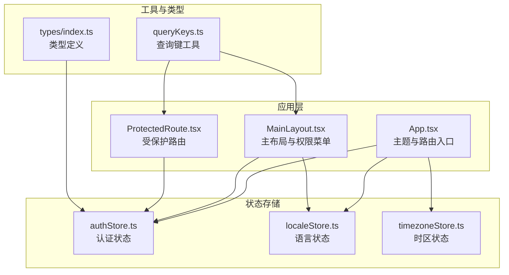
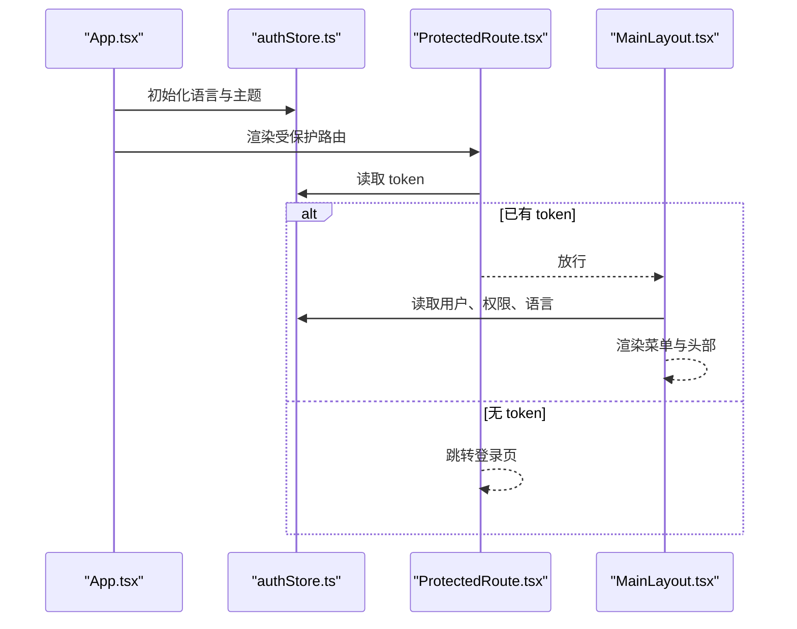
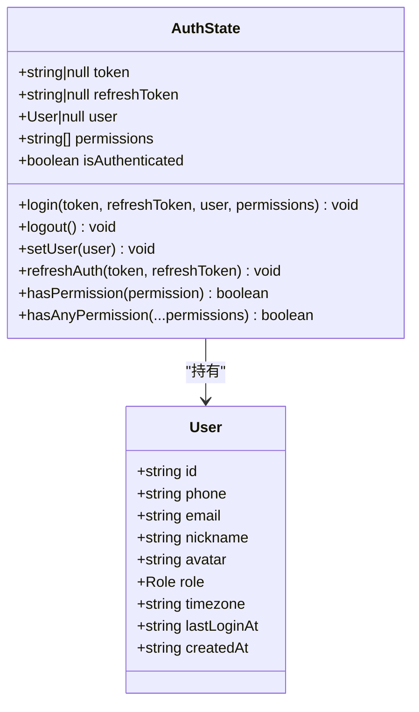
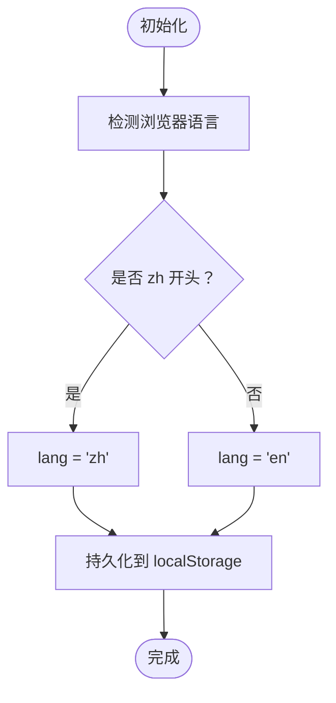
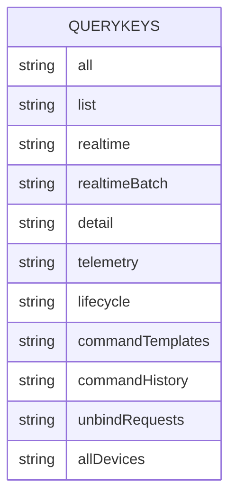
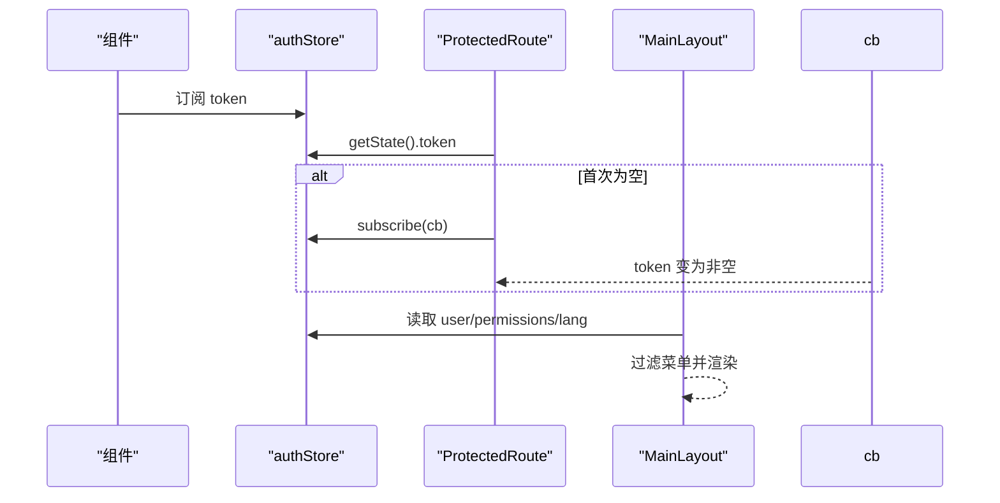
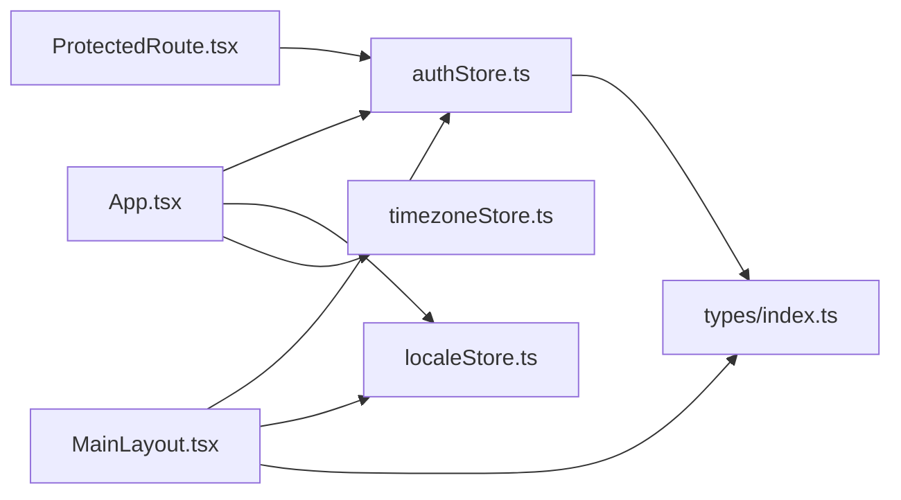

# 状态管理系统

<cite>
**本文引用的文件**
- [authStore.ts](file://inv-admin-frontend/src/stores/authStore.ts)
- [localeStore.ts](file://inv-admin-frontend/src/stores/localeStore.ts)
- [timezoneStore.ts](file://inv-admin-frontend/src/stores/timezoneStore.ts)
- [queryKeys.ts](file://inv-admin-frontend/src/utils/queryKeys.ts)
- [index.ts](file://inv-admin-frontend/src/types/index.ts)
- [App.tsx](file://inv-admin-frontend/src/App.tsx)
- [ProtectedRoute.tsx](file://inv-admin-frontend/src/components/ProtectedRoute.tsx)
- [MainLayout.tsx](file://inv-admin-frontend/src/layouts/MainLayout.tsx)
</cite>

## 目录
1. [简介](#简介)
2. [项目结构](#项目结构)
3. [核心组件](#核心组件)
4. [架构总览](#架构总览)
5. [详细组件分析](#详细组件分析)
6. [依赖关系分析](#依赖关系分析)
7. [性能考量](#性能考量)
8. [故障排查指南](#故障排查指南)
9. [结论](#结论)
10. [附录](#附录)

## 简介
本文件系统性梳理管理后台基于 Zustand 的状态管理方案，覆盖认证状态管理、国际化状态管理、查询键工具设计、全局状态同步机制以及与 React Query 的集成策略。文档以代码级分析为主，辅以可视化图示，帮助开发者快速理解并正确使用该状态体系。

## 项目结构
状态管理相关代码集中于前端工程的 stores、utils 和布局/路由层：
- stores：认证状态、语言状态、时区状态
- utils：查询键工具，统一生成 API 查询缓存键
- 布局与路由：应用主题、受保护路由、主布局菜单与权限控制
- 类型定义：用户角色与实体模型

图表来源
- [authStore.ts:1-68](file://inv-admin-frontend/src/stores/authStore.ts#L1-L68)
- [localeStore.ts:1-22](file://inv-admin-frontend/src/stores/localeStore.ts#L1-L22)
- [timezoneStore.ts:1-17](file://inv-admin-frontend/src/stores/timezoneStore.ts#L1-L17)
- [queryKeys.ts:1-84](file://inv-admin-frontend/src/utils/queryKeys.ts#L1-L84)
- [index.ts:1-110](file://inv-admin-frontend/src/types/index.ts#L1-L110)
- [App.tsx:1-158](file://inv-admin-frontend/src/App.tsx#L1-L158)
- [ProtectedRoute.tsx:1-48](file://inv-admin-frontend/src/components/ProtectedRoute.tsx#L1-L48)
- [MainLayout.tsx:1-387](file://inv-admin-frontend/src/layouts/MainLayout.tsx#L1-L387)

章节来源
- [App.tsx:46-52](file://inv-admin-frontend/src/App.tsx#L46-L52)
- [ProtectedRoute.tsx:10-30](file://inv-admin-frontend/src/components/ProtectedRoute.tsx#L10-L30)
- [MainLayout.tsx:65-105](file://inv-admin-frontend/src/layouts/MainLayout.tsx#L65-L105)

## 核心组件
- 认证状态存储 authStore：负责 token、刷新 token、用户信息、权限列表与登录态；提供登录、登出、刷新、权限校验等方法；采用持久化中间件保存关键字段。
- 国际化状态存储 localeStore：负责当前语言 lang 与语言切换 setLang；采用持久化中间件保存语言偏好。
- 时区状态存储 timezoneStore：负责当前时区 timezone 与获取时区 fetchTimezone；不持久化，按需更新。
- 查询键工具 queryKeys：统一生成各模块查询键，支持参数化与批量场景，便于 React Query 缓存管理与失效策略。

章节来源
- [authStore.ts:5-17](file://inv-admin-frontend/src/stores/authStore.ts#L5-L17)
- [authStore.ts:19-65](file://inv-admin-frontend/src/stores/authStore.ts#L19-L65)
- [localeStore.ts:6-18](file://inv-admin-frontend/src/stores/localeStore.ts#L6-L18)
- [timezoneStore.ts:3-14](file://inv-admin-frontend/src/stores/timezoneStore.ts#L3-L14)
- [queryKeys.ts:1-84](file://inv-admin-frontend/src/utils/queryKeys.ts#L1-L84)

## 架构总览
Zustand 状态在应用层通过 hooks 订阅，配合受保护路由与主布局菜单进行权限控制与界面渲染。国际化与主题由应用入口统一注入，时区在挂载后自动获取。

图表来源
- [App.tsx:46-52](file://inv-admin-frontend/src/App.tsx#L46-L52)
- [ProtectedRoute.tsx:10-30](file://inv-admin-frontend/src/components/ProtectedRoute.tsx#L10-L30)
- [MainLayout.tsx:75-105](file://inv-admin-frontend/src/layouts/MainLayout.tsx#L75-L105)

## 详细组件分析

### 认证状态存储 authStore
- 状态结构
  - token、refreshToken：用于鉴权与刷新
  - user：当前登录用户，含角色、时区等
  - permissions：权限字符串数组
  - isAuthenticated：登录态标志
- 方法
  - login：写入 token、refreshToken、user、permissions、isAuthenticated
  - logout：清空认证相关字段
  - setUser：仅更新用户信息
  - refreshAuth：仅更新 token 与 refreshToken
  - hasPermission / hasAnyPermission：权限校验，超级管理员始终放行
- 持久化
  - 使用持久化中间件，仅持久化 token、refreshToken、user、permissions、isAuthenticated
  - 存储键名固定，避免跨环境污染
- 权限缓存机制
  - 权限列表来自登录 payload，后续权限变更需重新登录或调用刷新接口后更新状态

图表来源
- [authStore.ts:5-17](file://inv-admin-frontend/src/stores/authStore.ts#L5-L17)
- [authStore.ts:19-65](file://inv-admin-frontend/src/stores/authStore.ts#L19-L65)
- [index.ts:8-21](file://inv-admin-frontend/src/types/index.ts#L8-L21)

章节来源
- [authStore.ts:21-65](file://inv-admin-frontend/src/stores/authStore.ts#L21-L65)
- [index.ts:1-6](file://inv-admin-frontend/src/types/index.ts#L1-L6)

### 国际化状态存储 localeStore
- 状态结构
  - lang：当前语言 zh 或 en
  - setLang：切换语言
- 初始化逻辑
  - 依据浏览器语言前缀自动选择 zh 或 en
- 持久化
  - 使用持久化中间件保存用户语言偏好，下次进入自动生效

图表来源
- [localeStore.ts:11-18](file://inv-admin-frontend/src/stores/localeStore.ts#L11-L18)

章节来源
- [localeStore.ts:14](file://inv-admin-frontend/src/stores/localeStore.ts#L14)

### 时区状态存储 timezoneStore
- 状态结构
  - timezone：当前时区标识
  - fetchTimezone：获取并更新时区
- 行为
  - 组件挂载后自动获取系统时区，若不可用则回退默认值
  - 与用户资料中的时区联动更新

章节来源
- [timezoneStore.ts:8-14](file://inv-admin-frontend/src/stores/timezoneStore.ts#L8-L14)
- [MainLayout.tsx:185-200](file://inv-admin-frontend/src/layouts/MainLayout.tsx#L185-L200)

### 查询键工具 queryKeys
- 设计目标
  - 统一生成 API 查询键，确保 React Query 缓存键稳定可追踪
  - 支持模块化分组、参数化与批量场景
- 结构组织
  - 按业务域划分：stations、devices、alerts、alertRules、workOrders、users、models、ota、parallel、admin、dashboard、monitoring、operationLogs
  - 每个域提供 all、list、detail、stats 等常用键，部分域支持参数化键
- 复杂度与一致性
  - 键为只读常量，便于全局复用与测试
  - 参数化键将查询参数纳入键的一部分，避免缓存污染

图表来源
- [queryKeys.ts:1-84](file://inv-admin-frontend/src/utils/queryKeys.ts#L1-L84)

章节来源
- [queryKeys.ts:1-84](file://inv-admin-frontend/src/utils/queryKeys.ts#L1-L84)

### 全局状态同步机制
- 状态持久化
  - 认证状态与语言状态通过持久化中间件保存至本地存储，刷新或重启后恢复
- 跨组件状态共享
  - 通过 hooks 订阅 authStore 与 localeStore，实现菜单、头部、页面等多处共享
- 状态订阅模式
  - 受保护路由使用订阅方式等待 token 就绪，避免首屏白屏或跳转错误
  - 主布局根据权限动态过滤菜单项，实时响应权限变化

图表来源
- [ProtectedRoute.tsx:14-30](file://inv-admin-frontend/src/components/ProtectedRoute.tsx#L14-L30)
- [MainLayout.tsx:75-105](file://inv-admin-frontend/src/layouts/MainLayout.tsx#L75-L105)

章节来源
- [ProtectedRoute.tsx:10-30](file://inv-admin-frontend/src/components/ProtectedRoute.tsx#L10-L30)
- [MainLayout.tsx:93-105](file://inv-admin-frontend/src/layouts/MainLayout.tsx#L93-L105)

## 依赖关系分析
- 应用入口依赖
  - App.tsx 依赖 authStore、localeStore、timezoneStore，注入 antd 主题与语言包
- 路由与布局依赖
  - ProtectedRoute 依赖 authStore 的 token 与订阅能力
  - MainLayout 依赖 authStore 的用户、权限、语言，依赖 localeStore 的语言切换
- 类型依赖
  - authStore 依赖 User 与 Role 类型，保证权限校验与菜单渲染的类型安全

图表来源
- [App.tsx:30-33](file://inv-admin-frontend/src/App.tsx#L30-L33)
- [ProtectedRoute.tsx:4](file://inv-admin-frontend/src/components/ProtectedRoute.tsx#L4)
- [MainLayout.tsx:15-18](file://inv-admin-frontend/src/layouts/MainLayout.tsx#L15-L18)
- [index.ts:1-6](file://inv-admin-frontend/src/types/index.ts#L1-L6)

章节来源
- [App.tsx:30-33](file://inv-admin-frontend/src/App.tsx#L30-L33)
- [ProtectedRoute.tsx:4](file://inv-admin-frontend/src/components/ProtectedRoute.tsx#L4)
- [MainLayout.tsx:15-18](file://inv-admin-frontend/src/layouts/MainLayout.tsx#L15-L18)

## 性能考量
- 状态粒度
  - 将 token、refreshToken、user、permissions 分离，避免无关字段触发重渲染
- 订阅范围
  - 仅对需要的字段进行订阅，减少不必要的组件重渲染
- 持久化策略
  - 仅持久化必要字段，降低存储体积与序列化开销
- 查询键稳定性
  - 使用 queryKeys 统一键生成，避免运行时拼接导致的键不稳定
- 时区获取
  - 仅在挂载时获取一次系统时区，避免频繁计算

## 故障排查指南
- 登录后仍被重定向到登录页
  - 检查 authStore 是否正确写入 token 与 isAuthenticated
  - 参考受保护路由的订阅与超时逻辑
- 权限菜单不显示
  - 检查 permissions 是否正确写入
  - 确认 hasPermission 返回预期结果
- 语言切换无效
  - 检查 localeStore 的 setLang 是否被调用
  - 确认 App.tsx 的 ConfigProvider locale 是否随 lang 变更
- 时区未更新
  - 确认 MainLayout 中的 handleTimezoneChange 是否成功调用后更新了用户时区
  - 检查 timezoneStore 的 fetchTimezone 是否执行

章节来源
- [ProtectedRoute.tsx:14-30](file://inv-admin-frontend/src/components/ProtectedRoute.tsx#L14-L30)
- [MainLayout.tsx:185-200](file://inv-admin-frontend/src/layouts/MainLayout.tsx#L185-L200)

## 结论
该状态管理体系以 Zustand 为核心，结合持久化中间件与统一查询键工具，实现了认证、国际化与时区的高效管理。通过 hooks 订阅与受保护路由，确保了登录态与权限控制的一致性。建议在扩展新功能时遵循现有命名与结构规范，保持查询键稳定与状态最小化更新。

## 附录
- 最佳实践
  - 状态结构设计：按职责拆分，避免“大而全”状态对象
  - 权限校验：优先使用 hasPermission / hasAnyPermission，超级管理员特例处理
  - 查询键使用：统一通过 queryKeys 生成，参数化键必须包含所有影响因素
  - 持久化字段：仅保存必要的轻量级字段，避免敏感信息落盘
  - 调试技巧：利用 Zustand DevTools 观察状态变化与订阅回调
- 与 React Query 的集成
  - 使用 queryKeys 作为查询键，确保缓存命中与失效可控
  - 对于需要实时性的数据，采用手动 invalidation 或基于事件的 refetch 策略
  - 对于批量操作，使用批量键（如 devices 实时批量）统一失效