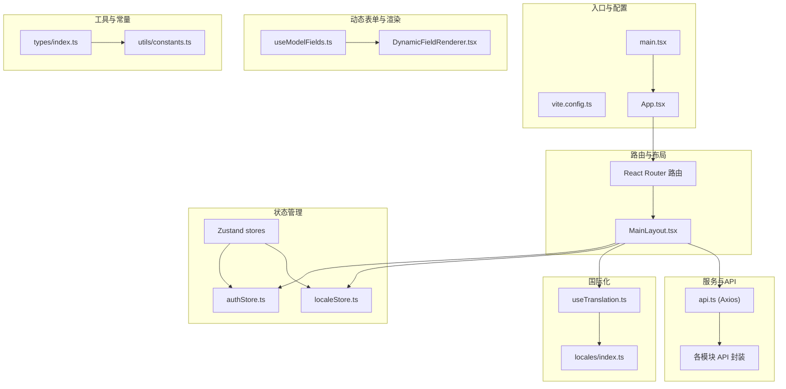
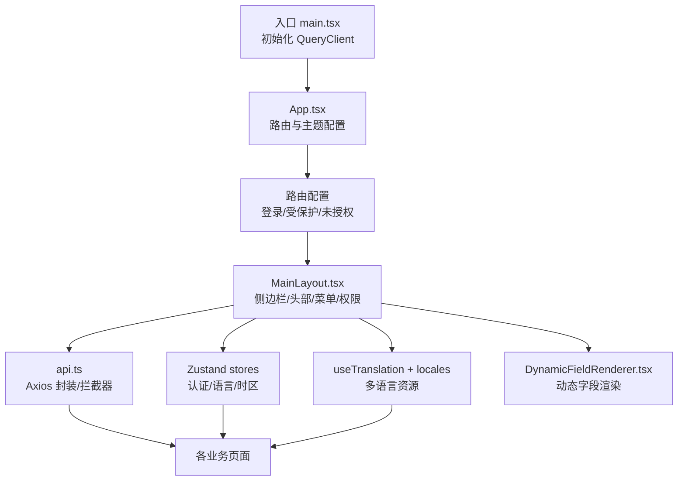
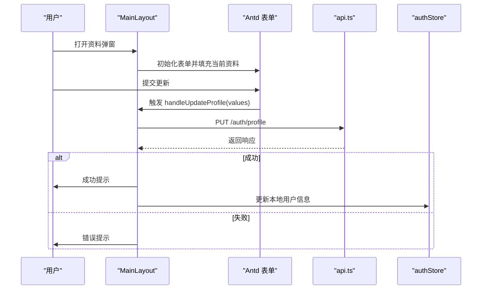
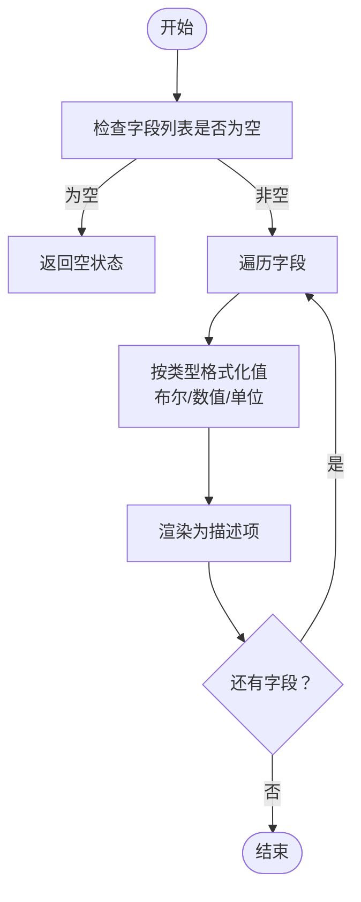
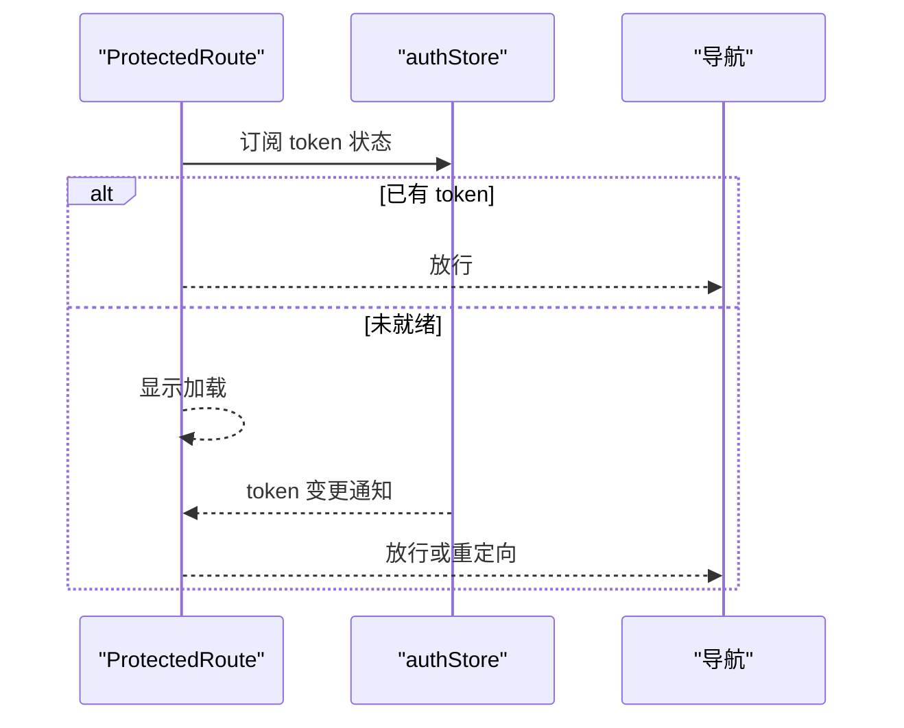
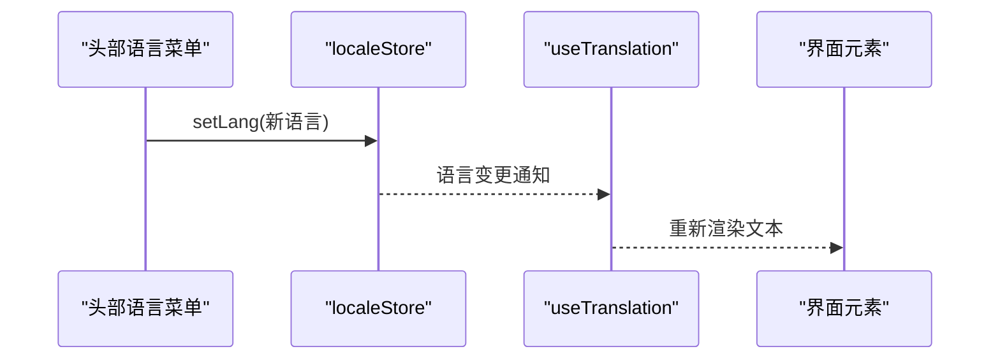
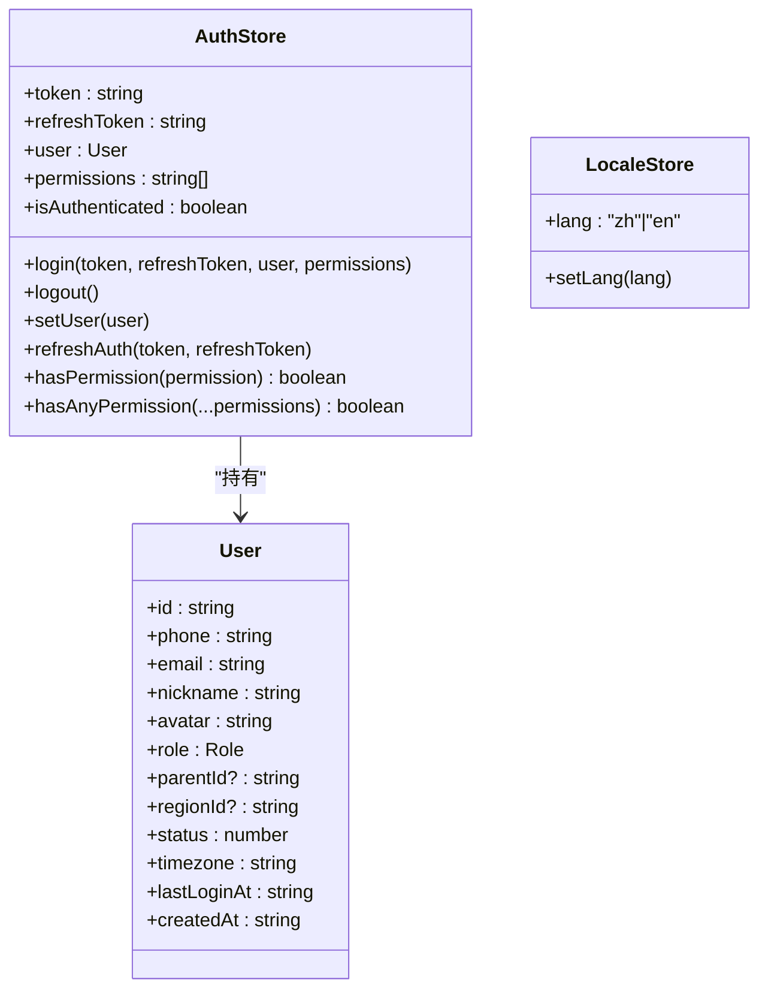
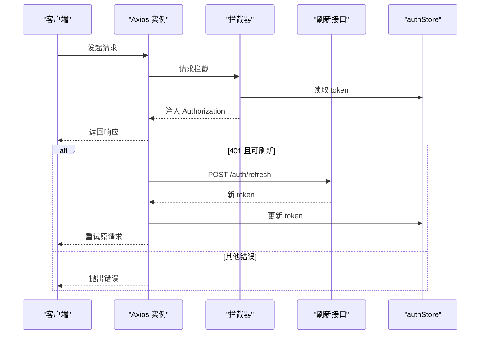
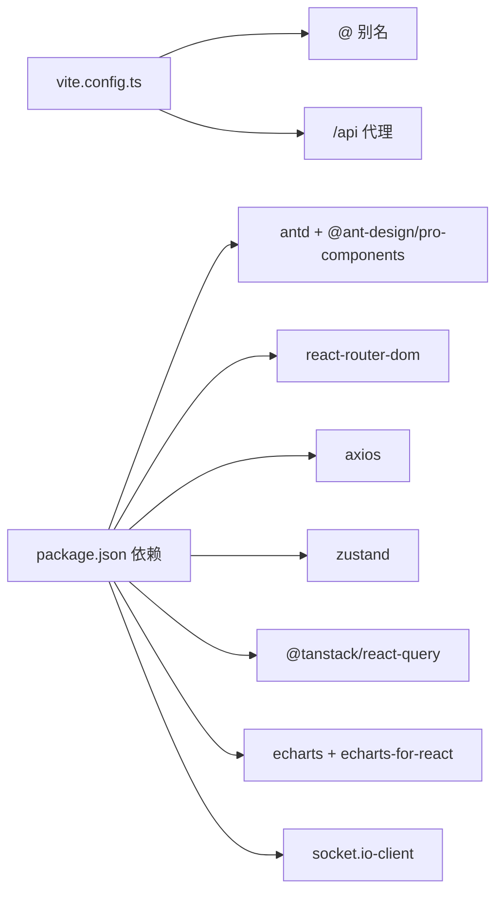

# 管理后台前端

<cite>
**本文引用的文件**
- [package.json](file://inv-admin-frontend/package.json)
- [vite.config.ts](file://inv-admin-frontend/vite.config.ts)
- [App.tsx](file://inv-admin-frontend/src/App.tsx)
- [main.tsx](file://inv-admin-frontend/src/main.tsx)
- [MainLayout.tsx](file://inv-admin-frontend/src/layouts/MainLayout.tsx)
- [DynamicFieldRenderer.tsx](file://inv-admin-frontend/src/components/dyna/DynamicFieldRenderer.tsx)
- [useModelFields.ts](file://inv-admin-frontend/src/components/dyna/useModelFields.ts)
- [authStore.ts](file://inv-admin-frontend/src/stores/authStore.ts)
- [localeStore.ts](file://inv-admin-frontend/src/stores/localeStore.ts)
- [ProtectedRoute.tsx](file://inv-admin-frontend/src/components/ProtectedRoute.tsx)
- [useTranslation.ts](file://inv-admin-frontend/src/hooks/useTranslation.ts)
- [api.ts](file://inv-admin-frontend/src/services/api.ts)
- [constants.ts](file://inv-admin-frontend/src/utils/constants.ts)
- [index.ts](file://inv-admin-frontend/src/types/index.ts)
- [locales/index.ts](file://inv-admin-frontend/src/locales/index.ts)
</cite>

## 目录
1. [简介](#简介)
2. [项目结构](#项目结构)
3. [核心组件](#核心组件)
4. [架构总览](#架构总览)
5. [详细组件分析](#详细组件分析)
6. [依赖关系分析](#依赖关系分析)
7. [性能考虑](#性能考虑)
8. [故障排查指南](#故障排查指南)
9. [结论](#结论)
10. [附录](#附录)

## 简介
本项目为基于 React 与 TypeScript 的管理后台前端，采用 Ant Design Pro 组件库与 Antd 5.x 实现统一的视觉与交互规范；通过 Zustand 实现轻量状态管理，结合 React Router v6 完成页面路由与权限控制；借助 React Query 管理 API 请求与缓存；内置国际化与本地化资源管理；提供动态表单字段渲染能力；集成图表组件与可视化展示；并通过 WebSocket 客户端实现实时数据推送。

## 项目结构
前端位于 inv-admin-frontend 目录，采用按功能域分层组织：页面 pages、布局 layouts、通用组件 components、状态 stores、国际化 locales、工具 utils、类型定义 types、服务封装 services、入口 main.tsx 与应用 App.tsx。

**图示来源**
- [vite.config.ts:1-22](file://inv-admin-frontend/vite.config.ts#L1-L22)
- [main.tsx:1-27](file://inv-admin-frontend/src/main.tsx#L1-L27)
- [App.tsx:1-158](file://inv-admin-frontend/src/App.tsx#L1-L158)
- [MainLayout.tsx:1-387](file://inv-admin-frontend/src/layouts/MainLayout.tsx#L1-L387)
- [authStore.ts:1-68](file://inv-admin-frontend/src/stores/authStore.ts#L1-L68)
- [localeStore.ts:1-22](file://inv-admin-frontend/src/stores/localeStore.ts#L1-L22)
- [useTranslation.ts:1-19](file://inv-admin-frontend/src/hooks/useTranslation.ts#L1-L19)
- [locales/index.ts:1-70](file://inv-admin-frontend/src/locales/index.ts#L1-L70)
- [api.ts:1-64](file://inv-admin-frontend/src/services/api.ts#L1-L64)
- [DynamicFieldRenderer.tsx:1-63](file://inv-admin-frontend/src/components/dyna/DynamicFieldRenderer.tsx#L1-L63)
- [useModelFields.ts:1-71](file://inv-admin-frontend/src/components/dyna/useModelFields.ts#L1-L71)
- [types/index.ts:1-100](file://inv-admin-frontend/src/types/index.ts#L1-L100)
- [constants.ts:1-128](file://inv-admin-frontend/src/utils/constants.ts#L1-L128)

**章节来源**
- [package.json:1-37](file://inv-admin-frontend/package.json#L1-L37)
- [vite.config.ts:1-22](file://inv-admin-frontend/vite.config.ts#L1-L22)
- [main.tsx:1-27](file://inv-admin-frontend/src/main.tsx#L1-L27)
- [App.tsx:1-158](file://inv-admin-frontend/src/App.tsx#L1-L158)

## 核心组件
- 应用入口与主题配置：在入口文件中注入 React Query 客户端，并通过 ConfigProvider 全局配置 Antd 主题与语言；App 组织路由与受保护页面。
- 布局系统：MainLayout 提供侧边栏菜单、顶部用户下拉、语言与时区切换、动态菜单过滤与页面内容区域。
- 权限控制：通过受保护路由与鉴权状态判断，结合权限校验函数实现页面级与菜单级权限控制。
- 动态表单渲染：根据设备模型字段元数据动态生成描述项，支持布尔、数值、单位展示与空值占位。
- 状态管理：Zustand stores 管理认证、语言与时区状态，持久化存储提升用户体验。
- 国际化：自定义 useTranslation 钩子与 locales 资源合并，支持参数化替换与语言切换。
- API 服务：Axios 封装，统一拦截器处理鉴权与刷新逻辑，导出模块化 API 方法。
- 工具与常量：角色映射、状态颜色、告警级别、图表配色等常量集中管理。

**章节来源**
- [App.tsx:46-155](file://inv-admin-frontend/src/App.tsx#L46-L155)
- [MainLayout.tsx:65-387](file://inv-admin-frontend/src/layouts/MainLayout.tsx#L65-L387)
- [ProtectedRoute.tsx:10-45](file://inv-admin-frontend/src/components/ProtectedRoute.tsx#L10-L45)
- [DynamicFieldRenderer.tsx:16-60](file://inv-admin-frontend/src/components/dyna/DynamicFieldRenderer.tsx#L16-L60)
- [authStore.ts:21-65](file://inv-admin-frontend/src/stores/authStore.ts#L21-L65)
- [localeStore.ts:11-19](file://inv-admin-frontend/src/stores/localeStore.ts#L11-L19)
- [useTranslation.ts:4-16](file://inv-admin-frontend/src/hooks/useTranslation.ts#L4-L16)
- [api.ts:5-64](file://inv-admin-frontend/src/services/api.ts#L5-L64)
- [constants.ts:2-128](file://inv-admin-frontend/src/utils/constants.ts#L2-L128)

## 架构总览
整体架构围绕“入口 -> 路由 -> 布局 -> 页面”的层次展开，状态与国际化贯穿于各层，API 层通过 Axios 统一处理请求与响应。

**图示来源**
- [main.tsx:7-18](file://inv-admin-frontend/src/main.tsx#L7-L18)
- [App.tsx:104-149](file://inv-admin-frontend/src/App.tsx#L104-L149)
- [MainLayout.tsx:65-105](file://inv-admin-frontend/src/layouts/MainLayout.tsx#L65-L105)
- [api.ts:14-50](file://inv-admin-frontend/src/services/api.ts#L14-L50)
- [DynamicFieldRenderer.tsx:16-60](file://inv-admin-frontend/src/components/dyna/DynamicFieldRenderer.tsx#L16-L60)

## 详细组件分析

### 布局与菜单系统
- 侧边栏与响应式折叠：支持移动端断点与折叠状态切换，固定定位保证滚动体验。
- 菜单项构建：管理员与普通用户分别维护菜单列表，通过权限标识进行过滤。
- 头部操作：语言切换、时区选择、用户信息与下拉菜单（修改密码、修改资料、登出）。
- 用户资料与密码更新：表单校验与提交流程，成功后更新本地状态并提示。

**图示来源**
- [MainLayout.tsx:118-147](file://inv-admin-frontend/src/layouts/MainLayout.tsx#L118-L147)
- [api.ts:14-50](file://inv-admin-frontend/src/services/api.ts#L14-L50)
- [authStore.ts:30-38](file://inv-admin-frontend/src/stores/authStore.ts#L30-L38)

**章节来源**
- [MainLayout.tsx:25-105](file://inv-admin-frontend/src/layouts/MainLayout.tsx#L25-L105)
- [MainLayout.tsx:118-200](file://inv-admin-frontend/src/layouts/MainLayout.tsx#L118-L200)

### 动态表单渲染系统
- 字段元数据：从模型 API 获取字段集合，按排序与展示/控制属性筛选。
- 渲染策略：根据字段类型对布尔、整数、浮点数进行格式化与单位拼接；空值显示占位文本。
- 性能与缓存：通过自定义 Hook 缓存模型与字段结果，避免重复请求。

**图示来源**
- [DynamicFieldRenderer.tsx:24-59](file://inv-admin-frontend/src/components/dyna/DynamicFieldRenderer.tsx#L24-L59)
- [useModelFields.ts:18-67](file://inv-admin-frontend/src/components/dyna/useModelFields.ts#L18-L67)

**章节来源**
- [DynamicFieldRenderer.tsx:16-60](file://inv-admin-frontend/src/components/dyna/DynamicFieldRenderer.tsx#L16-L60)
- [useModelFields.ts:13-67](file://inv-admin-frontend/src/components/dyna/useModelFields.ts#L13-L67)

### 权限控制组件
- 页面级保护：ProtectedRoute 在令牌就绪前显示加载状态，令牌缺失则跳转登录页。
- 菜单级权限：根据用户角色构建菜单项，再依据权限标识过滤不可见菜单。
- 权限校验：提供 hasPermission 与 hasAnyPermission，超级管理员默认放行。

**图示来源**
- [ProtectedRoute.tsx:10-45](file://inv-admin-frontend/src/components/ProtectedRoute.tsx#L10-L45)
- [authStore.ts:40-52](file://inv-admin-frontend/src/stores/authStore.ts#L40-L52)

**章节来源**
- [ProtectedRoute.tsx:10-45](file://inv-admin-frontend/src/components/ProtectedRoute.tsx#L10-L45)
- [MainLayout.tsx:93-105](file://inv-admin-frontend/src/layouts/MainLayout.tsx#L93-L105)
- [authStore.ts:40-52](file://inv-admin-frontend/src/stores/authStore.ts#L40-L52)

### 国际化支持
- 自定义钩子：useTranslation 读取当前语言，支持键值查找与参数替换。
- 资源合并：locales/index.ts 将各模块语言包合并为 zh/en 两套资源。
- 语言切换：头部下拉菜单触发 localeStore 切换语言并持久化。

**图示来源**
- [MainLayout.tsx:230-234](file://inv-admin-frontend/src/layouts/MainLayout.tsx#L230-L234)
- [localeStore.ts:11-19](file://inv-admin-frontend/src/stores/localeStore.ts#L11-L19)
- [useTranslation.ts:4-16](file://inv-admin-frontend/src/hooks/useTranslation.ts#L4-L16)
- [locales/index.ts:24-67](file://inv-admin-frontend/src/locales/index.ts#L24-L67)

**章节来源**
- [useTranslation.ts:4-16](file://inv-admin-frontend/src/hooks/useTranslation.ts#L4-L16)
- [locales/index.ts:24-67](file://inv-admin-frontend/src/locales/index.ts#L24-L67)
- [localeStore.ts:11-19](file://inv-admin-frontend/src/stores/localeStore.ts#L11-L19)

### 状态管理方案（Zustand）
- 认证状态：token、refreshToken、用户信息、权限数组与登录态，支持持久化。
- 语言与时区：自动识别浏览器语言，支持手动切换并持久化。
- 权限校验：超级管理员放行，其他用户需匹配权限数组。

**图示来源**
- [authStore.ts:21-65](file://inv-admin-frontend/src/stores/authStore.ts#L21-L65)
- [localeStore.ts:11-19](file://inv-admin-frontend/src/stores/localeStore.ts#L11-L19)
- [types/index.ts:8-21](file://inv-admin-frontend/src/types/index.ts#L8-L21)

**章节来源**
- [authStore.ts:21-65](file://inv-admin-frontend/src/stores/authStore.ts#L21-L65)
- [localeStore.ts:11-19](file://inv-admin-frontend/src/stores/localeStore.ts#L11-L19)
- [types/index.ts:8-21](file://inv-admin-frontend/src/types/index.ts#L8-L21)

### API 服务封装与错误处理
- 基础配置：基础路径、超时、凭据携带、默认头。
- 请求拦截：自动附加 Bearer Token。
- 响应拦截：401 且非重试请求时尝试刷新令牌，刷新成功后重试原请求；刷新失败则登出并跳转登录页。
- 模块化导出：提供认证相关方法。

**图示来源**
- [api.ts:14-50](file://inv-admin-frontend/src/services/api.ts#L14-L50)
- [authStore.ts:30-38](file://inv-admin-frontend/src/stores/authStore.ts#L30-L38)

**章节来源**
- [api.ts:5-64](file://inv-admin-frontend/src/services/api.ts#L5-L64)

### 图表组件集成与可视化
- 依赖引入：项目包含 ECharts 与 ECharts for React，可用于报表与监控看板的数据可视化。
- 使用建议：在具体页面中引入 ECharts 组件，结合查询结果与常量中的配色方案进行图表绘制。

**章节来源**
- [package.json:19-20](file://inv-admin-frontend/package.json#L19-L20)

## 依赖关系分析
- 构建与开发：Vite 配置别名 @ 指向 src，代理 /api 到后端服务端口。
- 运行时依赖：Ant Design 5.x、Antd Pro Components、React Router、Axios、Zustand、React Query、ECharts、Socket.IO 客户端等。
- 类型安全：TypeScript 严格类型约束，配合类型定义文件确保跨模块一致性。

**图示来源**
- [vite.config.ts:7-20](file://inv-admin-frontend/vite.config.ts#L7-L20)
- [package.json:11-27](file://inv-admin-frontend/package.json#L11-L27)

**章节来源**
- [vite.config.ts:1-22](file://inv-admin-frontend/vite.config.ts#L1-L22)
- [package.json:1-37](file://inv-admin-frontend/package.json#L1-L37)

## 性能考虑
- 查询缓存：React Query 默认查询缓存与重试策略，减少重复请求与网络抖动影响。
- 懒加载与按需：路由按需加载页面组件，减少首屏体积。
- 状态持久化：Zustand 持久化存储认证与语言信息，避免重复获取与闪烁。
- 图表优化：ECharts 按需渲染，避免不必要的重绘与大数据集渲染。

## 故障排查指南
- 登录态失效：检查响应拦截器是否正确触发刷新流程，确认刷新接口可用与 token 更新。
- 权限不足：确认用户权限数组与菜单权限标识一致，超级管理员默认放行。
- 国际化不生效：检查 useTranslation 返回的语言与 locales 合并结果，确认键存在。
- 动态字段为空：确认模型字段获取成功且字段列表非空，检查字段单位与类型映射。
- 代理问题：确认 Vite 代理配置指向正确的后端地址与端口。

**章节来源**
- [api.ts:25-50](file://inv-admin-frontend/src/services/api.ts#L25-L50)
- [authStore.ts:40-52](file://inv-admin-frontend/src/stores/authStore.ts#L40-L52)
- [useTranslation.ts:6-14](file://inv-admin-frontend/src/hooks/useTranslation.ts#L6-L14)
- [DynamicFieldRenderer.tsx:24-26](file://inv-admin-frontend/src/components/dyna/DynamicFieldRenderer.tsx#L24-L26)
- [vite.config.ts:14-19](file://inv-admin-frontend/vite.config.ts#L14-L19)

## 结论
该管理后台前端以 Antd 与 Antd Pro 为基础，结合 React Router、Zustand、React Query 与 Axios，形成清晰的分层架构与完善的权限、国际化与状态管理机制。动态表单渲染与可视化组件为业务扩展提供了良好基础。后续可在 WebSocket 实时推送、图表深度集成与权限细化方面持续演进。

## 附录
- 常量与映射：角色、设备状态、告警级别、任务状态、配色与渐变等集中管理，便于统一维护与扩展。
- 类型体系：User、Device、Firmware、Alert、WorkOrder 等核心类型定义，保障前后端契约一致。

**章节来源**
- [constants.ts:2-128](file://inv-admin-frontend/src/utils/constants.ts#L2-L128)
- [types/index.ts:1-100](file://inv-admin-frontend/src/types/index.ts#L1-L100)