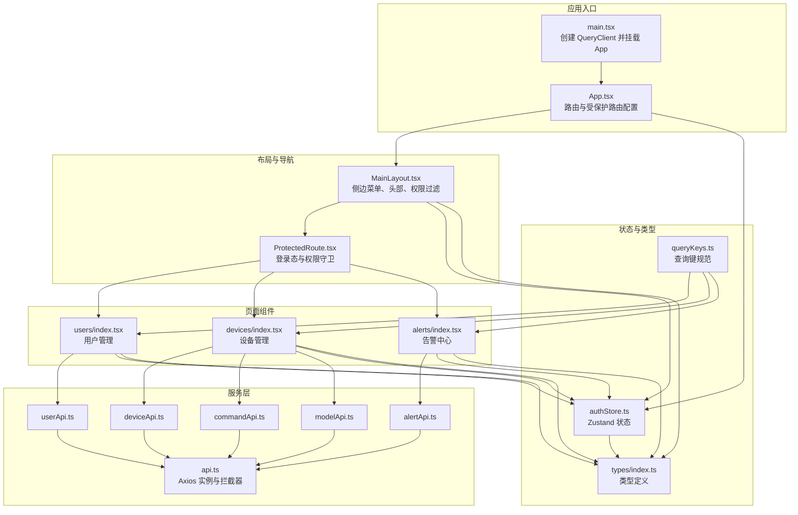
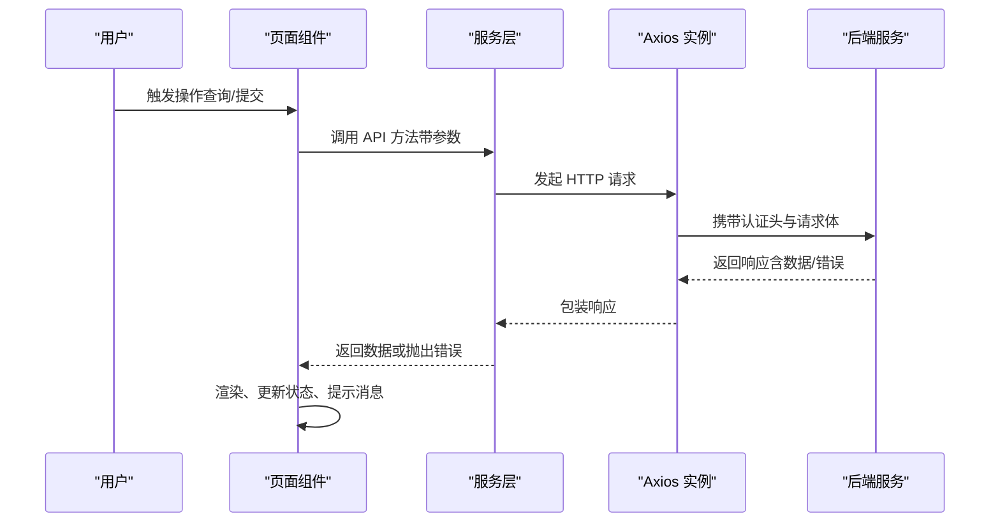
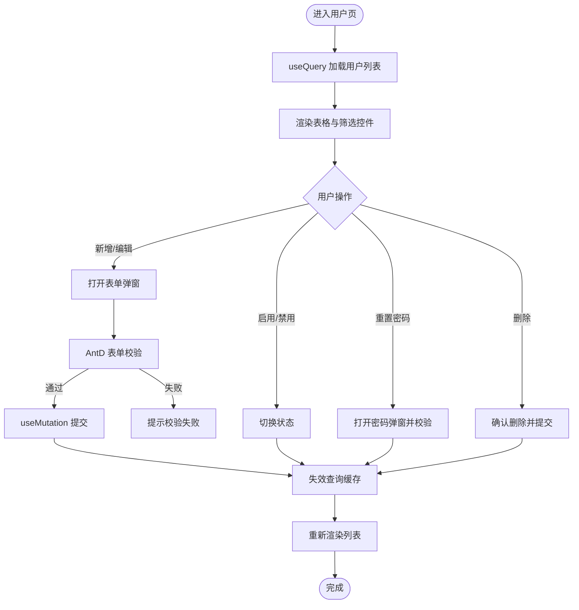
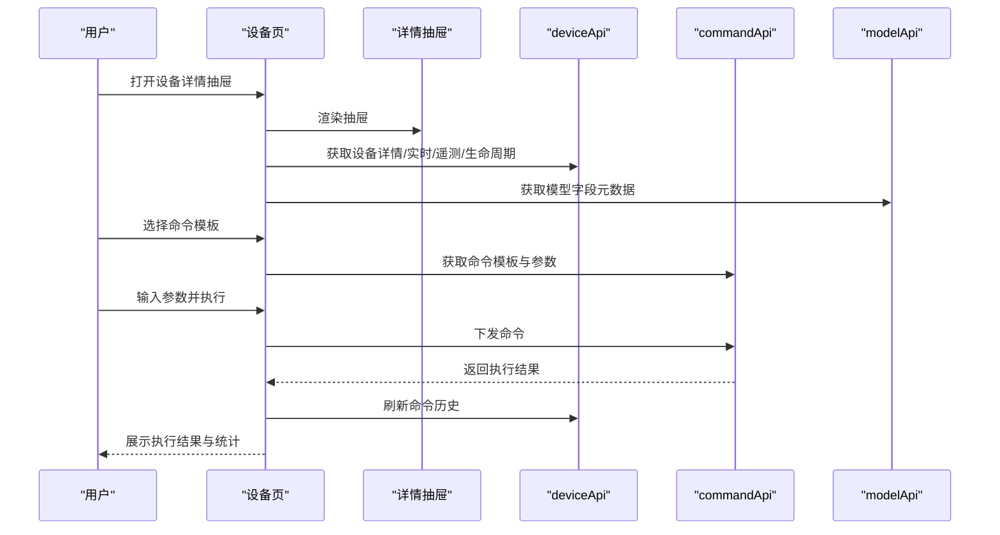
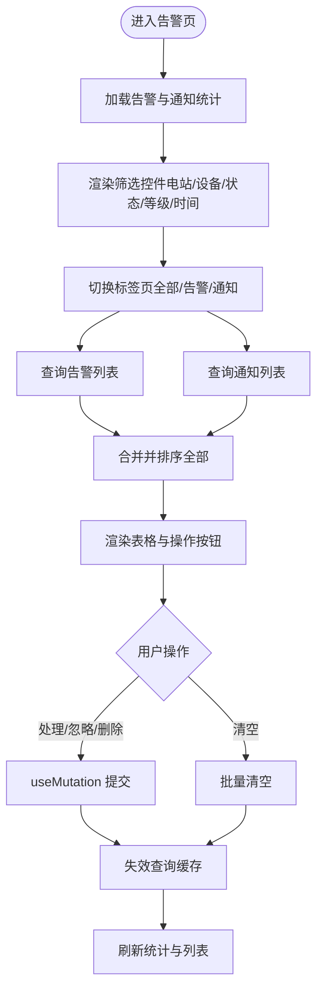
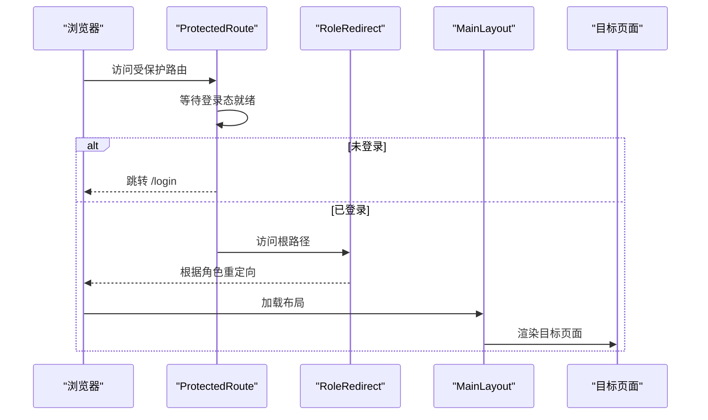
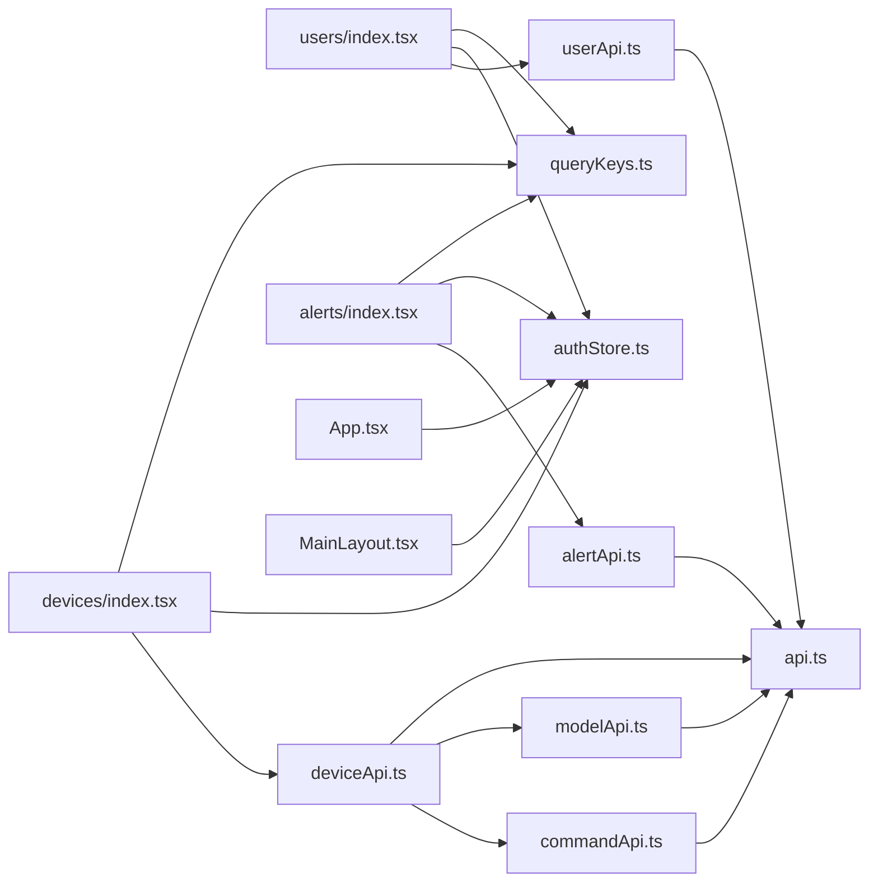

# 页面组件

<cite>
**本文引用的文件**
- [inv-admin-frontend/src/pages/users/index.tsx](file://inv-admin-frontend/src/pages/users/index.tsx)
- [inv-admin-frontend/src/pages/devices/index.tsx](file://inv-admin-frontend/src/pages/devices/index.tsx)
- [inv-admin-frontend/src/pages/alerts/index.tsx](file://inv-admin-frontend/src/pages/alerts/index.tsx)
- [inv-admin-frontend/src/services/userApi.ts](file://inv-admin-frontend/src/services/userApi.ts)
- [inv-admin-frontend/src/services/deviceApi.ts](file://inv-admin-frontend/src/services/deviceApi.ts)
- [inv-admin-frontend/src/services/alertApi.ts](file://inv-admin-frontend/src/services/alertApi.ts)
- [inv-admin-frontend/src/services/commandApi.ts](file://inv-admin-frontend/src/services/commandApi.ts)
- [inv-admin-frontend/src/services/modelApi.ts](file://inv-admin-frontend/src/services/modelApi.ts)
- [inv-admin-frontend/src/services/api.ts](file://inv-admin-frontend/src/services/api.ts)
- [inv-admin-frontend/src/App.tsx](file://inv-admin-frontend/src/App.tsx)
- [inv-admin-frontend/src/main.tsx](file://inv-admin-frontend/src/main.tsx)
- [inv-admin-frontend/src/components/ProtectedRoute.tsx](file://inv-admin-frontend/src/components/ProtectedRoute.tsx)
- [inv-admin-frontend/src/layouts/MainLayout.tsx](file://inv-admin-frontend/src/layouts/MainLayout.tsx)
- [inv-admin-frontend/src/stores/authStore.ts](file://inv-admin-frontend/src/stores/authStore.ts)
- [inv-admin-frontend/src/types/index.ts](file://inv-admin-frontend/src/types/index.ts)
- [inv-admin-frontend/src/utils/queryKeys.ts](file://inv-admin-frontend/src/utils/queryKeys.ts)
</cite>

## 目录
1. [引言](#引言)
2. [项目结构](#项目结构)
3. [核心组件](#核心组件)
4. [架构总览](#架构总览)
5. [详细组件分析](#详细组件分析)
6. [依赖关系分析](#依赖关系分析)
7. [性能考量](#性能考量)
8. [故障排查指南](#故障排查指南)
9. [结论](#结论)
10. [附录](#附录)

## 引言
本文件面向管理后台页面组件，系统性梳理用户管理、设备管理、告警管理等核心页面的设计与实现，总结页面通用模式（数据获取、加载状态、错误处理、用户交互），解析API服务封装（设备API、用户API、告警API等），明确页面类型定义与查询键规范，并说明导航与路由配置（面包屑、权限校验、页面缓存）。最后给出页面开发最佳实践与测试调试建议。

## 项目结构
前端采用 React + TypeScript + Ant Design + React Router + TanStack React Query 构建，页面位于 src/pages，服务封装在 src/services，全局状态在 src/stores，类型定义在 src/types，路由与布局在 src/App.tsx 与 src/layouts/MainLayout.tsx 中集中配置。

**图表来源**
- [inv-admin-frontend/src/main.tsx:1-27](file://inv-admin-frontend/src/main.tsx#L1-L27)
- [inv-admin-frontend/src/App.tsx:1-158](file://inv-admin-frontend/src/App.tsx#L1-L158)
- [inv-admin-frontend/src/layouts/MainLayout.tsx:1-387](file://inv-admin-frontend/src/layouts/MainLayout.tsx#L1-L387)
- [inv-admin-frontend/src/components/ProtectedRoute.tsx:1-48](file://inv-admin-frontend/src/components/ProtectedRoute.tsx#L1-L48)
- [inv-admin-frontend/src/pages/users/index.tsx:1-259](file://inv-admin-frontend/src/pages/users/index.tsx#L1-L259)
- [inv-admin-frontend/src/pages/devices/index.tsx:1-800](file://inv-admin-frontend/src/pages/devices/index.tsx#L1-L800)
- [inv-admin-frontend/src/pages/alerts/index.tsx:1-490](file://inv-admin-frontend/src/pages/alerts/index.tsx#L1-L490)
- [inv-admin-frontend/src/services/api.ts:1-64](file://inv-admin-frontend/src/services/api.ts#L1-L64)
- [inv-admin-frontend/src/services/userApi.ts:1-13](file://inv-admin-frontend/src/services/userApi.ts#L1-L13)
- [inv-admin-frontend/src/services/deviceApi.ts:1-33](file://inv-admin-frontend/src/services/deviceApi.ts#L1-L33)
- [inv-admin-frontend/src/services/alertApi.ts:1-18](file://inv-admin-frontend/src/services/alertApi.ts#L1-L18)
- [inv-admin-frontend/src/services/commandApi.ts:1-12](file://inv-admin-frontend/src/services/commandApi.ts#L1-L12)
- [inv-admin-frontend/src/services/modelApi.ts:1-65](file://inv-admin-frontend/src/services/modelApi.ts#L1-L65)
- [inv-admin-frontend/src/stores/authStore.ts:1-68](file://inv-admin-frontend/src/stores/authStore.ts#L1-L68)
- [inv-admin-frontend/src/types/index.ts:1-110](file://inv-admin-frontend/src/types/index.ts#L1-L110)
- [inv-admin-frontend/src/utils/queryKeys.ts:1-84](file://inv-admin-frontend/src/utils/queryKeys.ts#L1-L84)

**章节来源**
- [inv-admin-frontend/src/main.tsx:1-27](file://inv-admin-frontend/src/main.tsx#L1-L27)
- [inv-admin-frontend/src/App.tsx:1-158](file://inv-admin-frontend/src/App.tsx#L1-L158)
- [inv-admin-frontend/src/layouts/MainLayout.tsx:1-387](file://inv-admin-frontend/src/layouts/MainLayout.tsx#L1-L387)

## 核心组件
- 用户管理页：支持分页检索、角色与状态筛选、增删改、启用/禁用、重置密码；基于 React Query 的查询与变更，使用查询键缓存；权限控制角色可操作范围。
- 设备管理页：支持设备列表、实时/历史遥测、生命周期事件、解绑申请审批、命令下发与历史、Excel 导入预览与导入；复杂交互与多路查询并行，抽屉详情与命令执行流程清晰。
- 告警中心页：统一展示告警与通知，支持按电站、设备、状态、等级、时间范围筛选，支持批量清理；统计卡片与合并排序展示。

**章节来源**
- [inv-admin-frontend/src/pages/users/index.tsx:1-259](file://inv-admin-frontend/src/pages/users/index.tsx#L1-L259)
- [inv-admin-frontend/src/pages/devices/index.tsx:1-800](file://inv-admin-frontend/src/pages/devices/index.tsx#L1-L800)
- [inv-admin-frontend/src/pages/alerts/index.tsx:1-490](file://inv-admin-frontend/src/pages/alerts/index.tsx#L1-L490)

## 架构总览
页面组件通过服务层调用后端 API，服务层基于 Axios 实例封装，统一设置基础路径、超时、凭证与请求/响应拦截器。页面使用 React Query 进行数据获取、缓存与失效，配合 Zustand 管理登录态与权限，路由层进行受保护访问与角色跳转。

**图表来源**
- [inv-admin-frontend/src/services/api.ts:1-64](file://inv-admin-frontend/src/services/api.ts#L1-L64)
- [inv-admin-frontend/src/services/userApi.ts:1-13](file://inv-admin-frontend/src/services/userApi.ts#L1-L13)
- [inv-admin-frontend/src/services/deviceApi.ts:1-33](file://inv-admin-frontend/src/services/deviceApi.ts#L1-L33)
- [inv-admin-frontend/src/services/alertApi.ts:1-18](file://inv-admin-frontend/src/services/alertApi.ts#L1-L18)

## 详细组件分析

### 用户管理页（users）
- 数据获取与缓存：使用 useQuery 加载用户列表，查询键包含分页与筛选条件；通过 queryClient.invalidateQueries 失效相关缓存。
- 表单与校验：Ant Design 表单对必填、邮箱格式、密码长度进行校验；新增时强制输入密码。
- 权限与交互：根据当前用户角色限制可操作的用户角色与操作按钮；启用/禁用与删除均通过 mutation 完成。
- 错误处理：统一使用 message 提示成功/失败；异常分支不阻断流程。
- 分页与筛选：支持关键词、角色、状态三类筛选，清空筛选后自动回到第1页并刷新。

**图表来源**
- [inv-admin-frontend/src/pages/users/index.tsx:70-110](file://inv-admin-frontend/src/pages/users/index.tsx#L70-L110)
- [inv-admin-frontend/src/pages/users/index.tsx:121-138](file://inv-admin-frontend/src/pages/users/index.tsx#L121-L138)
- [inv-admin-frontend/src/pages/users/index.tsx:163-182](file://inv-admin-frontend/src/pages/users/index.tsx#L163-L182)

**章节来源**
- [inv-admin-frontend/src/pages/users/index.tsx:1-259](file://inv-admin-frontend/src/pages/users/index.tsx#L1-L259)

### 设备管理页（devices）
- 查询与筛选：构建查询参数（分页、关键词、状态、型号、在线时间范围、角色限定），useQuery 加载设备列表；详情抽屉开启时才加载详情、实时数据、遥测、生命周期、命令模板与历史。
- 实时数据：轮询获取实时遥测，5 秒刷新一次；支持时间范围选择与导出 CSV/Excel。
- 命令下发：命令模板动态加载，参数默认值来自模板；支持二次确认；执行结果通过消息提示与查询失效刷新历史。
- 解绑流程：非管理员走“申请解绑”流程；管理员可直接解绑；支持“解绑审批”列表与操作。
- Excel 导入：文件读取与预览（最多20行），提交后显示导入结果统计。
- 复杂交互：抽屉 Tab 切换、命令参数联动、图表渲染、上传组件、时间选择器等。

**图表来源**
- [inv-admin-frontend/src/pages/devices/index.tsx:249-414](file://inv-admin-frontend/src/pages/devices/index.tsx#L249-L414)
- [inv-admin-frontend/src/pages/devices/index.tsx:555-622](file://inv-admin-frontend/src/pages/devices/index.tsx#L555-L622)
- [inv-admin-frontend/src/services/deviceApi.ts:1-33](file://inv-admin-frontend/src/services/deviceApi.ts#L1-L33)
- [inv-admin-frontend/src/services/commandApi.ts:1-12](file://inv-admin-frontend/src/services/commandApi.ts#L1-L12)
- [inv-admin-frontend/src/services/modelApi.ts:1-65](file://inv-admin-frontend/src/services/modelApi.ts#L1-L65)

**章节来源**
- [inv-admin-frontend/src/pages/devices/index.tsx:1-800](file://inv-admin-frontend/src/pages/devices/index.tsx#L1-L800)

### 告警中心页（alerts）
- 双列数据源：告警列表与通知列表分别查询，支持 Tab “全部/告警/通知”切换；全部 Tab 合并并按时间倒序。
- 统计卡片：独立统计总数、未处理、已处理、严重告警与通知总数、未读数。
- 筛选与联动：电站下拉联动设备下拉；支持状态、等级、通知类型、时间范围筛选；一键清空通知与告警。
- 操作：确认处理、忽略、删除告警；删除通知；清空全部。

**图表来源**
- [inv-admin-frontend/src/pages/alerts/index.tsx:114-188](file://inv-admin-frontend/src/pages/alerts/index.tsx#L114-L188)
- [inv-admin-frontend/src/pages/alerts/index.tsx:269-351](file://inv-admin-frontend/src/pages/alerts/index.tsx#L269-L351)

**章节来源**
- [inv-admin-frontend/src/pages/alerts/index.tsx:1-490](file://inv-admin-frontend/src/pages/alerts/index.tsx#L1-L490)

### API 服务封装
- 通用服务：基于 Axios 实例封装 GET/POST/PUT/DELETE 等方法，统一前缀与响应结构。
- 用户服务：用户列表、详情、创建、更新、删除、重置密码、启停状态切换、安装商查询。
- 设备服务：设备 CRUD、按 SN 查询、解绑、申请解绑、解绑审批、生命周期、遥测、实时、导入、导出。
- 告警服务：告警列表、统计、确认处理、忽略、删除、清空；通知列表、统计、删除、清空。
- 命令服务：命令模板、执行、历史、批量控制。
- 模型服务：设备型号、字段、协议的 CRUD 与批量更新。

**章节来源**
- [inv-admin-frontend/src/services/api.ts:1-64](file://inv-admin-frontend/src/services/api.ts#L1-L64)
- [inv-admin-frontend/src/services/userApi.ts:1-13](file://inv-admin-frontend/src/services/userApi.ts#L1-L13)
- [inv-admin-frontend/src/services/deviceApi.ts:1-33](file://inv-admin-frontend/src/services/deviceApi.ts#L1-L33)
- [inv-admin-frontend/src/services/alertApi.ts:1-18](file://inv-admin-frontend/src/services/alertApi.ts#L1-L18)
- [inv-admin-frontend/src/services/commandApi.ts:1-12](file://inv-admin-frontend/src/services/commandApi.ts#L1-L12)
- [inv-admin-frontend/src/services/modelApi.ts:1-65](file://inv-admin-frontend/src/services/modelApi.ts#L1-L65)

### 页面类型定义与查询键
- 类型定义：Role 枚举、用户、设备、固件、升级、告警、工单等接口模型；分页与通用响应包装。
- 查询键规范：统一的 queryKeys 工具，覆盖设备、告警、用户、仪表盘、监控等模块，便于缓存命中与失效控制。

**章节来源**
- [inv-admin-frontend/src/types/index.ts:1-110](file://inv-admin-frontend/src/types/index.ts#L1-L110)
- [inv-admin-frontend/src/utils/queryKeys.ts:1-84](file://inv-admin-frontend/src/utils/queryKeys.ts#L1-L84)

### 导航与路由配置
- 路由守卫：ProtectedRoute 在无 token 时跳转登录；RoleRedirect 根据角色重定向到不同首页。
- 布局菜单：MainLayout 动态生成菜单项，按权限过滤；支持语言与时区切换；顶部用户下拉操作。
- 页面缓存：QueryClient 默认 staleTime 与 refetch 策略，避免频繁网络请求；手动失效触发刷新。

**图表来源**
- [inv-admin-frontend/src/components/ProtectedRoute.tsx:1-48](file://inv-admin-frontend/src/components/ProtectedRoute.tsx#L1-L48)
- [inv-admin-frontend/src/App.tsx:35-44](file://inv-admin-frontend/src/App.tsx#L35-L44)
- [inv-admin-frontend/src/layouts/MainLayout.tsx:65-105](file://inv-admin-frontend/src/layouts/MainLayout.tsx#L65-L105)

**章节来源**
- [inv-admin-frontend/src/App.tsx:1-158](file://inv-admin-frontend/src/App.tsx#L1-L158)
- [inv-admin-frontend/src/components/ProtectedRoute.tsx:1-48](file://inv-admin-frontend/src/components/ProtectedRoute.tsx#L1-L48)
- [inv-admin-frontend/src/layouts/MainLayout.tsx:1-387](file://inv-admin-frontend/src/layouts/MainLayout.tsx#L1-L387)

## 依赖关系分析
- 组件耦合：页面组件仅依赖服务层与工具函数，低耦合高内聚；服务层依赖通用 Axios 实例。
- 查询键：queryKeys 作为缓存键规范，避免重复请求与提升性能。
- 权限体系：authStore 提供登录态、权限判断与持久化；MainLayout 依据权限过滤菜单项。
- 错误处理：Axios 响应拦截器统一处理 401 刷新令牌与登出；页面使用 message 统一提示。

**图表来源**
- [inv-admin-frontend/src/pages/users/index.tsx:13](file://inv-admin-frontend/src/pages/users/index.tsx#L13)
- [inv-admin-frontend/src/pages/devices/index.tsx:19](file://inv-admin-frontend/src/pages/devices/index.tsx#L19)
- [inv-admin-frontend/src/pages/alerts/index.tsx:10](file://inv-admin-frontend/src/pages/alerts/index.tsx#L10)
- [inv-admin-frontend/src/services/userApi.ts:1](file://inv-admin-frontend/src/services/userApi.ts#L1)
- [inv-admin-frontend/src/services/deviceApi.ts:1](file://inv-admin-frontend/src/services/deviceApi.ts#L1)
- [inv-admin-frontend/src/services/alertApi.ts:1](file://inv-admin-frontend/src/services/alertApi.ts#L1)
- [inv-admin-frontend/src/services/commandApi.ts:1](file://inv-admin-frontend/src/services/commandApi.ts#L1)
- [inv-admin-frontend/src/services/modelApi.ts:1](file://inv-admin-frontend/src/services/modelApi.ts#L1)
- [inv-admin-frontend/src/services/api.ts:1](file://inv-admin-frontend/src/services/api.ts#L1)
- [inv-admin-frontend/src/App.tsx:30](file://inv-admin-frontend/src/App.tsx#L30)
- [inv-admin-frontend/src/layouts/MainLayout.tsx:76](file://inv-admin-frontend/src/layouts/MainLayout.tsx#L76)
- [inv-admin-frontend/src/utils/queryKeys.ts:1](file://inv-admin-frontend/src/utils/queryKeys.ts#L1)

**章节来源**
- [inv-admin-frontend/src/stores/authStore.ts:1-68](file://inv-admin-frontend/src/stores/authStore.ts#L1-L68)
- [inv-admin-frontend/src/utils/queryKeys.ts:1-84](file://inv-admin-frontend/src/utils/queryKeys.ts#L1-L84)

## 性能考量
- 缓存策略：QueryClient 默认 staleTime 30s，减少重复请求；对设备实时数据采用 refetchInterval 轮询，避免过度刷新。
- 查询键：使用 queryKeys 规范化缓存键，确保精确失效与命中。
- 懒加载：设备详情抽屉开启时才发起详情、实时、遥测等请求，降低初始负载。
- 防抖与节流：页面内使用分页与筛选，结合查询键失效，避免不必要的重渲染。
- 图表与大列表：设备页使用 ECharts，建议在抽屉关闭或离开页面时停止渲染或销毁实例，减少内存占用。

[本节为通用指导，无需特定文件引用]

## 故障排查指南
- 登录态问题：若出现 401，检查刷新令牌是否可用；响应拦截器会尝试刷新并写入新令牌，失败则强制登出。
- 请求失败：查看服务层返回的错误对象，页面统一使用 message 提示；必要时在组件中捕获并记录。
- 查询缓存异常：确认查询键是否与后端参数一致；使用 queryClient.resetQueries 或 invalidateQueries 触发刷新。
- 权限菜单不显示：确认 authStore 中 permissions 是否正确；菜单项需带有对应 permission 字段。
- Excel 导入失败：检查文件格式与大小限制；前端读取失败会提示“Excel未加载”。

**章节来源**
- [inv-admin-frontend/src/services/api.ts:25-50](file://inv-admin-frontend/src/services/api.ts#L25-L50)
- [inv-admin-frontend/src/components/ProtectedRoute.tsx:14-30](file://inv-admin-frontend/src/components/ProtectedRoute.tsx#L14-L30)
- [inv-admin-frontend/src/stores/authStore.ts:40-52](file://inv-admin-frontend/src/stores/authStore.ts#L40-L52)

## 结论
该管理后台页面组件遵循统一的服务层封装与查询键规范，结合受保护路由与权限过滤，形成清晰的数据流与交互链路。用户管理、设备管理、告警中心三大核心页面具备完整的 CRUD、筛选、分页与状态管理能力，适合在企业级运维与监控场景中快速迭代与扩展。

[本节为总结，无需特定文件引用]

## 附录

### 页面开发最佳实践
- 组件复用：将通用的筛选栏、分页、表格列抽取为可复用片段；保持页面组件职责单一。
- 性能优化：合理使用查询键与 staleTime；对大列表启用虚拟滚动；对高频轮询设置合理的 refetchInterval。
- 用户体验：统一的消息提示风格；加载状态与空数据占位；键盘可访问性与无障碍提示。
- 错误处理：在服务层与页面层分别兜底；区分业务错误与网络错误，提供明确的用户反馈。
- 国际化：文案统一从国际化资源读取；日期、数字格式化使用 dayjs 与格式化工具。

[本节为通用指导，无需特定文件引用]

### 页面测试策略与调试技巧
- 单元测试：针对页面逻辑（如权限判断、筛选构建、查询键生成）编写单元测试。
- 集成测试：模拟登录态与权限，验证路由守卫与菜单渲染；验证查询键失效与缓存一致性。
- 端到端测试：覆盖关键流程（用户增删改、设备导入、命令下发、告警处理）。
- 调试技巧：利用 React DevTools 查看组件树与 props；使用 React Query Devtools 观察缓存与请求；在浏览器 Network 面板检查请求与响应；在控制台打印 queryKeys 与参数以定位缓存问题。

[本节为通用指导，无需特定文件引用]