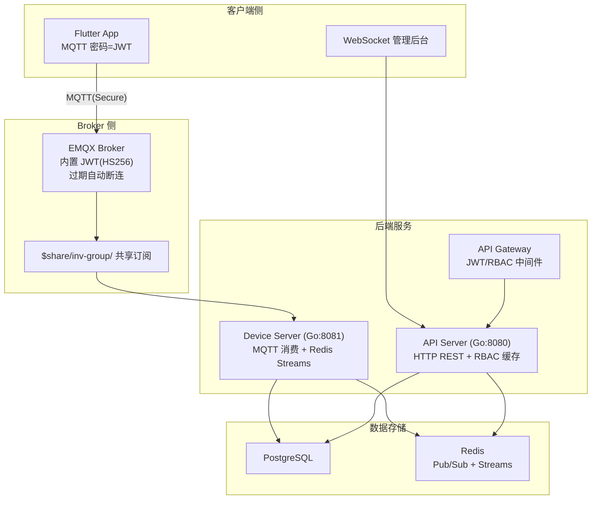
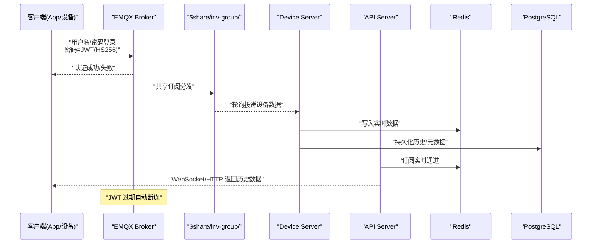
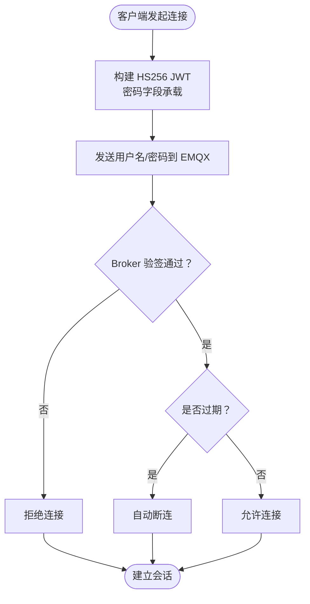
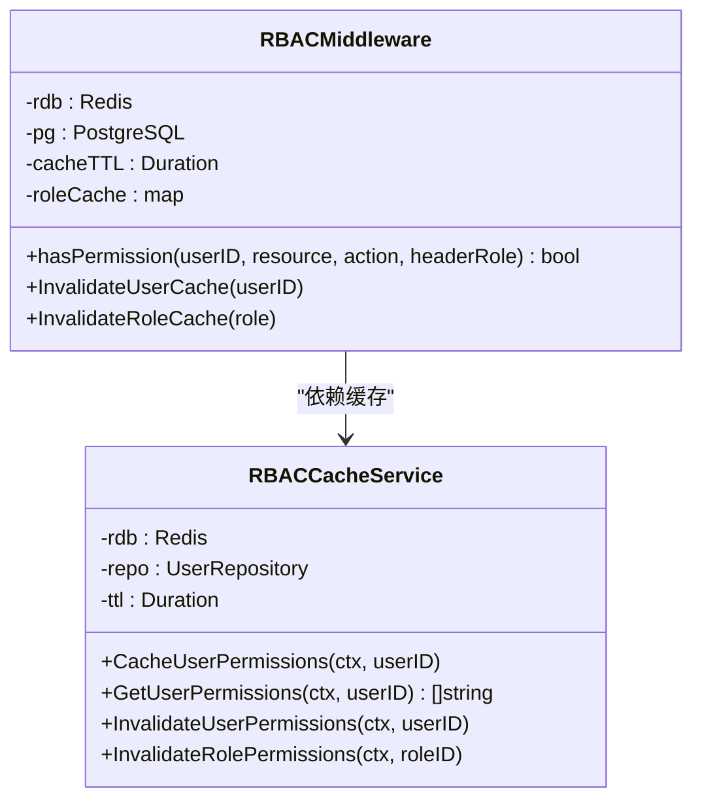
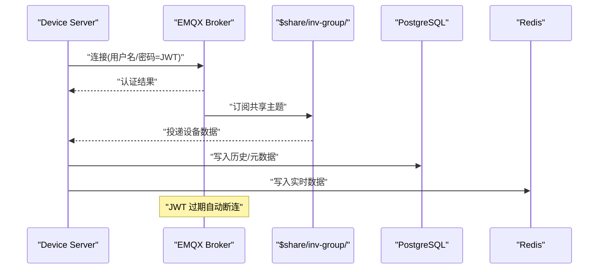
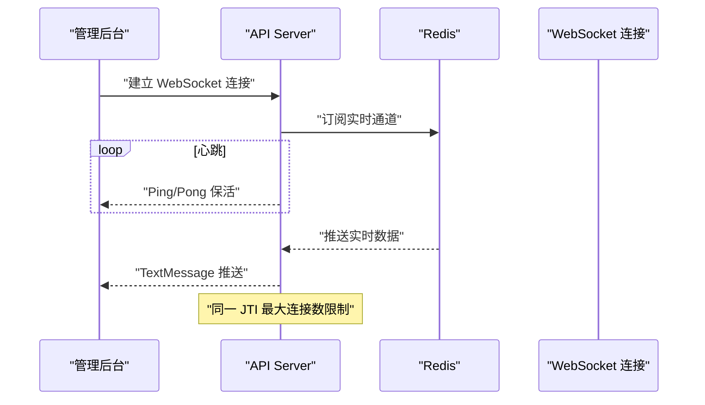
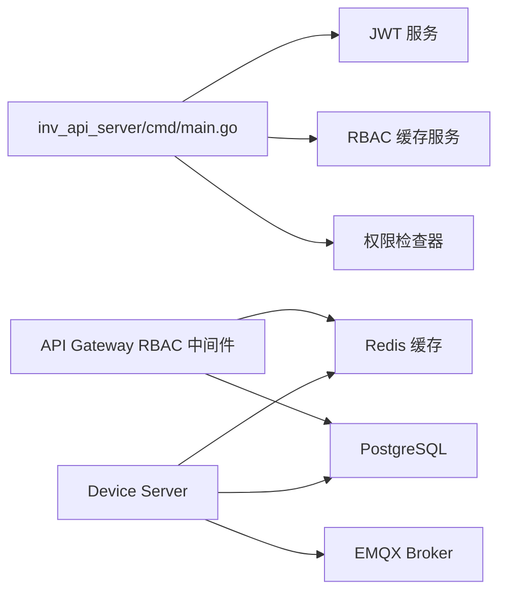

# 安全架构

<cite>
**本文引用的文件**
- [README.md](file://README.md)
- [inv_device_server/internal/mqtt/client.go](file://inv_device_server/internal/mqtt/client.go)
- [inv_api_server/internal/handler/ws_handler.go](file://inv_api_server/internal/handler/ws_handler.go)
- [api-gateway/internal/middleware/rbac.go](file://api-gateway/internal/middleware/rbac.go)
- [inv_api_server/internal/service/rbac_cache.go](file://inv_api_server/internal/service/rbac_cache.go)
- [inv_api_server/internal/repository/repositories.go](file://inv_api_server/internal/repository/repositories.go)
- [inv_api_server/cmd/main.go](file://inv_api_server/cmd/main.go)
- [deploy/configs/gateway.yaml](file://deploy/configs/gateway.yaml)
- [deploy/configs/device-server.yaml](file://deploy/configs/device-server.yaml)
- [deploy/scripts/test_login.py](file://deploy/scripts/test_login.py)
- [deploy/scripts/webhook_server.py](file://deploy/scripts/webhook_server.py)
</cite>

## 目录
1. [引言](#引言)
2. [项目结构](#项目结构)
3. [核心组件](#核心组件)
4. [架构总览](#架构总览)
5. [详细组件分析](#详细组件分析)
6. [依赖关系分析](#依赖关系分析)
7. [性能考量](#性能考量)
8. [故障排查指南](#故障排查指南)
9. [结论](#结论)
10. [附录](#附录)

## 引言
本文件面向安全工程师与开发者，系统性阐述 INV-MQTT 系统的安全架构与实现细节，重点覆盖：
- EMQX 内置 JWT（HS256）认证机制的原理与配置
- API 服务器与设备服务器的统一认证策略
- Token 过期处理与自动断连机制
- 共享订阅的安全访问控制与权限管理
- 安全配置示例与最佳实践

目标是帮助安全工程师快速落地，帮助开发者准确集成。

## 项目结构
系统采用“实时直连 EMQX + 历史查询经 API”的双通道设计，安全以 EMQX 内置 JWT 认证为核心，配合共享订阅与 RBAC 缓存实现高可用与细粒度权限控制。

图示来源
- [README.md: 5-30:5-30](file://README.md#L5-L30)
- [README.md: 155-167:155-167](file://README.md#L155-L167)
- [inv_device_server/internal/mqtt/client.go: 146-177:146-177](file://inv_device_server/internal/mqtt/client.go#L146-L177)

章节来源
- [README.md: 5-30:5-30](file://README.md#L5-L30)
- [README.md: 155-167:155-167](file://README.md#L155-L167)

## 核心组件
- EMQX 内置 JWT（HS256）认证：统一 Secret，密码字段承载 JWT，过期自动断连，保障设备与 App 的统一身份。
- 共享订阅（$share/inv-group/）：多实例自动轮询分发，确保高可用与负载均衡。
- API 网关与 RBAC 缓存：对用户角色与权限进行缓存与校验，降低数据库压力并提升响应速度。
- 设备服务器：通过 MQTT 订阅共享主题，消费设备数据并写入数据库与缓存。
- WebSocket 管理后台：基于 Redis Pub/Sub 实时推送设备数据。

章节来源
- [README.md: 155-167:155-167](file://README.md#L155-L167)
- [api-gateway/internal/middleware/rbac.go: 1-284:1-284](file://api-gateway/internal/middleware/rbac.go#L1-L284)
- [inv_api_server/internal/service/rbac_cache.go: 1-88:1-88](file://inv_api_server/internal/service/rbac_cache.go#L1-L88)
- [inv_device_server/internal/mqtt/client.go: 146-177:146-177](file://inv_device_server/internal/mqtt/client.go#L146-L177)

## 架构总览
下图展示从客户端到 Broker、再到后端服务与数据存储的整体安全流：

图示来源
- [README.md: 5-30:5-30](file://README.md#L5-L30)
- [README.md: 155-167:155-167](file://README.md#L155-L167)
- [inv_device_server/internal/mqtt/client.go: 146-177:146-177](file://inv_device_server/internal/mqtt/client.go#L146-L177)

## 详细组件分析

### EMQX 内置 JWT（HS256）认证机制
- 认证来源：客户端登录时，密码字段承载 JWT；Broker 通过内置 JWT 验签器验证 HS256 签名。
- Secret 管理：Broker 与 API Server 共享同一 Secret，确保签发与验签一致。
- 过期策略：开启“过期后断开连接”，避免过期 Token 继续访问。
- TLS 传输：建议使用 8883 端口进行加密传输，防止中间人攻击与重放。

图示来源
- [README.md: 155-167:155-167](file://README.md#L155-L167)

章节来源
- [README.md: 155-167:155-167](file://README.md#L155-L167)

### API 网关与 RBAC 权限控制
- 用户角色与权限缓存：通过 Redis 缓存用户角色与权限集合，减少数据库查询。
- 动态权限校验：根据请求路径与方法推导资源与动作，结合缓存进行快速判定。
- 缓存失效：当权限变更时，主动失效相关缓存键，保证一致性。

图示来源
- [api-gateway/internal/middleware/rbac.go: 1-284:1-284](file://api-gateway/internal/middleware/rbac.go#L1-L284)
- [inv_api_server/internal/service/rbac_cache.go: 1-88:1-88](file://inv_api_server/internal/service/rbac_cache.go#L1-L88)

章节来源
- [api-gateway/internal/middleware/rbac.go: 1-284:1-284](file://api-gateway/internal/middleware/rbac.go#L1-L284)
- [inv_api_server/internal/service/rbac_cache.go: 1-88:1-88](file://inv_api_server/internal/service/rbac_cache.go#L1-L88)
- [inv_api_server/internal/repository/repositories.go: 410-459:410-459](file://inv_api_server/internal/repository/repositories.go#L410-L459)

### 设备服务器的统一认证与共享订阅
- 认证策略：设备通过 MQTT 直连 EMQX，使用 JWT 密码完成认证，与 App 保持一致的 Secret。
- 共享订阅：所有设备数据订阅前缀为 $share/inv-group/，EMQX 轮询分发至多个 Device Server 实例，实现高可用。
- 过期断连：若 JWT 过期，EMQX 将自动断开连接，避免僵尸会话。

图示来源
- [README.md: 19-23:19-23](file://README.md#L19-L23)
- [inv_device_server/internal/mqtt/client.go: 146-177:146-177](file://inv_device_server/internal/mqtt/client.go#L146-L177)

章节来源
- [README.md: 19-23:19-23](file://README.md#L19-L23)
- [inv_device_server/internal/mqtt/client.go: 146-177:146-177](file://inv_device_server/internal/mqtt/client.go#L146-L177)

### WebSocket 管理后台推送与连接限制
- 连接模型：管理后台通过 WebSocket 订阅 Redis 实时通道，实现低延迟推送。
- 连接数限制：针对同一 JWT ID（JTI）设置最大并发连接数，防滥用。
- 心跳保活：定时 Ping/Pong 保持连接活跃，异常自动断开。

图示来源
- [inv_api_server/internal/handler/ws_handler.go: 58-122:58-122](file://inv_api_server/internal/handler/ws_handler.go#L58-L122)

章节来源
- [inv_api_server/internal/handler/ws_handler.go: 58-122:58-122](file://inv_api_server/internal/handler/ws_handler.go#L58-L122)

### Token 过期处理与自动断连机制
- Broker 端：启用“过期后断开连接”，确保过期会话不会继续占用资源。
- 客户端策略：建议在 App 侧监听断连事件，触发重新登录获取新 Token，并自动重连。
- 设备侧：Device Server 通过 MQTT 重连逻辑恢复订阅，确保数据连续性。

章节来源
- [README.md: 155-167:155-167](file://README.md#L155-L167)
- [inv_device_server/internal/mqtt/client.go: 226-236:226-236](file://inv_device_server/internal/mqtt/client.go#L226-L236)

### 共享订阅的安全访问控制与权限管理
- 共享订阅：$share/inv-group/ 前缀为主题前缀，EMQX 负责轮询分发，不改变认证与授权语义。
- 权限边界：设备主题命名空间为 cs_inv/{sn}/...，通过 RBAC 控制用户可访问的 SN 范围。
- 缓存一致性：权限变更时，主动失效 Redis 缓存键，确保下次请求命中最新策略。

章节来源
- [README.md: 19-23:19-23](file://README.md#L19-L23)
- [api-gateway/internal/middleware/rbac.go: 178-239:178-239](file://api-gateway/internal/middleware/rbac.go#L178-L239)
- [inv_api_server/internal/service/rbac_cache.go: 82-88:82-88](file://inv_api_server/internal/service/rbac_cache.go#L82-L88)

## 依赖关系分析
- API Server 启动时初始化 JWT 服务、RBAC 缓存与权限检查器，确保鉴权链路完整。
- API 网关中间件依赖 Redis 与数据库，提供统一的权限校验入口。
- 设备服务器依赖 EMQX 共享订阅，通过 MQTT 客户端库实现稳定连接与重连。

图示来源
- [inv_api_server/cmd/main.go: 102-124:102-124](file://inv_api_server/cmd/main.go#L102-L124)
- [api-gateway/internal/middleware/rbac.go: 1-42:1-42](file://api-gateway/internal/middleware/rbac.go#L1-L42)
- [inv_device_server/internal/mqtt/client.go: 146-177:146-177](file://inv_device_server/internal/mqtt/client.go#L146-L177)

章节来源
- [inv_api_server/cmd/main.go: 102-124:102-124](file://inv_api_server/cmd/main.go#L102-L124)
- [api-gateway/internal/middleware/rbac.go: 1-42:1-42](file://api-gateway/internal/middleware/rbac.go#L1-L42)
- [inv_device_server/internal/mqtt/client.go: 146-177:146-177](file://inv_device_server/internal/mqtt/client.go#L146-L177)

## 性能考量
- 缓存优先：RBAC 权限与用户角色优先从 Redis 读取，降低数据库压力。
- 连接复用：EMQX 共享订阅减少重复连接与重复数据处理。
- 心跳与断连：合理的 KeepAlive 与自动断连策略，避免僵尸连接占用资源。
- 并发控制：WebSocket 对同一 JTI 的连接数限制，防止资源被过度占用。

## 故障排查指南
- JWT 验证失败
  - 检查 Secret 是否与 Broker 配置一致
  - 确认 JWT 签名算法为 HS256，且密码字段承载 JWT
  - 核对过期时间，必要时调整
- 连接频繁断开
  - 检查 KeepAlive 与 SessionExpire 设置
  - 确认 Broker 已启用“过期后断开连接”
- 权限不足
  - 清理 Redis 缓存键并重试
  - 确认用户角色与权限规则已生效
- WebSocket 推送异常
  - 检查 Redis 订阅通道是否存在
  - 查看心跳保活与连接上限配置

章节来源
- [README.md: 155-167:155-167](file://README.md#L155-L167)
- [api-gateway/internal/middleware/rbac.go: 256-275:256-275](file://api-gateway/internal/middleware/rbac.go#L256-L275)
- [inv_api_server/internal/handler/ws_handler.go: 58-122:58-122](file://inv_api_server/internal/handler/ws_handler.go#L58-L122)

## 结论
本系统以 EMQX 内置 JWT（HS256）为核心，结合共享订阅与 RBAC 缓存，实现了统一认证、高可用分发与细粒度权限控制。通过合理的过期断连与连接限制策略，既保障了安全性，也兼顾了性能与稳定性。建议在生产环境严格管理 Secret、定期审计权限与连接行为，并持续优化缓存与订阅策略。

## 附录

### 安全配置示例（EMQX）
- 认证方式：JWT
- JWT 来自：password
- 加密方式：hmac-based
- Secret：与 API Server 共享
- 过期后断开连接：启用

章节来源
- [README.md: 155-167:155-167](file://README.md#L155-L167)

### 配置文件参考
- API 网关配置：用于定义路由与中间件
  - [deploy/configs/gateway.yaml](file://deploy/configs/gateway.yaml)
- 设备服务器配置：用于 MQTT 连接参数
  - [deploy/configs/device-server.yaml](file://deploy/configs/device-server.yaml)

章节来源
- [deploy/configs/gateway.yaml](file://deploy/configs/gateway.yaml)
- [deploy/configs/device-server.yaml](file://deploy/configs/device-server.yaml)

### 测试脚本参考
- 登录测试脚本
  - [deploy/scripts/test_login.py](file://deploy/scripts/test_login.py)
- Webhook 服务器脚本
  - [deploy/scripts/webhook_server.py](file://deploy/scripts/webhook_server.py)

章节来源
- [deploy/scripts/test_login.py](file://deploy/scripts/test_login.py)
- [deploy/scripts/webhook_server.py](file://deploy/scripts/webhook_server.py)