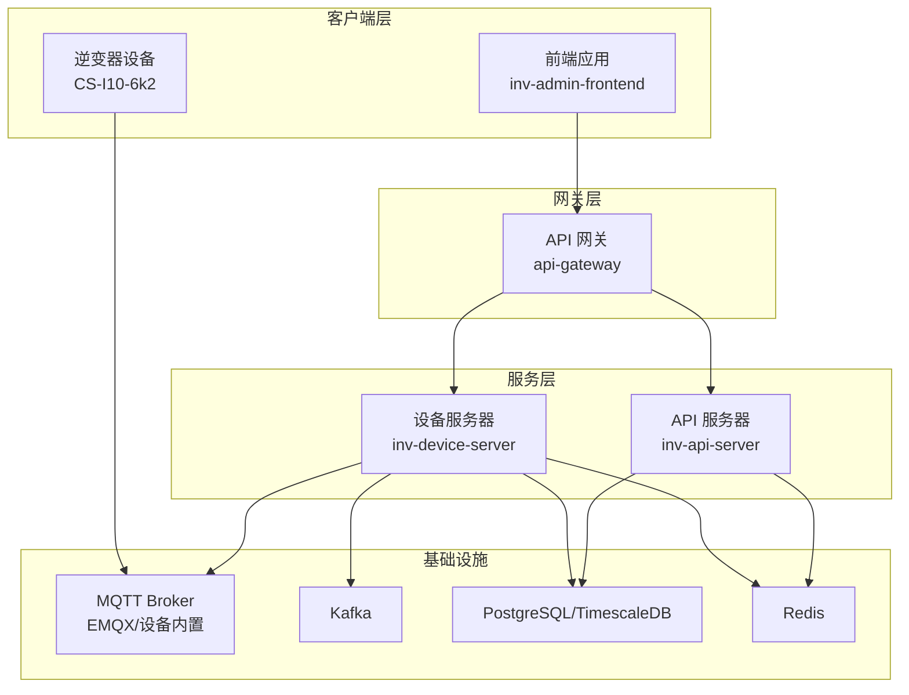
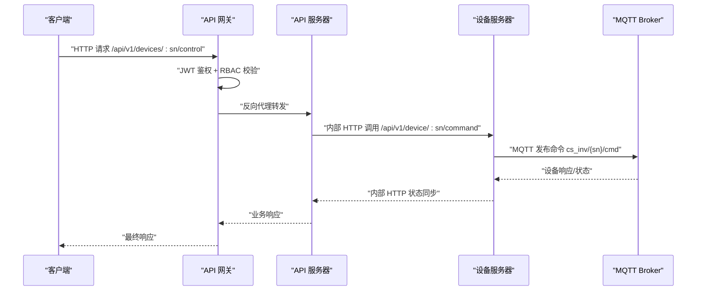
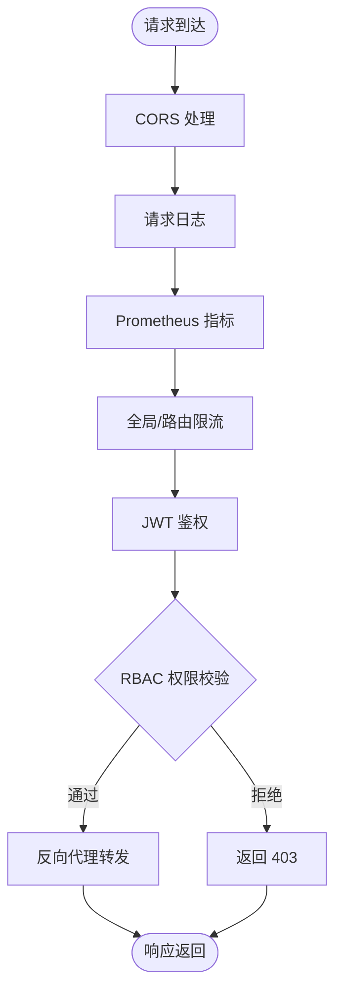
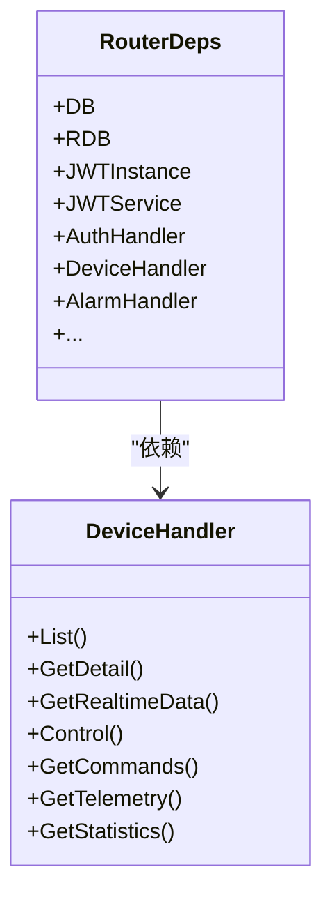
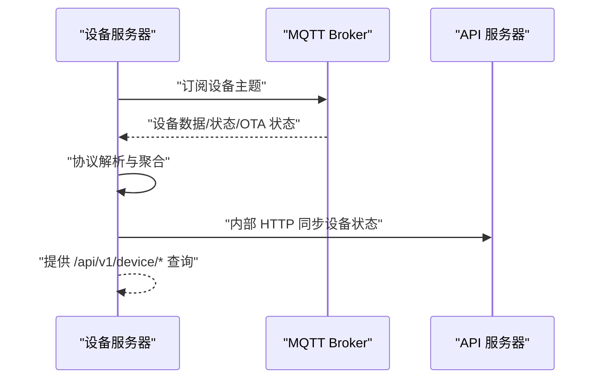
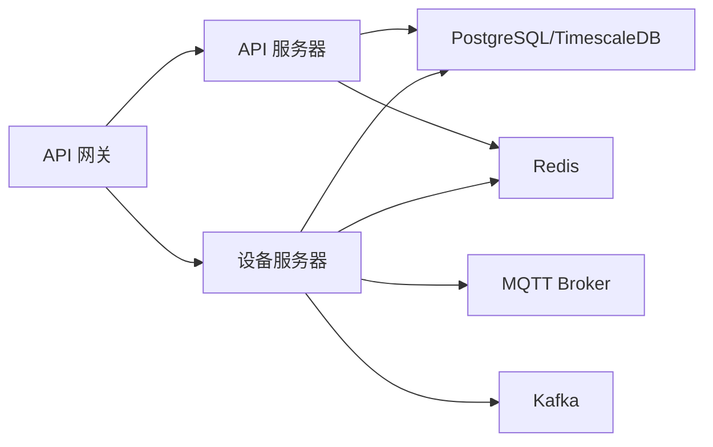

# 微服务架构设计

<cite>
**本文档引用的文件**
- [api-gateway/main.go](file://api-gateway/main.go)
- [api-gateway/internal/config/config.go](file://api-gateway/internal/config/config.go)
- [api-gateway/internal/routes/routes.go](file://api-gateway/internal/routes/routes.go)
- [api-gateway/internal/proxy/proxy.go](file://api-gateway/internal/proxy/proxy.go)
- [api-gateway/internal/middleware/rbac.go](file://api-gateway/internal/middleware/rbac.go)
- [inv_api_server/cmd/main.go](file://inv_api_server/cmd/main.go)
- [inv_api_server/internal/config/config.go](file://inv_api_server/internal/config/config.go)
- [inv_api_server/internal/middleware/auth.go](file://inv_api_server/internal/middleware/auth.go)
- [inv_api_server/internal/handler/device_handler.go](file://inv_api_server/internal/handler/device_handler.go)
- [inv_device_server/cmd/main.go](file://inv_device_server/cmd/main.go)
- [inv_device_server/internal/config/config.go](file://inv_device_server/internal/config/config.go)
- [inv_device_server/internal/service/data_service.go](file://inv_device_server/internal/service/data_service.go)
- [inv_device_server/internal/mqtt/client.go](file://inv_device_server/internal/mqtt/client.go)
- [deploy/docker-compose.full.yml](file://deploy/docker-compose.full.yml)
- [deploy/k8s-device-server.yaml](file://deploy/k8s-device-server.yaml)
- [docs/MQTT接口文档.md](file://docs/MQTT接口文档.md)
</cite>

## 目录
1. [引言](#引言)
2. [项目结构](#项目结构)
3. [核心组件](#核心组件)
4. [架构概览](#架构概览)
5. [详细组件分析](#详细组件分析)
6. [依赖关系分析](#依赖关系分析)
7. [性能考虑](#性能考虑)
8. [故障排查指南](#故障排查指南)
9. [结论](#结论)
10. [附录](#附录)

## 引言
本文件面向架构师与开发者，系统性阐述 INV-MQTT 微服务架构的设计与实现，重点说明三个核心服务（API 网关、API 服务器、设备服务器）的职责划分、边界设计、服务间通信机制、数据流转与协作模式，并给出部署与运维建议。该系统采用“网关 + 业务服务 + 边缘服务”的三层架构，结合 MQTT/EMQX/Kafka 生态实现设备数据的实时采集、处理与控制。

## 项目结构
仓库采用多模块微服务布局，核心目录与职责如下：
- api-gateway：统一入口网关，负责路由转发、鉴权、限流、指标暴露与 RBAC 权限控制
- inv_api_server：业务 API 服务器，提供用户、设备、告警、OTA、仪表盘等 REST 接口，承载业务逻辑与领域服务
- inv_device_server：设备边缘服务，负责 MQTT/Kafka 订阅、协议解析、命令下发、设备状态同步与指标导出
- deploy：容器编排与部署脚本，包含 docker-compose 与 Kubernetes 配置
- docs：MQTT 接口规范与架构升级计划等技术文档

图表来源
- [deploy/docker-compose.full.yml:1-179](file://deploy/docker-compose.full.yml#L1-L179)
- [api-gateway/internal/routes/routes.go:25-55](file://api-gateway/internal/routes/routes.go#L25-L55)

章节来源
- [deploy/docker-compose.full.yml:1-179](file://deploy/docker-compose.full.yml#L1-L179)
- [api-gateway/internal/config/config.go:10-87](file://api-gateway/internal/config/config.go#L10-L87)

## 核心组件
- API 网关（api-gateway）
  - 统一入口，集中处理 CORS、日志、限流、Prometheus 指标、JWT 鉴权与 RBAC 权限控制
  - 基于反向代理将请求转发至 API 服务器或设备服务器
  - 提供健康检查、API 文档与指标端点
- API 服务器（inv-api-server）
  - 提供完整的 REST API，包括认证、设备管理、告警、OTA、仪表盘、用户与管理后台接口
  - 依赖 PostgreSQL/TimescaleDB 存储业务数据，Redis 缓存与会话
  - 内部通过 HTTP 调用设备服务器的 /api/v1/device/* 与 /api/v1/stats/* 接口
- 设备服务器（inv_device_server）
  - 通过 MQTT 订阅设备数据与状态，或通过 Kafka 消费协议解析后的遥测与告警
  - 提供设备在线状态查询、实时数据查询、命令下发等接口
  - 与 API 服务器通过内部 HTTP 接口进行设备状态与信息同步

章节来源
- [api-gateway/main.go:21-94](file://api-gateway/main.go#L21-L94)
- [inv_api_server/cmd/main.go:36-86](file://inv_api_server/cmd/main.go#L36-L86)
- [inv_device_server/cmd/main.go:34-187](file://inv_device_server/cmd/main.go#L34-L187)

## 架构概览
系统采用“网关 + 业务 + 边缘”的分层架构：
- 网关层：API 网关统一接入，实施统一的安全与治理策略
- 业务层：API 服务器承载业务域，设备服务器专注设备协议与实时数据
- 基础设施：MQTT/EMQX 与 Kafka 实现设备数据的高吞吐采集与解耦；PostgreSQL/TimescaleDB 与 Redis 提供持久化与缓存

图表来源
- [api-gateway/internal/routes/routes.go:73-111](file://api-gateway/internal/routes/routes.go#L73-L111)
- [inv_device_server/internal/service/data_service.go:66-75](file://inv_device_server/internal/service/data_service.go#L66-L75)
- [docs/MQTT接口文档.md:509-611](file://docs/MQTT接口文档.md#L509-L611)

## 详细组件分析

### API 网关（api-gateway）
- 职责与边界
  - 统一入口与出口，集中处理跨域、日志、限流、指标与鉴权
  - 通过反向代理将 /api/v1/* 路由转发至 API 服务器，将 /api/v1/device/* 与 /api/v1/stats/* 路由转发至设备服务器
  - 提供 /api/docs、/metrics、/health 等网关专属端点
- 安全与治理
  - JWT 鉴权：从 Authorization 头解析 Bearer Token
  - RBAC 权限：基于 Redis 缓存的角色权限矩阵，支持资源粒度的权限校验
  - 速率限制：全局与路由级限流配置
- 配置与部署
  - 支持 YAML 配置文件与环境变量覆盖
  - 默认后端地址指向 inv-api-server 与 inv-device-server

图表来源
- [api-gateway/internal/routes/routes.go:25-55](file://api-gateway/internal/routes/routes.go#L25-L55)
- [api-gateway/internal/middleware/rbac.go:190-239](file://api-gateway/internal/middleware/rbac.go#L190-L239)

章节来源
- [api-gateway/main.go:21-94](file://api-gateway/main.go#L21-L94)
- [api-gateway/internal/config/config.go:57-87](file://api-gateway/internal/config/config.go#L57-L87)
- [api-gateway/internal/routes/routes.go:25-125](file://api-gateway/internal/routes/routes.go#L25-L125)
- [api-gateway/internal/proxy/proxy.go:21-68](file://api-gateway/internal/proxy/proxy.go#L21-L68)
- [api-gateway/internal/middleware/rbac.go:32-176](file://api-gateway/internal/middleware/rbac.go#L32-L176)

### API 服务器（inv-api-server）
- 职责与边界
  - 提供完整的业务 API，包括用户认证、设备管理、告警、OTA、仪表盘、并机配置、管理后台等
  - 通过内部 HTTP 接口与设备服务器协作，实现设备状态与信息的同步
- 数据与存储
  - PostgreSQL/TimescaleDB 存储业务数据，Redis 提供缓存与会话
  - 支持健康检查与降级模式（无数据库时提供有限能力）
- 配置与启动
  - 支持 YAML 配置与环境变量覆盖，包含 JWT、数据库、Redis、短信、邮件、日志等配置项

图表来源
- [inv_api_server/cmd/main.go:324-342](file://inv_api_server/cmd/main.go#L324-L342)
- [inv_api_server/internal/handler/device_handler.go:20-30](file://inv_api_server/internal/handler/device_handler.go#L20-L30)

章节来源
- [inv_api_server/cmd/main.go:36-86](file://inv_api_server/cmd/main.go#L36-L86)
- [inv_api_server/internal/config/config.go:99-199](file://inv_api_server/internal/config/config.go#L99-L199)
- [inv_api_server/internal/middleware/auth.go:15-56](file://inv_api_server/internal/middleware/auth.go#L15-L56)

### 设备服务器（inv_device_server）
- 职责与边界
  - 通过 MQTT 订阅设备数据与状态，或通过 Kafka 消费协议解析后的遥测与告警
  - 提供设备在线状态查询、实时数据查询、命令下发等接口
  - 与 API 服务器通过内部 HTTP 接口进行设备状态与信息同步
- 通信机制
  - MQTT：订阅 cs_inv/+/data/#、cs_inv/+/status、cs_inv/+/ota/status 等主题
  - Kafka：消费遥测与告警主题，生产者为 MQTT-Kafka Bridge
  - HTTP：对外提供 /api/v1/device/* 与 /api/v1/stats/* 接口
- 配置与部署
  - 支持 YAML 配置与环境变量覆盖，包含数据库、Redis、MQTT、Kafka、后端 API 地址等

图表来源
- [inv_device_server/internal/mqtt/client.go:136-235](file://inv_device_server/internal/mqtt/client.go#L136-L235)
- [inv_device_server/internal/service/data_service.go:93-142](file://inv_device_server/internal/service/data_service.go#L93-L142)
- [docs/MQTT接口文档.md:50-90](file://docs/MQTT接口文档.md#L50-L90)

章节来源
- [inv_device_server/cmd/main.go:34-187](file://inv_device_server/cmd/main.go#L34-L187)
- [inv_device_server/internal/config/config.go:82-162](file://inv_device_server/internal/config/config.go#L82-L162)
- [inv_device_server/internal/mqtt/client.go:29-134](file://inv_device_server/internal/mqtt/client.go#L29-L134)
- [inv_device_server/internal/service/data_service.go:33-100](file://inv_device_server/internal/service/data_service.go#L33-L100)

## 依赖关系分析
- 服务间依赖
  - API 网关依赖 API 服务器与设备服务器
  - API 服务器依赖 PostgreSQL/TimescaleDB、Redis
  - 设备服务器依赖 MQTT/EMQX、Kafka、PostgreSQL/Redis
- 外部依赖
  - 设备端协议：遵循 MQTT 接口文档中的主题与 Payload 规范
  - 部署：docker-compose 与 Kubernetes 提供容器化与弹性伸缩能力

图表来源
- [deploy/docker-compose.full.yml:1-179](file://deploy/docker-compose.full.yml#L1-L179)
- [api-gateway/internal/config/config.go:40-43](file://api-gateway/internal/config/config.go#L40-L43)

章节来源
- [deploy/docker-compose.full.yml:1-179](file://deploy/docker-compose.full.yml#L1-L179)
- [deploy/k8s-device-server.yaml:1-126](file://deploy/k8s-device-server.yaml#L1-L126)

## 性能考虑
- 网关层
  - 限流与熔断：全局与路由级限流，避免雪崩效应
  - 指标监控：Prometheus 指标暴露，便于观测与告警
- 服务层
  - API 服务器：数据库连接池配置、Redis 缓存命中优化、JWT 黑名单与令牌回收
  - 设备服务器：MQTT/Kafka 高吞吐订阅、命令通道异步处理、设备在线状态缓存
- 基础设施
  - TimescaleDB 时序数据优化、Redis LRU 策略与内存上限
  - Kafka 分区与副本策略，确保高吞吐与可靠性

## 故障排查指南
- 网关层
  - /health：确认网关自身健康状态
  - /metrics：查看 Prometheus 指标，定位延迟与错误
  - RBAC：检查用户角色与权限缓存是否生效
- 服务层
  - API 服务器：检查数据库与 Redis 连接、JWT 密钥配置、内部 HTTP 调用链
  - 设备服务器：检查 MQTT/Kafka 连接、设备在线状态缓存、命令通道积压
- 设备层
  - MQTT 主题订阅：确认 cs_inv/+/data/#、cs_inv/+/status、cs_inv/+/ota/status 是否正确
  - 命令下发：确认 cs_inv/{sn}/cmd 与 cs_inv/{sn}/ota/cmd 主题与 Payload 格式

章节来源
- [api-gateway/internal/routes/routes.go:57-71](file://api-gateway/internal/routes/routes.go#L57-L71)
- [inv_api_server/internal/middleware/auth.go:15-56](file://inv_api_server/internal/middleware/auth.go#L15-L56)
- [inv_device_server/internal/mqtt/client.go:136-235](file://inv_device_server/internal/mqtt/client.go#L136-L235)
- [docs/MQTT接口文档.md:509-611](file://docs/MQTT接口文档.md#L509-L611)

## 结论
本架构以 API 网关为核心入口，结合 API 服务器与设备服务器的清晰职责划分，配合 MQTT/EMQX/Kafka 的高吞吐数据通路，实现了设备监控与控制的高效协同。通过统一鉴权、限流与指标体系，保障了系统的安全性与可观测性；通过容器化与 Kubernetes 弹性伸缩，提升了系统的可维护性与可扩展性。

## 附录
- 部署与运维
  - docker-compose：一键拉起网关、API 服务器、设备服务器、数据库与缓存
  - Kubernetes：设备服务器支持水平扩展与自动伸缩
- 设备协议
  - 严格遵循 MQTT 接口文档的主题与 Payload 规范，确保设备与平台的兼容性

章节来源
- [deploy/docker-compose.full.yml:1-179](file://deploy/docker-compose.full.yml#L1-L179)
- [deploy/k8s-device-server.yaml:1-126](file://deploy/k8s-device-server.yaml#L1-L126)
- [docs/MQTT接口文档.md:1-647](file://docs/MQTT接口文档.md#L1-L647)