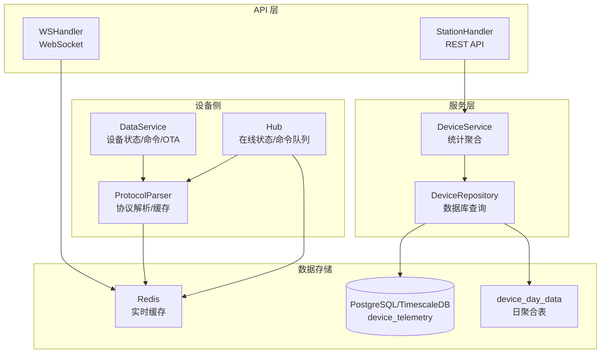
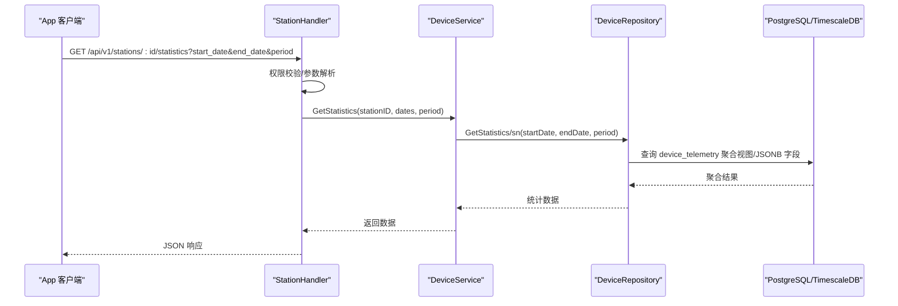
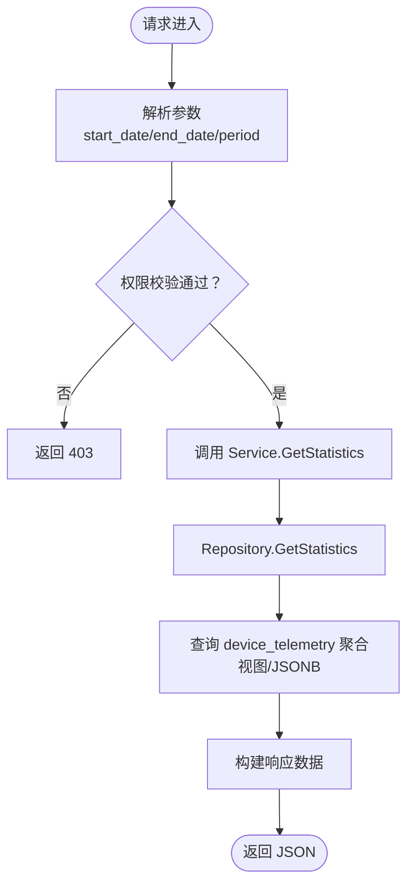
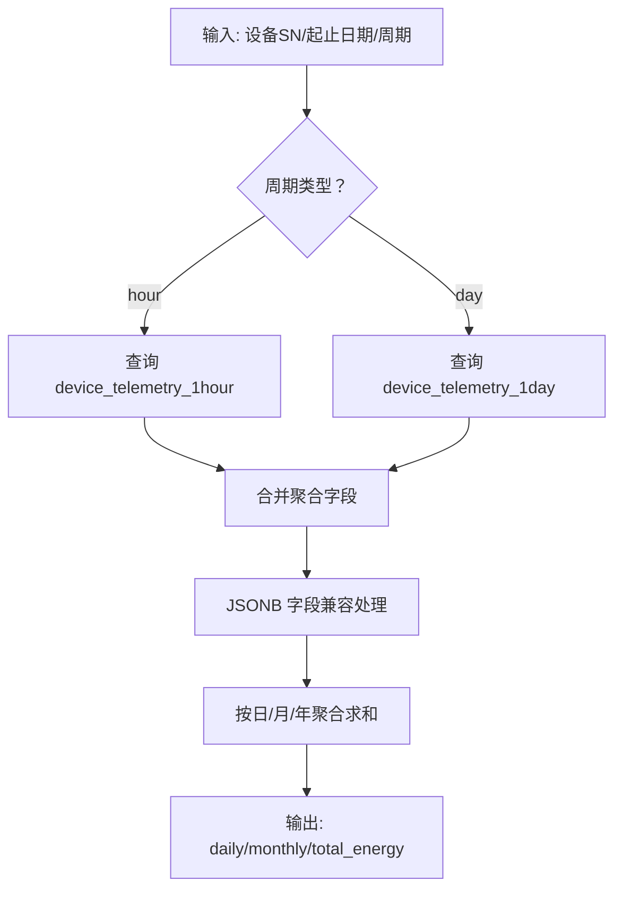
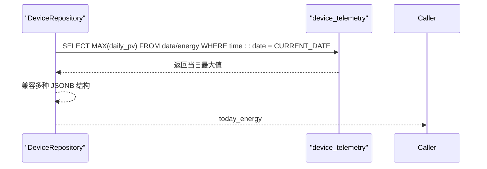
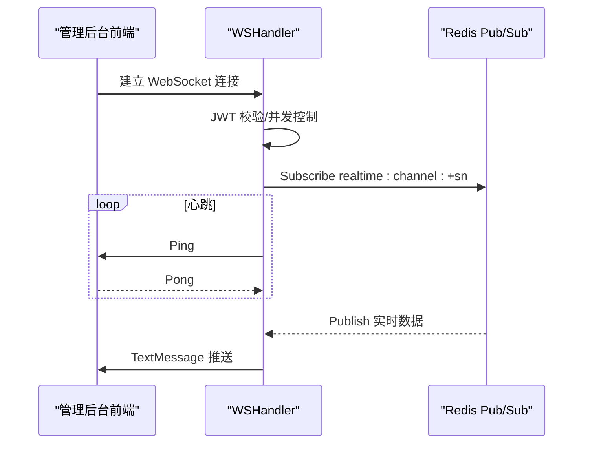
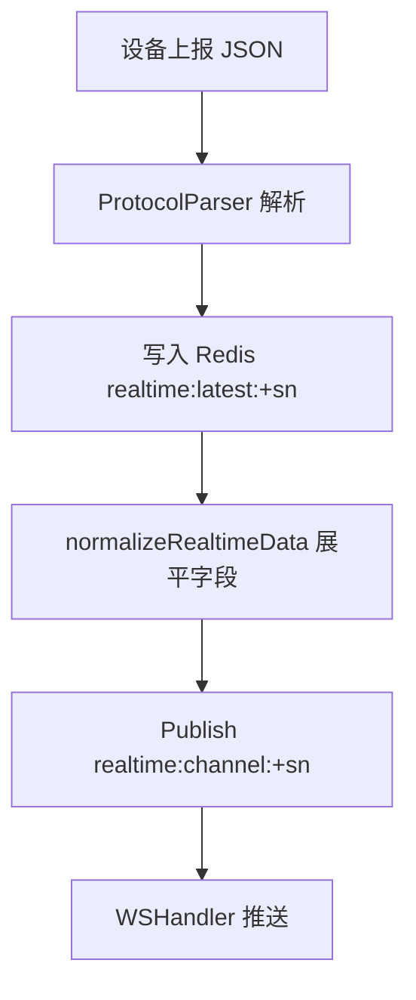
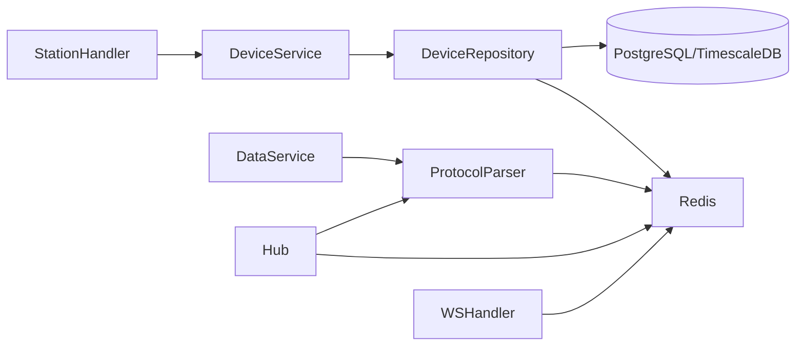

# 历史统计数据链路

<cite>
**本文档引用的文件**
- [station_handler.go](file://inv_api_server/internal/handler/station_handler.go)
- [repositories.go](file://inv_api_server/internal/repository/repositories.go)
- [ws_handler.go](file://inv_api_server/internal/handler/ws_handler.go)
- [data_service.go](file://inv_device_server/internal/service/data_service.go)
- [models.go](file://inv_api_server/internal/model/models.go)
- [protocol_parser.go](file://inv_device_server/internal/service/protocol_parser.go)
- [client.go](file://inv_device_server/internal/mqtt/client.go)
</cite>

## 目录
1. [简介](#简介)
2. [项目结构](#项目结构)
3. [核心组件](#核心组件)
4. [架构总览](#架构总览)
5. [详细组件分析](#详细组件分析)
6. [依赖关系分析](#依赖关系分析)
7. [性能考量](#性能考量)
8. [故障排查指南](#故障排查指南)
9. [结论](#结论)

## 简介
本文件面向 INV-MQTT 系统的历史统计数据链路，围绕 App 通过 HTTP REST API 访问历史数据与统计的核心流程进行系统化梳理。重点覆盖以下方面：
- API 请求处理与权限校验
- 数据库查询优化与响应格式
- 统计聚合机制（特别是电站统计 today_energy 从 device_day_data 实时聚合的实现原理）
- WebSocket 实时推送机制在管理后台的应用
- 历史数据查询的性能优化策略、缓存机制与数据一致性保障
- 开发者最佳实践与性能调优建议

## 项目结构
INV-MQTT 系统采用多模块分层架构：
- inv_api_server：对外 API 网关与业务处理层，负责 REST API、鉴权、统计聚合与响应封装
- inv_device_server：设备侧服务，负责 MQTT 消息接入、协议解析、实时数据缓存与内部通知
- inv-admin-frontend：管理后台前端，消费 WebSocket 实时数据并展示历史统计

图表来源
- [station_handler.go:639-671](file://inv_api_server/internal/handler/station_handler.go#L639-L671)
- [ws_handler.go:39-122](file://inv_api_server/internal/handler/ws_handler.go#L39-L122)
- [repositories.go:1854-1944](file://inv_api_server/internal/repository/repositories.go#L1854-L1944)
- [data_service.go:170-184](file://inv_device_server/internal/service/data_service.go#L170-L184)
- [protocol_parser.go:777-792](file://inv_device_server/internal/service/protocol_parser.go#L777-L792)
- [client.go:72-107](file://inv_device_server/internal/mqtt/client.go#L72-L107)

章节来源
- [station_handler.go:1-672](file://inv_api_server/internal/handler/station_handler.go#L1-L672)
- [ws_handler.go:1-122](file://inv_api_server/internal/handler/ws_handler.go#L1-L122)
- [repositories.go:1854-1944](file://inv_api_server/internal/repository/repositories.go#L1854-L1944)
- [data_service.go:1-483](file://inv_device_server/internal/service/data_service.go#L1-L483)
- [protocol_parser.go:777-792](file://inv_device_server/internal/service/protocol_parser.go#L777-L792)
- [client.go:72-107](file://inv_device_server/internal/mqtt/client.go#L72-L107)

## 核心组件
- StationHandler：提供电站统计与历史数据查询的 REST API，包含权限校验、参数解析与响应封装
- DeviceRepository：封装数据库查询逻辑，包括按天/小时聚合、JSONB 字段兼容与 TimescaleDB 视图查询
- WSHandler：基于 Redis Pub/Sub 的 WebSocket 实时推送通道，向管理后台推送设备实时数据
- DataService/ProtocolParser：设备侧服务，负责协议解析、实时数据缓存与设备状态/OTA通知
- Hub：维护设备在线状态、命令队列与设备统计

章节来源
- [station_handler.go:639-671](file://inv_api_server/internal/handler/station_handler.go#L639-L671)
- [repositories.go:1854-1944](file://inv_api_server/internal/repository/repositories.go#L1854-L1944)
- [ws_handler.go:39-122](file://inv_api_server/internal/handler/ws_handler.go#L39-L122)
- [data_service.go:170-184](file://inv_device_server/internal/service/data_service.go#L170-L184)
- [protocol_parser.go:777-792](file://inv_device_server/internal/service/protocol_parser.go#L777-L792)
- [client.go:72-107](file://inv_device_server/internal/mqtt/client.go#L72-L107)

## 架构总览
历史统计数据链路由以下步骤构成：
1. App 通过 REST API 请求历史统计数据（GetStatistics）
2. API 层进行权限校验与参数解析
3. 服务层调用仓库层执行数据库查询与聚合
4. 结果经统一响应封装返回
5. 管理后台通过 WebSocket 订阅实时数据通道，实现数据推送

图表来源
- [station_handler.go:639-671](file://inv_api_server/internal/handler/station_handler.go#L639-L671)
- [repositories.go:1854-1944](file://inv_api_server/internal/repository/repositories.go#L1854-L1944)

## 详细组件分析

### REST API：历史统计数据查询
- 权限控制：仅电站所属用户可访问
- 参数处理：默认起止日期与周期（day/hour），自动补全
- 调用链：Handler -> Service -> Repository -> DB
- 响应封装：Success 包装，便于前端统一处理

图表来源
- [station_handler.go:639-671](file://inv_api_server/internal/handler/station_handler.go#L639-L671)
- [repositories.go:1854-1944](file://inv_api_server/internal/repository/repositories.go#L1854-L1944)

章节来源
- [station_handler.go:639-671](file://inv_api_server/internal/handler/station_handler.go#L639-L671)

### 数据库查询与统计聚合
- JSONB 字段兼容：同时兼容 {"data":{"daily_pv":...}} 与扁平 {"daily_pv":...} 两种格式
- 今日发电量(today_energy)：从 device_telemetry 当日 data/energy topic 中取 daily_pv 的最大值
- 月/年/总发电量：按日聚合后求和，过滤无效数据
- TimescaleDB 视图：按小时/天粒度查询 device_telemetry_1hour/device_telemetry_1day
- Redis 缓存：实时功率汇总通过缓存键 realtime:latest:* 聚合

图表来源
- [repositories.go:1854-1944](file://inv_api_server/internal/repository/repositories.go#L1854-L1944)
- [repositories.go:1801-1852](file://inv_api_server/internal/repository/repositories.go#L1801-L1852)

章节来源
- [repositories.go:1854-1944](file://inv_api_server/internal/repository/repositories.go#L1854-L1944)
- [repositories.go:1801-1852](file://inv_api_server/internal/repository/repositories.go#L1801-L1852)

### 电站统计 today_energy 的实时聚合原理
- today_energy 字段来源于 device_telemetry 表当日 data/energy topic 的 daily_pv 最大值
- 仓库层通过 MAX(COALESCE(...)) 兼容多种 JSONB 结构，确保数据稳定性
- 该设计避免了额外的日聚合表写入开销，实现“准实时”聚合

图表来源
- [repositories.go:1351-1368](file://inv_api_server/internal/repository/repositories.go#L1351-L1368)
- [repositories.go:1858-1870](file://inv_api_server/internal/repository/repositories.go#L1858-L1870)

章节来源
- [repositories.go:1351-1368](file://inv_api_server/internal/repository/repositories.go#L1351-L1368)
- [repositories.go:1858-1870](file://inv_api_server/internal/repository/repositories.go#L1858-L1870)

### WebSocket 实时推送机制（管理后台）
- 认证：通过 token 校验，限制同一 JTI 并发连接数
- 通道：订阅 Redis Pub/Sub 主题 realtime:channel:+sn
- 心跳：定期 Ping/Pong 保活
- 数据：设备实时数据以文本消息推送到前端

图表来源
- [ws_handler.go:39-122](file://inv_api_server/internal/handler/ws_handler.go#L39-L122)

章节来源
- [ws_handler.go:39-122](file://inv_api_server/internal/handler/ws_handler.go#L39-L122)

### 设备侧实时数据缓存与推送
- 协议解析：将设备上报的 JSON 数据解析并缓存到 Redis，键为 realtime:latest:+sn
- 在线状态：Hub 维护设备在线时间戳，用于快速判定离线设备
- 数据归一化：normalizeRealtimeData 将嵌套字段展平，便于前端直接读取

图表来源
- [protocol_parser.go:777-792](file://inv_device_server/internal/service/protocol_parser.go#L777-L792)
- [client.go:72-107](file://inv_device_server/internal/mqtt/client.go#L72-L107)

章节来源
- [protocol_parser.go:777-792](file://inv_device_server/internal/service/protocol_parser.go#L777-L792)
- [client.go:72-107](file://inv_device_server/internal/mqtt/client.go#L72-L107)

## 依赖关系分析
- API 层依赖服务层；服务层依赖仓库层；仓库层依赖数据库与缓存
- 设备侧服务通过 ProtocolParser 写入 Redis，WSHandler 从 Redis 订阅推送
- Hub 提供设备在线状态与命令队列，支撑实时性与可靠性

图表来源
- [station_handler.go:639-671](file://inv_api_server/internal/handler/station_handler.go#L639-L671)
- [repositories.go:1854-1944](file://inv_api_server/internal/repository/repositories.go#L1854-L1944)
- [data_service.go:170-184](file://inv_device_server/internal/service/data_service.go#L170-L184)
- [protocol_parser.go:777-792](file://inv_device_server/internal/service/protocol_parser.go#L777-L792)
- [client.go:72-107](file://inv_device_server/internal/mqtt/client.go#L72-L107)
- [ws_handler.go:39-122](file://inv_api_server/internal/handler/ws_handler.go#L39-L122)

章节来源
- [station_handler.go:639-671](file://inv_api_server/internal/handler/station_handler.go#L639-L671)
- [repositories.go:1854-1944](file://inv_api_server/internal/repository/repositories.go#L1854-L1944)
- [data_service.go:170-184](file://inv_device_server/internal/service/data_service.go#L170-L184)
- [protocol_parser.go:777-792](file://inv_device_server/internal/service/protocol_parser.go#L777-L792)
- [client.go:72-107](file://inv_device_server/internal/mqtt/client.go#L72-L107)
- [ws_handler.go:39-122](file://inv_api_server/internal/handler/ws_handler.go#L39-L122)

## 性能考量
- 查询优化
  - 使用 TimescaleDB 连续聚合视图（device_telemetry_1hour/device_telemetry_1day）按粒度查询，减少全表扫描
  - JSONB 字段兼容使用 COALESCE，避免重复解析与多次查询
  - 按日期范围精确过滤，避免跨年/跨月全表扫描
- 缓存策略
  - Redis 缓存实时数据与在线状态，降低数据库压力
  - 实时功率汇总通过缓存键聚合，避免逐条设备查询
- 数据一致性
  - 今日发电量取自当日 data/energy topic 的最大值，天然保证“当日最新”
  - 设备在线状态通过 Hub 维护，结合 Redis hash 存储，避免过期导致误判
- 响应格式
  - 统一 Success 包装，字段命名兼顾前端需求与历史兼容（camelCase/snake_case）

章节来源
- [repositories.go:1801-1852](file://inv_api_server/internal/repository/repositories.go#L1801-L1852)
- [repositories.go:1351-1368](file://inv_api_server/internal/repository/repositories.go#L1351-L1368)
- [data_service.go:170-184](file://inv_device_server/internal/service/data_service.go#L170-L184)
- [client.go:72-107](file://inv_device_server/internal/mqtt/client.go#L72-L107)

## 故障排查指南
- WebSocket 连接问题
  - 检查 token 是否有效、并发连接是否超过阈值
  - 关注心跳 Ping/Pong 是否正常，网络波动可能导致断连
- 实时数据缺失
  - 确认设备已上线且 Hub 在线状态正确
  - 检查 Redis 键 realtime:latest:+sn 是否存在，Pub/Sub 主题是否订阅
- 统计数据异常
  - 核对 JSONB 字段结构，确认兼容路径是否生效
  - 检查 TimescaleDB 视图是否存在及数据是否更新
- 权限与参数
  - 确认请求用户与电站归属一致
  - 校验起止日期与周期参数是否符合预期

章节来源
- [ws_handler.go:39-122](file://inv_api_server/internal/handler/ws_handler.go#L39-L122)
- [client.go:72-107](file://inv_device_server/internal/mqtt/client.go#L72-L107)
- [repositories.go:1854-1944](file://inv_api_server/internal/repository/repositories.go#L1854-L1944)

## 结论
INV-MQTT 的历史统计数据链路通过 REST API + TimescaleDB 聚合 + Redis 缓存的组合，在保证实时性的同时实现了高效的历史数据查询。today_energy 的实时聚合设计简洁可靠，WebSocket 推送机制满足管理后台的实时监控需求。建议在生产环境中持续关注 TimescaleDB 的压缩与归档策略、Redis 缓存键清理与过期策略，并结合业务峰值流量进行容量规划与限流配置。