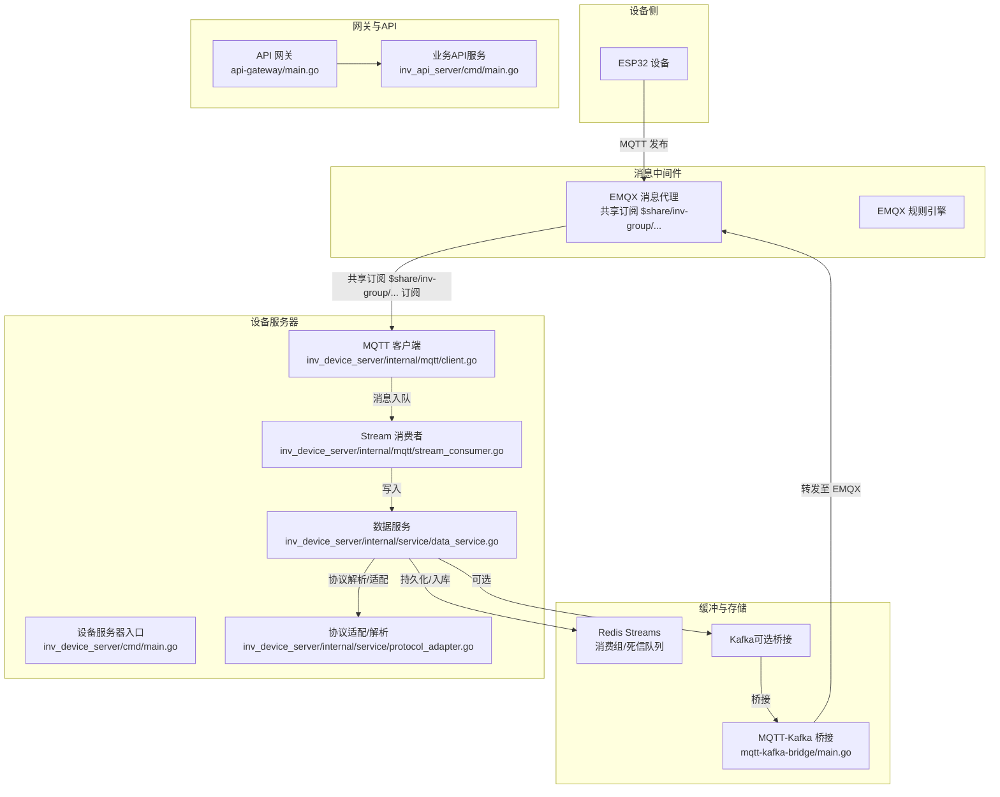
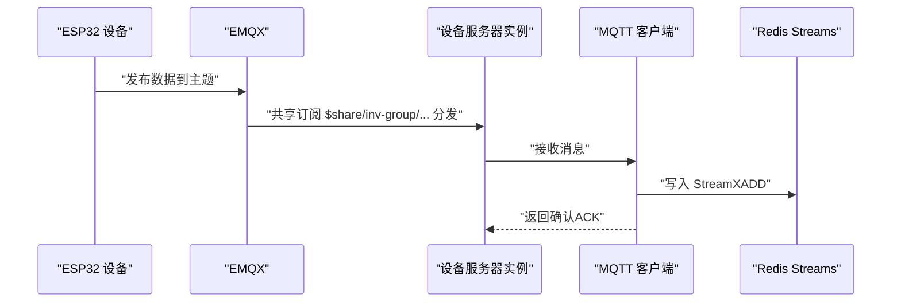
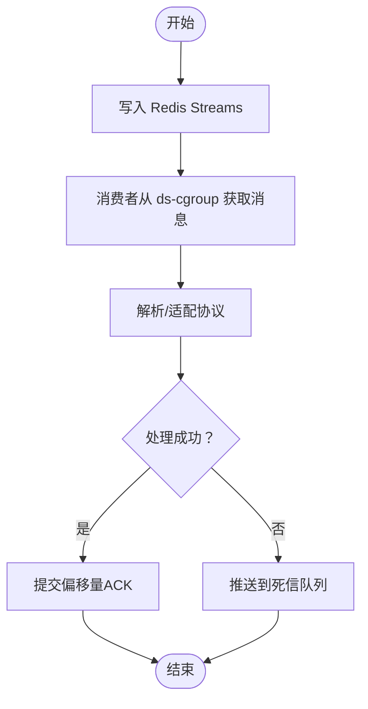
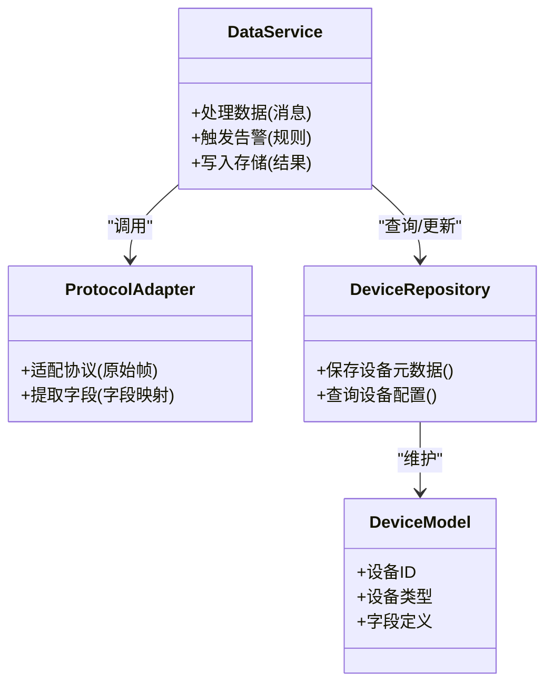
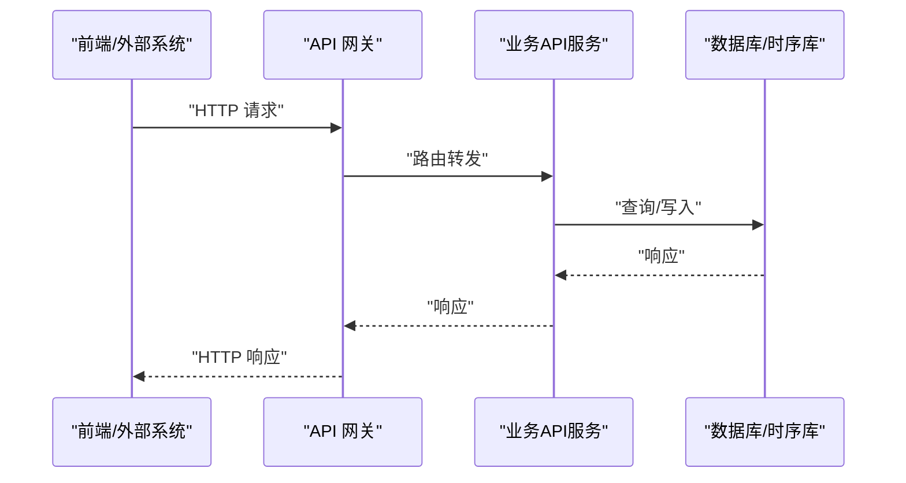
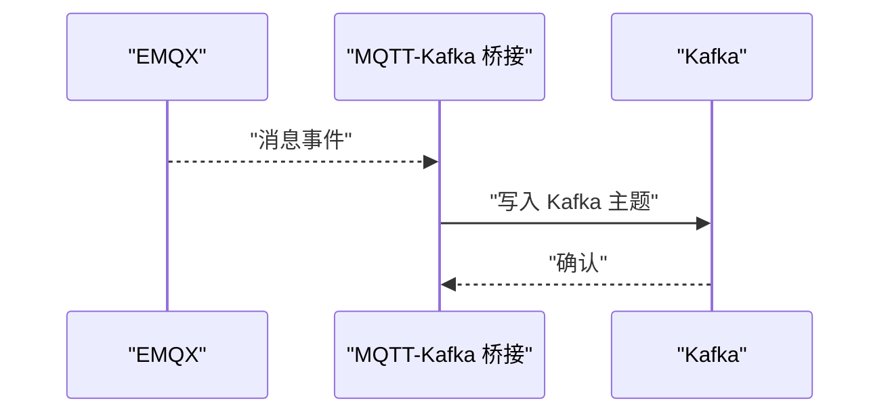
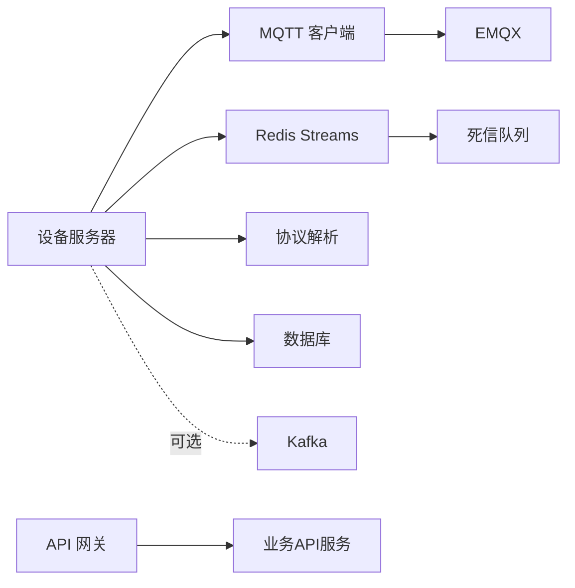

# 实时数据链路

<cite>
**本文档引用的文件**
- [inv_device_server/cmd/main.go](file://inv_device_server/cmd/main.go)
- [inv_device_server/internal/mqtt/client.go](file://inv_device_server/internal/mqtt/client.go)
- [inv_device_server/internal/mqtt/stream_consumer.go](file://inv_device_server/internal/mqtt/stream_consumer.go)
- [inv_device_server/internal/service/data_service.go](file://inv_device_server/internal/service/data_service.go)
- [inv_device_server/internal/service/protocol_adapter.go](file://inv_device_server/internal/service/protocol_adapter.go)
- [inv_device_server/internal/service/parse_rule.go](file://inv_device_server/internal/service/parse_rule.go)
- [inv_device_server/internal/repository/device_repository.go](file://inv_device_server/internal/repository/device_repository.go)
- [inv_device_server/internal/model/device.go](file://inv_device_server/internal/model/device.go)
- [inv_device_server/internal/config/config.go](file://inv_device_server/internal/config/config.go)
- [inv_api_server/cmd/main.go](file://inv_api_server/cmd/main.go)
- [inv_api_server/internal/config/config.go](file://inv_api_server/internal/config/config.go)
- [api-gateway/main.go](file://api-gateway/main.go)
- [api-gateway/internal/config/config.go](file://api-gateway/internal/config/config.go)
- [api-gateway/internal/routes/routes.go](file://api-gateway/internal/routes/routes.go)
- [deploy/docker-compose.yml](file://deploy/docker-compose.yml)
- [deploy/kafka-init-topics.sh](file://deploy/kafka-init-topics.sh)
- [mqtt-kafka-bridge/main.go](file://mqtt-kafka-bridge/main.go)
- [docs/MQTT接口文档.md](file://docs/MQTT接口文档.md)
- [docs/emqx_rule_engine_sql.md](file://docs/emqx_rule_engine_sql.md)
</cite>

## 目录
1. [引言](#引言)
2. [项目结构](#项目结构)
3. [核心组件](#核心组件)
4. [架构总览](#架构总览)
5. [详细组件分析](#详细组件分析)
6. [依赖关系分析](#依赖关系分析)
7. [性能考虑](#性能考虑)
8. [故障排除指南](#故障排除指南)
9. [结论](#结论)

## 引言
本文件面向开发者与运维工程师，系统化梳理 INV-MQTT 系统的实时数据链路：从 ESP32 设备通过 MQTT 发布数据，经由 EMQX 消息代理（支持共享订阅），到设备服务器（Device Server）的消费与处理，再到 Redis Streams 的缓冲、消费组管理与死信队列处理。文档提供完整的时序图与架构图，帮助读者快速理解并实施最佳实践。

## 项目结构
该仓库采用多模块微服务架构，围绕“设备侧 → 消息中间件 → 业务服务”的分层组织：
- 设备侧：ESP32 通过 MQTT 主题发布数据
- 消息中间件：EMQX（共享订阅、规则引擎）
- 设备服务器：接收 EMQX 转发或桥接后的消息，解析协议并入库
- 网关与API：对外提供查询与控制接口
- 缓冲与持久化：Redis Streams（消费组、死信队列）



图表来源
- [inv_device_server/cmd/main.go:1-200](file://inv_device_server/cmd/main.go#L1-L200)
- [inv_device_server/internal/mqtt/client.go:1-200](file://inv_device_server/internal/mqtt/client.go#L1-L200)
- [inv_device_server/internal/mqtt/stream_consumer.go:1-200](file://inv_device_server/internal/mqtt/stream_consumer.go#L1-L200)
- [inv_device_server/internal/service/data_service.go:1-200](file://inv_device_server/internal/service/data_service.go#L1-L200)
- [inv_device_server/internal/service/protocol_adapter.go:1-200](file://inv_device_server/internal/service/protocol_adapter.go#L1-L200)
- [api-gateway/main.go:1-200](file://api-gateway/main.go#L1-L200)
- [inv_api_server/cmd/main.go:1-200](file://inv_api_server/cmd/main.go#L1-L200)
- [mqtt-kafka-bridge/main.go:1-200](file://mqtt-kafka-bridge/main.go#L1-L200)

章节来源
- [deploy/docker-compose.yml:1-200](file://deploy/docker-compose.yml#L1-L200)

## 核心组件
- 设备服务器入口与配置
  - 入口：设备服务器通过命令行入口启动，加载配置并初始化 MQTT 客户端与消费者。
  - 配置：读取运行参数、MQTT 连接信息、Redis/数据库连接等。
- MQTT 客户端与共享订阅
  - 客户端：负责与 EMQX 建立持久连接，订阅共享订阅主题。
  - 共享订阅：使用 $share/inv-group/ 前缀，实现多实例间的负载均衡。
- Stream 消费者
  - 将 MQTT 到达的消息投递到 Redis Streams，建立消费组并进行 ACK 管理。
- 协议解析与数据服务
  - 解析设备协议，适配统一模型，执行业务逻辑（如告警、统计）。
- API 网关与后端服务
  - 网关负责路由与鉴权；后端服务提供查询与控制接口。
- 可选桥接：MQTT → Kafka
  - 通过桥接服务将 EMQX 中的数据同步到 Kafka，便于外部系统接入。

章节来源
- [inv_device_server/cmd/main.go:1-200](file://inv_device_server/cmd/main.go#L1-L200)
- [inv_device_server/internal/config/config.go:1-200](file://inv_device_server/internal/config/config.go#L1-L200)
- [inv_device_server/internal/mqtt/client.go:1-200](file://inv_device_server/internal/mqtt/client.go#L1-L200)
- [inv_device_server/internal/mqtt/stream_consumer.go:1-200](file://inv_device_server/internal/mqtt/stream_consumer.go#L1-L200)
- [inv_device_server/internal/service/data_service.go:1-200](file://inv_device_server/internal/service/data_service.go#L1-L200)
- [inv_device_server/internal/service/protocol_adapter.go:1-200](file://inv_device_server/internal/service/protocol_adapter.go#L1-L200)
- [api-gateway/main.go:1-200](file://api-gateway/main.go#L1-L200)
- [inv_api_server/cmd/main.go:1-200](file://inv_api_server/cmd/main.go#L1-L200)
- [mqtt-kafka-bridge/main.go:1-200](file://mqtt-kafka-bridge/main.go#L1-L200)

## 架构总览
下图展示从设备到最终存储的全链路架构，强调共享订阅与多实例负载均衡、消息缓冲与消费组管理。

```mermaid
graph TB
ESP32["ESP32 设备"] --> |"MQTT 发布"| EMQX["EMQX"]
EMQX --> |"共享订阅 $share/inv-group/... 订阅"| DS1["设备服务器实例1"]
EMQX --> |"共享订阅 $share/inv-group/... 订阅"| DS2["设备服务器实例2"]
EMQX --> |"共享订阅 $share/inv-group/... 订阅"| DSN["设备服务器实例N"]
DS1 --> |"消息入队"| RS["Redis Streams"]
DS2 --> |"消息入队"| RS
DSN --> |"消息入队"| RS
RS --> |"消费组 cgroup=ds-cgroup"| Consumer1["消费者1"]
RS --> |"消费组 cgroup=ds-cgroup"| Consumer2["消费者2"]
RS --> |"死信队列 dlq"| DLQ["死信队列处理"]
DS1 -.可选.->|"桥接"| KF["Kafka"]
KF -.可选.->|"桥接"| BR["MQTT-Kafka 桥接"]
BR --> |"转发至 EMQX"| EMQX
```

图表来源
- [inv_device_server/internal/mqtt/client.go:1-200](file://inv_device_server/internal/mqtt/client.go#L1-L200)
- [inv_device_server/internal/mqtt/stream_consumer.go:1-200](file://inv_device_server/internal/mqtt/stream_consumer.go#L1-L200)
- [mqtt-kafka-bridge/main.go:1-200](file://mqtt-kafka-bridge/main.go#L1-L200)

## 详细组件分析

### 设备服务器：MQTT 客户端与共享订阅
- 共享订阅机制
  - 使用 $share/inv-group/ 前缀的主题，确保同一消息仅被一个消费者实例接收，实现天然的负载均衡。
  - 多实例部署时，EMQX 将按订阅实例分发消息，避免重复处理。
- 连接与重连
  - 客户端在启动时建立持久连接，配置心跳、超时与重连策略，保证链路稳定性。
- 订阅与路由
  - 订阅主题后，消息进入内部队列，随后由消费者写入 Redis Streams。



图表来源
- [inv_device_server/internal/mqtt/client.go:1-200](file://inv_device_server/internal/mqtt/client.go#L1-L200)
- [inv_device_server/internal/mqtt/stream_consumer.go:1-200](file://inv_device_server/internal/mqtt/stream_consumer.go#L1-L200)

章节来源
- [inv_device_server/internal/mqtt/client.go:1-200](file://inv_device_server/internal/mqtt/client.go#L1-L200)
- [inv_device_server/internal/mqtt/stream_consumer.go:1-200](file://inv_device_server/internal/mqtt/stream_consumer.go#L1-L200)

### 设备服务器：Stream 消费者与消费组管理
- 消息缓冲与持久化
  - 所有到达的消息先写入 Redis Streams，具备高吞吐与持久化能力。
- 消费组与负载均衡
  - 创建消费组 ds-cgroup，多个消费者实例组成组内成员，实现水平扩展与负载均衡。
  - 消费者每次处理完成后提交偏移量（ACK），确保不丢失且不重复。
- 死信队列（DLQ）
  - 对于无法处理的消息，推送到死信队列，保留原始数据以便后续人工干预或重试。



图表来源
- [inv_device_server/internal/mqtt/stream_consumer.go:1-200](file://inv_device_server/internal/mqtt/stream_consumer.go#L1-L200)
- [inv_device_server/internal/service/data_service.go:1-200](file://inv_device_server/internal/service/data_service.go#L1-L200)

章节来源
- [inv_device_server/internal/mqtt/stream_consumer.go:1-200](file://inv_device_server/internal/mqtt/stream_consumer.go#L1-L200)
- [inv_device_server/internal/service/data_service.go:1-200](file://inv_device_server/internal/service/data_service.go#L1-L200)

### 设备服务器：协议解析与数据服务
- 协议适配
  - 将不同设备厂商的协议统一为内部模型，便于后续业务处理与存储。
- 数据服务
  - 执行业务规则（如阈值告警、统计聚合），并将结果写入数据库或缓存。
- 设备元数据与模型
  - 维护设备类型、字段定义、解析规则等，支撑动态解析与扩展。



图表来源
- [inv_device_server/internal/service/data_service.go:1-200](file://inv_device_server/internal/service/data_service.go#L1-L200)
- [inv_device_server/internal/service/protocol_adapter.go:1-200](file://inv_device_server/internal/service/protocol_adapter.go#L1-L200)
- [inv_device_server/internal/repository/device_repository.go:1-200](file://inv_device_server/internal/repository/device_repository.go#L1-L200)
- [inv_device_server/internal/model/device.go:1-200](file://inv_device_server/internal/model/device.go#L1-L200)

章节来源
- [inv_device_server/internal/service/data_service.go:1-200](file://inv_device_server/internal/service/data_service.go#L1-L200)
- [inv_device_server/internal/service/protocol_adapter.go:1-200](file://inv_device_server/internal/service/protocol_adapter.go#L1-L200)
- [inv_device_server/internal/repository/device_repository.go:1-200](file://inv_device_server/internal/repository/device_repository.go#L1-L200)
- [inv_device_server/internal/model/device.go:1-200](file://inv_device_server/internal/model/device.go#L1-L200)

### API 网关与后端服务
- API 网关
  - 提供统一入口、鉴权、限流、跨域等中间件能力，路由到后端服务。
- 后端服务
  - 提供设备监控、告警、报表等接口，支撑前端应用与外部系统集成。



图表来源
- [api-gateway/main.go:1-200](file://api-gateway/main.go#L1-L200)
- [api-gateway/internal/routes/routes.go:1-200](file://api-gateway/internal/routes/routes.go#L1-L200)
- [inv_api_server/cmd/main.go:1-200](file://inv_api_server/cmd/main.go#L1-L200)

章节来源
- [api-gateway/main.go:1-200](file://api-gateway/main.go#L1-L200)
- [api-gateway/internal/config/config.go:1-200](file://api-gateway/internal/config/config.go#L1-L200)
- [api-gateway/internal/routes/routes.go:1-200](file://api-gateway/internal/routes/routes.go#L1-L200)
- [inv_api_server/cmd/main.go:1-200](file://inv_api_server/cmd/main.go#L1-L200)
- [inv_api_server/internal/config/config.go:1-200](file://inv_api_server/internal/config/config.go#L1-L200)

### 可选桥接：MQTT → Kafka
- 场景
  - 当需要与 Kafka 生态系统集成时，可通过桥接服务将 EMQX 的消息同步到 Kafka。
- 流程
  - 桥接服务订阅 EMQX 主题，将消息写入 Kafka 主题，供下游系统消费。



图表来源
- [mqtt-kafka-bridge/main.go:1-200](file://mqtt-kafka-bridge/main.go#L1-L200)

章节来源
- [mqtt-kafka-bridge/main.go:1-200](file://mqtt-kafka-bridge/main.go#L1-L200)
- [deploy/kafka-init-topics.sh:1-200](file://deploy/kafka-init-topics.sh#L1-L200)

## 依赖关系分析
- 组件耦合
  - 设备服务器对 MQTT 客户端与 Redis Streams 有强依赖；协议解析与数据服务相对独立，便于扩展。
- 外部依赖
  - EMQX（共享订阅、规则引擎）、Redis（Streams/消费组）、可选 Kafka（桥接）。
- 部署与编排
  - 通过 docker-compose 启动各服务，支持横向扩展设备服务器实例以提升吞吐。



图表来源
- [inv_device_server/internal/mqtt/client.go:1-200](file://inv_device_server/internal/mqtt/client.go#L1-L200)
- [inv_device_server/internal/mqtt/stream_consumer.go:1-200](file://inv_device_server/internal/mqtt/stream_consumer.go#L1-L200)
- [api-gateway/main.go:1-200](file://api-gateway/main.go#L1-L200)
- [inv_api_server/cmd/main.go:1-200](file://inv_api_server/cmd/main.go#L1-L200)

章节来源
- [deploy/docker-compose.yml:1-200](file://deploy/docker-compose.yml#L1-L200)

## 性能考虑
- 共享订阅与多实例
  - 使用 $share/inv-group/ 实现天然负载均衡，建议根据设备数量与峰值流量增加设备服务器实例数。
- 消费组与并发
  - 合理设置消费者数量与分区/分片，避免单点瓶颈；确保 ACK 提交及时，减少重复处理。
- 缓冲与背压
  - Redis Streams 提供高吞吐缓冲，建议监控入队速率与消费速率，防止积压。
- 持久化与索引
  - 数据库层建议建立合适索引与分区策略，结合时序库优化查询性能。
- 网关与限流
  - API 网关开启限流与熔断，保护后端服务免受突发流量冲击。

## 故障排除指南
- MQTT 连接失败
  - 检查 EMQX 地址、认证信息与网络连通性；确认共享订阅主题拼写正确。
- 消息未入队/未消费
  - 核查 Redis Streams 是否正常，确认消费组 ds-cgroup 是否存在且消费者已加入。
- 死信队列堆积
  - 定期巡检 DLQ，定位异常消息格式或解析规则问题，修复后批量重放。
- Kafka 桥接异常
  - 检查桥接服务日志与 Kafka 连接状态，确认主题已创建并权限正确。
- 规则引擎与路由
  - 若消息未按预期转发，检查 EMQX 规则引擎 SQL 与动作配置。

章节来源
- [docs/emqx_rule_engine_sql.md:1-200](file://docs/emqx_rule_engine_sql.md#L1-L200)
- [docs/MQTT接口文档.md:1-200](file://docs/MQTT接口文档.md#L1-L200)

## 结论
本方案通过 EMQX 的共享订阅实现设备服务器多实例的自动负载均衡，借助 Redis Streams 的消费组与死信队列保障可靠性与可观测性，辅以外部 Kafka 桥接满足多样化集成需求。建议在生产环境持续监控关键指标（入队/出队速率、消费延迟、DLQ 队列长度），并根据业务增长弹性扩容设备服务器实例与数据库资源。