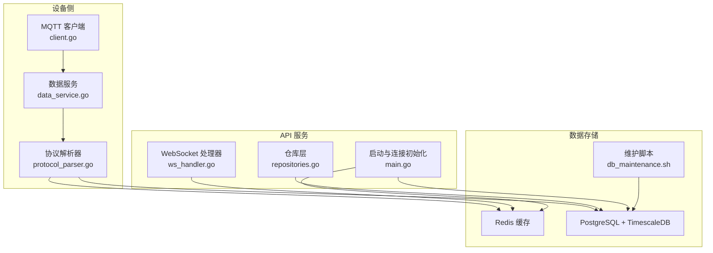
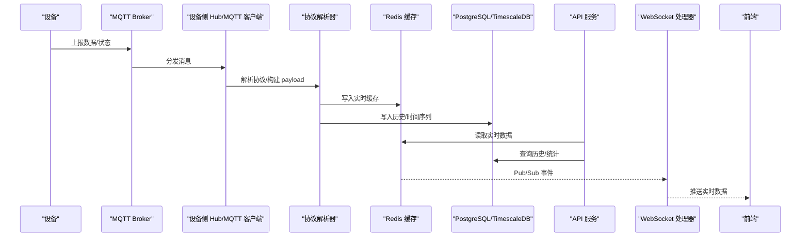
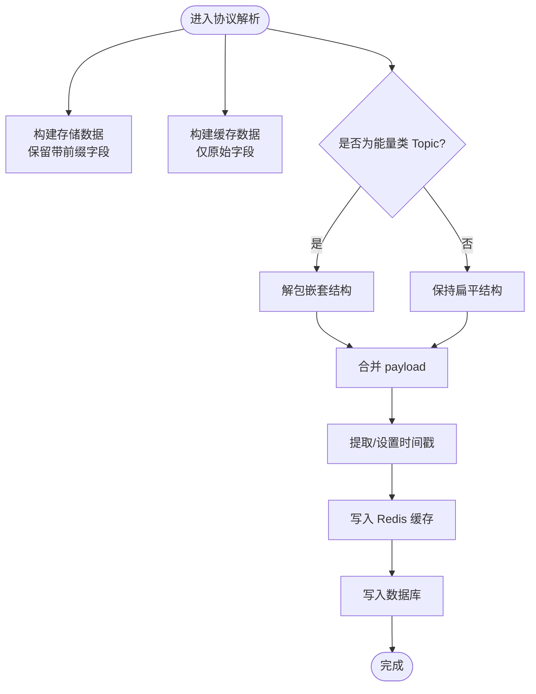
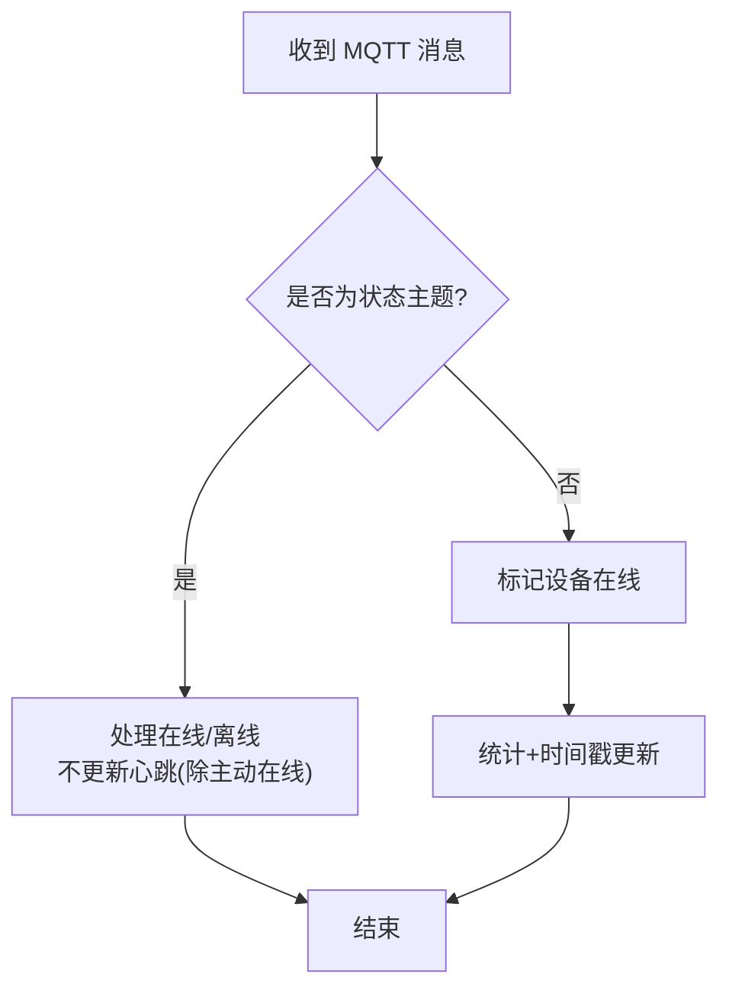
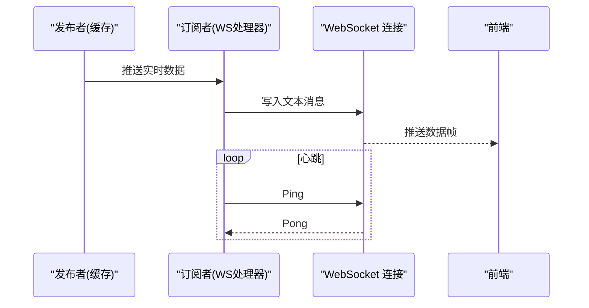
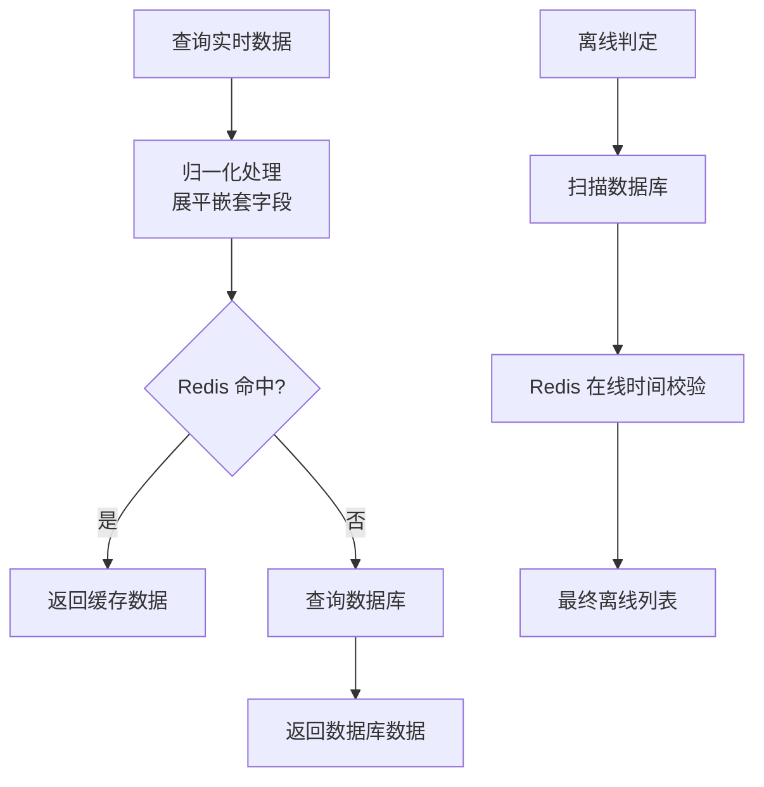
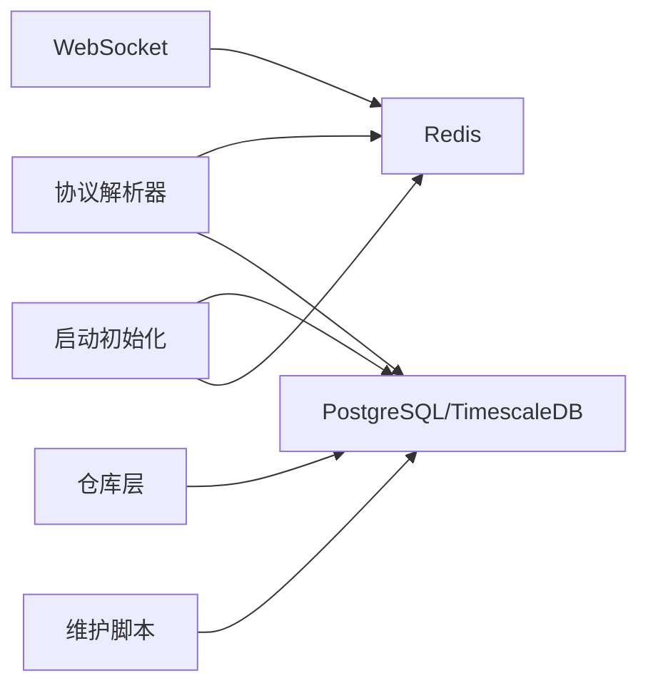

# 数据一致性与同步

<cite>
**本文引用的文件**
- [inv_device_server/internal/service/data_service.go](file://inv_device_server/internal/service/data_service.go)
- [inv_device_server/internal/service/protocol_parser.go](file://inv_device_server/internal/service/protocol_parser.go)
- [inv_device_server/internal/mqtt/client.go](file://inv_device_server/internal/mqtt/client.go)
- [inv_api_server/internal/repository/repositories.go](file://inv_api_server/internal/repository/repositories.go)
- [inv_api_server/internal/handler/ws_handler.go](file://inv_api_server/internal/handler/ws_handler.go)
- [inv_api_server/cmd/main.go](file://inv_api_server/cmd/main.go)
- [database/migrations/005_device_day_data_jsonb.up.sql](file://database/migrations/005_device_day_data_jsonb.up.sql)
- [deploy/scripts/db_maintenance.sh](file://deploy/scripts/db_maintenance.sh)
- [deploy/docker-compose.yml](file://deploy/docker-compose.yml)
</cite>

## 目录
1. [引言](#引言)
2. [项目结构](#项目结构)
3. [核心组件](#核心组件)
4. [架构总览](#架构总览)
5. [详细组件分析](#详细组件分析)
6. [依赖关系分析](#依赖关系分析)
7. [性能考虑](#性能考虑)
8. [故障排查指南](#故障排查指南)
9. [结论](#结论)
10. [附录](#附录)

## 引言
本文件围绕 INV-MQTT 系统的数据一致性与同步机制展开，重点覆盖以下方面：
- 实时数据与历史数据的同步策略，以及 Redis 缓存与 PostgreSQL 的一致性保障
- 设备状态实时更新链路：从设备上报到前端展示
- 冲突解决策略、事务处理与错误恢复机制
- WebSocket 推送的实时性保证与消息去重
- 数据一致性监控指标、同步延迟分析与性能优化建议
- 面向开发者的诊断与排障方法

## 项目结构
系统采用分层与模块化设计：
- 设备侧服务负责协议解析、数据清洗与写入 Redis 缓存，并通过内部 API 同步至后端
- API 服务负责对外提供 REST 接口、WebSocket 推送、查询与统计
- 数据库采用 TimescaleDB 扩展，支持时间序列高效存储与压缩
- 运维脚本负责数据归档、压缩与清理，保障长期运行稳定性

图表来源
- [inv_device_server/internal/service/data_service.go](file://inv_device_server/internal/service/data_service.go)
- [inv_device_server/internal/service/protocol_parser.go](file://inv_device_server/internal/service/protocol_parser.go)
- [inv_device_server/internal/mqtt/client.go](file://inv_device_server/internal/mqtt/client.go)
- [inv_api_server/internal/handler/ws_handler.go](file://inv_api_server/internal/handler/ws_handler.go)
- [inv_api_server/internal/repository/repositories.go](file://inv_api_server/internal/repository/repositories.go)
- [inv_api_server/cmd/main.go](file://inv_api_server/cmd/main.go)
- [deploy/scripts/db_maintenance.sh](file://deploy/scripts/db_maintenance.sh)

章节来源
- [inv_device_server/internal/service/data_service.go](file://inv_device_server/internal/service/data_service.go)
- [inv_device_server/internal/service/protocol_parser.go](file://inv_device_server/internal/service/protocol_parser.go)
- [inv_device_server/internal/mqtt/client.go](file://inv_device_server/internal/mqtt/client.go)
- [inv_api_server/internal/handler/ws_handler.go](file://inv_api_server/internal/handler/ws_handler.go)
- [inv_api_server/internal/repository/repositories.go](file://inv_api_server/internal/repository/repositories.go)
- [inv_api_server/cmd/main.go](file://inv_api_server/cmd/main.go)
- [deploy/scripts/db_maintenance.sh](file://deploy/scripts/db_maintenance.sh)

## 核心组件
- 设备数据服务：负责接收 MQTT 消息、解析协议、构建存储数据与缓存数据、写入 Redis 与数据库
- 协议解析器：统一解析不同 Topic 的数据格式，生成标准化 payload，并处理嵌套字段与时间戳
- MQTT 客户端：订阅设备主题，处理状态/OTA/命令等主题，维护在线状态与统计数据
- 仓库层：提供设备、告警、历史数据查询与聚合，支持 JSONB 字段与连续聚合
- WebSocket 处理器：基于 Redis Pub/Sub 订阅实时通道，向前端推送最新数据
- 启动与连接：统一初始化数据库连接池与 Redis 客户端，具备重试与健康检查
- 维护脚本：按策略清理历史数据、压缩旧数据块、刷新连续聚合

章节来源
- [inv_device_server/internal/service/data_service.go](file://inv_device_server/internal/service/data_service.go)
- [inv_device_server/internal/service/protocol_parser.go](file://inv_device_server/internal/service/protocol_parser.go)
- [inv_device_server/internal/mqtt/client.go](file://inv_device_server/internal/mqtt/client.go)
- [inv_api_server/internal/repository/repositories.go](file://inv_api_server/internal/repository/repositories.go)
- [inv_api_server/internal/handler/ws_handler.go](file://inv_api_server/internal/handler/ws_handler.go)
- [inv_api_server/cmd/main.go](file://inv_api_server/cmd/main.go)
- [deploy/scripts/db_maintenance.sh](file://deploy/scripts/db_maintenance.sh)

## 架构总览
系统以“设备 -> 协议解析 -> Redis 缓存 -> 数据库 -> API -> 前端”的链路实现数据一致性与实时性。

图表来源
- [inv_device_server/internal/mqtt/client.go](file://inv_device_server/internal/mqtt/client.go)
- [inv_device_server/internal/service/protocol_parser.go](file://inv_device_server/internal/service/protocol_parser.go)
- [inv_api_server/internal/handler/ws_handler.go](file://inv_api_server/internal/handler/ws_handler.go)
- [inv_api_server/internal/repository/repositories.go](file://inv_api_server/internal/repository/repositories.go)

## 详细组件分析

### 设备数据服务与协议解析
- 数据构建策略
  - 存储数据：保留带前缀字段，便于历史查询兼容
  - 缓存数据：仅保留原始字段，避免冗余
- 时间戳处理：优先使用 payload 中的 timestamp，否则回退到服务端时间
- 嵌套字段处理：对特定 Topic（如能量数据）进行嵌套结构解包与合并
- 设备信息同步：通过内部 API 将设备基础信息写入后端，并同步更新 Redis 缓存

图表来源
- [inv_device_server/internal/service/protocol_parser.go](file://inv_device_server/internal/service/protocol_parser.go)

章节来源
- [inv_device_server/internal/service/protocol_parser.go](file://inv_device_server/internal/service/protocol_parser.go)

### MQTT 客户端与在线状态管理
- 主题分类处理：区分状态主题（LWT）、OTA 状态/确认、命令结果等
- 在线状态维护：收到非状态主题消息即标记设备在线；LWT 离线消息不更新心跳，依靠 Redis 过期时间判定离线
- 统计与可观测性：累计接收数据量、记录最后数据到达时间

图表来源
- [inv_device_server/internal/mqtt/client.go](file://inv_device_server/internal/mqtt/client.go)

章节来源
- [inv_device_server/internal/mqtt/client.go](file://inv_device_server/internal/mqtt/client.go)

### WebSocket 实时推送与去重
- 订阅通道：每个设备独立的 Redis Pub/Sub 频道
- 心跳保活：定时 Ping，超时即断开
- 去重策略：前端基于唯一标识（如消息 ID 或时间戳）进行去重；服务端在消息队列层面可结合幂等键实现去重（需在上游实现）

图表来源
- [inv_api_server/internal/handler/ws_handler.go](file://inv_api_server/internal/handler/ws_handler.go)

章节来源
- [inv_api_server/internal/handler/ws_handler.go](file://inv_api_server/internal/handler/ws_handler.go)

### 仓库层与历史数据一致性
- 实时数据归一化：将嵌套字段展平到顶层，便于前端直接读取
- 离线设备判定：先查数据库，再用 Redis 最近在线时间做二次校验，避免误判
- 站点状态同步：根据设备状态动态更新站点状态
- 历史数据查询：支持多 Topic 聚合、JSONB 字段兼容读取与按小时聚合

图表来源
- [inv_api_server/internal/repository/repositories.go](file://inv_api_server/internal/repository/repositories.go)

章节来源
- [inv_api_server/internal/repository/repositories.go](file://inv_api_server/internal/repository/repositories.go)

### 启动与连接初始化
- 数据库连接池：配置最大连接数、生命周期、空闲时间，并带重试与健康检查
- Redis 连接：同样具备重试与健康检查
- 时区统一：服务端使用 UTC，前端按站点时区本地化显示

章节来源
- [inv_api_server/cmd/main.go](file://inv_api_server/cmd/main.go)

### 数据库与维护策略
- TimescaleDB：时间序列表启用压缩与连续聚合，降低存储与查询成本
- 维护脚本：定期删除过期数据（遥测90天、告警1年、命令日志6月、日粒度数据3年），并执行 VACUUM ANALYZE

章节来源
- [database/migrations/005_device_day_data_jsonb.up.sql](file://database/migrations/005_device_day_data_jsonb.up.sql)
- [deploy/scripts/db_maintenance.sh](file://deploy/scripts/db_maintenance.sh)

## 依赖关系分析
- 设备侧依赖 Redis 与数据库，通过协议解析器实现数据双写
- API 服务依赖 Redis 提升实时查询性能，依赖 PostgreSQL 获取历史与统计
- WebSocket 依赖 Redis Pub/Sub 实现低延迟推送
- 维护脚本与数据库层协作，确保长期内存与性能稳定

图表来源
- [inv_device_server/internal/service/protocol_parser.go](file://inv_device_server/internal/service/protocol_parser.go)
- [inv_api_server/internal/handler/ws_handler.go](file://inv_api_server/internal/handler/ws_handler.go)
- [inv_api_server/internal/repository/repositories.go](file://inv_api_server/internal/repository/repositories.go)
- [inv_api_server/cmd/main.go](file://inv_api_server/cmd/main.go)
- [deploy/scripts/db_maintenance.sh](file://deploy/scripts/db_maintenance.sh)

章节来源
- [inv_device_server/internal/service/protocol_parser.go](file://inv_device_server/internal/service/protocol_parser.go)
- [inv_api_server/internal/handler/ws_handler.go](file://inv_api_server/internal/handler/ws_handler.go)
- [inv_api_server/internal/repository/repositories.go](file://inv_api_server/internal/repository/repositories.go)
- [inv_api_server/cmd/main.go](file://inv_api_server/cmd/main.go)
- [deploy/scripts/db_maintenance.sh](file://deploy/scripts/db_maintenance.sh)

## 性能考虑
- 实时性
  - Redis 缓存命中优先，减少数据库压力
  - WebSocket 使用 Pub/Sub，降低轮询开销
- 历史查询
  - TimescaleDB 压缩与连续聚合显著降低存储与查询成本
  - JSONB 字段兼容读取，避免 schema 固化带来的迁移成本
- 连接与可用性
  - 数据库连接池与 Redis 客户端均具备重试与健康检查
  - 服务端统一时区，避免跨时区计算误差
- 运维
  - 定期清理过期数据，保持表规模可控
  - 维护脚本执行 VACUUM ANALYZE，提升查询性能

章节来源
- [inv_api_server/cmd/main.go](file://inv_api_server/cmd/main.go)
- [deploy/scripts/db_maintenance.sh](file://deploy/scripts/db_maintenance.sh)
- [database/migrations/005_device_day_data_jsonb.up.sql](file://database/migrations/005_device_day_data_jsonb.up.sql)

## 故障排查指南
- 设备离线误判
  - 现象：设备在线但被判定离线
  - 排查：检查数据库扫描与 Redis 在线时间校验逻辑
  - 处置：确认 Redis 中 device:online 对应 SN 的时间戳是否较新
- WebSocket 推送失败
  - 现象：前端无实时数据或连接频繁断开
  - 排查：检查 WS 心跳、订阅通道是否存在、Redis Pub/Sub 是否正常
  - 处置：重启 WS 服务或检查 Redis 连接状态
- 历史数据缺失
  - 现象：历史曲线或统计异常
  - 排查：确认维护脚本是否按计划执行、TimescaleDB 压缩策略是否生效
  - 处置：手动触发维护脚本或检查数据库权限
- 数据库连接抖动
  - 现象：服务启动阶段频繁重连
  - 排查：查看连接池参数与重试逻辑
  - 处置：调整 MaxConns、MaxConnLifetime 并检查网络连通性

章节来源
- [inv_api_server/internal/repository/repositories.go](file://inv_api_server/internal/repository/repositories.go)
- [inv_api_server/internal/handler/ws_handler.go](file://inv_api_server/internal/handler/ws_handler.go)
- [deploy/scripts/db_maintenance.sh](file://deploy/scripts/db_maintenance.sh)
- [inv_api_server/cmd/main.go](file://inv_api_server/cmd/main.go)

## 结论
本系统通过“协议解析 -> Redis 缓存 -> 数据库”的双写策略，结合 WebSocket Pub/Sub 推送与维护脚本，实现了设备数据的高实时性与长期一致性。仓库层对历史数据的兼容读取与聚合查询进一步提升了前端展示与分析能力。建议持续关注 Redis 命中率、数据库压缩效果与 WS 连接稳定性，以维持系统整体性能与可靠性。

## 附录
- Docker Compose 配置：用于编排各组件容器，便于本地与生产部署
- 监控与告警：结合 Prometheus/Grafana 面板，观测数据库与缓存健康状况

章节来源
- [deploy/docker-compose.yml](file://deploy/docker-compose.yml)