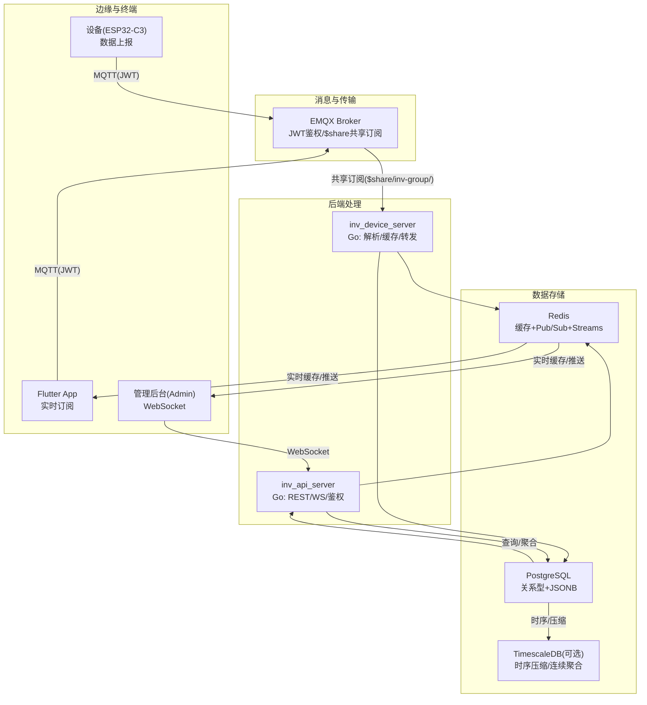
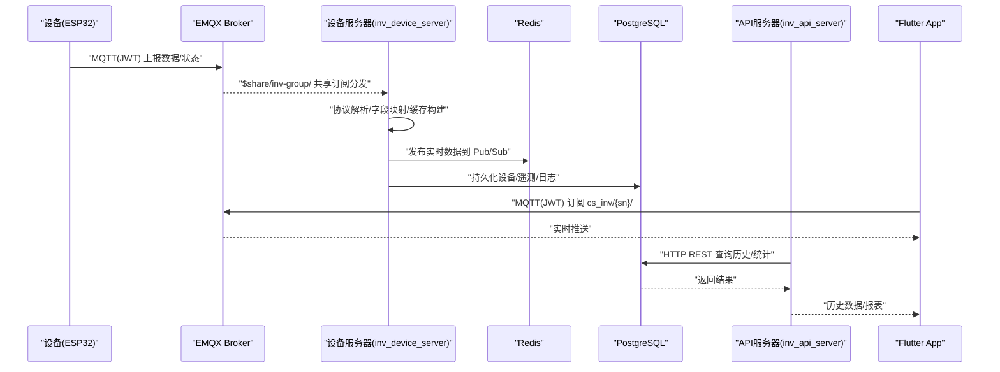
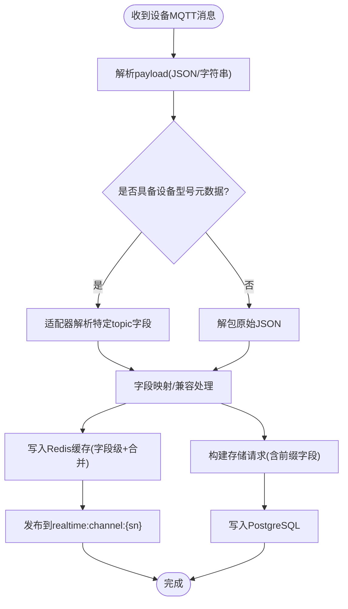
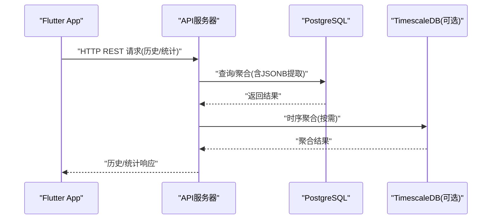
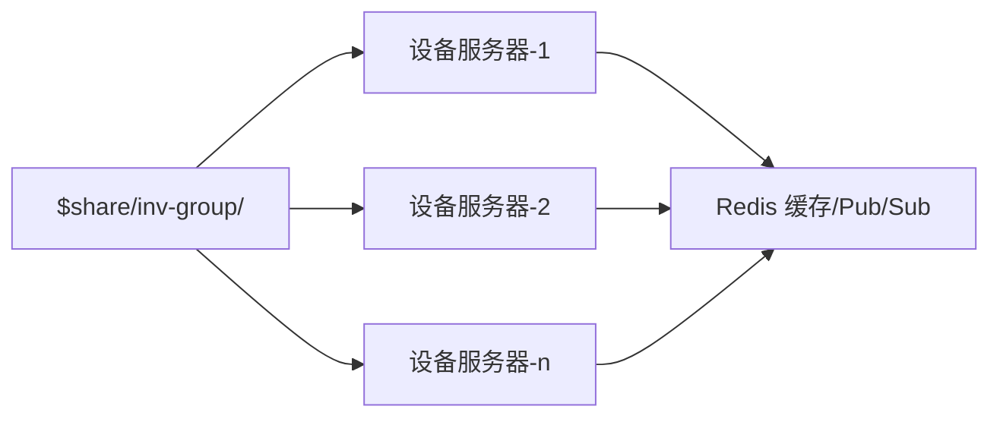
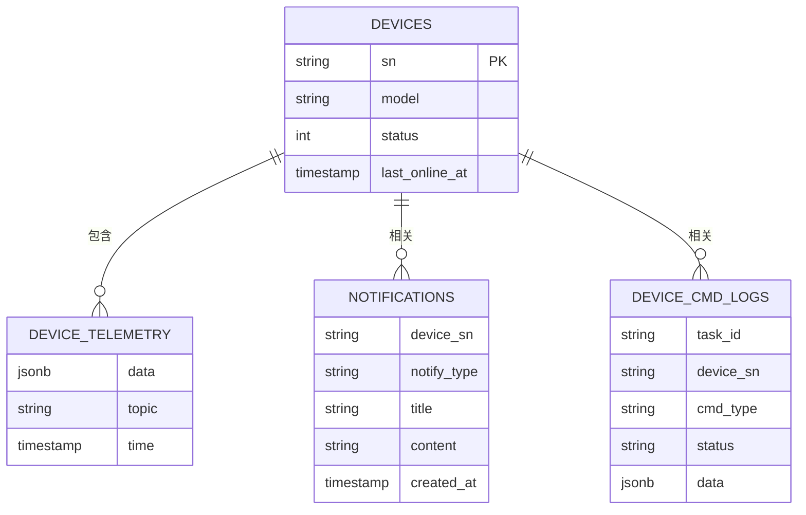
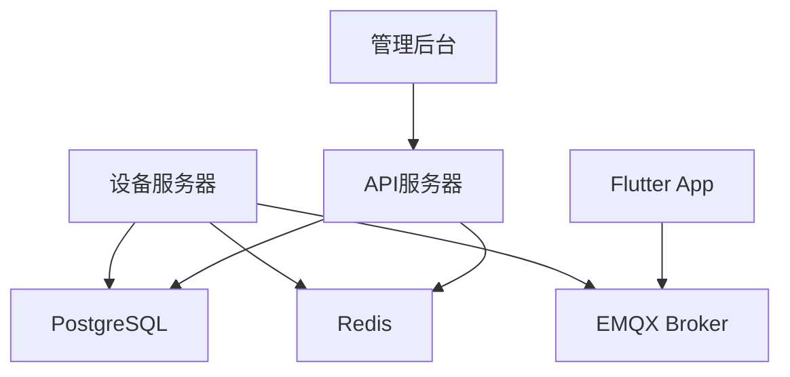

# 数据流架构

<cite>
**本文引用的文件**
- [README.md](file://README.md)
- [inv_device_server/internal/mqtt/client.go](file://inv_device_server/internal/mqtt/client.go)
- [inv_device_server/internal/service/protocol_parser.go](file://inv_device_server/internal/service/protocol_parser.go)
- [inv_device_server/internal/model/device.go](file://inv_device_server/internal/model/device.go)
- [inv_api_server/internal/repository/repositories.go](file://inv_api_server/internal/repository/repositories.go)
- [inv_api_server/internal/handler/ws_handler.go](file://inv_api_server/internal/handler/ws_handler.go)
- [inv_api_server/cmd/main.go](file://inv_api_server/cmd/main.go)
- [inv-admin-frontend/src/pages/portal/DeviceMonitorPage.tsx](file://inv-admin-frontend/src/pages/portal/DeviceMonitorPage.tsx)
- [deploy/docker-compose.yml](file://deploy/docker-compose.yml)
- [database/schema.sql](file://database/schema.sql)
- [database/migration_timescaledb.sql](file://database/migration_timescaledb.sql)
</cite>

## 目录
1. [简介](#简介)
2. [项目结构](#项目结构)
3. [核心组件](#核心组件)
4. [架构总览](#架构总览)
5. [详细组件分析](#详细组件分析)
6. [依赖关系分析](#依赖关系分析)
7. [性能考量](#性能考量)
8. [故障排查指南](#故障排查指南)
9. [结论](#结论)
10. [附录](#附录)

## 简介
本文件面向 INV-MQTT 系统的数据流架构，围绕“实时数据链路”和“历史/统计数据链路”两大路径，系统性阐述数据流向、处理节点与存储策略；同时深入解释共享订阅机制、消息路由与负载均衡实现，并提供数据流图与时序图，帮助开发者快速定位数据处理要点，协助运维人员建立监控与排障体系。

## 项目结构
系统采用“实时直连 + 历史查询”的双通道设计：
- 实时链路：设备 → EMQX Broker → 设备服务器（共享订阅）→ 数据库/缓存
- 历史链路：App → HTTP REST → API 服务器 → 数据库
- 管理后台：WebSocket 实时推送（管理端）

**图表来源**
- [README.md:208-224](file://README.md#L208-L224)
- [inv_device_server/internal/mqtt/client.go:154-191](file://inv_device_server/internal/mqtt/client.go#L154-L191)
- [inv_api_server/internal/handler/ws_handler.go:58-122](file://inv_api_server/internal/handler/ws_handler.go#L58-L122)

**章节来源**
- [README.md:5-29](file://README.md#L5-L29)
- [README.md:206-224](file://README.md#L206-L224)

## 核心组件
- 设备服务器（inv_device_server）
  - 通过 EMQX 共享订阅接收设备数据，进行协议解析、字段映射、缓存与发布。
  - 提供 Prometheus 指标端点，支持在线状态管理与离线检测。
- API 服务器（inv_api_server）
  - 提供 REST API、鉴权、设备/站点/告警/OTA 等业务接口。
  - 管理后台通过 WebSocket 实时推送设备状态。
- 数据库与缓存
  - PostgreSQL 存放关系型数据、元数据与 JSONB；可选 TimescaleDB 优化时序数据。
  - Redis 提供设备影子、实时缓存、Pub/Sub 推送与 Streams 缓冲。

**章节来源**
- [README.md:75-87](file://README.md#L75-L87)
- [README.md:112-132](file://README.md#L112-L132)
- [inv_device_server/internal/mqtt/client.go:154-191](file://inv_device_server/internal/mqtt/client.go#L154-L191)
- [inv_api_server/cmd/main.go:324-356](file://inv_api_server/cmd/main.go#L324-L356)

## 架构总览
本节以“实时链路”和“历史链路”两条主线，结合共享订阅与消息路由，给出端到端数据流图。

**图表来源**
- [README.md:208-224](file://README.md#L208-L224)
- [inv_device_server/internal/mqtt/client.go:154-191](file://inv_device_server/internal/mqtt/client.go#L154-L191)
- [inv_api_server/internal/handler/ws_handler.go:58-122](file://inv_api_server/internal/handler/ws_handler.go#L58-L122)

## 详细组件分析

### 实时数据链路（设备 → EMQX → 设备服务器 → 数据库/缓存）
- 共享订阅与负载均衡
  - EMQX 使用 `$share/inv-group/` 前缀，将设备主题消息轮询分发至多个 inv_device_server 实例，实现水平扩展与高可用。
- 设备服务器处理流程
  - 订阅主题：`cs_inv/+/data/#`、`cs_inv/+/status`、`cs_inv/+/ota/status`、`cs_inv/+/ota/cmd_ack`、`cs_inv/+/cmd_result`。
  - 在线状态：通过 Redis HSET 维护设备在线时间戳，结合超时阈值判定离线。
  - 缓存与发布：将解析后的实时数据写入 Redis 缓存与 Pub/Sub 通道，供 App 与管理后台实时消费。
  - 数据落库：构建标准字段与带前缀字段，写入数据库，保留查询兼容性。
- 数据模型与字段映射
  - 支持 AC、Battery、PV、System、Energy、Cells 等分类字段的映射与展平，便于前端直接读取。
- OTA 命令与状态
  - 设备服务器负责 OTA 命令下发与状态转发，确保任务闭环。

**图表来源**
- [inv_device_server/internal/service/protocol_parser.go:242-265](file://inv_device_server/internal/service/protocol_parser.go#L242-L265)
- [inv_device_server/internal/service/protocol_parser.go:605-659](file://inv_device_server/internal/service/protocol_parser.go#L605-L659)
- [inv_device_server/internal/service/protocol_parser.go:784-845](file://inv_device_server/internal/service/protocol_parser.go#L784-L845)

**章节来源**
- [README.md:208-214](file://README.md#L208-L214)
- [inv_device_server/internal/mqtt/client.go:154-191](file://inv_device_server/internal/mqtt/client.go#L154-L191)
- [inv_device_server/internal/service/protocol_parser.go:242-265](file://inv_device_server/internal/service/protocol_parser.go#L242-L265)
- [inv_device_server/internal/service/protocol_parser.go:605-659](file://inv_device_server/internal/service/protocol_parser.go#L605-L659)
- [inv_device_server/internal/service/protocol_parser.go:784-845](file://inv_device_server/internal/service/protocol_parser.go#L784-L845)

### 历史/统计数据链路（App → HTTP REST → API 服务器 → 数据库）
- API 服务器职责
  - 提供 REST API 与 WebSocket，统一鉴权与权限控制。
  - 通过数据库仓库层执行复杂查询与聚合，如今日发电量、设备列表、生命周期记录等。
- 历史数据查询
  - 使用 TimescaleDB 进行时序聚合（小时粒度），提升查询性能。
  - 对 JSONB 字段进行灵活提取与聚合，保证统计口径一致。
- 管理后台推送
  - 通过 WebSocket 将实时数据推送给管理端，实现后台监控与告警联动。

**图表来源**
- [README.md:218-224](file://README.md#L218-L224)
- [inv_api_server/internal/repository/repositories.go:1798-2020](file://inv_api_server/internal/repository/repositories.go#L1798-L2020)
- [inv_api_server/internal/repository/repositories.go:2240-2291](file://inv_api_server/internal/repository/repositories.go#L2240-L2291)

**章节来源**
- [README.md:218-224](file://README.md#L218-L224)
- [inv_api_server/internal/repository/repositories.go:1798-2020](file://inv_api_server/internal/repository/repositories.go#L1798-L2020)
- [inv_api_server/internal/repository/repositories.go:2240-2291](file://inv_api_server/internal/repository/repositories.go#L2240-L2291)

### 共享订阅机制、消息路由与负载均衡
- 共享订阅
  - EMQX 使用 `$share/inv-group/` 前缀，将设备主题消息轮询分发至多个 inv_device_server 实例，实现天然的负载均衡与高可用。
- 消息路由
  - 设备服务器订阅多类主题，覆盖遥测、状态、OTA 等，确保全量数据接入。
- 负载均衡
  - 多实例自动接管，结合 Redis 在线状态与会话清理，保障稳定性。

**图表来源**
- [README.md:246-250](file://README.md#L246-L250)
- [inv_device_server/internal/mqtt/client.go:154-191](file://inv_device_server/internal/mqtt/client.go#L154-L191)

**章节来源**
- [README.md:246-250](file://README.md#L246-L250)
- [inv_device_server/internal/mqtt/client.go:154-191](file://inv_device_server/internal/mqtt/client.go#L154-L191)

### 数据模型与存储策略
- PostgreSQL
  - 存放设备信息、遥测、告警、生命周期、命令日志等；大量使用 JSONB 字段承载设备多样化数据。
- Redis
  - 设备影子（实时缓存）、Pub/Sub 实时通道、Streams 缓冲与死信队列。
- TimescaleDB（可选）
  - 时序超表 + 自动压缩 + 连续聚合，显著降低历史查询成本。

**图表来源**
- [database/schema.sql](file://database/schema.sql)
- [database/migration_timescaledb.sql](file://database/migration_timescaledb.sql)
- [inv_api_server/internal/repository/repositories.go:1798-2020](file://inv_api_server/internal/repository/repositories.go#L1798-L2020)

**章节来源**
- [README.md:126-129](file://README.md#L126-L129)
- [database/schema.sql](file://database/schema.sql)
- [database/migration_timescaledb.sql](file://database/migration_timescaledb.sql)

### 开发者数据处理指导
- 设备侧
  - 使用 JWT 作为 MQTT 密码，主题遵循 cs_inv/{sn}/# 规范。
- 设备服务器
  - 订阅主题与解析逻辑见客户端与协议解析文件；注意字段映射与缓存键命名。
  - OTA 命令下发与状态回传需保持任务 ID 一致性。
- API 服务器
  - 历史查询建议结合 TimescaleDB 聚合视图；对 JSONB 字段使用条件表达式提取。
- 管理后台
  - 通过 WebSocket 订阅实时通道，实现后台推送与告警联动。

**章节来源**
- [README.md:121-131](file://README.md#L121-L131)
- [inv_device_server/internal/mqtt/client.go:154-191](file://inv_device_server/internal/mqtt/client.go#L154-L191)
- [inv_device_server/internal/service/protocol_parser.go:784-845](file://inv_device_server/internal/service/protocol_parser.go#L784-L845)
- [inv_api_server/internal/repository/repositories.go:1798-2020](file://inv_api_server/internal/repository/repositories.go#L1798-L2020)
- [inv_api_server/internal/handler/ws_handler.go:58-122](file://inv_api_server/internal/handler/ws_handler.go#L58-L122)

### 运维监控参考
- 指标与可观测性
  - 设备服务器提供 Prometheus 指标端点，关注连接数、消息收发计数与在线客户端数量。
- 健康检查
  - API 服务器提供 /health 健康检查端点，便于编排系统探测。
- 缓存与队列
  - Redis Streams 支持消费组与 ACK，建议监控积压与死信队列。
- 数据一致性
  - 通过 Redis 在线状态与数据库双重校验，避免误判离线。

**章节来源**
- [README.md:195-206](file://README.md#L195-L206)
- [inv_api_server/cmd/main.go:344-356](file://inv_api_server/cmd/main.go#L344-L356)
- [inv_device_server/internal/mqtt/client.go:61-104](file://inv_device_server/internal/mqtt/client.go#L61-L104)

## 依赖关系分析
- 组件耦合
  - 设备服务器与 EMQX 强耦合（共享订阅），与数据库/缓存弱耦合（通过 Redis 缓存与 Pub/Sub 解耦）。
  - API 服务器与数据库强耦合，与缓存弱耦合（主要用于在线状态与实时通道）。
- 外部依赖
  - EMQX（JWT 鉴权）、PostgreSQL/TimescaleDB、Redis。

**图表来源**
- [README.md:206-224](file://README.md#L206-L224)
- [inv_api_server/cmd/main.go:324-356](file://inv_api_server/cmd/main.go#L324-L356)

**章节来源**
- [README.md:206-224](file://README.md#L206-L224)
- [inv_api_server/cmd/main.go:324-356](file://inv_api_server/cmd/main.go#L324-L356)

## 性能考量
- 实时链路
  - 共享订阅 + 多实例水平扩展，降低单点瓶颈。
  - Redis 缓存与 Pub/Sub 减少数据库压力，提高推送延迟。
- 历史链路
  - TimescaleDB 时序优化与连续聚合显著降低大跨度查询成本。
  - JSONB 字段提取与条件表达式减少应用层二次处理。
- 存储策略
  - 设备影子缓存短期有效，避免频繁查询数据库。
  - 旧字段兼容映射与前缀字段保留兼顾查询与兼容性。

[本节为通用性能讨论，无需列出具体文件来源]

## 故障排查指南
- 设备无法上线
  - 检查 EMQX JWT 配置与 Secret 一致性；确认 MQTT_PASSWORD 为有效 JWT。
  - 查看设备服务器日志与在线状态键（Redis HSET）。
- 实时数据不推送
  - 确认 App 已订阅 cs_inv/{sn}/#；检查设备服务器是否成功解析并发布到 Pub/Sub。
  - 核对 Redis 通道是否存在实时数据。
- 历史数据缺失
  - 检查数据库表结构与 TimescaleDB 聚合视图；确认 JSONB 字段提取逻辑。
- 离线误判
  - 结合 Redis 在线状态与数据库最后在线时间双重校验；调整超时阈值。

**章节来源**
- [README.md:155-167](file://README.md#L155-L167)
- [inv_device_server/internal/mqtt/client.go:79-104](file://inv_device_server/internal/mqtt/client.go#L79-L104)
- [inv_api_server/internal/repository/repositories.go:1640-1689](file://inv_api_server/internal/repository/repositories.go#L1640-L1689)

## 结论
本架构以“实时直连 + 历史查询”为核心，通过 EMQX 共享订阅与多实例扩展实现高可用与低延迟；设备服务器负责协议解析与缓存发布，API 服务器提供 REST/WS 能力与统计查询；数据库与缓存协同支撑高并发与高性能需求。开发者可据此快速定位数据处理路径，运维人员可依据指标与通道监控体系进行稳定运行保障。

[本节为总结性内容，无需列出具体文件来源]

## 附录
- 部署与编排
  - 使用 docker-compose 一键启动 EMQX、设备服务器、API 服务器、数据库与缓存。
- 前端示例
  - 管理后台页面通过实时通道展示设备遥测与状态，体现推送效果。

**章节来源**
- [deploy/docker-compose.yml](file://deploy/docker-compose.yml)
- [inv-admin-frontend/src/pages/portal/DeviceMonitorPage.tsx:254-281](file://inv-admin-frontend/src/pages/portal/DeviceMonitorPage.tsx#L254-L281)