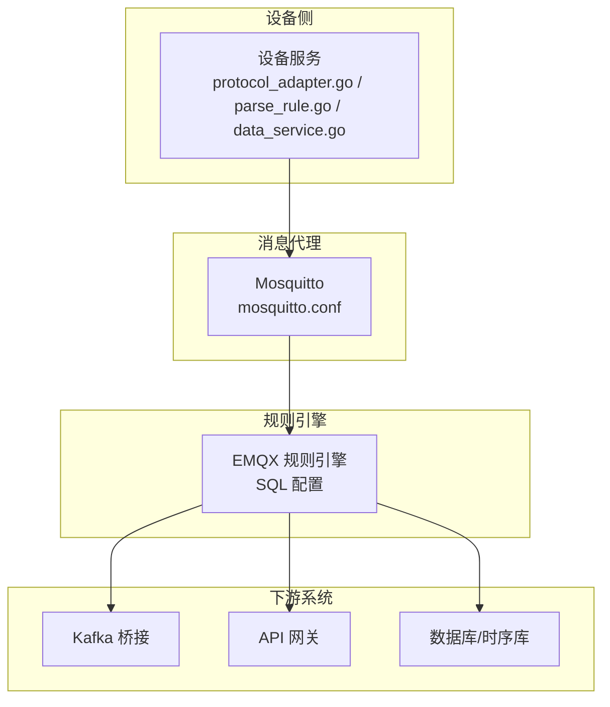
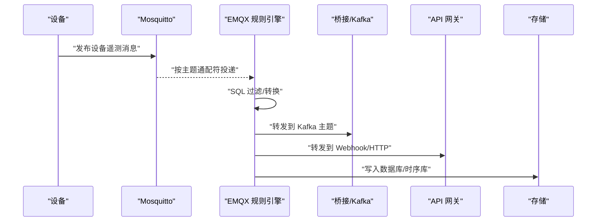
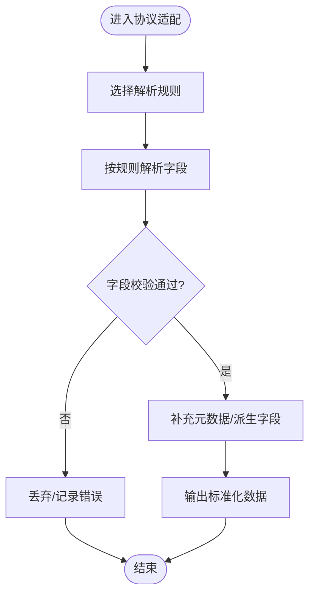
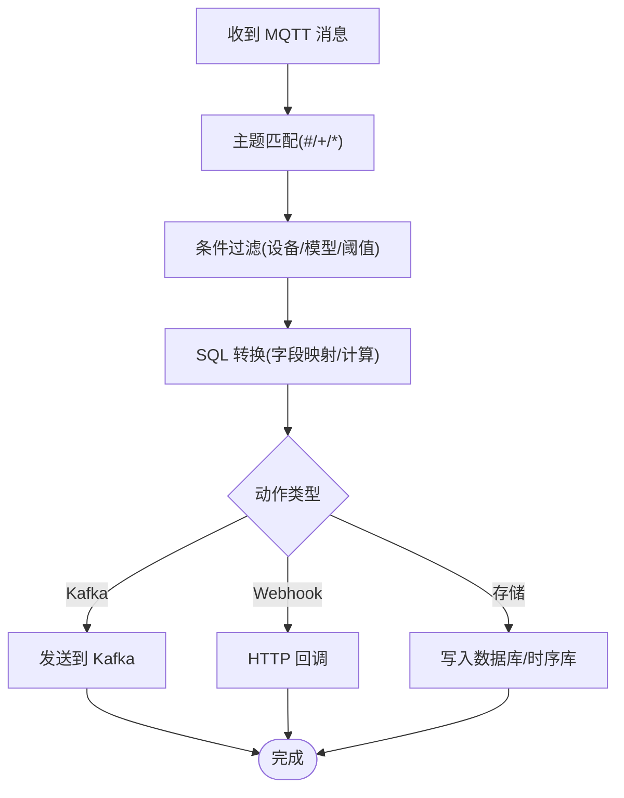
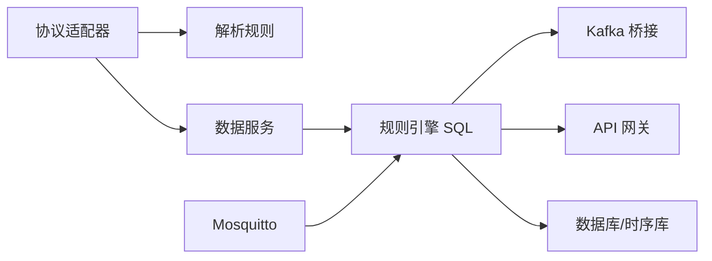

# 消息路由机制

<cite>
**本文档引用的文件**
- [emqx_rule_engine_sql.md](file://docs/emqx_rule_engine_sql.md)
- [protocol_adapter.go](file://inv_device_server/internal/service/protocol_adapter.go)
- [parse_rule.go](file://inv_device_server/internal/service/parse_rule.go)
- [data_service.go](file://inv_device_server/internal/service/data_service.go)
- [mosquitto.conf](file://deploy/mosquitto/mosquitto.conf)
- [MQTT接口文档.md](file://docs/MQTT接口文档.md)
- [device-model-modularization-plan.md](file://docs/device-model-modularization-plan.md)
- [架构升级任务清单.md](file://docs/架构升级任务清单.md)
</cite>

## 目录
1. [引言](#引言)
2. [项目结构](#项目结构)
3. [核心组件](#核心组件)
4. [架构总览](#架构总览)
5. [详细组件分析](#详细组件分析)
6. [依赖关系分析](#依赖关系分析)
7. [性能考虑](#性能考虑)
8. [故障排查指南](#故障排查指南)
9. [结论](#结论)

## 引言
本文件面向运维与开发人员，系统性阐述 INV-MQTT 系统的消息路由机制，重点覆盖以下方面：
- EMQX 规则引擎的 SQL 配置、主题过滤与消息转换规则
- 设备数据从原始协议到标准格式的转换流程（协议适配器与数据映射）
- 消息路由的关键配置项：主题通配符匹配、消息保留策略、QoS 级别
- 调试方法、性能监控指标与故障排查
- 面向运维的 EMQX 规则引擎配置与优化建议

## 项目结构
INV-MQTT 系统由多模块协作构成，其中与消息路由直接相关的关键模块如下：
- 协议适配与解析：设备侧服务负责将原始协议解析为统一数据模型
- 规则引擎：EMQX 将设备上报消息进行过滤、转换与转发
- 消息代理：Mosquitto 提供 MQTT 传输层，支持主题通配符与 QoS
- 文档与配置：规则引擎 SQL、接口文档、设备模型与架构升级计划

**图表来源**
- [protocol_adapter.go](file://inv_device_server/internal/service/protocol_adapter.go)
- [parse_rule.go](file://inv_device_server/internal/service/parse_rule.go)
- [data_service.go](file://inv_device_server/internal/service/data_service.go)
- [mosquitto.conf](file://deploy/mosquitto/mosquitto.conf)
- [emqx_rule_engine_sql.md](file://docs/emqx_rule_engine_sql.md)

**章节来源**
- [protocol_adapter.go](file://inv_device_server/internal/service/protocol_adapter.go)
- [parse_rule.go](file://inv_device_server/internal/service/parse_rule.go)
- [data_service.go](file://inv_device_server/internal/service/data_service.go)
- [mosquitto.conf](file://deploy/mosquitto/mosquitto.conf)
- [emqx_rule_engine_sql.md](file://docs/emqx_rule_engine_sql.md)

## 核心组件
- 协议适配器：负责将不同设备厂商的原始协议解析为统一的数据模型，输出标准化字段集合
- 解析规则：定义字段映射、类型转换、单位换算与校验逻辑
- 数据服务：对解析后的数据进行清洗、聚合与持久化准备
- 规则引擎 SQL：基于主题过滤、条件判断与消息转换，实现路由分发
- Mosquitto：提供 MQTT 传输、QoS 保障与主题通配符匹配

**章节来源**
- [protocol_adapter.go](file://inv_device_server/internal/service/protocol_adapter.go)
- [parse_rule.go](file://inv_device_server/internal/service/parse_rule.go)
- [data_service.go](file://inv_device_server/internal/service/data_service.go)
- [emqx_rule_engine_sql.md](file://docs/emqx_rule_engine_sql.md)
- [mosquitto.conf](file://deploy/mosquitto/mosquitto.conf)

## 架构总览
消息从设备上报到最终落库或转发的完整链路如下：

**图表来源**
- [emqx_rule_engine_sql.md](file://docs/emqx_rule_engine_sql.md)
- [mosquitto.conf](file://deploy/mosquitto/mosquitto.conf)

## 详细组件分析

### 协议适配器与数据映射
协议适配器负责将设备原始报文解析为统一数据模型，典型流程：
- 输入：设备上报的二进制/文本报文
- 处理：根据设备型号与协议族选择解析规则，执行字段提取、类型转换、单位换算与校验
- 输出：标准化 JSON 结构，包含时间戳、设备标识、遥测字段与状态信息

**图表来源**
- [protocol_adapter.go](file://inv_device_server/internal/service/protocol_adapter.go)
- [parse_rule.go](file://inv_device_server/internal/service/parse_rule.go)

**章节来源**
- [protocol_adapter.go](file://inv_device_server/internal/service/protocol_adapter.go)
- [parse_rule.go](file://inv_device_server/internal/service/parse_rule.go)
- [data_service.go](file://inv_device_server/internal/service/data_service.go)

### 规则引擎 SQL 配置与主题过滤
规则引擎通过 SQL 实现主题过滤、条件判断与消息转换，关键点：
- 主题通配符：使用 # 与 + 匹配多级路径，限定只处理目标设备域
- 条件过滤：基于设备 ID、产品型号、字段阈值等进行筛选
- 消息转换：重写 payload 字段、添加上下文信息、拆分/合并字段
- 动作路由：将处理后的消息发送至 Kafka、Webhook 或数据库

**图表来源**
- [emqx_rule_engine_sql.md](file://docs/emqx_rule_engine_sql.md)

**章节来源**
- [emqx_rule_engine_sql.md](file://docs/emqx_rule_engine_sql.md)

### Mosquitto 主题与 QoS 配置
Mosquitto 作为 MQTT 传输层，支撑主题通配符与 QoS 等能力：
- 主题通配符：+ 表示单级匹配，# 表示多级匹配；用于将设备域内消息汇聚到规则引擎
- QoS 级别：根据可靠性需求选择 0/1/2，平衡延迟与可靠性
- 消息保留：可配置保留消息，确保新订阅者能获取最新状态
- 认证授权：结合 ACL 控制主题访问权限

**章节来源**
- [mosquitto.conf](file://deploy/mosquitto/mosquitto.conf)

### 设备模型与接口规范
- 设备模型：定义设备属性、遥测字段、事件与命令的标准结构，便于规则引擎统一处理
- 接口文档：明确设备上报的主题命名、消息格式与字段语义
- 架构升级：持续演进设备模型与规则引擎配置，提升扩展性与稳定性

**章节来源**
- [device-model-modularization-plan.md](file://docs/device-model-modularization-plan.md)
- [MQTT接口文档.md](file://docs/MQTT接口文档.md)
- [架构升级任务清单.md](file://docs/架构升级任务清单.md)

## 依赖关系分析
消息路由涉及的模块耦合关系如下：

**图表来源**
- [protocol_adapter.go](file://inv_device_server/internal/service/protocol_adapter.go)
- [parse_rule.go](file://inv_device_server/internal/service/parse_rule.go)
- [data_service.go](file://inv_device_server/internal/service/data_service.go)
- [emqx_rule_engine_sql.md](file://docs/emqx_rule_engine_sql.md)
- [mosquitto.conf](file://deploy/mosquitto/mosquitto.conf)

**章节来源**
- [protocol_adapter.go](file://inv_device_server/internal/service/protocol_adapter.go)
- [parse_rule.go](file://inv_device_server/internal/service/parse_rule.go)
- [data_service.go](file://inv_device_server/internal/service/data_service.go)
- [emqx_rule_engine_sql.md](file://docs/emqx_rule_engine_sql.md)
- [mosquitto.conf](file://deploy/mosquitto/mosquitto.conf)

## 性能考虑
- 规则复杂度控制：避免在 SQL 中执行重型计算，尽量在上游完成预处理
- 主题粒度权衡：过细的主题会增加规则数量，过粗则导致无谓的过滤开销
- QoS 与吞吐：高 QoS 增加确认往返，影响吞吐；按场景选择合适级别
- 缓存与批处理：对热点字段进行缓存，批量写入数据库以降低 IO 压力
- 监控指标：关注规则命中率、消息延迟、丢包率、Kafka 吞吐与消费者滞后

## 故障排查指南
- 规则不生效
  - 检查主题通配符是否正确匹配设备域
  - 核对 SQL 过滤条件与字段名一致性
  - 查看规则引擎日志与动作执行结果
- 消息丢失
  - 确认 Mosquitto 的 QoS 设置与客户端订阅一致
  - 检查保留消息配置与新订阅者的首次获取
- 数据不一致
  - 对照设备模型与解析规则，确认字段映射与单位换算
  - 在规则引擎中增加字段校验与告警
- 性能瓶颈
  - 分析规则执行耗时，简化复杂表达式
  - 评估 Kafka 消费速率与分区数，必要时扩容

## 结论
INV-MQTT 的消息路由以“协议适配 + 规则引擎 + Mosquitto”为核心，通过标准化的数据模型与灵活的 SQL 路由规则，实现了从设备原始协议到统一格式的高效转换与可靠分发。运维应重点关注主题设计、规则配置与 QoS 选择，并结合监控指标持续优化。