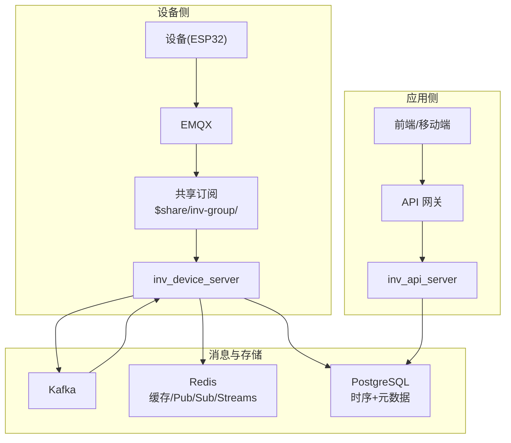
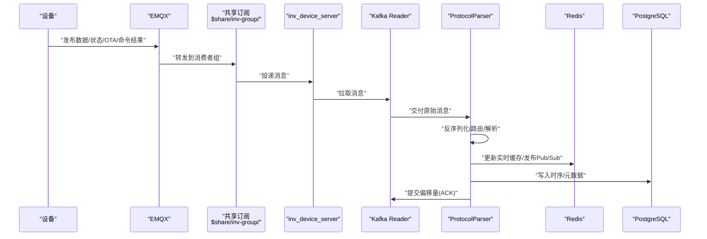
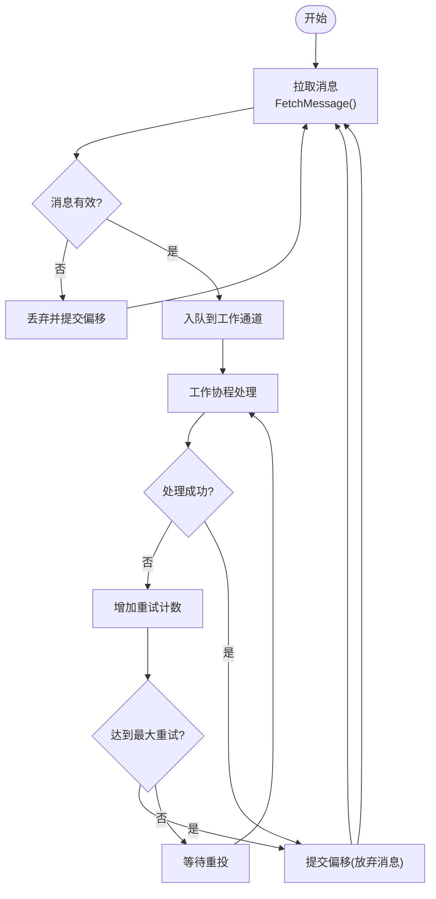
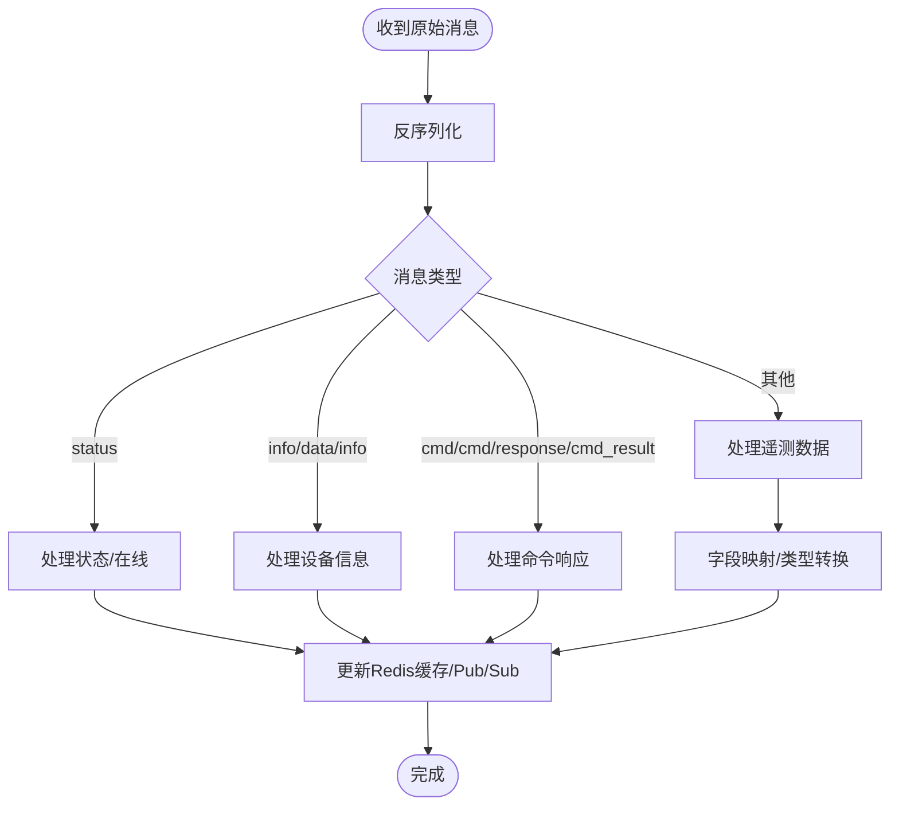
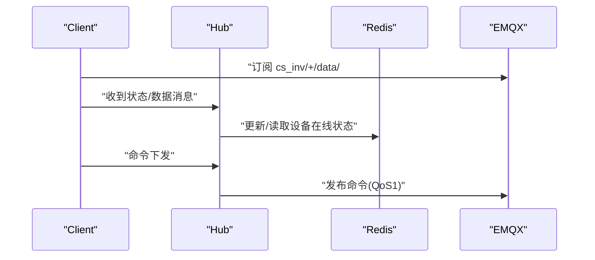
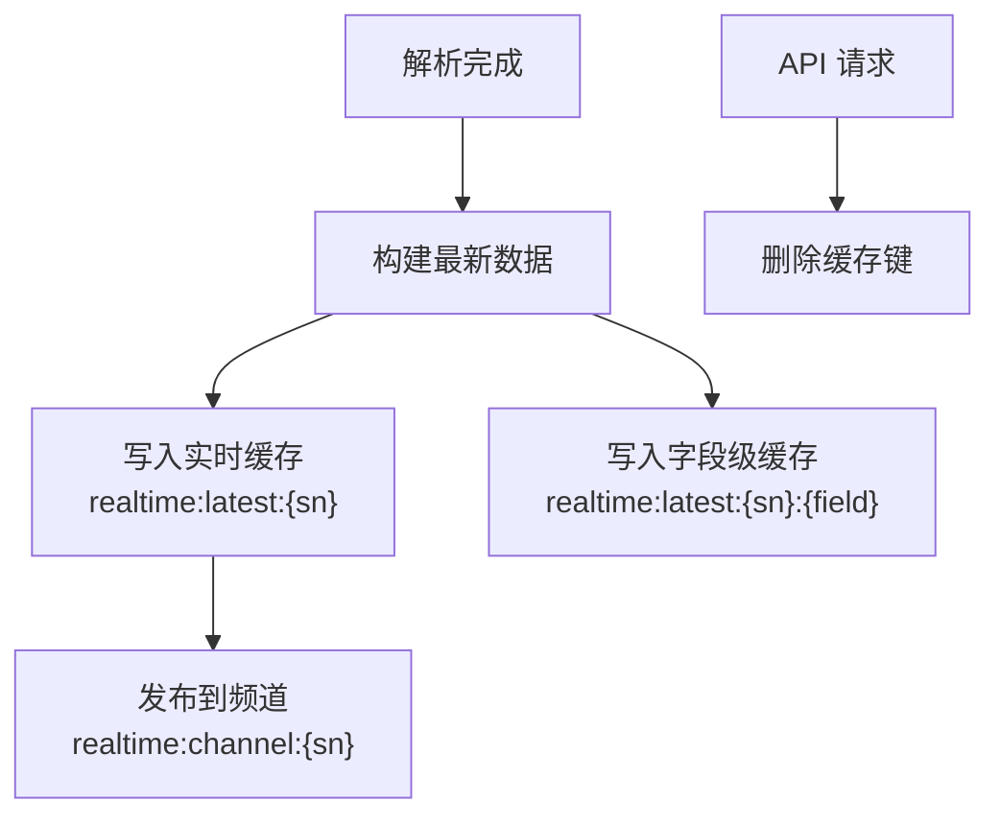
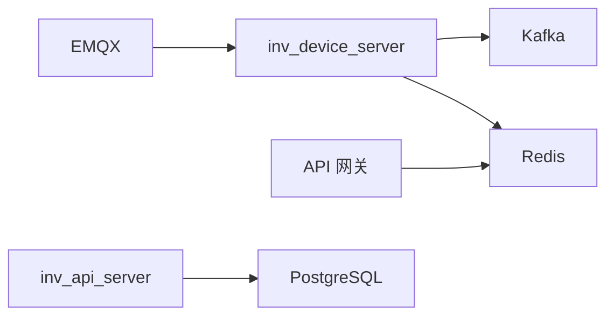

# 消息队列架构

<cite>
**本文引用的文件**
- [README.md](file://README.md)
- [protocol_parser.go](file://inv_device_server/internal/service/protocol_parser.go)
- [client.go](file://inv_device_server/internal/mqtt/client.go)
- [config.go](file://inv_device_server/internal/config/config.go)
- [config.go](file://api-gateway/internal/config/config.go)
- [main.go](file://api-gateway/main.go)
- [repositories.go](file://inv_api_server/internal/repository/repositories.go)
- [monitor.sh](file://deploy/monitor.sh)
</cite>

## 目录
1. [引言](#引言)
2. [项目结构](#项目结构)
3. [核心组件](#核心组件)
4. [架构总览](#架构总览)
5. [详细组件分析](#详细组件分析)
6. [依赖关系分析](#依赖关系分析)
7. [性能考量](#性能考量)
8. [故障排查指南](#故障排查指南)
9. [结论](#结论)
10. [附录](#附录)

## 引言
本文件面向 INV-MQTT 系统的消息队列与实时数据链路，聚焦于系统如何利用 Kafka 与 Redis Streams 的组合实现高吞吐、可扩展、可观测的设备数据处理流水线。文档覆盖以下关键点：
- 生产、消费与确认流程
- 消费组、ACK 与重试机制
- 死信与故障恢复策略
- 消息缓冲与背压控制
- 配置要点与性能优化建议
- 开发者最佳实践与运维监控指引

根据仓库中的架构描述，系统采用“设备 → EMQX → 共享订阅 → inv_device_server → PostgreSQL + Redis”的链路，其中 Redis 用于缓存、Pub/Sub 以及 Streams；Kafka 作为中间层承载设备数据，inv_device_server 通过 Kafka Reader 消费并进行协议解析、落库与实时缓存。

章节来源
- [README.md:206-251](file://README.md#L206-L251)

## 项目结构
围绕消息队列与实时数据的关键目录与文件如下：
- inv_device_server/internal/service/protocol_parser.go：Kafka 消费、消息解析、重试与 ACK 提交
- inv_device_server/internal/mqtt/client.go：MQTT 客户端、Hub 在线状态管理、命令下发通道
- inv_device_server/internal/config/config.go：设备侧服务配置（含 Kafka/EMQX/Redis 等）
- api-gateway/internal/config/config.go 与 api-gateway/main.go：网关侧 Redis 配置与初始化
- inv_api_server/internal/repository/repositories.go：历史/统计链路与缓存失效逻辑
- deploy/monitor.sh：服务与端口健康检查脚本

图表来源
- [README.md:206-251](file://README.md#L206-L251)

章节来源
- [README.md:206-251](file://README.md#L206-L251)

## 核心组件
- Kafka Reader（消费组）：inv_device_server 使用 kafka.Reader 以消费者组方式从 Kafka Topic 拉取消息，具备最小/最大批次大小、分区消费能力，并在工作协程中提交偏移量实现 ACK。
- 协议解析器（ProtocolParser）：负责将 Kafka 消息反序列化为统一结构，按消息类型路由到不同处理器（状态、信息、遥测、命令响应），并维护本地重试计数与最大重试阈值。
- MQTT Hub/Client：连接 EMQX，订阅设备主题，维护设备在线状态，支持 OTA 状态与命令结果回调，提供命令下发通道。
- Redis：用于设备在线状态共享、实时缓存（latest）、字段级缓存与 Pub/Sub 通知。
- API 网关与 API Server：网关侧初始化 Redis 客户端用于 RBAC 缓存；API Server 负责历史/统计查询与缓存失效。

章节来源
- [protocol_parser.go:55-91](file://inv_device_server/internal/service/protocol_parser.go#L55-L91)
- [protocol_parser.go:101-135](file://inv_device_server/internal/service/protocol_parser.go#L101-L135)
- [client.go:20-47](file://inv_device_server/internal/mqtt/client.go#L20-L47)
- [client.go:134-139](file://inv_device_server/internal/mqtt/client.go#L134-L139)
- [config.go:15-84](file://inv_device_server/internal/config/config.go#L15-L84)
- [config.go:44-83](file://api-gateway/internal/config/config.go#L44-L83)
- [main.go:95-97](file://api-gateway/main.go#L95-L97)
- [repositories.go:1645-1654](file://inv_api_server/internal/repository/repositories.go#L1645-L1654)

## 架构总览
系统实时链路采用“Kafka + Redis”双通道：
- Kafka：设备数据经 EMQX 共享订阅投递至 Kafka，由 inv_device_server 以消费者组方式消费，完成协议解析、落库与实时缓存更新。
- Redis：用于设备在线状态共享、实时数据缓存与 Pub/Sub 通知，前端通过 MQTT 订阅实时推送。

图表来源
- [README.md:206-251](file://README.md#L206-L251)
- [protocol_parser.go:194-227](file://inv_device_server/internal/service/protocol_parser.go#L194-L227)
- [protocol_parser.go:230-245](file://inv_device_server/internal/service/protocol_parser.go#L230-L245)

## 详细组件分析

### Kafka 消费与 ACK 流程
- 消费组：使用 kafka.Reader 创建消费者组，设置最小/最大批次大小，避免单次拉取过大或过小导致的延迟与内存压力。
- 拉取循环：FetchMessage 循环拉取消息，对非法/空负载进行丢弃并提交偏移量，保证幂等性。
- 工作协程：固定数量的工作协程从内部通道消费，逐条处理；若处理失败，记录重试次数并在超过阈值后放弃并提交偏移量，避免无限重试阻塞。
- 提交偏移：成功处理后调用 CommitMessages 提交 Kafka 偏移，实现基于 Kafka 的 ACK。

图表来源
- [protocol_parser.go:194-227](file://inv_device_server/internal/service/protocol_parser.go#L194-L227)
- [protocol_parser.go:101-135](file://inv_device_server/internal/service/protocol_parser.go#L101-L135)

章节来源
- [protocol_parser.go:55-91](file://inv_device_server/internal/service/protocol_parser.go#L55-L91)
- [protocol_parser.go:101-135](file://inv_device_server/internal/service/protocol_parser.go#L101-L135)
- [protocol_parser.go:194-227](file://inv_device_server/internal/service/protocol_parser.go#L194-L227)

### 协议解析与消息路由
- 解析器职责：反序列化 Kafka 消息为统一结构，按消息类型路由到状态、信息、遥测、命令响应等处理器。
- 字段映射与类型转换：依据设备模型字段规则进行字段映射与类型转换，兼容多种前缀与嵌套结构。
- 实时缓存与发布：将最新数据写入 Redis 缓存与字段级键，同时向设备频道发布 Pub/Sub 消息，供前端订阅。

图表来源
- [protocol_parser.go:230-245](file://inv_device_server/internal/service/protocol_parser.go#L230-L245)
- [protocol_parser.go:698-741](file://inv_device_server/internal/service/protocol_parser.go#L698-L741)
- [protocol_parser.go:784-833](file://inv_device_server/internal/service/protocol_parser.go#L784-L833)

章节来源
- [protocol_parser.go:230-245](file://inv_device_server/internal/service/protocol_parser.go#L230-L245)
- [protocol_parser.go:698-741](file://inv_device_server/internal/service/protocol_parser.go#L698-L741)
- [protocol_parser.go:784-833](file://inv_device_server/internal/service/protocol_parser.go#L784-L833)

### MQTT Hub 与在线状态管理
- Hub 维护设备在线集合，定期扫描 Redis 中的设备在线哈希，过滤超时未更新的设备。
- Client 连接 EMQX，订阅设备数据/状态/OTA/命令结果主题；处理状态主题时区分主动在线与 LWT 离线，避免错误更新心跳。
- 命令下发：将命令封装为 MQTT 消息发布到设备主题，支持参数序列化与 QoS 1。

图表来源
- [client.go:134-139](file://inv_device_server/internal/mqtt/client.go#L134-L139)
- [client.go:154-226](file://inv_device_server/internal/mqtt/client.go#L154-L226)
- [client.go:277-328](file://inv_device_server/internal/mqtt/client.go#L277-L328)

章节来源
- [client.go:20-47](file://inv_device_server/internal/mqtt/client.go#L20-L47)
- [client.go:102-123](file://inv_device_server/internal/mqtt/client.go#L102-L123)
- [client.go:154-226](file://inv_device_server/internal/mqtt/client.go#L154-L226)
- [client.go:277-328](file://inv_device_server/internal/mqtt/client.go#L277-L328)

### Redis 缓存与 Pub/Sub
- 缓存键：设备最新实时数据与字段级缓存，带过期时间，便于快速查询与订阅。
- Pub/Sub：设备频道发布合并后的最新数据，前端订阅后即时接收。
- 缓存失效：API 层在特定操作后删除相关缓存键，确保一致性。

图表来源
- [protocol_parser.go:784-833](file://inv_device_server/internal/service/protocol_parser.go#L784-L833)
- [repositories.go:1645-1654](file://inv_api_server/internal/repository/repositories.go#L1645-L1654)

章节来源
- [protocol_parser.go:784-833](file://inv_device_server/internal/service/protocol_parser.go#L784-L833)
- [repositories.go:1645-1654](file://inv_api_server/internal/repository/repositories.go#L1645-L1654)

### 死信与故障恢复策略
- 最大重试阈值：单条消息在工作协程中最多重试固定次数，超过阈值后放弃并提交偏移量，避免阻塞。
- 丢弃策略：非法/空负载消息直接提交偏移量丢弃，防止误处理。
- 故障恢复：Kafka 消费异常时短暂休眠后重试，保持消费循环稳定；Redis/EMQX 连接异常通过日志记录与重连策略保障。

章节来源
- [protocol_parser.go:101-135](file://inv_device_server/internal/service/protocol_parser.go#L101-L135)
- [protocol_parser.go:194-227](file://inv_device_server/internal/service/protocol_parser.go#L194-L227)
- [client.go:215-225](file://inv_device_server/internal/mqtt/client.go#L215-L225)

## 依赖关系分析
- inv_device_server 依赖 Kafka 与 Redis：Kafka 用于消息消费与 ACK；Redis 用于缓存与在线状态共享。
- API 网关依赖 Redis：用于 RBAC 缓存，提升鉴权性能。
- API Server 依赖 PostgreSQL：历史/统计查询与数据落库。
- EMQX 作为共享订阅代理，将消息分发给多个 inv_device_server 实例，实现水平扩展。

图表来源
- [README.md:206-251](file://README.md#L206-L251)
- [config.go:15-84](file://inv_device_server/internal/config/config.go#L15-L84)
- [config.go:44-83](file://api-gateway/internal/config/config.go#L44-L83)
- [main.go:95-97](file://api-gateway/main.go#L95-L97)

章节来源
- [README.md:206-251](file://README.md#L206-L251)
- [config.go:15-84](file://inv_device_server/internal/config/config.go#L15-L84)
- [config.go:44-83](file://api-gateway/internal/config/config.go#L44-L83)
- [main.go:95-97](file://api-gateway/main.go#L95-L97)

## 性能考量
- Kafka 消费参数：合理设置最小/最大批次大小，平衡吞吐与延迟；根据流量峰值调整消费者组副本数与分区数。
- 工作协程数量：根据 CPU 与 IO 能力设置工作协程数，避免过多上下文切换。
- Redis 缓存：短 TTL 保障数据新鲜度；批量写入（管道）减少 RTT；Pub/Sub 降低轮询成本。
- 网关 Redis：开启连接池与合理的超时配置，避免阻塞请求。
- 监控指标：结合部署脚本中的资源使用检查，持续关注内存与磁盘占用。

## 故障排查指南
- 服务健康：使用监控脚本检查服务状态与端口监听情况，必要时自动重启并记录告警。
- Kafka 消费异常：查看消费循环中的错误日志与短暂休眠重试行为，确认网络与 Broker 可达性。
- Redis 连接问题：核对网关侧 Redis 初始化与地址配置，确认连接可用性。
- 设备离线判定：检查 Hub 在线状态扫描逻辑与 Redis 在线哈希，确认心跳更新是否正常。

章节来源
- [monitor.sh:23-46](file://deploy/monitor.sh#L23-L46)
- [monitor.sh:63-79](file://deploy/monitor.sh#L63-L79)
- [monitor.sh:96-110](file://deploy/monitor.sh#L96-L110)
- [client.go:102-123](file://inv_device_server/internal/mqtt/client.go#L102-L123)
- [main.go:95-97](file://api-gateway/main.go#L95-L97)

## 结论
本系统通过 Kafka 与 Redis 的协同，实现了高吞吐、低延迟的设备数据处理流水线。Kafka 提供可靠的消费组与 ACK 机制，Redis 提供实时缓存与 Pub/Sub 能力，EMQX 的共享订阅实现水平扩展。配合完善的重试与丢弃策略、缓存失效与监控脚本，系统在可靠性与性能之间取得良好平衡。建议在生产环境中持续优化 Kafka 分区与消费者组规模、Redis 缓存策略与网关连接池配置，并建立完善的告警与巡检机制。

## 附录
- 配置参考
  - 设备侧服务配置：包含 Kafka/EMQX/Redis 地址与端口等关键项。
  - 网关侧 Redis 配置：用于 RBAC 缓存的地址与端口。
- 开发者最佳实践
  - 消息类型严格校验与空负载快速丢弃
  - 控制工作协程数量与通道容量，避免内存膨胀
  - 使用管道批量写入 Redis，减少网络往返
  - 前端通过 MQTT 订阅实时频道，避免轮询
- 运维监控建议
  - 定时检查服务状态与端口监听
  - 关注内存与磁盘使用率，及时扩容或清理
  - 建立告警渠道，确保异常可追踪

章节来源
- [config.go:15-84](file://inv_device_server/internal/config/config.go#L15-L84)
- [config.go:44-83](file://api-gateway/internal/config/config.go#L44-L83)
- [monitor.sh:19-118](file://deploy/monitor.sh#L19-L118)