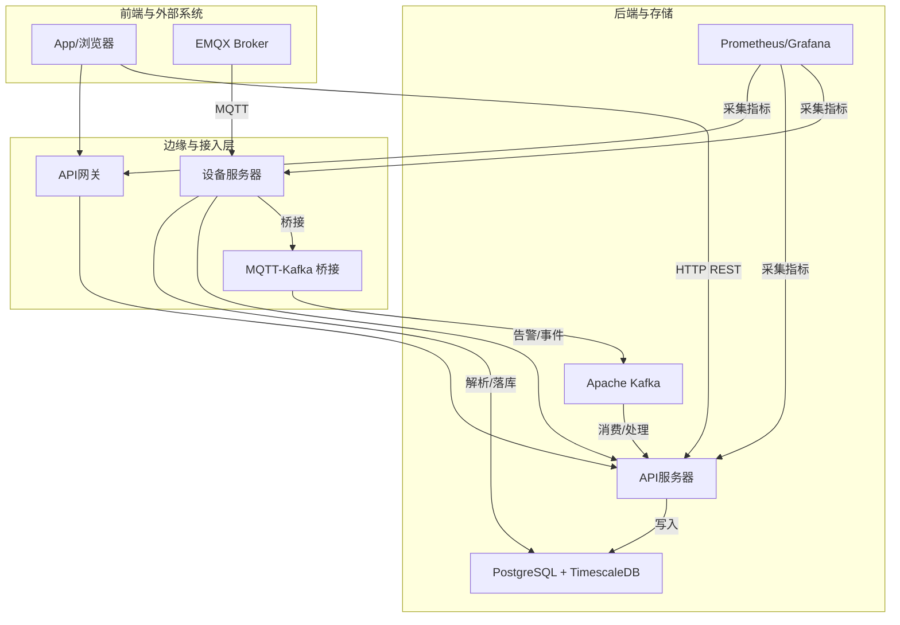
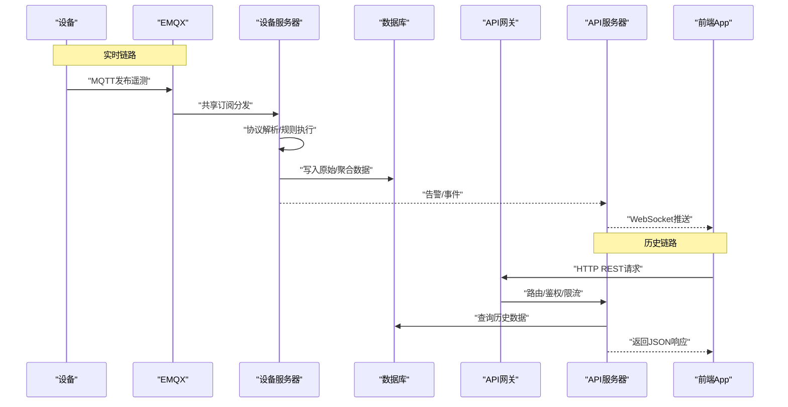
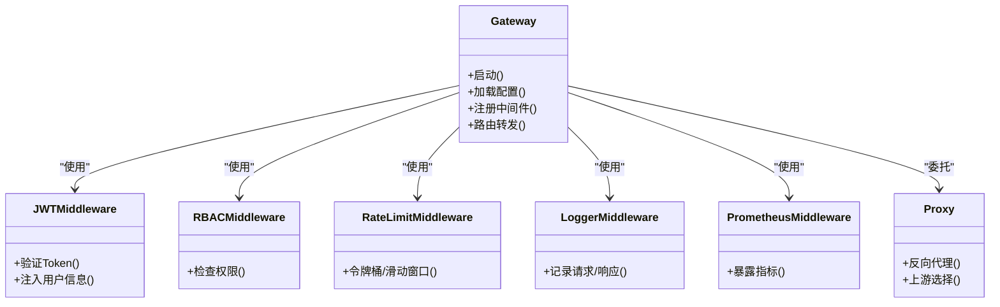
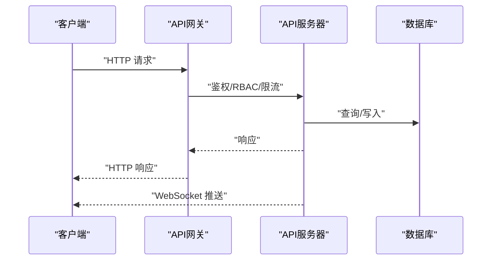
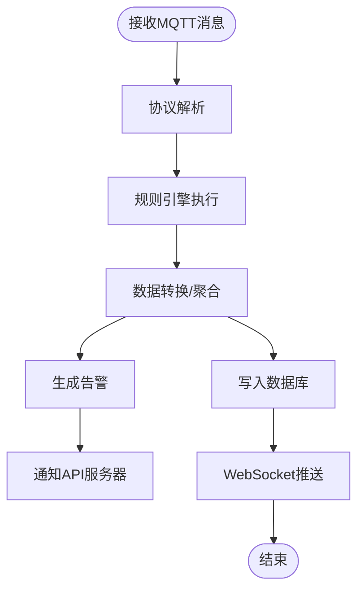
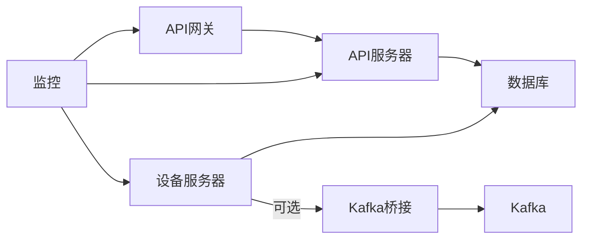

# 系统架构

<cite>
**本文引用的文件**
- [api-gateway/main.go](file://api-gateway/main.go)
- [api-gateway/internal/config/config.go](file://api-gateway/internal/config/config.go)
- [api-gateway/internal/middleware/cors.go](file://api-gateway/internal/middleware/cors.go)
- [api-gateway/internal/middleware/jwt.go](file://api-gateway/internal/middleware/jwt.go)
- [api-gateway/internal/middleware/logger.go](file://api-gateway/internal/middleware/logger.go)
- [api-gateway/internal/middleware/prometheus.go](file://api-gateway/internal/middleware/prometheus.go)
- [api-gateway/internal/middleware/ratelimit.go](file://api-gateway/internal/middleware/ratelimit.go)
- [api-gateway/internal/middleware/rbac.go](file://api-gateway/internal/middleware/rbac.go)
- [api-gateway/internal/proxy/proxy.go](file://api-gateway/internal/proxy/proxy.go)
- [api-gateway/internal/routes/routes.go](file://api-gateway/internal/routes/routes.go)
- [inv_api_server/cmd/main.go](file://inv_api_server/cmd/main.go)
- [inv_api_server/internal/config/config.go](file://inv_api_server/internal/config/config.go)
- [inv_api_server/internal/handler/device_handler.go](file://inv_api_server/internal/handler/device_handler.go)
- [inv_api_server/internal/handler/ws_handler.go](file://inv_api_server/internal/handler/ws_handler.go)
- [inv_api_server/internal/middleware/auth.go](file://inv_api_server/internal/middleware/auth.go)
- [inv_api_server/internal/middleware/permission.go](file://inv_api_server/internal/middleware/permission.go)
- [inv_device_server/cmd/main.go](file://inv_device_server/cmd/main.go)
- [inv_device_server/internal/config/config.go](file://inv_device_server/internal/config/config.go)
- [inv_device_server/internal/mqtt/client.go](file://inv_device_server/internal/mqtt/client.go)
- [inv_device_server/internal/mqtt/stream_consumer.go](file://inv_device_server/internal/mqtt/stream_consumer.go)
- [inv_device_server/internal/service/data_service.go](file://inv_device_server/internal/service/data_service.go)
- [inv_device_server/internal/service/protocol_adapter.go](file://inv_device_server/internal/service/protocol_adapter.go)
- [inv_device_server/internal/service/protocol_parser.go](file://inv_device_server/internal/service/protocol_parser.go)
- [inv_device_server/internal/service/alert_consumer.go](file://inv_device_server/internal/service/alert_consumer.go)
- [inv_device_server/internal/repository/device_repository.go](file://inv_device_server/internal/repository/device_repository.go)
- [inv_device_server/internal/model/device.go](file://inv_device_server/internal/model/device.go)
- [mqtt-kafka-bridge/main.go](file://mqtt-kafka-bridge/main.go)
- [deploy/docker-compose.yml](file://deploy/docker-compose.yml)
- [deploy/docker-compose.full.yml](file://deploy/docker-compose.full.yml)
- [deploy/docker-compose.kafka.yml](file://deploy/docker-compose.kafka.yml)
- [deploy/docker-compose.kafka-bridge.yml](file://deploy/docker-compose.kafka-bridge.yml)
- [deploy/docker-compose.bridge.yml](file://deploy/docker-compose.bridge.yml)
- [deploy/docker-compose.prod.yml](file://deploy/docker-compose.prod.yml)
- [deploy/configs/api-server.yaml](file://deploy/configs/api-server.yaml)
- [deploy/configs/device-server.yaml](file://deploy/configs/device-server.yaml)
- [deploy/configs/gateway.yaml](file://deploy/configs/gateway.yaml)
- [deploy/mosquitto/mosquitto.conf](file://deploy/mosquitto/mosquitto.conf)
- [database/schema.sql](file://database/schema.sql)
- [database/migration_timescaledb.sql](file://database/migration_timescaledb.sql)
- [database/migrations/001_init_schema.up.sql](file://database/migrations/001_init_schema.up.sql)
- [database/migrations/002_add_performance_indexes.up.sql](file://database/migrations/002_add_performance_indexes.up.sql)
- [database/migrations/003_timescaledb_compression.up.sql](file://database/migrations/003_timescaledb_compression.up.sql)
- [database/migrations/004_add_energy_columns.up.sql](file://database/migrations/004_add_energy_columns.up.sql)
- [database/migrations/005_device_day_data_jsonb.up.sql](file://database/migrations/005_device_day_data_jsonb.up.sql)
- [docs/MQTT接口文档.md](file://docs/MQTT接口文档.md)
- [docs/emqx_rule_engine_sql.md](file://docs/emqx_rule_engine_sql.md)
- [deploy/grafana-dashboard.json](file://deploy/grafana-dashboard.json)
- [deploy/prometheus.yml](file://deploy/prometheus.yml)
- [deploy/prometheus_alerts.yml](file://deploy/prometheus_alerts.yml)
</cite>

## 目录
1. [引言](#引言)
2. [项目结构](#项目结构)
3. [核心组件](#核心组件)
4. [架构总览](#架构总览)
5. [详细组件分析](#详细组件分析)
6. [依赖分析](#依赖分析)
7. [性能考虑](#性能考虑)
8. [故障排查指南](#故障排查指南)
9. [结论](#结论)
10. [附录](#附录)

## 引言
本架构文档面向INV-MQTT系统的系统设计者与架构师，系统采用分布式微服务架构，围绕“设备-EMQX-设备服务器-数据库”的实时链路与“App-HTTP REST-API服务器-数据库”的历史链路协同工作。系统通过EMQX规则引擎进行数据分流与转换，结合Kafka桥接实现扩展能力，并以Prometheus/Grafana进行可观测性建设。本文档从架构设计理念、组件关系、数据流、关键技术（共享订阅、高可用、消息队列、规则引擎）到服务间通信协议与数据流转进行全面阐述，同时提供可操作的实现指导。

## 项目结构
项目由多个独立微服务与基础设施组成，采用Docker Compose与Kubernetes进行编排部署。核心服务包括：
- API网关：统一入口、鉴权、限流、日志、指标与代理转发
- API服务器：业务REST API、WebSocket推送、权限控制
- 设备服务器：MQTT客户端、协议解析、数据落库、告警处理
- Kafka桥接：MQTT与Kafka之间的桥接
- 数据库：PostgreSQL + TimescaleDB扩展，支持时序压缩与高性能查询
- 配置与部署：多环境compose与K8s配置、Mosquitto配置、监控配置

图表来源
- [deploy/docker-compose.full.yml](file://deploy/docker-compose.full.yml)
- [deploy/docker-compose.kafka.yml](file://deploy/docker-compose.kafka.yml)
- [deploy/docker-compose.kafka-bridge.yml](file://deploy/docker-compose.kafka-bridge.yml)
- [deploy/configs/api-server.yaml](file://deploy/configs/api-server.yaml)
- [deploy/configs/device-server.yaml](file://deploy/configs/device-server.yaml)
- [deploy/configs/gateway.yaml](file://deploy/configs/gateway.yaml)

章节来源
- [deploy/docker-compose.yml](file://deploy/docker-compose.yml)
- [deploy/docker-compose.full.yml](file://deploy/docker-compose.full.yml)
- [deploy/docker-compose.kafka.yml](file://deploy/docker-compose.kafka.yml)
- [deploy/docker-compose.kafka-bridge.yml](file://deploy/docker-compose.kafka-bridge.yml)
- [deploy/docker-compose.bridge.yml](file://deploy/docker-compose.bridge.yml)
- [deploy/docker-compose.prod.yml](file://deploy/docker-compose.prod.yml)

## 核心组件
- API网关：负责CORS、JWT鉴权、RBAC、限流、日志与Prometheus指标，以及对后端服务的反向代理与路由转发。
- API服务器：提供设备管理、告警、仪表盘、远程设置等REST接口；通过WebSocket向前端推送实时状态。
- 设备服务器：作为MQTT客户端连接EMQX，订阅设备主题，解析协议，执行规则与转换，将数据持久化至数据库，并处理告警事件。
- MQTT-Kafka桥接：将MQTT消息桥接到Kafka，用于扩展分析与第三方集成。
- 数据库：采用PostgreSQL+TimescaleDB，迁移脚本覆盖初始化、索引优化、压缩策略与时序数据结构。
- 监控与告警：Prometheus采集指标，Grafana可视化，结合告警规则实现系统健康监控。

章节来源
- [api-gateway/main.go](file://api-gateway/main.go)
- [api-gateway/internal/middleware/cors.go](file://api-gateway/internal/middleware/cors.go)
- [api-gateway/internal/middleware/jwt.go](file://api-gateway/internal/middleware/jwt.go)
- [api-gateway/internal/middleware/rbac.go](file://api-gateway/internal/middleware/rbac.go)
- [api-gateway/internal/middleware/ratelimit.go](file://api-gateway/internal/middleware/ratelimit.go)
- [api-gateway/internal/middleware/logger.go](file://api-gateway/internal/middleware/logger.go)
- [api-gateway/internal/middleware/prometheus.go](file://api-gateway/internal/middleware/prometheus.go)
- [api-gateway/internal/proxy/proxy.go](file://api-gateway/internal/proxy/proxy.go)
- [api-gateway/internal/routes/routes.go](file://api-gateway/internal/routes/routes.go)
- [inv_api_server/cmd/main.go](file://inv_api_server/cmd/main.go)
- [inv_api_server/internal/config/config.go](file://inv_api_server/internal/config/config.go)
- [inv_api_server/internal/handler/ws_handler.go](file://inv_api_server/internal/handler/ws_handler.go)
- [inv_api_server/internal/middleware/auth.go](file://inv_api_server/internal/middleware/auth.go)
- [inv_api_server/internal/middleware/permission.go](file://inv_api_server/internal/middleware/permission.go)
- [inv_device_server/cmd/main.go](file://inv_device_server/cmd/main.go)
- [inv_device_server/internal/config/config.go](file://inv_device_server/internal/config/config.go)
- [inv_device_server/internal/mqtt/client.go](file://inv_device_server/internal/mqtt/client.go)
- [inv_device_server/internal/mqtt/stream_consumer.go](file://inv_device_server/internal/mqtt/stream_consumer.go)
- [inv_device_server/internal/service/data_service.go](file://inv_device_server/internal/service/data_service.go)
- [inv_device_server/internal/service/protocol_adapter.go](file://inv_device_server/internal/service/protocol_adapter.go)
- [inv_device_server/internal/service/protocol_parser.go](file://inv_device_server/internal/service/protocol_parser.go)
- [inv_device_server/internal/service/alert_consumer.go](file://inv_device_server/internal/service/alert_consumer.go)
- [mqtt-kafka-bridge/main.go](file://mqtt-kafka-bridge/main.go)
- [database/schema.sql](file://database/schema.sql)
- [database/migration_timescaledb.sql](file://database/migration_timescaledb.sql)

## 架构总览
系统采用“双通道”数据流设计：
- 实时链路：设备通过MQTT发布遥测数据至EMQX，设备服务器订阅并解析，执行规则与转换，将原始与聚合数据写入数据库，并通过WebSocket向前端推送。
- 历史链路：App/浏览器通过API网关访问API服务器，API服务器读取数据库返回历史数据与统计信息。

共享订阅与高可用：
- 设备服务器以集群方式运行，利用EMQX共享订阅实现负载均衡与高可用，确保单点故障不影响整体吞吐。
- API网关与API服务器均支持水平扩展，配合限流与熔断策略保障稳定性。

消息队列与桥接：
- Kafka桥接用于将MQTT消息异步进入Kafka，便于后续分析、审计或第三方系统消费。
- 规则引擎在EMQX侧完成数据分流与预处理，降低下游压力。

图表来源
- [inv_device_server/internal/mqtt/client.go](file://inv_device_server/internal/mqtt/client.go)
- [inv_device_server/internal/service/data_service.go](file://inv_device_server/internal/service/data_service.go)
- [inv_api_server/internal/handler/ws_handler.go](file://inv_api_server/internal/handler/ws_handler.go)
- [api-gateway/internal/proxy/proxy.go](file://api-gateway/internal/proxy/proxy.go)
- [api-gateway/internal/middleware/jwt.go](file://api-gateway/internal/middleware/jwt.go)
- [api-gateway/internal/middleware/ratelimit.go](file://api-gateway/internal/middleware/ratelimit.go)

## 详细组件分析

### API网关
职责与特性：
- 统一入口与路由：根据路径将请求转发至后端服务。
- 安全与治理：JWT鉴权、RBAC权限校验、CORS跨域、限流与熔断。
- 可观测性：内置Prometheus指标收集，便于监控与告警。
- 日志：统一请求/响应日志记录，便于审计与排障。

图表来源
- [api-gateway/internal/middleware/jwt.go](file://api-gateway/internal/middleware/jwt.go)
- [api-gateway/internal/middleware/rbac.go](file://api-gateway/internal/middleware/rbac.go)
- [api-gateway/internal/middleware/ratelimit.go](file://api-gateway/internal/middleware/ratelimit.go)
- [api-gateway/internal/middleware/logger.go](file://api-gateway/internal/middleware/logger.go)
- [api-gateway/internal/middleware/prometheus.go](file://api-gateway/internal/middleware/prometheus.go)
- [api-gateway/internal/proxy/proxy.go](file://api-gateway/internal/proxy/proxy.go)

章节来源
- [api-gateway/main.go](file://api-gateway/main.go)
- [api-gateway/internal/config/config.go](file://api-gateway/internal/config/config.go)
- [api-gateway/internal/routes/routes.go](file://api-gateway/internal/routes/routes.go)

### API服务器
职责与特性：
- REST API：设备、站点、告警、模型、远程设置等接口。
- WebSocket：向前端推送实时状态与告警。
- 中间件：鉴权与权限校验，确保内部服务调用安全。
- 配置：支持容器化部署与环境变量配置。

图表来源
- [inv_api_server/internal/middleware/auth.go](file://inv_api_server/internal/middleware/auth.go)
- [inv_api_server/internal/middleware/permission.go](file://inv_api_server/internal/middleware/permission.go)
- [inv_api_server/internal/handler/ws_handler.go](file://inv_api_server/internal/handler/ws_handler.go)

章节来源
- [inv_api_server/cmd/main.go](file://inv_api_server/cmd/main.go)
- [inv_api_server/internal/config/config.go](file://inv_api_server/internal/config/config.go)

### 设备服务器
职责与特性：
- MQTT客户端：连接EMQX，订阅设备主题，支持共享订阅。
- 协议解析与适配：将设备二进制/自定义协议解析为结构化数据。
- 规则执行：基于规则引擎SQL进行数据转换与分流。
- 数据落库：将原始与聚合数据写入数据库。
- 告警处理：生成并上报告警事件给API服务器。

图表来源
- [inv_device_server/internal/mqtt/stream_consumer.go](file://inv_device_server/internal/mqtt/stream_consumer.go)
- [inv_device_server/internal/service/protocol_parser.go](file://inv_device_server/internal/service/protocol_parser.go)
- [inv_device_server/internal/service/protocol_adapter.go](file://inv_device_server/internal/service/protocol_adapter.go)
- [inv_device_server/internal/service/data_service.go](file://inv_device_server/internal/service/data_service.go)
- [inv_device_server/internal/service/alert_consumer.go](file://inv_device_server/internal/service/alert_consumer.go)

章节来源
- [inv_device_server/cmd/main.go](file://inv_device_server/cmd/main.go)
- [inv_device_server/internal/config/config.go](file://inv_device_server/internal/config/config.go)
- [inv_device_server/internal/mqtt/client.go](file://inv_device_server/internal/mqtt/client.go)
- [inv_device_server/internal/mqtt/stream_consumer.go](file://inv_device_server/internal/mqtt/stream_consumer.go)
- [inv_device_server/internal/service/data_service.go](file://inv_device_server/internal/service/data_service.go)
- [inv_device_server/internal/service/protocol_adapter.go](file://inv_device_server/internal/service/protocol_adapter.go)
- [inv_device_server/internal/service/protocol_parser.go](file://inv_device_server/internal/service/protocol_parser.go)
- [inv_device_server/internal/service/alert_consumer.go](file://inv_device_server/internal/service/alert_consumer.go)

### MQTT-Kafka桥接
职责与特性：
- 将MQTT消息桥接到Kafka，支持扩展分析与第三方系统消费。
- 支持容器化部署与配置管理。

章节来源
- [mqtt-kafka-bridge/main.go](file://mqtt-kafka-bridge/main.go)

### 数据库与迁移
职责与特性：
- PostgreSQL + TimescaleDB：支持时序数据压缩与高性能查询。
- 迁移脚本覆盖初始化、索引优化、压缩策略与时序数据结构演进。

章节来源
- [database/schema.sql](file://database/schema.sql)
- [database/migration_timescaledb.sql](file://database/migration_timescaledb.sql)
- [database/migrations/001_init_schema.up.sql](file://database/migrations/001_init_schema.up.sql)
- [database/migrations/002_add_performance_indexes.up.sql](file://database/migrations/002_add_performance_indexes.up.sql)
- [database/migrations/003_timescaledb_compression.up.sql](file://database/migrations/003_timescaledb_compression.up.sql)
- [database/migrations/004_add_energy_columns.up.sql](file://database/migrations/004_add_energy_columns.up.sql)
- [database/migrations/005_device_day_data_jsonb.up.sql](file://database/migrations/005_device_day_data_jsonb.up.sql)

### 规则引擎与配置
职责与特性：
- EMQX规则引擎：用于数据分流、格式转换、异常检测与告警触发。
- SQL配置：通过规则SQL实现灵活的数据处理逻辑。
- 文档化：规则引擎SQL与接口文档配套说明。

章节来源
- [docs/emqx_rule_engine_sql.md](file://docs/emqx_rule_engine_sql.md)
- [docs/MQTT接口文档.md](file://docs/MQTT接口文档.md)

## 依赖分析
服务间依赖关系与耦合度：
- API网关对后端服务的依赖通过路由与代理实现低耦合。
- 设备服务器与API服务器通过数据库与WebSocket弱耦合，避免直接RPC依赖。
- Kafka桥接作为可选扩展，通过消息总线降低耦合度。
- 数据库是共享存储，迁移脚本保证Schema一致性。

图表来源
- [api-gateway/internal/proxy/proxy.go](file://api-gateway/internal/proxy/proxy.go)
- [inv_device_server/internal/service/data_service.go](file://inv_device_server/internal/service/data_service.go)
- [mqtt-kafka-bridge/main.go](file://mqtt-kafka-bridge/main.go)

章节来源
- [deploy/docker-compose.full.yml](file://deploy/docker-compose.full.yml)
- [deploy/docker-compose.kafka.yml](file://deploy/docker-compose.kafka.yml)
- [deploy/docker-compose.kafka-bridge.yml](file://deploy/docker-compose.kafka-bridge.yml)

## 性能考虑
- 共享订阅与水平扩展：设备服务器集群化部署，利用共享订阅提升吞吐与可用性。
- 规则引擎前置：在EMQX侧完成数据分流与转换，减少下游压力。
- TimescaleDB压缩：针对时序数据启用压缩策略，降低存储与查询成本。
- 缓存与限流：API网关内置限流与熔断，防止突发流量击穿后端。
- 监控与告警：Prometheus/Grafana持续监控关键指标，提前发现性能瓶颈。

## 故障排查指南
常见问题与定位思路：
- 设备无数据：检查Mosquitto配置与EMQX连接状态，确认设备服务器是否成功订阅共享主题。
- 数据未入库：检查设备服务器日志与数据库连接配置，核对规则引擎SQL是否正确。
- WebSocket不推送：检查API服务器WebSocket路由与前端连接状态。
- API响应慢：查看API网关限流与后端延迟指标，定位慢查询与数据库索引问题。
- 监控缺失：检查Prometheus抓取配置与Grafana面板，确认指标暴露正常。

章节来源
- [deploy/mosquitto/mosquitto.conf](file://deploy/mosquitto/mosquitto.conf)
- [deploy/prometheus.yml](file://deploy/prometheus.yml)
- [deploy/grafana-dashboard.json](file://deploy/grafana-dashboard.json)
- [deploy/prometheus_alerts.yml](file://deploy/prometheus_alerts.yml)

## 结论
INV-MQTT系统通过清晰的双通道数据流、共享订阅与高可用设计、规则引擎与Kafka桥接，构建了可扩展、可观测且稳定的分布式微服务架构。该架构既满足实时性要求，又兼顾历史数据分析与第三方集成需求，适合大规模工业物联网场景。

## 附录
- 部署参考：使用Docker Compose与Kubernetes配置文件进行本地与生产部署。
- 配置参考：各服务的容器化配置文件与Mosquitto配置示例。
- 监控参考：Prometheus与Grafana配置文件，便于快速搭建监控体系。

章节来源
- [deploy/docker-compose.yml](file://deploy/docker-compose.yml)
- [deploy/configs/api-server.yaml](file://deploy/configs/api-server.yaml)
- [deploy/configs/device-server.yaml](file://deploy/configs/device-server.yaml)
- [deploy/configs/gateway.yaml](file://deploy/configs/gateway.yaml)
- [deploy/mosquitto/mosquitto.conf](file://deploy/mosquitto/mosquitto.conf)
- [deploy/prometheus.yml](file://deploy/prometheus.yml)
- [deploy/grafana-dashboard.json](file://deploy/grafana-dashboard.json)
- [deploy/prometheus_alerts.yml](file://deploy/prometheus_alerts.yml)