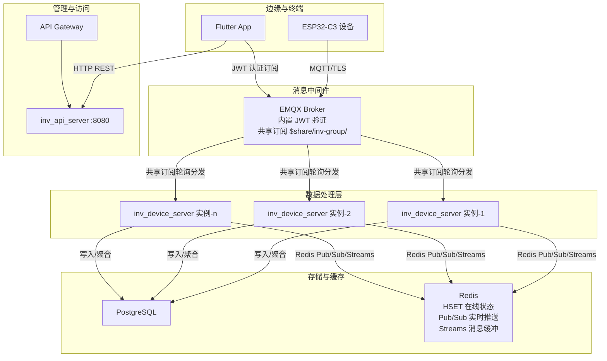
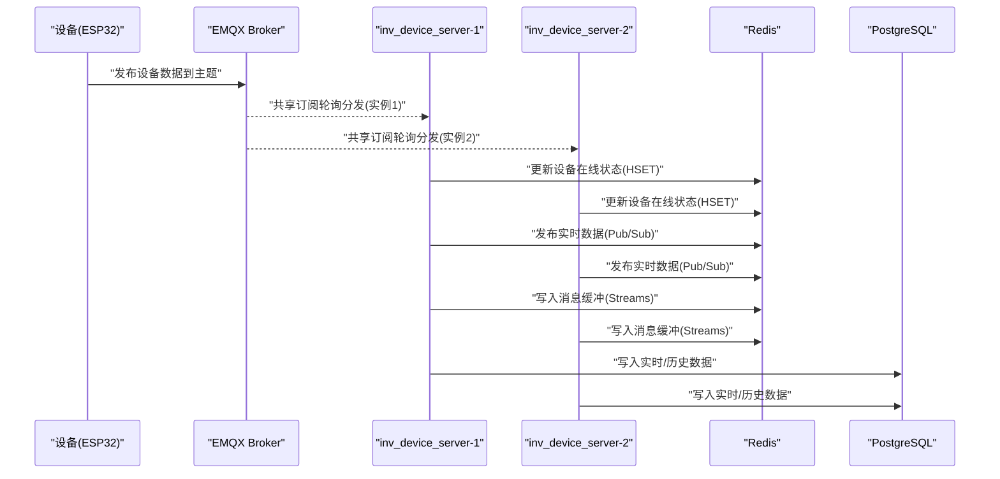
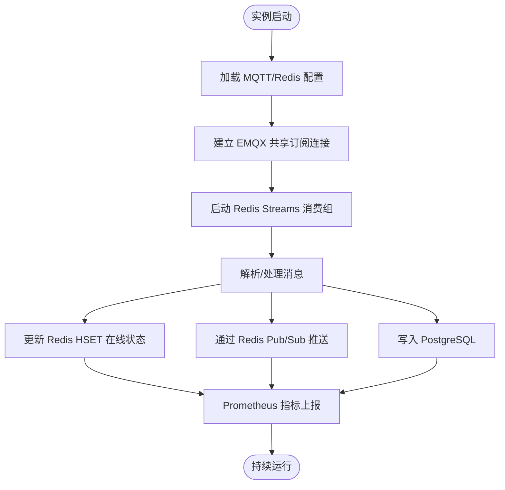
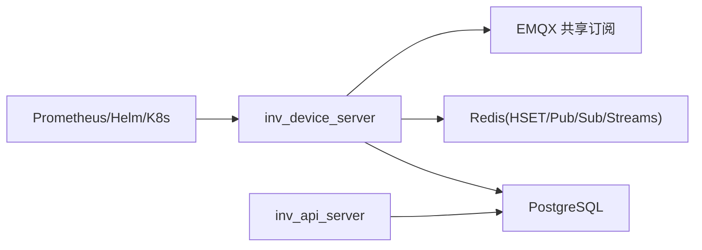

# 高可用设计

<cite>
**本文引用的文件**
- [README.md](file://README.md)
- [client.go](file://inv_device_server/internal/mqtt/client.go)
- [stream_consumer.go](file://inv_device_server/internal/mqtt/stream_consumer.go)
- [k8s-device-server.yaml](file://deploy/k8s-device-server.yaml)
- [docker-compose.yml](file://deploy/docker-compose.yml)
- [mosquitto.conf](file://deploy/mosquitto/mosquitto.conf)
- [repositories.go](file://inv_api_server/internal/repository/repositories.go)
- [webhook_server.py](file://deploy/webhook_server.py)
</cite>

## 目录
1. [引言](#引言)
2. [项目结构](#项目结构)
3. [核心组件](#核心组件)
4. [架构总览](#架构总览)
5. [详细组件分析](#详细组件分析)
6. [依赖关系分析](#依赖关系分析)
7. [性能考量](#性能考量)
8. [故障排查指南](#故障排查指南)
9. [结论](#结论)
10. [附录](#附录)

## 引言
本文件面向运维与架构师，系统性阐述 INV-MQTT 的高可用设计，重点覆盖以下方面：
- 共享订阅机制（$share/inv-group/）的实现原理与负载均衡效果
- Redis 共享状态、会话清理策略
- Kubernetes HPA 自动扩缩容策略
- 多实例部署、故障转移与健康检查
- 高可用架构图与部署配置说明

## 项目结构
INV-MQTT 采用“实时直连 MQTT + 历史查询 HTTP”的双通道架构，核心高可用能力集中在设备数据采集侧（inv_device_server）与消息中间件（EMQX）的共享订阅配合。

**图表来源**
- [README.md:206-251](file://README.md#L206-L251)
- [README.md:344-354](file://README.md#L344-L354)

**章节来源**
- [README.md:5-29](file://README.md#L5-L29)
- [README.md:344-354](file://README.md#L344-L354)

## 核心组件
- 共享订阅消费者（EMQX $share/inv-group/）
  - 通过共享订阅实现多实例间的负载均衡，EMQX 将同一主题的消息轮询分发至不同实例，避免重复消费并提升吞吐。
- Redis 共享状态与实时通道
  - 使用 Redis HSET 维护设备在线状态；通过 Pub/Sub 实时推送；通过 Redis Streams 提供消息缓冲与死信队列保障可靠性。
- 会话清理策略
  - 设置 Clean Session，断开即清理，避免会话残留导致状态不一致。
- Kubernetes HPA 自动扩缩容
  - 基于 CPU/内存指标对 inv_device_server 进行 2~10 副本的弹性伸缩。
- 健康检查与故障转移
  - Prometheus metrics 暴露运行指标；Kubernetes readiness/liveness 探针；EMQX 共享订阅天然实现实例故障转移。

**章节来源**
- [README.md:246-251](file://README.md#L246-L251)
- [README.md:344-354](file://README.md#L344-L354)

## 架构总览
下图展示高可用路径：设备数据经 EMQX 共享订阅分发至多实例，实例通过 Redis 共享状态与消息缓冲进行可靠处理，并写入 PostgreSQL 与 Redis。

**图表来源**
- [README.md:208-214](file://README.md#L208-L214)
- [README.md:246-251](file://README.md#L246-L251)

## 详细组件分析

### 共享订阅与负载均衡
- 实现原理
  - EMQX 对以 $share/inv-group/ 开头的主题启用共享订阅，同一消费者组内的多个 inv_device_server 实例共享订阅该主题。
  - EMQX 采用轮询策略将消息分发给当前活跃实例，确保同一条消息只被一个实例接收，天然避免重复处理。
- 负载均衡效果
  - 新增实例即可线性提升处理能力；实例故障时，EMQX 会自动将消息重新分发给剩余实例，实现无感故障转移。
- 配置要点
  - 消费者组名称统一为 inv-group，订阅前缀为 $share/inv-group/。
  - 保持 Clean Session=true，避免会话残留影响状态一致性。

**章节来源**
- [README.md:246-251](file://README.md#L246-L251)
- [README.md:208-214](file://README.md#L208-L214)

### Redis 共享状态、会话清理与消息缓冲
- 共享状态（设备在线）
  - Hub 维护设备在线集合，定期扫描 Redis HSET 中的设备在线时间戳，过滤出有效在线设备。
  - API 层可结合 Redis device:online 与数据库状态进行双重校验，避免长时间无心跳但未离线的误判。
- 会话清理
  - 连接配置中启用 CleanStartOnInitialConnection=false，但 SetCleanSession(true)，断开即清理会话，防止会话堆积。
- 消息缓冲与死信
  - 使用 Redis Streams 作为缓冲层，支持消费组、ACK 与死信队列，保证在网络抖动或下游处理慢时的数据不丢失。

**图表来源**
- [client.go:102-132](file://inv_device_server/internal/mqtt/client.go#L102-L132)
- [repositories.go:1656-1694](file://inv_api_server/internal/repository/repositories.go#L1656-L1694)

**章节来源**
- [client.go:102-132](file://inv_device_server/internal/mqtt/client.go#L102-L132)
- [repositories.go:1656-1694](file://inv_api_server/internal/repository/repositories.go#L1656-L1694)

### Kubernetes HPA 自动扩缩容
- 目标与范围
  - 针对 inv_device_server 的 Deployment 启用 HPA，副本数在 2~10 之间根据 CPU/内存使用率动态调整。
- 配置要点
  - 指标选择：CPU 使用率、内存使用量（建议两者组合）。
  - 最小副本：2，保障基础吞吐与冗余。
  - 最大副本：10，限制资源占用与扩展上限。
- 与共享订阅的协同
  - HPA 扩容时新增实例自动参与共享订阅轮询，无需变更 EMQX 配置。

**章节来源**
- [README.md:91](file://README.md#L91)
- [README.md:246-251](file://README.md#L246-L251)

### 多实例部署、故障转移与健康检查
- 多实例部署
  - 使用 docker-compose 或 Kubernetes 部署多个 inv_device_server 实例，实例间通过共享订阅实现负载均衡。
- 故障转移
  - 当某个实例宕机，EMQX 会将该实例负责的消息重新分发给其他实例，确保数据不丢失且处理不中断。
- 健康检查
  - 暴露 Prometheus /metrics 端点，结合 Kubernetes readiness/liveness 探针与外部监控系统进行健康评估。
  - API 层提供设备离线标记与状态同步逻辑，辅助判断实例处理能力与数据一致性。

**章节来源**
- [README.md:90-93](file://README.md#L90-L93)
- [README.md:344-354](file://README.md#L344-L354)

### 部署配置与运维要点
- Docker Compose（本地/测试）
  - 一键编排 EMQX、两个 inv_device_server 实例、API、PostgreSQL、Redis。
- Kubernetes（生产）
  - 使用 k8s-device-server.yaml 部署 Deployment 与 HPA，副本数由 HPA 自动调节。
- 自动化部署
  - webhook_server.py 支持 Git 事件触发部署，具备签名验证、冷却时间与并发控制，适合 CI/CD 集成。

**章节来源**
- [README.md:90-93](file://README.md#L90-L93)
- [webhook_server.py:124-216](file://deploy/webhook_server.py#L124-L216)

## 依赖关系分析
- 组件耦合
  - inv_device_server 与 EMQX 的共享订阅耦合度高，是实现水平扩展与故障转移的关键。
  - 与 Redis 的耦合体现在在线状态、实时推送与消息缓冲三类场景。
  - 与 PostgreSQL 的耦合体现在数据持久化与统计聚合。
- 外部依赖
  - EMQX：共享订阅、JWT 鉴权、TLS。
  - Redis：HSET、Pub/Sub、Streams。
  - Prometheus：指标暴露与 HPA 依据。

**图表来源**
- [README.md:206-251](file://README.md#L206-L251)
- [README.md:344-354](file://README.md#L344-L354)

**章节来源**
- [README.md:206-251](file://README.md#L206-L251)
- [README.md:344-354](file://README.md#L344-L354)

## 性能考量
- 共享订阅带来的吞吐提升
  - 实例数量与处理能力线性增长；建议根据设备规模与峰值消息速率设定最小副本数。
- Redis 与数据库的写放大
  - Pub/Sub 与 Streams 的写入可能带来写放大，应结合监控指标优化批处理与压缩策略。
- HPA 策略
  - 建议同时关注 CPU 与内存，避免单一指标导致的误扩容；设置合理的稳定窗口与目标阈值。

## 故障排查指南
- 设备离线判定异常
  - 检查 Redis device:online 是否存在且时间戳最新；若存在但数据库仍显示在线，优先信任 Redis。
- 消息积压与丢弃
  - 查看 Redis Streams 消费组 lag；确认 ACK 逻辑是否正常；必要时检查死信队列。
- 实例扩缩容不生效
  - 检查 HPA 配置与指标采集；确认 Pod 资源限制与节点资源。
- 自动部署失败
  - 查看 webhook_server.py 日志与签名配置；确认 Git 仓库权限与冷却时间设置。

**章节来源**
- [repositories.go:1656-1694](file://inv_api_server/internal/repository/repositories.go#L1656-L1694)
- [webhook_server.py:74-115](file://deploy/webhook_server.py#L74-L115)

## 结论
INV-MQTT 的高可用设计以“共享订阅 + Redis 缓冲 + HPA 弹性”为核心，结合会话清理与健康检查，实现了稳定的多实例处理与无感故障转移。生产部署建议：
- 严格启用共享订阅与 Clean Session
- 使用 HPA 将副本数维持在 2~10 区间
- 通过 Prometheus 与探针完善健康监控
- 以 webhook_server.py 为基础构建自动化部署流水线

## 附录
- 部署参考
  - docker-compose：一键启动 EMQX、设备服务、API、数据库与缓存
  - Kubernetes：Deployment + HPA，副本数自动调节
- 监控与告警
  - Prometheus 指标端点与告警规则文件位于部署目录

**章节来源**
- [README.md:90-93](file://README.md#L90-L93)
- [README.md:344-354](file://README.md#L344-L354)