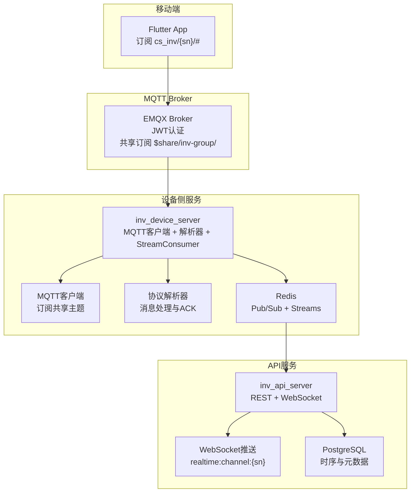
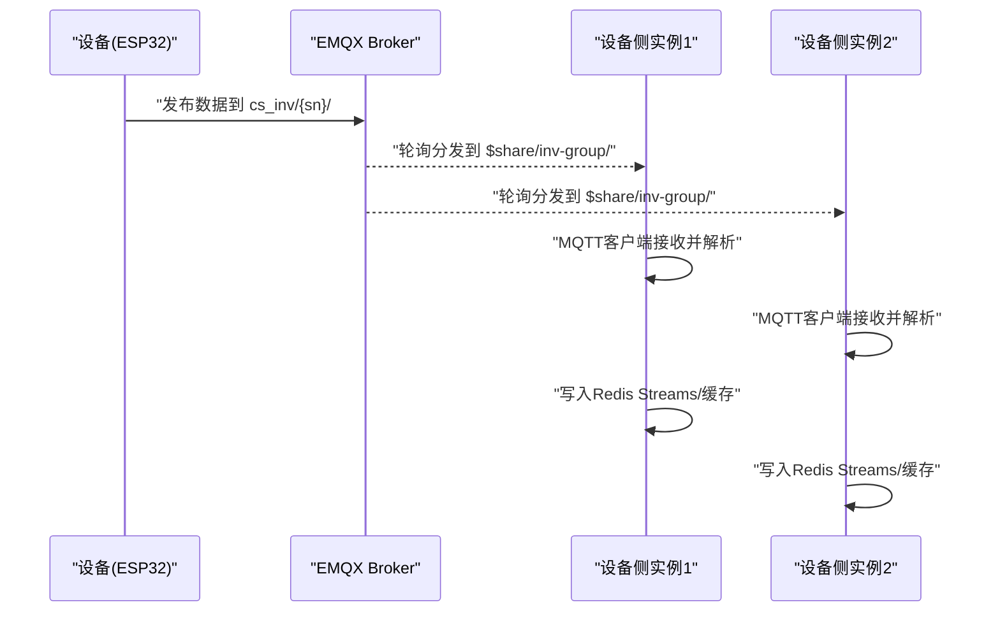
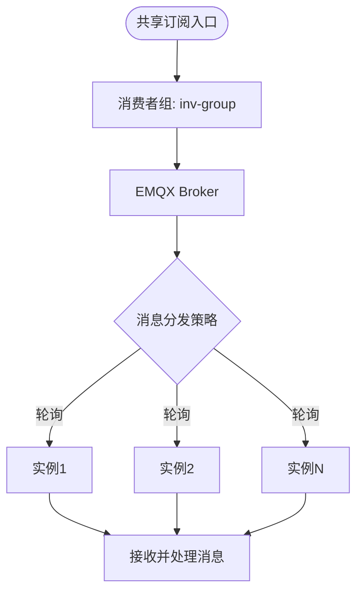
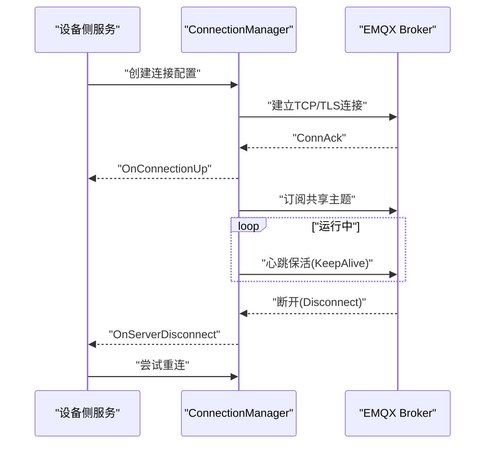
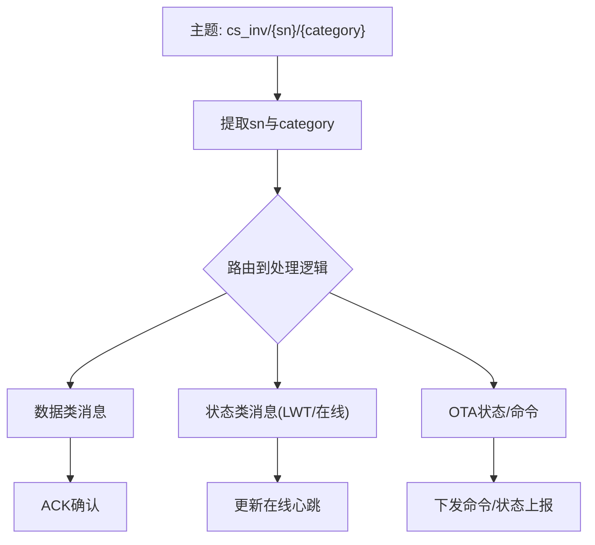
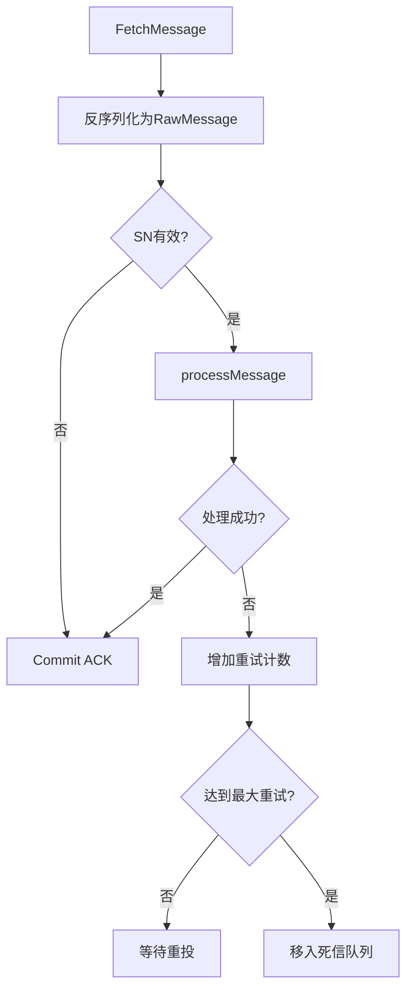
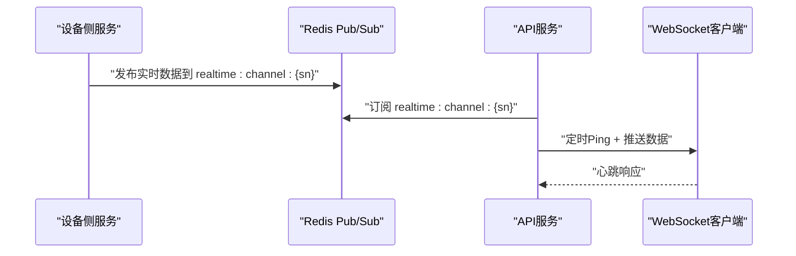
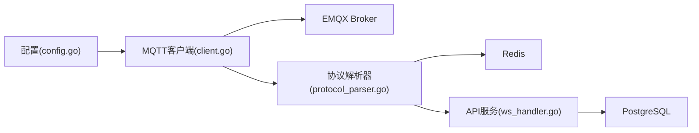

# MQTT客户端

<cite>
**本文引用的文件**
- [README.md](file://README.md)
- [client.go](file://inv_device_server/internal/mqtt/client.go)
- [stream_consumer.go](file://inv_device_server/internal/mqtt/stream_consumer.go)
- [protocol_parser.go](file://inv_device_server/internal/service/protocol_parser.go)
- [config.go](file://inv_device_server/internal/config/config.go)
- [ws_handler.go](file://inv_api_server/internal/handler/ws_handler.go)
- [repositories.go](file://inv_api_server/internal/repository/repositories.go)
- [monitor.sh](file://deploy/monitor.sh)
- [MQTT接口文档.md](file://docs/MQTT接口文档.md)
- [emqx_rule_engine_sql.md](file://docs/emqx_rule_engine_sql.md)
</cite>

## 目录
1. [简介](#简介)
2. [项目结构](#项目结构)
3. [核心组件](#核心组件)
4. [架构总览](#架构总览)
5. [详细组件分析](#详细组件分析)
6. [依赖关系分析](#依赖关系分析)
7. [性能考虑](#性能考虑)
8. [故障排除指南](#故障排除指南)
9. [结论](#结论)
10. [附录](#附录)

## 简介
本技术文档聚焦于MQTT客户端组件，深入解析EMQX共享订阅的实现原理与工作机制，涵盖$share/inv-group/主题前缀的使用、消费者组负载均衡策略；详述MQTT客户端的连接管理策略（连接建立、心跳保活、断线重连与异常恢复）；解释共享订阅的配置方法与消费者组工作原理；介绍StreamConsumer的实现（Redis Streams消息消费、ACK确认机制与死信队列处理）；提供MQTT主题命名规范、消息格式与QoS级别的最佳实践；并包含连接池管理、性能优化与故障排除指南。

## 项目结构
本项目采用多服务分层架构：移动端Flutter应用通过EMQX进行实时数据传输；设备侧Go服务负责MQTT订阅、数据解析与Redis Streams缓冲；API服务提供HTTP接口与WebSocket推送；数据库与缓存支撑实时与历史数据存储。

**图表来源**
- [README.md: 10-29:10-29](file://README.md#L10-L29)
- [client.go: 136-235:136-235](file://inv_device_server/internal/mqtt/client.go#L136-L235)
- [protocol_parser.go: 194-228:194-228](file://inv_device_server/internal/service/protocol_parser.go#L194-L228)

**章节来源**
- [README.md: 35-133:35-133](file://README.md#L35-L133)

## 核心组件
- MQTT客户端：负责与EMQX建立连接、订阅共享主题、处理发布消息、发送命令、心跳保活与断线重连。
- 共享订阅：通过$share/inv-group/前缀实现消费者组的轮询分发，多实例自动负载均衡。
- StreamConsumer：基于Redis Streams的消息消费、ACK确认与死信队列处理。
- 协议解析器：将原始消息解析为结构化数据，写入Redis并发布到Pub/Sub通道。
- WebSocket推送：API服务将Redis中的实时数据推送到前端WebSocket连接。

**章节来源**
- [client.go: 20-58:20-58](file://inv_device_server/internal/mqtt/client.go#L20-L58)
- [stream_consumer.go: 1-200:1-200](file://inv_device_server/internal/mqtt/stream_consumer.go#L1-L200)
- [protocol_parser.go: 230-845:230-845](file://inv_device_server/internal/service/protocol_parser.go#L230-L845)

## 架构总览
系统采用“实时直连MQTT + 历史查询HTTP”的分离架构。设备通过JWT认证直连EMQX，实时数据经共享订阅分发至多个设备侧实例；解析后的数据写入Redis Streams与数据库，并通过WebSocket向移动端推送。

**图表来源**
- [README.md: 208-214:208-214](file://README.md#L208-L214)
- [client.go: 154-202:154-202](file://inv_device_server/internal/mqtt/client.go#L154-L202)

## 详细组件分析

### EMQX共享订阅与消费者组
- 共享订阅主题前缀：$share/inv-group/，其中inv-group为消费者组名称。
- 负载均衡机制：EMQX对同一消费者组内的多个订阅者进行轮询分发，确保每条消息仅被一个实例处理。
- 配置要点：设备侧服务以$share/inv-group/为前缀订阅目标主题，多实例部署即可实现水平扩展与高可用。

**图表来源**
- [README.md: 246-249:246-249](file://README.md#L246-L249)
- [client.go: 328-330:328-330](file://inv_device_server/internal/mqtt/client.go#L328-L330)

**章节来源**
- [README.md: 246-249:246-249](file://README.md#L246-L249)
- [client.go: 328-330:328-330](file://inv_device_server/internal/mqtt/client.go#L328-L330)

### MQTT客户端连接管理策略
- 连接建立：根据端口选择协议方案（mqtt/tls），设置KeepAlive与SessionExpiryInterval，使用用户名密码（JWT）完成认证。
- 心跳保活：通过KeepAlive参数维持长连接活跃状态。
- 断线重连：OnServerDisconnect回调记录断开原因，结合外部重连策略实现自动恢复。
- 异常恢复：OnConnectError与OnClientError回调记录错误，便于定位问题与降级处理。

**图表来源**
- [client.go: 136-235:136-235](file://inv_device_server/internal/mqtt/client.go#L136-L235)
- [client.go: 204-213:204-213](file://inv_device_server/internal/mqtt/client.go#L204-L213)

**章节来源**
- [client.go: 136-235:136-235](file://inv_device_server/internal/mqtt/client.go#L136-L235)
- [client.go: 204-213:204-213](file://inv_device_server/internal/mqtt/client.go#L204-L213)

### MQTT主题命名规范与消息格式
- 主题命名：cs_inv/{sn}/{category}，其中{sn}为设备序列号，{category}为数据类别（如data、status、ota等）。
- QoS级别：订阅与发布的QoS建议为1，保证消息可靠到达。
- 消息格式：JSON结构，包含设备标识、消息类型与有效载荷；部分命令采用嵌套payload字段传递参数。

**图表来源**
- [client.go: 172-202:172-202](file://inv_device_server/internal/mqtt/client.go#L172-L202)
- [client.go: 280-317:280-317](file://inv_device_server/internal/mqtt/client.go#L280-L317)

**章节来源**
- [client.go: 172-202:172-202](file://inv_device_server/internal/mqtt/client.go#L172-L202)
- [client.go: 280-317:280-317](file://inv_device_server/internal/mqtt/client.go#L280-L317)

### StreamConsumer实现（Redis Streams）
- 消费组：使用Redis Streams的消费者组机制，实现多实例负载均衡与消息确认。
- ACK确认：处理成功后提交ACK，避免重复消费。
- 死信队列：处理失败达到最大重试次数后，移入死信队列，便于人工干预与审计。
- 重试策略：对单条消息设置最大重试次数，超过阈值后丢弃并记录错误。

**图表来源**
- [protocol_parser.go: 103-135:103-135](file://inv_device_server/internal/service/protocol_parser.go#L103-L135)
- [protocol_parser.go: 194-228:194-228](file://inv_device_server/internal/service/protocol_parser.go#L194-L228)

**章节来源**
- [protocol_parser.go: 103-135:103-135](file://inv_device_server/internal/service/protocol_parser.go#L103-L135)
- [protocol_parser.go: 194-228:194-228](file://inv_device_server/internal/service/protocol_parser.go#L194-L228)

### WebSocket推送与实时数据链路
- WebSocket通道：API服务通过Redis Pub/Sub将实时数据推送到客户端WebSocket连接。
- 心跳机制：服务端定时发送Ping消息，客户端响应以维持连接活跃。
- 数据通道：realtime:channel:{sn}用于按设备推送实时数据。

**图表来源**
- [ws_handler.go: 87-122:87-122](file://inv_api_server/internal/handler/ws_handler.go#L87-L122)

**章节来源**
- [ws_handler.go: 87-122:87-122](file://inv_api_server/internal/handler/ws_handler.go#L87-L122)

## 依赖关系分析
- MQTT客户端依赖EMQX Broker与Autopaho库，负责连接、订阅与消息处理。
- 协议解析器依赖Redis客户端，负责消息解析、缓存写入与Pub/Sub发布。
- API服务依赖PostgreSQL与Redis，负责历史数据查询与实时数据推送。
- 配置文件提供Broker地址、端口、用户名密码等参数，支持环境变量注入。

**图表来源**
- [config.go: 1-100:1-100](file://inv_device_server/internal/config/config.go#L1-L100)
- [client.go: 136-235:136-235](file://inv_device_server/internal/mqtt/client.go#L136-L235)
- [protocol_parser.go: 793-814:793-814](file://inv_device_server/internal/service/protocol_parser.go#L793-L814)
- [ws_handler.go: 87-122:87-122](file://inv_api_server/internal/handler/ws_handler.go#L87-L122)

**章节来源**
- [config.go: 1-100:1-100](file://inv_device_server/internal/config/config.go#L1-L100)
- [client.go: 136-235:136-235](file://inv_device_server/internal/mqtt/client.go#L136-L235)
- [protocol_parser.go: 793-814:793-814](file://inv_device_server/internal/service/protocol_parser.go#L793-L814)
- [ws_handler.go: 87-122:87-122](file://inv_api_server/internal/handler/ws_handler.go#L87-L122)

## 性能考虑
- 连接池与会话管理：合理设置KeepAlive与SessionExpiryInterval，避免频繁重建连接；使用CleanStartOnInitialConnection=false保持会话连续性。
- 消息处理并发：协议解析器内部使用工作协程与通道，提升吞吐能力；注意控制最大重试次数，防止雪崩效应。
- 缓存与索引：Redis缓存与PostgreSQL索引优化查询性能；对高频字段建立合适索引。
- 资源监控：使用Prometheus指标与日志监控CPU、内存、磁盘使用率，及时发现异常。

[本节为通用性能指导，无需具体文件分析]

## 故障排除指南
- 连接失败：检查Broker地址、端口与TLS配置；确认用户名密码（JWT）有效性；查看OnConnectError与OnServerDisconnect日志。
- 消息丢失：核对QoS设置与ACK提交逻辑；检查最大重试次数与死信队列处理。
- 实时推送异常：确认Redis Pub/Sub订阅是否正确；检查WebSocket Ping机制与连接状态。
- 资源告警：监控脚本可检测端口与资源使用率，必要时触发告警。

**章节来源**
- [client.go: 204-213:204-213](file://inv_device_server/internal/mqtt/client.go#L204-L213)
- [protocol_parser.go: 103-135:103-135](file://inv_device_server/internal/service/protocol_parser.go#L103-L135)
- [ws_handler.go: 102-122:102-122](file://inv_api_server/internal/handler/ws_handler.go#L102-L122)
- [monitor.sh: 96-118:96-118](file://deploy/monitor.sh#L96-L118)

## 结论
本MQTT客户端组件通过EMQX共享订阅实现了高可用与负载均衡，结合Redis Streams的ACK与死信队列保障消息可靠性；配合WebSocket推送与HTTP接口，形成完整的实时与历史数据处理闭环。遵循本文的主题命名规范、QoS策略与性能优化建议，可进一步提升系统的稳定性与可维护性。

[本节为总结内容，无需具体文件分析]

## 附录

### MQTT主题命名规范与最佳实践
- 主题层级：cs_inv/{sn}/{category}，其中{sn}为16位设备序列号，{category}为数据类别。
- QoS建议：订阅与发布均为QoS 1，确保消息可靠。
- 命令下发：采用嵌套payload字段传递参数，保持命令格式一致性。

**章节来源**
- [client.go: 154-164:154-164](file://inv_device_server/internal/mqtt/client.go#L154-L164)
- [client.go: 280-317:280-317](file://inv_device_server/internal/mqtt/client.go#L280-L317)

### EMQX共享订阅配置参考
- 消费者组：inv-group
- 主题前缀：$share/inv-group/
- 多实例部署：自动轮询分发，实现水平扩展与高可用。

**章节来源**
- [README.md: 246-249:246-249](file://README.md#L246-L249)

### Redis Streams消费与ACK机制
- 消费组：按设备或消息类型划分消费组，提高并行度。
- ACK确认：处理成功后提交ACK，避免重复消费。
- 死信队列：超过最大重试次数后移入死信队列，便于人工干预。

**章节来源**
- [protocol_parser.go: 103-135:103-135](file://inv_device_server/internal/service/protocol_parser.go#L103-L135)