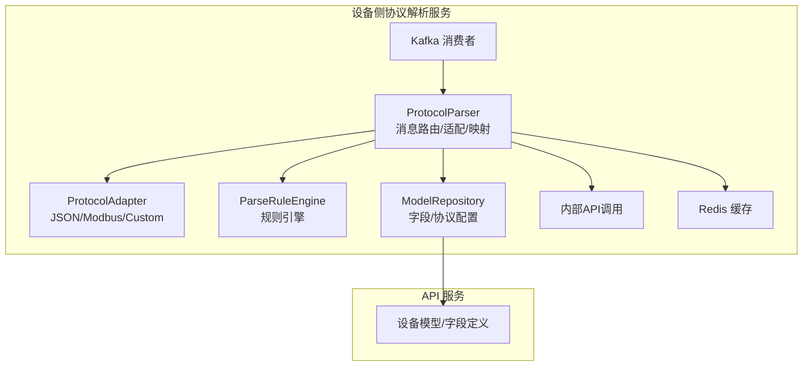
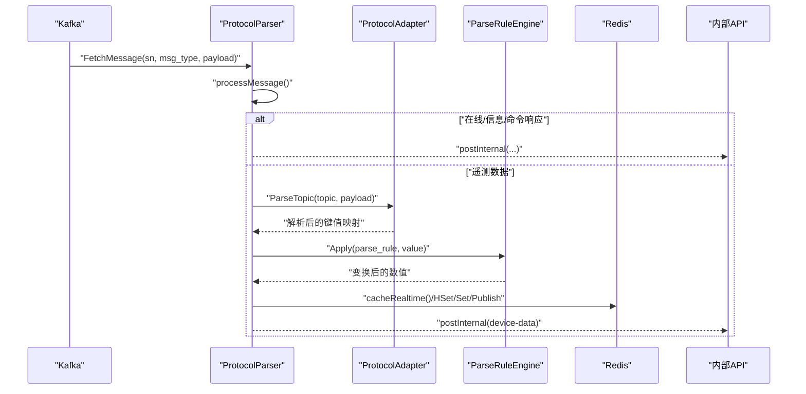
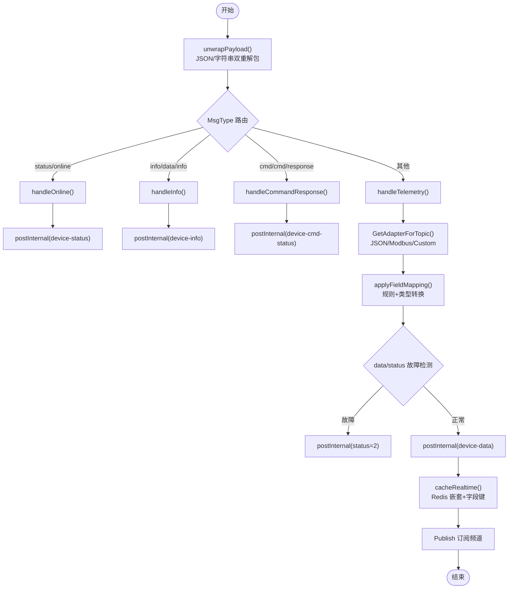
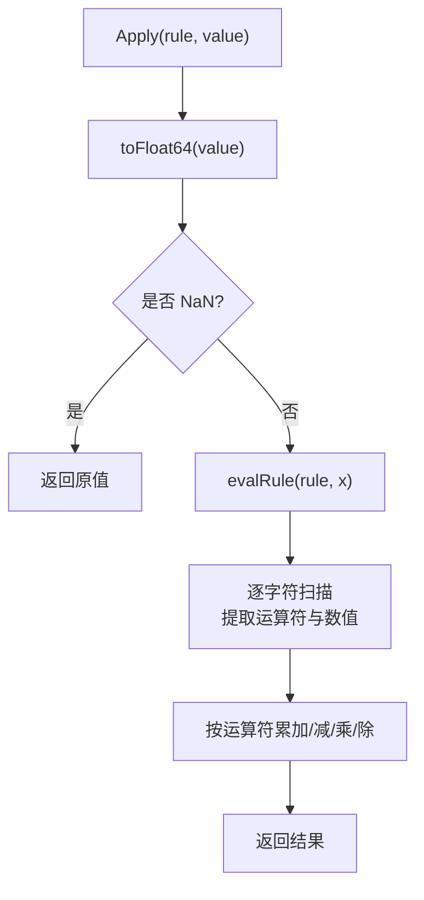
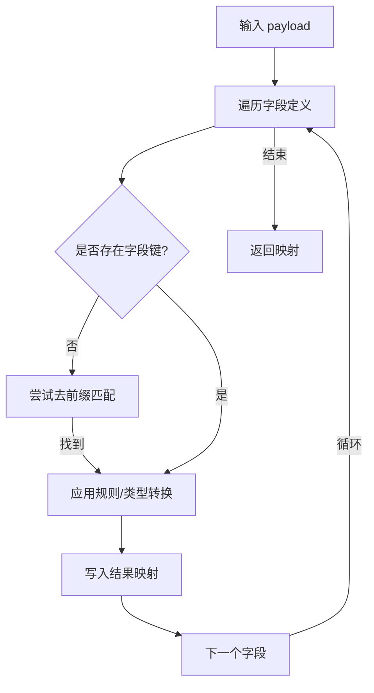
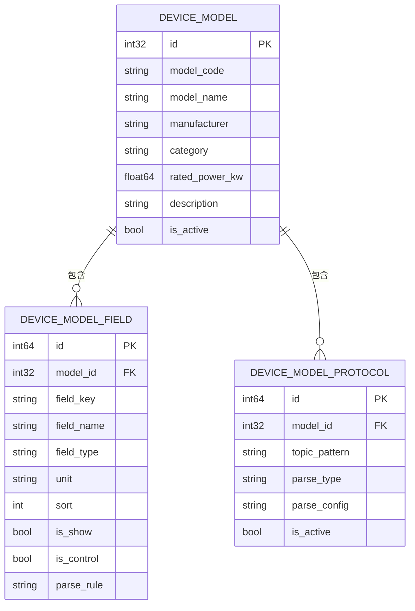
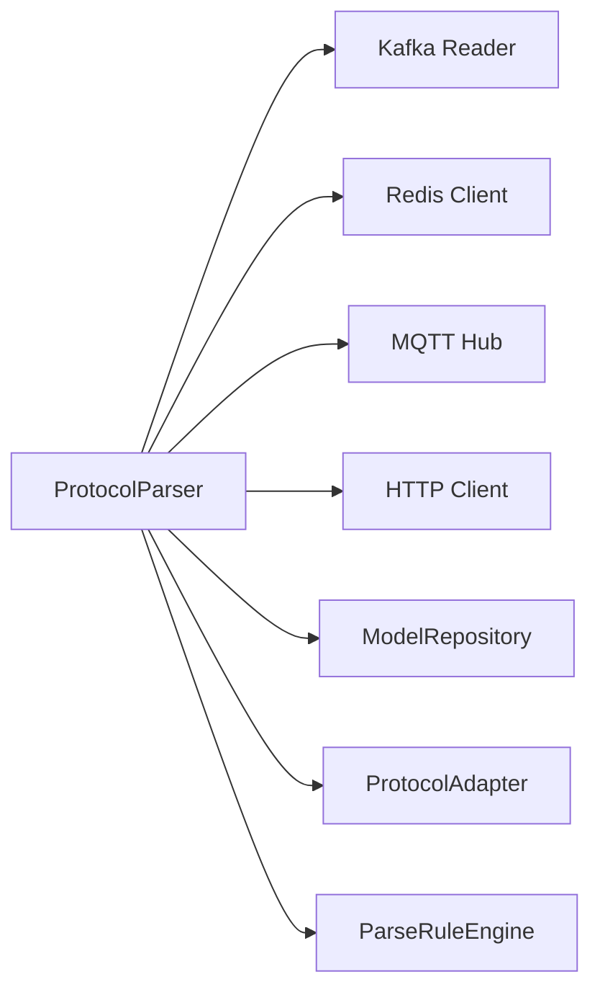

# 协议解析服务

<cite>
**本文引用的文件**
- [protocol_parser.go](file://inv_device_server/internal/service/protocol_parser.go)
- [protocol_adapter.go](file://inv_device_server/internal/service/protocol_adapter.go)
- [parse_rule.go](file://inv_device_server/internal/service/parse_rule.go)
- [metadata.go](file://inv_device_server/internal/model/metadata.go)
- [device.go](file://inv_device_server/internal/model/device.go)
- [models.go](file://inv_api_server/internal/model/models.go)
- [model_repository.go](file://inv_api_server/internal/repository/model_repository.go)
- [protocol_parser_test.go](file://inv_device_server/internal/service/protocol_parser_test.go)
</cite>

## 目录
1. [简介](#简介)
2. [项目结构](#项目结构)
3. [核心组件](#核心组件)
4. [架构总览](#架构总览)
5. [详细组件分析](#详细组件分析)
6. [依赖分析](#依赖分析)
7. [性能考虑](#性能考虑)
8. [故障排查指南](#故障排查指南)
9. [结论](#结论)
10. [附录](#附录)

## 简介
本文件面向协议解析服务，系统化阐述数据帧解析算法、字段映射规则、协议适配器设计模式、解析规则配置机制、扩展指南、性能优化策略以及调试与排错方法。该服务负责消费 Kafka 中的设备遥测数据，进行字节流解包、帧头识别、字段映射、类型转换、单位换算、范围验证、故障检测与缓存写入，并通过内部 API 将标准化数据传递给上层应用。

## 项目结构
协议解析服务位于设备侧服务模块中，核心文件包括：
- 协议解析器：负责 Kafka 消费、消息路由、适配器选择、字段映射、故障检测、缓存与内部 API 调用
- 协议适配器：针对不同协议类型（JSON、Modbus、自定义）进行 payload 解析
- 解析规则引擎：对数值字段执行简单代数变换
- 模型与元数据：设备型号、字段定义、协议配置等
- API 服务模型：设备型号与字段的持久化结构



图表来源
- [protocol_parser.go:29-91](file://inv_device_server/internal/service/protocol_parser.go#L29-L91)
- [protocol_adapter.go:15-145](file://inv_device_server/internal/service/protocol_adapter.go#L15-L145)
- [parse_rule.go:11-85](file://inv_device_server/internal/service/parse_rule.go#L11-L85)
- [model_repository.go:199-213](file://inv_api_server/internal/repository/model_repository.go#L199-L213)

章节来源
- [protocol_parser.go:1-120](file://inv_device_server/internal/service/protocol_parser.go#L1-L120)
- [protocol_adapter.go:1-190](file://inv_device_server/internal/service/protocol_adapter.go#L1-L190)
- [parse_rule.go:1-132](file://inv_device_server/internal/service/parse_rule.go#L1-L132)
- [metadata.go:1-129](file://inv_device_server/internal/model/metadata.go#L1-L129)
- [models.go:224-254](file://inv_api_server/internal/model/models.go#L224-L254)
- [model_repository.go:199-213](file://inv_api_server/internal/repository/model_repository.go#L199-L213)

## 核心组件
- 协议解析器 ProtocolParser
  - Kafka 消费与工作池：消费者、工作协程、消息通道与重试计数
  - 消息路由：根据 MsgType 分发到在线、信息、遥测或命令响应处理
  - 适配器选择：基于设备型号与主题的协议适配器
  - 字段映射与规则：依据字段定义执行规则变换与类型转换
  - 故障检测：data/status 主题下基于 state/fault_code 判定并上报
  - 缓存与发布：将实时数据写入 Redis 并发布到订阅频道
- 协议适配器 ProtocolAdapter
  - JSONAdapter：标准 JSON 解析
  - ModbusAdapter：字符串数字与十六进制解析为浮点
  - CustomAdapter：基于配置的字段映射
  - 主题匹配：支持通配符与前缀匹配
- 解析规则引擎 ParseRuleEngine
  - 支持形如“x + 10”、“x * 2”等一元表达式
  - 数值安全转换与 NaN 处理
- 模型与元数据
  - 设备模型、字段、协议配置的运行时缓存结构
  - 字段类型与单位定义，用于类型转换与显示

章节来源
- [protocol_parser.go:29-91](file://inv_device_server/internal/service/protocol_parser.go#L29-L91)
- [protocol_adapter.go:15-190](file://inv_device_server/internal/service/protocol_adapter.go#L15-L190)
- [parse_rule.go:11-132](file://inv_device_server/internal/service/parse_rule.go#L11-L132)
- [metadata.go:59-64](file://inv_device_server/internal/model/metadata.go#L59-L64)
- [models.go:224-254](file://inv_api_server/internal/model/models.go#L224-L254)

## 架构总览
协议解析服务采用“消费者-工作池-适配器-规则引擎-缓存/内部API”的流水线架构。Kafka 提供高吞吐的消息输入，ProtocolParser 负责解包、路由与预处理；ProtocolAdapter 负责协议特定的 payload 解析；ParseRuleEngine 执行字段级规则变换；最终将标准化数据写入 Redis 实时缓存并通过内部 API 发送到 API 服务。



图表来源
- [protocol_parser.go:230-245](file://inv_device_server/internal/service/protocol_parser.go#L230-L245)
- [protocol_parser.go:447-696](file://inv_device_server/internal/service/protocol_parser.go#L447-L696)
- [protocol_adapter.go:25-108](file://inv_device_server/internal/service/protocol_adapter.go#L25-L108)
- [parse_rule.go:17-29](file://inv_device_server/internal/service/parse_rule.go#L17-L29)

## 详细组件分析

### 组件A：协议解析器 ProtocolParser
职责与流程
- 消费与路由：从 Kafka 读取消息，反序列化为 RawMessage，按 MsgType 路由至对应处理器
- 在线状态处理：支持 payload 内 online 字段解析，结合 Redis 防抖与故障覆盖策略
- 信息处理：支持嵌套 data 字段与字符串包裹的 JSON payload
- 遥测处理：选择适配器解析 payload，应用字段映射与规则，构建带前缀字段以兼容查询，同时维护纯字段缓存
- 故障检测：data/status 主题下检测 state 或 fault_code，触发故障状态上报与防抖
- 缓存与发布：将最新数据写入 Redis，按主题分类嵌套存储，并发布到订阅频道

关键特性
- 并发模型：固定数量工作协程 + 消费协程 + 定期缓存刷新
- 错误处理：消息级重试上限、Kafka 提交、日志记录
- 防抖策略：基于 Redis key 的短期去抖，避免状态抖动与覆盖
- 时间戳处理：优先使用 payload 中 timestamp，否则回退当前时间



图表来源
- [protocol_parser.go:230-245](file://inv_device_server/internal/service/protocol_parser.go#L230-L245)
- [protocol_parser.go:267-309](file://inv_device_server/internal/service/protocol_parser.go#L267-L309)
- [protocol_parser.go:311-380](file://inv_device_server/internal/service/protocol_parser.go#L311-L380)
- [protocol_parser.go:743-756](file://inv_device_server/internal/service/protocol_parser.go#L743-L756)
- [protocol_parser.go:447-696](file://inv_device_server/internal/service/protocol_parser.go#L447-L696)
- [protocol_parser.go:758-814](file://inv_device_server/internal/service/protocol_parser.go#L758-L814)

章节来源
- [protocol_parser.go:93-135](file://inv_device_server/internal/service/protocol_parser.go#L93-L135)
- [protocol_parser.go:137-168](file://inv_device_server/internal/service/protocol_parser.go#L137-L168)
- [protocol_parser.go:170-185](file://inv_device_server/internal/service/protocol_parser.go#L170-L185)
- [protocol_parser.go:187-228](file://inv_device_server/internal/service/protocol_parser.go#L187-L228)
- [protocol_parser.go:230-245](file://inv_device_server/internal/service/protocol_parser.go#L230-L245)
- [protocol_parser.go:247-265](file://inv_device_server/internal/service/protocol_parser.go#L247-L265)
- [protocol_parser.go:267-309](file://inv_device_server/internal/service/protocol_parser.go#L267-L309)
- [protocol_parser.go:311-380](file://inv_device_server/internal/service/protocol_parser.go#L311-L380)
- [protocol_parser.go:447-696](file://inv_device_server/internal/service/protocol_parser.go#L447-L696)
- [protocol_parser.go:758-814](file://inv_device_server/internal/service/protocol_parser.go#L758-L814)

### 组件B：协议适配器 ProtocolAdapter
设计模式
- 接口抽象：统一 ParseTopic(topic, payload) 签名
- 多实现：JSONAdapter、ModbusAdapter、CustomAdapter
- 动态选择：根据设备型号协议配置与主题模式选择适配器

解析规则
- JSONAdapter：标准 JSON 解析，失败返回空
- ModbusAdapter：字符串数字解析为浮点，十六进制字符串转十进制浮点
- CustomAdapter：基于配置的字段映射，若存在映射则返回映射结果，否则原样返回
- 主题匹配：支持 “*”、“topic”、“prefix/*”、“prefix/+”、“#” 与 “+” 通配符

```mermaid
classDiagram
class ProtocolAdapter {
<<interface>>
+ParseTopic(topic string, payload []byte) map[string]interface{}
}
class JSONAdapter {
+ParseTopic(topic, payload) map[string]interface{}
}
class ModbusAdapter {
-fields map[string]*DeviceModelField
+ParseTopic(topic, payload) map[string]interface{}
}
class CustomAdapter {
-parseConfig map[string]interface{}
+ParseTopic(topic, payload) map[string]interface{}
}
ProtocolAdapter <|.. JSONAdapter
ProtocolAdapter <|.. ModbusAdapter
ProtocolAdapter <|.. CustomAdapter
```

图表来源
- [protocol_adapter.go:15-145](file://inv_device_server/internal/service/protocol_adapter.go#L15-L145)
- [metadata.go:23-36](file://inv_device_server/internal/model/metadata.go#L23-L36)

章节来源
- [protocol_adapter.go:15-190](file://inv_device_server/internal/service/protocol_adapter.go#L15-L190)

### 组件C：解析规则引擎 ParseRuleEngine
功能
- 规则语法：以“x”开头的一元表达式，支持 +、-、*、/ 运算
- 数值转换：将多种数值类型安全转换为 float64，字符串尝试解析，无法解析返回 NaN
- 异常处理：遇到 NaN 直接返回原值，避免污染后续处理



图表来源
- [parse_rule.go:17-85](file://inv_device_server/internal/service/parse_rule.go#L17-L85)
- [parse_rule.go:87-131](file://inv_device_server/internal/service/parse_rule.go#L87-L131)

章节来源
- [parse_rule.go:11-132](file://inv_device_server/internal/service/parse_rule.go#L11-L132)

### 组件D：字段映射与类型转换
映射规则
- 字段查找：优先按字段键直接匹配；若失败，尝试去除常见前缀（如 ac_、batt_、pv_、sys_、energy_、load_、meter_）后匹配
- 规则应用：若字段定义了 ParseRule，则先应用规则引擎变换
- 类型转换：根据字段类型（int、float、bool、string）进行转换
- 输出构建：生成最终字段集合，用于存储与缓存



图表来源
- [protocol_parser.go:698-741](file://inv_device_server/internal/service/protocol_parser.go#L698-L741)
- [parse_rule.go:117-131](file://inv_device_server/internal/service/parse_rule.go#L117-L131)

章节来源
- [protocol_parser.go:698-741](file://inv_device_server/internal/service/protocol_parser.go#L698-L741)
- [parse_rule.go:117-131](file://inv_device_server/internal/service/parse_rule.go#L117-L131)

### 组件E：设备模型与协议配置
模型结构
- 设备模型：包含型号编码、名称、制造商、类别、描述、激活状态等
- 字段定义：字段键、名称、类型、单位、排序、是否显示、是否控制、解析规则、分组等
- 协议配置：主题模式、解析类型、解析配置（JSON）、激活状态



图表来源
- [metadata.go:6-47](file://inv_device_server/internal/model/metadata.go#L6-L47)
- [models.go:224-254](file://inv_api_server/internal/model/models.go#L224-L254)

章节来源
- [metadata.go:1-129](file://inv_device_server/internal/model/metadata.go#L1-L129)
- [models.go:224-254](file://inv_api_server/internal/model/models.go#L224-L254)
- [model_repository.go:199-213](file://inv_api_server/internal/repository/model_repository.go#L199-L213)

## 依赖分析
- 组件耦合
  - ProtocolParser 依赖 Kafka Reader、Redis 客户端、MQTT Hub、HTTP 客户端、模型仓库
  - ProtocolAdapter 依赖模型元数据（字段定义）
  - ParseRuleEngine 与类型转换函数独立于外部组件
- 外部依赖
  - Kafka：消息输入
  - Redis：在线状态、防抖、实时缓存与发布
  - HTTP：内部 API 调用
- 循环依赖
  - 未发现直接循环依赖；各组件通过接口与结构体松耦合



图表来源
- [protocol_parser.go:29-91](file://inv_device_server/internal/service/protocol_parser.go#L29-L91)
- [protocol_adapter.go:15-145](file://inv_device_server/internal/service/protocol_adapter.go#L15-L145)
- [parse_rule.go:11-85](file://inv_device_server/internal/service/parse_rule.go#L11-L85)

章节来源
- [protocol_parser.go:29-91](file://inv_device_server/internal/service/protocol_parser.go#L29-L91)

## 性能考虑
- 并发与背压
  - 固定工作协程数量与消息通道容量，避免内存暴涨
  - Kafka Reader 的最小/最大字节配置平衡吞吐与延迟
- 缓存与去抖
  - Redis 防抖键减少重复状态上报，降低网络与下游压力
  - 实时缓存采用管道批量写入，提升写入效率
- 解析路径优化
  - 适配器与规则引擎尽量短路失败路径，避免无效计算
  - 字段映射时先做直接匹配，再尝试去前缀匹配，减少不必要的字符串处理
- 网络与超时
  - HTTP 客户端设置合理超时与连接池参数，避免阻塞
- 内存管理
  - 使用 map 复制与零拷贝 JSON 解析，避免大对象复制
  - 对于高频字段，优先使用 float64 与整型，减少装箱开销

## 故障排查指南
常见问题与定位
- Kafka 消费异常
  - 现象：日志出现 FetchMessage 错误，短暂休眠后重试
  - 排查：检查 Kafka Broker 地址、Topic 权限、消费者组一致性
- Payload 解包失败
  - 现象：日志提示 Failed to unmarshal raw message 或 payload 既非 JSON 对象也非 JSON 字符串
  - 排查：确认设备端 payload 是否被额外包裹为字符串；检查 JSON 结构与字段类型
- 适配器解析为空
  - 现象：适配器返回 nil，导致后续映射失败
  - 排查：确认协议类型与主题匹配；检查 Modbus 字符串是否可解析为数字
- 字段映射缺失
  - 现象：某些字段未出现在最终映射中
  - 排查：确认字段键是否与设备实际上报键一致；尝试去前缀匹配逻辑
- 故障上报异常
  - 现象：故障状态未上报或被覆盖
  - 排查：检查 Redis 防抖键与 TTL；确认 data/status 主题下的 state/fault_code 字段
- 内部 API 调用失败
  - 现象：postInternal 返回 4xx/5xx
  - 排查：检查内部密钥、API 地址、重试与退避策略；关注响应体内容

章节来源
- [protocol_parser.go:197-202](file://inv_device_server/internal/service/protocol_parser.go#L197-L202)
- [protocol_parser.go:204-212](file://inv_device_server/internal/service/protocol_parser.go#L204-L212)
- [protocol_parser.go:247-265](file://inv_device_server/internal/service/protocol_parser.go#L247-L265)
- [protocol_parser.go:492-511](file://inv_device_server/internal/service/protocol_parser.go#L492-L511)
- [protocol_parser.go:528-606](file://inv_device_server/internal/service/protocol_parser.go#L528-L606)
- [protocol_parser.go:382-445](file://inv_device_server/internal/service/protocol_parser.go#L382-L445)

## 结论
协议解析服务通过清晰的组件划分与可扩展的适配器模式，实现了对多设备型号与多协议类型的统一接入。借助规则引擎与字段映射，系统能够灵活地完成数据类型转换、单位换算与范围验证。配合 Redis 缓存与防抖策略，服务在高并发场景下具备良好的稳定性与性能表现。建议在新增协议时遵循现有模式，确保配置与适配器扩展的向后兼容性。

## 附录

### 数据帧解析算法与字段映射规则
- 字节流处理
  - 支持 JSON 对象与字符串包裹的 JSON 两种形式，自动解包
  - 对于 info/data/info 主题，支持嵌套 data 字段
- 帧头识别
  - 通过 MsgType 与主题模式识别消息类型与来源
  - 主题匹配支持通配符与前缀匹配
- 校验与错误检测
  - 适配器解析失败返回空，上层进行日志记录与跳过处理
  - data/status 主题下基于 state/fault_code 主动检测故障
- 字段映射
  - 直接匹配字段键；若失败尝试去前缀匹配
  - 应用字段 ParseRule 后进行类型转换
  - 输出字段集合用于存储与缓存

章节来源
- [protocol_parser.go:247-265](file://inv_device_server/internal/service/protocol_parser.go#L247-L265)
- [protocol_parser.go:492-511](file://inv_device_server/internal/service/protocol_parser.go#L492-L511)
- [protocol_parser.go:698-741](file://inv_device_server/internal/service/protocol_parser.go#L698-L741)
- [protocol_adapter.go:147-189](file://inv_device_server/internal/service/protocol_adapter.go#L147-L189)

### 协议适配器设计模式与多设备型号支持
- 设计模式
  - 接口抽象 + 多实现，便于扩展新协议
  - 运行时根据设备型号与主题选择适配器
- 多设备型号差异
  - 不同型号可配置不同协议类型与解析配置
  - 通过字段定义与 ParseRule 实现差异化处理

章节来源
- [protocol_adapter.go:110-145](file://inv_device_server/internal/service/protocol_adapter.go#L110-L145)
- [metadata.go:39-47](file://inv_device_server/internal/model/metadata.go#L39-L47)

### 解析规则配置机制
- 规则语法
  - 以“x”表示原始值，支持 +、-、*、/ 运算
- 配置位置
  - 字段定义中的 parse_rule 字段
- 应用时机
  - 字段映射阶段，在类型转换之前执行

章节来源
- [parse_rule.go:31-85](file://inv_device_server/internal/service/parse_rule.go#L31-L85)
- [protocol_parser.go:732-734](file://inv_device_server/internal/service/protocol_parser.go#L732-L734)
- [models.go:247-247](file://inv_api_server/internal/model/models.go#L247-L247)

### 设备协议扩展指南
- 新增协议步骤
  - 在 API 服务中为设备型号配置协议项（主题模式、解析类型、解析配置）
  - 在设备侧适配器中新增适配器实现并注册
  - 在字段定义中补充字段键、类型、单位与解析规则
- 兼容性保证
  - 保持字段键稳定，必要时通过去前缀匹配兼容旧字段
  - 逐步迁移 ParseRule，避免破坏既有逻辑

章节来源
- [protocol_adapter.go:110-145](file://inv_device_server/internal/service/protocol_adapter.go#L110-L145)
- [models.go:252-254](file://inv_api_server/internal/model/models.go#L252-L254)
- [model_repository.go:199-213](file://inv_api_server/internal/repository/model_repository.go#L199-L213)

### 性能优化策略与并发处理
- 并发模型
  - 固定工作协程数量与消息通道容量，避免阻塞
  - Kafka Reader 最小/最大字节配置平衡吞吐与延迟
- 缓存与发布
  - Redis 管道批量写入，减少 RTT
  - 防抖键缩短重复上报
- 内存与网络
  - 合理设置 HTTP 客户端连接池与超时
  - 避免大对象复制，优先使用基础类型

章节来源
- [protocol_parser.go:55-91](file://inv_device_server/internal/service/protocol_parser.go#L55-L91)
- [protocol_parser.go:758-814](file://inv_device_server/internal/service/protocol_parser.go#L758-L814)

### 调试工具与常见错误解决
- 日志级别
  - 使用 Info 级别记录关键路径（如 data/status payload 接收），便于排查
- 关键路径验证
  - 使用单元测试验证消息类型路由与 payload 解包
- 常见错误
  - 设备端 payload 包裹字符串：使用 unwrapPayload 自动解包
  - 适配器解析失败：检查协议类型与主题匹配
  - 字段映射缺失：核对字段键与去前缀匹配逻辑

章节来源
- [protocol_parser_test.go:8-92](file://inv_device_server/internal/service/protocol_parser_test.go#L8-L92)
- [protocol_parser_test.go:94-127](file://inv_device_server/internal/service/protocol_parser_test.go#L94-L127)
- [protocol_parser.go:247-265](file://inv_device_server/internal/service/protocol_parser.go#L247-L265)