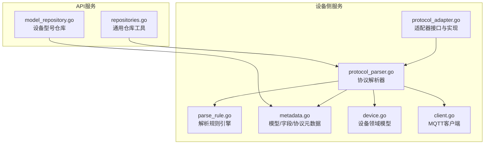
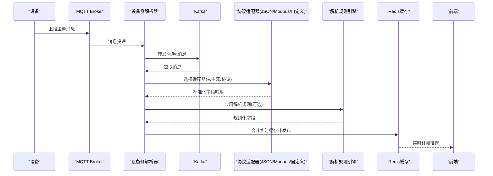
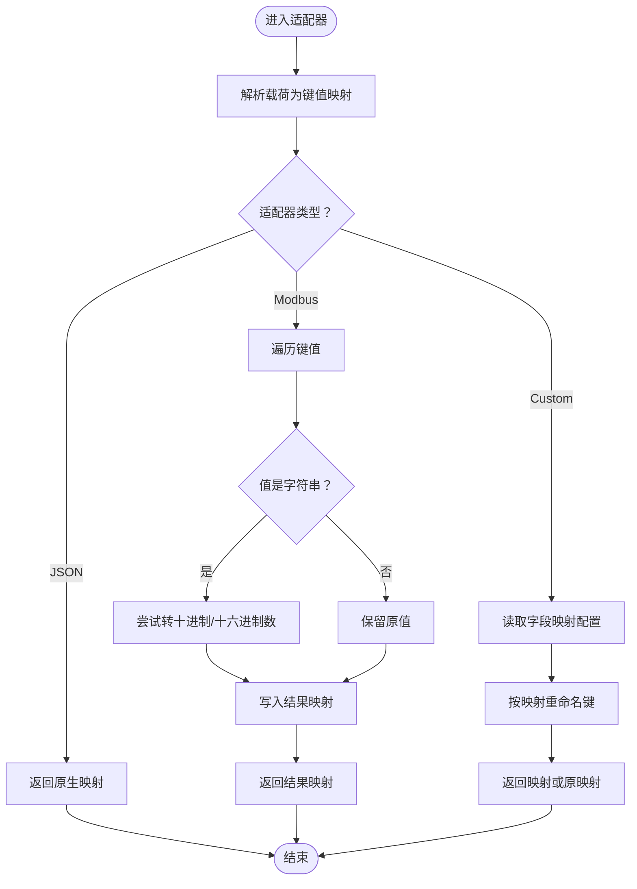
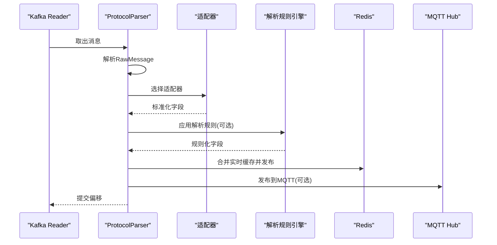
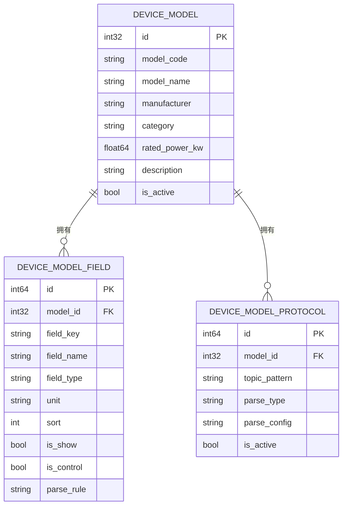
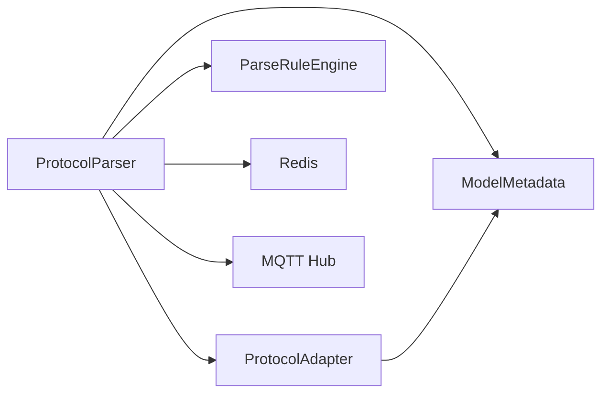

# 协议适配器

<cite>
**本文引用的文件**
- [protocol_adapter.go](file://inv_device_server/internal/service/protocol_adapter.go)
- [protocol_parser.go](file://inv_device_server/internal/service/protocol_parser.go)
- [parse_rule.go](file://inv_device_server/internal/service/parse_rule.go)
- [metadata.go](file://inv_device_server/internal/model/metadata.go)
- [device.go](file://inv_device_server/internal/model/device.go)
- [protocol_parser_test.go](file://inv_device_server/internal/service/protocol_parser_test.go)
- [client.go](file://inv_device_server/internal/mqtt/client.go)
- [model_repository.go](file://inv_api_server/internal/repository/model_repository.go)
- [repositories.go](file://inv_api_server/internal/repository/repositories.go)
</cite>

## 目录
1. [引言](#引言)
2. [项目结构](#项目结构)
3. [核心组件](#核心组件)
4. [架构总览](#架构总览)
5. [详细组件分析](#详细组件分析)
6. [依赖分析](#依赖分析)
7. [性能考虑](#性能考虑)
8. [故障排查指南](#故障排查指南)
9. [结论](#结论)
10. [附录：适配器开发指南与最佳实践](#附录适配器开发指南与最佳实践)

## 引言
本文件系统化阐述“协议适配器”在设备数据接入链路中的设计与实现，重点覆盖：
- 适配器设计模式：如何以统一接口对接多种设备协议与消息主题
- 多设备型号支持与协议差异处理：基于设备型号元数据的动态适配
- 主题适配器机制：消息主题识别、字段提取与数据重组
- 工厂模式：设备型号到适配器的映射与动态选择
- 协议扩展机制：新增设备型号流程、向后兼容与版本管理
- 开发指南：接口定义、实现规范、测试方法与最佳实践

## 项目结构
协议适配器位于设备侧服务模块，配合解析引擎、MQTT客户端、Redis缓存与API服务共同完成从设备到前端的全链路数据处理。



图表来源
- [protocol_adapter.go:1-189](file://inv_device_server/internal/service/protocol_adapter.go#L1-L189)
- [protocol_parser.go:1-845](file://inv_device_server/internal/service/protocol_parser.go#L1-L845)
- [parse_rule.go:1-132](file://inv_device_server/internal/service/parse_rule.go#L1-L132)
- [metadata.go:1-129](file://inv_device_server/internal/model/metadata.go#L1-L129)
- [device.go:1-227](file://inv_device_server/internal/model/device.go#L1-L227)
- [client.go:326-378](file://inv_device_server/internal/mqtt/client.go#L326-L378)
- [model_repository.go:1-104](file://inv_api_server/internal/repository/model_repository.go#L1-L104)
- [repositories.go:1967-2020](file://inv_api_server/internal/repository/repositories.go#L1967-L2020)

章节来源
- [protocol_adapter.go:1-189](file://inv_device_server/internal/service/protocol_adapter.go#L1-L189)
- [protocol_parser.go:1-845](file://inv_device_server/internal/service/protocol_parser.go#L1-L845)
- [metadata.go:1-129](file://inv_device_server/internal/model/metadata.go#L1-L129)
- [device.go:1-227](file://inv_device_server/internal/model/device.go#L1-L227)
- [client.go:326-378](file://inv_device_server/internal/mqtt/client.go#L326-L378)
- [model_repository.go:1-104](file://inv_api_server/internal/repository/model_repository.go#L1-L104)
- [repositories.go:1967-2020](file://inv_api_server/internal/repository/repositories.go#L1967-L2020)

## 核心组件
- 适配器接口与实现
  - 统一接口：接收主题与载荷，返回标准化字段映射
  - 内置实现：JSON直通、Modbus解析、自定义映射
- 解析规则引擎
  - 支持对数值型字段进行表达式变换与类型转换
- 协议解析器
  - 消费Kafka消息，路由到对应适配器，合并实时缓存并发布到Redis通道
- 元数据与领域模型
  - 设备型号、字段、协议配置与设备实体模型
- MQTT客户端
  - 提供主题匹配与命令下发能力

章节来源
- [protocol_adapter.go:15-189](file://inv_device_server/internal/service/protocol_adapter.go#L15-L189)
- [parse_rule.go:11-132](file://inv_device_server/internal/service/parse_rule.go#L11-L132)
- [protocol_parser.go:29-845](file://inv_device_server/internal/service/protocol_parser.go#L29-L845)
- [metadata.go:59-64](file://inv_device_server/internal/model/metadata.go#L59-L64)
- [device.go:8-227](file://inv_device_server/internal/model/device.go#L8-L227)
- [client.go:326-378](file://inv_device_server/internal/mqtt/client.go#L326-L378)

## 架构总览
下图展示了从MQTT/Kafka到适配器、解析引擎、缓存与前端的完整链路。



图表来源
- [protocol_parser.go:103-135](file://inv_device_server/internal/service/protocol_parser.go#L103-L135)
- [protocol_parser.go:784-833](file://inv_device_server/internal/service/protocol_parser.go#L784-L833)
- [protocol_adapter.go:110-145](file://inv_device_server/internal/service/protocol_adapter.go#L110-L145)
- [parse_rule.go:17-85](file://inv_device_server/internal/service/parse_rule.go#L17-L85)
- [client.go:326-378](file://inv_device_server/internal/mqtt/client.go#L326-L378)

## 详细组件分析

### 适配器接口与工厂
- 接口职责
  - ParseTopic(topic, payload) -> map[string]interface{}
- 内置适配器
  - JSONAdapter：直接反序列化JSON
  - ModbusAdapter：将字符串十六进制或数字转浮点，过滤非数值
  - CustomAdapter：根据字段映射配置重命名键
- 工厂方法
  - GetAdapterForModel：按设备型号默认协议选择适配器
  - GetAdapterForTopic：按主题匹配协议选择适配器
  - 主题匹配规则：支持通配符“*”、“+”、“#”，前缀匹配等

```mermaid
classDiagram
class ProtocolAdapter {
+ParseTopic(topic, payload) map[string]interface{}
}
class JSONAdapter {
+ParseTopic(topic, payload) map[string]interface{}
}
class ModbusAdapter {
-fields map[string]*DeviceModelField
+ParseTopic(topic, payload) map[string]interface{}
}
class CustomAdapter {
-parseConfig map[string]interface{}
+ParseTopic(topic, payload) map[string]interface{}
}
class Factory {
+GetAdapterForModel(meta) ProtocolAdapter
+GetAdapterForTopic(meta, topic) ProtocolAdapter
}
ProtocolAdapter <|.. JSONAdapter
ProtocolAdapter <|.. ModbusAdapter
ProtocolAdapter <|.. CustomAdapter
Factory --> ProtocolAdapter : "创建/选择"
```

图表来源
- [protocol_adapter.go:15-145](file://inv_device_server/internal/service/protocol_adapter.go#L15-L145)
- [metadata.go:23-47](file://inv_device_server/internal/model/metadata.go#L23-L47)

章节来源
- [protocol_adapter.go:15-145](file://inv_device_server/internal/service/protocol_adapter.go#L15-L145)
- [metadata.go:23-47](file://inv_device_server/internal/model/metadata.go#L23-L47)

### 主题适配器与消息处理
- 主题识别与适配器选择
  - 优先按主题匹配协议；若未匹配，默认使用JSON适配器
- 字段提取与数据重组
  - Modbus适配器：将字符串数字/十六进制转为数值，保留其他类型
  - 自定义适配器：依据字段映射配置重命名键
- 解析规则应用
  - 解析规则引擎支持加减乘除与变量“x”的简单表达式，最终按字段类型转换



图表来源
- [protocol_adapter.go:25-108](file://inv_device_server/internal/service/protocol_adapter.go#L25-L108)
- [parse_rule.go:17-131](file://inv_device_server/internal/service/parse_rule.go#L17-L131)

章节来源
- [protocol_adapter.go:25-108](file://inv_device_server/internal/service/protocol_adapter.go#L25-L108)
- [parse_rule.go:17-131](file://inv_device_server/internal/service/parse_rule.go#L17-L131)

### 协议解析器与实时缓存
- 职责
  - 消费Kafka消息，解析原始消息，选择适配器，合并实时缓存，发布到Redis通道
- 关键流程
  - 消息入队与工作协程处理
  - 设备信息注册与合并
  - 实时缓存结构：按主题分类存储字段，同时提供单字段快速查询
  - 主题类别推断：data/ac → ac；data/battery → batt；data/pv → pv；data/status → sys；data/energy → ener
- 错误处理
  - 最大重试次数控制，超过阈值记录错误并提交偏移



图表来源
- [protocol_parser.go:103-135](file://inv_device_server/internal/service/protocol_parser.go#L103-L135)
- [protocol_parser.go:361-380](file://inv_device_server/internal/service/protocol_parser.go#L361-L380)
- [protocol_parser.go:784-833](file://inv_device_server/internal/service/protocol_parser.go#L784-L833)
- [protocol_parser.go:835-845](file://inv_device_server/internal/service/protocol_parser.go#L835-L845)

章节来源
- [protocol_parser.go:103-135](file://inv_device_server/internal/service/protocol_parser.go#L103-L135)
- [protocol_parser.go:361-380](file://inv_device_server/internal/service/protocol_parser.go#L361-L380)
- [protocol_parser.go:784-833](file://inv_device_server/internal/service/protocol_parser.go#L784-L833)
- [protocol_parser.go:835-845](file://inv_device_server/internal/service/protocol_parser.go#L835-L845)

### 元数据与设备模型
- 设备型号元数据
  - ModelMetadata：包含设备型号、字段映射、字段顺序、协议配置
- 设备领域模型
  - 设备信息、在线状态、AC/Battery/PV/System/Energy/Cells/Alarm/CommandResponse等
- API侧模型仓库
  - 提供设备型号的增删改查与字段持久化



图表来源
- [metadata.go:6-47](file://inv_device_server/internal/model/metadata.go#L6-L47)
- [model_repository.go:20-104](file://inv_api_server/internal/repository/model_repository.go#L20-L104)

章节来源
- [metadata.go:6-47](file://inv_device_server/internal/model/metadata.go#L6-L47)
- [model_repository.go:20-104](file://inv_api_server/internal/repository/model_repository.go#L20-L104)

## 依赖分析
- 组件耦合
  - ProtocolParser依赖ProtocolAdapter、ParseRuleEngine、ModelMetadata、Redis、MQTT Hub
  - ProtocolAdapter依赖ModelMetadata中的字段与协议配置
- 外部依赖
  - Kafka：消息队列
  - Redis：实时缓存与发布订阅
  - MQTT：命令下发与状态上报
- 潜在循环依赖
  - 当前模块间为单向依赖，无明显循环



图表来源
- [protocol_parser.go:29-45](file://inv_device_server/internal/service/protocol_parser.go#L29-L45)
- [protocol_adapter.go:15-189](file://inv_device_server/internal/service/protocol_adapter.go#L15-L189)
- [parse_rule.go:11-15](file://inv_device_server/internal/service/parse_rule.go#L11-L15)
- [metadata.go:59-64](file://inv_device_server/internal/model/metadata.go#L59-L64)

章节来源
- [protocol_parser.go:29-45](file://inv_device_server/internal/service/protocol_parser.go#L29-L45)
- [protocol_adapter.go:15-189](file://inv_device_server/internal/service/protocol_adapter.go#L15-L189)
- [parse_rule.go:11-15](file://inv_device_server/internal/service/parse_rule.go#L11-L15)
- [metadata.go:59-64](file://inv_device_server/internal/model/metadata.go#L59-L64)

## 性能考虑
- 并发与吞吐
  - 解析器采用工作协程与消息通道，具备良好并发扩展性
- 缓存策略
  - Redis缓存实时数据与单字段快照，减少重复计算与查询
- 解析成本
  - 解析规则引擎仅在必要时应用，避免对所有字段强制转换
- 重试与稳定性
  - Kafka消费失败具备指数退避与最大重试限制，防止雪崩

## 故障排查指南
- 适配器解析失败
  - 检查设备上报主题是否匹配协议配置的topic_pattern
  - 确认payload是否为合法JSON
- 实时缓存异常
  - 核对主题类别推断逻辑与字段合并路径
  - 检查Redis连接与键空间命名
- 命令下发问题
  - 使用MQTT客户端的主题匹配函数确认目标主题
- 单元测试参考
  - RawMessage解析、消息类型路由、在线状态值处理等测试用例可作为行为基线

章节来源
- [protocol_parser_test.go:8-157](file://inv_device_server/internal/service/protocol_parser_test.go#L8-L157)
- [client.go:326-378](file://inv_device_server/internal/mqtt/client.go#L326-L378)

## 结论
协议适配器通过统一接口与工厂模式，实现了对多设备型号与多协议的灵活支持；结合解析规则引擎与实时缓存，既保证了数据一致性与性能，又为后续扩展提供了清晰边界。建议在新增设备型号时，优先完善元数据与协议配置，再按需扩展适配器或解析规则。

## 附录：适配器开发指南与最佳实践
- 接口定义
  - 实现ParseTopic(topic, payload) -> map[string]interface{}
  - 保持幂等与可预测的输出结构
- 实现规范
  - JSON直通：严格校验JSON合法性
  - Modbus解析：明确字符串/十六进制/数值的转换边界
  - 自定义映射：提供健壮的字段映射配置与回退策略
- 扩展机制
  - 新增适配器：实现接口并在工厂中注册
  - 新增设备型号：在API侧维护设备型号、字段与协议配置
  - 版本管理：通过协议配置与解析规则实现向后兼容
- 测试方法
  - 单元测试：覆盖典型场景、边界条件与错误分支
  - 集成测试：模拟Kafka消息、Redis缓存与MQTT交互
- 最佳实践
  - 明确主题与协议的绑定关系
  - 对外部依赖（Kafka/Redis/MQTT）做好可观测与降级策略
  - 保持字段命名与单位的一致性，便于前端渲染与报表生成