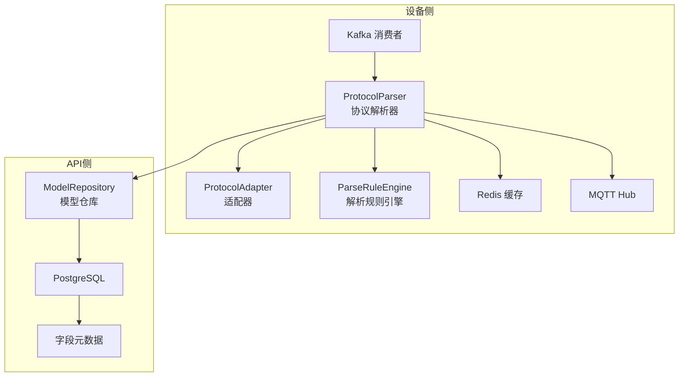
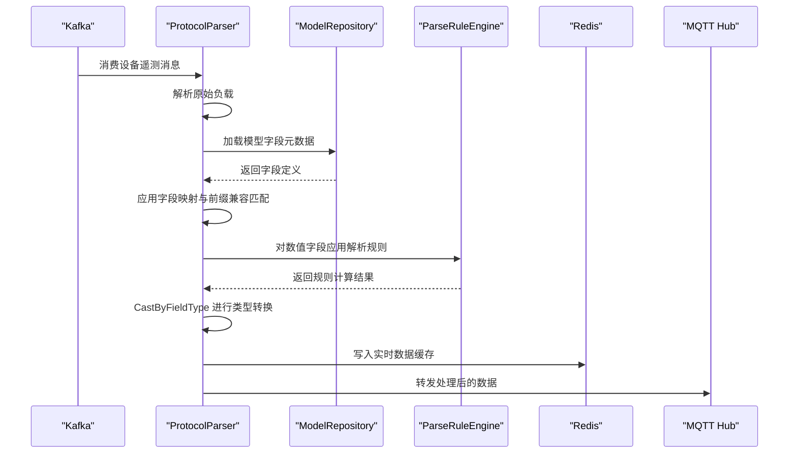
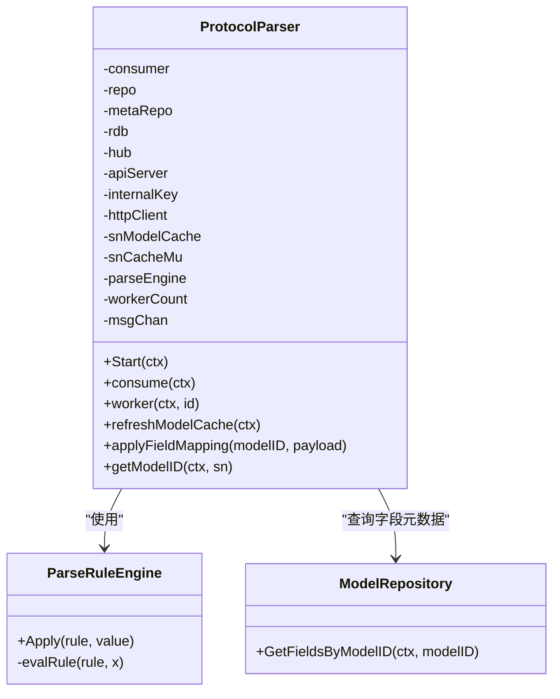
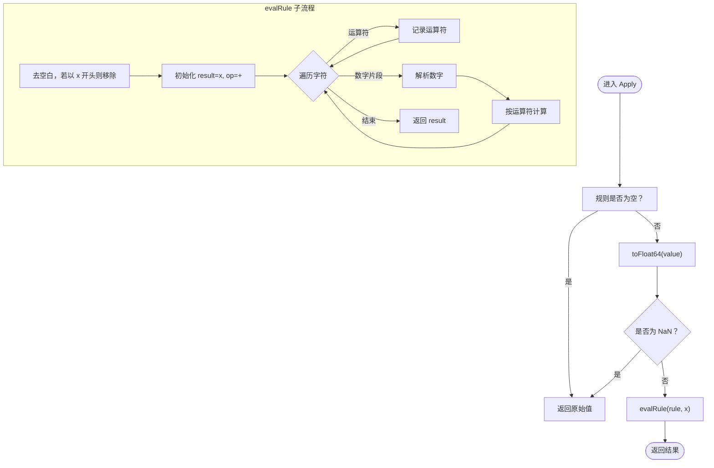
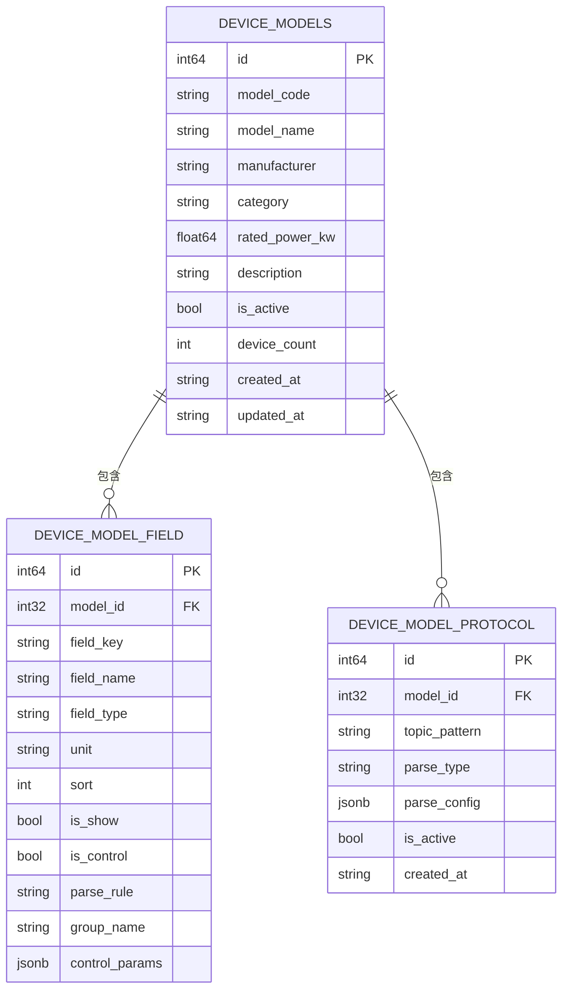
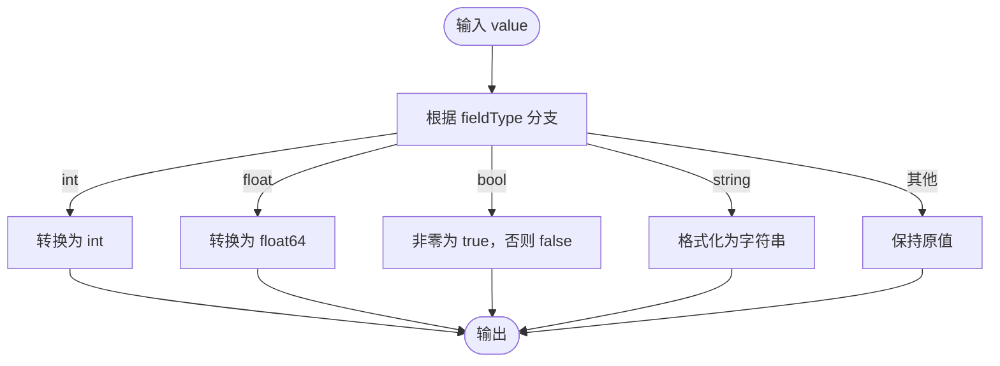
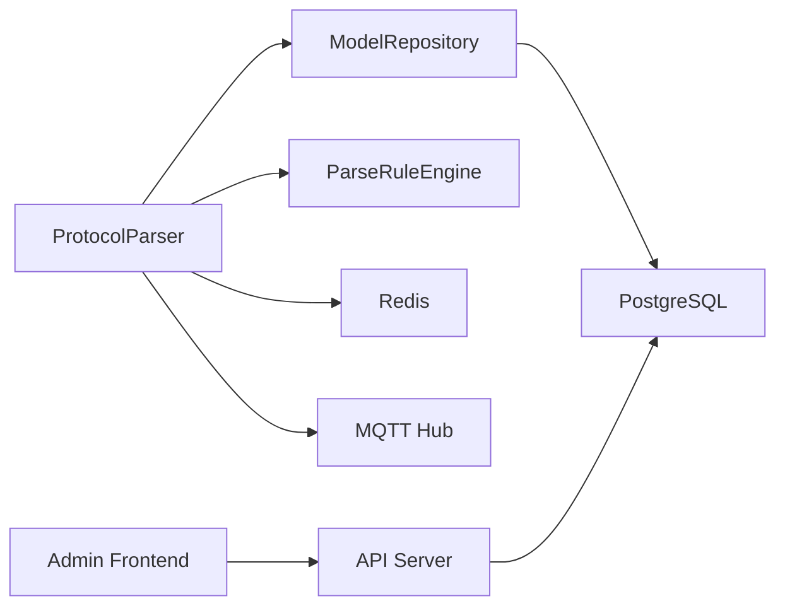

# 字段映射引擎

<cite>
**本文档引用的文件**
- [protocol_parser.go](file://inv_device_server/internal/service/protocol_parser.go)
- [parse_rule.go](file://inv_device_server/internal/service/parse_rule.go)
- [protocol_adapter.go](file://inv_device_server/internal/service/protocol_adapter.go)
- [model_repository.go](file://inv_api_server/internal/repository/model_repository.go)
- [repositories.go](file://inv_api_server/internal/repository/repositories.go)
- [models.go](file://inv_api_server/internal/model/models.go)
- [device.go](file://inv_device_server/internal/model/device.go)
- [sn.go](file://inv_api_server/pkg/sn/sn.go)
- [format.ts](file://inv-admin-frontend/src/utils/format.ts)
</cite>

## 目录
1. [简介](#简介)
2. [项目结构](#项目结构)
3. [核心组件](#核心组件)
4. [架构总览](#架构总览)
5. [详细组件分析](#详细组件分析)
6. [依赖关系分析](#依赖关系分析)
7. [性能考虑](#性能考虑)
8. [故障排除指南](#故障排除指南)
9. [结论](#结论)
10. [附录](#附录)

## 简介
本技术文档围绕字段映射引擎展开，系统性阐述以下能力：
- 字段名称映射：基于设备模型的字段键到标准字段键的映射，支持前缀兼容匹配。
- 数据类型转换：根据字段类型定义进行整数、浮点、布尔、字符串等转换。
- 单位换算与动态计算：通过解析规则引擎对数值进行加减乘除运算。
- 解析规则引擎：支持形如“x+10”的简单表达式，自动识别变量x并执行运算。
- 字段缓存机制：设备型号缓存、字段元数据缓存、实时数据缓存，提升查询与处理效率。
- 类型转换函数：统一的数值、布尔、字符串转换逻辑，保障数据一致性。
- 配置示例与最佳实践：复杂字段映射、嵌套字段处理、规则配置思路。
- 性能优化与错误处理：并发工作池、缓存刷新、降级策略与异常恢复。

## 项目结构
字段映射引擎主要分布在设备侧协议解析服务与API侧模型仓库之间，形成“消费-解析-映射-转换-存储”的闭环。



图表来源
- [protocol_parser.go:29-91](file://inv_device_server/internal/service/protocol_parser.go#L29-L91)
- [protocol_adapter.go:75-113](file://inv_device_server/internal/service/protocol_adapter.go#L75-L113)
- [parse_rule.go:11-85](file://inv_device_server/internal/service/parse_rule.go#L11-L85)
- [model_repository.go:117-143](file://inv_api_server/internal/repository/model_repository.go#L117-L143)

章节来源
- [protocol_parser.go:29-91](file://inv_device_server/internal/service/protocol_parser.go#L29-L91)
- [protocol_adapter.go:75-113](file://inv_device_server/internal/service/protocol_adapter.go#L75-L113)
- [parse_rule.go:11-85](file://inv_device_server/internal/service/parse_rule.go#L11-L85)
- [model_repository.go:117-143](file://inv_api_server/internal/repository/model_repository.go#L117-L143)

## 核心组件
- 协议解析器（ProtocolParser）：负责从Kafka消费消息、解析原始负载、应用字段映射与类型转换、写入缓存与转发。
- 解析规则引擎（ParseRuleEngine）：对单个数值字段执行简单数学表达式计算。
- 字段适配器（ProtocolAdapter）：支持自定义字段映射配置，将原始键映射到目标键。
- 模型仓库（ModelRepository）：从数据库加载设备模型字段元数据，供解析器使用。
- 类型转换函数（CastByFieldType）：依据字段类型进行统一转换。
- 缓存层：Redis缓存设备实时数据与模型信息，降低数据库压力。

章节来源
- [protocol_parser.go:29-91](file://inv_device_server/internal/service/protocol_parser.go#L29-L91)
- [parse_rule.go:117-131](file://inv_device_server/internal/service/parse_rule.go#L117-L131)
- [protocol_adapter.go:75-113](file://inv_device_server/internal/service/protocol_adapter.go#L75-L113)
- [model_repository.go:117-143](file://inv_api_server/internal/repository/model_repository.go#L117-L143)

## 架构总览
字段映射引擎的关键流程如下：



图表来源
- [protocol_parser.go:187-741](file://inv_device_server/internal/service/protocol_parser.go#L187-L741)
- [parse_rule.go:17-85](file://inv_device_server/internal/service/parse_rule.go#L17-L85)
- [model_repository.go:117-143](file://inv_api_server/internal/repository/model_repository.go#L117-L143)

## 详细组件分析

### 组件A：协议解析器（ProtocolParser）
职责与特性：
- 并发消费：启动多个工作协程处理消息队列，提高吞吐。
- 设备模型缓存：周期性加载设备列表，建立SN到模型ID的内存缓存，减少数据库查询。
- 字段映射与兼容匹配：支持字段键带前缀（如ac_、batt_、pv_等）的自动去除与匹配。
- 规则应用与类型转换：对每个字段应用解析规则与类型转换。
- 实时缓存同步：将处理后的数据写入Redis，保持与数据库一致。
- 告警与状态上报：检测故障状态并上报至API服务器。



图表来源
- [protocol_parser.go:29-91](file://inv_device_server/internal/service/protocol_parser.go#L29-L91)
- [protocol_parser.go:698-741](file://inv_device_server/internal/service/protocol_parser.go#L698-L741)
- [parse_rule.go:11-29](file://inv_device_server/internal/service/parse_rule.go#L11-L29)
- [model_repository.go:117-143](file://inv_api_server/internal/repository/model_repository.go#L117-L143)

章节来源
- [protocol_parser.go:93-186](file://inv_device_server/internal/service/protocol_parser.go#L93-L186)
- [protocol_parser.go:151-185](file://inv_device_server/internal/service/protocol_parser.go#L151-L185)
- [protocol_parser.go:698-741](file://inv_device_server/internal/service/protocol_parser.go#L698-L741)

### 组件B：解析规则引擎（ParseRuleEngine）
功能概述：
- 接收规则字符串与数值输入，返回计算结果。
- 支持以“x”表示原值的简单表达式，如“x+10”、“x*0.9”等。
- 自动跳过无效或无法解析的部分，保证鲁棒性。



图表来源
- [parse_rule.go:17-85](file://inv_device_server/internal/service/parse_rule.go#L17-L85)
- [parse_rule.go:87-115](file://inv_device_server/internal/service/parse_rule.go#L87-L115)

章节来源
- [parse_rule.go:11-85](file://inv_device_server/internal/service/parse_rule.go#L11-L85)
- [parse_rule.go:87-115](file://inv_device_server/internal/service/parse_rule.go#L87-L115)

### 组件C：字段适配器（ProtocolAdapter）
功能概述：
- 支持自定义字段映射配置，将原始键映射到目标键。
- 对字符串类型的数值进行安全解析，支持十六进制前缀（0x/0X）。
- 默认适配器在无配置时直接透传原始负载。

```mermaid
classDiagram
class ProtocolAdapter {
<<interface>>
+ParseTopic(topic, payload) map[string]interface{}
}
class JSONAdapter {
+ParseTopic(topic, payload) map[string]interface{}
}
class CustomAdapter {
-parseConfig
+NewCustomAdapter(configJSON)
+ParseTopic(topic, payload) map[string]interface{}
}
ProtocolAdapter <|.. JSONAdapter
ProtocolAdapter <|.. CustomAdapter
```

图表来源
- [protocol_adapter.go:75-113](file://inv_device_server/internal/service/protocol_adapter.go#L75-L113)

章节来源
- [protocol_adapter.go:51-73](file://inv_device_server/internal/service/protocol_adapter.go#L51-L73)
- [protocol_adapter.go:87-108](file://inv_device_server/internal/service/protocol_adapter.go#L87-L108)

### 组件D：模型仓库与字段元数据
- 字段元数据：包含字段键、字段名、字段类型、单位、排序、是否展示、是否控制、解析规则、分组名、控制参数等。
- 协议配置：设备模型可配置多种解析协议，每条协议包含主题模式、解析类型与配置。



图表来源
- [models.go:237-254](file://inv_api_server/internal/model/models.go#L237-L254)
- [model_repository.go:117-143](file://inv_api_server/internal/repository/model_repository.go#L117-L143)
- [model_repository.go:251-276](file://inv_api_server/internal/repository/model_repository.go#L251-L276)

章节来源
- [models.go:237-254](file://inv_api_server/internal/model/models.go#L237-L254)
- [model_repository.go:117-143](file://inv_api_server/internal/repository/model_repository.go#L117-L143)
- [model_repository.go:251-276](file://inv_api_server/internal/repository/model_repository.go#L251-L276)

### 组件E：类型转换函数（CastByFieldType）
- 整数/浮点：将数值转换为对应精度。
- 布尔：非零视为真，零视为假。
- 字符串：统一格式化输出。
- 其他：保持不变。



图表来源
- [parse_rule.go:117-131](file://inv_device_server/internal/service/parse_rule.go#L117-L131)

章节来源
- [parse_rule.go:117-131](file://inv_device_server/internal/service/parse_rule.go#L117-L131)

### 组件F：设备数据模型（Device Models）
- 包含电池BMS、光伏MPPT、系统状态、能量统计、电芯数据、告警事件等结构体，字段均为浮点或字符串，并带有接收时间戳与序列号标识。

章节来源
- [device.go:44-120](file://inv_device_server/internal/model/device.go#L44-L120)

## 依赖关系分析
- 协议解析器依赖模型仓库获取字段元数据；依赖解析规则引擎执行动态计算；依赖Redis缓存进行实时数据写入；依赖MQTT Hub进行数据转发。
- 字段映射与类型转换依赖字段元数据中的字段类型、解析规则与单位信息。
- 数据库侧提供设备模型与字段定义，前端通过API查询实时与历史数据。



图表来源
- [protocol_parser.go:29-91](file://inv_device_server/internal/service/protocol_parser.go#L29-L91)
- [model_repository.go:117-143](file://inv_api_server/internal/repository/model_repository.go#L117-L143)

章节来源
- [protocol_parser.go:29-91](file://inv_device_server/internal/service/protocol_parser.go#L29-L91)
- [model_repository.go:117-143](file://inv_api_server/internal/repository/model_repository.go#L117-L143)

## 性能考虑
- 并发与缓冲：解析器使用固定数量的工作协程与消息通道缓冲，避免阻塞与资源争用。
- 缓存策略：
  - 设备型号缓存：定期加载设备列表，建立SN到模型ID的内存映射，减少数据库查询。
  - 实时数据缓存：将处理后的数据写入Redis，支持快速读取与聚合。
- 查询优化：
  - 字段映射阶段仅遍历模型字段集合，避免对原始负载做重复扫描。
  - 类型转换采用统一函数，减少分支判断开销。
- 降级与容错：当外部服务（如API服务器、Redis）不可用时，解析器仍可继续运行并记录日志，待服务恢复后自动恢复。

## 故障排除指南
常见问题与定位建议：
- 字段未映射或值为零：检查字段键是否与模型字段一致，确认是否存在前缀差异；解析器支持常见前缀自动去除匹配。
- 数值计算异常：检查解析规则是否正确，确认规则中使用的变量是否为有效数值。
- 类型转换错误：确认字段类型定义与实际数据一致，避免将字符串直接转换为数值。
- 缓存失效：检查Redis连接与键空间，确认实时数据缓存是否成功写入。
- 设备离线判定：检查设备在线心跳与超时阈值，必要时清理过期缓存键。

章节来源
- [protocol_parser.go:698-741](file://inv_device_server/internal/service/protocol_parser.go#L698-L741)
- [parse_rule.go:17-85](file://inv_device_server/internal/service/parse_rule.go#L17-L85)

## 结论
字段映射引擎通过“适配—映射—规则—转换—缓存—转发”的流水线设计，实现了对多设备、多协议数据的高效处理与标准化输出。其核心优势在于：
- 灵活的字段映射与前缀兼容，降低设备协议差异带来的适配成本。
- 可扩展的解析规则引擎，满足多样化的单位换算与动态计算需求。
- 多层次缓存与并发处理，显著提升系统吞吐与响应速度。
- 清晰的类型转换与错误处理，保障数据质量与系统稳定性。

## 附录

### 字段映射配置示例（文字描述）
- 基础字段映射：将原始键“pv_v”映射为目标键“pv_voltage”，并在字段元数据中设置字段类型为“float”。
- 前缀兼容：目标键为“pv_voltage”，原始负载可能为“pv_v”或“ac_v”，解析器会自动尝试去除前缀后匹配。
- 解析规则：对“pv_power”字段应用规则“x*0.95”，实现功率衰减补偿。
- 控制参数：为某些字段配置控制参数（如阈值、单位），便于前端渲染与业务逻辑使用。

章节来源
- [protocol_parser.go:698-741](file://inv_device_server/internal/service/protocol_parser.go#L698-L741)
- [models.go:237-254](file://inv_api_server/internal/model/models.go#L237-L254)

### 类型转换函数参考路径
- [CastByFieldType:117-131](file://inv_device_server/internal/service/parse_rule.go#L117-L131)
- [toFloat64:87-115](file://inv_device_server/internal/service/parse_rule.go#L87-L115)

### 前端格式化工具（数字安全转换）
- [safeNum:1-6](file://inv-admin-frontend/src/utils/format.ts#L1-L6)
- [fmt:8-12](file://inv-admin-frontend/src/utils/format.ts#L8-L12)