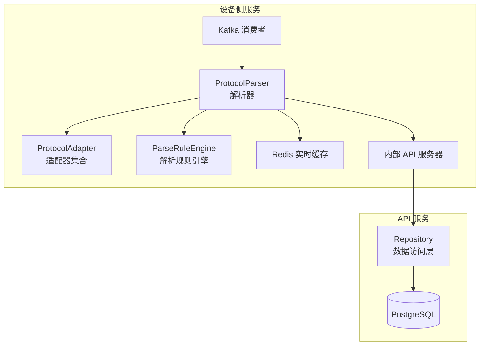
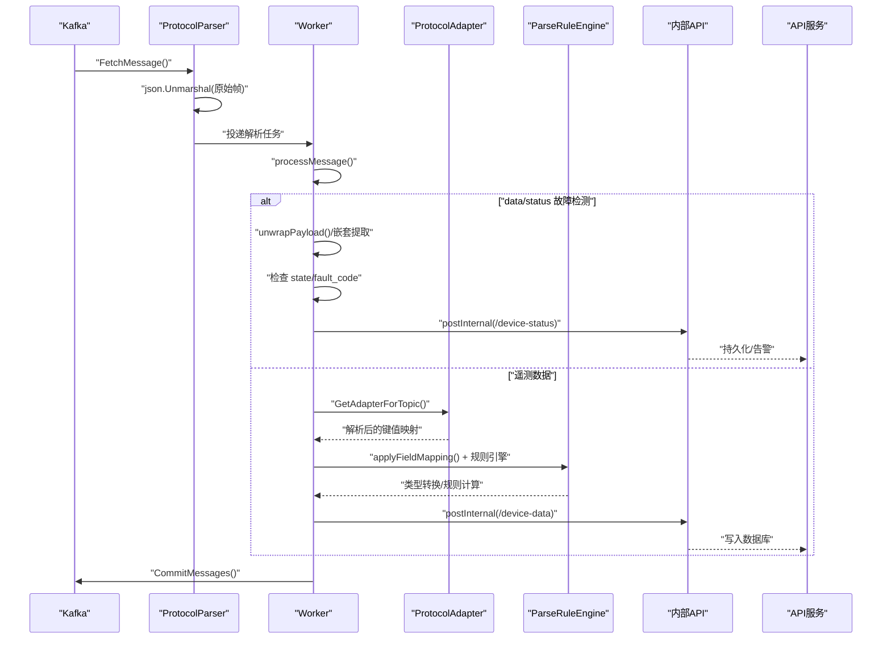
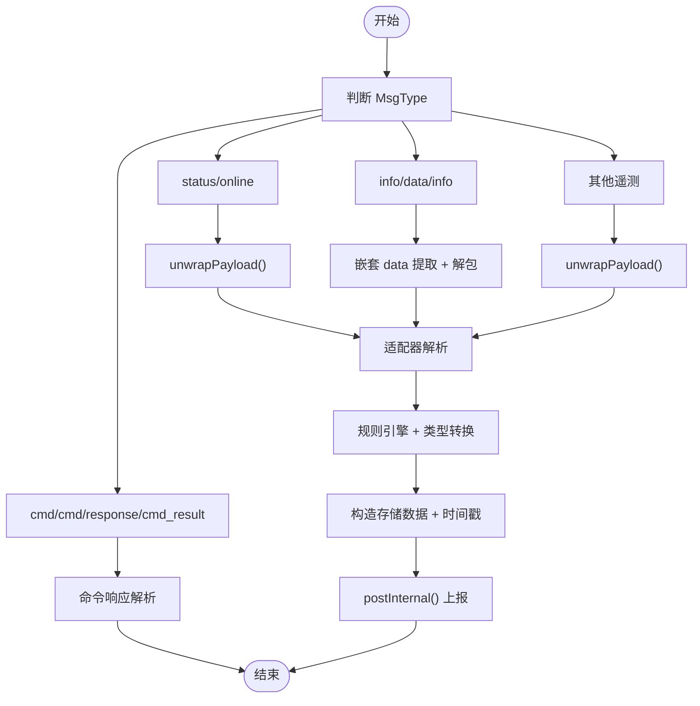
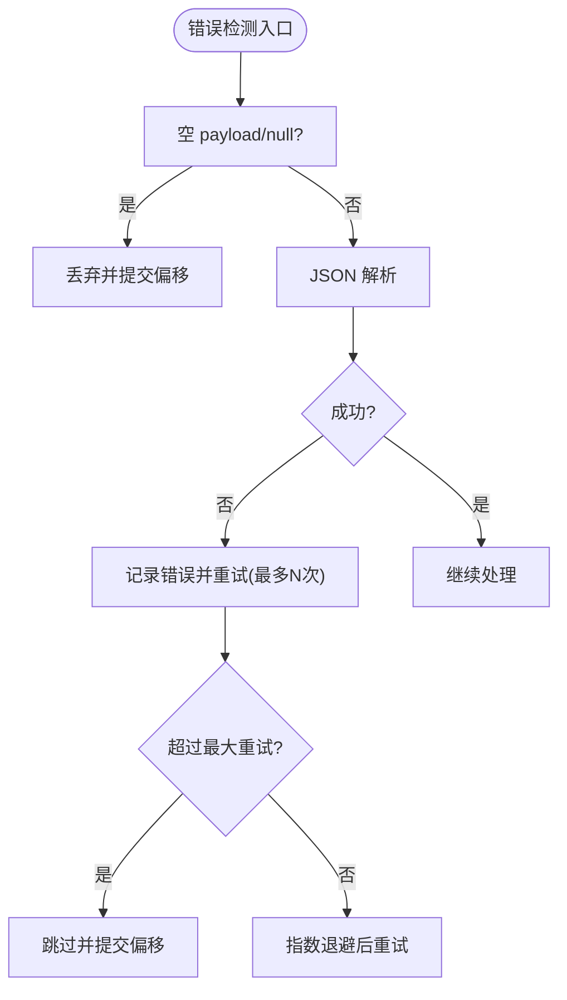
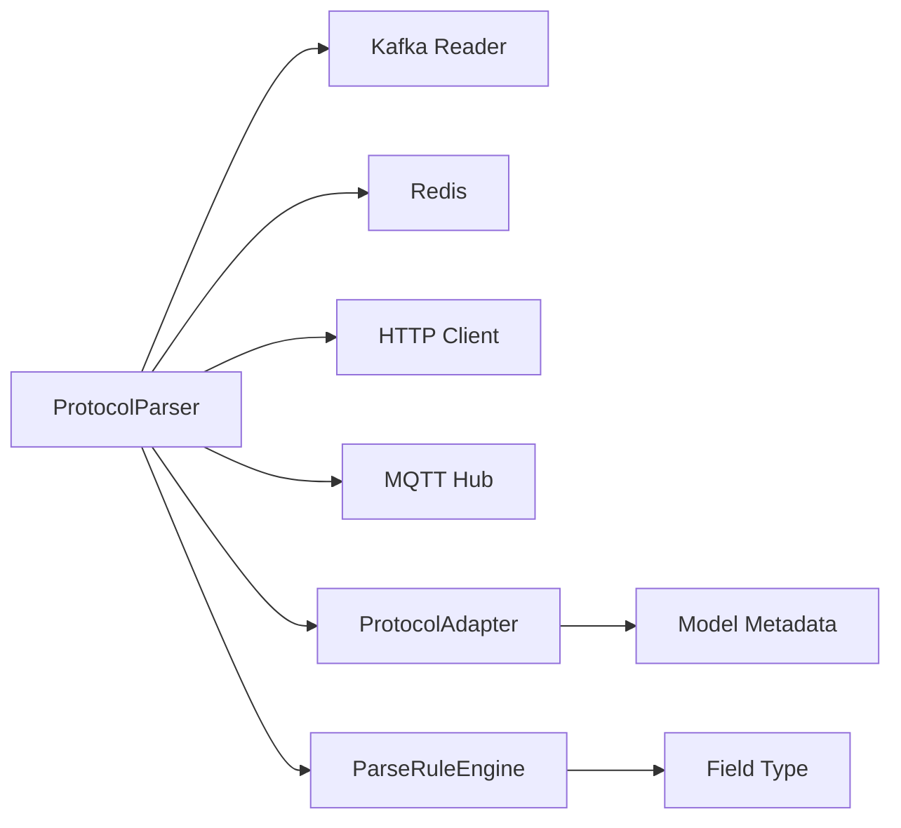

# 数据帧解析算法

<cite>
**本文引用的文件**
- [protocol_parser.go](file://inv_device_server/internal/service/protocol_parser.go)
- [protocol_adapter.go](file://inv_device_server/internal/service/protocol_adapter.go)
- [parse_rule.go](file://inv_device_server/internal/service/parse_rule.go)
- [repositories.go](file://inv_api_server/internal/repository/repositories.go)
- [client.go](file://inv_device_server/internal/mqtt/client.go)
- [main.go](file://inv_api_server/cmd/main.go)
</cite>

## 目录
1. [简介](#简介)
2. [项目结构](#项目结构)
3. [核心组件](#核心组件)
4. [架构总览](#架构总览)
5. [详细组件分析](#详细组件分析)
6. [依赖关系分析](#依赖关系分析)
7. [性能考虑](#性能考虑)
8. [故障排查指南](#故障排查指南)
9. [结论](#结论)
10. [附录](#附录)

## 简介
本技术文档围绕“数据帧解析算法”展开，系统性阐述字节流处理机制、数据包边界识别、帧头与帧尾校验、JSON 负载解析流程（含嵌套格式、字符串转义与数据类型推断）、payload 解包机制（支持直接 JSON 对象与 JSON 字符串）、错误检测与恢复策略（无效数据过滤、异常丢弃与重试）、以及解析性能优化技巧（内存池、零拷贝与批量处理）。文档同时提供可追溯的源码路径与调试方法，帮助读者快速定位问题并进行性能调优。

## 项目结构
该解析算法位于设备侧服务模块中，负责从 Kafka 消费设备上报的原始帧，完成 JSON 解包、适配器解析、字段映射与规则转换，并将结果通过内部 API 上报至 API 服务器，同时维护实时缓存与状态防抖逻辑。

图示来源
- [protocol_parser.go:55-91](file://inv_device_server/internal/service/protocol_parser.go#L55-L91)
- [protocol_adapter.go:15-145](file://inv_device_server/internal/service/protocol_adapter.go#L15-L145)
- [parse_rule.go:11-132](file://inv_device_server/internal/service/parse_rule.go#L11-L132)
- [repositories.go:1935-1969](file://inv_api_server/internal/repository/repositories.go#L1935-L1969)

章节来源
- [protocol_parser.go:55-91](file://inv_device_server/internal/service/protocol_parser.go#L55-L91)
- [protocol_adapter.go:15-145](file://inv_device_server/internal/service/protocol_adapter.go#L15-L145)
- [parse_rule.go:11-132](file://inv_device_server/internal/service/parse_rule.go#L11-L132)
- [repositories.go:1935-1969](file://inv_api_server/internal/repository/repositories.go#L1935-L1969)

## 核心组件
- 协议解析器（ProtocolParser）：负责从 Kafka 拉取消息、反序列化为原始帧、分发给工作协程、执行消息处理与错误重试、提交偏移量。
- 协议适配器（ProtocolAdapter）：根据设备模型与主题匹配选择解析策略，支持 JSON、Modbus、自定义映射等。
- 解析规则引擎（ParseRuleEngine）：对数值字段应用简单表达式规则（加减乘除），并进行类型强制转换。
- 内部 API 客户端：封装 HTTP 请求，实现指数退避重试与 4xx/5xx 错误分类处理。
- Redis 实时缓存：维护设备最新遥测与状态，支持防抖与故障标记。
- 数据访问层（Repository）：提供 JSON 辅助函数与数据库交互能力。

章节来源
- [protocol_parser.go:29-45](file://inv_device_server/internal/service/protocol_parser.go#L29-L45)
- [protocol_adapter.go:15-145](file://inv_device_server/internal/service/protocol_adapter.go#L15-L145)
- [parse_rule.go:11-132](file://inv_device_server/internal/service/parse_rule.go#L11-L132)
- [repositories.go:1935-1969](file://inv_api_server/internal/repository/repositories.go#L1935-L1969)

## 架构总览
下图展示从 Kafka 到 API 服务器的数据通路与关键决策点。

图示来源
- [protocol_parser.go:187-228](file://inv_device_server/internal/service/protocol_parser.go#L187-L228)
- [protocol_parser.go:230-245](file://inv_device_server/internal/service/protocol_parser.go#L230-L245)
- [protocol_parser.go:447-696](file://inv_device_server/internal/service/protocol_parser.go#L447-L696)
- [protocol_adapter.go:110-145](file://inv_device_server/internal/service/protocol_adapter.go#L110-L145)
- [parse_rule.go:17-29](file://inv_device_server/internal/service/parse_rule.go#L17-L29)

## 详细组件分析

### 字节流处理与数据包边界识别
- Kafka 消费：解析器以 ReaderConfig 设置最小/最大批次大小，自动完成数据包边界识别与聚合。
- 原始帧反序列化：对每条消息体进行 JSON 反序列化为 RawMessage 结构，若失败则记录错误并提交偏移量跳过。
- SN 校验：当 SN 为空时直接提交偏移量，避免无效数据进入后续处理链。

章节来源
- [protocol_parser.go:65-71](file://inv_device_server/internal/service/protocol_parser.go#L65-L71)
- [protocol_parser.go:204-217](file://inv_device_server/internal/service/protocol_parser.go#L204-L217)

### 帧头与帧尾校验
- 帧头：RawMessage 结构承载 sn、msg_type、payload、received_at 等字段，作为帧头信息。
- 帧尾：Kafka 消息的 offset 由消费者在成功处理后提交，作为帧尾确认。
- 边界完整性：通过 Kafka 批次拉取与单条消息反序列化保证边界完整性；若反序列化失败或 SN 为空，则丢弃该帧。

章节来源
- [protocol_parser.go:47-53](file://inv_device_server/internal/service/protocol_parser.go#L47-L53)
- [protocol_parser.go:197-227](file://inv_device_server/internal/service/protocol_parser.go#L197-L227)

### JSON 负载解析流程
- 嵌套格式处理：针对 data/status 等场景，先尝试提取 data 字段作为有效负载，再进行故障检测。
- 字符串转义：支持 payload 为 JSON 字符串（被双引号包裹）的二次解包，提升设备兼容性。
- 数据类型推断：在适配器与规则引擎中对字符串数字、十六进制、布尔等进行类型推断与转换。

图示来源
- [protocol_parser.go:235-244](file://inv_device_server/internal/service/protocol_parser.go#L235-L244)
- [protocol_parser.go:247-265](file://inv_device_server/internal/service/protocol_parser.go#L247-L265)
- [protocol_parser.go:311-332](file://inv_device_server/internal/service/protocol_parser.go#L311-L332)
- [protocol_parser.go:447-696](file://inv_device_server/internal/service/protocol_parser.go#L447-L696)
- [protocol_adapter.go:25-33](file://inv_device_server/internal/service/protocol_adapter.go#L25-L33)
- [parse_rule.go:17-29](file://inv_device_server/internal/service/parse_rule.go#L17-L29)

章节来源
- [protocol_parser.go:247-265](file://inv_device_server/internal/service/protocol_parser.go#L247-L265)
- [protocol_parser.go:311-332](file://inv_device_server/internal/service/protocol_parser.go#L311-L332)
- [protocol_adapter.go:25-33](file://inv_device_server/internal/service/protocol_adapter.go#L25-L33)
- [parse_rule.go:17-29](file://inv_device_server/internal/service/parse_rule.go#L17-L29)

### payload 解包机制（直接 JSON 对象与 JSON 字符串）
- 直接 JSON 对象：直接进行 map[string]interface{} 解析。
- JSON 字符串：先按字符串解析，再对字符串内容进行一次解包，解决设备端重复转义问题。
- 返回错误：若既非对象也非字符串，返回错误并丢弃该帧。

章节来源
- [protocol_parser.go:247-265](file://inv_device_server/internal/service/protocol_parser.go#L247-L265)

### 错误检测与恢复策略
- 无效数据过滤：SN 为空或反序列化失败时直接提交偏移量并跳过。
- 异常数据丢弃：JSON 解析失败、payload 为空或 null 时记录警告并忽略。
- 重试机制：
  - 工作协程对单条消息设置最大重试次数，超过阈值后记录错误并提交偏移量。
  - 内部 API 调用采用指数退避重试，区分 4xx 与 5xx 并记录相应日志。
- 防抖与覆盖保护：在线状态与故障状态均采用 Redis 键值与 TTL 控制，避免抖动与覆盖。

图示来源
- [protocol_parser.go:230-233](file://inv_device_server/internal/service/protocol_parser.go#L230-L233)
- [protocol_parser.go:204-212](file://inv_device_server/internal/service/protocol_parser.go#L204-L212)
- [protocol_parser.go:112-133](file://inv_device_server/internal/service/protocol_parser.go#L112-L133)
- [protocol_parser.go:382-445](file://inv_device_server/internal/service/protocol_parser.go#L382-L445)

章节来源
- [protocol_parser.go:112-133](file://inv_device_server/internal/service/protocol_parser.go#L112-L133)
- [protocol_parser.go:382-445](file://inv_device_server/internal/service/protocol_parser.go#L382-L445)

### 解析性能优化技巧
- 内存池与零拷贝：
  - 使用 json.RawMessage 与 []byte 在必要时减少不必要的复制。
  - 通过适配器与规则引擎对中间结果进行原地转换，降低分配次数。
- 批量处理：
  - Kafka ReaderConfig 的 MinBytes/MaxBytes 控制批次大小，提升吞吐。
  - 工作者通道与并发数（workerCount）控制并行度，避免过度竞争。
- 缓存与去抖：
  - Redis 缓存最新遥测与状态，减少重复上报与数据库压力。
  - 防抖键（如 status_report:sn、fault_report:sn）限制高频状态变更。
- 连接与超时：
  - HTTP 客户端复用连接池，设置合理超时与空闲连接上限。
  - 数据库连接池配置最大连接数与生命周期，避免资源枯竭。

章节来源
- [protocol_parser.go:65-84](file://inv_device_server/internal/service/protocol_parser.go#L65-L84)
- [protocol_parser.go:89-90](file://inv_device_server/internal/service/protocol_parser.go#L89-L90)
- [protocol_parser.go:284-308](file://inv_device_server/internal/service/protocol_parser.go#L284-L308)
- [protocol_parser.go:577-605](file://inv_device_server/internal/service/protocol_parser.go#L577-L605)
- [main.go:246-277](file://inv_api_server/cmd/main.go#L246-L277)

## 依赖关系分析
- 组件耦合：
  - ProtocolParser 依赖 Kafka Reader、Redis、HTTP 客户端、MQTT Hub、仓库与日志。
  - 适配器与规则引擎与解析器松耦合，便于扩展不同协议与字段映射。
- 外部依赖：
  - Kafka：消息传输与边界识别。
  - Redis：实时缓存与状态防抖。
  - PostgreSQL：数据持久化（通过内部 API 间接访问）。

图示来源
- [protocol_parser.go:29-45](file://inv_device_server/internal/service/protocol_parser.go#L29-L45)
- [protocol_adapter.go:110-145](file://inv_device_server/internal/service/protocol_adapter.go#L110-L145)
- [parse_rule.go:117-131](file://inv_device_server/internal/service/parse_rule.go#L117-L131)

章节来源
- [protocol_parser.go:29-45](file://inv_device_server/internal/service/protocol_parser.go#L29-L45)
- [protocol_adapter.go:110-145](file://inv_device_server/internal/service/protocol_adapter.go#L110-L145)
- [parse_rule.go:117-131](file://inv_device_server/internal/service/parse_rule.go#L117-L131)

## 性能考虑
- 批量与并发：
  - 合理设置 Kafka 最小/最大批次大小，平衡延迟与吞吐。
  - 工作者数量与通道容量需与 CPU 核数、网络与下游 API 性能匹配。
- 内存与 GC：
  - 使用 json.RawMessage 与 []byte 减少拷贝；避免在热路径上频繁分配。
  - 适配器与规则引擎尽量原地转换，减少中间 map 创建。
- 缓存命中：
  - 通过 Redis 缓存热点数据，降低数据库压力；注意键命名与 TTL 合理设置。
- 网络与超时：
  - HTTP 客户端连接池参数与超时时间需与 API 服务能力匹配，避免拥塞与堆积。

## 故障排查指南
- 常见问题定位：
  - Kafka 消费错误：查看 FetchMessage 错误日志与偏移提交情况。
  - JSON 解包失败：检查 payload 是否为 JSON 对象或字符串，关注 unwrapPayload 的错误分支。
  - 内部 API 5xx：查看 postInternal 的重试与状态码分类日志。
  - 防抖导致的状态不更新：检查 Redis 键值与 TTL，确认是否被覆盖。
- 关键日志位置：
  - Kafka 消费与提交：consume/worker 循环。
  - JSON 解包与适配：unwrapPayload、GetAdapterForTopic、ParseTopic。
  - 规则引擎与类型转换：Apply、CastByFieldType。
  - 状态上报与防抖：handleOnline、data/status 故障检测。

章节来源
- [protocol_parser.go:197-227](file://inv_device_server/internal/service/protocol_parser.go#L197-L227)
- [protocol_parser.go:204-212](file://inv_device_server/internal/service/protocol_parser.go#L204-L212)
- [protocol_parser.go:382-445](file://inv_device_server/internal/service/protocol_parser.go#L382-L445)
- [protocol_parser.go:284-308](file://inv_device_server/internal/service/protocol_parser.go#L284-L308)
- [protocol_parser.go:577-605](file://inv_device_server/internal/service/protocol_parser.go#L577-L605)
- [parse_rule.go:17-29](file://inv_device_server/internal/service/parse_rule.go#L17-L29)

## 结论
该数据帧解析算法以 Kafka 为边界识别与传输基础，结合 JSON 解包、适配器解析与规则引擎，实现了对多种设备协议与负载格式的统一处理。通过 Redis 防抖与内部 API 的指数退避重试，系统在高并发场景下具备良好的稳定性与可观测性。建议在生产环境中持续监控 Kafka 偏移滞后、API 响应时延与 Redis 命中率，并根据业务峰值动态调整并发与批处理参数。

## 附录
- 调试方法：
  - 开启详细日志级别，观察 consume/worker/processMessage 的关键节点。
  - 使用 MQTT Hub 与 Redis CLI 检查在线状态与故障键值。
  - 对照 JSON 辅助函数与规则引擎输入输出，验证字段映射与类型转换。
- 相关实现路径：
  - 原始帧结构与消费循环：[protocol_parser.go:47-53](file://inv_device_server/internal/service/protocol_parser.go#L47-L53), [protocol_parser.go:187-228](file://inv_device_server/internal/service/protocol_parser.go#L187-L228)
  - 解包与适配：[protocol_parser.go:247-265](file://inv_device_server/internal/service/protocol_parser.go#L247-L265), [protocol_adapter.go:110-145](file://inv_device_server/internal/service/protocol_adapter.go#L110-L145)
  - 规则引擎与类型转换：[parse_rule.go:17-29](file://inv_device_server/internal/service/parse_rule.go#L17-L29), [parse_rule.go:117-131](file://inv_device_server/internal/service/parse_rule.go#L117-L131)
  - JSON 辅助函数：[repositories.go:1946-1969](file://inv_api_server/internal/repository/repositories.go#L1946-L1969)
  - MQTT 主题与 SN 提取：[client.go:350-372](file://inv_device_server/internal/mqtt/client.go#L350-L372)