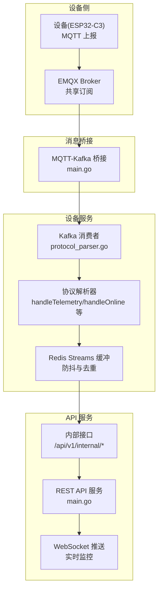
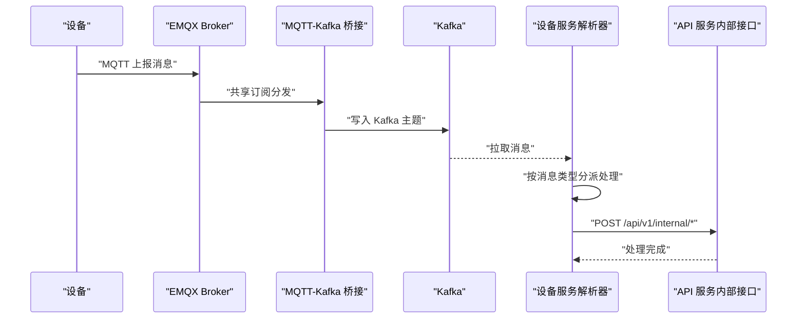
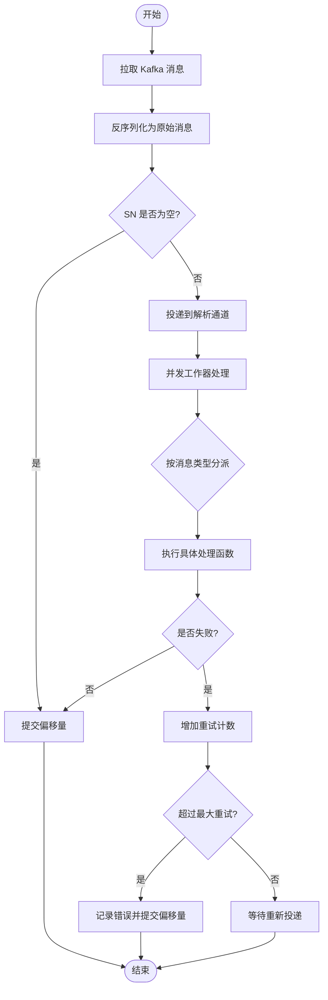
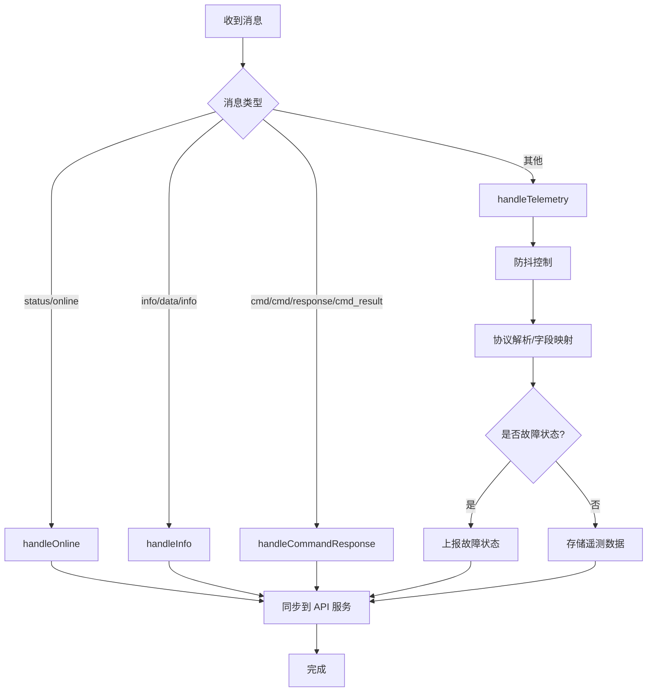
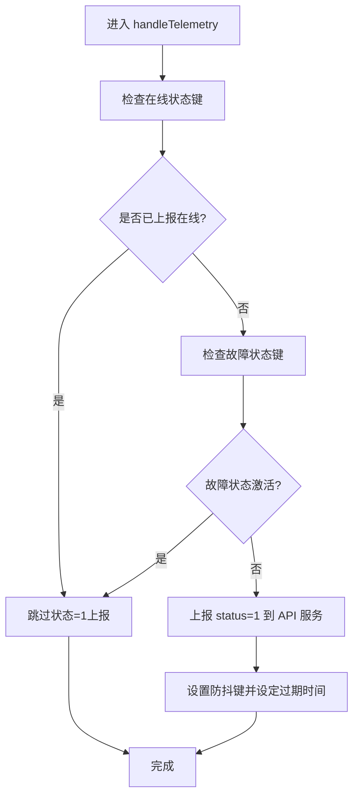
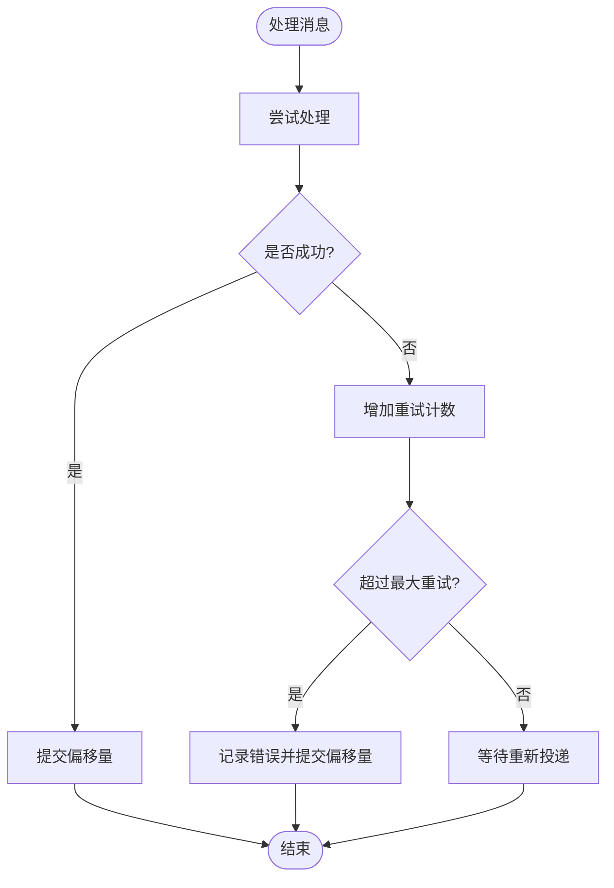
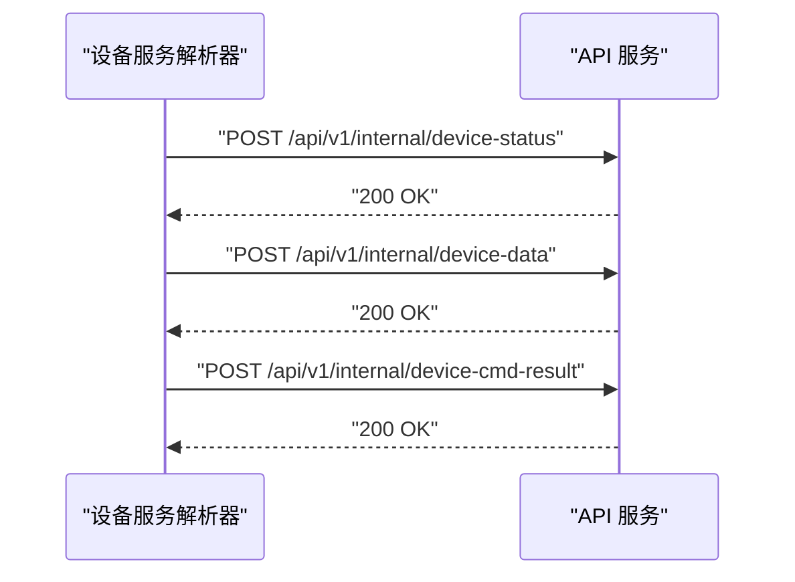
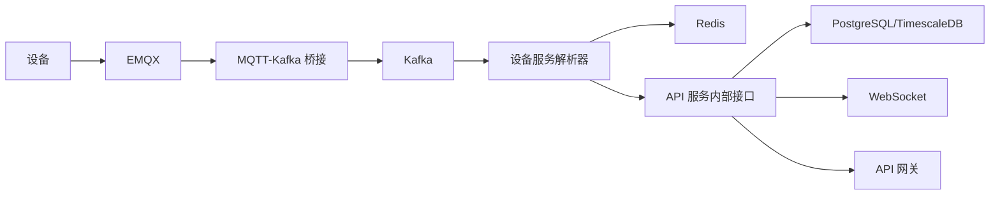

# 消息处理流程

<cite>
**本文档引用的文件**
- [protocol_parser.go](file://inv_device_server/internal/service/protocol_parser.go)
- [config.go](file://inv_device_server/internal/config/config.go)
- [kafka.go](file://inv_device_server/pkg/kafka/kafka.go)
- [stream_consumer.go](file://inv_device_server/internal/mqtt/stream_consumer.go)
- [client.go](file://inv_device_server/internal/mqtt/client.go)
- [main.go](file://inv_device_server/cmd/main.go)
- [main.go](file://inv_api_server/cmd/main.go)
- [config.go](file://inv_api_server/internal/config/config.go)
- [repositories.go](file://inv_api_server/internal/repository/repositories.go)
- [proxy.go](file://api-gateway/internal/proxy/proxy.go)
- [cors.go](file://api-gateway/internal/middleware/cors.go)
- [jwt.go](file://api-gateway/internal/middleware/jwt.go)
- [prometheus.go](file://api-gateway/internal/middleware/prometheus.go)
- [main.go](file://mqtt-kafka-bridge/cmd/main.go)
- [config.docker.yaml](file://inv_device_server/config.docker.yaml)
- [config.docker.yaml](file://inv_api_server/config.docker.yaml)
- [config.docker.yaml](file://api-gateway/config.docker.yaml)
- [config.docker.yaml](file://mqtt-kafka-bridge/config.docker.yaml)
- [grafana-dashboard.json](file://deploy/grafana-dashboard.json)
- [prometheus.yml](file://deploy/prometheus.yml)
- [stress_test/main.go](file://tools/stress_test/main.go)
</cite>

## 目录
1. [引言](#引言)
2. [项目结构](#项目结构)
3. [核心组件](#核心组件)
4. [架构总览](#架构总览)
5. [详细组件分析](#详细组件分析)
6. [依赖关系分析](#依赖关系分析)
7. [性能考虑](#性能考虑)
8. [故障排查指南](#故障排查指南)
9. [结论](#结论)

## 引言
本文件面向消息处理流程的技术文档，围绕设备侧消息采集、解析与转发展开，覆盖 Kafka 消息获取、消息队列管理、并发处理机制、消息类型处理策略（状态消息、遥测数据、设备信息、命令响应）、防抖机制、错误处理与重试策略、性能监控指标以及故障排查与优化建议。目标是帮助读者快速理解并高效运维该消息处理链路。

## 项目结构
系统采用“设备直连 EMQX → MQTT-Kafka 桥接 → 设备服务消费 → API 服务处理”的分层架构。设备通过 MQTT 上报数据，EMQX 将消息桥接到 Kafka；设备服务通过 Kafka 消费者拉取消息，进行协议解析与业务处理；API 服务负责对外提供 REST 接口与内部接口，完成设备状态同步、告警与命令结果处理等。

**图示来源**
- [main.go:1-200](file://inv_device_server/cmd/main.go#L1-L200)
- [protocol_parser.go:194-247](file://inv_device_server/internal/service/protocol_parser.go#L194-L247)
- [main.go:356-441](file://inv_api_server/cmd/main.go#L356-L441)
- [main.go:1-200](file://mqtt-kafka-bridge/cmd/main.go#L1-L200)

**章节来源**
- [README.md:1-142](file://README.md#L1-L142)

## 核心组件
- 设备服务（inv_device_server）
  - Kafka 消费者：从 Kafka 拉取消息并投递到解析通道
  - 协议解析器：按消息类型分派处理逻辑
  - 防抖与去重：基于 Redis 的状态键与时间窗口控制
  - 错误处理与重试：基于消息键的重试计数与最大重试阈值
- API 服务（inv_api_server）
  - 内部接口：接收设备状态、信息、数据、命令结果、告警等
  - 外部接口：提供设备查询、控制、命令历史等
  - 心跳检测：定期标记离线设备
- 网关（api-gateway）
  - CORS/JWT/Prometheus 中间件
  - 代理与路由
- 桥接（mqtt-kafka-bridge）
  - 将 EMQX 的 MQTT 主题映射到 Kafka 主题

**章节来源**
- [protocol_parser.go:103-150](file://inv_device_server/internal/service/protocol_parser.go#L103-L150)
- [protocol_parser.go:230-245](file://inv_device_server/internal/service/protocol_parser.go#L230-L245)
- [protocol_parser.go:447-529](file://inv_device_server/internal/service/protocol_parser.go#L447-L529)
- [main.go:165-183](file://inv_api_server/cmd/main.go#L165-L183)
- [main.go:381-391](file://inv_api_server/cmd/main.go#L381-L391)
- [main.go:1-200](file://mqtt-kafka-bridge/cmd/main.go#L1-L200)

## 架构总览
消息从设备侧以 MQTT 形式上报至 EMQX，EMQX 通过共享订阅将消息分发给多个设备服务实例；桥接服务将 MQTT 消息写入 Kafka；设备服务消费者从 Kafka 拉取消息，解析后根据消息类型执行不同处理策略，并通过 Redis 控制防抖与去重；最终通过内部接口同步到 API 服务，供外部查询与推送。

**图示来源**
- [main.go:1-200](file://mqtt-kafka-bridge/cmd/main.go#L1-L200)
- [protocol_parser.go:194-247](file://inv_device_server/internal/service/protocol_parser.go#L194-L247)
- [main.go:381-391](file://inv_api_server/cmd/main.go#L381-L391)

## 详细组件分析

### Kafka 消息获取与并发处理
- 消费循环：持续从 Kafka 拉取消息，异常时短暂休眠后重试
- 解析通道：将原始消息封装后投递到解析通道，避免阻塞消费循环
- 并发工作器：多实例并发消费解析通道，每个工作器维护独立的消息重试计数
- 提交策略：成功处理后提交偏移量，失败则等待 Kafka 重新投递

**图示来源**
- [protocol_parser.go:194-227](file://inv_device_server/internal/service/protocol_parser.go#L194-L227)
- [protocol_parser.go:103-150](file://inv_device_server/internal/service/protocol_parser.go#L103-L150)

**章节来源**
- [protocol_parser.go:194-227](file://inv_device_server/internal/service/protocol_parser.go#L194-L227)
- [protocol_parser.go:103-150](file://inv_device_server/internal/service/protocol_parser.go#L103-L150)

### 消息类型处理策略
- 状态/在线消息（status/online）
  - 标记设备在线，更新 Redis 在线时间
  - 触发设备状态同步到 API 服务（带防抖）
- 设备信息/数据信息（info/data/info）
  - 更新设备元数据或设备信息
  - 通过内部接口同步到 API 服务
- 命令响应（cmd/cmd/response/cmd_result）
  - 解析命令执行结果，更新命令状态
  - 通过内部接口通知 API 服务
- 遥测数据（默认）
  - 标记在线并触发防抖逻辑
  - 解析协议适配器或通用字段映射
  - 主动检测故障状态并上报

**图示来源**
- [protocol_parser.go:230-245](file://inv_device_server/internal/service/protocol_parser.go#L230-L245)
- [protocol_parser.go:447-529](file://inv_device_server/internal/service/protocol_parser.go#L447-L529)

**章节来源**
- [protocol_parser.go:230-245](file://inv_device_server/internal/service/protocol_parser.go#L230-L245)
- [protocol_parser.go:447-529](file://inv_device_server/internal/service/protocol_parser.go#L447-L529)

### 防抖机制
- 目标：降低频繁遥测上报导致的状态同步压力
- 策略：
  - 使用 Redis 键“status_report:{sn}”记录最近一次上报状态=1的时间窗口
  - 若设备处于故障状态（键“fault_report:{sn}”值为2），则跳过状态=1的覆盖
  - 成功上报后设置键值并在短时间窗口内抑制重复上报
- 适用场景：设备从离线恢复在线时的首次状态同步

**图示来源**
- [protocol_parser.go:459-488](file://inv_device_server/internal/service/protocol_parser.go#L459-L488)

**章节来源**
- [protocol_parser.go:459-488](file://inv_device_server/internal/service/protocol_parser.go#L459-L488)

### 错误处理与重试策略
- 重试计数：以“主题:分区:偏移量”为键维护每条消息的重试次数
- 最大重试：达到阈值后记录错误并提交偏移量，避免无限重试
- 失败处理：记录错误日志，保留消息以便后续人工干预
- 提交时机：成功处理后提交偏移量，失败则等待 Kafka 重新投递

**图示来源**
- [protocol_parser.go:103-150](file://inv_device_server/internal/service/protocol_parser.go#L103-L150)

**章节来源**
- [protocol_parser.go:103-150](file://inv_device_server/internal/service/protocol_parser.go#L103-L150)

### API 服务集成点
- 内部接口
  - 设备状态：/api/v1/internal/device-status
  - 设备信息：/api/v1/internal/device-info
  - 设备数据：/api/v1/internal/device-data
  - 命令状态/结果：/api/v1/internal/device-cmd-status, /api/v1/internal/device-cmd-result
  - 告警：/api/v1/internal/device-alarm
  - OTA 状态/指令确认：/api/v1/internal/ota-status, /api/v1/internal/ota-cmd-ack
- 心跳检测：定时扫描离线设备并同步站点状态
- 外部接口：设备列表、详情、实时数据、控制命令、命令历史等

**图示来源**
- [main.go:381-391](file://inv_api_server/cmd/main.go#L381-L391)

**章节来源**
- [main.go:381-391](file://inv_api_server/cmd/main.go#L381-L391)
- [main.go:165-183](file://inv_api_server/cmd/main.go#L165-L183)

## 依赖关系分析
- 设备服务依赖
  - Kafka：消息源与缓冲
  - Redis：防抖键、设备在线状态缓存
  - API 服务内部接口：状态同步与数据落库
- API 服务依赖
  - PostgreSQL/TimescaleDB：设备与遥测数据存储
  - Redis：设备影子、实时推送
  - 网关：CORS/JWT/Prometheus 中间件
- 桥接服务依赖
  - EMQX：MQTT 消息源
  - Kafka：消息目标

**图示来源**
- [main.go:1-200](file://mqtt-kafka-bridge/cmd/main.go#L1-L200)
- [protocol_parser.go:447-529](file://inv_device_server/internal/service/protocol_parser.go#L447-L529)
- [main.go:381-391](file://inv_api_server/cmd/main.go#L381-L391)

**章节来源**
- [protocol_parser.go:447-529](file://inv_device_server/internal/service/protocol_parser.go#L447-L529)
- [main.go:381-391](file://inv_api_server/cmd/main.go#L381-L391)

## 性能考虑
- 吞吐量与延迟
  - Kafka 分区数与消费者实例数：通过水平扩展提升并发处理能力
  - Redis 防抖键过期时间：平衡去重效果与内存占用
  - 解析器并发工作器数量：根据 CPU 核心数与消息复杂度调优
- 存储与索引
  - TimescaleDB 连续聚合与压缩：降低历史查询成本
  - PostgreSQL 索引：针对高频查询字段建立索引
- 监控与指标
  - Prometheus/Grafana：采集 Kafka 消费延迟、API 响应时间、Redis 命中率、数据库 QPS
  - 压力测试工具：模拟高并发设备上报，评估系统上限与瓶颈

**章节来源**
- [repositories.go:680-695](file://inv_api_server/internal/repository/repositories.go#L680-L695)
- [prometheus.yml:1-200](file://deploy/prometheus.yml#L1-L200)
- [grafana-dashboard.json:1-300](file://deploy/grafana-dashboard.json#L1-L300)
- [stress_test/main.go:45-152](file://tools/stress_test/main.go#L45-L152)

## 故障排查指南
- Kafka 消费异常
  - 现象：消息堆积、消费延迟升高
  - 排查：检查消费者组位移、分区分配、网络连接、Kafka broker 状态
  - 处理：增加消费者实例、调整拉取批次大小、检查磁盘 IO
- Redis 防抖失效
  - 现象：频繁重复上报状态
  - 排查：确认防抖键是否存在、过期时间是否被意外修改
  - 处理：重建防抖键、检查键空间内存上限
- API 服务内部接口失败
  - 现象：设备状态未更新、命令结果未回传
  - 排查：查看内部接口日志、数据库连接、事务一致性
  - 处理：重试机制、补偿任务、死信队列
- 网关鉴权与跨域问题
  - 现象：前端请求 401/403 或跨域失败
  - 排查：JWT 密钥一致性、CORS 白名单、限流策略
  - 处理：统一密钥、放宽白名单、调整限流阈值

**章节来源**
- [protocol_parser.go:194-227](file://inv_device_server/internal/service/protocol_parser.go#L194-L227)
- [protocol_parser.go:103-150](file://inv_device_server/internal/service/protocol_parser.go#L103-L150)
- [main.go:356-391](file://inv_api_server/cmd/main.go#L356-L391)
- [cors.go:1-200](file://api-gateway/internal/middleware/cors.go#L1-L200)
- [jwt.go:1-200](file://api-gateway/internal/middleware/jwt.go#L1-L200)

## 结论
该消息处理流程通过 Kafka 实现高吞吐缓冲，结合 Redis 防抖与去重策略，确保设备状态与遥测数据的准确与时效；API 服务通过内部接口实现解耦与可扩展性。建议在生产环境中持续监控关键指标，按需扩展消费者实例与数据库索引，并完善死信队列与补偿机制，以进一步提升稳定性与可观测性。