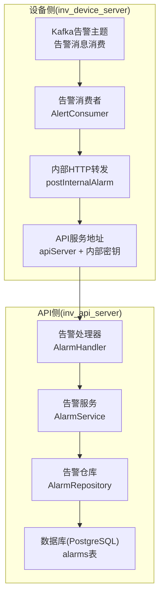
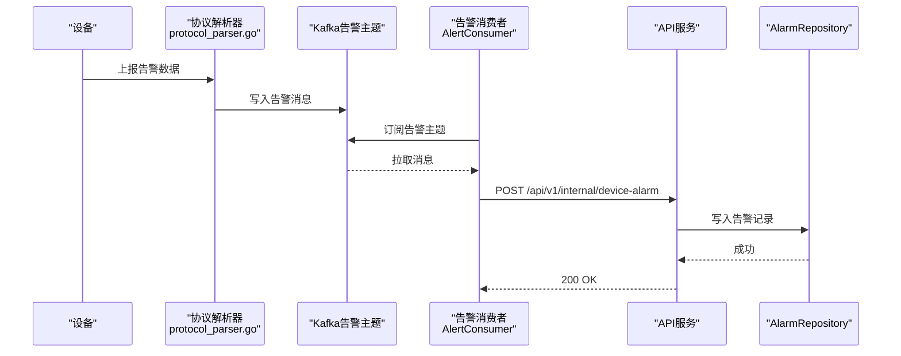
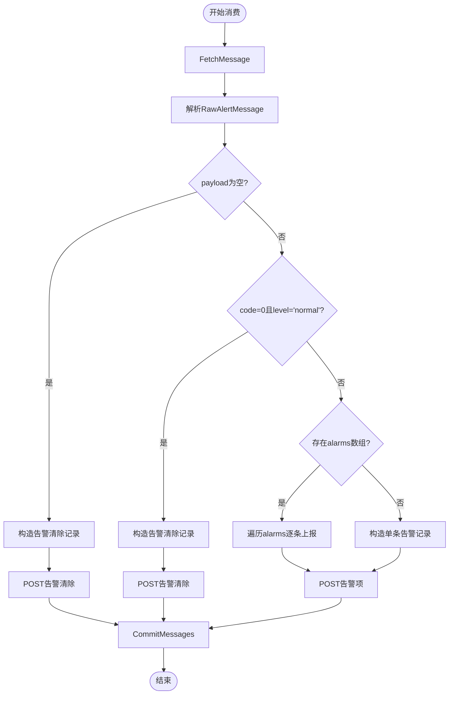
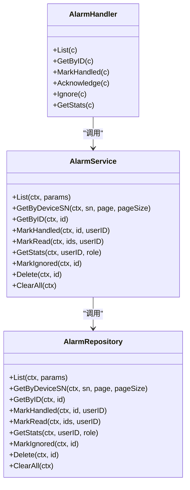
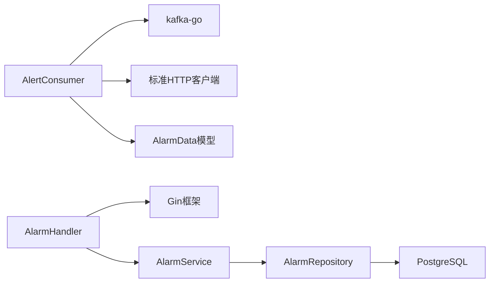

# 告警消费服务

<cite>
**本文档引用的文件**
- [alert_consumer.go](file://inv_device_server/internal/service/alert_consumer.go)
- [protocol_parser.go](file://inv_device_server/internal/service/protocol_parser.go)
- [kafka.go](file://inv_device_server/pkg/kafka/kafka.go)
- [device.go](file://inv_device_server/internal/model/device.go)
- [alarm_handler.go](file://inv_api_server/internal/handler/alarm_handler.go)
- [services.go](file://inv_api_server/internal/service/services.go)
- [repositories.go](file://inv_api_server/internal/repository/repositories.go)
- [README.md](file://README.md)
- [monitor.sh](file://deploy/monitor.sh)
</cite>

## 目录
1. [简介](#简介)
2. [项目结构](#项目结构)
3. [核心组件](#核心组件)
4. [架构总览](#架构总览)
5. [详细组件分析](#详细组件分析)
6. [依赖关系分析](#依赖关系分析)
7. [性能考虑](#性能考虑)
8. [故障排查指南](#故障排查指南)
9. [结论](#结论)

## 简介
本文件面向告警消费服务，系统性阐述Kafka告警消息的消费机制、消费者组配置、分区分配与偏移量管理；详述告警数据的解析与验证流程（告警类型识别、严重程度分级、重复告警过滤）；解释告警状态生命周期（生成、处理中、已解决、超时处理）；介绍告警通知机制（推送渠道配置、模板定制、发送策略）；提供告警规则配置指南（阈值设置、延迟触发、静默周期）；并涵盖告警服务质量监控、重试机制与死信处理，以及最佳实践与性能优化建议。

## 项目结构
告警消费服务位于设备侧（inv_device_server），负责从Kafka消费告警消息，并将告警数据转发至API服务进行持久化与状态管理。API服务提供告警查询、处理与统计接口，前端通过这些接口展示告警状态与历史。

**图表来源**
- [alert_consumer.go:46-68](file://inv_device_server/internal/service/alert_consumer.go#L46-L68)
- [alert_consumer.go:270-300](file://inv_device_server/internal/service/alert_consumer.go#L270-L300)
- [alarm_handler.go:14-20](file://inv_api_server/internal/handler/alarm_handler.go#L14-L20)
- [services.go:643-685](file://inv_api_server/internal/service/services.go#L643-L685)

**章节来源**
- [README.md:33-110](file://README.md#L33-L110)

## 核心组件
- Kafka告警消费者：负责从指定主题消费告警消息，解析并转发至API服务。
- 告警数据模型：统一告警格式，支持单条告警与多条告警数组。
- API告警处理器与服务：提供告警列表、查询、处理（已处理/忽略）、统计等接口。
- 告警仓库：封装数据库访问，支持分页、筛选与统计。

**章节来源**
- [alert_consumer.go:19-68](file://inv_device_server/internal/service/alert_consumer.go#L19-L68)
- [device.go:107-126](file://inv_device_server/internal/model/device.go#L107-L126)
- [alarm_handler.go:14-20](file://inv_api_server/internal/handler/alarm_handler.go#L14-L20)
- [services.go:643-685](file://inv_api_server/internal/service/services.go#L643-L685)

## 架构总览
告警从设备侧通过MQTT/协议适配进入系统，设备侧服务解析后写入Kafka告警主题；设备侧告警消费者订阅该主题，解析告警并调用API服务内部接口写入数据库；API服务提供REST接口供前端查询与处理告警。

**图表来源**
- [protocol_parser.go:447-696](file://inv_device_server/internal/service/protocol_parser.go#L447-L696)
- [alert_consumer.go:118-268](file://inv_device_server/internal/service/alert_consumer.go#L118-L268)
- [alert_consumer.go:270-300](file://inv_device_server/internal/service/alert_consumer.go#L270-L300)

## 详细组件分析

### Kafka告警消费者（AlertConsumer）
- 消费者组配置：通过ReaderConfig设置Brokers、Topic、GroupID、最小/最大消息大小，实现基础的分区消费与负载均衡。
- 分区分配与偏移量管理：使用kafka.NewReader的FetchMessage与CommitMessages完成消息获取与提交，确保至少一次语义。
- 并发模型：双层并发，consume协程负责从Kafka拉取消息，worker协程池负责处理消息，msgChan作为背压缓冲。
- 告警解析与转发：
  - 支持payload为空（视为告警清除）与code=0且level="normal"（同样视为告警清除）。
  - 支持alarms数组逐条上报，或单条告警字段上报。
  - 通过postInternalAlarm向API服务内部接口POST告警数据。
- 错误处理：解析失败、SN为空、HTTP转发失败均记录日志并提交消息（或跳过），保证消息不丢失。

**图表来源**
- [alert_consumer.go:90-116](file://inv_device_server/internal/service/alert_consumer.go#L90-L116)
- [alert_consumer.go:118-268](file://inv_device_server/internal/service/alert_consumer.go#L118-L268)

**章节来源**
- [alert_consumer.go:46-68](file://inv_device_server/internal/service/alert_consumer.go#L46-L68)
- [alert_consumer.go:118-268](file://inv_device_server/internal/service/alert_consumer.go#L118-L268)

### 告警数据模型（AlarmData）
- 字段定义：包含设备SN、告警代码、级别、消息、计数、告警数组、时间戳与接收时间。
- 支持两种上报格式：
  - 嵌套data格式：外层包含timestamp，data内含code/level/message/count/alarms等。
  - 扁平格式：直接包含上述字段。
- 用于统一API服务内部接口的数据结构。

**章节来源**
- [device.go:107-126](file://inv_device_server/internal/model/device.go#L107-L126)

### API告警处理链路
- 告警处理器（AlarmHandler）：提供列表、详情、标记已处理/忽略、统计等HTTP接口。
- 告警服务（AlarmService）：封装业务逻辑，调用AlarmRepository进行数据访问。
- 告警仓库（AlarmRepository）：实现分页查询、条件筛选、统计与更新操作。

**图表来源**
- [alarm_handler.go:14-20](file://inv_api_server/internal/handler/alarm_handler.go#L14-L20)
- [services.go:643-685](file://inv_api_server/internal/service/services.go#L643-L685)
- [repositories.go:2508-2604](file://inv_api_server/internal/repository/repositories.go#L2508-L2604)

**章节来源**
- [alarm_handler.go:22-199](file://inv_api_server/internal/handler/alarm_handler.go#L22-L199)
- [services.go:643-685](file://inv_api_server/internal/service/services.go#L643-L685)
- [repositories.go:2508-2604](file://inv_api_server/internal/repository/repositories.go#L2508-L2604)

### 协议解析与告警联动（protocol_parser.go）
- 协议解析器同时处理遥测、状态、命令响应等消息，其中data/status主题会触发故障检测与状态上报。
- 对于故障状态（state=fault或fault_code!=0），通过postInternal向API服务上报设备状态为故障，配合防抖逻辑避免重复上报。
- 该机制与告警消费服务形成互补：解析器负责设备侧状态判定与上报，告警消费者负责告警消息的消费与转发。

**章节来源**
- [protocol_parser.go:447-696](file://inv_device_server/internal/service/protocol_parser.go#L447-L696)

### Kafka生产者与通用消费者（kafka.go）
- 生产者：按主题复用Writer，支持异步批量发送，具备最少字节与批大小配置。
- 通用消费者：提供Handler模式的消费者骨架，便于扩展其他主题的消费逻辑。

**章节来源**
- [kafka.go:13-81](file://inv_device_server/pkg/kafka/kafka.go#L13-L81)
- [kafka.go:83-132](file://inv_device_server/pkg/kafka/kafka.go#L83-L132)

## 依赖关系分析
- 设备侧依赖：
  - Kafka客户端：用于告警消息的消费与生产。
  - HTTP客户端：向API服务内部接口转发告警数据。
  - 日志组件：记录关键路径与错误信息。
- API侧依赖：
  - PostgreSQL：存储告警记录与状态。
  - Gin框架：提供HTTP接口。
  - Redis：部分场景用于缓存与离线队列（非告警主流程）。

**图表来源**
- [alert_consumer.go:19-68](file://inv_device_server/internal/service/alert_consumer.go#L19-L68)
- [alarm_handler.go:14-20](file://inv_api_server/internal/handler/alarm_handler.go#L14-L20)
- [services.go:643-685](file://inv_api_server/internal/service/services.go#L643-L685)

**章节来源**
- [alert_consumer.go:19-68](file://inv_device_server/internal/service/alert_consumer.go#L19-L68)
- [alarm_handler.go:14-20](file://inv_api_server/internal/handler/alarm_handler.go#L14-L20)
- [services.go:643-685](file://inv_api_server/internal/service/services.go#L643-L685)

## 性能考虑
- 消费并发：AlertConsumer采用worker池与消息通道，合理设置worker数量以匹配CPU与I/O能力。
- 批量与背压：通过msgChan限制积压，避免内存暴涨；Kafka Reader的MinBytes/MaxBytes有助于平衡吞吐与延迟。
- HTTP重试：API侧对内部接口调用具备重试与指数退避，提升稳定性。
- 防抖与去重：设备侧解析器对状态与故障上报设置了防抖键，减少重复通知与数据库压力。
- 数据库索引：AlarmRepository的查询条件（用户、电站、状态、级别、关键词）应确保相应索引以提升分页查询性能。

[本节为通用指导，无需特定文件引用]

## 故障排查指南
- Kafka消费异常：
  - 检查消费者组是否正确配置，确认主题分区与消费者实例数量匹配。
  - 关注FetchMessage错误日志，必要时增加重试间隔与超时时间。
- 告警未入库：
  - 确认postInternalAlarm返回状态码，关注HTTP 4xx/5xx错误与重试结果。
  - 核对API服务内部密钥与apiServer地址配置。
- 告警状态不一致：
  - 检查设备侧解析器的状态上报逻辑与防抖键，确保故障状态优先级高于在线状态覆盖。
- 服务监控：
  - 使用部署脚本中的监控脚本检查端口与资源使用情况，必要时配置告警通知（如邮件、企业微信/钉钉）。

**章节来源**
- [alert_consumer.go:100-115](file://inv_device_server/internal/service/alert_consumer.go#L100-L115)
- [alert_consumer.go:270-300](file://inv_device_server/internal/service/alert_consumer.go#L270-L300)
- [protocol_parser.go:284-308](file://inv_device_server/internal/service/protocol_parser.go#L284-L308)
- [monitor.sh:52-118](file://deploy/monitor.sh#L52-L118)

## 结论
告警消费服务通过Kafka实现高吞吐的告警消息消费，结合设备侧解析器的状态检测与API侧的统一处理，形成了完整的告警生命周期管理闭环。通过合理的消费者组配置、并发模型与HTTP重试策略，系统在可靠性与性能之间取得平衡。建议持续完善数据库索引、监控告警与重试策略，以进一步提升服务质量与可维护性。