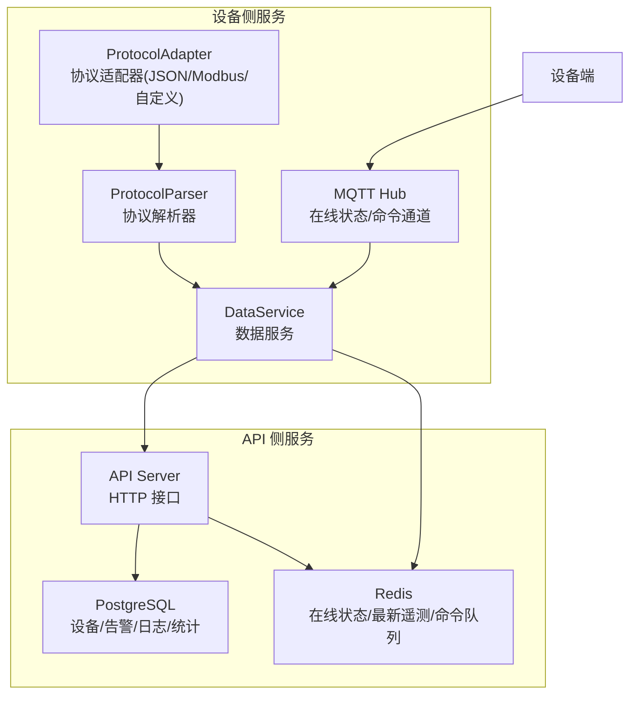
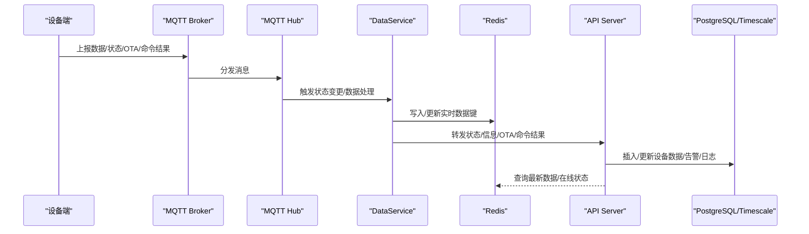
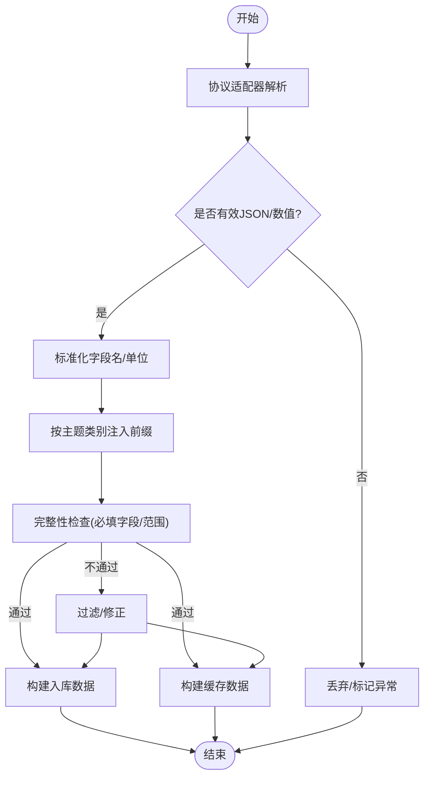
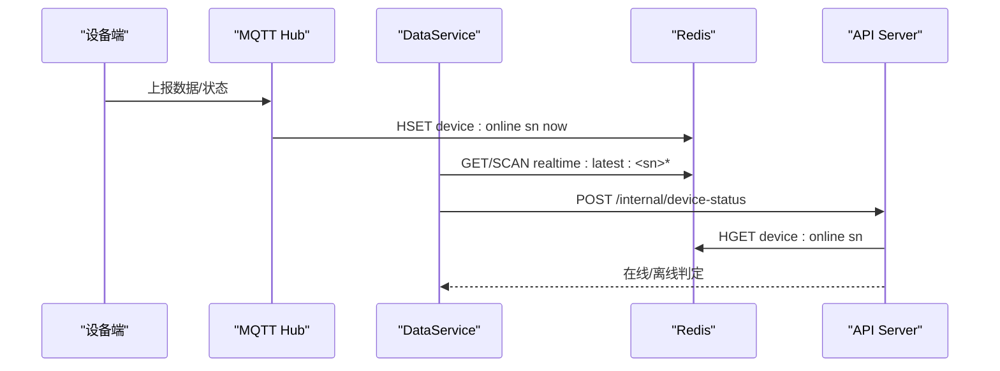
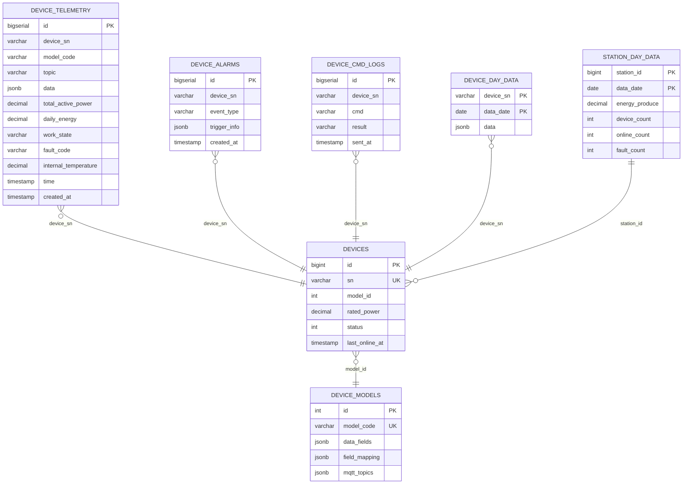
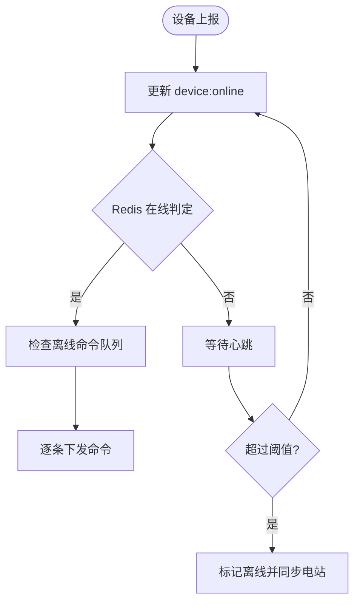
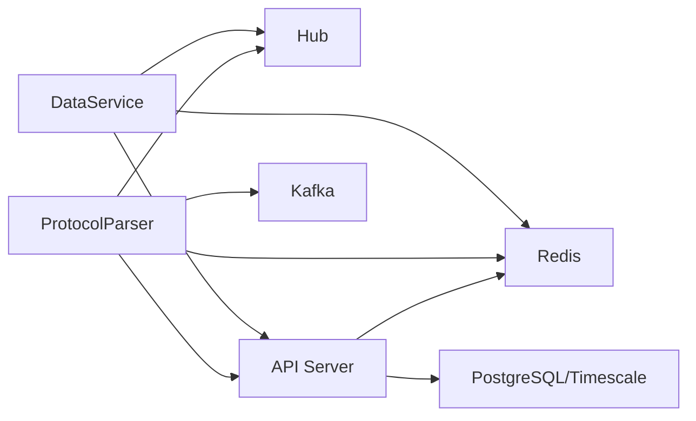

# 数据服务

<cite>
**本文引用的文件**
- [inv_device_server/cmd/main.go](file://inv_device_server/cmd/main.go)
- [inv_device_server/internal/service/data_service.go](file://inv_device_server/internal/service/data_service.go)
- [inv_device_server/internal/service/protocol_parser.go](file://inv_device_server/internal/service/protocol_parser.go)
- [inv_device_server/internal/service/protocol_adapter.go](file://inv_device_server/internal/service/protocol_adapter.go)
- [inv_device_server/internal/mqtt/client.go](file://inv_device_server/internal/mqtt/client.go)
- [inv_api_server/cmd/main.go](file://inv_api_server/cmd/main.go)
- [inv_api_server/internal/repository/repositories.go](file://inv_api_server/internal/repository/repositories.go)
- [database/schema.sql](file://database/schema.sql)
- [deploy/scripts/db_maintenance.sh](file://deploy/scripts/db_maintenance.sh)
</cite>

## 目录
1. [简介](#简介)
2. [项目结构](#项目结构)
3. [核心组件](#核心组件)
4. [架构总览](#架构总览)
5. [详细组件分析](#详细组件分析)
6. [依赖关系分析](#依赖关系分析)
7. [性能考量](#性能考量)
8. [故障排查指南](#故障排查指南)
9. [结论](#结论)
10. [附录](#附录)

## 简介
本文件面向“数据服务”子系统，聚焦于以下目标：
- 数据转换与清洗：原始数据格式标准化、异常值过滤与数据完整性检查
- 缓存更新策略：Redis 缓存结构设计、过期时间与一致性保障
- 数据库持久化：PostgreSQL 表结构、索引优化与批量写入
- 设备状态管理：在线状态检测、心跳机制与离线处理
- 业务逻辑实现：设备绑定、参数配置与历史数据归档
- 服务启动流程、依赖注入与错误处理
- 性能监控指标与故障诊断方法

## 项目结构
数据服务由两部分组成：
- 设备侧服务（接收设备数据、协议解析、状态同步、命令下发与缓存）
- API 侧服务（设备状态与数据的最终落库、查询与报表）

图表来源
- [inv_device_server/cmd/main.go:112-130](file://inv_device_server/cmd/main.go#L112-L130)
- [inv_device_server/internal/service/data_service.go:33-50](file://inv_device_server/internal/service/data_service.go#L33-L50)
- [inv_device_server/internal/service/protocol_parser.go:55-91](file://inv_device_server/internal/service/protocol_parser.go#L55-L91)
- [inv_device_server/internal/service/protocol_adapter.go:110-145](file://inv_device_server/internal/service/protocol_adapter.go#L110-L145)
- [inv_api_server/cmd/main.go:88-163](file://inv_api_server/cmd/main.go#L88-L163)

章节来源
- [inv_device_server/cmd/main.go:34-190](file://inv_device_server/cmd/main.go#L34-L190)
- [inv_api_server/cmd/main.go:36-220](file://inv_api_server/cmd/main.go#L36-L220)

## 核心组件
- 设备侧数据服务（DataService）
  - 负责设备在线状态判定、命令下发、OTA 状态与命令结果转发、离线命令队列刷新、Redis 实时数据读取
- 协议解析器（ProtocolParser）
  - 从 Kafka 消费原始遥测，按设备模型进行协议适配与字段映射，构建入库数据与缓存数据
- 协议适配器（ProtocolAdapter）
  - JSON 直通、Modbus 数值解析、自定义字段映射
- MQTT Hub
  - 在线状态维护、命令通道、统计指标
- API 侧仓库与服务
  - 设备状态/信息/数据/告警/OTA 状态的内部接口处理与持久化
- 数据库与运维脚本
  - TimescaleDB 超表、索引、连续聚合与归档清理

章节来源
- [inv_device_server/internal/service/data_service.go:23-50](file://inv_device_server/internal/service/data_service.go#L23-L50)
- [inv_device_server/internal/service/protocol_parser.go:29-45](file://inv_device_server/internal/service/protocol_parser.go#L29-L45)
- [inv_device_server/internal/service/protocol_adapter.go:15-145](file://inv_device_server/internal/service/protocol_adapter.go#L15-L145)
- [inv_device_server/internal/mqtt/client.go:42-132](file://inv_device_server/internal/mqtt/client.go#L42-L132)
- [inv_api_server/internal/repository/repositories.go:796-803](file://inv_api_server/internal/repository/repositories.go#L796-L803)

## 架构总览
数据流从设备端经 MQTT/Kafka 到设备侧服务，再转发至 API 侧服务完成持久化与查询；缓存用于加速实时数据与状态查询。

图表来源
- [inv_device_server/internal/mqtt/client.go:141-236](file://inv_device_server/internal/mqtt/client.go#L141-L236)
- [inv_device_server/internal/service/data_service.go:186-235](file://inv_device_server/internal/service/data_service.go#L186-L235)
- [inv_api_server/cmd/main.go:381-390](file://inv_api_server/cmd/main.go#L381-L390)

## 详细组件分析

### 数据转换与清洗流程
- 原始数据格式标准化
  - 协议适配器根据设备模型选择解析方式：JSON 直通、Modbus 数值解析、自定义字段映射
  - 主题分类前缀统一注入，确保查询兼容性
- 异常值过滤与数据完整性检查
  - 解析阶段对数值字段进行类型转换与合法性判断
  - 对缺失或异常字段采用默认值或丢弃策略，避免脏数据进入数据库
- 缓存数据与入库数据分离
  - 缓存仅保留原始字段，避免冗余
  - 入库数据保留带前缀字段以满足历史查询需求

图表来源
- [inv_device_server/internal/service/protocol_adapter.go:25-108](file://inv_device_server/internal/service/protocol_adapter.go#L25-L108)
- [inv_device_server/internal/service/protocol_parser.go:608-659](file://inv_device_server/internal/service/protocol_parser.go#L608-L659)

章节来源
- [inv_device_server/internal/service/protocol_adapter.go:110-145](file://inv_device_server/internal/service/protocol_adapter.go#L110-L145)
- [inv_device_server/internal/service/protocol_parser.go:608-659](file://inv_device_server/internal/service/protocol_parser.go#L608-L659)

### 缓存更新策略
- 缓存结构设计
  - 在线状态：哈希表 device:online 存放 sn -> last_seen_unix
  - 实时数据：realtime:latest:<sn> 存放完整最新遥测对象
  - 命令队列：device:cmd:queue:<sn> 使用 Redis 列表保存离线期间的命令
- 过期时间与一致性
  - 在线状态 TTL 由设备心跳决定（120 秒窗口），离线后自然过期
  - 实时数据键无显式过期，写入时覆盖，配合 API 侧查询合并逻辑
  - 离线命令队列在设备上线后逐条下发，避免丢失
- 一致性保障
  - 设备侧 Hub 维护在线状态，API 侧优先读取 Redis 在线标记，回退到数据库
  - 设备状态同步时，若设备处于故障态则阻止覆盖为在线

图表来源
- [inv_device_server/internal/mqtt/client.go:74-99](file://inv_device_server/internal/mqtt/client.go#L74-L99)
- [inv_device_server/internal/service/data_service.go:186-235](file://inv_device_server/internal/service/data_service.go#L186-L235)
- [inv_api_server/internal/repository/repositories.go:1474-1485](file://inv_api_server/internal/repository/repositories.go#L1474-L1485)

章节来源
- [inv_device_server/internal/mqtt/client.go:65-132](file://inv_device_server/internal/mqtt/client.go#L65-L132)
- [inv_device_server/internal/service/data_service.go:127-168](file://inv_device_server/internal/service/data_service.go#L127-L168)
- [inv_api_server/internal/repository/repositories.go:1645-1654](file://inv_api_server/internal/repository/repositories.go#L1645-L1654)

### 数据库持久化机制
- 表结构与索引
  - device_telemetry：时序超表，JSONB 存储原始数据，常用字段派生索引
  - device_alarms/device_cmd_logs/device_day_data/station_day_data：分主题表，带必要索引
  - device_models：设备型号元数据，含字段定义与映射
- TimescaleDB 与连续聚合
  - 使用超表与连续聚合视图，自动压缩与归档，降低查询成本
- 批量写入
  - Kafka 消费器批量拉取消息，解析后批量写入数据库，减少往返开销
- 归档与清理
  - 维护脚本定期清理遥测/告警/命令日志/日统计数据，保留策略可配置

图表来源
- [database/schema.sql:340-463](file://database/schema.sql#L340-L463)

章节来源
- [database/schema.sql:340-463](file://database/schema.sql#L340-L463)
- [deploy/scripts/db_maintenance.sh:23-41](file://deploy/scripts/db_maintenance.sh#L23-L41)

### 设备状态管理
- 在线状态检测
  - 设备上报数据即更新 Redis device:online；状态主题（含 LWT）区分主动在线与被动离线
- 心跳机制
  - Hub 维护在线阈值（120 秒），超过则视为离线
- 离线处理
  - 设备上线后，DataService 从队列逐条下发离线命令，避免丢失
  - 定时任务扫描长时间无心跳设备，强制标记离线并同步电站状态

图表来源
- [inv_device_server/internal/mqtt/client.go:186-213](file://inv_device_server/internal/mqtt/client.go#L186-L213)
- [inv_device_server/internal/service/data_service.go:127-168](file://inv_device_server/internal/service/data_service.go#L127-L168)
- [inv_api_server/cmd/main.go:165-183](file://inv_api_server/cmd/main.go#L165-L183)

章节来源
- [inv_device_server/internal/mqtt/client.go:65-132](file://inv_device_server/internal/mqtt/client.go#L65-L132)
- [inv_api_server/internal/repository/repositories.go:1656-1689](file://inv_api_server/internal/repository/repositories.go#L1656-L1689)

### 业务逻辑实现
- 设备绑定与参数配置
  - API 侧提供设备绑定/解绑、加入/移出电站接口，绑定时更新电站容量
- 历史数据归档
  - 日级统计表 device_day_data、station_day_data，配合 TimescaleDB 连续聚合
- 内部接口与转发
  - 设备侧将 OTA 状态、命令结果、设备状态等转发至 API 侧内部接口，由 API 侧完成入库与通知

章节来源
- [inv_api_server/internal/repository/repositories.go:1615-1643](file://inv_api_server/internal/repository/repositories.go#L1615-L1643)
- [inv_device_server/internal/service/data_service.go:297-393](file://inv_device_server/internal/service/data_service.go#L297-L393)

### 服务启动流程、依赖注入与错误处理
- 启动流程
  - 加载配置 → 初始化数据库/Redis → 创建 MQTT Hub 与客户端 → 注册回调 → 启动 Kafka 消费者 → 启动 HTTP 服务器
- 依赖注入
  - DataService 依赖 DeviceRepository/MetadataRepository/HUB/Redis/API 地址与密钥
  - ProtocolParser 依赖 Kafka、Redis、Hub、API
- 错误处理
  - Kafka 消费失败重试至上限后丢弃并提交偏移
  - HTTP 转发失败指数退避重试
  - Redis/Pg 连接失败分级处理，健康检查返回可用性状态

章节来源
- [inv_device_server/cmd/main.go:34-190](file://inv_device_server/cmd/main.go#L34-L190)
- [inv_device_server/internal/service/protocol_parser.go:101-135](file://inv_device_server/internal/service/protocol_parser.go#L101-L135)
- [inv_device_server/internal/service/data_service.go:78-125](file://inv_device_server/internal/service/data_service.go#L78-L125)

## 依赖关系分析
- 设备侧
  - DataService 依赖 Hub/Redis/API；ProtocolParser 依赖 Kafka/Redis/Hub/API
- API 侧
  - 通过内部接口接收设备侧状态/数据/告警/OTA 状态，写入数据库并维护缓存
- 外部集成
  - MQTT 用于实时数据与命令通道
  - Kafka 用于高吞吐遥测数据接入
  - Redis 用于在线状态、实时数据与命令队列
  - PostgreSQL/TimescaleDB 用于时序数据与统计

图表来源
- [inv_device_server/internal/service/data_service.go:33-50](file://inv_device_server/internal/service/data_service.go#L33-L50)
- [inv_device_server/internal/service/protocol_parser.go:55-91](file://inv_device_server/internal/service/protocol_parser.go#L55-L91)
- [inv_api_server/cmd/main.go:381-390](file://inv_api_server/cmd/main.go#L381-L390)

章节来源
- [inv_device_server/internal/service/data_service.go:23-50](file://inv_device_server/internal/service/data_service.go#L23-L50)
- [inv_device_server/internal/service/protocol_parser.go:29-45](file://inv_device_server/internal/service/protocol_parser.go#L29-L45)

## 性能考量
- 缓存命中率
  - 实时查询走 Redis，减少数据库压力；建议合理设置在线窗口与缓存键命名
- 数据库写入
  - Kafka 批量消费与解析，结合 TimescaleDB 连续聚合，提升写入吞吐
- 查询优化
  - device_telemetry 建立复合索引，按设备+时间降序查询
- 并发与限流
  - HTTP 服务启用限流与熔断，避免突发流量击穿
- 监控指标
  - 提供 /metrics 指标端点，暴露在线设备数与命令发送计数

章节来源
- [inv_device_server/cmd/main.go:270-281](file://inv_device_server/cmd/main.go#L270-L281)
- [database/schema.sql:357-359](file://database/schema.sql#L357-L359)

## 故障排查指南
- 设备离线但 Redis 仍显示在线
  - 检查 Hub 是否正确更新 device:online；确认设备是否主动上报状态
- 命令下发失败或丢失
  - 查看离线命令队列是否存在；确认设备上线后是否触发 FlushPendingCommands
- 数据未入库
  - 检查 Kafka 消费器是否运行；查看解析错误日志与重试次数
- 健康检查
  - /health 返回 Redis/Pg 状态；/metrics 输出在线设备数与命令计数
- 数据清理
  - 定时执行 db_maintenance.sh 清理过期遥测/告警/日志

章节来源
- [inv_device_server/internal/service/data_service.go:127-168](file://inv_device_server/internal/service/data_service.go#L127-L168)
- [inv_device_server/internal/service/protocol_parser.go:101-135](file://inv_device_server/internal/service/protocol_parser.go#L101-L135)
- [inv_device_server/cmd/main.go:251-281](file://inv_device_server/cmd/main.go#L251-L281)
- [deploy/scripts/db_maintenance.sh:1-42](file://deploy/scripts/db_maintenance.sh#L1-L42)

## 结论
本数据服务通过“设备侧解析 + API 侧持久化”的双层架构，实现了高吞吐、低延迟的数据采集与处理。借助 Redis 缓存、Kafka 批量接入与 TimescaleDB 连续聚合，系统在保证实时性的同时具备良好的扩展性与可维护性。建议持续完善异常值过滤规则、优化索引与分区策略，并加强监控告警体系。

## 附录
- 关键路径参考
  - 设备侧启动与路由：[inv_device_server/cmd/main.go:34-190](file://inv_device_server/cmd/main.go#L34-L190)
  - 数据服务与命令下发：[inv_device_server/internal/service/data_service.go:66-168](file://inv_device_server/internal/service/data_service.go#L66-L168)
  - 协议解析与适配：[inv_device_server/internal/service/protocol_parser.go:187-200](file://inv_device_server/internal/service/protocol_parser.go#L187-L200), [inv_device_server/internal/service/protocol_adapter.go:110-145](file://inv_device_server/internal/service/protocol_adapter.go#L110-L145)
  - API 侧内部接口：[inv_api_server/cmd/main.go:381-390](file://inv_api_server/cmd/main.go#L381-L390)
  - 数据库模式与索引：[database/schema.sql:340-463](file://database/schema.sql#L340-L463)
  - 维护脚本：[deploy/scripts/db_maintenance.sh:23-41](file://deploy/scripts/db_maintenance.sh#L23-L41)