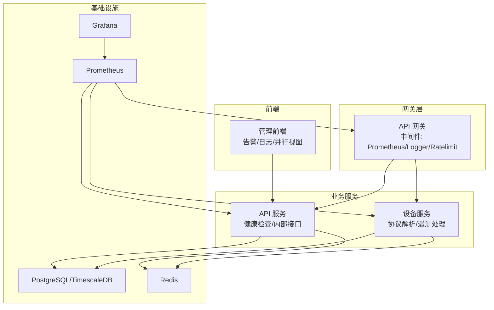
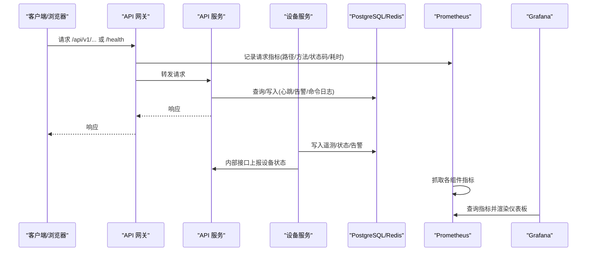
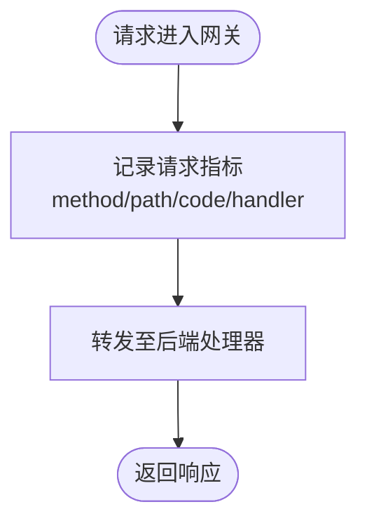
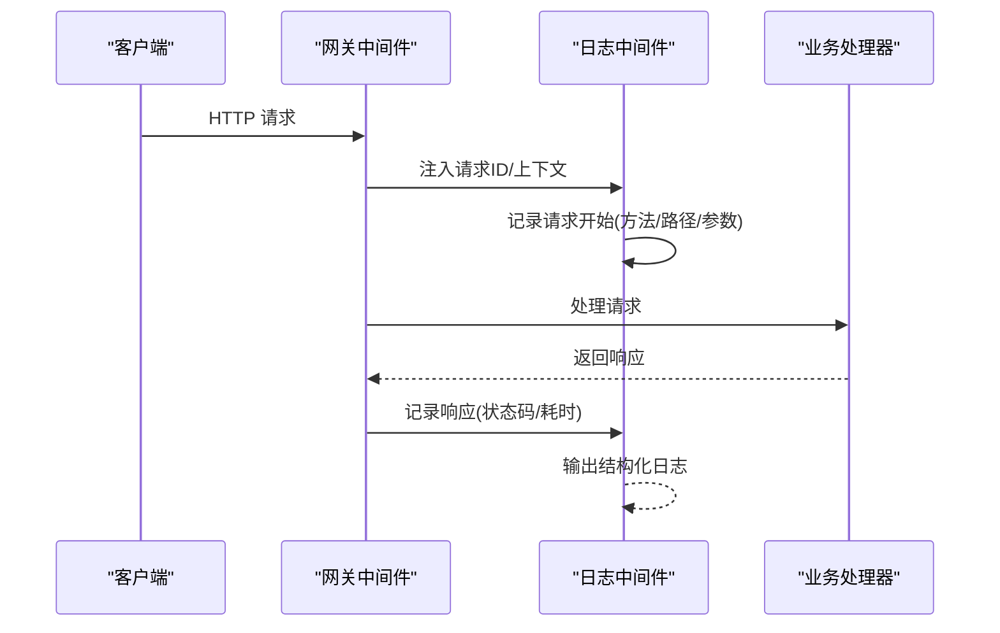
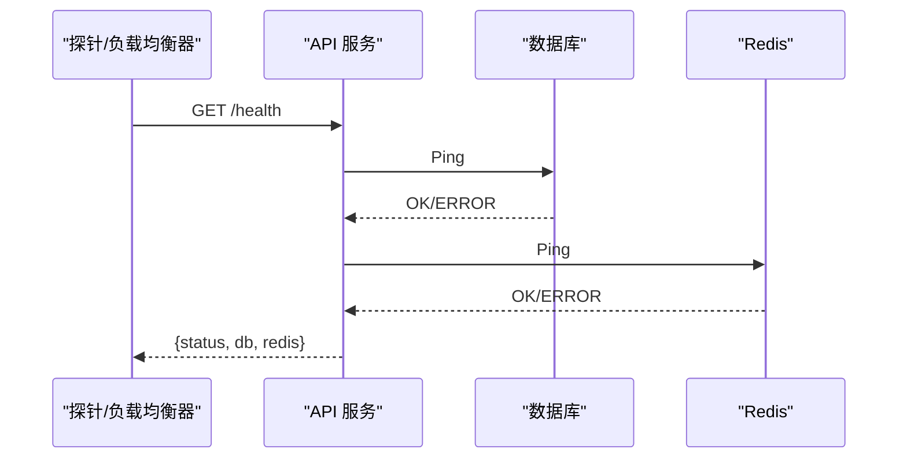
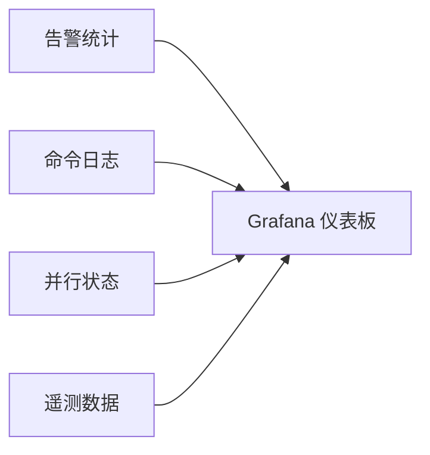
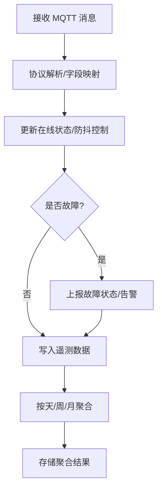
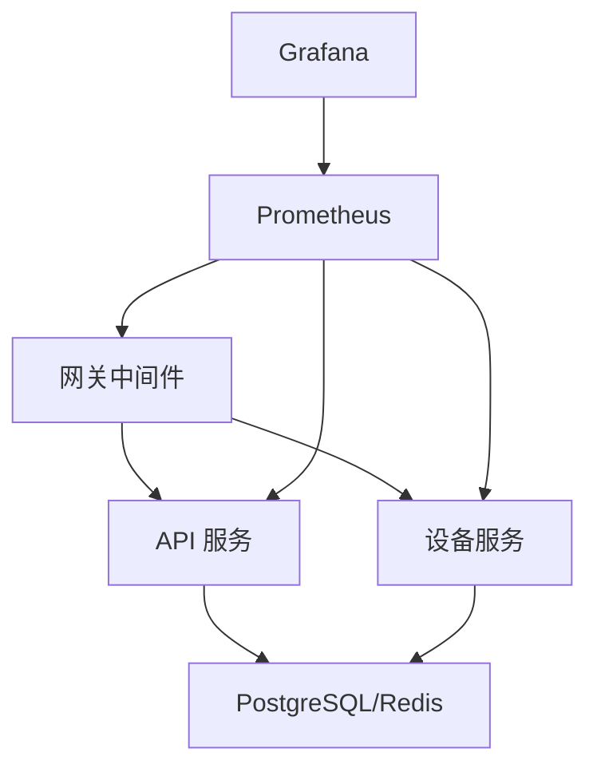

# 监控与指标

<cite>
**本文引用的文件**
- [inv_api_server/cmd/main.go](file://inv_api_server/cmd/main.go)
- [inv_api_server/internal/repository/repositories.go](file://inv_api_server/internal/repository/repositories.go)
- [inv_api_server/internal/model/models.go](file://inv_api_server/internal/model/models.go)
- [inv_device_server/internal/service/protocol_parser.go](file://inv_device_server/internal/service/protocol_parser.go)
- [inv_device_server/internal/model/device.go](file://inv_device_server/internal/model/device.go)
- [api-gateway/internal/middleware/prometheus.go](file://api-gateway/internal/middleware/prometheus.go)
- [api-gateway/internal/middleware/logger.go](file://api-gateway/internal/middleware/logger.go)
- [inv_api_server/pkg/logger/logger.go](file://inv_api_server/pkg/logger/logger.go)
- [inv_device_server/pkg/logger/logger.go](file://inv_device_server/pkg/logger/logger.go)
- [deploy/prometheus.yml](file://deploy/prometheus.yml)
- [deploy/prometheus_alerts.yml](file://deploy/prometheus_alerts.yml)
- [deploy/grafana-dashboard.json](file://deploy/grafana-dashboard.json)
- [deploy/monitor.sh](file://deploy/monitor.sh)
- [deploy/scripts/db_maintenance.sh](file://deploy/scripts/db_maintenance.sh)
- [deploy/webhook_server.py](file://deploy/webhook_server.py)
- [inv-admin-frontend/src/pages/portal/AlertsPage.tsx](file://inv-admin-frontend/src/pages/portal/AlertsPage.tsx)
- [inv-admin-frontend/src/pages/operation-logs/index.tsx](file://inv-admin-frontend/src/pages/operation-logs/index.tsx)
- [inv-admin-frontend/src/pages/parallel/index.tsx](file://inv-admin-frontend/src/pages/parallel/index.tsx)
</cite>

## 目录
1. [简介](#简介)
2. [项目结构](#项目结构)
3. [核心组件](#核心组件)
4. [架构总览](#架构总览)
5. [详细组件分析](#详细组件分析)
6. [依赖关系分析](#依赖关系分析)
7. [性能考虑](#性能考虑)
8. [故障排查指南](#故障排查指南)
9. [结论](#结论)
10. [附录](#附录)

## 简介
本技术文档围绕设备服务器监控与指标体系，系统阐述以下内容：
- Prometheus 指标采集：自定义指标定义、指标标签与时间序列数据组织方式
- 日志系统：结构化日志、日志级别与输出格式
- 健康检查端点：服务可用性检测、依赖服务检查与故障诊断
- 性能监控：响应时间、吞吐量与资源使用率指标
- 告警规则：阈值设置、聚合策略与通知渠道
- 监控仪表板：关键指标展示与趋势分析
- 最佳实践与故障排查方法

## 项目结构
该仓库采用多模块分层架构，监控与指标相关的关键模块如下：
- API 网关：提供统一入口、限流与 Prometheus 中间件
- API 服务：对外提供业务接口、内部接口、健康检查与心跳维护
- 设备服务：MQTT/协议解析、遥测数据处理与状态上报
- 前端管理端：告警、运维日志与并行运行状态的可视化
- 运维脚本：Prometheus/Grafana 配置、数据库维护与系统级监控脚本

图表来源
- [api-gateway/internal/middleware/prometheus.go](file://api-gateway/internal/middleware/prometheus.go)
- [api-gateway/internal/middleware/logger.go](file://api-gateway/internal/middleware/logger.go)
- [inv_api_server/cmd/main.go](file://inv_api_server/cmd/main.go)
- [inv_device_server/internal/service/protocol_parser.go](file://inv_device_server/internal/service/protocol_parser.go)
- [deploy/prometheus.yml](file://deploy/prometheus.yml)
- [deploy/grafana-dashboard.json](file://deploy/grafana-dashboard.json)

章节来源
- [api-gateway/internal/middleware/prometheus.go](file://api-gateway/internal/middleware/prometheus.go)
- [api-gateway/internal/middleware/logger.go](file://api-gateway/internal/middleware/logger.go)
- [inv_api_server/cmd/main.go](file://inv_api_server/cmd/main.go)
- [inv_device_server/internal/service/protocol_parser.go](file://inv_device_server/internal/service/protocol_parser.go)
- [deploy/prometheus.yml](file://deploy/prometheus.yml)
- [deploy/grafana-dashboard.json](file://deploy/grafana-dashboard.json)

## 核心组件
- Prometheus 中间件：在网关层对请求进行计数、耗时与状态码统计
- 结构化日志：统一的日志格式与级别，便于检索与聚合
- 健康检查端点：/health 检查数据库与 Redis 可用性
- 心跳与离线标记：定时扫描设备心跳，标记离线并同步站点状态
- 协议解析与遥测处理：设备在线状态、故障上报与数据存储
- 前端可视化：告警、命令与并行运行状态的实时展示

章节来源
- [api-gateway/internal/middleware/prometheus.go](file://api-gateway/internal/middleware/prometheus.go)
- [api-gateway/internal/middleware/logger.go](file://api-gateway/internal/middleware/logger.go)
- [inv_api_server/cmd/main.go](file://inv_api_server/cmd/main.go)
- [inv_device_server/internal/service/protocol_parser.go](file://inv_device_server/internal/service/protocol_parser.go)
- [inv-admin-frontend/src/pages/portal/AlertsPage.tsx](file://inv-admin-frontend/src/pages/portal/AlertsPage.tsx)

## 架构总览
下图展示了监控与指标在系统中的位置与交互：

图表来源
- [api-gateway/internal/middleware/prometheus.go](file://api-gateway/internal/middleware/prometheus.go)
- [inv_api_server/cmd/main.go](file://inv_api_server/cmd/main.go)
- [inv_device_server/internal/service/protocol_parser.go](file://inv_device_server/internal/service/protocol_parser.go)
- [deploy/prometheus.yml](file://deploy/prometheus.yml)
- [deploy/grafana-dashboard.json](file://deploy/grafana-dashboard.json)

## 详细组件分析

### Prometheus 指标采集与自定义指标
- 指标类型
  - HTTP 请求总量：按路径、方法、状态码分类
  - 请求持续时间直方图：按路径分桶
  - 请求并发数：当前活跃请求数
- 指标标签
  - method：HTTP 方法
  - path：请求路径模板
  - code：HTTP 状态码
  - handler：路由处理器
- 时间序列数据
  - 指标以时间戳记录，支持按时间窗口聚合与趋势分析
- 实现要点
  - 在网关中间件中注册 Prometheus 统计器
  - 使用标准库或第三方库暴露 /metrics 端点供 Prometheus 抓取

图表来源
- [api-gateway/internal/middleware/prometheus.go](file://api-gateway/internal/middleware/prometheus.go)

章节来源
- [api-gateway/internal/middleware/prometheus.go](file://api-gateway/internal/middleware/prometheus.go)
- [deploy/prometheus.yml](file://deploy/prometheus.yml)

### 日志系统实现
- 结构化日志
  - 统一使用结构化字段（如 sn、msg_type、level），便于查询与过滤
  - 日志级别：info/warn/error 等
  - 输出格式：JSON 或统一文本格式，包含时间戳、级别、消息体与上下文键值
- 日志中间件
  - 在网关层注入请求上下文与请求 ID，贯穿全链路
- 设备侧日志
  - 设备服务在协议解析与状态上报时记录关键事件，便于定位通信与解析问题

图表来源
- [api-gateway/internal/middleware/logger.go](file://api-gateway/internal/middleware/logger.go)
- [inv_api_server/pkg/logger/logger.go](file://inv_api_server/pkg/logger/logger.go)
- [inv_device_server/pkg/logger/logger.go](file://inv_device_server/pkg/logger/logger.go)

章节来源
- [api-gateway/internal/middleware/logger.go](file://api-gateway/internal/middleware/logger.go)
- [inv_api_server/pkg/logger/logger.go](file://inv_api_server/pkg/logger/logger.go)
- [inv_device_server/pkg/logger/logger.go](file://inv_device_server/pkg/logger/logger.go)

### 健康检查端点
- /health 探针
  - 检查数据库连接可用性
  - 检查 Redis 连接可用性
  - 返回 JSON 状态，包含 db/redis 字段
- 内部接口
  - 设备状态/信息/数据/命令/告警/OTA 等内部上报接口
- 心跳与离线标记
  - 定时任务扫描设备心跳，超过阈值标记离线并同步站点状态

图表来源
- [inv_api_server/cmd/main.go](file://inv_api_server/cmd/main.go)

章节来源
- [inv_api_server/cmd/main.go](file://inv_api_server/cmd/main.go)

### 性能监控指标
- 响应时间
  - 通过 Prometheus histogram 记录请求耗时分布
- 吞吐量
  - 按路径与状态码统计请求速率
- 资源使用率
  - 通过系统监控（如 Node Exporter）采集 CPU/内存/磁盘/网络
- 关键业务指标
  - 设备在线数、告警数量、命令成功率、OTA 状态分布

章节来源
- [api-gateway/internal/middleware/prometheus.go](file://api-gateway/internal/middleware/prometheus.go)
- [deploy/prometheus.yml](file://deploy/prometheus.yml)

### 告警规则配置
- 阈值设置
  - 离线设备数阈值、告警速率阈值、命令失败率阈值
- 聚合策略
  - 按设备 SN、站点、级别聚合统计
- 通知渠道
  - 邮件、IM 或 Webhook
- 规则示例
  - Prometheus 告警规则文件定义了关键阈值与表达式

章节来源
- [deploy/prometheus_alerts.yml](file://deploy/prometheus_alerts.yml)

### 监控仪表板设计
- 关键指标
  - 设备在线/离线趋势、告警级别分布、命令成功率、OTA 状态
- 趋势分析
  - 按小时/天聚合的遥测数据与告警统计
- 前端可视化
  - 告警页面、运维日志页面、并行运行状态页面

图表来源
- [deploy/grafana-dashboard.json](file://deploy/grafana-dashboard.json)
- [inv-admin-frontend/src/pages/portal/AlertsPage.tsx](file://inv-admin-frontend/src/pages/portal/AlertsPage.tsx)
- [inv-admin-frontend/src/pages/operation-logs/index.tsx](file://inv-admin-frontend/src/pages/operation-logs/index.tsx)
- [inv-admin-frontend/src/pages/parallel/index.tsx](file://inv-admin-frontend/src/pages/parallel/index.tsx)

章节来源
- [deploy/grafana-dashboard.json](file://deploy/grafana-dashboard.json)
- [inv-admin-frontend/src/pages/portal/AlertsPage.tsx](file://inv-admin-frontend/src/pages/portal/AlertsPage.tsx)
- [inv-admin-frontend/src/pages/operation-logs/index.tsx](file://inv-admin-frontend/src/pages/operation-logs/index.tsx)
- [inv-admin-frontend/src/pages/parallel/index.tsx](file://inv-admin-frontend/src/pages/parallel/index.tsx)

### 设备遥测与状态处理流程
- 协议解析
  - 解析 MQTT 主题与载荷，映射字段
- 在线状态管理
  - 设备上线时上报状态，防抖避免重复上报
- 故障检测
  - data/status 主题中解析故障码并主动上报
- 存储与聚合
  - 遥测数据写入 TimescaleDB，按天/周/月聚合

图表来源
- [inv_device_server/internal/service/protocol_parser.go](file://inv_device_server/internal/service/protocol_parser.go)
- [inv_device_server/internal/model/device.go](file://inv_device_server/internal/model/device.go)
- [inv_api_server/internal/repository/repositories.go](file://inv_api_server/internal/repository/repositories.go)

章节来源
- [inv_device_server/internal/service/protocol_parser.go](file://inv_device_server/internal/service/protocol_parser.go)
- [inv_device_server/internal/model/device.go](file://inv_device_server/internal/model/device.go)
- [inv_api_server/internal/repository/repositories.go](file://inv_api_server/internal/repository/repositories.go)

### 前端监控与可视化
- 告警页面
  - 展示告警总数、未处理与严重告警数量，支持按级别筛选
- 运维日志页面
  - 展示告警日志、命令日志与系统日志，支持导出 CSV
- 并行运行页面
  - 展示并联系统的负载、相位偏移、环流电流与同步状态

章节来源
- [inv-admin-frontend/src/pages/portal/AlertsPage.tsx](file://inv-admin-frontend/src/pages/portal/AlertsPage.tsx)
- [inv-admin-frontend/src/pages/operation-logs/index.tsx](file://inv-admin-frontend/src/pages/operation-logs/index.tsx)
- [inv-admin-frontend/src/pages/parallel/index.tsx](file://inv-admin-frontend/src/pages/parallel/index.tsx)

## 依赖关系分析
- 组件耦合
  - 网关层与业务层通过中间件解耦，Prometheus 与日志中间件可独立替换
  - 设备服务与 API 服务通过内部接口解耦，降低耦合度
- 外部依赖
  - PostgreSQL/TimescaleDB 提供时序数据存储
  - Redis 提供缓存与在线状态快速判定
  - Prometheus/Grafana 提供指标抓取与可视化
- 循环依赖
  - 当前结构未见循环依赖迹象

图表来源
- [api-gateway/internal/middleware/prometheus.go](file://api-gateway/internal/middleware/prometheus.go)
- [inv_api_server/cmd/main.go](file://inv_api_server/cmd/main.go)
- [inv_device_server/internal/service/protocol_parser.go](file://inv_device_server/internal/service/protocol_parser.go)
- [deploy/prometheus.yml](file://deploy/prometheus.yml)
- [deploy/grafana-dashboard.json](file://deploy/grafana-dashboard.json)

章节来源
- [api-gateway/internal/middleware/prometheus.go](file://api-gateway/internal/middleware/prometheus.go)
- [inv_api_server/cmd/main.go](file://inv_api_server/cmd/main.go)
- [inv_device_server/internal/service/protocol_parser.go](file://inv_device_server/internal/service/protocol_parser.go)
- [deploy/prometheus.yml](file://deploy/prometheus.yml)
- [deploy/grafana-dashboard.json](file://deploy/grafana-dashboard.json)

## 性能考虑
- 指标维度控制
  - 控制标签基数，避免过多唯一值导致指标膨胀
- 抓取频率与超时
  - 合理设置抓取间隔与超时，避免对业务造成额外压力
- 数据保留策略
  - TimescaleDB 分块压缩与归档，定期清理历史数据
- 缓存与去抖
  - 设备在线状态防抖减少重复上报与数据库写入

## 故障排查指南
- 健康检查失败
  - 检查数据库与 Redis Ping 是否成功
  - 查看探针日志与中间件错误输出
- 设备离线/不在线
  - 检查心跳扫描任务是否正常运行
  - 核对设备上报频率与协议解析是否正确
- 告警未显示
  - 检查告警规则是否生效、告警数据是否写入
  - 前端轮询间隔与权限问题
- 数据缺失/延迟
  - 检查 Kafka/MQTT 桥接与设备服务日志
  - 核对 TimescaleDB 维护脚本是否按时执行

章节来源
- [inv_api_server/cmd/main.go](file://inv_api_server/cmd/main.go)
- [deploy/scripts/db_maintenance.sh](file://deploy/scripts/db_maintenance.sh)
- [deploy/monitor.sh](file://deploy/monitor.sh)
- [deploy/webhook_server.py](file://deploy/webhook_server.py)

## 结论
本项目通过网关中间件、结构化日志、健康检查与 Prometheus 指标采集，构建了完整的监控与告警体系；结合前端可视化与数据库维护脚本，实现了可观测性闭环。建议持续优化标签基数、完善告警阈值与通知策略，并加强异常场景的自动化处置能力。

## 附录
- 配置文件
  - Prometheus 抓取配置与告警规则
  - Grafana 仪表板 JSON
- 运维脚本
  - 系统服务监控与自动重启
  - TimescaleDB 维护与数据清理

章节来源
- [deploy/prometheus.yml](file://deploy/prometheus.yml)
- [deploy/prometheus_alerts.yml](file://deploy/prometheus_alerts.yml)
- [deploy/grafana-dashboard.json](file://deploy/grafana-dashboard.json)
- [deploy/monitor.sh](file://deploy/monitor.sh)
- [deploy/scripts/db_maintenance.sh](file://deploy/scripts/db_maintenance.sh)
- [deploy/webhook_server.py](file://deploy/webhook_server.py)