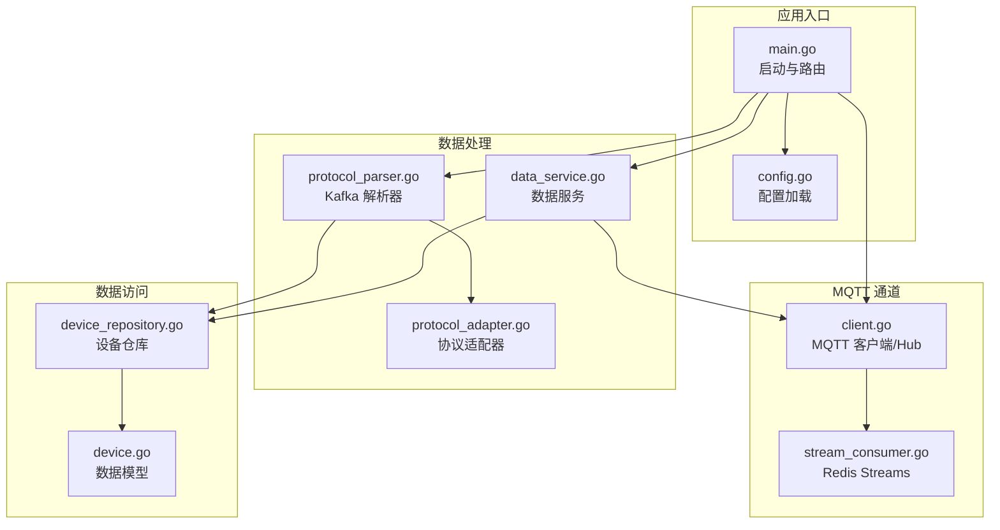
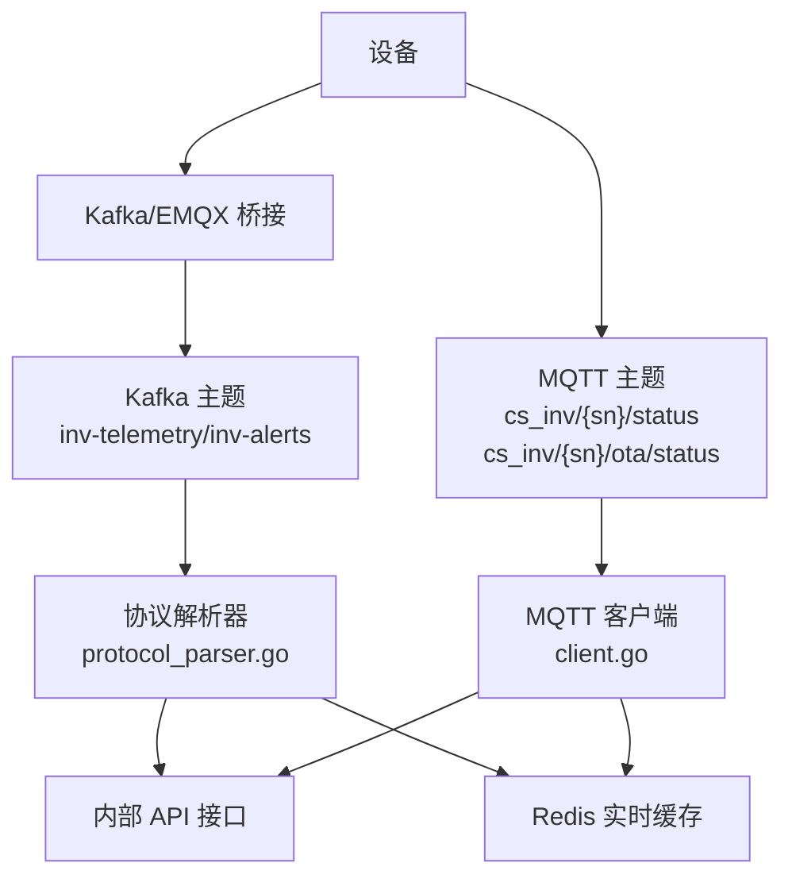
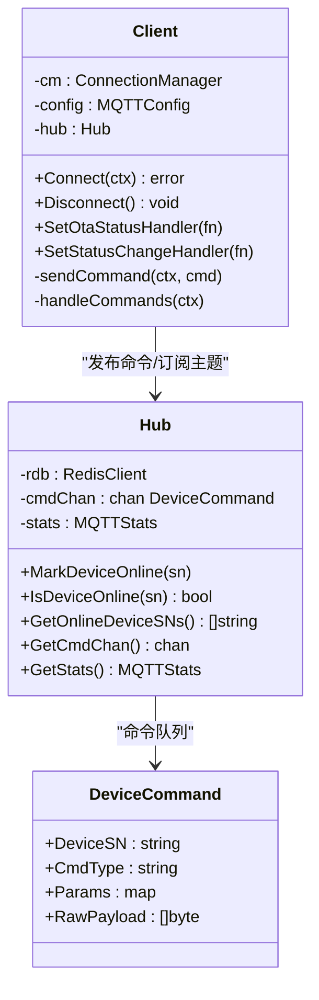
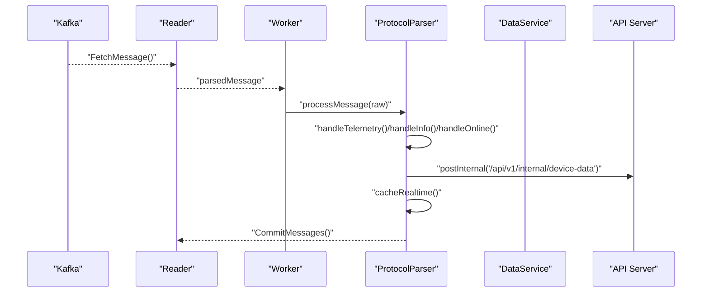
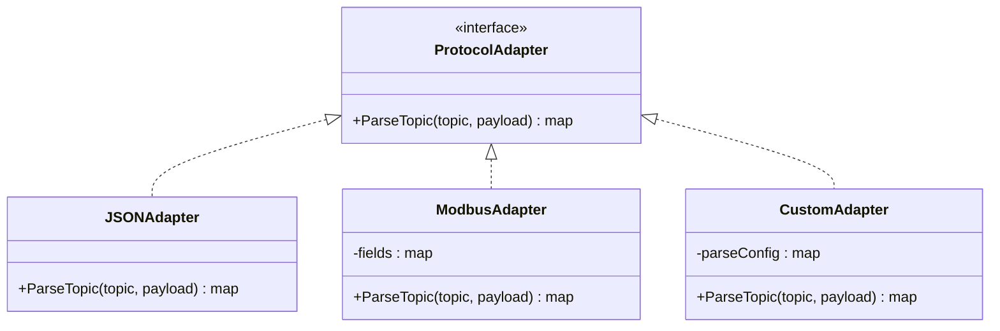
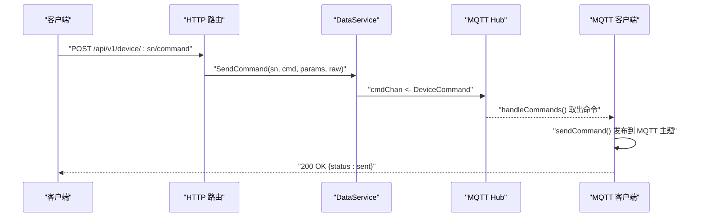
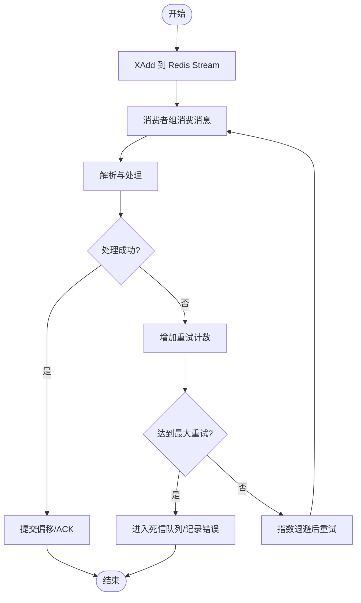
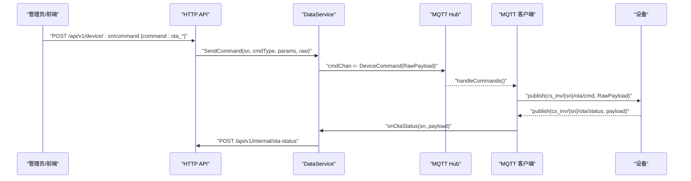
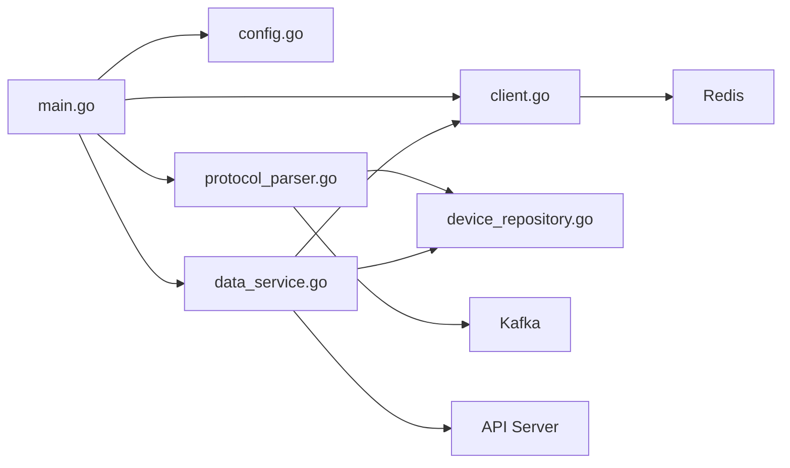

# 设备服务器

<cite>
**本文引用的文件**
- [main.go](file://inv_device_server/cmd/main.go)
- [config.go](file://inv_device_server/internal/config/config.go)
- [client.go](file://inv_device_server/internal/mqtt/client.go)
- [stream_consumer.go](file://inv_device_server/internal/mqtt/stream_consumer.go)
- [data_service.go](file://inv_device_server/internal/service/data_service.go)
- [protocol_parser.go](file://inv_device_server/internal/service/protocol_parser.go)
- [protocol_adapter.go](file://inv_device_server/internal/service/protocol_adapter.go)
- [device_repository.go](file://inv_device_server/internal/repository/device_repository.go)
- [device.go](file://inv_device_server/internal/model/device.go)
</cite>

## 目录
1. [简介](#简介)
2. [项目结构](#项目结构)
3. [核心组件](#核心组件)
4. [架构总览](#架构总览)
5. [详细组件分析](#详细组件分析)
6. [依赖关系分析](#依赖关系分析)
7. [性能考虑](#性能考虑)
8. [故障排除指南](#故障排除指南)
9. [结论](#结论)
10. [附录](#附录)

## 简介
本项目是一个基于 Go 的设备通信服务，负责接收来自设备的数据、进行协议解析、状态与遥测数据处理，并通过 HTTP 接口对外提供查询与命令下发能力。系统同时支持两种数据通道：
- Kafka 桥接模式：通过 Kafka 消费器解析设备上报的遥测与状态数据，完成数据转换、缓存更新与持久化。
- MQTT 命令通道：通过 MQTT 客户端订阅设备状态与 OTA 状态主题，实现设备在线状态同步与 OTA 状态转发。

系统还集成了 Redis Streams 作为消息缓冲，配合消费者组与 ACK 确认机制，实现高吞吐与可靠的消息处理；并通过 Prometheus 风格的指标暴露运行状态。

## 项目结构
- 应用入口与配置
  - 入口：[main.go](file://inv_device_server/cmd/main.go)
  - 配置加载与环境变量绑定：[config.go](file://inv_device_server/internal/config/config.go)
- MQTT 通信
  - 客户端与 Hub：[client.go](file://inv_device_server/internal/mqtt/client.go)
  - Redis Streams 消息缓冲：[stream_consumer.go](file://inv_device_server/internal/mqtt/stream_consumer.go)
- 数据服务与业务逻辑
  - 数据服务：[data_service.go](file://inv_device_server/internal/service/data_service.go)
  - 协议解析与适配：[protocol_parser.go](file://inv_device_server/internal/service/protocol_parser.go)、[protocol_adapter.go](file://inv_device_server/internal/service/protocol_adapter.go)
- 数据访问与模型
  - 设备仓库：[device_repository.go](file://inv_device_server/internal/repository/device_repository.go)
  - 数据模型：[device.go](file://inv_device_server/internal/model/device.go)

**图表来源**
- [main.go:34-187](file://inv_device_server/cmd/main.go#L34-L187)
- [config.go:82-162](file://inv_device_server/internal/config/config.go#L82-L162)
- [client.go:129-379](file://inv_device_server/internal/mqtt/client.go#L129-L379)
- [stream_consumer.go:16-29](file://inv_device_server/internal/mqtt/stream_consumer.go#L16-L29)
- [data_service.go:33-317](file://inv_device_server/internal/service/data_service.go#L33-L317)
- [protocol_parser.go:55-91](file://inv_device_server/internal/service/protocol_parser.go#L55-L91)
- [protocol_adapter.go:110-145](file://inv_device_server/internal/service/protocol_adapter.go#L110-L145)
- [device_repository.go:17-153](file://inv_device_server/internal/repository/device_repository.go#L17-L153)
- [device.go:9-222](file://inv_device_server/internal/model/device.go#L9-L222)

**章节来源**
- [main.go:34-187](file://inv_device_server/cmd/main.go#L34-L187)
- [config.go:82-162](file://inv_device_server/internal/config/config.go#L82-L162)

## 核心组件
- 配置系统：支持 YAML 配置文件与环境变量覆盖，涵盖服务器、数据库、Redis、MQTT、Kafka、后端 API、日志与时区等。
- MQTT 客户端与 Hub：负责连接 EMQX/Mosquitto、订阅设备状态与 OTA 状态主题、维护在线设备集合、处理命令下发队列。
- Kafka 协议解析器：消费 Kafka 遥测/告警主题，按设备模型与字段映射规则解析数据，写入 API 内部接口并更新 Redis 实时缓存。
- 数据服务：统一对外提供健康检查、指标导出、设备在线查询、实时数据查询与命令下发接口。
- 仓库与模型：提供设备与模型元数据的查询与缓存，支撑协议解析与字段映射。

**章节来源**
- [config.go:12-80](file://inv_device_server/internal/config/config.go#L12-L80)
- [client.go:20-67](file://inv_device_server/internal/mqtt/client.go#L20-L67)
- [protocol_parser.go:29-45](file://inv_device_server/internal/service/protocol_parser.go#L29-L45)
- [data_service.go:23-50](file://inv_device_server/internal/service/data_service.go#L23-L50)
- [device_repository.go:13-19](file://inv_device_server/internal/repository/device_repository.go#L13-L19)
- [device.go:9-222](file://inv_device_server/internal/model/device.go#L9-L222)

## 架构总览
系统采用“Kafka 消费 + MQTT 订阅”的双通道架构：
- Kafka 通道：设备侧通过桥接或直连向 Kafka 投递标准化 JSON 消息，解析器并发消费并处理，最终调用内部 API 接口完成入库与缓存更新。
- MQTT 通道：设备侧通过 MQTT 主题上报状态与 OTA 状态，服务端订阅主题并同步设备在线状态，同时将 OTA 状态转发至 API 服务。

**图表来源**
- [protocol_parser.go:55-91](file://inv_device_server/internal/service/protocol_parser.go#L55-L91)
- [client.go:136-235](file://inv_device_server/internal/mqtt/client.go#L136-L235)

## 详细组件分析

### MQTT 客户端与 Hub
- 连接与订阅
  - 使用 autopaho 库建立持久会话，订阅设备状态与 OTA 状态主题，自动处理连接与错误事件。
  - 支持 TLS/非 TLS 自动识别，用户名密码认证。
- 在线状态管理
  - Hub 维护设备在线哈希，以时间戳判断在线状态；提供在线设备列表查询。
- 命令下发
  - 通过 Hub 的命令通道异步发送命令，区分 OTA 与普通命令的主题路径。
- 共享订阅与负载均衡
  - 提供 SN 提取函数，可从共享订阅主题中解析设备序列号，便于横向扩展与负载均衡。

**图表来源**
- [client.go:20-67](file://inv_device_server/internal/mqtt/client.go#L20-L67)
- [client.go:129-379](file://inv_device_server/internal/mqtt/client.go#L129-L379)
- [data_service.go:66-75](file://inv_device_server/internal/service/data_service.go#L66-L75)

**章节来源**
- [client.go:136-235](file://inv_device_server/internal/mqtt/client.go#L136-L235)
- [client.go:248-317](file://inv_device_server/internal/mqtt/client.go#L248-L317)
- [client.go:328-379](file://inv_device_server/internal/mqtt/client.go#L328-L379)

### Kafka 协议解析器与适配器
- 消费与并发
  - 使用 kafka.Reader 消费指定主题，内置工作协程池并发处理消息，支持重试与提交偏移。
- 模型与字段映射
  - 依据设备模型与字段定义，动态选择适配器（JSON/Modbus/自定义），执行字段映射与类型转换。
- 数据处理流程
  - 解析 payload，处理嵌套与字符串包裹场景；根据消息类型分派到不同处理器（状态、信息、遥测、命令响应）。
  - 对故障状态进行检测与防抖，避免重复上报；对能量类数据提取关键指标并补充站点 ID。
  - 将解析后的数据通过内部 API 接口上报，并更新 Redis 实时缓存与发布订阅频道。

**图表来源**
- [protocol_parser.go:187-228](file://inv_device_server/internal/service/protocol_parser.go#L187-L228)
- [protocol_parser.go:230-245](file://inv_device_server/internal/service/protocol_parser.go#L230-L245)
- [protocol_parser.go:447-696](file://inv_device_server/internal/service/protocol_parser.go#L447-L696)
- [protocol_parser.go:758-814](file://inv_device_server/internal/service/protocol_parser.go#L758-L814)

**章节来源**
- [protocol_parser.go:55-91](file://inv_device_server/internal/service/protocol_parser.go#L55-L91)
- [protocol_parser.go:101-135](file://inv_device_server/internal/service/protocol_parser.go#L101-L135)
- [protocol_parser.go:170-185](file://inv_device_server/internal/service/protocol_parser.go#L170-L185)
- [protocol_parser.go:230-245](file://inv_device_server/internal/service/protocol_parser.go#L230-L245)
- [protocol_parser.go:447-696](file://inv_device_server/internal/service/protocol_parser.go#L447-L696)
- [protocol_parser.go:758-814](file://inv_device_server/internal/service/protocol_parser.go#L758-L814)

### 协议适配器与字段映射
- 适配器类型
  - JSONAdapter：直接返回 JSON 结构。
  - ModbusAdapter：将字符串/十六进制数值转换为浮点数，适配设备寄存器数据。
  - CustomAdapter：根据配置进行字段映射。
- 主题匹配
  - 支持通配符模式匹配，按模型定义选择对应适配器。
- 字段映射与类型转换
  - 根据模型字段定义应用解析规则与类型转换，保证入库字段一致性。

**图表来源**
- [protocol_adapter.go:15-17](file://inv_device_server/internal/service/protocol_adapter.go#L15-L17)
- [protocol_adapter.go:25-33](file://inv_device_server/internal/service/protocol_adapter.go#L25-L33)
- [protocol_adapter.go:43-73](file://inv_device_server/internal/service/protocol_adapter.go#L43-L73)
- [protocol_adapter.go:87-108](file://inv_device_server/internal/service/protocol_adapter.go#L87-L108)

**章节来源**
- [protocol_adapter.go:110-145](file://inv_device_server/internal/service/protocol_adapter.go#L110-L145)
- [protocol_parser.go:698-741](file://inv_device_server/internal/service/protocol_parser.go#L698-L741)

### 数据服务与 API
- 健康检查与指标
  - /health 返回服务与 Redis 连接状态，/metrics 导出 MQTT 在线客户端数与命令发送计数。
- 设备查询
  - /api/v1/device/:sn/online 查询设备在线状态。
  - /api/v1/device/:sn/data 从 Redis 获取最新实时数据。
- 命令下发
  - /api/v1/device/:sn/command 接收命令请求，校验设备在线后投递到 MQTT Hub，由客户端异步发送。

**图表来源**
- [main.go:240-346](file://inv_device_server/cmd/main.go#L240-L346)
- [data_service.go:66-75](file://inv_device_server/internal/service/data_service.go#L66-L75)
- [client.go:248-317](file://inv_device_server/internal/mqtt/client.go#L248-L317)

**章节来源**
- [main.go:240-346](file://inv_device_server/cmd/main.go#L240-L346)
- [data_service.go:62-75](file://inv_device_server/internal/service/data_service.go#L62-L75)

### Redis Streams 消息缓冲与 ACK
- 消息缓冲
  - 通过 PublishToStream 将设备数据写入 Redis Stream，设置最大长度限制，避免无限增长。
- 消费者组与 ACK
  - 解析器以消费者组方式消费 Kafka 消息，处理完成后提交偏移，实现至少一次处理与幂等控制。
- 死信队列
  - 通过重试上限与错误处理，超过最大重试次数的消息将被丢弃或进入死信处理流程（示例中为记录错误并提交偏移）。

**图表来源**
- [stream_consumer.go:16-29](file://inv_device_server/internal/mqtt/stream_consumer.go#L16-L29)
- [protocol_parser.go:101-135](file://inv_device_server/internal/service/protocol_parser.go#L101-L135)

**章节来源**
- [stream_consumer.go:16-29](file://inv_device_server/internal/mqtt/stream_consumer.go#L16-L29)
- [protocol_parser.go:101-135](file://inv_device_server/internal/service/protocol_parser.go#L101-L135)

### OTA 命令下发与状态转发
- 命令下发
  - 通过 HTTP 接口接收 OTA 命令，直接透传原始 JSON 到设备专用主题，确保设备端解析正确。
- 状态转发
  - 订阅设备 OTA 状态主题，解析设备上报的状态，转换为 API 服务期望格式并进行重试转发。

**图表来源**
- [main.go:116-126](file://inv_device_server/cmd/main.go#L116-L126)
- [data_service.go:204-294](file://inv_device_server/internal/service/data_service.go#L204-L294)
- [client.go:248-317](file://inv_device_server/internal/mqtt/client.go#L248-L317)

**章节来源**
- [main.go:116-126](file://inv_device_server/cmd/main.go#L116-L126)
- [data_service.go:204-294](file://inv_device_server/internal/service/data_service.go#L204-L294)
- [client.go:248-317](file://inv_device_server/internal/mqtt/client.go#L248-L317)

## 依赖关系分析
- 组件耦合
  - main.go 作为编排中心，初始化配置、数据库、Redis、MQTT 客户端与 Kafka 消费器，注入到服务层。
  - ProtocolParser 依赖仓库与适配器，通过内部 API 接口与 Redis 交互。
  - DataService 作为门面，协调 MQTT Hub 与 API 调用。
- 外部依赖
  - 数据库：PostgreSQL（pgxpool）
  - 缓存：Redis（go-redis）
  - 消息：Kafka（segmentio/kafka-go）
  - MQTT：eclipse/paho.golang（autopaho）

**图表来源**
- [main.go:34-187](file://inv_device_server/cmd/main.go#L34-L187)
- [protocol_parser.go:55-91](file://inv_device_server/internal/service/protocol_parser.go#L55-L91)
- [data_service.go:33-50](file://inv_device_server/internal/service/data_service.go#L33-L50)

**章节来源**
- [main.go:34-187](file://inv_device_server/cmd/main.go#L34-L187)
- [protocol_parser.go:55-91](file://inv_device_server/internal/service/protocol_parser.go#L55-L91)
- [data_service.go:33-50](file://inv_device_server/internal/service/data_service.go#L33-L50)

## 性能考虑
- 并发与限流
  - Kafka 解析器使用固定数量的工作协程与有界通道，避免内存膨胀。
  - HTTP 客户端复用连接，限制空闲连接数与超时时间。
- 缓存与索引
  - Redis 实时缓存采用管道批量写入，减少 RTT；字段级键支持按字段查询。
  - PostgreSQL 使用连接池参数与索引优化（迁移脚本中已包含性能索引）。
- 指标与可观测性
  - 暴露 MQTT 在线客户端数与命令发送计数指标，便于容量规划与告警。

**章节来源**
- [protocol_parser.go:93-99](file://inv_device_server/internal/service/protocol_parser.go#L93-L99)
- [protocol_parser.go:78-85](file://inv_device_server/internal/service/protocol_parser.go#L78-L85)
- [main.go:267-278](file://inv_device_server/cmd/main.go#L267-L278)

## 故障排除指南
- 健康检查
  - /health 检查 Redis 连接与 MQTT 客户端数量，快速定位连接异常。
- 日志与重试
  - Kafka 消费器在处理失败时进行指数退避重试，超过最大重试后记录错误并提交偏移。
  - API 调用失败同样具备重试与告警，避免单点故障扩大。
- 常见问题
  - MQTT 主题不匹配：确认设备上报主题是否符合 cs_inv/{sn}/data/#、cs_inv/{sn}/status、cs_inv/{sn}/ota/status。
  - Kafka 消费停滞：检查消费者组位点与分区分配，确认消息格式与 SN 字段存在。
  - Redis 缓存异常：确认 XAdd 成功与最大长度限制生效。

**章节来源**
- [main.go:248-265](file://inv_device_server/cmd/main.go#L248-L265)
- [protocol_parser.go:101-135](file://inv_device_server/internal/service/protocol_parser.go#L101-L135)
- [data_service.go:122-142](file://inv_device_server/internal/service/data_service.go#L122-L142)

## 结论
该设备服务器通过 Kafka 与 MQTT 双通道实现了高可用、高性能的设备数据接入与命令下发能力。结合 Redis Streams 的消息缓冲、消费者组与 ACK 确认机制，以及完善的协议解析与字段映射，满足了多品牌设备的协议适配需求。同时，HTTP API 与指标导出为运维与上层应用提供了便利。

## 附录

### EMQX 共享订阅与负载均衡
- 主题前缀
  - 设备上报主题：cs_inv/{sn}/data/#、cs_inv/{sn}/status、cs_inv/{sn}/ota/status
  - 命令下发主题：cs_inv/{sn}/cmd、cs_inv/{sn}/ota/cmd
- 共享订阅
  - 支持 $share/{group}/cs_inv/{sn}/... 形式的共享订阅，便于横向扩展与负载均衡。
- 负载均衡机制
  - Hub 的 SN 提取函数可从共享订阅主题中解析 sn，确保同一设备消息在组内均匀分布。

**章节来源**
- [client.go:154-164](file://inv_device_server/internal/mqtt/client.go#L154-L164)
- [client.go:328-379](file://inv_device_server/internal/mqtt/client.go#L328-L379)

### Redis Streams 消息缓冲
- 键空间
  - 主流键：device:stream（主队列）、device:stream:dead（死信队列）
  - 最大长度：约等于 10 万条，避免无限增长
- 生产与消费
  - 生产：XAdd 写入设备数据
  - 消费：消费者组消费，处理成功后提交偏移

**章节来源**
- [stream_consumer.go:10-29](file://inv_device_server/internal/mqtt/stream_consumer.go#L10-L29)

### 协议解析服务实现要点
- 数据帧解析
  - 支持 payload 为 JSON 或 JSON 字符串的双重解析；对嵌套 data 字段进行剥离。
- 字段映射与兼容性
  - 按设备模型字段定义进行映射与类型转换，兼容不同前缀（如 ac_、pv_、batt_ 等）。
- 兼容性处理
  - 对故障状态检测（state/fault_code）进行兼容处理，避免误报与漏报。

**章节来源**
- [protocol_parser.go:247-265](file://inv_device_server/internal/service/protocol_parser.go#L247-L265)
- [protocol_parser.go:698-741](file://inv_device_server/internal/service/protocol_parser.go#L698-L741)
- [protocol_adapter.go:147-189](file://inv_device_server/internal/service/protocol_adapter.go#L147-L189)

### 数据服务业务逻辑
- 在线状态同步
  - 通过 Hub 更新设备在线哈希，防抖状态变更，避免抖动。
- 缓存更新
  - 将解析后的数据写入 Redis 实时缓存，支持按字段与整体查询。
- 数据库持久化
  - 通过内部 API 接口上报数据，交由后端服务完成数据库持久化。

**章节来源**
- [data_service.go:93-142](file://inv_device_server/internal/service/data_service.go#L93-L142)
- [protocol_parser.go:382-445](file://inv_device_server/internal/service/protocol_parser.go#L382-L445)
- [protocol_parser.go:758-814](file://inv_device_server/internal/service/protocol_parser.go#L758-L814)

### OTA 命令下发与状态转发流程
- 命令下发
  - HTTP 接口接收 OTA 命令，直接透传原始 JSON 至设备专用主题。
- 状态转发
  - 订阅设备 OTA 状态主题，解析并转换为 API 服务期望格式，进行重试转发。

**章节来源**
- [main.go:116-126](file://inv_device_server/cmd/main.go#L116-L126)
- [data_service.go:204-294](file://inv_device_server/internal/service/data_service.go#L204-L294)
- [client.go:248-317](file://inv_device_server/internal/mqtt/client.go#L248-L317)

### Prometheus 监控指标
- 指标
  - inv_device_mqtt_online_clients：在线 MQTT 设备客户端数
  - inv_device_mqtt_cmd_sent：MQTT 命令发送总数
- 导出
  - /metrics 接口以文本格式导出指标

**章节来源**
- [main.go:267-278](file://inv_device_server/cmd/main.go#L267-L278)