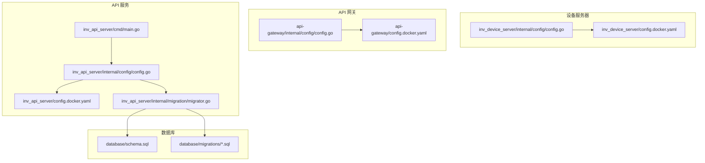
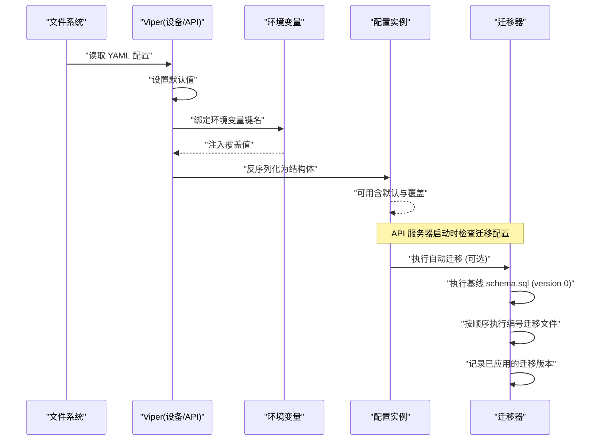
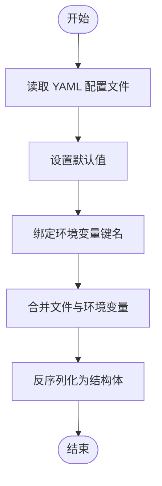
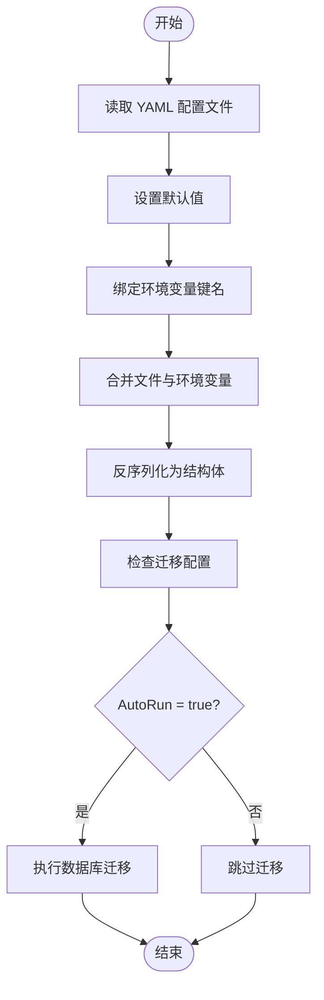
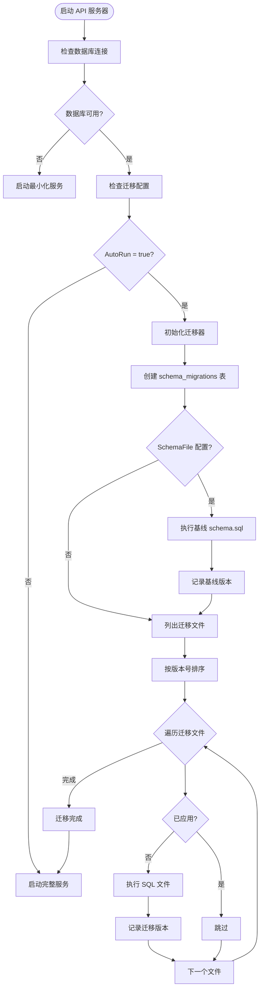
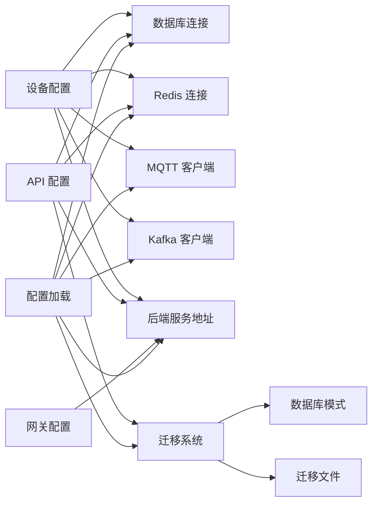

# 配置管理

<cite>
**本文引用的文件**
- [inv_device_server 内部配置](file://inv_device_server/internal/config/config.go)
- [inv_device_server Docker 配置](file://inv_device_server/config.docker.yaml)
- [inv_api_server 内部配置](file://inv_api_server/internal/config/config.go)
- [inv_api_server Docker 配置](file://inv_api_server/config.docker.yaml)
- [api-gateway 内部配置](file://api-gateway/internal/config/config.go)
- [api-gateway Docker 配置](file://api-gateway/config.docker.yaml)
- [api-gateway 内部配置测试](file://api-gateway/internal/config/config_test.go)
- [API 服务主程序](file://inv_api_server/cmd/main.go)
- [数据库迁移器](file://inv_api_server/internal/migration/migrator.go)
- [数据库模式定义](file://database/schema.sql)
- [数据库迁移文件](file://database/migrations/001_init_schema.up.sql)
</cite>

## 更新摘要
**所做更改**
- 新增 API 服务器数据库自动迁移配置章节
- 更新 API 服务器配置结构说明，包含 MigrationConfig 结构体
- 添加数据库迁移工作流程和配置示例
- 更新配置验证和环境变量支持说明
- 增强故障排除指南，包含迁移相关问题的解决方案

## 目录
1. [简介](#简介)
2. [项目结构](#项目结构)
3. [核心组件](#核心组件)
4. [架构总览](#架构总览)
5. [详细组件分析](#详细组件分析)
6. [依赖关系分析](#依赖关系分析)
7. [性能考量](#性能考量)
8. [故障排除指南](#故障排除指南)
9. [结论](#结论)
10. [附录](#附录)

## 简介
本文件面向设备服务器（inv_device_server）的配置管理，系统性阐述配置文件结构、环境变量覆盖机制、默认值与校验策略、运行时调整能力、安全注意事项以及排障方法。文档同时对比了 API 网关与 API 服务的配置差异，帮助读者在多服务环境中正确理解与迁移配置。**最新更新**：API 服务器新增了数据库自动迁移功能，支持启动时自动执行 SQL 迁移脚本。

## 项目结构
围绕配置管理的关键文件分布如下：
- 设备服务器配置：内部 Go 模块负责加载 YAML 并通过 Viper 绑定环境变量；Docker 配置提供容器化默认值。
- API 网关配置：内部 Go 模块使用 YAML 解析，并对环境变量进行展开；Docker 配置提供示例。
- API 服务配置：内部 Go 模块使用 Viper 加载并绑定环境变量；Docker 配置提供示例，**新增数据库迁移配置**。



**图表来源**
- [inv_device_server/internal/config/config.go:1-163](file://inv_device_server/internal/config/config.go#L1-L163)
- [inv_device_server/config.docker.yaml:1-54](file://inv_device_server/config.docker.yaml#L1-L54)
- [api-gateway/internal/config/config.go:1-87](file://api-gateway/internal/config/config.go#L1-L87)
- [api-gateway/config.docker.yaml:1-39](file://api-gateway/config.docker.yaml#L1-L39)
- [inv_api_server/internal/config/config.go:1-237](file://inv_api_server/internal/config/config.go#L1-L237)
- [inv_api_server/config.docker.yaml:1-64](file://inv_api_server/config.docker.yaml#L1-L64)
- [inv_api_server/internal/migration/migrator.go:1-214](file://inv_api_server/internal/migration/migrator.go#L1-L214)
- [inv_api_server/cmd/main.go:84-94](file://inv_api_server/cmd/main.go#L84-L94)

## 核心组件
- 配置模型与分层
  - 通用字段：server、database、redis、backends、log、timezone
  - 设备服务器特有：mqtt、kafka
  - API 服务特有：jwt、sms、email、cors、**migration**
  - API 网关特有：jwt、rate_limit、route_rate_limits、rbac、redis
- **新增**：数据库自动迁移配置
  - MigrationConfig 结构体：Dir、SchemaFile、AutoRun 字段
  - 支持基线 schema.sql 和编号迁移文件 (001_*.sql, 002_*.sql, ...)
  - 自动版本跟踪和幂等执行
- 默认值与环境变量绑定
  - 使用 Viper 设置默认值并在加载前绑定环境变量键名
  - 设备服务器与 API 服务均采用该模式；API 网关采用 YAML 展开方式
- 配置加载流程
  - 读取本地 YAML 文件
  - 应用默认值与环境变量覆盖
  - 反序列化为结构体

**章节来源**
- [inv_device_server/internal/config/config.go:12-80](file://inv_device_server/internal/config/config.go#L12-L80)
- [inv_api_server/internal/config/config.go:12-47](file://inv_api_server/internal/config/config.go#L12-L47)
- [api-gateway/internal/config/config.go:10-55](file://api-gateway/internal/config/config.go#L10-L55)

## 架构总览
下图展示了三类服务的配置加载与覆盖关系，**新增数据库迁移流程**：



**图表来源**
- [inv_device_server/internal/config/config.go:82-162](file://inv_device_server/internal/config/config.go#L82-L162)
- [inv_api_server/internal/config/config.go:99-214](file://inv_api_server/internal/config/config.go#L99-214)
- [inv_api_server/internal/migration/migrator.go:32-136](file://inv_api_server/internal/migration/migrator.go#L32-L136)
- [inv_api_server/cmd/main.go:84-94](file://inv_api_server/cmd/main.go#L84-L94)

## 详细组件分析

### 设备服务器配置（inv_device_server）
- 配置结构要点
  - server：端口、读写超时、模式
  - database：主机、端口、用户、密码、库名、SSL、连接池参数
  - redis：主机、端口、密码、库编号
  - mqtt：Broker、端口、客户端ID、用户名、密码、QoS、TLS 不安全选项
  - kafka：启用开关、Broker 列表、遥测/告警/命令主题
  - backends：后端 API 地址、内部密钥
  - log：日志级别、文件名、轮转大小/备份数/保留天数、压缩
  - timezone：时区字符串
- 默认值与环境变量
  - 通过 viper.SetDefault 设置默认值
  - 通过 viper.BindEnv 将配置键绑定到环境变量，如 DB_*、REDIS_*、MQTT_*、KAFKA_*、API_SERVER_URL、INTERNAL_KEY 等
  - 特殊处理：将单个 Kafka Broker 字符串转换为数组
- 加载流程
  - 读取 YAML 文件内容
  - 读入 Viper 配置
  - 反序列化为 Config 结构体



**图表来源**
- [inv_device_server/internal/config/config.go:82-162](file://inv_device_server/internal/config/config.go#L82-L162)

**章节来源**
- [inv_device_server/internal/config/config.go:12-162](file://inv_device_server/internal/config/config.go#L12-L162)
- [inv_device_server/config.docker.yaml:1-54](file://inv_device_server/config.docker.yaml#L1-L54)

### API 网关配置（api-gateway）
- 配置结构要点
  - server：端口、模式
  - jwt：密钥
  - rate_limit：全局速率与突发
  - route_rate_limits：按路径前缀的限流规则
  - backends：API 服务与设备服务地址
  - redis：主机、端口、密码、库编号
  - rbac：启用标志与缓存 TTL
- 默认值与环境变量
  - 通过 viper.SetDefault 设置默认值
  - 通过 viper.BindEnv 绑定环境变量键名，如 JWT_SECRET、API_SERVER_URL、DEVICE_SERVER_URL、REDIS_* 等
- 加载流程
  - 读取 YAML 文件内容
  - 读入 Viper 配置
  - 反序列化为结构体


**图表来源**
- [api-gateway/internal/config/config.go:57-81](file://api-gateway/internal/config/config.go#L57-L81)

**章节来源**
- [api-gateway/internal/config/config.go:10-87](file://api-gateway/internal/config/config.go#L10-L87)
- [api-gateway/config.docker.yaml:1-39](file://api-gateway/config.docker.yaml#L1-L39)

### API 服务配置（inv_api_server）
- 配置结构要点
  - server：端口、读写超时、模式
  - database：主机、端口、用户、密码、库名、SSL、连接池参数
  - redis：主机、端口、密码、库编号
  - jwt：密钥、过期时间、刷新过期时间、签发者
  - sms：提供商、AK/SK、签名、模板
  - email：SMTP 主机、端口、用户名、密码、发件人、SSL、不安全 TLS
  - cors：允许的来源列表
  - backends：设备服务地址、内部密钥、服务外部 URL、天气 API、高德 Key、天气源
  - log：日志级别、文件名、轮转大小/备份数/保留天数、压缩
  - timezone：时区字符串
  - **migration：数据库自动迁移配置**
- **新增**：数据库自动迁移配置 (MigrationConfig)
  - Dir：存放编号迁移文件的目录路径（空则跳过）
  - SchemaFile：基线 schema.sql 文件路径（空则跳过）
  - AutoRun：是否启用自动迁移（默认 true）
- 默认值与环境变量
  - 通过 viper.SetDefault 设置默认值
  - 通过 viper.BindEnv 绑定环境变量键名，如 DB_*、REDIS_*、JWT_SECRET、SMS_*、EMAIL_*、BACKENDS_* 等
  - **新增**：迁移配置支持通过环境变量覆盖
- 加载流程
  - 读取 YAML 文件内容
  - 读入 Viper 配置
  - 反序列化为结构体



**图表来源**
- [inv_api_server/internal/config/config.go:99-214](file://inv_api_server/internal/config/config.go#L99-214)
- [inv_api_server/cmd/main.go:84-94](file://inv_api_server/cmd/main.go#L84-L94)

**章节来源**
- [inv_api_server/internal/config/config.go:12-214](file://inv_api_server/internal/config/config.go#L12-214)
- [inv_api_server/config.docker.yaml:1-64](file://inv_api_server/config.docker.yaml#L1-L64)

### 数据库自动迁移系统
**新增**：API 服务器集成了完整的数据库自动迁移功能

- 迁移工作流程
  - 基线迁移：schema.sql 作为 version 0 在首次运行时执行
  - 编号迁移：按文件名数字前缀排序执行 (001_*.sql, 002_*.sql, ...)
  - 版本跟踪：使用 schema_migrations 表记录已应用的迁移
  - 幂等执行：已应用的迁移会被跳过，避免重复执行
- 迁移文件规范
  - 基线文件：schema.sql（整个数据库初始结构）
  - 增量文件：NNN_description.up.sql（版本号 + 描述 + .up.sql 后缀）
  - 回滚文件：NNN_description.down.sql（可选的回滚脚本）
- 错误处理策略
  - 迁移失败仍记录为已应用，避免重启循环
  - 详细的日志输出便于问题诊断
  - 对现有数据库的兼容性考虑



**图表来源**
- [inv_api_server/internal/migration/migrator.go:32-136](file://inv_api_server/internal/migration/migrator.go#L32-L136)

**章节来源**
- [inv_api_server/internal/migration/migrator.go:1-214](file://inv_api_server/internal/migration/migrator.go#L1-L214)
- [inv_api_server/cmd/main.go:84-94](file://inv_api_server/cmd/main.go#L84-L94)

### 配置验证与默认值处理
- 设备服务器与 API 服务
  - 使用 Viper 的默认值与环境变量绑定机制实现"存在即覆盖"的行为
  - 未显式提供的字段采用 viper.SetDefault 定义的默认值
  - 对 Kafka 单 Broker 字符串进行数组化处理，确保配置一致性
  - **新增**：迁移配置默认值（dir=""、schema_file=""、auto_run=true）
- API 网关
  - 通过 viper.SetDefault 设置默认值
  - 通过 viper.BindEnv 绑定环境变量键名
  - 测试用例验证了环境变量展开与默认值回退的行为

**章节来源**
- [inv_device_server/internal/config/config.go:82-162](file://inv_device_server/internal/config/config.go#L82-L162)
- [inv_api_server/internal/config/config.go:165-167](file://inv_api_server/internal/config/config.go#L165-L167)
- [inv_api_server/internal/config/config.go:99-214](file://inv_api_server/internal/config/config.go#L99-214)
- [api-gateway/internal/config/config.go:57-81](file://api-gateway/internal/config/config.go#L57-L81)
- [api-gateway/internal/config/config_test.go:9-98](file://api-gateway/internal/config/config_test.go#L9-L98)

### 运行时配置调整与热重载
- 当前实现
  - 三类服务的配置加载均在进程启动时一次性完成，未见内置的配置热重载逻辑
  - **新增**：数据库迁移仅在启动时执行一次，不支持运行时动态调整
- 建议实践
  - 引入配置变更监听（如文件系统事件或集中式配置中心），在检测到变更后触发重建关键组件（数据库连接、MQTT/Kafka 客户端、缓存等）
  - 对于敏感配置（密钥、密码）建议通过只读挂载或密钥管理服务注入，避免直接修改配置文件
  - **新增**：生产环境建议禁用自动迁移，改用 CI/CD 管道执行数据库变更

**章节来源**
- [inv_device_server/internal/config/config.go:82-162](file://inv_device_server/internal/config/config.go#L82-L162)
- [inv_api_server/internal/config/config.go:99-214](file://inv_api_server/internal/config/config.go#L99-214)
- [api-gateway/internal/config/config.go:57-81](file://api-gateway/internal/config/config.go#L57-L81)

### 配置模板与示例
- 开发环境示例
  - 设备服务器：参考 Docker 配置文件，设置本地 Redis、Postgres、MQTT Broker 与 Kafka Broker 的本地地址
  - API 网关：参考 Docker 配置文件，设置本地 Redis 与后端服务地址
  - API 服务：参考 Docker 配置文件，设置本地 SMTP、数据库与后端服务地址
  - **新增**：API 服务器迁移配置：启用自动迁移，指向本地数据库迁移文件目录
- 生产环境示例
  - 设备服务器：Kafka 启用，Broker 指向集群地址，MQTT/TLS 配置按需开启
  - API 网关：启用 JWT 与限流策略，Redis 与后端服务指向生产地址
  - API 服务：启用邮件/短信等通知通道，配置高可用数据库与缓存
  - **新增**：API 服务器迁移配置：根据部署策略选择启用或禁用自动迁移

**章节来源**
- [inv_device_server/config.docker.yaml:1-54](file://inv_device_server/config.docker.yaml#L1-L54)
- [api-gateway/config.docker.yaml:1-39](file://api-gateway/config.docker.yaml#L1-L39)
- [inv_api_server/config.docker.yaml:1-64](file://inv_api_server/config.docker.yaml#L1-L64)

### 配置安全性考虑
- 敏感信息保护
  - 使用环境变量绑定而非明文写入配置文件
  - 对数据库密码、Redis 密码、JWT 密钥、短信/邮件凭据等进行最小暴露
  - **新增**：迁移文件路径应使用绝对路径，避免相对路径导致的安全风险
- 访问控制
  - 限制配置文件权限（仅运行用户可读）
  - 在容器编排中通过只读挂载与密钥管理服务注入敏感配置
  - **新增**：迁移文件目录权限控制，确保只有应用程序可执行 SQL 文件
- 配置最小化原则
  - 仅暴露必要的配置项，避免泄露内部网络拓扑与服务地址
  - **新增**：生产环境建议禁用自动迁移，减少启动时的安全风险

**章节来源**
- [inv_device_server/internal/config/config.go:117-145](file://inv_device_server/internal/config/config.go#L117-L145)
- [inv_api_server/internal/config/config.go:163-191](file://inv_api_server/internal/config/config.go#L163-191)
- [api-gateway/internal/config/config.go:57-81](file://api-gateway/internal/config/config.go#L57-L81)

## 依赖关系分析
- 组件耦合
  - 设备服务器依赖数据库、Redis、MQTT、Kafka 与后端 API
  - API 网关依赖 Redis、JWT、后端 API 与设备服务器
  - API 服务依赖数据库、Redis、JWT、短信/邮件、天气服务与后端 API
  - **新增**：API 服务依赖数据库迁移系统
- 关键依赖链
  - 配置加载 → 初始化连接池/客户端 → 启动服务
  - 环境变量覆盖 → 最终配置生效
  - **新增**：数据库连接 → 迁移检查 → 执行迁移 → 启动服务



**图表来源**
- [inv_device_server/internal/config/config.go:12-80](file://inv_device_server/internal/config/config.go#L12-L80)
- [inv_api_server/internal/config/config.go:12-47](file://inv_api_server/internal/config/config.go#L12-L47)
- [api-gateway/internal/config/config.go:10-18](file://api-gateway/internal/config/config.go#L10-L18)
- [inv_api_server/internal/migration/migrator.go:17-30](file://inv_api_server/internal/migration/migrator.go#L17-L30)

**章节来源**
- [inv_device_server/internal/config/config.go:12-80](file://inv_device_server/internal/config/config.go#L12-L80)
- [inv_api_server/internal/config/config.go:12-47](file://inv_api_server/internal/config/config.go#L12-L47)
- [api-gateway/internal/config/config.go:10-18](file://api-gateway/internal/config/config.go#L10-L18)

## 性能考量
- 连接池参数
  - 数据库最大连接数、空闲连接数、生命周期与空闲时间应结合并发与资源上限调优
- 缓存与限流
  - Redis 作为会话/缓存介质，需关注容量与持久化策略
  - API 网关限流策略应覆盖高频接口，避免雪崩
- 日志轮转
  - 合理设置日志文件大小、备份数与保留天数，平衡磁盘占用与排查成本
- **新增**：迁移性能优化
  - 大数据库迁移可能影响启动时间，建议在低峰期执行
  - 批量操作和索引优化可减少迁移执行时间
  - 迁移失败重试机制避免长时间阻塞服务启动

**章节来源**
- [inv_device_server/internal/config/config.go:30-41](file://inv_device_server/internal/config/config.go#L30-L41)
- [inv_api_server/internal/config/config.go:45-56](file://inv_api_server/internal/config/config.go#L45-L56)
- [api-gateway/internal/config/config.go:29-38](file://api-gateway/internal/config/config.go#L29-L38)

## 故障排除指南
- 常见问题与解决
  - 配置文件无法读取：检查文件路径与权限；确认 YAML 语法正确
  - 环境变量未生效：确认环境变量键名与 viper.BindEnv 映射一致；检查容器编排中的变量注入
  - Kafka Broker 配置异常：确保 brokers 为数组格式；若使用单个字符串，需符合转换逻辑
  - 数据库连接失败：核对主机、端口、用户、密码与 SSL 模式；检查网络连通性
  - Redis 连接失败：核对主机、端口、密码与库编号；检查网络连通性
  - MQTT 连接失败：核对 Broker、端口、认证信息与 QoS；必要时启用 TLS
  - JWT/鉴权异常：核对密钥与过期时间；检查签发者与客户端配置一致性
  - **新增**：数据库迁移失败：检查迁移文件路径权限；确认 SQL 语法正确；查看 schema_migrations 表状态
  - **新增**：迁移文件找不到：确认 dir 和 schema_file 路径配置正确；检查文件是否存在且可读
  - **新增**：迁移版本冲突：检查 schema_migrations 表中的版本记录；手动清理冲突记录
- 排错步骤建议
  - 打印最终配置（调试模式）以确认覆盖结果
  - 分模块验证连接（数据库、Redis、MQTT、Kafka、后端服务）
  - 使用最小化配置快速定位问题
  - **新增**：检查迁移日志输出，确认执行的文件和版本
  - **新增**：验证迁移文件命名规范和 SQL 语法

**章节来源**
- [inv_device_server/internal/config/config.go:117-145](file://inv_device_server/internal/config/config.go#L117-L145)
- [inv_api_server/internal/config/config.go:163-191](file://inv_api_server/internal/config/config.go#L163-191)
- [api-gateway/internal/config/config.go:57-81](file://api-gateway/internal/config/config.go#L57-L81)
- [api-gateway/internal/config/config_test.go:9-98](file://api-gateway/internal/config/config_test.go#L9-L98)
- [inv_api_server/internal/migration/migrator.go:130-136](file://inv_api_server/internal/migration/migrator.go#L130-L136)

## 结论
本项目在设备服务器、API 网关与 API 服务三类服务中统一采用了"默认值 + 环境变量覆盖"的配置策略，具备良好的可移植性与可运维性。**最新更新**：API 服务器新增了强大的数据库自动迁移功能，支持基线模式和增量迁移，提高了部署效率和数据一致性保障。设备服务器与 API 服务通过 Viper 实现强健的配置加载与覆盖；API 网关通过 YAML 展开与默认值保障基础可用性。建议在生产环境中强化敏感配置的安全管理，并根据业务负载优化连接池与限流策略。对于数据库迁移，建议根据部署策略选择合适的执行时机和方式。

## 附录
- 配置优先级（基于当前实现）
  - 环境变量 > YAML 文件 > 默认值
- 关键环境变量一览（节选）
  - 设备服务器：DB_HOST/PORT/USER/PASSWORD/NAME、REDIS_HOST/PORT/PASSWORD、MQTT_*、KAFKA_*、API_SERVER_URL、INTERNAL_KEY
  - API 服务：DB_HOST/PORT/USER/PASSWORD/NAME、REDIS_HOST/PORT/PASSWORD、JWT_SECRET、SMS_*、EMAIL_*、BACKENDS_*、WEATHER_*、AMAP_API_KEY
  - API 网关：JWT_SECRET、API_SERVER_URL、DEVICE_SERVER_URL、REDIS_HOST/PORT/PASSWORD
  - **新增**：API 服务迁移：MIGRATION_DIR/MIGRATION_SCHEMA_FILE/MIGRATION_AUTO_RUN（如果支持环境变量覆盖）
- **新增**：数据库迁移文件命名规范
  - 基线文件：schema.sql
  - 增量文件：NNN_description.up.sql（例如：001_init_schema.up.sql）
  - 回滚文件：NNN_description.down.sql（可选）
- **新增**：迁移配置示例
  ```yaml
  migration:
    dir: /app/database/migrations      # 迁移文件目录
    schema_file: /app/database/schema.sql  # 基线模式文件
    auto_run: true                     # 启用自动迁移
  ```

**章节来源**
- [inv_device_server/internal/config/config.go:117-145](file://inv_device_server/internal/config/config.go#L117-L145)
- [inv_api_server/internal/config/config.go:163-191](file://inv_api_server/internal/config/config.go#L163-191)
- [api-gateway/internal/config/config.go:57-81](file://api-gateway/internal/config/config.go#L57-L81)
- [inv_api_server/config.docker.yaml:58-64](file://inv_api_server/config.docker.yaml#L58-L64)
- [database/migrations/001_init_schema.up.sql:1-15](file://database/migrations/001_init_schema.up.sql#L1-L15)