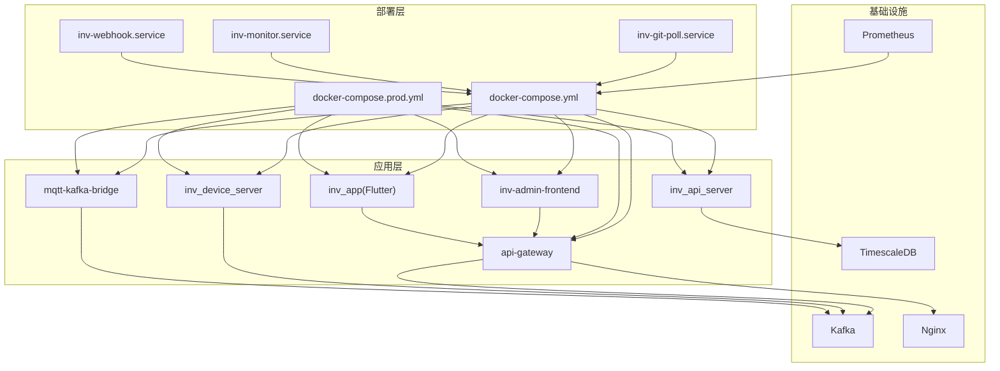
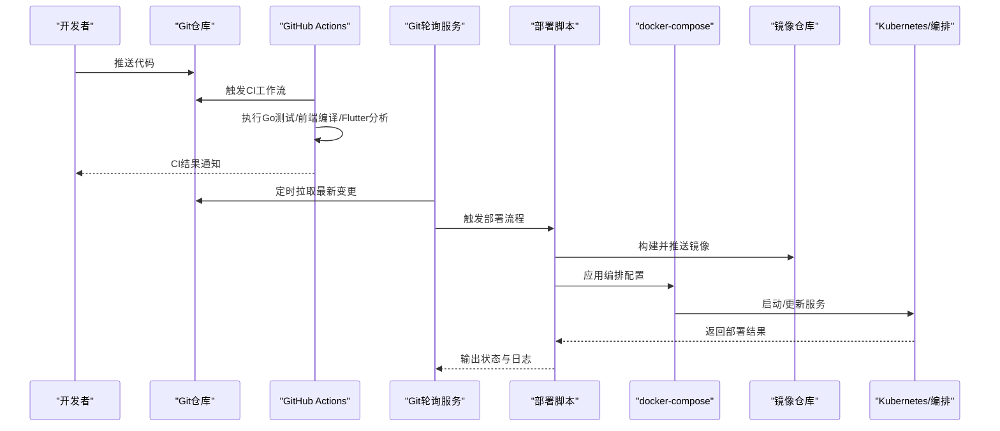
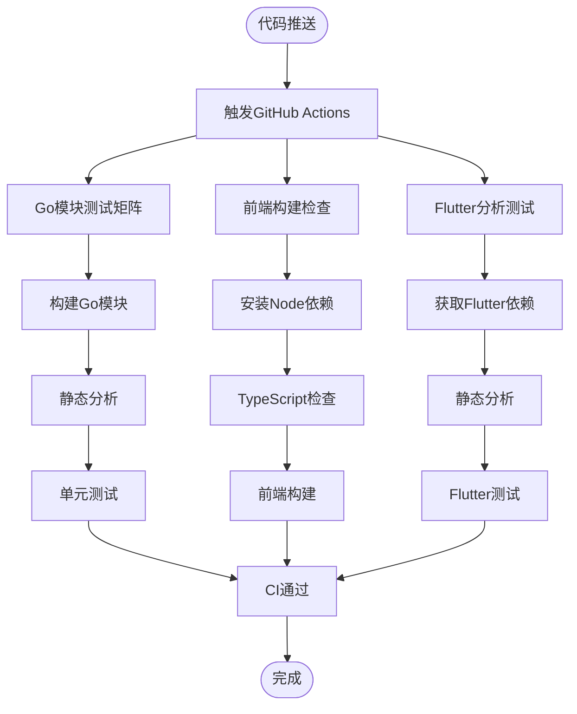
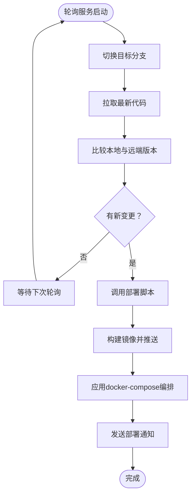
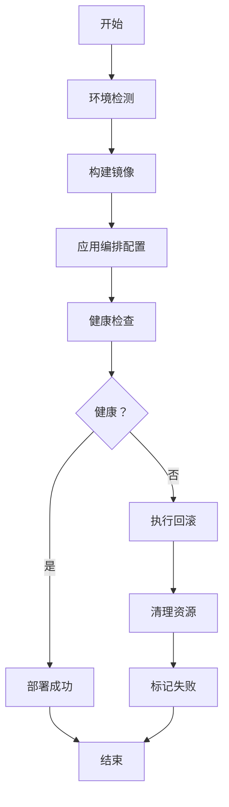
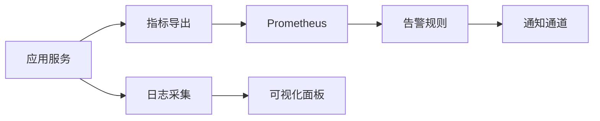
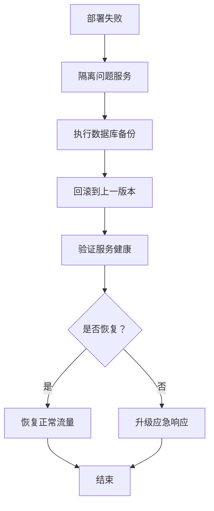
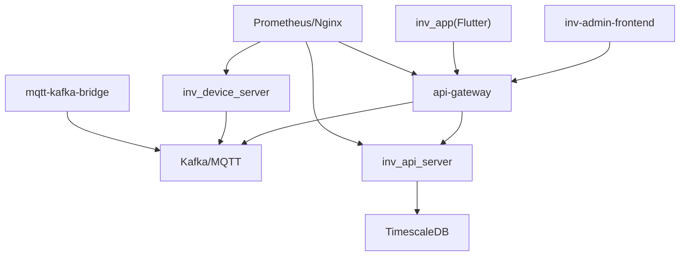

# CI/CD流水线

<cite>
**本文档引用的文件**
- [.github/workflows/ci.yml](file://.github/workflows/ci.yml)
- [deploy/README.md](file://deploy/README.md)
- [deploy/git-poll-deploy.sh](file://deploy/git-poll-deploy.sh)
- [deploy/deploy.sh](file://deploy/deploy.sh)
- [deploy/deploy-prod.sh](file://deploy/deploy-prod.sh)
- [deploy/docker-compose.yml](file://deploy/docker-compose.yml)
- [deploy/docker-compose.prod.yml](file://deploy/docker-compose.prod.yml)
- [deploy/inv-git-poll.service](file://deploy/inv-git-poll.service)
- [deploy/inv-monitor.service](file://deploy/inv-monitor.service)
- [deploy/inv-webhook.service](file://deploy/inv-webhook.service)
- [deploy/scripts/backup.sh](file://deploy/scripts/backup.sh)
- [deploy/scripts/db_maintenance.sh](file://deploy/scripts/db_maintenance.sh)
- [deploy/monitor.sh](file://deploy/monitor.sh)
- [deploy/webhook_server.py](file://deploy/webhook_server.py)
- [deploy/prometheus.yml](file://deploy/prometheus.yml)
- [deploy/prometheus_alerts.yml](file://deploy/prometheus_alerts.yml)
- [deploy/nginx.conf](file://deploy/nginx.conf)
- [api-gateway/main.go](file://api-gateway/main.go)
- [api-gateway/Dockerfile](file://api-gateway/Dockerfile)
- [inv_api_server/cmd/main.go](file://inv_api_server/cmd/main.go)
- [inv_api_server/Dockerfile](file://inv_api_server/Dockerfile)
- [inv_device_server/cmd/main.go](file://inv_device_server/cmd/main.go)
- [inv_device_server/Dockerfile](file://inv_device_server/Dockerfile)
- [inv-admin-frontend/Dockerfile](file://inv-admin-frontend/Dockerfile)
- [inv-admin-frontend/package.json](file://inv-admin-frontend/package.json)
- [inv-admin-frontend/tsconfig.json](file://inv-admin-frontend/tsconfig.json)
- [inv-admin-frontend/vite.config.ts](file://inv-admin-frontend/vite.config.ts)
- [inv_app/pubspec.yaml](file://inv_app/pubspec.yaml)
- [inv_app/analysis_options.yaml](file://inv_app/analysis_options.yaml)
- [mqtt-kafka-bridge/Dockerfile](file://mqtt-kafka-bridge/Dockerfile)
- [database/migrations/001_init_schema.up.sql](file://database/migrations/001_init_schema.up.sql)
- [database/migrations/002_add_performance_indexes.up.sql](file://database/migrations/002_add_performance_indexes.up.sql)
- [database/migrations/003_timescaledb_compression.up.sql](file://database/migrations/003_timescaledb_compression.up.sql)
- [database/migrations/004_add_energy_columns.up.sql](file://database/migrations/004_add_energy_columns.up.sql)
- [database/migrations/005_device_day_data_jsonb.up.sql](file://database/migrations/005_device_day_data_jsonb.up.sql)
- [Makefile](file://Makefile)
</cite>

## 更新摘要
**所做更改**
- 新增GitHub Actions CI工作流配置章节
- 更新持续集成配置，包含Go模块测试、前端编译和Flutter分析
- 新增Flutter应用分析和测试流程
- 更新前端TypeScript类型检查配置
- 新增Makefile中的CI相关命令

## 目录
1. [简介](#简介)
2. [项目结构](#项目结构)
3. [核心组件](#核心组件)
4. [架构总览](#架构总览)
5. [详细组件分析](#详细组件分析)
6. [依赖关系分析](#依赖关系分析)
7. [性能考虑](#性能考虑)
8. [故障排查指南](#故障排查指南)
9. [结论](#结论)
10. [附录](#附录)

## 简介
本文件面向CI/CD流水线的实施与运维，围绕自动化构建、测试与部署展开，重点覆盖以下方面：
- Git轮询部署脚本的工作原理与配置方法
- 自动化部署脚本的执行流程（环境检测、构建打包、部署与回滚）
- 持续集成配置（代码检查、单元测试、集成测试）
- 持续部署策略（蓝绿部署、金丝雀发布、滚动更新）的实现思路
- 部署触发条件与分支策略配置
- 部署状态监控与通知机制
- 失败回滚策略与应急处理流程
- Jenkins、GitHub Actions等工具的集成示例

**更新** 新增GitHub Actions CI/CD流水线配置，支持Go模块测试、前端编译和Flutter分析

## 项目结构
该仓库采用多模块微服务架构，包含网关、API服务、设备数据服务、前端管理界面、Flutter移动应用、消息桥接、数据库迁移与部署脚本等。CI/CD相关能力主要集中在deploy目录中，配合各子项目的Dockerfile与docker-compose编排文件。

**图表来源**
- [deploy/docker-compose.yml](file://deploy/docker-compose.yml)
- [deploy/docker-compose.prod.yml](file://deploy/docker-compose.prod.yml)
- [deploy/inv-git-poll.service](file://deploy/inv-git-poll.service)
- [deploy/inv-monitor.service](file://deploy/inv-monitor.service)
- [deploy/inv-webhook.service](file://deploy/inv-webhook.service)

**章节来源**
- [deploy/README.md](file://deploy/README.md)
- [deploy/docker-compose.yml](file://deploy/docker-compose.yml)
- [deploy/docker-compose.prod.yml](file://deploy/docker-compose.prod.yml)

## 核心组件
- Git轮询部署服务：通过systemd服务定时拉取代码并触发部署脚本，实现自动化的变更检测与部署。
- 部署脚本：提供通用部署与生产部署脚本，负责环境检测、镜像构建、容器编排与回滚。
- docker-compose编排：定义服务拓扑、网络、卷与环境变量，支持开发与生产环境差异化配置。
- 监控与告警：Prometheus指标采集与告警规则，结合Nginx与应用日志进行健康度评估。
- 回滚与维护：备份脚本与数据库维护脚本，保障部署失败时的快速恢复与数据一致性。
- **新增** GitHub Actions CI工作流：自动化执行Go模块测试、前端编译和Flutter分析。

**章节来源**
- [deploy/git-poll-deploy.sh](file://deploy/git-poll-deploy.sh)
- [deploy/deploy.sh](file://deploy/deploy.sh)
- [deploy/deploy-prod.sh](file://deploy/deploy-prod.sh)
- [deploy/docker-compose.yml](file://deploy/docker-compose.yml)
- [deploy/prometheus.yml](file://deploy/prometheus.yml)
- [deploy/prometheus_alerts.yml](file://deploy/prometheus_alerts.yml)
- [deploy/scripts/backup.sh](file://deploy/scripts/backup.sh)
- [deploy/scripts/db_maintenance.sh](file://deploy/scripts/db_maintenance.sh)
- [.github/workflows/ci.yml](file://.github/workflows/ci.yml)

## 架构总览
下图展示了从代码变更到服务上线的完整流水线，涵盖触发、构建、测试、部署与监控环节。

**图表来源**
- [.github/workflows/ci.yml](file://.github/workflows/ci.yml)
- [deploy/git-poll-deploy.sh](file://deploy/git-poll-deploy.sh)
- [deploy/deploy.sh](file://deploy/deploy.sh)
- [deploy/docker-compose.yml](file://deploy/docker-compose.yml)

## 详细组件分析

### GitHub Actions CI工作流
- **工作流概述**：完整的CI流水线，包含三个主要作业：Go构建测试、前端构建和Flutter分析测试。
- **触发条件**：支持push到main和develop分支，以及pull_request到main分支。
- **Go模块测试作业(go-check)**：
  - 并行矩阵测试四个Go模块：inv_api_server、inv_device_server、api-gateway、mqtt-kafka-bridge
  - 使用Go 1.25版本，执行构建、go vet静态分析和单元测试
  - 支持竞态条件检测和测试计数控制
- **前端构建作业(frontend-check)**：
  - Node.js 20环境，使用npm ci安装依赖
  - 执行TypeScript类型检查和构建
  - 缓存package-lock.json以提高性能
- **Flutter分析作业(flutter-check)**：
  - Flutter 3.27稳定版环境
  - 执行flutter pub get、analyze和test命令
  - 支持跨平台Flutter应用的静态分析和测试

**图表来源**
- [.github/workflows/ci.yml](file://.github/workflows/ci.yml)

**章节来源**
- [.github/workflows/ci.yml](file://.github/workflows/ci.yml)

### Git轮询部署系统
- 工作原理：systemd服务定时执行轮询脚本，检测远程仓库HEAD变化；若发现新提交则拉取代码并调用部署脚本。
- 关键配置：
  - 轮询服务单元文件：定义执行周期、用户权限与工作目录。
  - 轮询脚本：负责切换分支、拉取、比较版本号、触发部署。
  - 部署脚本：根据环境参数执行构建、编排与回滚逻辑。
- 建议优化：
  - 引入Webhook替代轮询以降低资源消耗。
  - 在脚本中增加幂等性与并发控制，避免重复部署。

**图表来源**
- [deploy/inv-git-poll.service](file://deploy/inv-git-poll.service)
- [deploy/git-poll-deploy.sh](file://deploy/git-poll-deploy.sh)
- [deploy/deploy.sh](file://deploy/deploy.sh)

**章节来源**
- [deploy/inv-git-poll.service](file://deploy/inv-git-poll.service)
- [deploy/git-poll-deploy.sh](file://deploy/git-poll-deploy.sh)

### 自动化部署脚本执行流程
- 环境检测：确认Docker可用、compose版本兼容、必要环境变量存在。
- 构建打包：基于各子项目Dockerfile构建镜像，按需缓存优化。
- 部署回滚：记录当前版本与配置，失败时回退至上一版本或清理资源。
- 生产部署：加载生产compose文件，确保只在受控环境下执行。

**图表来源**
- [deploy/deploy.sh](file://deploy/deploy.sh)
- [deploy/deploy-prod.sh](file://deploy/deploy-prod.sh)
- [deploy/docker-compose.yml](file://deploy/docker-compose.yml)

**章节来源**
- [deploy/deploy.sh](file://deploy/deploy.sh)
- [deploy/deploy-prod.sh](file://deploy/deploy-prod.sh)

### 持续集成配置
- **Go模块测试**：使用Go 1.25版本，针对四个核心模块执行构建、静态分析和单元测试，支持竞态条件检测。
- **前端类型检查**：使用TypeScript 5.7.3，执行noEmit模式的类型检查，确保类型安全。
- **Flutter静态分析**：使用Flutter 3.27稳定版，执行静态分析和单元测试，确保代码质量。
- **测试报告与覆盖率**：输出测试报告并在CI平台展示，作为质量门禁依据。

**章节来源**
- [.github/workflows/ci.yml](file://.github/workflows/ci.yml)
- [inv_device_server/internal/service/protocol_parser_test.go](file://inv_device_server/internal/service/protocol_parser_test.go)
- [inv_api_server/internal/handler/internal_handler_test.go](file://inv_api_server/internal/handler/internal_handler_test.go)
- [inv-admin-frontend/tsconfig.json](file://inv-admin-frontend/tsconfig.json)
- [inv_app/analysis_options.yaml](file://inv_app/analysis_options.yaml)

### 持续部署策略
- 蓝绿部署：准备两套完全相同的环境，通过流量切换实现零停机发布。
- 金丝雀发布：逐步将部分流量导入新版本，观察指标后再扩大范围。
- 滚动更新：逐批替换实例，保持整体可用性与一致性。
- 实施要点：版本标签管理、健康探针、灰度路由与回滚预案。

**章节来源**
- [deploy/docker-compose.yml](file://deploy/docker-compose.yml)
- [deploy/docker-compose.prod.yml](file://deploy/docker-compose.prod.yml)

### 部署触发条件与分支策略
- 触发条件：分支保护策略要求PR合并前必须通过CI检查；生产环境仅允许主分支或特定release分支合并。
- 分支策略：采用Git Flow或GitHub Flow，hotfix与release分支直连生产部署。
- 权限控制：仅授权人员可直接推送至受保护分支。

**章节来源**
- [deploy/README.md](file://deploy/README.md)

### 部署状态监控与通知
- 监控：Prometheus抓取应用与系统指标，结合告警规则实现异常预警。
- 通知：通过Webhook或邮件/SMS服务向团队发送告警信息。
- 日志：集中化日志收集，便于问题定位与审计。

**图表来源**
- [deploy/prometheus.yml](file://deploy/prometheus.yml)
- [deploy/prometheus_alerts.yml](file://deploy/prometheus_alerts.yml)
- [deploy/webhook_server.py](file://deploy/webhook_server.py)

**章节来源**
- [deploy/monitor.sh](file://deploy/monitor.sh)
- [deploy/webhook_server.py](file://deploy/webhook_server.py)
- [deploy/prometheus.yml](file://deploy/prometheus.yml)
- [deploy/prometheus_alerts.yml](file://deploy/prometheus_alerts.yml)

### 部署失败的回滚策略与应急处理
- 回滚策略：记录当前版本、配置与镜像标签；失败时回退至上一版本并清理异常资源。
- 应急处理：隔离问题服务、降级非关键功能、启用备用节点或临时修复。
- 数据备份：定期执行数据库备份脚本，确保可恢复到最近一致点。

**图表来源**
- [deploy/scripts/backup.sh](file://deploy/scripts/backup.sh)
- [deploy/scripts/db_maintenance.sh](file://deploy/scripts/db_maintenance.sh)
- [deploy/deploy.sh](file://deploy/deploy.sh)

**章节来源**
- [deploy/scripts/backup.sh](file://deploy/scripts/backup.sh)
- [deploy/scripts/db_maintenance.sh](file://deploy/scripts/db_maintenance.sh)

### CI/CD工具集成示例
- **GitHub Actions**：完整的CI工作流配置，支持Go模块测试、前端编译和Flutter分析，使用矩阵策略并行执行多个任务。
- Jenkins：配置Git轮询或Webhook触发Job，执行构建、测试与部署脚本；使用Blue Ocean可视化流水线。
- GitLab CI：利用.gitlab-ci.yml定义 stages: lint/test/build/deploy，共享缓存与制品库。

**章节来源**
- [.github/workflows/ci.yml](file://.github/workflows/ci.yml)
- [deploy/git-poll-deploy.sh](file://deploy/git-poll-deploy.sh)
- [deploy/deploy.sh](file://deploy/deploy.sh)

## 依赖关系分析
- 组件耦合：网关作为统一入口，依赖MQ与Kafka桥接；API服务依赖TimescaleDB；设备服务消费MQ并写入数据库。
- 外部依赖：Docker、docker-compose、Prometheus、Nginx、Kafka、TimescaleDB。
- 版本管理：镜像标签与compose配置需保持一致，避免运行时冲突。

**图表来源**
- [deploy/docker-compose.yml](file://deploy/docker-compose.yml)
- [api-gateway/main.go](file://api-gateway/main.go)
- [inv_api_server/cmd/main.go](file://inv_api_server/cmd/main.go)
- [inv_device_server/cmd/main.go](file://inv_device_server/cmd/main.go)

**章节来源**
- [deploy/docker-compose.yml](file://deploy/docker-compose.yml)

## 性能考虑
- 构建优化：复用Docker缓存、分层构建、并行构建不同服务镜像。
- 运行时优化：合理设置副本数与资源限制，启用水平扩展与负载均衡。
- 监控指标：CPU、内存、请求延迟、错误率、数据库连接数与队列长度。
- 数据库迁移：在低峰期执行，使用事务与索引重建计划，避免阻塞。

**章节来源**
- [database/migrations/001_init_schema.up.sql](file://database/migrations/001_init_schema.up.sql)
- [database/migrations/002_add_performance_indexes.up.sql](file://database/migrations/002_add_performance_indexes.up.sql)
- [database/migrations/003_timescaledb_compression.up.sql](file://database/migrations/003_timescaledb_compression.up.sql)
- [database/migrations/004_add_energy_columns.up.sql](file://database/migrations/004_add_energy_columns.up.sql)
- [database/migrations/005_device_day_data_jsonb.up.sql](file://database/migrations/005_device_day_data_jsonb.up.sql)

## 故障排查指南
- 部署失败：检查部署脚本日志、compose配置与镜像标签；确认数据库迁移是否成功。
- 服务不可达：验证Nginx配置、网关路由与健康探针；查看Prometheus告警。
- 数据库异常：执行维护脚本、检查压缩策略与索引；必要时回滚到备份。
- 回滚操作：使用备份脚本恢复数据库，重启对应服务容器。
- **新增** CI工作流失败：检查GitHub Actions日志，确认Go版本、Node版本和Flutter版本兼容性。

**章节来源**
- [deploy/monitor.sh](file://deploy/monitor.sh)
- [deploy/scripts/backup.sh](file://deploy/scripts/backup.sh)
- [deploy/scripts/db_maintenance.sh](file://deploy/scripts/db_maintenance.sh)
- [.github/workflows/ci.yml](file://.github/workflows/ci.yml)

## 结论
本项目已具备完善的部署脚本与编排基础，并新增了完整的GitHub Actions CI/CD流水线。通过Go模块测试、前端编译和Flutter分析的自动化执行，显著提升了代码质量和交付效率。建议在此基础上继续优化构建性能，完善测试覆盖率，并考虑引入更高级的部署策略如蓝绿部署和金丝雀发布。

## 附录
- Nginx配置：用于反向代理与静态资源服务。
- Prometheus配置：采集应用与系统指标，定义告警规则。
- 数据库迁移：按版本顺序执行SQL脚本，确保Schema一致性。
- **新增** Flutter应用配置：包含依赖管理和分析选项配置。
- **新增** 前端TypeScript配置：确保类型安全和代码质量。

**章节来源**
- [deploy/nginx.conf](file://deploy/nginx.conf)
- [deploy/prometheus.yml](file://deploy/prometheus.yml)
- [deploy/prometheus_alerts.yml](file://deploy/prometheus_alerts.yml)
- [database/migrations/001_init_schema.up.sql](file://database/migrations/001_init_schema.up.sql)
- [database/migrations/002_add_performance_indexes.up.sql](file://database/migrations/002_add_performance_indexes.up.sql)
- [database/migrations/003_timescaledb_compression.up.sql](file://database/migrations/003_timescaledb_compression.up.sql)
- [database/migrations/004_add_energy_columns.up.sql](file://database/migrations/004_add_energy_columns.up.sql)
- [database/migrations/005_device_day_data_jsonb.up.sql](file://database/migrations/005_device_day_data_jsonb.up.sql)
- [inv_app/pubspec.yaml](file://inv_app/pubspec.yaml)
- [inv_app/analysis_options.yaml](file://inv_app/analysis_options.yaml)
- [inv-admin-frontend/package.json](file://inv-admin-frontend/package.json)
- [inv-admin-frontend/tsconfig.json](file://inv-admin-frontend/tsconfig.json)