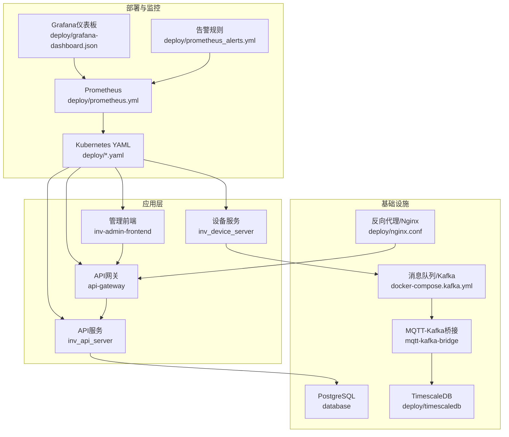
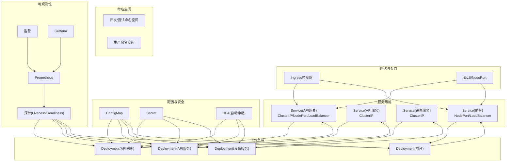
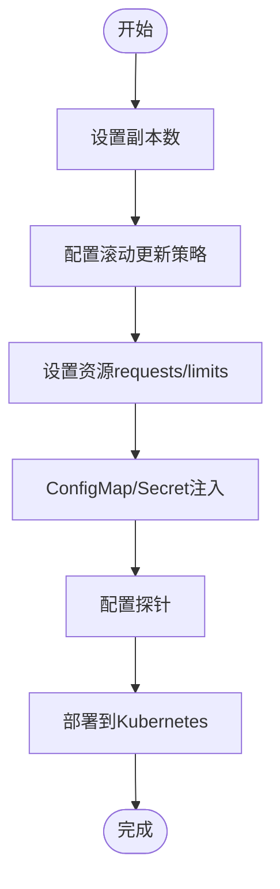
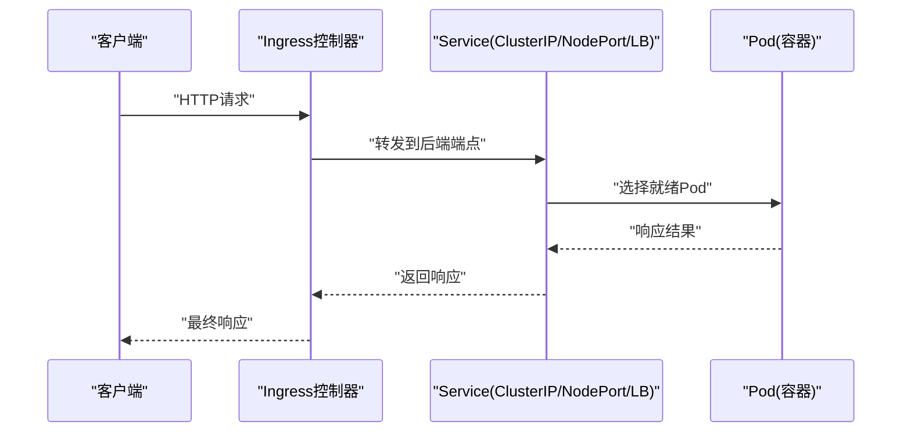
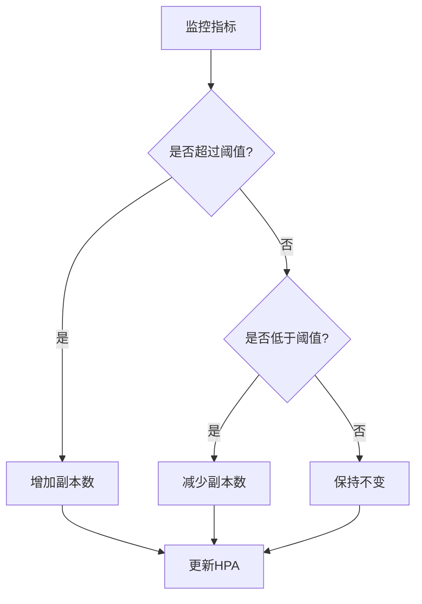
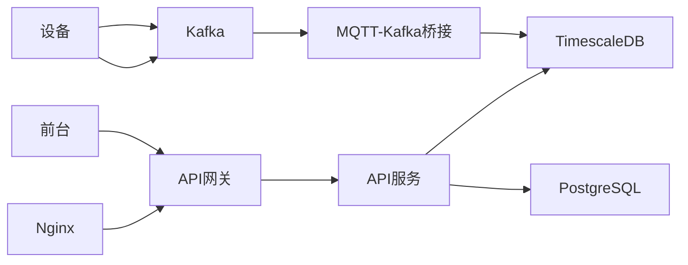

# Kubernetes部署

<cite>
**本文引用的文件**
- [deploy/README.md](file://deploy/README.md)
- [deploy/k8s-device-server.yaml](file://deploy/k8s-device-server.yaml)
- [deploy/configs/api-server.yaml](file://deploy/configs/api-server.yaml)
- [deploy/configs/device-server.yaml](file://deploy/configs/device-server.yaml)
- [deploy/configs/gateway.yaml](file://deploy/configs/gateway.yaml)
- [inv_api_server/config.docker.yaml](file://inv_api_server/config.docker.yaml)
- [inv_device_server/config.docker.yaml](file://inv_device_server/config.docker.yaml)
- [api-gateway/config.docker.yaml](file://api-gateway/config.docker.yaml)
- [deploy/deploy.sh](file://deploy/deploy.sh)
- [deploy/deploy-prod.sh](file://deploy/deploy-prod.sh)
- [deploy/git-poll-deploy.sh](file://deploy/git-poll-deploy.sh)
- [deploy/docker-compose.yml](file://deploy/docker-compose.yml)
- [deploy/docker-compose.full.yml](file://deploy/docker-compose.full.yml)
- [deploy/docker-compose.kafka.yml](file://deploy/docker-compose.kafka.yml)
- [deploy/docker-compose.kafka-bridge.yml](file://deploy/docker-compose.kafka-bridge.yml)
- [deploy/docker-compose.prod.yml](file://deploy/docker-compose.prod.yml)
- [deploy/nginx.conf](file://deploy/nginx.conf)
- [deploy/prometheus.yml](file://deploy/prometheus.yml)
- [deploy/prometheus_alerts.yml](file://deploy/prometheus_alerts.yml)
- [deploy/grafana-dashboard.json](file://deploy/grafana-dashboard.json)
- [deploy/create_admin.sql](file://deploy/create_admin.sql)
- [deploy/create_device_models.sql](file://deploy/create_device_models.sql)
- [deploy/create_model_tables.sql](file://deploy/create_model_tables.sql)
- [deploy/migration_timescaledb.sql](file://deploy/migration_timescaledb.sql)
- [database/schema.sql](file://database/schema.sql)
- [database/migrations/001_init_schema.up.sql](file://database/migrations/001_init_schema.up.sql)
- [database/migrations/002_add_performance_indexes.up.sql](file://database/migrations/002_add_performance_indexes.up.sql)
- [database/migrations/003_timescaledb_compression.up.sql](file://database/migrations/003_timescaledb_compression.up.sql)
- [database/migrations/004_add_energy_columns.up.sql](file://database/migrations/004_add_energy_columns.up.sql)
- [database/migrations/005_device_day_data_jsonb.up.sql](file://database/migrations/005_device_day_data_jsonb.up.sql)
- [database/数据库说明文档.html](file://database/数据库说明文档.html)
- [inv_api_server/Dockerfile](file://inv_api_server/Dockerfile)
- [inv_device_server/Dockerfile](file://inv_device_server/Dockerfile)
- [api-gateway/Dockerfile](file://api-gateway/Dockerfile)
- [inv-admin-frontend/Dockerfile](file://inv-admin-frontend/Dockerfile)
- [deploy/timescaledb/Dockerfile](file://deploy/timescaledb/Dockerfile)
</cite>

## 目录
1. [简介](#简介)
2. [项目结构](#项目结构)
3. [核心组件](#核心组件)
4. [架构总览](#架构总览)
5. [详细组件分析](#详细组件分析)
6. [依赖关系分析](#依赖关系分析)
7. [性能考虑](#性能考虑)
8. [故障排查指南](#故障排查指南)
9. [结论](#结论)
10. [附录](#附录)

## 简介
本技术文档面向在Kubernetes上部署与运维本项目的工程团队，系统性阐述基于Kubernetes的容器编排部署方案。内容涵盖Deployment资源配置（副本数、滚动更新策略、资源限制）、Service配置（ClusterIP、NodePort、LoadBalancer）、ConfigMap与Secret的配置管理、HPA（水平Pod自动伸缩）策略、Ingress控制器配置与外部访问策略、Pod健康检查（探针）、命名空间管理、资源配额与网络策略，以及kubectl常用命令与故障排查方法。

## 项目结构
该项目采用多模块微服务架构，包含API网关、设备数据采集服务、前端管理界面、数据库与时序数据库等组件。部署层提供了Docker Compose与Kubernetes两种部署方式，便于本地开发与生产集群部署。

**图表来源**
- [deploy/docker-compose.full.yml](file://deploy/docker-compose.full.yml)
- [deploy/docker-compose.kafka.yml](file://deploy/docker-compose.kafka.yml)
- [deploy/docker-compose.kafka-bridge.yml](file://deploy/docker-compose.kafka-bridge.yml)
- [deploy/docker-compose.prod.yml](file://deploy/docker-compose.prod.yml)
- [deploy/nginx.conf](file://deploy/nginx.conf)
- [deploy/prometheus.yml](file://deploy/prometheus.yml)
- [deploy/prometheus_alerts.yml](file://deploy/prometheus_alerts.yml)
- [deploy/grafana-dashboard.json](file://deploy/grafana-dashboard.json)

**章节来源**
- [deploy/README.md](file://deploy/README.md)
- [deploy/docker-compose.full.yml](file://deploy/docker-compose.full.yml)
- [deploy/docker-compose.kafka.yml](file://deploy/docker-compose.kafka.yml)
- [deploy/docker-compose.kafka-bridge.yml](file://deploy/docker-compose.kafka-bridge.yml)
- [deploy/docker-compose.prod.yml](file://deploy/docker-compose.prod.yml)

## 核心组件
- API网关：负责统一入口、鉴权、限流、日志与指标收集，支持跨域与路由转发。
- API服务：业务逻辑核心，提供设备、告警、用户、模型等REST接口。
- 设备服务：处理设备上报数据，解析协议并通过Kafka传递给下游。
- 前台管理界面：基于前端框架构建的可视化管理平台。
- 数据库与时序数据库：PostgreSQL存储结构化数据，TimescaleDB用于时间序列压缩与查询优化。
- 消息中间件：Kafka承载高吞吐设备数据流；MQTT-Kafka桥接实现MQTT到Kafka的数据转换。
- 反向代理：Nginx作为边缘代理，提供静态资源、SSL终止与上游转发。
- 监控体系：Prometheus抓取指标，Grafana展示仪表板，告警规则通过Alertmanager推送。

**章节来源**
- [api-gateway/main.go](file://api-gateway/main.go)
- [inv_api_server/cmd/main.go](file://inv_api_server/cmd/main.go)
- [inv_device_server/cmd/main.go](file://inv_device_server/cmd/main.go)
- [inv-admin-frontend/src/App.tsx](file://inv-admin-frontend/src/App.tsx)
- [database/schema.sql](file://database/schema.sql)
- [deploy/timescaledb/Dockerfile](file://deploy/timescaledb/Dockerfile)
- [deploy/nginx.conf](file://deploy/nginx.conf)
- [deploy/prometheus.yml](file://deploy/prometheus.yml)
- [deploy/prometheus_alerts.yml](file://deploy/prometheus_alerts.yml)
- [deploy/grafana-dashboard.json](file://deploy/grafana-dashboard.json)

## 架构总览
下图展示了Kubernetes部署下的整体架构，包括命名空间划分、服务暴露方式、探针配置与监控集成。

**图表来源**
- [deploy/k8s-device-server.yaml](file://deploy/k8s-device-server.yaml)
- [deploy/configs/api-server.yaml](file://deploy/configs/api-server.yaml)
- [deploy/configs/device-server.yaml](file://deploy/configs/device-server.yaml)
- [deploy/configs/gateway.yaml](file://deploy/configs/gateway.yaml)

## 详细组件分析

### Deployment资源配置
- 副本数：根据流量峰值与SLA设定初始副本数，建议开发环境1-2副本，生产环境至少3副本以满足高可用。
- 滚动更新策略：采用分段发布，设置最大不可用与最大额外副本，确保发布期间服务不中断。
- 资源限制：为CPU与内存设置requests/limits，避免节点资源争抢；对数据库类服务适当提高内存上限。
- 配置注入：通过ConfigMap挂载配置文件，通过Secret注入密钥与证书；避免硬编码在镜像或YAML中。
- 探针：配置存活探针与就绪探针，确保Pod健康状态与流量接入时机正确。

**图表来源**
- [deploy/k8s-device-server.yaml](file://deploy/k8s-device-server.yaml)
- [deploy/configs/api-server.yaml](file://deploy/configs/api-server.yaml)
- [deploy/configs/device-server.yaml](file://deploy/configs/device-server.yaml)
- [deploy/configs/gateway.yaml](file://deploy/configs/gateway.yaml)

**章节来源**
- [deploy/k8s-device-server.yaml](file://deploy/k8s-device-server.yaml)
- [deploy/configs/api-server.yaml](file://deploy/configs/api-server.yaml)
- [deploy/configs/device-server.yaml](file://deploy/configs/device-server.yaml)
- [deploy/configs/gateway.yaml](file://deploy/configs/gateway.yaml)

### Service配置
- ClusterIP：默认集群内部访问，适用于同命名空间内的服务间调用。
- NodePort：在所有节点开放固定端口，便于开发测试与快速验证。
- LoadBalancer：对接云厂商LB，适合对外提供HTTP/HTTPS服务。
- 端口映射：明确containerPort与servicePort，避免冲突；为API网关与前台管理界面分别配置独立Service。

**图表来源**
- [deploy/configs/gateway.yaml](file://deploy/configs/gateway.yaml)
- [deploy/configs/api-server.yaml](file://deploy/configs/api-server.yaml)
- [deploy/configs/device-server.yaml](file://deploy/configs/device-server.yaml)

**章节来源**
- [deploy/configs/gateway.yaml](file://deploy/configs/gateway.yaml)
- [deploy/configs/api-server.yaml](file://deploy/configs/api-server.yaml)
- [deploy/configs/device-server.yaml](file://deploy/configs/device-server.yaml)

### ConfigMap与Secret配置管理
- ConfigMap：存放非敏感配置（如日志级别、功能开关、数据库连接字符串模板），通过volume或env注入。
- Secret：存放敏感信息（如数据库密码、JWT密钥、TLS证书），通过env或secret volume注入。
- 环境变量注入：在Deployment中使用envFrom引用ConfigMap/Secret，减少重复定义。
- 安全最佳实践：最小权限原则、定期轮换密钥、禁用明文传输、启用RBAC与网络策略。

**章节来源**
- [deploy/configs/api-server.yaml](file://deploy/configs/api-server.yaml)
- [deploy/configs/device-server.yaml](file://deploy/configs/device-server.yaml)
- [deploy/configs/gateway.yaml](file://deploy/configs/gateway.yaml)

### HPA（水平Pod自动伸缩）
- 触发条件：基于CPU使用率或自定义指标（QPS、延迟、队列长度等）。
- 目标值：合理设置目标平均利用率，避免过度伸缩导致抖动。
- 范围：设置最小/最大副本数，结合资源限制防止资源耗尽。
- 实施步骤：先部署Deployment与Metrics Server，再创建HPA对象，观察扩缩容行为并调整参数。

**图表来源**
- [deploy/configs/api-server.yaml](file://deploy/configs/api-server.yaml)
- [deploy/configs/device-server.yaml](file://deploy/configs/device-server.yaml)
- [deploy/configs/gateway.yaml](file://deploy/configs/gateway.yaml)

**章节来源**
- [deploy/configs/api-server.yaml](file://deploy/configs/api-server.yaml)
- [deploy/configs/device-server.yaml](file://deploy/configs/device-server.yaml)
- [deploy/configs/gateway.yaml](file://deploy/configs/gateway.yaml)

### Ingress控制器与外部访问
- Ingress控制器：选择Nginx、Traefik或云厂商Ingress（如ALB），统一管理域名与路径转发。
- TLS终止：在Ingress中配置TLS证书，实现HTTPS访问。
- 路由规则：为API网关与前台管理界面配置不同路径前缀，避免冲突。
- 负载均衡：结合Service的负载均衡模式与会话亲和性需求进行配置。

**章节来源**
- [deploy/nginx.conf](file://deploy/nginx.conf)
- [deploy/configs/gateway.yaml](file://deploy/configs/gateway.yaml)

### Pod健康检查（探针）
- 存活探针（Liveness）：检测容器是否卡死，失败时触发重启。
- 就绪探针（Readiness）：检测容器是否可接受流量，未就绪时不加入Service端点。
- 探针类型：HTTP GET、TCP Socket、Exec命令，按服务特性选择。
- 参数：初始延迟、探测间隔、超时时间、失败阈值、成功阈值，需结合启动时间与业务复杂度调优。

**章节来源**
- [deploy/k8s-device-server.yaml](file://deploy/k8s-device-server.yaml)
- [deploy/configs/api-server.yaml](file://deploy/configs/api-server.yaml)
- [deploy/configs/device-server.yaml](file://deploy/configs/device-server.yaml)
- [deploy/configs/gateway.yaml](file://deploy/configs/gateway.yaml)

### 命名空间管理、资源配额与网络策略
- 命名空间：按环境（开发/测试/生产）与团队划分命名空间，隔离资源与权限。
- 资源配额：为命名空间设置ResourceQuota与LimitRange，控制CPU/内存总量与单Pod资源上限。
- 网络策略：限制Pod间通信，仅放行必要端口，降低攻击面；对外出站策略按需放开。

**章节来源**
- [deploy/k8s-device-server.yaml](file://deploy/k8s-device-server.yaml)
- [deploy/configs/api-server.yaml](file://deploy/configs/api-server.yaml)
- [deploy/configs/device-server.yaml](file://deploy/configs/device-server.yaml)
- [deploy/configs/gateway.yaml](file://deploy/configs/gateway.yaml)

## 依赖关系分析
- 组件耦合：API网关依赖API服务；设备服务依赖Kafka与MQTT-Kafka桥接；前台依赖API网关。
- 数据流：设备上报经MQTT进入Kafka，桥接服务消费Kafka写入TimescaleDB；API服务从PostgreSQL/TimescaleDB提供数据。
- 外部依赖：云LB、DNS、证书管理、Prometheus/Grafana/Alerter。

**图表来源**
- [deploy/docker-compose.kafka.yml](file://deploy/docker-compose.kafka.yml)
- [deploy/docker-compose.kafka-bridge.yml](file://deploy/docker-compose.kafka-bridge.yml)
- [deploy/docker-compose.full.yml](file://deploy/docker-compose.full.yml)
- [deploy/nginx.conf](file://deploy/nginx.conf)

**章节来源**
- [deploy/docker-compose.full.yml](file://deploy/docker-compose.full.yml)
- [deploy/docker-compose.kafka.yml](file://deploy/docker-compose.kafka.yml)
- [deploy/docker-compose.kafka-bridge.yml](file://deploy/docker-compose.kafka-bridge.yml)

## 性能考虑
- 资源规划：根据峰值QPS与响应时间估算CPU/内存requests/limits，预留20%-30%缓冲。
- 连接池：数据库连接池大小与超时设置需与副本数匹配，避免连接泄漏。
- 缓存：Redis缓存热点数据，减轻数据库压力。
- 指标监控：启用Prometheus抓取关键指标，建立告警阈值，定期复盘性能瓶颈。
- 存储：TimescaleDB开启压缩与分区，优化查询性能与存储成本。

## 故障排查指南
- 常见问题定位：
  - Pod反复重启：查看存活/就绪探针失败原因与日志。
  - 服务无法访问：检查Service端点、Ingress规则、防火墙与网络策略。
  - 数据异常：核对Kafka消费位点、桥接服务状态与数据库迁移脚本执行情况。
- 命令行工具：
  - kubectl get/pod/dep/svc/hpa/ingress -n <namespace> 查看资源状态
  - kubectl describe pod <pod-name> -n <namespace> 查看事件与状态
  - kubectl logs -f <pod-name> -n <namespace> 实时查看日志
  - kubectl top pod -n <namespace> 查看资源使用
  - kubectl exec -it <pod-name> -n <namespace> -- sh 进入容器调试
- 自动化部署脚本：
  - 开发环境一键部署：./deploy.sh
  - 生产环境部署：./deploy-prod.sh
  - Git轮询部署：./git-poll-deploy.sh

**章节来源**
- [deploy/deploy.sh](file://deploy/deploy.sh)
- [deploy/deploy-prod.sh](file://deploy/deploy-prod.sh)
- [deploy/git-poll-deploy.sh](file://deploy/git-poll-deploy.sh)

## 结论
本方案通过清晰的命名空间划分、完善的Service与Ingress配置、严格的ConfigMap/Secret管理、HPA自动伸缩与探针机制，实现了高可用、可观测、易扩展的Kubernetes部署。配合Prometheus/Grafana/Alerter监控体系与自动化部署脚本，能够有效支撑从开发到生产的全生命周期运维。

## 附录
- 数据库初始化与迁移：
  - 初始化脚本：create_admin.sql、create_device_models.sql、create_model_tables.sql
  - TimescaleDB迁移：migration_timescaledb.sql
  - SQL模式：schema.sql及各版本迁移脚本
- 监控与告警：
  - Prometheus配置：prometheus.yml
  - 告警规则：prometheus_alerts.yml
  - Grafana仪表板：grafa-dashboard.json
- Docker镜像构建：
  - API服务：inv_api_server/Dockerfile
  - 设备服务：inv_device_server/Dockerfile
  - API网关：api-gateway/Dockerfile
  - 前台：inv-admin-frontend/Dockerfile
  - TimescaleDB：deploy/timescaledb/Dockerfile

**章节来源**
- [deploy/create_admin.sql](file://deploy/create_admin.sql)
- [deploy/create_device_models.sql](file://deploy/create_device_models.sql)
- [deploy/create_model_tables.sql](file://deploy/create_model_tables.sql)
- [deploy/migration_timescaledb.sql](file://deploy/migration_timescaledb.sql)
- [database/schema.sql](file://database/schema.sql)
- [database/migrations/001_init_schema.up.sql](file://database/migrations/001_init_schema.up.sql)
- [database/migrations/002_add_performance_indexes.up.sql](file://database/migrations/002_add_performance_indexes.up.sql)
- [database/migrations/003_timescaledb_compression.up.sql](file://database/migrations/003_timescaledb_compression.up.sql)
- [database/migrations/004_add_energy_columns.up.sql](file://database/migrations/004_add_energy_columns.up.sql)
- [database/migrations/005_device_day_data_jsonb.up.sql](file://database/migrations/005_device_day_data_jsonb.up.sql)
- [deploy/prometheus.yml](file://deploy/prometheus.yml)
- [deploy/prometheus_alerts.yml](file://deploy/prometheus_alerts.yml)
- [deploy/grafana-dashboard.json](file://deploy/grafana-dashboard.json)
- [inv_api_server/Dockerfile](file://inv_api_server/Dockerfile)
- [inv_device_server/Dockerfile](file://inv_device_server/Dockerfile)
- [api-gateway/Dockerfile](file://api-gateway/Dockerfile)
- [inv-admin-frontend/Dockerfile](file://inv-admin-frontend/Dockerfile)
- [deploy/timescaledb/Dockerfile](file://deploy/timescaledb/Dockerfile)