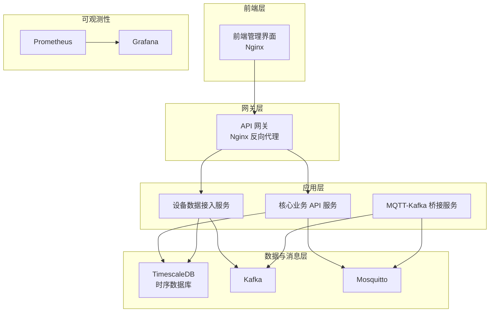
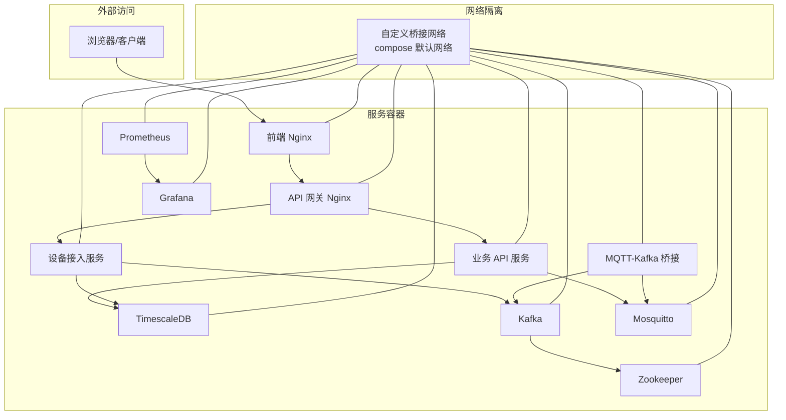
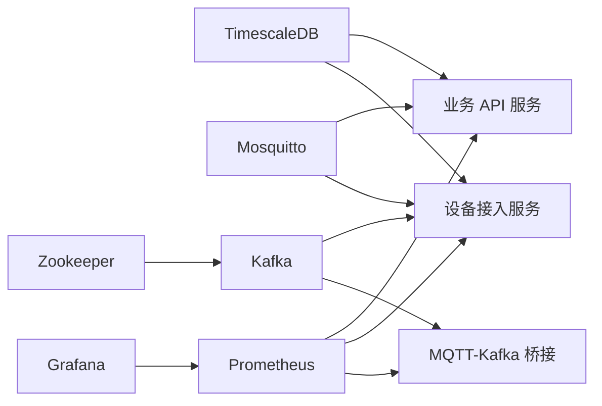

# 容器化部署

<cite>
**本文引用的文件**
- [deploy/docker-compose.yml](file://deploy/docker-compose.yml)
- [deploy/docker-compose.prod.yml](file://deploy/docker-compose.prod.yml)
- [deploy/docker-compose.full.yml](file://deploy/docker-compose.full.yml)
- [deploy/docker-compose.bridge.yml](file://deploy/docker-compose.bridge.yml)
- [deploy/docker-compose.kafka.yml](file://deploy/docker-compose.kafka.yml)
- [deploy/docker-compose.kafka-bridge.yml](file://deploy/docker-compose.kafka-bridge.yml)
- [deploy/timescaledb/Dockerfile](file://deploy/timescaledb/Dockerfile)
- [deploy/nginx.conf](file://deploy/nginx.conf)
- [deploy/prometheus.yml](file://deploy/prometheus.yml)
- [deploy/grafana-dashboard.json](file://deploy/grafana-dashboard.json)
- [deploy/mosquitto/mosquitto.conf](file://deploy/mosquitto/mosquitto.conf)
- [deploy/scripts/db_maintenance.sh](file://deploy/scripts/db_maintenance.sh)
- [deploy/scripts/kafka-init-topics.sh](file://deploy/scripts/kafka-init-topics.sh)
- [deploy/create_admin.sql](file://deploy/create_admin.sql)
- [deploy/create_device_models.sql](file://deploy/create_device_models.sql)
- [deploy/create_model_tables.sql](file://deploy/create_model_tables.sql)
- [deploy/deploy.sh](file://deploy/deploy.sh)
- [deploy/deploy-prod.sh](file://deploy/deploy-prod.sh)
- [api-gateway/Dockerfile](file://api-gateway/Dockerfile)
- [api-gateway/config.docker.yaml](file://api-gateway/config.docker.yaml)
- [inv_api_server/Dockerfile](file://inv_api_server/Dockerfile)
- [inv_api_server/config.docker.yaml](file://inv_api_server/config.docker.yaml)
- [inv_device_server/Dockerfile](file://inv_device_server/Dockerfile)
- [inv_device_server/config.docker.yaml](file://inv_device_server/config.docker.yaml)
- [mqtt-kafka-bridge/Dockerfile](file://mqtt-kafka-bridge/Dockerfile)
- [mqtt-kafka-bridge/config.docker.yaml](file://mqtt-kafka-bridge/config.docker.yaml)
- [inv-admin-frontend/Dockerfile](file://inv-admin-frontend/Dockerfile)
- [inv-admin-frontend/nginx.conf](file://inv-admin-frontend/nginx.conf)
- [database/schema.sql](file://database/schema.sql)
- [database/migrations/001_init_schema.up.sql](file://database/migrations/001_init_schema.up.sql)
- [database/migrations/002_add_performance_indexes.up.sql](file://database/migrations/002_add_performance_indexes.up.sql)
- [database/migrations/003_timescaledb_compression.up.sql](file://database/migrations/003_timescaledb_compression.up.sql)
- [database/migrations/004_add_energy_columns.up.sql](file://database/migrations/004_add_energy_columns.up.sql)
- [database/migrations/005_device_day_data_jsonb.up.sql](file://database/migrations/005_device_day_data_jsonb.up.sql)
- [database/migration_timescaledb.sql](file://database/migration_timescaledb.sql)
</cite>

## 目录
1. [简介](#简介)
2. [项目结构](#项目结构)
3. [核心组件](#核心组件)
4. [架构总览](#架构总览)
5. [详细组件分析](#详细组件分析)
6. [依赖关系分析](#依赖关系分析)
7. [性能考虑](#性能考虑)
8. [故障排查指南](#故障排查指南)
9. [结论](#结论)
10. [附录](#附录)

## 简介
本文件面向容器化部署场景，系统性梳理基于 Docker 与 Docker Compose 的编排方案，覆盖服务定义、依赖关系、网络与存储策略、生产与开发差异化配置、TimescaleDB 定制镜像与优化、以及启动/停止/重启标准流程、日志与监控、故障排查与容器间通信机制等。目标是帮助运维与开发团队在本地与生产环境中稳定、可重复地交付系统。

## 项目结构
本项目采用多模块微服务架构，并通过 Docker Compose 将各服务编排为统一的运行单元。核心服务包括：
- 前端管理界面（Nginx 静态托管）
- API 网关（反向代理与路由转发）
- 核心业务 API 服务
- 设备数据接入服务
- MQTT-Kafka 桥接服务
- TimescaleDB（时序数据库）
- Prometheus + Grafana（监控告警）
- Mosquitto（MQTT Broker）

**图表来源**
- [deploy/docker-compose.yml](file://deploy/docker-compose.yml)
- [deploy/docker-compose.full.yml](file://deploy/docker-compose.full.yml)
- [deploy/docker-compose.kafka.yml](file://deploy/docker-compose.kafka.yml)
- [deploy/docker-compose.kafka-bridge.yml](file://deploy/docker-compose.kafka-bridge.yml)
- [deploy/docker-compose.bridge.yml](file://deploy/docker-compose.bridge.yml)
- [deploy/docker-compose.prod.yml](file://deploy/docker-compose.prod.yml)

**章节来源**
- [deploy/docker-compose.yml](file://deploy/docker-compose.yml)
- [deploy/docker-compose.full.yml](file://deploy/docker-compose.full.yml)
- [deploy/docker-compose.kafka.yml](file://deploy/docker-compose.kafka.yml)
- [deploy/docker-compose.kafka-bridge.yml](file://deploy/docker-compose.kafka-bridge.yml)
- [deploy/docker-compose.bridge.yml](file://deploy/docker-compose.bridge.yml)
- [deploy/docker-compose.prod.yml](file://deploy/docker-compose.prod.yml)

## 核心组件
- 前端管理界面：使用 Nginx 托管静态资源，作为用户入口。
- API 网关：统一入口，负责路由转发、CORS、限流、鉴权中间件等。
- 核心业务 API 服务：提供设备、告警、仪表盘、用户等业务接口。
- 设备数据接入服务：解析设备协议、写入 Kafka 或直接入库。
- MQTT-Kafka 桥接服务：桥接 MQTT 主题到 Kafka，供下游消费。
- TimescaleDB：PostgreSQL 扩展，支持时序数据压缩与高性能查询。
- 监控与可视化：Prometheus 抓取指标，Grafana 展示仪表盘。
- Mosquitto：轻量级 MQTT Broker，用于设备上报与下发。

**章节来源**
- [inv-admin-frontend/Dockerfile](file://inv-admin-frontend/Dockerfile)
- [api-gateway/Dockerfile](file://api-gateway/Dockerfile)
- [inv_api_server/Dockerfile](file://inv_api_server/Dockerfile)
- [inv_device_server/Dockerfile](file://inv_device_server/Dockerfile)
- [mqtt-kafka-bridge/Dockerfile](file://mqtt-kafka-bridge/Dockerfile)
- [deploy/timescaledb/Dockerfile](file://deploy/timescaledb/Dockerfile)
- [deploy/prometheus.yml](file://deploy/prometheus.yml)
- [deploy/grafana-dashboard.json](file://deploy/grafana-dashboard.json)
- [deploy/mosquitto/mosquitto.conf](file://deploy/mosquitto/mosquitto.conf)

## 架构总览
下图展示容器化部署的整体拓扑与交互路径，包括服务发现、网络隔离、数据持久化与外部依赖对接。

**图表来源**
- [deploy/docker-compose.yml](file://deploy/docker-compose.yml)
- [deploy/docker-compose.full.yml](file://deploy/docker-compose.full.yml)
- [deploy/docker-compose.kafka.yml](file://deploy/docker-compose.kafka.yml)
- [deploy/docker-compose.kafka-bridge.yml](file://deploy/docker-compose.kafka-bridge.yml)
- [deploy/docker-compose.bridge.yml](file://deploy/docker-compose.bridge.yml)
- [deploy/docker-compose.prod.yml](file://deploy/docker-compose.prod.yml)

## 详细组件分析

### Docker Compose 编排配置文件结构
- 开发环境基础编排：定义最小可用服务集合，便于本地联调。
- 生产环境编排：启用资源限制、健康检查、持久化卷、网络隔离与安全参数。
- 功能扩展编排：
  - 全功能编排：包含所有服务（含 Kafka、Bridge、Mosquitto）。
  - Bridge 专用编排：仅运行 Bridge 与 Kafka。
  - Kafka 专用编排：仅运行 Kafka 与 Zookeeper。
  - Bridge 模式编排：启用 Bridge 与 Mosquitto。

这些文件通过服务定义、依赖关系、网络、卷与环境变量组织，形成可插拔的部署矩阵。

**章节来源**
- [deploy/docker-compose.yml](file://deploy/docker-compose.yml)
- [deploy/docker-compose.prod.yml](file://deploy/docker-compose.prod.yml)
- [deploy/docker-compose.full.yml](file://deploy/docker-compose.full.yml)
- [deploy/docker-compose.bridge.yml](file://deploy/docker-compose.bridge.yml)
- [deploy/docker-compose.kafka.yml](file://deploy/docker-compose.kafka.yml)
- [deploy/docker-compose.kafka-bridge.yml](file://deploy/docker-compose.kafka-bridge.yml)

### 服务定义与依赖关系
- 服务启动顺序：数据库（TimescaleDB）优先于应用服务；消息中间件（Kafka/Zookeeper）优先于设备接入与桥接服务；前端与网关依赖后端服务可达。
- 服务间依赖：业务 API 服务依赖数据库与 Mosquitto；设备接入服务依赖 Kafka；桥接服务依赖 Kafka 与 Mosquitto；监控服务依赖应用指标端点。
- 健康检查：数据库与应用服务配置健康检查探针，确保容器就绪后再对外提供服务。

**章节来源**
- [deploy/docker-compose.yml](file://deploy/docker-compose.yml)
- [deploy/docker-compose.full.yml](file://deploy/docker-compose.full.yml)
- [deploy/docker-compose.prod.yml](file://deploy/docker-compose.prod.yml)

### 网络配置与隔离策略
- 使用 Docker 自定义桥接网络，实现服务间 DNS 解析与隔离。
- 外部端口映射：前端 Nginx 对外暴露 80/443；API 网关对内暴露管理端口；数据库默认不对外暴露，内部服务访问。
- 网络别名：通过服务名称进行服务发现，避免硬编码 IP。
- 生产环境建议：启用只读根文件系统、最小权限、网络策略（如需）以增强隔离。

**章节来源**
- [deploy/docker-compose.yml](file://deploy/docker-compose.yml)
- [deploy/docker-compose.full.yml](file://deploy/docker-compose.full.yml)
- [deploy/docker-compose.prod.yml](file://deploy/docker-compose.prod.yml)

### 数据卷挂载策略
- 数据库卷：挂载到持久化目录，保留迁移脚本与初始化 SQL。
- 日志卷：挂载 Nginx 访问/错误日志目录，便于采集与分析。
- 前端静态资源：挂载 Nginx 配置与静态文件目录。
- 迁移与维护脚本：挂载到数据库容器或独立初始化容器中执行。

**章节来源**
- [deploy/docker-compose.yml](file://deploy/docker-compose.yml)
- [deploy/docker-compose.full.yml](file://deploy/docker-compose.full.yml)
- [deploy/docker-compose.prod.yml](file://deploy/docker-compose.prod.yml)

### 开发环境与生产环境差异化配置
- 开发环境：
  - 端口映射便于本地调试。
  - 不启用资源限制与健康检查。
  - 使用本地卷挂载源码或静态资源，热更新。
- 生产环境：
  - 启用 CPU/内存限制、健康检查与重启策略。
  - 使用只读根文件系统与非 root 用户。
  - 禁止不必要的端口映射，仅开放必需端口。
  - 配置 TLS、CORS、限流与鉴权中间件。

**章节来源**
- [deploy/docker-compose.yml](file://deploy/docker-compose.yml)
- [deploy/docker-compose.prod.yml](file://deploy/docker-compose.prod.yml)

### TimescaleDB 定制镜像与配置优化
- 定制 Dockerfile：基于官方 TimescaleDB 镜像，添加时序扩展、配置优化与初始化脚本。
- 初始化脚本：包含模式创建、索引优化、压缩策略与设备模型表结构。
- 性能优化要点：
  - 表空间与分区策略。
  - 压缩窗口与压缩级别。
  - 统计信息收集与查询计划优化。
- 安全加固：禁用默认密码、启用 TLS、最小权限账户。

**章节来源**
- [deploy/timescaledb/Dockerfile](file://deploy/timescaledb/Dockerfile)
- [database/schema.sql](file://database/schema.sql)
- [database/migrations/001_init_schema.up.sql](file://database/migrations/001_init_schema.up.sql)
- [database/migrations/002_add_performance_indexes.up.sql](file://database/migrations/002_add_performance_indexes.up.sql)
- [database/migrations/003_timescaledb_compression.up.sql](file://database/migrations/003_timescaledb_compression.up.sql)
- [database/migrations/004_add_energy_columns.up.sql](file://database/migrations/004_add_energy_columns.up.sql)
- [database/migrations/005_device_day_data_jsonb.up.sql](file://database/migrations/005_device_day_data_jsonb.up.sql)
- [database/migration_timescaledb.sql](file://database/migration_timescaledb.sql)

### 容器启动、停止、重启标准流程
- 启动：使用 Compose 文件启动指定服务集，按依赖顺序启动。
- 停止：优雅关闭服务，释放资源。
- 重启：针对特定服务执行重启，或全量重启。
- 常用命令参考：
  - 启动/停止/重启：docker compose up/down/stop/restart
  - 查看状态：docker compose ps
  - 查看日志：docker compose logs -f

**章节来源**
- [deploy/deploy.sh](file://deploy/deploy.sh)
- [deploy/deploy-prod.sh](file://deploy/deploy-prod.sh)

### 容器日志查看、资源监控与故障排查
- 日志：
  - 使用 docker compose logs 跟踪服务日志。
  - Nginx 访问/错误日志挂载到宿主机，便于集中采集。
- 监控：
  - Prometheus 抓取应用指标端点。
  - Grafana 导入仪表盘 JSON，可视化数据库与服务指标。
- 故障排查：
  - 健康检查失败：检查依赖服务是否就绪、端口连通性、配置文件语法。
  - 数据库异常：确认初始化脚本执行、压缩策略、索引是否生效。
  - 消息队列异常：验证主题创建、权限与消费者组状态。

**章节来源**
- [deploy/prometheus.yml](file://deploy/prometheus.yml)
- [deploy/grafana-dashboard.json](file://deploy/grafana-dashboard.json)
- [deploy/scripts/db_maintenance.sh](file://deploy/scripts/db_maintenance.sh)

### 容器间通信机制与网络隔离
- 服务发现：通过服务名在同一网络内互相访问。
- 网络隔离：不同环境使用独立网络命名空间，避免冲突。
- 出站访问：通过宿主机代理或容器内代理访问外部服务。
- 安全策略：限制出站流量、启用只读文件系统、最小权限账户。

**章节来源**
- [deploy/docker-compose.yml](file://deploy/docker-compose.yml)
- [deploy/docker-compose.full.yml](file://deploy/docker-compose.full.yml)
- [deploy/docker-compose.prod.yml](file://deploy/docker-compose.prod.yml)

## 依赖关系分析
下图展示服务之间的直接依赖与间接依赖，帮助理解启动顺序与故障传播路径。

**图表来源**
- [deploy/docker-compose.full.yml](file://deploy/docker-compose.full.yml)
- [deploy/docker-compose.kafka.yml](file://deploy/docker-compose.kafka.yml)
- [deploy/docker-compose.kafka-bridge.yml](file://deploy/docker-compose.kafka-bridge.yml)

**章节来源**
- [deploy/docker-compose.full.yml](file://deploy/docker-compose.full.yml)
- [deploy/docker-compose.kafka.yml](file://deploy/docker-compose.kafka.yml)
- [deploy/docker-compose.kafka-bridge.yml](file://deploy/docker-compose.kafka-bridge.yml)

## 性能考虑
- 数据库性能：
  - 合理设置 TimescaleDB 分区与压缩策略，降低查询成本。
  - 创建合适索引，避免全表扫描。
  - 控制并发连接数与查询超时。
- 应用性能：
  - 启用连接池与异步处理，减少阻塞。
  - 合理配置缓存与预聚合。
- 容器资源：
  - 设置 CPU/内存限额，避免资源争抢。
  - 使用亲和性与反亲和性调度热点服务。

[本节为通用指导，无需列出具体文件来源]

## 故障排查指南
- 服务无法启动：
  - 检查依赖服务健康状态与端口占用。
  - 查看容器日志定位错误原因。
- 数据库异常：
  - 确认初始化脚本执行成功。
  - 检查压缩与索引策略是否合理。
- 消息队列异常：
  - 验证主题创建与权限。
  - 检查消费者组状态与 lag。
- 监控缺失：
  - 确认指标端点可达与抓取配置正确。
  - 检查防火墙与网络策略。

**章节来源**
- [deploy/scripts/db_maintenance.sh](file://deploy/scripts/db_maintenance.sh)
- [deploy/prometheus.yml](file://deploy/prometheus.yml)
- [deploy/grafana-dashboard.json](file://deploy/grafana-dashboard.json)

## 结论
通过标准化的 Docker Compose 编排与分层配置，本项目实现了开发与生产的可重复部署。结合 TimescaleDB 的定制镜像与优化策略、完善的监控与日志体系，以及清晰的服务间通信与网络隔离，能够满足从本地开发到生产环境的多样化需求。建议在生产环境中进一步引入 CI/CD 流水线、密钥管理与审计日志，持续提升安全性与可运维性。

[本节为总结性内容，无需列出具体文件来源]

## 附录
- 初始化 SQL 与迁移脚本：
  - 管理员账户初始化脚本
  - 设备模型与表结构初始化脚本
  - 迁移脚本集合（包含索引、压缩、字段扩展等）
- 运维脚本：
  - 数据库维护脚本
  - Kafka 主题初始化脚本
- 配置文件：
  - Nginx 反向代理配置
  - Prometheus 抓取配置
  - Grafana 仪表盘导入 JSON
  - Mosquitto Broker 配置

**章节来源**
- [deploy/create_admin.sql](file://deploy/create_admin.sql)
- [deploy/create_device_models.sql](file://deploy/create_device_models.sql)
- [deploy/create_model_tables.sql](file://deploy/create_model_tables.sql)
- [deploy/scripts/db_maintenance.sh](file://deploy/scripts/db_maintenance.sh)
- [deploy/scripts/kafka-init-topics.sh](file://deploy/scripts/kafka-init-topics.sh)
- [deploy/nginx.conf](file://deploy/nginx.conf)
- [deploy/prometheus.yml](file://deploy/prometheus.yml)
- [deploy/grafana-dashboard.json](file://deploy/grafana-dashboard.json)
- [deploy/mosquitto/mosquitto.conf](file://deploy/mosquitto/mosquitto.conf)
- [database/schema.sql](file://database/schema.sql)
- [database/migrations/001_init_schema.up.sql](file://database/migrations/001_init_schema.up.sql)
- [database/migrations/002_add_performance_indexes.up.sql](file://database/migrations/002_add_performance_indexes.up.sql)
- [database/migrations/003_timescaledb_compression.up.sql](file://database/migrations/003_timescaledb_compression.up.sql)
- [database/migrations/004_add_energy_columns.up.sql](file://database/migrations/004_add_energy_columns.up.sql)
- [database/migrations/005_device_day_data_jsonb.up.sql](file://database/migrations/005_device_day_data_jsonb.up.sql)
- [database/migration_timescaledb.sql](file://database/migration_timescaledb.sql)