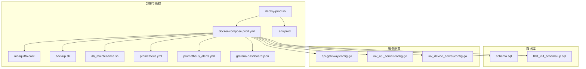
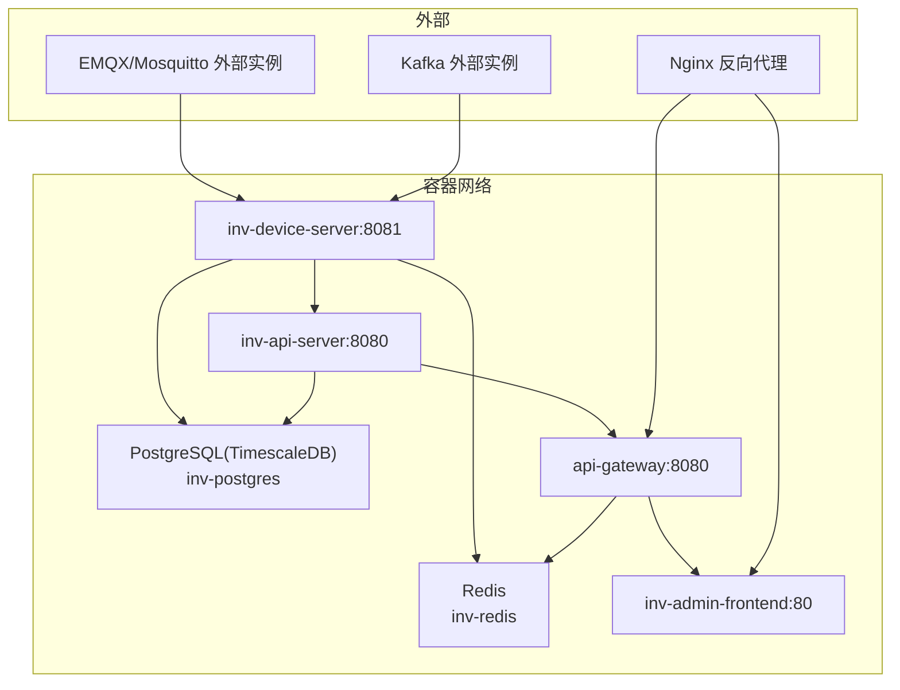
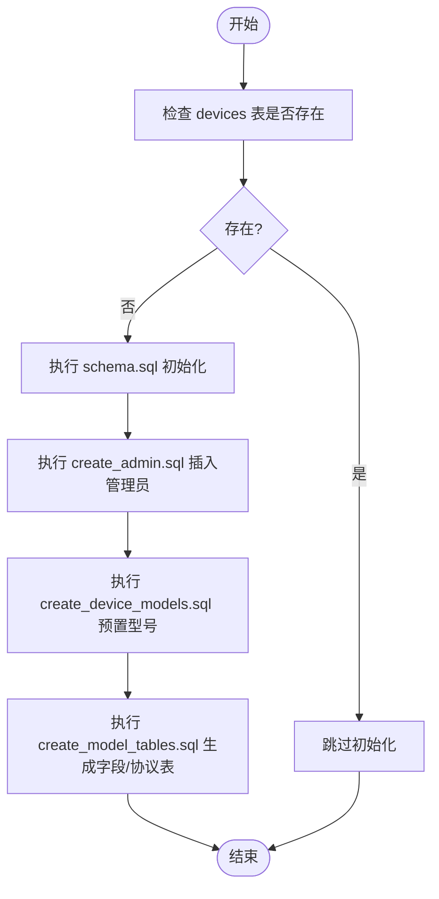
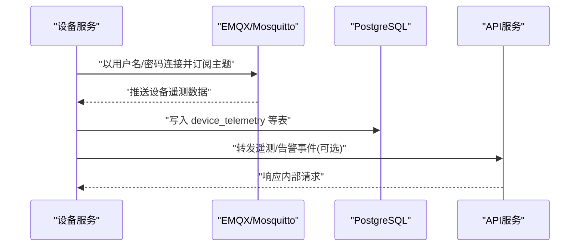
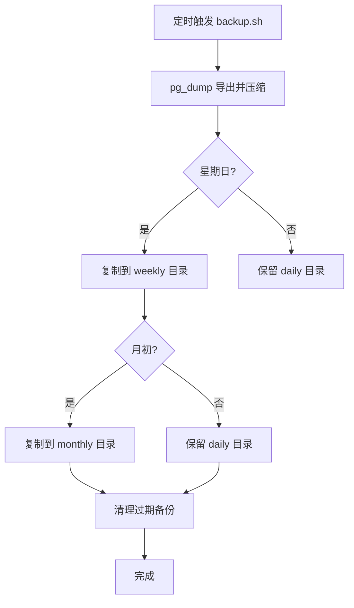
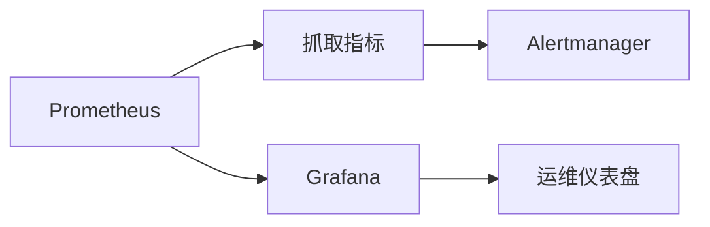
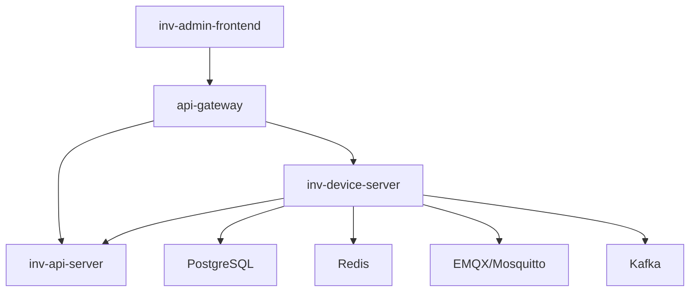

# 生产环境运维

<cite>
**本文引用的文件**
- [deploy/README.md](file://deploy/README.md)
- [deploy/deploy-prod.sh](file://deploy/deploy-prod.sh)
- [deploy/docker-compose.prod.yml](file://deploy/docker-compose.prod.yml)
- [deploy/.env.prod](file://deploy/.env.prod)
- [deploy/mosquitto/mosquitto.conf](file://deploy/mosquitto/mosquitto.conf)
- [deploy/create_admin.sql](file://deploy/create_admin.sql)
- [deploy/create_device_models.sql](file://deploy/create_device_models.sql)
- [deploy/create_model_tables.sql](file://deploy/create_model_tables.sql)
- [deploy/scripts/backup.sh](file://deploy/scripts/backup.sh)
- [deploy/scripts/db_maintenance.sh](file://deploy/scripts/db_maintenance.sh)
- [deploy/prometheus.yml](file://deploy/prometheus.yml)
- [deploy/prometheus_alerts.yml](file://deploy/prometheus_alerts.yml)
- [deploy/grafana-dashboard.json](file://deploy/grafana-dashboard.json)
- [database/schema.sql](file://database/schema.sql)
- [database/migrations/001_init_schema.up.sql](file://database/migrations/001_init_schema.up.sql)
- [api-gateway/internal/config/config.go](file://api-gateway/internal/config/config.go)
- [inv_api_server/internal/config/config.go](file://inv_api_server/internal/config/config.go)
- [inv_device_server/internal/config/config.go](file://inv_device_server/internal/config/config.go)
</cite>

## 目录
1. [简介](#简介)
2. [项目结构](#项目结构)
3. [核心组件](#核心组件)
4. [架构总览](#架构总览)
5. [详细组件分析](#详细组件分析)
6. [依赖关系分析](#依赖关系分析)
7. [性能考虑](#性能考虑)
8. [故障排查指南](#故障排查指南)
9. [结论](#结论)
10. [附录](#附录)

## 简介
本文件面向生产环境运维团队，提供从部署、配置、数据库初始化、MQTT/EMQX集成、环境变量与安全、监控告警、备份与容灾、容量规划到变更管理与故障处理的全栈运维指南。文档基于仓库中的部署脚本、配置文件与数据库脚本进行梳理，确保可执行、可追溯、可复现。

## 项目结构
生产相关的关键目录与文件如下：
- 部署与编排：deploy 目录下的 docker-compose.prod.yml、.env.prod、deploy-prod.sh、mosquitto.conf、脚本目录 scripts、监控配置 prometheus.yml 与 prometheus_alerts.yml、Grafana 仪表盘 grafana-dashboard.json
- 数据库：database 目录下的 schema.sql 与迁移脚本
- 网关与服务配置：api-gateway、inv_api_server、inv_device_server 的配置加载逻辑

图表来源
- [deploy/docker-compose.prod.yml:1-226](file://deploy/docker-compose.prod.yml#L1-L226)
- [deploy/.env.prod:1-55](file://deploy/.env.prod#L1-L55)
- [deploy/deploy-prod.sh:1-256](file://deploy/deploy-prod.sh#L1-L256)
- [deploy/mosquitto/mosquitto.conf:1-3](file://deploy/mosquitto/mosquitto.conf#L1-L3)
- [deploy/scripts/backup.sh:1-55](file://deploy/scripts/backup.sh#L1-L55)
- [deploy/scripts/db_maintenance.sh:1-43](file://deploy/scripts/db_maintenance.sh#L1-L43)
- [deploy/prometheus.yml:1-33](file://deploy/prometheus.yml#L1-L33)
- [deploy/prometheus_alerts.yml:1-78](file://deploy/prometheus_alerts.yml#L1-L78)
- [deploy/grafana-dashboard.json:1-241](file://deploy/grafana-dashboard.json#L1-L241)
- [database/schema.sql:1-463](file://database/schema.sql#L1-L463)
- [database/migrations/001_init_schema.up.sql:1-115](file://database/migrations/001_init_schema.up.sql#L1-L115)
- [api-gateway/internal/config/config.go:1-87](file://api-gateway/internal/config/config.go#L1-L87)
- [inv_api_server/internal/config/config.go:1-200](file://inv_api_server/internal/config/config.go#L1-L200)
- [inv_device_server/internal/config/config.go:1-163](file://inv_device_server/internal/config/config.go#L1-L163)

章节来源
- [deploy/README.md:1-270](file://deploy/README.md#L1-L270)
- [deploy/docker-compose.prod.yml:1-226](file://deploy/docker-compose.prod.yml#L1-L226)
- [deploy/.env.prod:1-55](file://deploy/.env.prod#L1-L55)

## 核心组件
- 编排与服务：PostgreSQL(TimescaleDB)、Redis、设备服务、API服务、网关、前端、MQTT/EMQX外部接入
- 配置体系：YAML 配置文件 + 环境变量绑定；服务启动后从容器内挂载配置与 .env.prod 注入
- 数据库：schema.sql 初始化表结构；迁移脚本 001_init_schema.up.sql 提供版本化迁移
- 监控与告警：Prometheus 抓取指标、Alertmanager 规则、Grafana 仪表盘
- 备份与维护：pg_dump 全量备份、保留策略；TimescaleDB 维护脚本清理与压缩

章节来源
- [deploy/docker-compose.prod.yml:1-226](file://deploy/docker-compose.prod.yml#L1-L226)
- [deploy/.env.prod:1-55](file://deploy/.env.prod#L1-L55)
- [database/schema.sql:1-463](file://database/schema.sql#L1-L463)
- [database/migrations/001_init_schema.up.sql:1-115](file://database/migrations/001_init_schema.up.sql#L1-L115)
- [deploy/prometheus.yml:1-33](file://deploy/prometheus.yml#L1-L33)
- [deploy/prometheus_alerts.yml:1-78](file://deploy/prometheus_alerts.yml#L1-L78)
- [deploy/grafana-dashboard.json:1-241](file://deploy/grafana-dashboard.json#L1-L241)

## 架构总览
生产环境采用 Docker Compose 编排，服务间通过内部网络通信，外部通过网关暴露 API。数据库使用 TimescaleDB，具备时序数据优化与连续聚合能力；Redis 作为缓存与流队列；MQTT/EMQX 在外部部署，设备服务通过用户名密码连接；Kafka 可选启用，用于遥测与告警事件桥接。

图表来源
- [deploy/docker-compose.prod.yml:1-226](file://deploy/docker-compose.prod.yml#L1-L226)
- [deploy/mosquitto/mosquitto.conf:1-3](file://deploy/mosquitto/mosquitto.conf#L1-L3)
- [deploy/.env.prod:25-37](file://deploy/.env.prod#L25-L37)

## 详细组件分析

### 数据库初始化与模型定义
- 初始化脚本：首次部署时，编排会挂载 schema.sql 与迁移脚本至容器入口，完成基础表结构与索引创建
- 管理员账户：提供 create_admin.sql，删除重复手机号并插入管理员记录，便于初始登录
- 设备模型：create_device_models.sql 定义设备型号表与预置常见逆变器型号；create_model_tables.sql 基于型号 JSON 字段生成标准化字段与协议解析表，并建立索引

图表来源
- [deploy/deploy-prod.sh:162-173](file://deploy/deploy-prod.sh#L162-L173)
- [deploy/create_admin.sql:1-16](file://deploy/create_admin.sql#L1-L16)
- [deploy/create_device_models.sql:1-23](file://deploy/create_device_models.sql#L1-L23)
- [deploy/create_model_tables.sql:1-44](file://deploy/create_model_tables.sql#L1-L44)
- [database/schema.sql:1-463](file://database/schema.sql#L1-L463)

章节来源
- [deploy/deploy-prod.sh:162-173](file://deploy/deploy-prod.sh#L162-L173)
- [deploy/create_admin.sql:1-16](file://deploy/create_admin.sql#L1-L16)
- [deploy/create_device_models.sql:1-23](file://deploy/create_device_models.sql#L1-L23)
- [deploy/create_model_tables.sql:1-44](file://deploy/create_model_tables.sql#L1-L44)
- [database/schema.sql:382-408](file://database/schema.sql#L382-L408)

### MQTT/EMQX 生产配置
- 当前仓库中 Mosquitto 配置允许匿名访问，仅监听 1883 端口
- 生产建议：在外部部署 EMQX，使用 .env.prod 中的 MQTT_BROKER、MQTT_PORT、MQTT_USERNAME、MQTT_PASSWORD 进行鉴权连接
- 设备服务通过 MQTT 客户端 ID、用户名密码连接外部 EMQX，订阅设备主题并解析数据

图表来源
- [deploy/mosquitto/mosquitto.conf:1-3](file://deploy/mosquitto/mosquitto.conf#L1-L3)
- [deploy/.env.prod:25-30](file://deploy/.env.prod#L25-L30)
- [inv_device_server/internal/config/config.go:50-66](file://inv_device_server/internal/config/config.go#L50-L66)

章节来源
- [deploy/mosquitto/mosquitto.conf:1-3](file://deploy/mosquitto/mosquitto.conf#L1-L3)
- [deploy/.env.prod:25-30](file://deploy/.env.prod#L25-L30)
- [inv_device_server/internal/config/config.go:117-137](file://inv_device_server/internal/config/config.go#L117-L137)

### 环境变量管理与敏感信息保护
- 环境变量集中于 .env.prod，包含数据库、Redis、JWT、MQTT、Kafka、邮件等配置
- 部署脚本在执行前校验占位符并提示替换，避免直接使用默认占位值
- 建议：在生产环境中通过密钥管理服务注入敏感变量，或使用加密配置文件并在容器启动前解密

章节来源
- [deploy/.env.prod:1-55](file://deploy/.env.prod#L1-L55)
- [deploy/deploy-prod.sh:95-118](file://deploy/deploy-prod.sh#L95-L118)

### 备份策略与灾难恢复
- 备份脚本：每日全量逻辑备份，保留最近 7 天日备份、4 周周备份、3 月月备份
- 维护脚本：定期清理 TimescaleDB 超表与历史表数据，执行 VACUUM ANALYZE 优化
- 建议：将备份存储至对象存储或本地磁盘快照，制定异地容灾与 RPO/RTO 指标

图表来源
- [deploy/scripts/backup.sh:1-55](file://deploy/scripts/backup.sh#L1-L55)

章节来源
- [deploy/scripts/backup.sh:1-55](file://deploy/scripts/backup.sh#L1-L55)
- [deploy/scripts/db_maintenance.sh:1-43](file://deploy/scripts/db_maintenance.sh#L1-L43)

### 性能监控与容量规划
- Prometheus 抓取指标：后端服务、设备服务、PostgreSQL、Redis
- Grafana 仪表盘：展示 HTTP QPS/延迟/错误率、在线/离线设备、MQTT 消息速率、数据库连接池、活跃告警数、服务运行时长
- 告警规则：MQTT 消息丢弃、实例宕机、数据库连接数、Redis 内存、EMQX 连接骤降、Stream 积压、Kafka 降级等

图表来源
- [deploy/prometheus.yml:1-33](file://deploy/prometheus.yml#L1-L33)
- [deploy/prometheus_alerts.yml:1-78](file://deploy/prometheus_alerts.yml#L1-L78)
- [deploy/grafana-dashboard.json:1-241](file://deploy/grafana-dashboard.json#L1-L241)

章节来源
- [deploy/prometheus.yml:1-33](file://deploy/prometheus.yml#L1-L33)
- [deploy/prometheus_alerts.yml:1-78](file://deploy/prometheus_alerts.yml#L1-L78)
- [deploy/grafana-dashboard.json:1-241](file://deploy/grafana-dashboard.json#L1-L241)

### 变更管理流程
- 变更申请：明确变更范围、影响面与回退预案
- 测试验证：在预生产环境执行部署脚本与健康检查
- 回滚预案：支持 git revert 回滚至上一版本并重新部署
- 发布窗口：避开业务高峰期，执行灰度发布与逐步切换

章节来源
- [deploy/README.md:228-232](file://deploy/README.md#L228-L232)
- [deploy/deploy-prod.sh:248-255](file://deploy/deploy-prod.sh#L248-L255)

### 安全加固措施
- 认证授权：JWT 密钥由 .env.prod 注入；RBAC 在网关配置中启用
- 访问控制：Nginx 反代 + 网关限流与路由级限速；Redis 限制内存策略
- 日志审计：容器日志轮转；建议开启数据库慢查询日志与 API 请求审计
- 网络隔离：服务间通过内部网络通信；MQTT/EMQX/Kafka 使用外部实例并限制入站访问

章节来源
- [api-gateway/internal/config/config.go:10-18](file://api-gateway/internal/config/config.go#L10-L18)
- [deploy/docker-compose.prod.yml:48-75](file://deploy/docker-compose.prod.yml#L48-L75)
- [deploy/.env.prod:18-20](file://deploy/.env.prod#L18-L20)

## 依赖关系分析
- 服务依赖：设备服务先于 API 服务启动；网关依赖 API 与设备服务；前端依赖网关
- 外部依赖：EMQX/Mosquitto、Kafka、Nginx
- 配置依赖：各服务通过 YAML 配置文件与环境变量绑定，容器内挂载只读配置

图表来源
- [deploy/docker-compose.prod.yml:76-217](file://deploy/docker-compose.prod.yml#L76-L217)

章节来源
- [deploy/docker-compose.prod.yml:76-217](file://deploy/docker-compose.prod.yml#L76-L217)

## 性能考虑
- 数据库：TimescaleDB 超表与连续聚合提升时序查询性能；合理设置连接池上限与空闲回收
- 缓存：Redis 设置最大内存与淘汰策略；关注 Stream 积压与消费者并发
- 网关：限流与路由级限速防止突发流量冲击后端
- 监控：按路径维度聚合 QPS/延迟/错误率，定位热点接口与异常

## 故障排查指南
- 服务无法启动：查看 systemd 单元状态与 journal 日志；手动运行二进制定位错误
- 数据库连接失败：检查 PostgreSQL/Redis 可达性与凭据；确认容器健康检查
- 前端白屏：检查 Nginx 配置与静态文件权限；查看 Nginx 错误日志
- MQTT/EMQX：核对用户名密码、订阅主题与外部实例连通性

章节来源
- [deploy/README.md:236-269](file://deploy/README.md#L236-L269)

## 结论
本运维文档基于仓库现有脚本与配置，提供了生产环境部署、数据库初始化、MQTT/EMQX 接入、监控告警、备份与容量规划、变更管理与安全加固的实践指南。建议在生产中补充密钥管理、网络 ACL、日志审计与异地容灾演练，持续完善 SLO/SLO 指标与自动化巡检。

## 附录
- 常用维护命令与一键部署脚本参见部署说明
- 环境变量模板与占位符替换流程参见 .env.prod 与部署脚本

章节来源
- [deploy/README.md:206-232](file://deploy/README.md#L206-L232)
- [deploy/.env.prod:1-55](file://deploy/.env.prod#L1-L55)
- [deploy/deploy-prod.sh:1-256](file://deploy/deploy-prod.sh#L1-L256)