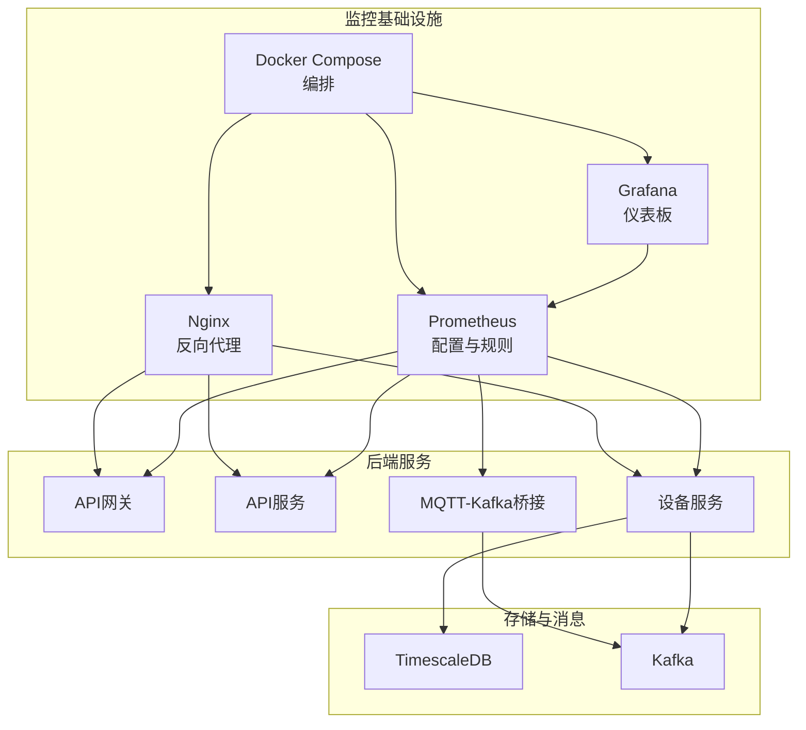
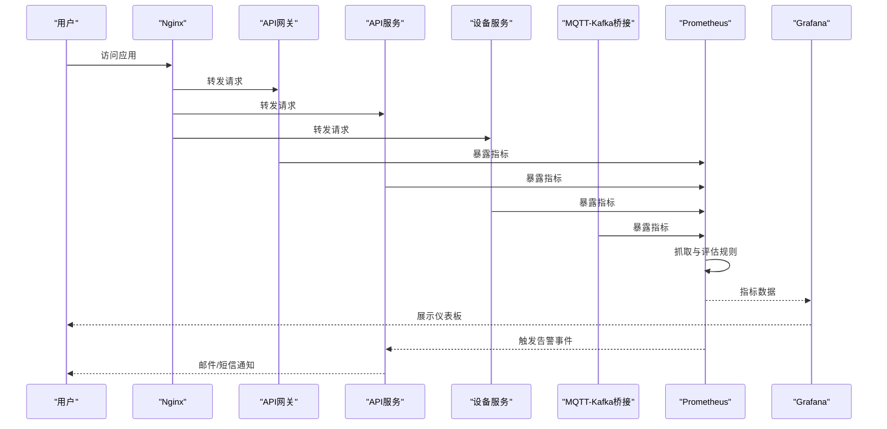
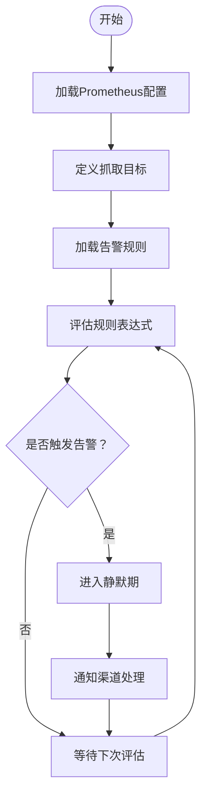
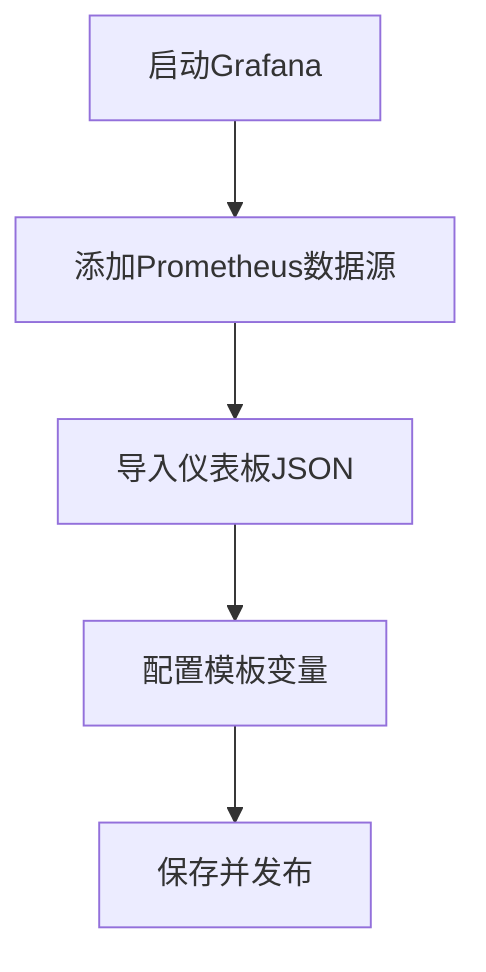
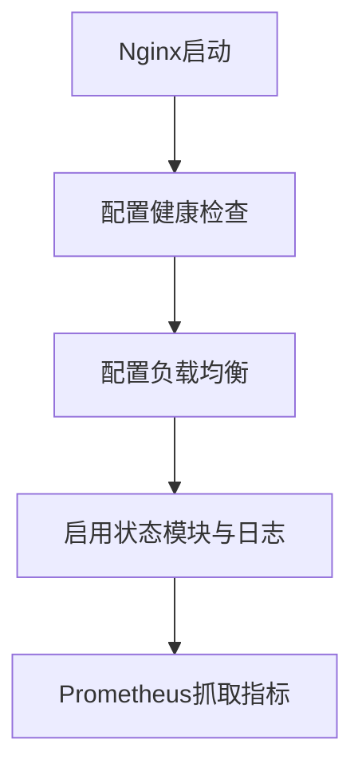
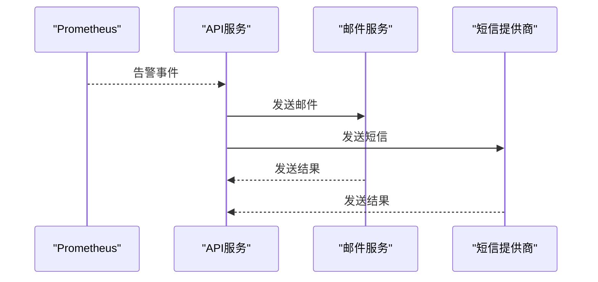
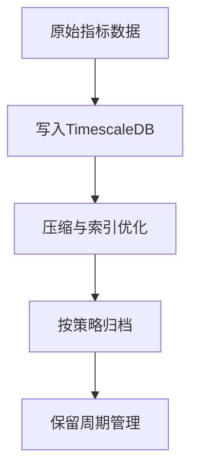
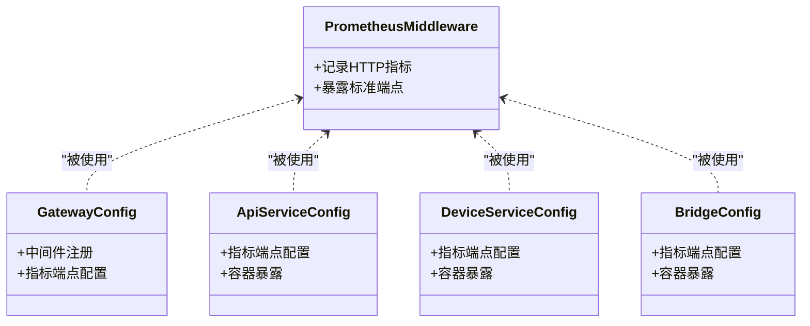
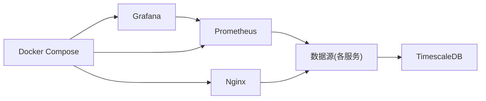

# 监控告警

<cite>
**本文引用的文件**
- [prometheus.yml](file://deploy/prometheus.yml)
- [prometheus_alerts.yml](file://deploy/prometheus_alerts.yml)
- [grafana-dashboard.json](file://deploy/grafana-dashboard.json)
- [nginx.conf](file://deploy/nginx.conf)
- [nginx.conf](file://inv-admin-frontend/nginx.conf)
- [docker-compose.yml](file://deploy/docker-compose.yml)
- [docker-compose.full.yml](file://deploy/docker-compose.full.yml)
- [docker-compose.prod.yml](file://deploy/docker-compose.prod.yml)
- [monitor.sh](file://deploy/monitor.sh)
- [inv-monitor.service](file://deploy/inv-monitor.service)
- [email_service.go](file://inv_api_server/internal/service/email_service.go)
- [sms_provider.go](file://inv_api_server/internal/service/sms_provider.go)
- [alert_consumer.go](file://inv_device_server/internal/service/alert_consumer.go)
- [prometheus.go](file://api-gateway/internal/middleware/prometheus.go)
- [config.go](file://api-gateway/internal/config/config.go)
- [config.go](file://inv_api_server/internal/config/config.go)
- [config.go](file://inv_device_server/internal/config/config.go)
- [config.go](file://mqtt-kafka-bridge/internal/config/config.go)
- [config.docker.yaml](file://api-gateway/config.docker.yaml)
- [config.docker.yaml](file://inv_api_server/config.docker.yaml)
- [config.docker.yaml](file://inv_device_server/config.docker.yaml)
- [config.docker.yaml](file://mqtt-kafka-bridge/config.docker.yaml)
- [timescaledb/Dockerfile](file://deploy/timescaledb/Dockerfile)
- [migration_timescaledb.sql](file://database/migration_timescaledb.sql)
- [schema.sql](file://database/schema.sql)
- [README.md](file://deploy/README.md)
</cite>

## 目录
1. [简介](#简介)
2. [项目结构](#项目结构)
3. [核心组件](#核心组件)
4. [架构总览](#架构总览)
5. [详细组件分析](#详细组件分析)
6. [依赖关系分析](#依赖关系分析)
7. [性能考虑](#性能考虑)
8. [故障排查指南](#故障排查指南)
9. [结论](#结论)
10. [附录](#附录)

## 简介
本文件面向基于 Prometheus 和 Grafana 的监控告警体系，结合仓库中的实际配置与实现，系统性地阐述以下内容：Prometheus 配置文件结构（抓取目标、规则文件、告警管理器）、告警规则编写方法（表达式语法、级别与静默期）、Grafana 仪表板配置与模板管理、Nginx 反向代理监控（健康检查、负载均衡、性能指标）、监控数据存储策略与保留周期、告警通知渠道（邮件、短信）以及运维最佳实践与故障排查。

## 项目结构
监控相关的核心文件主要集中在 deploy 目录与各服务内部的中间件与配置中：
- Prometheus 配置与告警规则：deploy/prometheus.yml、deploy/prometheus_alerts.yml
- Grafana 仪表板：deploy/grafana-dashboard.json
- Nginx 反向代理：deploy/nginx.conf、inv-admin-frontend/nginx.conf
- 容器编排：deploy/docker-compose*.yml
- 监控脚本与服务单元：deploy/monitor.sh、deploy/inv-monitor.service
- 各服务配置与中间件：各服务的 config.go、config.docker.yaml
- 存储层：deploy/timescaledb/Dockerfile、database/migration_timescaledb.sql、database/schema.sql

**图表来源**
- [prometheus.yml](file://deploy/prometheus.yml)
- [docker-compose.yml](file://deploy/docker-compose.yml)
- [nginx.conf](file://deploy/nginx.conf)

**章节来源**
- [prometheus.yml](file://deploy/prometheus.yml)
- [docker-compose.yml](file://deploy/docker-compose.yml)
- [nginx.conf](file://deploy/nginx.conf)

## 核心组件
- Prometheus 监控采集与告警：通过抓取目标暴露的 metrics 指标，结合规则文件进行告警判定与静默期控制。
- Grafana 可视化：以 Prometheus 为数据源，加载仪表板 JSON 进行展示与模板管理。
- Nginx 反向代理：提供健康检查、负载均衡与性能指标导出，便于统一监控。
- 通知渠道：邮件与短信服务在后端服务中实现，用于告警推送。
- 存储策略：TimescaleDB 作为时序数据库，支持压缩与索引优化。

**章节来源**
- [prometheus.yml](file://deploy/prometheus.yml)
- [prometheus_alerts.yml](file://deploy/prometheus_alerts.yml)
- [grafana-dashboard.json](file://deploy/grafana-dashboard.json)
- [email_service.go](file://inv_api_server/internal/service/email_service.go)
- [sms_provider.go](file://inv_api_server/internal/service/sms_provider.go)
- [timescaledb/Dockerfile](file://deploy/timescaledb/Dockerfile)

## 架构总览
下图展示了监控体系的整体交互：Nginx 作为入口，将请求转发至各服务；各服务通过 Prometheus 中间件暴露指标；Prometheus 抓取指标并执行告警规则；Grafana 从 Prometheus 获取数据进行可视化；告警触发后由后端服务通过邮件/短信通知用户。

**图表来源**
- [prometheus.go](file://api-gateway/internal/middleware/prometheus.go)
- [prometheus.yml](file://deploy/prometheus.yml)
- [docker-compose.yml](file://deploy/docker-compose.yml)

## 详细组件分析

### Prometheus 配置与告警规则
- 抓取目标：在配置文件中定义各服务的指标端点，包括 API 网关、API 服务、设备服务与桥接服务。
- 规则文件：通过独立的告警规则文件定义告警条件、严重级别与静默期。
- 告警管理器：可选配置，用于路由与抑制告警。

**图表来源**
- [prometheus.yml](file://deploy/prometheus.yml)
- [prometheus_alerts.yml](file://deploy/prometheus_alerts.yml)

**章节来源**
- [prometheus.yml](file://deploy/prometheus.yml)
- [prometheus_alerts.yml](file://deploy/prometheus_alerts.yml)

### Grafana 仪表板配置与模板管理
- 数据源连接：Grafana 通过 Prometheus 数据源连接获取指标。
- 仪表板导入：使用 JSON 文件导入预设面板，便于团队共享与复用。
- 模板变量：支持环境、服务等维度的动态选择与切换。

**图表来源**
- [grafana-dashboard.json](file://deploy/grafana-dashboard.json)

**章节来源**
- [grafana-dashboard.json](file://deploy/grafana-dashboard.json)

### Nginx 反向代理监控配置
- 健康检查：通过状态页面或探针检测上游服务可用性。
- 负载均衡：轮询或加权分配请求到多个实例。
- 性能指标：启用访问日志与状态模块，供 Prometheus 抓取。

**图表来源**
- [nginx.conf](file://deploy/nginx.conf)
- [nginx.conf](file://inv-admin-frontend/nginx.conf)

**章节来源**
- [nginx.conf](file://deploy/nginx.conf)
- [nginx.conf](file://inv-admin-frontend/nginx.conf)

### 告警通知渠道：邮件与短信
- 邮件通知：在 API 服务中实现邮件发送逻辑，用于告警事件的即时通知。
- 短信通知：通过短信提供商接口实现告警短信推送。

**图表来源**
- [email_service.go](file://inv_api_server/internal/service/email_service.go)
- [sms_provider.go](file://inv_api_server/internal/service/sms_provider.go)

**章节来源**
- [email_service.go](file://inv_api_server/internal/service/email_service.go)
- [sms_provider.go](file://inv_api_server/internal/service/sms_provider.go)

### 监控数据存储策略与保留周期
- TimescaleDB：作为时序数据库，支持压缩与索引优化，提升查询与存储效率。
- 迁移脚本：包含压缩、索引与列扩展等迁移操作，确保长期运行的稳定性。
- Schema 定义：明确表结构与约束，支撑监控数据的规范化存储。

**图表来源**
- [timescaledb/Dockerfile](file://deploy/timescaledb/Dockerfile)
- [migration_timescaledb.sql](file://database/migration_timescaledb.sql)
- [schema.sql](file://database/schema.sql)

**章节来源**
- [timescaledb/Dockerfile](file://deploy/timescaledb/Dockerfile)
- [migration_timescaledb.sql](file://database/migration_timescaledb.sql)
- [schema.sql](file://database/schema.sql)

### 各服务指标暴露与配置
- API 网关：内置 Prometheus 中间件，自动暴露 HTTP 请求相关的指标。
- API 服务、设备服务、桥接服务：通过各自配置文件与容器编排，统一暴露指标端点。

**图表来源**
- [prometheus.go](file://api-gateway/internal/middleware/prometheus.go)
- [config.go](file://api-gateway/internal/config/config.go)
- [config.go](file://inv_api_server/internal/config/config.go)
- [config.go](file://inv_device_server/internal/config/config.go)
- [config.go](file://mqtt-kafka-bridge/internal/config/config.go)

**章节来源**
- [prometheus.go](file://api-gateway/internal/middleware/prometheus.go)
- [config.go](file://api-gateway/internal/config/config.go)
- [config.go](file://inv_api_server/internal/config/config.go)
- [config.go](file://inv_device_server/internal/config/config.go)
- [config.go](file://mqtt-kafka-bridge/internal/config/config.go)

## 依赖关系分析
- 组件耦合：Prometheus 依赖各服务暴露的指标端点；Grafana 依赖 Prometheus 数据源；Nginx 作为统一入口影响整体可观测性。
- 外部依赖：容器编排文件定义了 Prometheus、Grafana、Nginx 与各服务的部署关系；TimescaleDB 提供时序数据存储。

**图表来源**
- [docker-compose.yml](file://deploy/docker-compose.yml)
- [prometheus.yml](file://deploy/prometheus.yml)

**章节来源**
- [docker-compose.yml](file://deploy/docker-compose.yml)
- [prometheus.yml](file://deploy/prometheus.yml)

## 性能考虑
- 抓取间隔与超时：根据服务规模与资源情况调整抓取频率，避免过度拉取导致延迟。
- 规则评估复杂度：简化告警表达式，合理设置静默期，减少重复告警风暴。
- 存储优化：启用 TimescaleDB 压缩与索引，定期清理过期数据，控制保留周期。
- 缓存与限流：在网关层实施限流与缓存策略，降低下游压力。
- 监控自身：对 Prometheus 与 Grafana 的资源使用进行监控，确保监控系统稳定运行。

## 故障排查指南
- 指标不可见：检查各服务的指标端点是否正确暴露，确认 Prometheus 抓取地址与端口。
- 告警未触发：核对规则表达式与阈值，确认静默期设置，验证告警管理器配置。
- 通知失败：检查邮件与短信服务的日志输出，确认凭据与网络连通性。
- Nginx 异常：查看健康检查状态与错误日志，确认上游服务可达性与负载均衡配置。
- 存储问题：检查 TimescaleDB 的压缩策略与索引状态，清理过期数据，监控磁盘空间。

**章节来源**
- [monitor.sh](file://deploy/monitor.sh)
- [inv-monitor.service](file://deploy/inv-monitor.service)
- [email_service.go](file://inv_api_server/internal/service/email_service.go)
- [sms_provider.go](file://inv_api_server/internal/service/sms_provider.go)

## 结论
该监控告警体系通过 Prometheus 与 Grafana 实现全链路可观测性，结合 Nginx 反向代理与 TimescaleDB 存储，形成完整的监控闭环。通过规范的配置与规则编写、合理的存储策略与通知渠道，能够有效支撑业务的稳定运行与快速定位问题。

## 附录
- 部署与运维：参考容器编排文件与监控脚本，确保各组件协同工作。
- 文档与变更：关注数据库迁移与配置文件的更新，保持监控体系与业务同步演进。

**章节来源**
- [docker-compose.full.yml](file://deploy/docker-compose.full.yml)
- [docker-compose.prod.yml](file://deploy/docker-compose.prod.yml)
- [README.md](file://deploy/README.md)