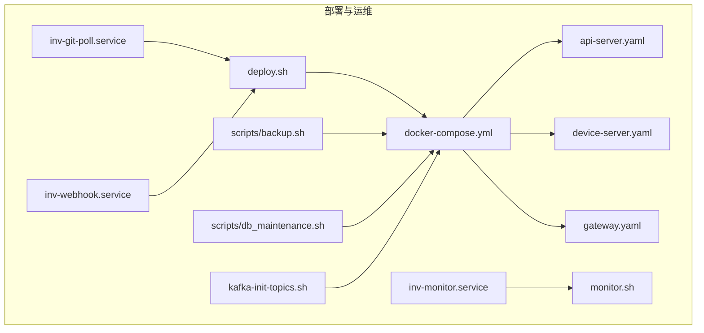
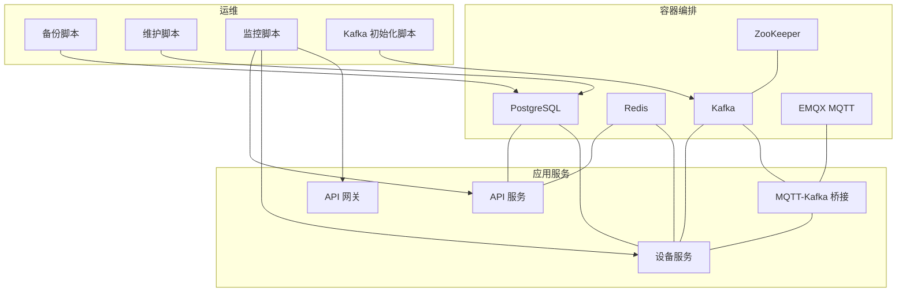
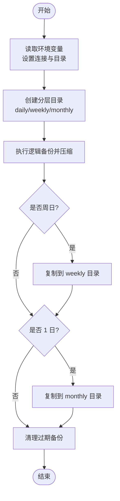
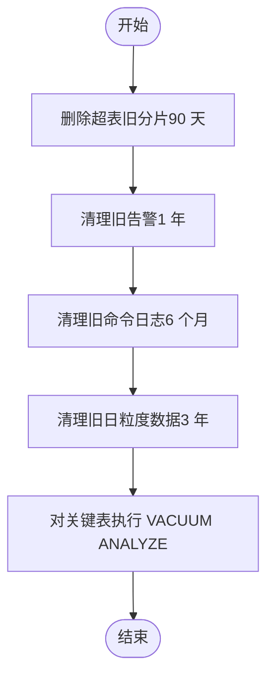
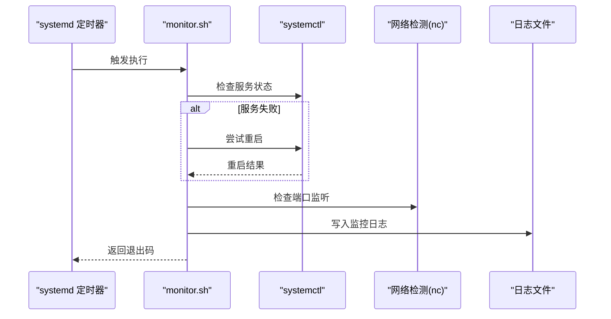
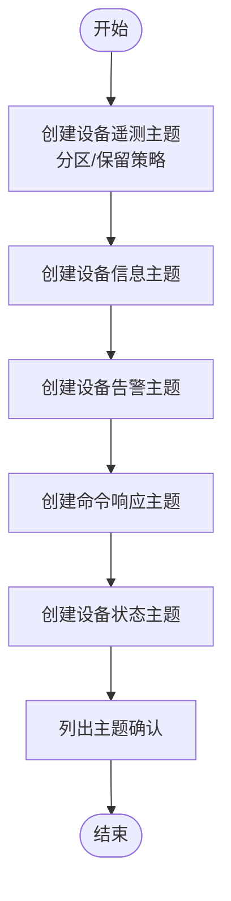
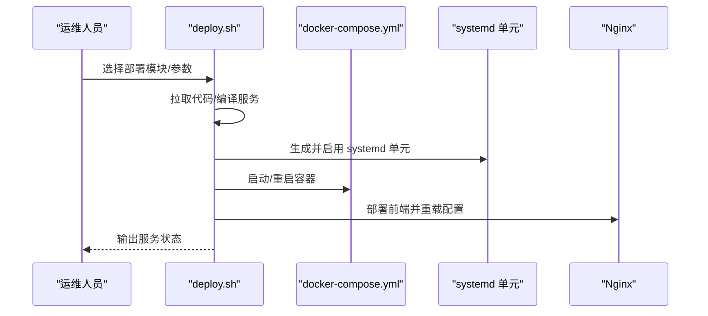
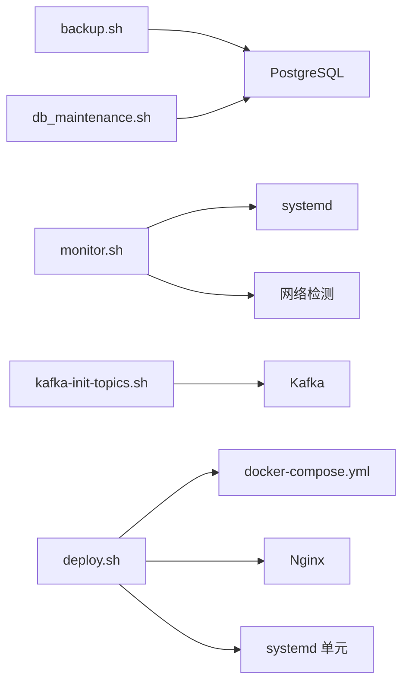

# 运维脚本

<cite>
**本文引用的文件**
- [backup.sh](file://deploy/scripts/backup.sh)
- [db_maintenance.sh](file://deploy/scripts/db_maintenance.sh)
- [kafka-init-topics.sh](file://deploy/kafka-init-topics.sh)
- [monitor.sh](file://deploy/monitor.sh)
- [deploy.sh](file://deploy/deploy.sh)
- [docker-compose.yml](file://deploy/docker-compose.yml)
- [api-server.yaml](file://deploy/configs/api-server.yaml)
- [device-server.yaml](file://deploy/configs/device-server.yaml)
- [gateway.yaml](file://deploy/configs/gateway.yaml)
- [inv-monitor.service](file://deploy/inv-monitor.service)
- [inv-git-poll.service](file://deploy/inv-git-poll.service)
- [inv-webhook.service](file://deploy/inv-webhook.service)
</cite>

## 目录
1. [简介](#简介)
2. [项目结构](#项目结构)
3. [核心组件](#核心组件)
4. [架构总览](#架构总览)
5. [详细组件分析](#详细组件分析)
6. [依赖分析](#依赖分析)
7. [性能考虑](#性能考虑)
8. [故障排查指南](#故障排查指南)
9. [结论](#结论)
10. [附录](#附录)

## 简介
本技术文档面向运维工程师与开发者，系统性梳理并说明本项目的各类运维脚本与配置，涵盖：
- 数据库备份脚本：功能、配置项、执行策略（全量/保留策略）、验证建议
- 数据库维护脚本：清理策略、压缩与统计、索引与空间回收
- 系统监控脚本：服务状态检查、资源使用监控、告警机制
- Kafka 主题初始化脚本：主题创建、分区与保留策略、权限设置
- 参数配置、定时任务、日志记录与安全执行策略
- 故障排查与性能优化建议，以及扩展与自定义开发指南

## 项目结构
运维相关脚本与配置主要位于 deploy 目录，配合 docker-compose 完成容器化部署；系统服务通过 systemd 管理与定时器调度。

图示来源
- [docker-compose.yml:1-274](file://deploy/docker-compose.yml#L1-L274)
- [api-server.yaml:1-60](file://deploy/configs/api-server.yaml#L1-L60)
- [device-server.yaml:1-57](file://deploy/configs/device-server.yaml#L1-L57)
- [gateway.yaml:1-41](file://deploy/configs/gateway.yaml#L1-L41)
- [inv-monitor.service:1-30](file://deploy/inv-monitor.service#L1-L30)
- [inv-git-poll.service:1-38](file://deploy/inv-git-poll.service#L1-L38)
- [inv-webhook.service:1-26](file://deploy/inv-webhook.service#L1-L26)
- [backup.sh:1-55](file://deploy/scripts/backup.sh#L1-L55)
- [db_maintenance.sh:1-43](file://deploy/scripts/db_maintenance.sh#L1-L43)
- [kafka-init-topics.sh:1-55](file://deploy/kafka-init-topics.sh#L1-L55)
- [monitor.sh:1-119](file://deploy/monitor.sh#L1-L119)
- [deploy.sh:1-229](file://deploy/deploy.sh#L1-L229)

章节来源
- [docker-compose.yml:1-274](file://deploy/docker-compose.yml#L1-L274)
- [deploy.sh:1-229](file://deploy/deploy.sh#L1-L229)

## 核心组件
- 备份脚本：基于逻辑备份生成压缩 SQL 文件，按日/周/月分层存储，并清理过期备份
- 维护脚本：针对 TimescaleDB 的超表进行分片删除、压缩策略、连续聚合刷新与 VACUUM ANALYZE
- 监控脚本：systemd 定时执行，检查服务与端口状态，采集内存/磁盘使用率并触发告警
- Kafka 初始化脚本：创建多个主题，配置分区数与保留策略，便于设备遥测、告警、命令等场景
- 部署脚本：支持按模块选择部署、编译 Go 服务、生成 systemd 单元、部署前端与 Nginx

章节来源
- [backup.sh:1-55](file://deploy/scripts/backup.sh#L1-L55)
- [db_maintenance.sh:1-43](file://deploy/scripts/db_maintenance.sh#L1-L43)
- [monitor.sh:1-119](file://deploy/monitor.sh#L1-L119)
- [kafka-init-topics.sh:1-55](file://deploy/kafka-init-topics.sh#L1-L55)
- [deploy.sh:1-229](file://deploy/deploy.sh#L1-L229)

## 架构总览
下图展示运维脚本与系统组件的交互关系，包括数据库、消息中间件、网关与各服务之间的依赖与调用路径。

图示来源
- [docker-compose.yml:1-274](file://deploy/docker-compose.yml#L1-L274)
- [backup.sh:1-55](file://deploy/scripts/backup.sh#L1-L55)
- [db_maintenance.sh:1-43](file://deploy/scripts/db_maintenance.sh#L1-L43)
- [monitor.sh:1-119](file://deploy/monitor.sh#L1-L119)
- [kafka-init-topics.sh:1-55](file://deploy/kafka-init-topics.sh#L1-L55)

## 详细组件分析

### 数据库备份脚本（backup.sh）
- 功能概述
  - 使用逻辑备份工具生成压缩 SQL 文件，按日/周/月分层归档
  - 支持保留策略：天级、周级、月级，自动清理过期备份
  - 通过环境变量注入连接参数，便于容器或外部部署复用
- 关键配置项
  - 数据库连接：主机、端口、用户、密码、库名
  - 备份目录与保留天数（日/周/月）
- 执行策略
  - 建议通过 cron 或 systemd timer 在每日固定时间运行
  - 周日复制到周级目录，每月 1 日复制到月级目录
- 备份验证建议
  - 建议在测试环境执行恢复演练，校验备份文件完整性与可恢复性
  - 结合监控与告警，确保备份任务执行成功并记录日志

图示来源
- [backup.sh:1-55](file://deploy/scripts/backup.sh#L1-L55)

章节来源
- [backup.sh:1-55](file://deploy/scripts/backup.sh#L1-L55)

### 数据库维护脚本（db_maintenance.sh）
- 功能概述
  - 针对 TimescaleDB 超表执行分片删除（保留 90 天），清理历史告警、命令日志与日粒度数据
  - 对受影响表执行 VACUUM ANALYZE，更新统计信息以优化查询计划
- 关键策略
  - 保留期：遥测 90 天、告警 1 年、命令日志 6 个月、日粒度数据 3 年
  - 仅对超表执行分片删除，非超表跳过
- 性能建议
  - 建议在业务低峰时段执行，避免影响在线写入
  - 结合压缩策略与连续聚合，提升长期存储效率

图示来源
- [db_maintenance.sh:1-43](file://deploy/scripts/db_maintenance.sh#L1-L43)

章节来源
- [db_maintenance.sh:1-43](file://deploy/scripts/db_maintenance.sh#L1-L43)

### 系统监控脚本（monitor.sh）
- 功能概述
  - 检查指定服务的运行状态，失败则尝试重启并二次确认
  - 检查关键端口（网关与 API 服务）监听状态
  - 采集内存与磁盘使用率，超过阈值触发告警
  - 记录统一日志文件，便于审计与问题定位
- 告警扩展
  - 当前脚本预留了邮件与企业微信/钉钉告警通道，可按需启用
- 定时执行
  - 通过 systemd timer 每分钟执行一次，建议结合服务单元文件启用

图示来源
- [monitor.sh:1-119](file://deploy/monitor.sh#L1-L119)
- [inv-monitor.service:1-30](file://deploy/inv-monitor.service#L1-L30)

章节来源
- [monitor.sh:1-119](file://deploy/monitor.sh#L1-L119)
- [inv-monitor.service:1-30](file://deploy/inv-monitor.service#L1-L30)

### Kafka 主题初始化脚本（kafka-init-topics.sh）
- 功能概述
  - 一键创建多类主题，适配设备遥测、信息、告警、命令响应与状态等场景
  - 设置分区数量与副本因子，配置保留时间与清理策略
- 主题与配置要点
  - 设备遥测：高频数据，较多分区，较短保留
  - 设备信息/告警：中低频，较少分区，较长保留
  - 命令响应/状态：短期数据，较短保留
- 权限设置
  - 当前脚本未包含 ACL 配置，如需访问控制，可在生产环境补充 ACL 策略

图示来源
- [kafka-init-topics.sh:1-55](file://deploy/kafka-init-topics.sh#L1-L55)

章节来源
- [kafka-init-topics.sh:1-55](file://deploy/kafka-init-topics.sh#L1-L55)

### 部署脚本与配置（deploy.sh、docker-compose.yml、配置文件）
- 部署脚本能力
  - 支持按模块选择部署（API/设备/前端/全部）
  - 自动编译 Go 服务，生成 systemd 单元并启动
  - 部署前端至 Nginx，配置反向代理
  - 提供查看日志与重启服务选项
- 容器编排要点
  - PostgreSQL/Redis/MQTT/Kafka/ZooKeeper/网关/API/设备/桥接等服务均在 compose 中定义
  - 环境变量覆盖数据库、缓存、JWT、邮件等配置
- 配置文件要点
  - API/设备/网关配置文件分别定义服务端口、数据库连接、Redis、JWT、日志与路由限流等

图示来源
- [deploy.sh:1-229](file://deploy/deploy.sh#L1-L229)
- [docker-compose.yml:1-274](file://deploy/docker-compose.yml#L1-L274)
- [api-server.yaml:1-60](file://deploy/configs/api-server.yaml#L1-L60)
- [device-server.yaml:1-57](file://deploy/configs/device-server.yaml#L1-L57)
- [gateway.yaml:1-41](file://deploy/configs/gateway.yaml#L1-L41)

章节来源
- [deploy.sh:1-229](file://deploy/deploy.sh#L1-L229)
- [docker-compose.yml:1-274](file://deploy/docker-compose.yml#L1-L274)
- [api-server.yaml:1-60](file://deploy/configs/api-server.yaml#L1-L60)
- [device-server.yaml:1-57](file://deploy/configs/device-server.yaml#L1-L57)
- [gateway.yaml:1-41](file://deploy/configs/gateway.yaml#L1-L41)

## 依赖分析
- 组件耦合
  - 备份与维护脚本依赖数据库连接参数与容器内可用的客户端工具
  - 监控脚本依赖 systemd 与网络连通性
  - Kafka 初始化脚本依赖 Kafka 容器健康状态
  - 部署脚本依赖 Git、Go 构建工具、Nginx 与 systemd
- 外部依赖
  - PostgreSQL/Redis/MQTT/Kafka/ZooKeeper
  - 系统工具：systemctl、nc、docker、docker-compose、psql/pg_dump

图示来源
- [backup.sh:1-55](file://deploy/scripts/backup.sh#L1-L55)
- [db_maintenance.sh:1-43](file://deploy/scripts/db_maintenance.sh#L1-L43)
- [monitor.sh:1-119](file://deploy/monitor.sh#L1-L119)
- [kafka-init-topics.sh:1-55](file://deploy/kafka-init-topics.sh#L1-L55)
- [deploy.sh:1-229](file://deploy/deploy.sh#L1-L229)
- [docker-compose.yml:1-274](file://deploy/docker-compose.yml#L1-L274)

章节来源
- [backup.sh:1-55](file://deploy/scripts/backup.sh#L1-L55)
- [db_maintenance.sh:1-43](file://deploy/scripts/db_maintenance.sh#L1-L43)
- [monitor.sh:1-119](file://deploy/monitor.sh#L1-L119)
- [kafka-init-topics.sh:1-55](file://deploy/kafka-init-topics.sh#L1-L55)
- [deploy.sh:1-229](file://deploy/deploy.sh#L1-L229)
- [docker-compose.yml:1-274](file://deploy/docker-compose.yml#L1-L274)

## 性能考虑
- 备份窗口与频率
  - 逻辑备份对数据库有一定压力，建议在低峰时段执行
  - 保留策略应平衡存储成本与恢复时间目标
- 维护窗口
  - 维护脚本涉及大范围 DELETE 与 VACUUM ANALYZE，建议安排在业务低谷
  - 对超表进行分片删除时，关注写入延迟与查询性能
- 监控开销
  - 定时器每分钟执行一次，建议合并检查项，避免重复 IO
- Kafka 主题分区
  - 高频主题适当增加分区以提升吞吐，但需平衡消费者组并发度
- 部署与回滚
  - 部署脚本支持按模块独立部署，便于灰度与快速回滚

## 故障排查指南
- 备份失败
  - 检查数据库连接参数与网络连通性
  - 确认备份目录权限与磁盘空间
  - 查看备份脚本日志，核对 pg_dump 输出
- 维护任务异常
  - 确认 TimescaleDB 超表存在与权限
  - 检查长时间事务阻塞导致的分片删除失败
- 监控告警
  - 检查 systemd 服务状态与定时器是否启用
  - 核对端口监听状态与防火墙规则
- Kafka 主题异常
  - 确认 Kafka 容器健康与 advertised.listeners 配置
  - 如需访问控制，补充 ACL 策略后重试
- 部署失败
  - 检查 Git 拉取、Go 构建与 Nginx 配置
  - 查看 systemd 单元日志与容器健康检查

章节来源
- [backup.sh:1-55](file://deploy/scripts/backup.sh#L1-L55)
- [db_maintenance.sh:1-43](file://deploy/scripts/db_maintenance.sh#L1-L43)
- [monitor.sh:1-119](file://deploy/monitor.sh#L1-L119)
- [kafka-init-topics.sh:1-55](file://deploy/kafka-init-topics.sh#L1-L55)
- [deploy.sh:1-229](file://deploy/deploy.sh#L1-L229)

## 结论
本项目提供了完善的运维脚本体系，覆盖数据库备份与维护、系统监控、Kafka 主题初始化与自动化部署。通过合理的参数配置、定时任务与日志记录，能够有效保障系统的稳定性与可恢复性。建议在生产环境中进一步完善权限控制、告警通道与恢复演练，持续优化备份与维护窗口，确保长期稳定运行。

## 附录

### 参数配置与环境变量
- 数据库连接
  - DB_HOST/DB_PORT/DB_USER/DB_PASSWORD/DB_NAME
- 备份目录与保留策略
  - BACKUP_DIR、RETENTION_DAILY/WEEKLY/MONTHLY
- 监控脚本
  - LOG_FILE、ALERT_EMAIL
- 部署脚本
  - APP_DIR/GIT_REPO/BUILD 参数与日志目录

章节来源
- [backup.sh:11-21](file://deploy/scripts/backup.sh#L11-L21)
- [db_maintenance.sh:12-17](file://deploy/scripts/db_maintenance.sh#L12-L17)
- [monitor.sh:9-11](file://deploy/monitor.sh#L9-L11)
- [deploy.sh:15-20](file://deploy/deploy.sh#L15-L20)

### 定时任务与 systemd 集成
- 服务监控定时器
  - 单元文件：/etc/systemd/system/inv-monitor.service
  - 定时器：每分钟执行一次
- Git 轮询部署定时器
  - 单元文件：/etc/systemd/system/inv-git-poll.service
  - 定时器：每 5 分钟检查一次
- Webhook 服务
  - 单元文件：/etc/systemd/system/inv-webhook.service
  - 常用命令：启用、启动、查看状态与日志

章节来源
- [inv-monitor.service:1-30](file://deploy/inv-monitor.service#L1-L30)
- [inv-git-poll.service:1-38](file://deploy/inv-git-poll.service#L1-L38)
- [inv-webhook.service:1-26](file://deploy/inv-webhook.service#L1-L26)

### 日志记录方法
- 备份脚本：标准输出即日志，建议重定向到持久化目录
- 维护脚本：标准输出即日志，建议重定向到持久化目录
- 监控脚本：统一写入 /var/log/inv-mqtt/monitor.log
- 部署脚本：systemd 标准输出/错误重定向到 /var/log/inv-mqtt/*.log

章节来源
- [backup.sh:29-37](file://deploy/scripts/backup.sh#L29-L37)
- [db_maintenance.sh:21-25](file://deploy/scripts/db_maintenance.sh#L21-L25)
- [monitor.sh:9-21](file://deploy/monitor.sh#L9-L21)
- [deploy.sh:100-123](file://deploy/deploy.sh#L100-L123)

### 安全执行策略与权限管理
- 最小权限原则
  - 备份与维护脚本仅授予必要数据库权限
  - 监控脚本仅使用 systemctl 查询与重启权限
- 环境变量与密钥
  - 通过环境变量注入敏感信息，避免硬编码
  - 生产环境建议使用密钥管理服务或容器编排平台的密文管理
- 访问控制
  - Kafka 初始化脚本未包含 ACL，生产环境需补充 ACL 策略
  - 网关与 API 服务启用 JWT 与 RBAC，限制访问与速率

章节来源
- [kafka-init-topics.sh:1-55](file://deploy/kafka-init-topics.sh#L1-L55)
- [gateway.yaml:38-41](file://deploy/configs/gateway.yaml#L38-L41)
- [docker-compose.yml:128-147](file://deploy/docker-compose.yml#L128-L147)

### 扩展与自定义开发指南
- 新增备份策略
  - 可在备份脚本中新增保留周期或分层策略，注意清理逻辑与存储成本
- 维护策略扩展
  - 可根据业务增长调整保留期与维护频率，加入连续聚合刷新
- 监控扩展
  - 可在监控脚本中增加更多指标采集与告警通道
- Kafka 主题扩展
  - 可按新业务场景新增主题，合理设置分区与保留策略
- 部署流程扩展
  - 可在部署脚本中增加灰度发布、蓝绿部署或金丝雀发布步骤