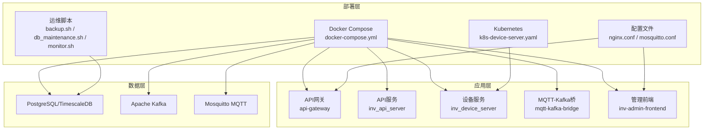
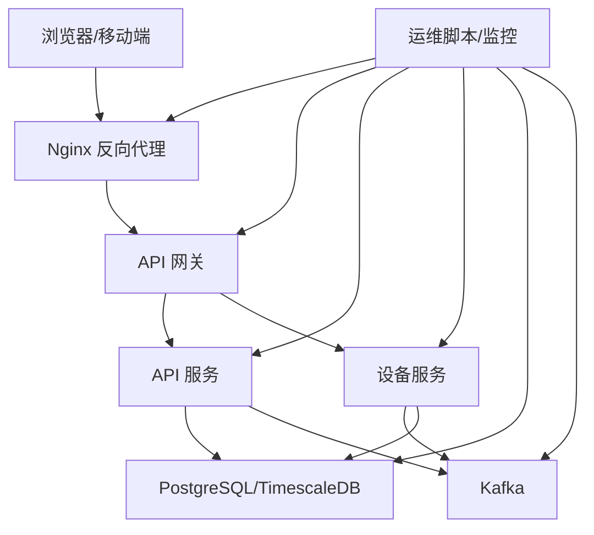
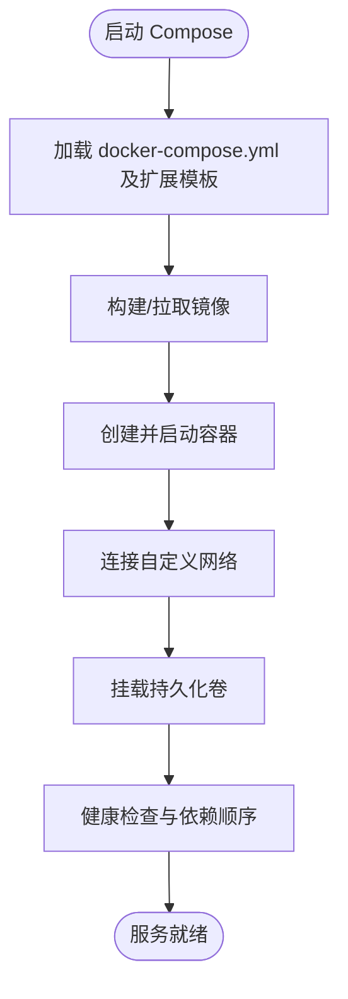
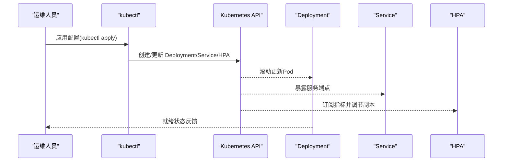
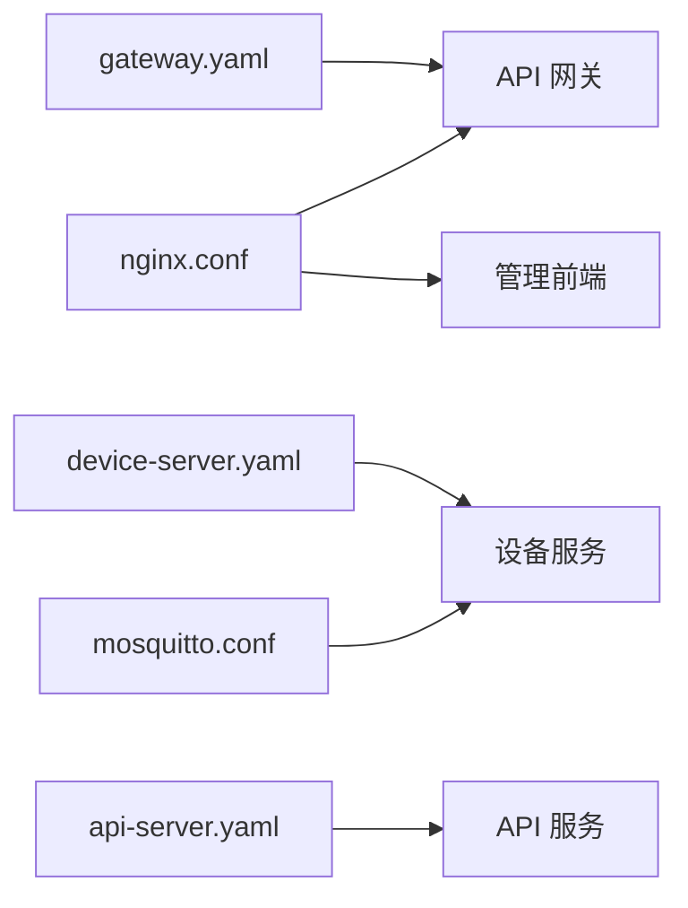
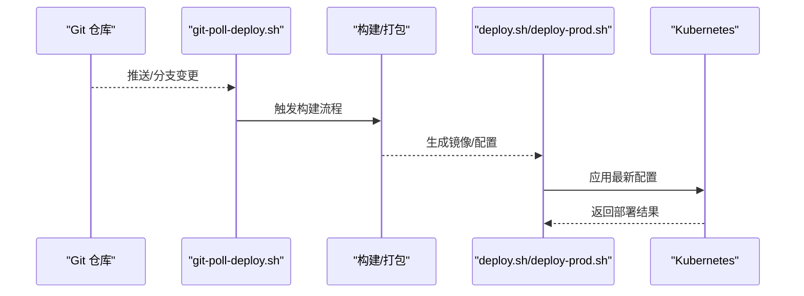
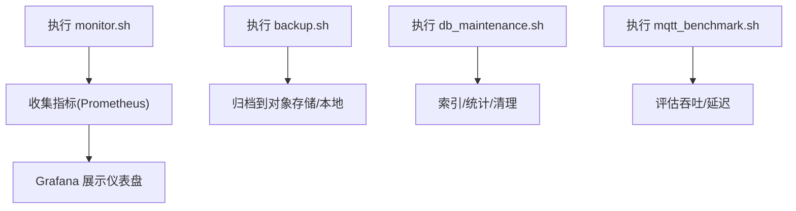
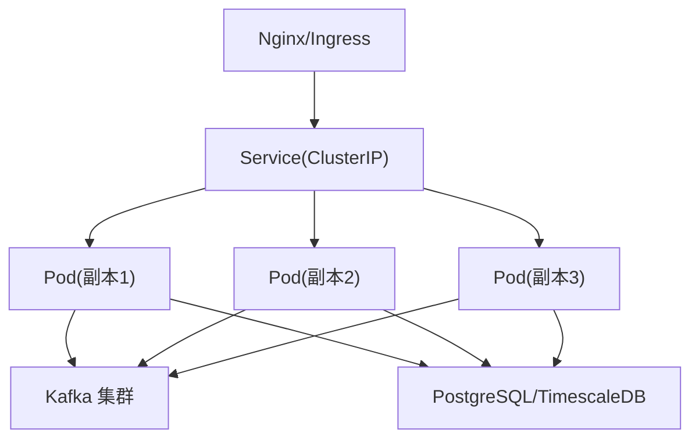
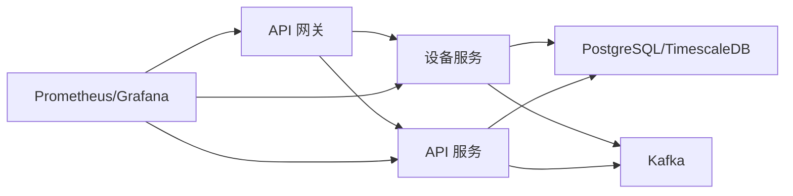

# 部署与运维

<cite>
**本文引用的文件**
- [deploy/README.md](file://deploy/README.md)
- [deploy/docker-compose.yml](file://deploy/docker-compose.yml)
- [deploy/docker-compose.full.yml](file://deploy/docker-compose.full.yml)
- [deploy/docker-compose.prod.yml](file://deploy/docker-compose.prod.yml)
- [deploy/docker-compose.bridge.yml](file://deploy/docker-compose.bridge.yml)
- [deploy/docker-compose.kafka.yml](file://deploy/docker-compose.kafka.yml)
- [deploy/docker-compose.kafka-bridge.yml](file://deploy/docker-compose.kafka-bridge.yml)
- [deploy/k8s-device-server.yaml](file://deploy/k8s-device-server.yaml)
- [deploy/configs/gateway.yaml](file://deploy/configs/gateway.yaml)
- [deploy/configs/api-server.yaml](file://deploy/configs/api-server.yaml)
- [deploy/configs/device-server.yaml](file://deploy/configs/device-server.yaml)
- [deploy/scripts/backup.sh](file://deploy/scripts/backup.sh)
- [deploy/scripts/db_maintenance.sh](file://deploy/scripts/db_maintenance.sh)
- [deploy/monitor.sh](file://deploy/monitor.sh)
- [deploy/prometheus.yml](file://deploy/prometheus.yml)
- [deploy/prometheus_alerts.yml](file://deploy/prometheus_alerts.yml)
- [deploy/grafana-dashboard.json](file://deploy/grafana-dashboard.json)
- [deploy/nginx.conf](file://deploy/nginx.conf)
- [deploy/mosquitto/mosquitto.conf](file://deploy/mosquitto/mosquitto.conf)
- [deploy/timescaledb/Dockerfile](file://deploy/timescaledb/Dockerfile)
- [deploy/deploy.sh](file://deploy/deploy.sh)
- [deploy/deploy-prod.sh](file://deploy/deploy-prod.sh)
- [deploy/git-poll-deploy.sh](file://deploy/git-poll-deploy.sh)
- [deploy/kafka-init-topics.sh](file://deploy/kafka-init-topics.sh)
- [api-gateway/main.go](file://api-gateway/main.go)
- [api-gateway/Dockerfile](file://api-gateway/Dockerfile)
- [api-gateway/config.docker.yaml](file://api-gateway/config.docker.yaml)
- [inv_api_server/cmd/main.go](file://inv_api_server/cmd/main.go)
- [inv_api_server/Dockerfile](file://inv_api_server/Dockerfile)
- [inv_api_server/config.docker.yaml](file://inv_api_server/config.docker.yaml)
- [inv_device_server/cmd/main.go](file://inv_device_server/cmd/main.go)
- [inv_device_server/Dockerfile](file://inv_device_server/Dockerfile)
- [inv_device_server/config.docker.yaml](file://inv_device_server/config.docker.yaml)
- [mqtt-kafka-bridge/main.go](file://mqtt-kafka-bridge/main.go)
- [mqtt-kafka-bridge/Dockerfile](file://mqtt-kafka-bridge/Dockerfile)
- [mqtt-kafka-bridge/config.docker.yaml](file://mqtt-kafka-bridge/config.docker.yaml)
- [inv-admin-frontend/Dockerfile](file://inv-admin-frontend/Dockerfile)
- [inv-admin-frontend/nginx.conf](file://inv-admin-frontend/nginx.conf)
- [database/schema.sql](file://database/schema.sql)
- [database/migrations/001_init_schema.up.sql](file://database/migrations/001_init_schema.up.sql)
- [database/migrations/002_add_performance_indexes.up.sql](file://database/migrations/002_add_performance_indexes.up.sql)
- [database/migrations/003_timescaledb_compression.up.sql](file://database/migrations/003_timescaledb_compression.up.sql)
- [database/migrations/004_add_energy_columns.up.sql](file://database/migrations/004_add_energy_columns.up.sql)
- [database/migrations/005_device_day_data_jsonb.up.sql](file://database/migrations/005_device_day_data_jsonb.up.sql)
</cite>

## 目录
1. [简介](#简介)
2. [项目结构](#项目结构)
3. [核心组件](#核心组件)
4. [架构总览](#架构总览)
5. [详细组件分析](#详细组件分析)
6. [依赖关系分析](#依赖关系分析)
7. [性能考虑](#性能考虑)
8. [故障排查指南](#故障排查指南)
9. [结论](#结论)
10. [附录](#附录)

## 简介
本文件面向运维与平台工程团队，系统性阐述该工业监控系统的容器化与云原生部署方案，覆盖以下主题：
- 基于 Docker 与 Docker Compose 的本地与生产级编排
- 基于 Kubernetes 的 Deployment、Service、HPA、ConfigMap 等资源配置
- CI/CD 流水线（Git Poll 轮询触发）与自动化部署
- 运维脚本（数据库备份、维护、监控、MQTT 压测等）
- 高可用部署架构（负载均衡、故障转移、灾难恢复）
- 性能调优（资源配置、网络与存储优化）
- 安全加固（网络安全、访问控制、数据保护）
- 日常运维操作指南（维护、故障处理、性能监控）

## 项目结构
该仓库采用多模块微服务架构，结合前端、后端服务、设备接入网关、消息桥接与数据库迁移脚本，形成完整的监控体系。部署相关的核心位置在 deploy 目录，包含：
- 编排与配置：Compose 模板、K8s 资源定义、Nginx/Mosquitto 配置
- 运维脚本：备份、维护、监控、压测、初始化脚本
- 数据库：Schema 与迁移脚本
- 各服务镜像：各 Go 微服务与前端均有独立 Dockerfile

图示来源
- [deploy/docker-compose.yml](file://deploy/docker-compose.yml)
- [deploy/k8s-device-server.yaml](file://deploy/k8s-device-server.yaml)
- [deploy/nginx.conf](file://deploy/nginx.conf)
- [deploy/mosquitto/mosquitto.conf](file://deploy/mosquitto/mosquitto.conf)
- [api-gateway/Dockerfile](file://api-gateway/Dockerfile)
- [inv_api_server/Dockerfile](file://inv_api_server/Dockerfile)
- [inv_device_server/Dockerfile](file://inv_device_server/Dockerfile)
- [mqtt-kafka-bridge/Dockerfile](file://mqtt-kafka-bridge/Dockerfile)
- [inv-admin-frontend/Dockerfile](file://inv-admin-frontend/Dockerfile)

章节来源
- [deploy/README.md](file://deploy/README.md)
- [deploy/docker-compose.yml](file://deploy/docker-compose.yml)

## 核心组件
- API 网关：统一入口，负责路由、鉴权、限流、日志与指标采集。
- API 服务：业务接口、权限校验、数据聚合与对外暴露。
- 设备服务：MQTT 接入、协议解析、数据落库与 Kafka 发送。
- MQTT-Kafka 桥：MQTT 到 Kafka 的消息桥接。
- 管理前端：静态资源与 Nginx 反向代理。
- 数据库：PostgreSQL + TimescaleDB（时序压缩与分区），配合迁移脚本。
- 消息系统：Kafka（用于设备数据异步处理）、Mosquitto（轻量 MQTT）。

章节来源
- [api-gateway/main.go](file://api-gateway/main.go)
- [inv_api_server/cmd/main.go](file://inv_api_server/cmd/main.go)
- [inv_device_server/cmd/main.go](file://inv_device_server/cmd/main.go)
- [mqtt-kafka-bridge/main.go](file://mqtt-kafka-bridge/main.go)
- [database/schema.sql](file://database/schema.sql)

## 架构总览
下图展示容器化与云原生部署下的总体交互关系：前端通过 Nginx 提供静态资源与反向代理；API 网关作为统一入口；后端服务通过数据库与消息系统协同工作；Kubernetes 用于生产级弹性伸缩与高可用。

图示来源
- [deploy/nginx.conf](file://deploy/nginx.conf)
- [deploy/k8s-device-server.yaml](file://deploy/k8s-device-server.yaml)
- [deploy/prometheus.yml](file://deploy/prometheus.yml)
- [deploy/prometheus_alerts.yml](file://deploy/prometheus_alerts.yml)

## 详细组件分析

### Docker Compose 编排
- 多环境模板：提供基础、完整、生产、桥接、Kafka 等多种 compose 模板，便于按需组合。
- 服务定义：包含网关、API 服务、设备服务、MQTT 桥、Kafka、Zookeeper、PostgreSQL、TimescaleDB、Mosquitto、Grafana、Prometheus 等。
- 网络配置：自定义网络隔离，确保服务间通信稳定。
- 数据卷管理：数据库与日志目录持久化，避免容器重建丢失数据。
- 环境变量与配置：通过 config.docker.yaml 注入运行时参数。

图示来源
- [deploy/docker-compose.yml](file://deploy/docker-compose.yml)
- [deploy/docker-compose.full.yml](file://deploy/docker-compose.full.yml)
- [deploy/docker-compose.prod.yml](file://deploy/docker-compose.prod.yml)
- [deploy/docker-compose.bridge.yml](file://deploy/docker-compose.bridge.yml)
- [deploy/docker-compose.kafka.yml](file://deploy/docker-compose.kafka.yml)
- [deploy/docker-compose.kafka-bridge.yml](file://deploy/docker-compose.kafka-bridge.yml)

章节来源
- [deploy/docker-compose.yml](file://deploy/docker-compose.yml)
- [deploy/docker-compose.full.yml](file://deploy/docker-compose.full.yml)
- [deploy/docker-compose.prod.yml](file://deploy/docker-compose.prod.yml)
- [deploy/docker-compose.bridge.yml](file://deploy/docker-compose.bridge.yml)
- [deploy/docker-compose.kafka.yml](file://deploy/docker-compose.kafka.yml)
- [deploy/docker-compose.kafka-bridge.yml](file://deploy/docker-compose.kafka-bridge.yml)

### Kubernetes 部署策略
- Deployment：定义副本数、滚动更新策略、探针与资源限制。
- Service：ClusterIP/NodePort/LB 类型选择，端口映射与会话亲和。
- HPA：基于 CPU/内存或自定义指标进行自动扩缩容。
- ConfigMap：注入配置（如日志级别、数据库连接串、Kafka 地址）。
- 其他：Secret（敏感信息）、PVC（持久化存储）、Ingress（外部访问）。

图示来源
- [deploy/k8s-device-server.yaml](file://deploy/k8s-device-server.yaml)

章节来源
- [deploy/k8s-device-server.yaml](file://deploy/k8s-device-server.yaml)

### 配置文件与服务发现
- Nginx：反向代理与静态资源分发，支持 HTTPS 与缓存。
- Mosquitto：MQTT 服务配置，含认证与 ACL 示例。
- 各服务 config.docker.yaml：数据库连接、Kafka 地址、日志级别、鉴权开关等。

图示来源
- [deploy/nginx.conf](file://deploy/nginx.conf)
- [deploy/mosquitto/mosquitto.conf](file://deploy/mosquitto/mosquitto.conf)
- [deploy/configs/gateway.yaml](file://deploy/configs/gateway.yaml)
- [deploy/configs/api-server.yaml](file://deploy/configs/api-server.yaml)
- [deploy/configs/device-server.yaml](file://deploy/configs/device-server.yaml)

章节来源
- [deploy/nginx.conf](file://deploy/nginx.conf)
- [deploy/mosquitto/mosquitto.conf](file://deploy/mosquitto/mosquitto.conf)
- [deploy/configs/gateway.yaml](file://deploy/configs/gateway.yaml)
- [deploy/configs/api-server.yaml](file://deploy/configs/api-server.yaml)
- [deploy/configs/device-server.yaml](file://deploy/configs/device-server.yaml)

### CI/CD 与自动化部署
- Git Poll 轮询：通过 git-poll-deploy.sh 定时检测代码变更并触发部署。
- 部署脚本：deploy.sh 与 deploy-prod.sh 支持不同环境一键部署。
- Kafka 初始化：kafka-init-topics.sh 在首次部署时创建 Topic。

图示来源
- [deploy/git-poll-deploy.sh](file://deploy/git-poll-deploy.sh)
- [deploy/deploy.sh](file://deploy/deploy.sh)
- [deploy/deploy-prod.sh](file://deploy/deploy-prod.sh)
- [deploy/kafka-init-topics.sh](file://deploy/kafka-init-topics.sh)

章节来源
- [deploy/git-poll-deploy.sh](file://deploy/git-poll-deploy.sh)
- [deploy/deploy.sh](file://deploy/deploy.sh)
- [deploy/deploy-prod.sh](file://deploy/deploy-prod.sh)
- [deploy/kafka-init-topics.sh](file://deploy/kafka-init-topics.sh)

### 运维脚本与监控
- 备份脚本：backup.sh 执行数据库逻辑备份，支持增量与保留策略。
- 维护脚本：db_maintenance.sh 执行索引重建、统计更新、表清理等。
- 监控脚本：monitor.sh 收集服务状态、资源占用与健康指标。
- Prometheus：prometheus.yml 定义抓取目标与规则。
- Grafana：grafana-dashboard.json 导入仪表盘。
- MQTT 压测：mqtt_benchmark.sh 用于评估消息吞吐与延迟。

图示来源
- [deploy/monitor.sh](file://deploy/monitor.sh)
- [deploy/scripts/backup.sh](file://deploy/scripts/backup.sh)
- [deploy/scripts/db_maintenance.sh](file://deploy/scripts/db_maintenance.sh)
- [deploy/prometheus.yml](file://deploy/prometheus.yml)
- [deploy/prometheus_alerts.yml](file://deploy/prometheus_alerts.yml)
- [deploy/grafana-dashboard.json](file://deploy/grafana-dashboard.json)
- [deploy/mqtt_benchmark.sh](file://deploy/mqtt_benchmark.sh)

章节来源
- [deploy/monitor.sh](file://deploy/monitor.sh)
- [deploy/scripts/backup.sh](file://deploy/scripts/backup.sh)
- [deploy/scripts/db_maintenance.sh](file://deploy/scripts/db_maintenance.sh)
- [deploy/prometheus.yml](file://deploy/prometheus.yml)
- [deploy/prometheus_alerts.yml](file://deploy/prometheus_alerts.yml)
- [deploy/grafana-dashboard.json](file://deploy/grafana-dashboard.json)
- [deploy/mqtt_benchmark.sh](file://deploy/mqtt_benchmark.sh)

### 高可用部署架构
- 负载均衡：Nginx 作为 L7 反向代理，Kubernetes Service 作为 L4 负载均衡。
- 故障转移：多副本部署，健康检查失败自动替换；Kafka/Zookeeper 集群保证消息系统高可用。
- 灾难恢复：数据库备份脚本与恢复流程；K8s 副本与持久化卷保障服务与数据恢复。
- 网络隔离：自定义 bridge 网络与防火墙策略，限制不必要的端口暴露。

图示来源
- [deploy/docker-compose.bridge.yml](file://deploy/docker-compose.bridge.yml)
- [deploy/k8s-device-server.yaml](file://deploy/k8s-device-server.yaml)

章节来源
- [deploy/docker-compose.bridge.yml](file://deploy/docker-compose.bridge.yml)
- [deploy/k8s-device-server.yaml](file://deploy/k8s-device-server.yaml)

### 性能调优指南
- 资源配置：为各 Pod 设置 requests/limits，避免资源争抢；对 TimescaleDB 与时序查询设置专用资源池。
- 网络优化：减少跨节点流量，合理使用 Headless Service；启用连接复用与超时重试。
- 存储管理：使用 SSD/NVMe 提升 IO；开启 WAL 归档与快照；对 Kafka 分区与副本进行容量规划。
- 查询优化：基于迁移脚本中的索引与压缩策略，定期评估慢查询并调整。

章节来源
- [database/migrations/001_init_schema.up.sql](file://database/migrations/001_init_schema.up.sql)
- [database/migrations/002_add_performance_indexes.up.sql](file://database/migrations/002_add_performance_indexes.up.sql)
- [database/migrations/003_timescaledb_compression.up.sql](file://database/migrations/003_timescaledb_compression.up.sql)
- [database/migrations/004_add_energy_columns.up.sql](file://database/migrations/004_add_energy_columns.up.sql)
- [database/migrations/005_device_day_data_jsonb.up.sql](file://database/migrations/005_device_day_data_jsonb.up.sql)

### 安全加固措施
- 网络安全：仅开放必要端口；使用防火墙与网络策略；TLS 终止于 Nginx/Ingress。
- 访问控制：API 网关集成 JWT 与 RBAC；Mosquitto 配置用户与 ACL；Kafka 开启 SASL/SSL。
- 数据保护：数据库连接使用加密；备份文件加密存储；敏感配置放入 Secret。
- 镜像与运行时：最小化基础镜像；非 root 用户运行；只读根文件系统；禁用不必要能力。

章节来源
- [api-gateway/internal/middleware/jwt.go](file://api-gateway/internal/middleware/jwt.go)
- [api-gateway/internal/middleware/rbac.go](file://api-gateway/internal/middleware/rbac.go)
- [deploy/mosquitto/mosquitto.conf](file://deploy/mosquitto/mosquitto.conf)
- [deploy/configs/gateway.yaml](file://deploy/configs/gateway.yaml)

## 依赖关系分析
- 服务耦合：设备服务依赖 Kafka 与数据库；API 服务依赖数据库与 Kafka；网关作为统一入口。
- 外部依赖：PostgreSQL/TimescaleDB、Kafka、Mosquitto、Grafana/Prometheus。
- 配置契约：各服务通过 config.docker.yaml 与 ConfigMap 注入配置，避免硬编码。

图示来源
- [api-gateway/main.go](file://api-gateway/main.go)
- [inv_api_server/cmd/main.go](file://inv_api_server/cmd/main.go)
- [inv_device_server/cmd/main.go](file://inv_device_server/cmd/main.go)
- [deploy/prometheus.yml](file://deploy/prometheus.yml)

章节来源
- [api-gateway/main.go](file://api-gateway/main.go)
- [inv_api_server/cmd/main.go](file://inv_api_server/cmd/main.go)
- [inv_device_server/cmd/main.go](file://inv_device_server/cmd/main.go)
- [deploy/prometheus.yml](file://deploy/prometheus.yml)

## 性能考虑
- 数据库层面：利用 TimescaleDB 压缩与分区；按迁移脚本建立索引；定期维护统计信息。
- 消息系统：合理设置分区数量与副本；开启压缩；消费组隔离与背压控制。
- 应用层面：启用连接池与批量写入；对高频接口增加缓存；限流与熔断。
- 监控与告警：完善指标采集与阈值告警，提前发现瓶颈。

章节来源
- [database/migrations/003_timescaledb_compression.up.sql](file://database/migrations/003_timescaledb_compression.up.sql)
- [database/migrations/002_add_performance_indexes.up.sql](file://database/migrations/002_add_performance_indexes.up.sql)
- [deploy/prometheus.yml](file://deploy/prometheus.yml)
- [deploy/prometheus_alerts.yml](file://deploy/prometheus_alerts.yml)

## 故障排查指南
- 健康检查失败：查看 Pod 事件与日志；确认数据库/Kafka 可达性；检查配置是否正确。
- 数据不一致：核对 Kafka 消费位点与数据库事务；执行备份与回放验证。
- 性能退化：使用 monitor.sh 与 Grafana 查看 CPU/IO/网络；定位慢查询与热点分区。
- 备份异常：检查 backup.sh 权限与存储空间；验证恢复流程。
- MQTT 丢包：使用 mqtt_benchmark.sh 压测；检查 Mosquitto 与网络带宽。

章节来源
- [deploy/monitor.sh](file://deploy/monitor.sh)
- [deploy/scripts/backup.sh](file://deploy/scripts/backup.sh)
- [deploy/mqtt_benchmark.sh](file://deploy/mqtt_benchmark.sh)

## 结论
本方案以 Docker Compose 快速搭建与验证，以 Kubernetes 实现生产级弹性与高可用。通过完善的 CI/CD、运维脚本与监控告警体系，可有效支撑工业监控场景的持续交付与稳定运行。建议在生产中进一步强化安全基线、容量规划与灾备演练。

## 附录
- TimescaleDB 自定义镜像：用于特定版本或内核参数定制。
- 前端镜像：基于 Nginx 静态托管，简化部署与缓存策略。

章节来源
- [deploy/timescaledb/Dockerfile](file://deploy/timescaledb/Dockerfile)
- [inv-admin-frontend/Dockerfile](file://inv-admin-frontend/Dockerfile)