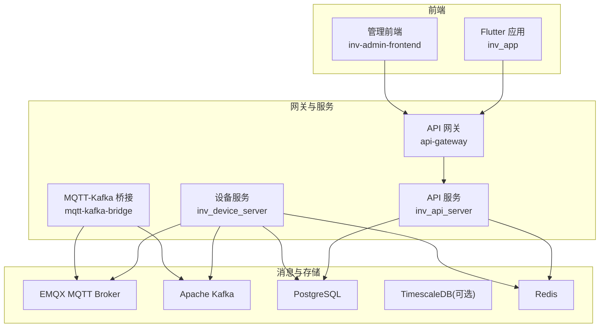
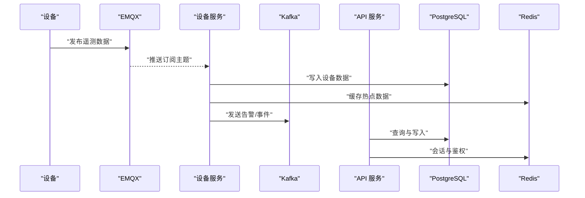
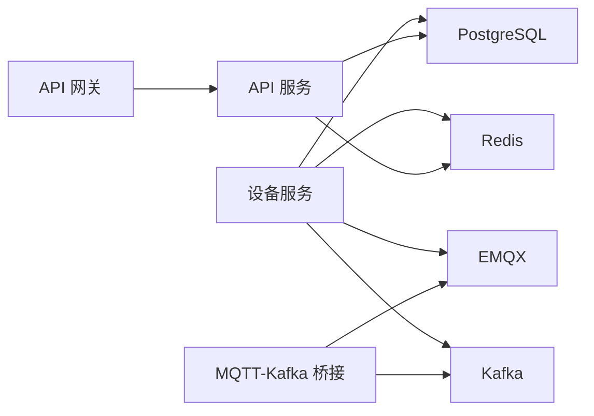

# 快速开始

<cite>
**本文引用的文件**
- [README.md](file://README.md)
- [deploy/README.md](file://deploy/README.md)
- [start_all.bat](file://start_all.bat)
- [deploy/docker-compose.yml](file://deploy/docker-compose.yml)
- [deploy/docker-compose.full.yml](file://deploy/docker-compose.full.yml)
- [deploy/docker-compose.prod.yml](file://deploy/docker-compose.prod.yml)
- [deploy/docker-compose.bridge.yml](file://deploy/docker-compose.bridge.yml)
- [deploy/docker-compose.kafka-bridge.yml](file://deploy/docker-compose.kafka-bridge.yml)
- [deploy/docker-compose.kafka.yml](file://deploy/docker-compose.kafka.yml)
- [database/schema.sql](file://database/schema.sql)
- [database/migration_timescaledb.sql](file://database/migration_timescaledb.sql)
- [database/migrations/001_init_schema.up.sql](file://database/migrations/001_init_schema.up.sql)
- [database/migrations/002_add_performance_indexes.up.sql](file://database/migrations/002_add_performance_indexes.up.sql)
- [database/migrations/003_timescaledb_compression.up.sql](file://database/migrations/003_timescaledb_compression.up.sql)
- [database/migrations/004_add_energy_columns.up.sql](file://database/migrations/004_add_energy_columns.up.sql)
- [database/migrations/005_device_day_data_jsonb.up.sql](file://database/migrations/005_device_day_data_jsonb.up.sql)
- [deploy/mosquitto/mosquitto.conf](file://deploy/mosquitto/mosquitto.conf)
- [deploy/configs/gateway.yaml](file://deploy/configs/gateway.yaml)
- [deploy/configs/api-server.yaml](file://deploy/configs/api-server.yaml)
- [deploy/configs/device-server.yaml](file://deploy/configs/device-server.yaml)
- [inv_api_server/cmd/main.go](file://inv_api_server/cmd/main.go)
- [inv_api_server/internal/config/config.go](file://inv_api_server/internal/config/config.go)
- [inv_device_server/cmd/main.go](file://inv_device_server/cmd/main.go)
- [inv_device_server/internal/config/config.go](file://inv_device_server/internal/config/config.go)
- [api-gateway/main.go](file://api-gateway/main.go)
- [api-gateway/internal/config/config.go](file://api-gateway/internal/config/config.go)
- [inv_app/pubspec.yaml](file://inv_app/pubspec.yaml)
- [inv_app/README.md](file://inv_app/README.md)
- [inv-admin-frontend/package.json](file://inv-admin-frontend/package.json)
- [deploy/deploy.sh](file://deploy/deploy.sh)
- [deploy/deploy-prod.sh](file://deploy/deploy-prod.sh)
- [deploy/create_admin.sql](file://deploy/create_admin.sql)
- [deploy/create_device_models.sql](file://deploy/create_device_models.sql)
- [deploy/create_model_tables.sql](file://deploy/create_model_tables.sql)
- [deploy/nginx.conf](file://deploy/nginx.conf)
- [deploy/prometheus.yml](file://deploy/prometheus.yml)
- [deploy/prometheus_alerts.yml](file://deploy/prometheus_alerts.yml)
- [deploy/grafana-dashboard.json](file://deploy/grafana-dashboard.json)
</cite>

## 目录
1. [简介](#简介)
2. [项目结构](#项目结构)
3. [核心组件](#核心组件)
4. [架构总览](#架构总览)
5. [详细组件分析](#详细组件分析)
6. [依赖关系分析](#依赖关系分析)
7. [性能考虑](#性能考虑)
8. [故障排除指南](#故障排除指南)
9. [结论](#结论)
10. [附录](#附录)

## 简介
本指南面向初学者，提供 INV-MQTT 系统从零开始的完整部署体验。您将完成以下目标：安装并配置 Flutter、Go、PostgreSQL、Redis、EMQX；初始化数据库（含 TimescaleDB 可选）；配置 EMQX JWT 认证；启动后端服务（Device Server 和 API Server）；运行 Flutter 应用；了解一键启动脚本与 Docker Compose 部署方案。

## 项目结构
该仓库采用多模块分层组织方式：
- 后端服务
  - 设备数据采集与处理：inv_device_server
  - API 服务：inv_api_server
  - API 网关：api-gateway
  - Kafka 桥接：mqtt-kafka-bridge
- 前端
  - 设备端 Flutter 应用：inv_app
  - 管理前端：inv-admin-frontend
- 数据库与迁移
  - schema.sql 与多版本迁移脚本
  - TimescaleDB 压缩与分区配置
- 部署与运维
  - 多套 docker-compose 编排
  - Nginx、Prometheus、Grafana、EMQX 配置
  - 初始化 SQL 脚本

图示来源
- [deploy/docker-compose.yml](file://deploy/docker-compose.yml)
- [deploy/docker-compose.full.yml](file://deploy/docker-compose.full.yml)
- [deploy/docker-compose.prod.yml](file://deploy/docker-compose.prod.yml)
- [deploy/docker-compose.bridge.yml](file://deploy/docker-compose.bridge.yml)
- [deploy/docker-compose.kafka-bridge.yml](file://deploy/docker-compose.kafka-bridge.yml)
- [deploy/docker-compose.kafka.yml](file://deploy/docker-compose.kafka.yml)

章节来源
- [README.md](file://README.md)
- [deploy/README.md](file://deploy/README.md)

## 核心组件
- 设备服务（inv_device_server）
  - 负责订阅 EMQX 主题，解析协议，写入 PostgreSQL/Redis，并通过 Kafka 发送告警等事件。
- API 服务（inv_api_server）
  - 提供 REST 接口，鉴权基于 JWT，权限控制基于 RBAC，数据持久化至 PostgreSQL。
- API 网关（api-gateway）
  - 统一入口，集成 CORS、日志、限流、RBAC、Prometheus 指标与 JWT 中间件。
- MQTT-Kafka 桥接（mqtt-kafka-bridge）
  - 将 EMQX 的 MQTT 消息桥接到 Kafka，便于异步处理与扩展。
- 前端应用
  - 设备端 Flutter 应用与管理前端，分别用于设备侧监控与后台管理。

章节来源
- [inv_device_server/cmd/main.go](file://inv_device_server/cmd/main.go)
- [inv_device_server/internal/config/config.go](file://inv_device_server/internal/config/config.go)
- [inv_api_server/cmd/main.go](file://inv_api_server/cmd/main.go)
- [inv_api_server/internal/config/config.go](file://inv_api_server/internal/config/config.go)
- [api-gateway/main.go](file://api-gateway/main.go)
- [api-gateway/internal/config/config.go](file://api-gateway/internal/config/config.go)
- [mqtt-kafka-bridge/main.go](file://mqtt-kafka-bridge/main.go)

## 架构总览
下图展示从设备到数据库与外部系统的整体数据流：

图示来源
- [deploy/docker-compose.yml](file://deploy/docker-compose.yml)
- [deploy/docker-compose.full.yml](file://deploy/docker-compose.full.yml)
- [deploy/docker-compose.kafka.yml](file://deploy/docker-compose.kafka.yml)
- [inv_device_server/internal/config/config.go](file://inv_device_server/internal/config/config.go)
- [inv_api_server/internal/config/config.go](file://inv_api_server/internal/config/config.go)

## 详细组件分析

### 环境准备与安装
- Flutter
  - 安装 Flutter SDK 并配置开发环境（Android Studio 或 VSCode 插件），确保可构建 iOS/Android/Wear OS 平台。
  - 项目中包含 inv_app 与 inv-admin-frontend，分别对应设备端与管理端前端。
- Go
  - 安装 Go 1.21+，确保 GOPATH 与 PATH 正确配置。
- 数据库
  - PostgreSQL 14+（推荐启用 TimescaleDB 扩展以支持时序数据压缩与分区）。
  - Redis 6+（用于会话、缓存与鉴权状态）。
- 消息中间件
  - EMQX 企业版或开源版（需启用 JWT 认证与规则引擎）。
  - Apache Kafka（可选，用于桥接与异步处理）。

章节来源
- [inv_app/pubspec.yaml](file://inv_app/pubspec.yaml)
- [inv_app/README.md](file://inv_app/README.md)
- [inv-admin-frontend/package.json](file://inv-admin-frontend/package.json)

### 数据库初始化
- 创建数据库与用户
  - 使用 PostgreSQL 创建数据库与专用用户，并授予必要权限。
- 执行 schema.sql
  - 运行根目录下的 schema.sql 初始化基础表结构。
- 执行迁移脚本
  - 按顺序执行 database/migrations 下的 up.sql 文件，完成索引、TimescaleDB 压缩、新增字段等演进。
- TimescaleDB 可选配置
  - 如需时序数据压缩与分区，参考 database/migration_timescaledb.sql 与相关迁移脚本。
- 初始化数据
  - 运行 deploy/create_admin.sql、create_device_models.sql、create_model_tables.sql 创建管理员账户、设备模型与表。

章节来源
- [database/schema.sql](file://database/schema.sql)
- [database/migration_timescaledb.sql](file://database/migration_timescaledb.sql)
- [database/migrations/001_init_schema.up.sql](file://database/migrations/001_init_schema.up.sql)
- [database/migrations/002_add_performance_indexes.up.sql](file://database/migrations/002_add_performance_indexes.up.sql)
- [database/migrations/003_timescaledb_compression.up.sql](file://database/migrations/003_timescaledb_compression.up.sql)
- [database/migrations/004_add_energy_columns.up.sql](file://database/migrations/004_add_energy_columns.up.sql)
- [database/migrations/005_device_day_data_jsonb.up.sql](file://database/migrations/005_device_day_data_jsonb.up.sql)
- [deploy/create_admin.sql](file://deploy/create_admin.sql)
- [deploy/create_device_models.sql](file://deploy/create_device_models.sql)
- [deploy/create_model_tables.sql](file://deploy/create_model_tables.sql)

### EMQX JWT 认证配置
- 启用 JWT 中间件
  - 在 EMQX 中启用 JWT 认证插件，并配置公钥/私钥对。
- 规则引擎
  - 使用规则引擎将认证结果映射到连接属性（如 clientid、username、租户信息），以便后端服务识别设备身份。
- MQTT 权限
  - 配置订阅/发布权限，限制设备仅能访问自身主题命名空间。
- 配置文件参考
  - 参考 deploy/mosquitto/mosquitto.conf 获取 MQTT 服务配置思路（实际部署请在 EMQX 控制台或配置文件中完成相应设置）。

章节来源
- [deploy/mosquitto/mosquitto.conf](file://deploy/mosquitto/mosquitto.conf)

### 后端服务启动步骤
- 启动顺序建议
  1) 启动数据库（PostgreSQL）、Redis、Kafka（如启用）、EMQX。
  2) 启动设备服务（inv_device_server），使其连接 EMQX/Kafka 并写入数据库。
  3) 启动 API 服务（inv_api_server），提供 REST 接口。
  4) 启动 API 网关（api-gateway），统一对外暴露接口。
  5) 启动 MQTT-Kafka 桥接（如启用）。
- 关键配置项
  - 数据库连接字符串、Redis 地址、Kafka 地址、EMQX 地址与认证信息。
  - JWT 公钥路径、网关路由与中间件开关。
- 配置文件位置
  - 各服务均提供 config.docker.yaml 与内部 config.go，按需加载环境变量或文件。

章节来源
- [inv_device_server/internal/config/config.go](file://inv_device_server/internal/config/config.go)
- [inv_api_server/internal/config/config.go](file://inv_api_server/internal/config/config.go)
- [api-gateway/internal/config/config.go](file://api-gateway/internal/config/config.go)
- [inv_device_server/cmd/main.go](file://inv_device_server/cmd/main.go)
- [inv_api_server/cmd/main.go](file://inv_api_server/cmd/main.go)
- [api-gateway/main.go](file://api-gateway/main.go)

### Flutter 应用运行方法
- 安装依赖
  - 在 inv_app 根目录执行包管理器安装命令，拉取 Dart 依赖。
- 连接后端
  - 修改 Flutter 代码中的 API 网关地址与 MQTT Broker 地址，确保与本地/容器网络一致。
- 运行与调试
  - 支持运行到模拟器或真机，注意 iOS/Android 的网络权限与证书配置。
- 常见问题
  - 网络不可达：检查 API 网关与 MQTT Broker 是否在同一网络或已开放端口。
  - 证书错误：iOS 需要正确配置开发证书，Android 需允许明文流量或使用自签证书。

章节来源
- [inv_app/pubspec.yaml](file://inv_app/pubspec.yaml)
- [inv_app/README.md](file://inv_app/README.md)

### 一键启动脚本与 Docker Compose
- 一键启动脚本
  - Windows：双击 start_all.bat，自动拉起 docker-compose 编排的服务栈。
- Docker Compose 方案
  - 开发环境：deploy/docker-compose.yml
  - 完整环境：deploy/docker-compose.full.yml
  - 生产环境：deploy/docker-compose.prod.yml
  - 桥接模式：deploy/docker-compose.bridge.yml、deploy/docker-compose.kafka-bridge.yml
  - Kafka 单独编排：deploy/docker-compose.kafka.yml
- Nginx、Prometheus、Grafana
  - 参考 deploy/nginx.conf、prometheus.yml、prometheus_alerts.yml、grafana-dashboard.json 进行可视化与监控配置。

章节来源
- [start_all.bat](file://start_all.bat)
- [deploy/docker-compose.yml](file://deploy/docker-compose.yml)
- [deploy/docker-compose.full.yml](file://deploy/docker-compose.full.yml)
- [deploy/docker-compose.prod.yml](file://deploy/docker-compose.prod.yml)
- [deploy/docker-compose.bridge.yml](file://deploy/docker-compose.bridge.yml)
- [deploy/docker-compose.kafka-bridge.yml](file://deploy/docker-compose.kafka-bridge.yml)
- [deploy/docker-compose.kafka.yml](file://deploy/docker-compose.kafka.yml)
- [deploy/nginx.conf](file://deploy/nginx.conf)
- [deploy/prometheus.yml](file://deploy/prometheus.yml)
- [deploy/prometheus_alerts.yml](file://deploy/prometheus_alerts.yml)
- [deploy/grafana-dashboard.json](file://deploy/grafana-dashboard.json)

## 依赖关系分析
- 服务间耦合
  - 设备服务依赖 EMQX/Kafka/数据库/Redis；API 服务依赖数据库/Redis；网关作为统一入口。
- 外部依赖
  - PostgreSQL/TimescaleDB、Redis、Kafka、EMQX、Nginx/Prometheus/Grafana。
- 配置契约
  - 各服务通过 config.go 读取配置，确保数据库、缓存、消息队列与认证参数一致。

图示来源
- [deploy/docker-compose.yml](file://deploy/docker-compose.yml)
- [inv_device_server/internal/config/config.go](file://inv_device_server/internal/config/config.go)
- [inv_api_server/internal/config/config.go](file://inv_api_server/internal/config/config.go)
- [api-gateway/internal/config/config.go](file://api-gateway/internal/config/config.go)

## 性能考虑
- TimescaleDB 压缩与分区
  - 对时序数据启用压缩策略与分区，提升查询与存储效率。
- 索引优化
  - 按迁移脚本创建高性能索引，减少查询延迟。
- 缓存策略
  - Redis 用于热点数据与会话缓存，降低数据库压力。
- 监控与告警
  - Prometheus + Grafana 实时观测系统指标，结合告警规则及时发现异常。

## 故障排除指南
- 数据库无法连接
  - 检查 PostgreSQL/Redis 地址、端口与凭据是否正确；确认容器网络连通性。
- 设备无法上报数据
  - 确认 EMQX 认证与主题权限配置；检查设备服务日志与 Kafka 连接状态。
- API 返回鉴权失败
  - 检查 JWT 公钥路径与签名算法；确认网关中间件已启用。
- 前端无法登录
  - 检查 API 网关代理配置与跨域设置；确认管理员账户已初始化。
- 性能瓶颈
  - 分析 Prometheus 指标，定位慢查询与高延迟接口；评估 TimescaleDB 压缩策略与索引覆盖。

章节来源
- [deploy/prometheus.yml](file://deploy/prometheus.yml)
- [deploy/prometheus_alerts.yml](file://deploy/prometheus_alerts.yml)

## 结论
通过本快速开始指南，您已完成从环境准备到系统上线的全流程实践。建议在本地开发完成后，参考生产编排文件进行安全加固与资源规划，并持续完善监控与备份策略。

## 附录
- 配置文件清单
  - 网关：deploy/configs/gateway.yaml
  - API 服务：deploy/configs/api-server.yaml
  - 设备服务：deploy/configs/device-server.yaml
- 初始化 SQL
  - 管理员：deploy/create_admin.sql
  - 设备模型：deploy/create_device_models.sql
  - 模型表：deploy/create_model_tables.sql

章节来源
- [deploy/configs/gateway.yaml](file://deploy/configs/gateway.yaml)
- [deploy/configs/api-server.yaml](file://deploy/configs/api-server.yaml)
- [deploy/configs/device-server.yaml](file://deploy/configs/device-server.yaml)
- [deploy/create_admin.sql](file://deploy/create_admin.sql)
- [deploy/create_device_models.sql](file://deploy/create_device_models.sql)
- [deploy/create_model_tables.sql](file://deploy/create_model_tables.sql)