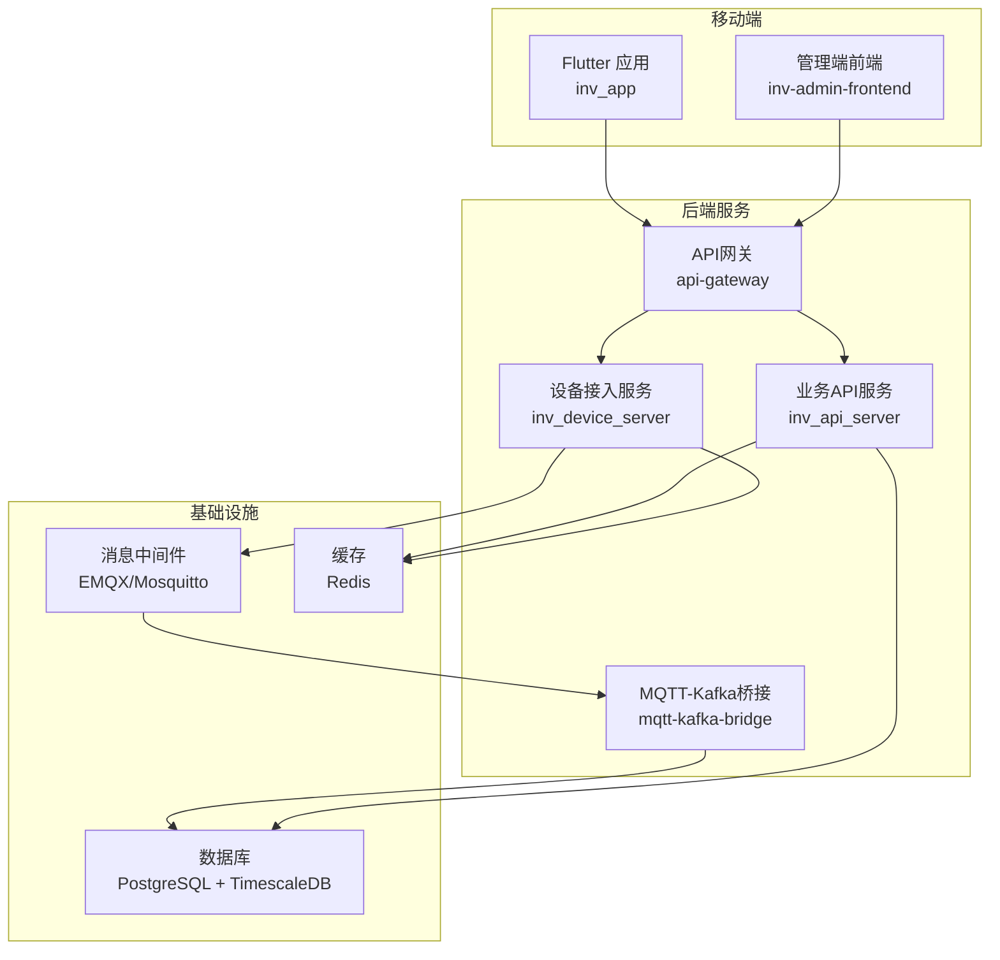
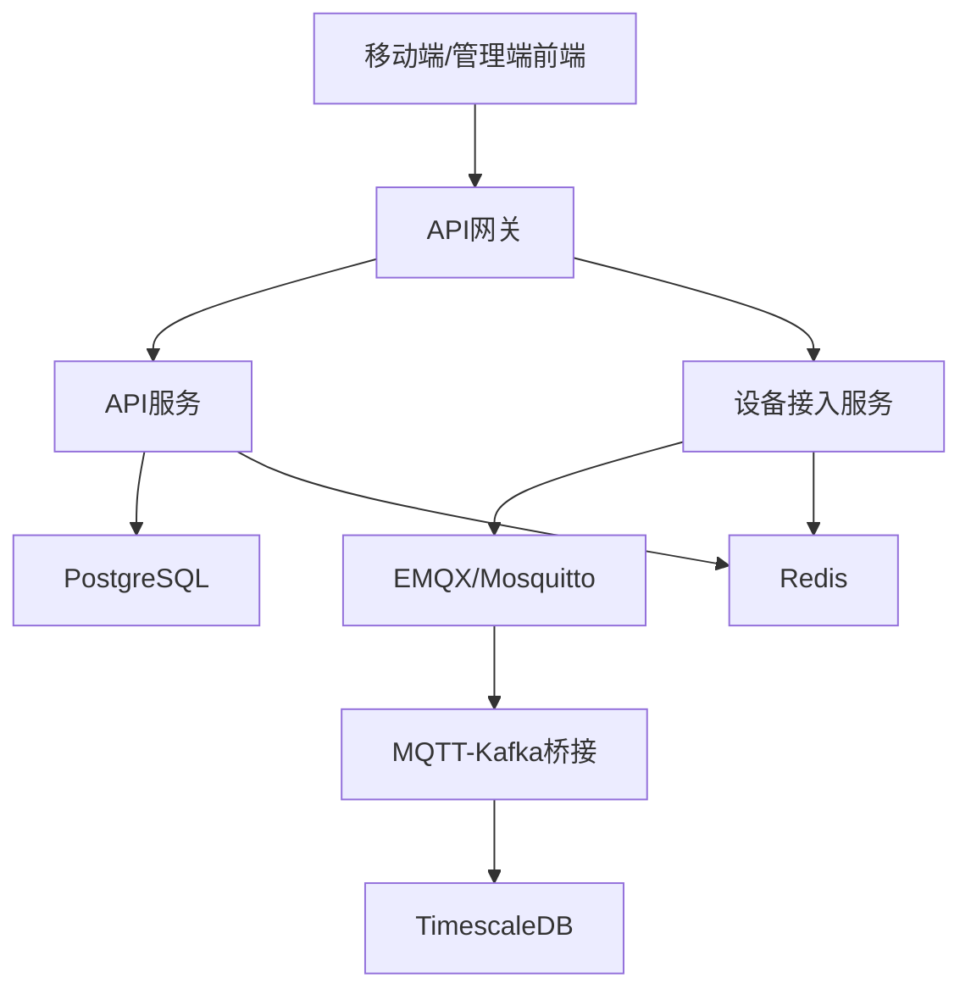
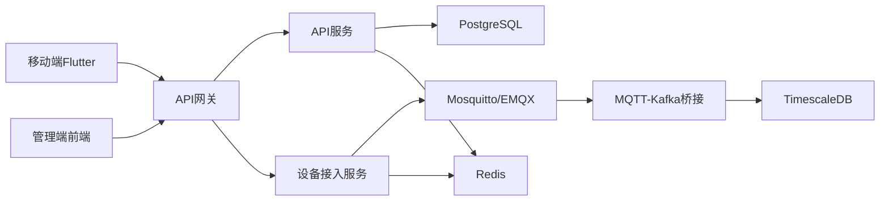

# 技术栈概览

<cite>
**本文档引用的文件**
- [pubspec.yaml](file://inv_app/pubspec.yaml)
- [go.mod（API网关）](file://api-gateway/go.mod)
- [go.mod（设备服务）](file://inv_device_server/go.mod)
- [go.mod（API服务器）](file://inv_api_server/go.mod)
- [go.mod（MQTT-Kafka桥接）](file://mqtt-kafka-bridge/go.mod)
- [docker-compose.yml](file://deploy/docker-compose.yml)
- [docker-compose.full.yml](file://deploy/docker-compose.full.yml)
- [docker-compose.bridge.yml](file://deploy/docker-compose.bridge.yml)
- [docker-compose.kafka-bridge.yml](file://deploy/docker-compose.kafka-bridge.yml)
- [schema.sql](file://database/schema.sql)
- [config.docker.yaml（API网关）](file://api-gateway/config.docker.yaml)
- [config.docker.yaml（API服务器）](file://inv_api_server/config.docker.yaml)
- [config.docker.yaml（设备服务）](file://inv_device_server/config.docker.yaml)
- [Dockerfile（前端）](file://inv-admin-frontend/Dockerfile)
- [Dockerfile（API网关）](file://api-gateway/Dockerfile)
- [Dockerfile（API服务器）](file://inv_api_server/Dockerfile)
- [Dockerfile（设备服务）](file://inv_device_server/Dockerfile)
- [Dockerfile（MQTT-Kafka桥接）](file://mqtt-kafka-bridge/Dockerfile)
- [mosquitto.conf](file://deploy/mosquitto/mosquitto.conf)
- [README.md（部署）](file://deploy/README.md)
</cite>

## 目录
1. [引言](#引言)
2. [项目结构](#项目结构)
3. [核心组件](#核心组件)
4. [架构总览](#架构总览)
5. [详细组件分析](#详细组件分析)
6. [依赖关系分析](#依赖关系分析)
7. [性能考量](#性能考量)
8. [故障排除指南](#故障排除指南)
9. [结论](#结论)

## 引言
本技术栈概览面向INV-MQTT系统，系统通过移动应用（Flutter 3.x + Dart）、后端服务（Go语言）、数据库（PostgreSQL + TimescaleDB）、缓存（Redis）与消息中间件（EMQX/Mosquitto）协同工作，实现对逆变器设备的实时监控与数据处理。本文档从技术选型、应用场景、组件协作与数据流角度出发，帮助开发者快速理解系统架构基础与选型依据，并提供版本要求、依赖关系与兼容性说明。

## 项目结构
系统采用多模块分层设计，包含移动端前端、管理端前端、后端API网关与业务服务、设备接入与协议解析服务、MQTT-Kafka桥接以及数据库与部署配置。整体结构如下：

图表来源
- [docker-compose.yml:1-200](file://deploy/docker-compose.yml#L1-L200)
- [docker-compose.full.yml:1-200](file://deploy/docker-compose.full.yml#L1-L200)
- [docker-compose.bridge.yml:1-200](file://deploy/docker-compose.bridge.yml#L1-L200)
- [docker-compose.kafka-bridge.yml:1-200](file://deploy/docker-compose.kafka-bridge.yml#L1-L200)

章节来源
- [docker-compose.yml:1-200](file://deploy/docker-compose.yml#L1-L200)
- [docker-compose.full.yml:1-200](file://deploy/docker-compose.full.yml#L1-L200)
- [docker-compose.bridge.yml:1-200](file://deploy/docker-compose.bridge.yml#L1-L200)
- [docker-compose.kafka-bridge.yml:1-200](file://deploy/docker-compose.kafka-bridge.yml#L1-L200)

## 核心组件
- 移动端Flutter 3.x + Dart：负责用户界面展示、设备状态查看、告警通知与远程控制命令下发。
- 后端Go语言：提供REST API与WebSocket服务，承载认证授权、权限校验、业务逻辑与数据聚合。
- 数据库PostgreSQL + TimescaleDB：存储结构化业务数据与时序数据，支持高效查询与压缩归档。
- 缓存Redis：用于会话存储、限流令牌桶、热点数据缓存与发布订阅。
- 消息中间件EMQX/Mosquitto：承接设备上报的遥测数据，支持规则引擎与桥接至Kafka。

章节来源
- [pubspec.yaml:1-120](file://inv_app/pubspec.yaml#L1-L120)
- [go.mod（API网关）:1-100](file://api-gateway/go.mod#L1-L100)
- [go.mod（API服务器）:1-100](file://inv_api_server/go.mod#L1-L100)
- [go.mod（设备服务）:1-100](file://inv_device_server/go.mod#L1-L100)
- [go.mod（MQTT-Kafka桥接）:1-100](file://mqtt-kafka-bridge/go.mod#L1-L100)
- [schema.sql:1-300](file://database/schema.sql#L1-L300)
- [mosquitto.conf:1-200](file://deploy/mosquitto/mosquitto.conf#L1-L200)

## 架构总览
系统采用“前端-网关-服务-中间件-存储”的分层架构。移动端与管理端前端通过API网关访问后端服务；设备通过MQTT接入，遥测数据经规则引擎处理后进入Kafka，再由桥接服务写入数据库；同时后端服务可读写Redis以提升响应性能。

图表来源
- [docker-compose.full.yml:1-200](file://deploy/docker-compose.full.yml#L1-L200)
- [config.docker.yaml（API网关）:1-200](file://api-gateway/config.docker.yaml#L1-L200)
- [config.docker.yaml（API服务器）:1-200](file://inv_api_server/config.docker.yaml#L1-L200)
- [config.docker.yaml（设备服务）:1-200](file://inv_device_server/config.docker.yaml#L1-L200)

## 详细组件分析

### 移动端Flutter 3.x + Dart
- 版本与依赖：通过包管理文件声明Dart SDK与Flutter版本约束，确保跨平台编译与运行环境一致性。
- 应用职责：提供用户登录、设备列表、实时监控、历史曲线、告警管理、远程设置等功能。
- 通信方式：通过HTTP与WebSocket与API网关交互，接收设备状态与告警推送。

章节来源
- [pubspec.yaml:1-120](file://inv_app/pubspec.yaml#L1-L120)

### API网关（Go）
- 技术栈：基于Go语言，集成CORS、JWT鉴权、日志、Prometheus指标、速率限制与RBAC权限控制等中间件。
- 职责：统一入口、路由转发、安全控制、限流与审计日志。
- 配置：容器内通过YAML配置文件加载运行参数，便于在不同环境切换。

章节来源
- [go.mod（API网关）:1-100](file://api-gateway/go.mod#L1-L100)
- [config.docker.yaml（API网关）:1-200](file://api-gateway/config.docker.yaml#L1-L200)

### API服务（Go）
- 技术栈：Go语言实现REST API与WebSocket，提供设备、告警、仪表盘、用户、工单等业务接口。
- 中间件：鉴权、内部调用鉴权、权限检查与数据权限过滤。
- 存储：PostgreSQL用于结构化数据，Redis用于缓存与会话。

章节来源
- [go.mod（API服务器）:1-100](file://inv_api_server/go.mod#L1-L100)
- [config.docker.yaml（API服务器）:1-200](file://inv_api_server/config.docker.yaml#L1-L200)

### 设备接入服务（Go）
- 技术栈：Go语言实现MQTT客户端与流式消费，负责协议适配、解析与数据落库。
- 流程：订阅设备主题，解析遥测数据，执行规则与告警，必要时写入Kafka或直接入库。
- 缓存：使用Redis进行会话与热点数据管理。

章节来源
- [go.mod（设备服务）:1-100](file://inv_device_server/go.mod#L1-L100)
- [config.docker.yaml（设备服务）:1-200](file://inv_device_server/config.docker.yaml#L1-L200)

### MQTT-Kafka桥接（Go）
- 技术栈：Go语言实现MQTT到Kafka的数据桥接，保证高吞吐与可靠性。
- 配置：容器化部署，通过YAML配置连接参数与主题映射。

章节来源
- [go.mod（MQTT-Kafka桥接）:1-100](file://mqtt-kafka-bridge/go.mod#L1-L100)
- [docker-compose.bridge.yml:1-200](file://deploy/docker-compose.bridge.yml#L1-L200)

### 数据库与时序存储
- PostgreSQL：存储用户、设备、模型、权限等结构化数据。
- TimescaleDB：基于PostgreSQL扩展，提供时序数据高效存储与查询能力，支持压缩与分区策略。
- 迁移脚本：包含初始化、索引优化、压缩策略与时序列扩展等SQL脚本。

章节来源
- [schema.sql:1-300](file://database/schema.sql#L1-L300)
- [docker-compose.full.yml:1-200](file://deploy/docker-compose.full.yml#L1-L200)

### 缓存Redis
- 用途：会话存储、限流、热点数据缓存、发布订阅。
- 部署：通过Compose文件定义Redis实例，供API服务与设备服务共享。

章节来源
- [docker-compose.yml:1-200](file://deploy/docker-compose.yml#L1-L200)

### 消息中间件EMQX/Mosquitto
- EMQX：企业级MQTT Broker，支持规则引擎、集群与可观测性。
- Mosquitto：轻量级MQTT代理，作为本地或测试环境替代方案。
- 配置：通过独立配置文件启用认证、ACL与持久会话。

章节来源
- [docker-compose.full.yml:1-200](file://deploy/docker-compose.full.yml#L1-L200)
- [mosquitto.conf:1-200](file://deploy/mosquitto/mosquitto.conf#L1-L200)

## 依赖关系分析
系统组件间的依赖关系如下：

图表来源
- [docker-compose.full.yml:1-200](file://deploy/docker-compose.full.yml#L1-L200)
- [docker-compose.yml:1-200](file://deploy/docker-compose.yml#L1-L200)

章节来源
- [docker-compose.full.yml:1-200](file://deploy/docker-compose.full.yml#L1-L200)
- [docker-compose.yml:1-200](file://deploy/docker-compose.yml#L1-L200)

## 性能考量
- 高性能
  - Go语言并发模型与高效的HTTP/WS栈，结合中间件实现请求快速分流与限流。
  - Redis缓存热点数据与会话，降低数据库压力。
  - TimescaleDB针对时序数据的索引与压缩策略，提升查询与存储效率。
- 高可用
  - 容器化编排，支持服务副本与健康检查。
  - 消息中间件与桥接解耦设备与后端，避免单点故障。
  - 数据库主从与备份脚本保障数据安全。

## 故障排除指南
- 端口冲突与网络连通性
  - 检查Compose文件中暴露端口与宿主机映射是否冲突。
  - 使用容器网络隔离，确认服务间DNS解析与连通性。
- 认证与鉴权问题
  - 核对API网关与后端服务的JWT密钥与过期策略配置。
  - 确认Mosquitto/EMQX的ACL与用户名密码配置正确。
- 数据一致性与延迟
  - 关注Kafka桥接与数据库迁移脚本执行状态。
  - 检查Redis键空间与过期策略，避免缓存雪崩。
- 监控与日志
  - 启用Prometheus与Grafana，关注服务指标与错误率。
  - 查看容器日志与数据库慢查询日志，定位瓶颈。

章节来源
- [README.md（部署）:1-200](file://deploy/README.md#L1-L200)
- [mosquitto.conf:1-200](file://deploy/mosquitto/mosquitto.conf#L1-L200)

## 结论
INV-MQTT系统通过Flutter+Go+PostgreSQL/TimescaleDB+Redis+EMQX/Mosquitto的组合，构建了从设备接入、消息处理、业务服务到前端展示的完整链路。该技术栈在性能与可用性方面具备良好基础，配合容器化与规则引擎，能够满足逆变器监控场景下的实时性与稳定性需求。建议在生产环境中进一步完善监控告警、自动化运维与灾备策略，持续优化时序数据压缩与查询性能。