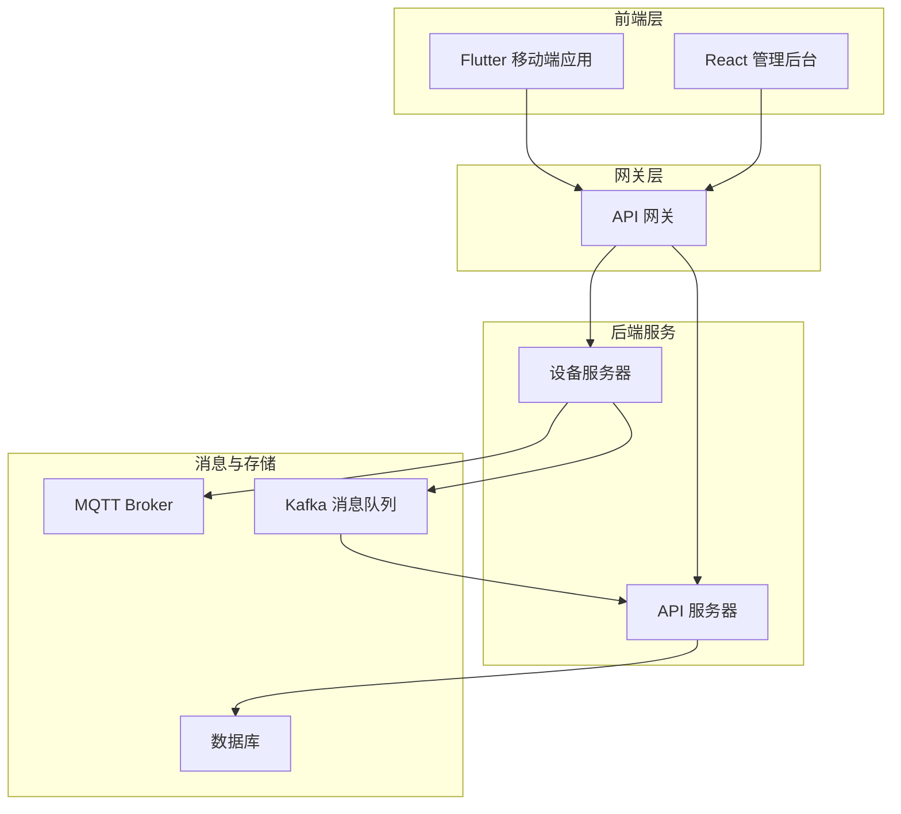
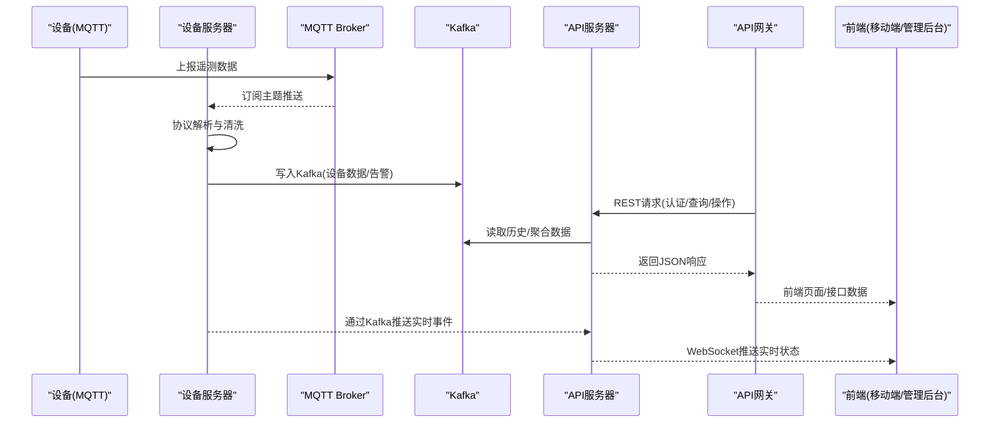
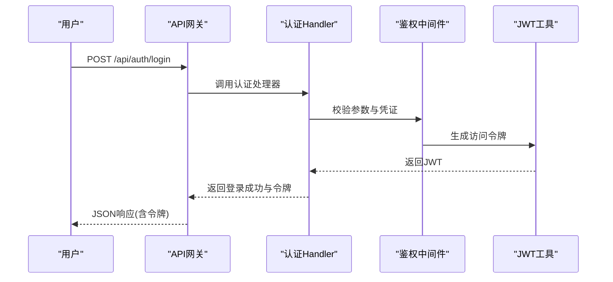
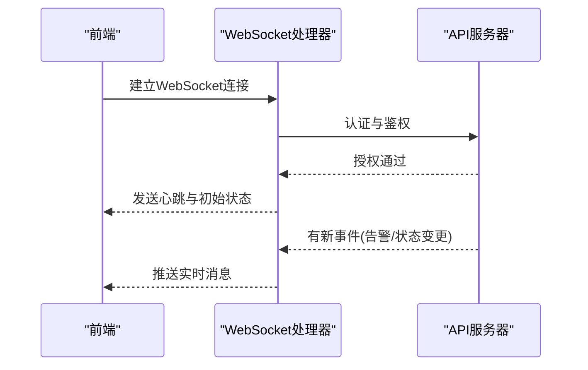
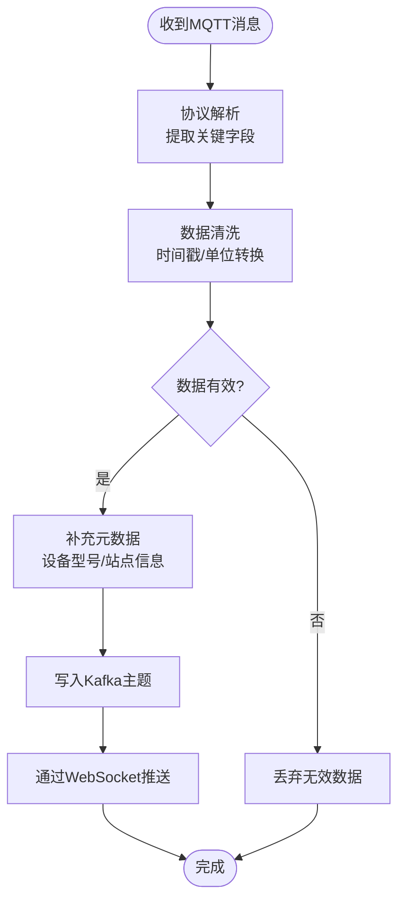
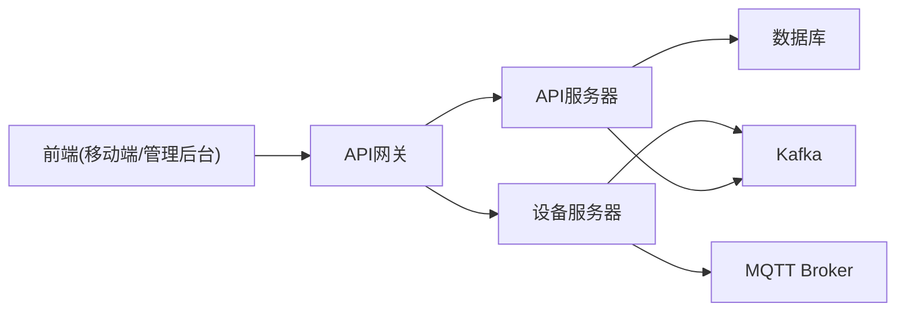

# 核心功能特性

<cite>
**本文档引用的文件**
- [inv_api_server/cmd/main.go](file://inv_api_server/cmd/main.go)
- [inv_api_server/internal/handler/auth_handler.go](file://inv_api_server/internal/handler/auth_handler.go)
- [inv_api_server/internal/handler/device_handler.go](file://inv_api_server/internal/handler/device_handler.go)
- [inv_api_server/internal/handler/ws_handler.go](file://inv_api_server/internal/handler/ws_handler.go)
- [inv_api_server/internal/middleware/auth.go](file://inv_api_server/internal/middleware/auth.go)
- [inv_api_server/pkg/jwt/jwt.go](file://inv_api_server/pkg/jwt/jwt.go)
- [inv_api_server/pkg/response/response.go](file://inv_api_server/pkg/response/response.go)
- [inv_device_server/cmd/main.go](file://inv_device_server/cmd/main.go)
- [inv_device_server/internal/service/data_service.go](file://inv_device_server/internal/service/data_service.go)
- [inv_device_server/internal/service/protocol_parser.go](file://inv_device_server/internal/service/protocol_parser.go)
- [inv_device_server/internal/mqtt/client.go](file://inv_device_server/internal/mqtt/client.go)
- [inv_device_server/internal/mqtt/stream_consumer.go](file://inv_device_server/internal/mqtt/stream_consumer.go)
- [inv_device_server/pkg/kafka/kafka.go](file://inv_device_server/pkg/kafka/kafka.go)
- [api-gateway/main.go](file://api-gateway/main.go)
- [api-gateway/internal/routes/routes.go](file://api-gateway/internal/routes/routes.go)
- [api-gateway/internal/middleware/cors.go](file://api-gateway/internal/middleware/cors.go)
- [api-gateway/internal/middleware/jwt.go](file://api-gateway/internal/middleware/jwt.go)
- [inv-admin-frontend/src/pages/portal/index.tsx](file://inv-admin-frontend/src/pages/portal/index.tsx)
- [inv-admin-frontend/src/pages/devices/index.tsx](file://inv-admin-frontend/src/pages/devices/index.tsx)
- [inv-admin-frontend/src/pages/alerts/index.tsx](file://inv-admin-frontend/src/pages/alerts/index.tsx)
- [inv-admin-frontend/src/pages/analytics/index.tsx](file://inv-admin-frontend/src/pages/analytics/index.tsx)
- [inv-admin-frontend/src/services/deviceApi.ts](file://inv-admin-frontend/src/services/deviceApi.ts)
- [inv-admin-frontend/src/services/alertApi.ts](file://inv-admin-frontend/src/services/alertApi.ts)
- [inv-admin-frontend/src/stores/authStore.ts](file://inv-admin-frontend/src/stores/authStore.ts)
- [inv_app/lib/main.dart](file://inv_app/lib/main.dart)
- [inv_app/android/app/src/main/kotlin/com/example/inv_app/MainActivity.kt](file://inv_app/android/app/src/main/kotlin/com/example/inv_app/MainActivity.kt)
- [inv_app/ios/Runner/AppDelegate.swift](file://inv_app/ios/Runner/AppDelegate.swift)
- [docs/MQTT接口文档.md](file://docs/MQTT接口文档.md)
- [docs/设备端OTA程序开发指南.md](file://docs/设备端OTA程序开发指南.md)
- [deploy/docker-compose.yml](file://deploy/docker-compose.yml)
- [deploy/nginx.conf](file://deploy/nginx.conf)
</cite>

## 目录
1. [简介](#简介)
2. [项目结构](#项目结构)
3. [核心组件](#核心组件)
4. [架构总览](#架构总览)
5. [详细组件分析](#详细组件分析)
6. [依赖关系分析](#依赖关系分析)
7. [性能考虑](#性能考虑)
8. [故障排除指南](#故障排除指南)
9. [结论](#结论)

## 简介
本文件面向INV-MQTT系统的核心功能特性进行深入说明，涵盖以下方面：
- Flutter移动端应用：用户认证、设备监控、告警管理、数据统计等前端能力与交互设计
- API服务器：基于Go的RESTful后端服务，提供认证授权、设备管理、告警规则、通知推送、WebSocket实时通信、OTA升级等接口
- 设备服务器：基于MQTT协议的数据接入与解析、Kafka消息桥接、实时转发与告警消费
- API网关：统一入口、CORS跨域、JWT鉴权、限流与日志中间件
- 管理后台：React前端，提供设备管理、告警查看、数据分析、仪表盘等管理界面

系统采用分层架构：前端（Flutter/React）负责用户交互与可视化；后端（API服务器/设备服务器/API网关）负责业务逻辑与数据处理；MQTT/Kafka作为消息通道实现设备数据的采集、存储与转发。

## 项目结构
项目由多个子系统组成，按职责划分为：
- inv_app：Flutter移动端应用，支持Android/iOS/Web平台
- inv-admin-frontend：React管理后台前端
- inv_api_server：Go语言编写的API服务器，提供REST接口与WebSocket
- inv_device_server：设备数据接入与处理服务，负责MQTT订阅、协议解析、Kafka写入
- api-gateway：API网关，统一路由与安全控制
- deploy：部署配置与脚本，包含Docker Compose、Nginx、Mosquitto等
- docs：技术文档，包含MQTT接口规范与OTA开发指南

图表来源
- [deploy/docker-compose.yml](file://deploy/docker-compose.yml)
- [api-gateway/main.go](file://api-gateway/main.go)
- [inv_api_server/cmd/main.go](file://inv_api_server/cmd/main.go)
- [inv_device_server/cmd/main.go](file://inv_device_server/cmd/main.go)

章节来源
- [deploy/docker-compose.yml](file://deploy/docker-compose.yml)
- [deploy/nginx.conf](file://deploy/nginx.conf)

## 核心组件
本节概述三大核心子系统及其关键职责：

- Flutter移动端应用
  - 用户认证与会话管理
  - 实时设备监控与历史数据查询
  - 告警信息展示与处理
  - 统计图表与报表生成
  - 跨平台构建（Android/iOS/Web）

- API服务器
  - RESTful接口：认证、设备、告警、仪表盘、工作单、天气、通知等
  - WebSocket推送：实时状态更新与告警事件
  - 中间件：鉴权、权限校验、日志、限流、RBAC
  - 服务层：邮件/SMS通知、OTA升级、模型管理、权限缓存

- 设备服务器
  - MQTT客户端：订阅设备主题、接收遥测数据
  - 协议解析：适配多厂商设备协议，提取关键指标
  - Kafka桥接：将解析后的数据写入Kafka
  - 告警消费：从Kafka读取告警事件并触发通知

章节来源
- [inv_app/lib/main.dart](file://inv_app/lib/main.dart)
- [inv_api_server/cmd/main.go](file://inv_api_server/cmd/main.go)
- [inv_device_server/cmd/main.go](file://inv_device_server/cmd/main.go)

## 架构总览
下图展示了INV-MQTT系统的整体数据流与交互路径，从设备到消息队列再到后端服务与前端展示。

图表来源
- [inv_device_server/internal/mqtt/client.go](file://inv_device_server/internal/mqtt/client.go)
- [inv_device_server/internal/service/data_service.go](file://inv_device_server/internal/service/data_service.go)
- [inv_device_server/pkg/kafka/kafka.go](file://inv_device_server/pkg/kafka/kafka.go)
- [inv_api_server/internal/handler/ws_handler.go](file://inv_api_server/internal/handler/ws_handler.go)
- [api-gateway/internal/routes/routes.go](file://api-gateway/internal/routes/routes.go)

## 详细组件分析

### Flutter移动端应用
- 功能特性
  - 用户认证：登录、登出、Token刷新与本地持久化
  - 设备监控：实时状态卡片、历史曲线、设备详情页
  - 告警管理：告警列表、已处理/未处理筛选、告警详情
  - 数据统计：功率、发电量、收益等指标统计与趋势
  - 多平台支持：Android/iOS/Web，统一UI与交互体验

- 技术实现要点
  - 应用入口与平台初始化：分别在Android与iOS平台设置主Activity与AppDelegate
  - 状态管理：通过全局store管理用户会话与国际化
  - API调用：封装HTTP客户端，统一错误处理与重试策略
  - 实时通信：集成WebSocket以接收设备状态变更与告警事件

- 使用场景
  - 运维人员现场巡检：查看设备实时运行状态与历史趋势
  - 客户侧远程监控：通过移动端查看电站发电情况与告警信息
  - 异常应急响应：快速定位告警并进行处置

章节来源
- [inv_app/lib/main.dart](file://inv_app/lib/main.dart)
- [inv_app/android/app/src/main/kotlin/com/example/inv_app/MainActivity.kt](file://inv_app/android/app/src/main/kotlin/com/example/inv_app/MainActivity.kt)
- [inv_app/ios/Runner/AppDelegate.swift](file://inv_app/ios/Runner/AppDelegate.swift)

### API服务器（RESTful接口与WebSocket）
- 功能特性
  - 认证授权：JWT签发与校验、RBAC权限控制、内部服务互认
  - 设备管理：设备注册、分组、属性维护、在线状态跟踪
  - 告警管理：告警规则配置、阈值设定、告警历史查询与处理
  - 通知推送：邮件/SMS通知、WebSocket实时推送
  - 仪表盘与统计：聚合指标、趋势分析、报表导出
  - OTA升级：固件版本管理、升级任务下发、进度跟踪

- 关键模块
  - 路由与处理器：按领域划分的Handler，如设备、告警、通知、OTA等
  - 中间件：鉴权、权限、CORS、限流、日志、Prometheus指标
  - 服务层：邮件/SMS服务、权限检查、模型服务、OTA服务
  - 响应封装：统一JSON响应格式与错误码

- 典型流程（用户登录）

图表来源
- [inv_api_server/internal/handler/auth_handler.go](file://inv_api_server/internal/handler/auth_handler.go)
- [inv_api_server/internal/middleware/auth.go](file://inv_api_server/internal/middleware/auth.go)
- [inv_api_server/pkg/jwt/jwt.go](file://inv_api_server/pkg/jwt/jwt.go)
- [inv_api_server/pkg/response/response.go](file://inv_api_server/pkg/response/response.go)

- 典型流程（WebSocket推送）

图表来源
- [inv_api_server/internal/handler/ws_handler.go](file://inv_api_server/internal/handler/ws_handler.go)

章节来源
- [inv_api_server/cmd/main.go](file://inv_api_server/cmd/main.go)
- [inv_api_server/internal/handler/device_handler.go](file://inv_api_server/internal/handler/device_handler.go)
- [inv_api_server/internal/handler/ws_handler.go](file://inv_api_server/internal/handler/ws_handler.go)
- [inv_api_server/internal/middleware/auth.go](file://inv_api_server/internal/middleware/auth.go)
- [inv_api_server/pkg/jwt/jwt.go](file://inv_api_server/pkg/jwt/jwt.go)
- [inv_api_server/pkg/response/response.go](file://inv_api_server/pkg/response/response.go)

### 设备服务器（MQTT数据处理与实时转发）
- 功能特性
  - MQTT订阅：连接Broker，订阅设备上报的主题
  - 协议解析：根据设备型号与协议规则解析原始数据
  - 数据清洗与标准化：提取关键指标，统一时间戳与时区
  - Kafka写入：将结构化数据写入Kafka，供后端服务消费
  - 告警消费：监听告警主题，触发通知与记录
  - 实时转发：通过WebSocket向前端推送最新状态

- 关键模块
  - MQTT客户端：连接、订阅、消息回调
  - 协议解析器：规则驱动的数据解析与字段映射
  - 数据服务：清洗、聚合、落库前准备
  - Kafka桥接：生产者初始化与消息序列化

- 典型流程（设备数据接入）

图表来源
- [inv_device_server/internal/mqtt/client.go](file://inv_device_server/internal/mqtt/client.go)
- [inv_device_server/internal/service/protocol_parser.go](file://inv_device_server/internal/service/protocol_parser.go)
- [inv_device_server/internal/service/data_service.go](file://inv_device_server/internal/service/data_service.go)
- [inv_device_server/pkg/kafka/kafka.go](file://inv_device_server/pkg/kafka/kafka.go)

章节来源
- [inv_device_server/cmd/main.go](file://inv_device_server/cmd/main.go)
- [inv_device_server/internal/mqtt/stream_consumer.go](file://inv_device_server/internal/mqtt/stream_consumer.go)
- [inv_device_server/internal/service/parse_rule.go](file://inv_device_server/internal/service/parse_rule.go)

### API网关（统一入口与安全控制）
- 功能特性
  - 路由转发：将前端请求按路径转发至对应后端服务
  - CORS跨域：允许前端跨域访问
  - JWT鉴权：校验前端携带的访问令牌
  - 限流与日志：保护后端服务，记录访问日志
  - RBAC与权限：基于角色的访问控制

- 配置与部署
  - Nginx作为反向代理与静态资源服务
  - Docker Compose编排，包含网关、API服务器、设备服务器、数据库、MQTT、Kafka等

章节来源
- [api-gateway/main.go](file://api-gateway/main.go)
- [api-gateway/internal/routes/routes.go](file://api-gateway/internal/routes/routes.go)
- [api-gateway/internal/middleware/cors.go](file://api-gateway/internal/middleware/cors.go)
- [api-gateway/internal/middleware/jwt.go](file://api-gateway/internal/middleware/jwt.go)
- [deploy/docker-compose.yml](file://deploy/docker-compose.yml)
- [deploy/nginx.conf](file://deploy/nginx.conf)

### 管理后台（React前端）
- 功能特性
  - 登录认证：管理员登录与会话保持
  - 设备管理：设备列表、分组、属性编辑、批量设置
  - 告警管理：告警规则配置、阈值设定、历史告警查询
  - 数据分析：仪表盘、趋势图、报表导出
  - 远程设置与OTA：远程下发指令、固件升级任务
  - 权限与用户：RBAC配置、用户管理

- 技术实现要点
  - 页面组件：按功能模块拆分，如设备、告警、分析、OTA等
  - 服务封装：统一的API客户端，集中处理请求与响应
  - 状态管理：全局store管理认证状态与国际化

章节来源
- [inv-admin-frontend/src/pages/portal/index.tsx](file://inv-admin-frontend/src/pages/portal/index.tsx)
- [inv-admin-frontend/src/pages/devices/index.tsx](file://inv-admin-frontend/src/pages/devices/index.tsx)
- [inv-admin-frontend/src/pages/alerts/index.tsx](file://inv-admin-frontend/src/pages/alerts/index.tsx)
- [inv-admin-frontend/src/pages/analytics/index.tsx](file://inv-admin-frontend/src/pages/analytics/index.tsx)
- [inv-admin-frontend/src/services/deviceApi.ts](file://inv-admin-frontend/src/services/deviceApi.ts)
- [inv-admin-frontend/src/services/alertApi.ts](file://inv-admin-frontend/src/services/alertApi.ts)
- [inv-admin-frontend/src/stores/authStore.ts](file://inv-admin-frontend/src/stores/authStore.ts)

## 依赖关系分析
- 组件耦合
  - 前端通过API网关与后端交互，降低直接依赖
  - 设备服务器与MQTT/Kafka耦合度高，但通过抽象接口隔离了协议细节
  - API服务器通过Kafka与设备服务器解耦，实现异步数据流转

- 外部依赖
  - Mosquitto作为MQTT Broker
  - Kafka作为消息总线
  - TimescaleDB用于时序数据存储与压缩
  - Prometheus/Grafana用于监控与可视化

图表来源
- [deploy/docker-compose.yml](file://deploy/docker-compose.yml)
- [inv_api_server/cmd/main.go](file://inv_api_server/cmd/main.go)
- [inv_device_server/cmd/main.go](file://inv_device_server/cmd/main.go)

章节来源
- [deploy/docker-compose.yml](file://deploy/docker-compose.yml)

## 性能考虑
- 消息吞吐
  - 设备数据高频上报，建议优化MQTT QoS与Kafka分区数，确保低延迟
- 缓存策略
  - API服务器对热点查询结果进行缓存，减少数据库压力
- 数据压缩
  - TimescaleDB启用压缩策略，降低存储成本与查询开销
- 并发与限流
  - API网关与API服务器设置合理的并发与限流策略，防止雪崩效应
- 前端渲染
  - 大数据量图表采用虚拟滚动与懒加载，提升交互流畅度

## 故障排除指南
- 设备不在线或数据不更新
  - 检查MQTT Broker连通性与订阅主题是否正确
  - 查看设备服务器日志，确认协议解析是否失败
  - 核对Kafka主题是否存在数据积压

- 前端无法登录或接口报错
  - 检查JWT签名密钥与过期时间
  - 确认API网关CORS配置与路由规则
  - 查看API服务器中间件日志，定位鉴权与权限问题

- 告警未推送或显示异常
  - 检查告警规则阈值与设备数据字段映射
  - 确认WebSocket连接状态与前端订阅逻辑
  - 核对通知服务（邮件/SMS）配置

章节来源
- [inv_device_server/internal/mqtt/client.go](file://inv_device_server/internal/mqtt/client.go)
- [inv_api_server/internal/middleware/auth.go](file://inv_api_server/internal/middleware/auth.go)
- [api-gateway/internal/middleware/cors.go](file://api-gateway/internal/middleware/cors.go)

## 结论
INV-MQTT系统通过清晰的分层架构与模块化设计，实现了从设备数据采集、协议解析、消息桥接到后端服务与前端展示的完整闭环。系统具备良好的扩展性与可维护性，能够满足大规模分布式能源监控场景下的实时性、可靠性与易用性需求。建议在后续迭代中持续优化消息处理性能、完善告警规则引擎，并增强前端交互体验与移动端离线能力。