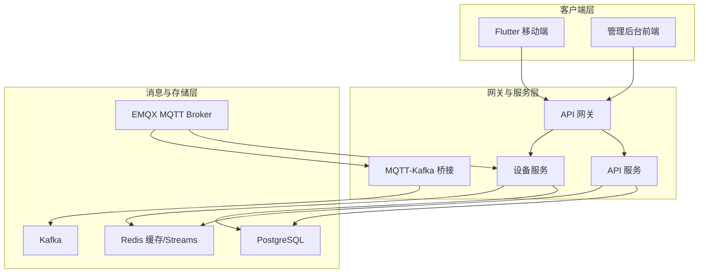
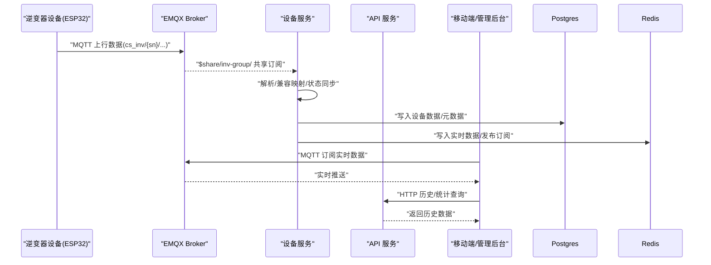
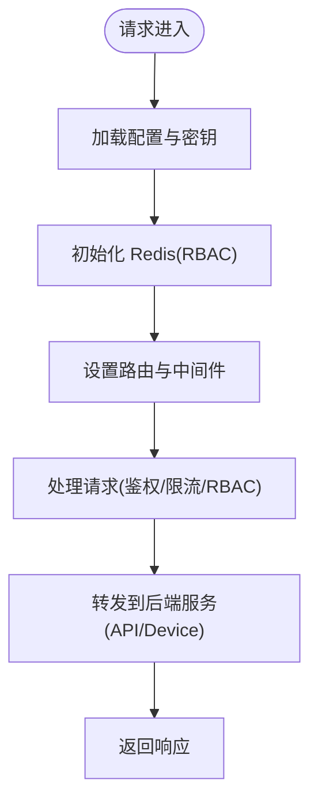
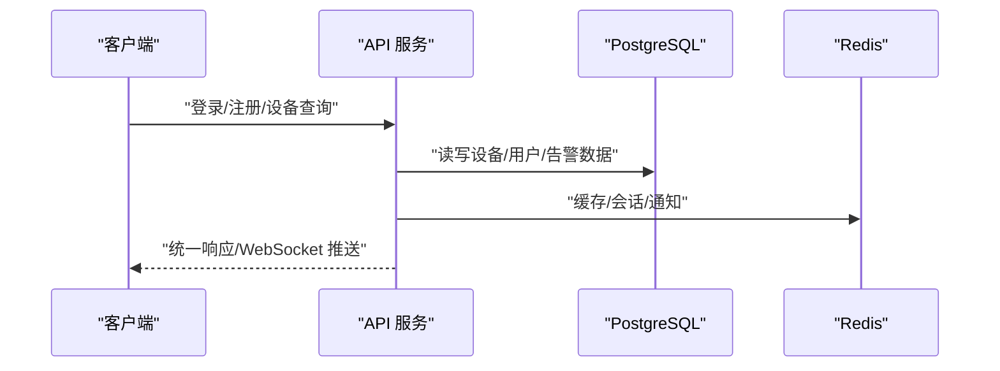
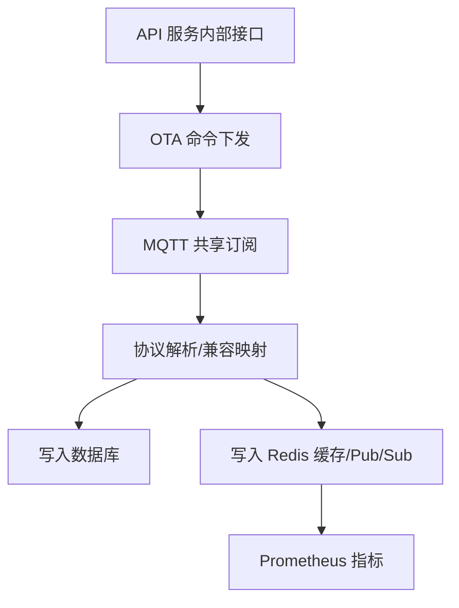
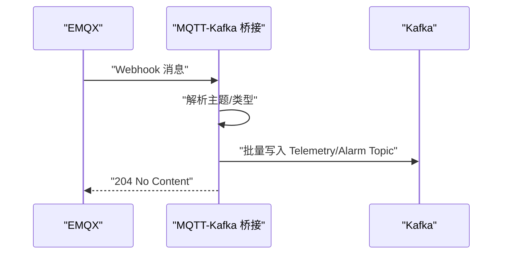
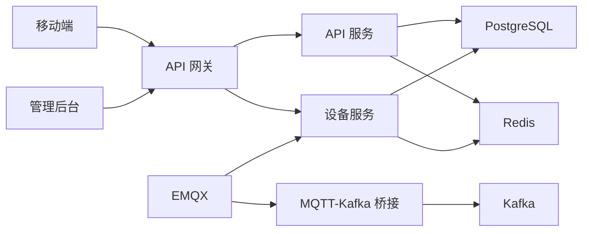

# 系统简介

<cite>
**本文引用的文件**
- [README.md](file://README.md)
- [main.go](file://api-gateway/main.go)
- [main.go](file://inv_api_server/cmd/main.go)
- [main.go](file://inv_device_server/cmd/main.go)
- [main.go](file://mqtt-kafka-bridge/main.go)
- [pubspec.yaml](file://inv_app/pubspec.yaml)
- [docker-compose.yml](file://deploy/docker-compose.yml)
- [schema.sql](file://database/schema.sql)
- [MQTT接口文档.md](file://docs/MQTT接口文档.md)
</cite>

## 目录
1. [引言](#引言)
2. [项目结构](#项目结构)
3. [核心组件](#核心组件)
4. [架构总览](#架构总览)
5. [详细组件分析](#详细组件分析)
6. [依赖关系分析](#依赖关系分析)
7. [性能考虑](#性能考虑)
8. [故障排查指南](#故障排查指南)
9. [结论](#结论)
10. [附录](#附录)

## 引言
INV-MQTT 是一个基于 MQTT 协议的光伏逆变器物联网监控平台，专为分布式光伏电站提供实时监控、设备管理、告警管理与 OTA 升级等能力。系统支持万级设备接入，采用“实时直连 + 历史查询”的双通道架构：设备通过 MQTT 直连 Broker 实现实时数据推送，管理后台与移动端通过 HTTP API 获取历史与统计信息；统一的 JWT 认证与 EMQX 内置鉴权保障安全。

系统定位明确：面向分布式光伏电站运营方、安装商与维护人员，提供从设备接入、实时监测、告警处置到远程升级的一体化解决方案。通过共享订阅与多实例横向扩展，系统具备高可用与高吞吐能力，满足大规模场景下的稳定运行需求。

## 项目结构
系统采用前后端分离与微服务化的目录组织方式，核心模块包括：
- 移动端应用（Flutter）：用户登录、设备监控、告警查看、统计分析、OTA 升级与 Wi-Fi 配网
- API 网关（Go）：统一入口、鉴权、限流、RBAC 权限控制与后端服务路由
- API 服务（Go）：REST API、WebSocket 推送、管理后台、OTA 管理与业务逻辑
- 设备服务（Go）：MQTT 共享订阅、数据解析、Redis 缓存与 Streams、OTA 命令下发与状态回传
- MQTT-Kafka 桥接（Go）：EMQX Webhook 接收，将 MQTT 消息桥接至 Kafka
- 数据库与缓存：PostgreSQL（关系型与 JSONB）、Redis（缓存/发布订阅/Streams）
- 部署与运维：Docker Compose 一键部署、K8s HPA 自动扩缩容、Prometheus 告警

**图表来源**
- [docker-compose.yml:1-274](file://deploy/docker-compose.yml#L1-L274)
- [main.go:1-129](file://api-gateway/main.go#L1-L129)
- [main.go:1-618](file://inv_api_server/cmd/main.go#L1-L618)
- [main.go:1-358](file://inv_device_server/cmd/main.go#L1-L358)
- [main.go:1-323](file://mqtt-kafka-bridge/main.go#L1-L323)

**章节来源**
- [README.md:33-110](file://README.md#L33-L110)
- [docker-compose.yml:1-274](file://deploy/docker-compose.yml#L1-L274)

## 核心组件
- 移动端应用（Flutter）：采用 BLoC 状态管理、go_router 路由守卫与 MQTT 客户端，提供设备监控、告警、统计、OTA 与 Wi-Fi 配网等能力
- API 网关：统一鉴权、限流、RBAC 权限控制，后端服务路由与可观测性指标
- API 服务：REST API + WebSocket 推送，支持用户管理、电站/设备 CRUD、告警处理、OTA 管理与仪表盘统计
- 设备服务：EMQX 共享订阅、数据解析与兼容映射、Redis Pub/Sub/Streams、设备在线状态管理、Prometheus 指标端点
- MQTT-Kafka 桥接：EMQX Webhook 接收，按主题分流至 Kafka Telemetry/Alarm Topic
- 数据库与缓存：PostgreSQL 初始化与迁移脚本、TimescaleDB 时序优化、Redis 缓存与 Streams

**章节来源**
- [README.md:322-354](file://README.md#L322-L354)
- [pubspec.yaml:11-91](file://inv_app/pubspec.yaml#L11-L91)
- [schema.sql:1-200](file://database/schema.sql#L1-L200)

## 架构总览
系统遵循“实时直连 + 历史查询”的设计原则：
- 实时链路：设备通过 MQTT 直连 EMQX，共享订阅分发至多个设备服务实例；设备服务解析数据后写入 PostgreSQL 与 Redis，移动端与管理后台通过 MQTT 订阅实时推送
- 历史链路：移动端与管理后台通过 HTTP REST 调用 API 服务，查询历史与统计信息
- 安全链路：EMQX 内置 JWT 鉴权（HS256），与 API 服务共享 Secret；设备断开自动清理会话，保障安全性

**图表来源**
- [README.md:206-224](file://README.md#L206-L224)
- [main.go:1-358](file://inv_device_server/cmd/main.go#L1-L358)
- [main.go:1-618](file://inv_api_server/cmd/main.go#L1-L618)

## 详细组件分析

### API 网关（API Gateway）
- 职责：统一入口、JWT 鉴权、全局与路由级限流、RBAC 权限控制、后端服务路由
- 特性：支持 Redis 缓存模式的 RBAC、优雅停机、健康检查端点
- 集成：与 API 服务、设备服务通过配置进行路由与鉴权

**图表来源**
- [main.go:21-94](file://api-gateway/main.go#L21-L94)

**章节来源**
- [main.go:1-129](file://api-gateway/main.go#L1-L129)

### API 服务（REST + WebSocket）
- 职责：用户认证与授权、设备与电站 CRUD、告警管理、OTA 管理、WebSocket 推送、仪表盘统计
- 特性：统一响应格式、速率限制、Tracing 中间件、心跳检测离线设备、健康检查端点
- 集成：与数据库、Redis、短信/邮件服务、设备服务内部接口协作

**图表来源**
- [main.go:344-576](file://inv_api_server/cmd/main.go#L344-L576)
- [schema.sql:1-200](file://database/schema.sql#L1-L200)

**章节来源**
- [main.go:1-618](file://inv_api_server/cmd/main.go#L1-L618)
- [schema.sql:1-200](file://database/schema.sql#L1-L200)

### 设备服务（MQTT 数据桥接）
- 职责：EMQX 共享订阅、数据解析与兼容映射、Redis 缓存与发布订阅、设备在线状态管理、OTA 命令下发与状态回传、Prometheus 指标
- 特性：支持 Kafka 模式（协议解析/告警消费者）与 MQTT 模式，健康检查与统计端点

**图表来源**
- [main.go:1-358](file://inv_device_server/cmd/main.go#L1-L358)

**章节来源**
- [main.go:1-358](file://inv_device_server/cmd/main.go#L1-L358)

### MQTT-Kafka 桥接
- 职责：接收 EMQX Webhook，按主题分流 Telemetry/Alarm 至 Kafka，支持认证与批量写入
- 特性：异步批量写入、错误计数、健康检查与统计端点

**图表来源**
- [main.go:100-173](file://mqtt-kafka-bridge/main.go#L100-L173)

**章节来源**
- [main.go:1-323](file://mqtt-kafka-bridge/main.go#L1-L323)

### 移动端与管理后台
- 移动端（Flutter）：BLoC 状态管理、go_router 路由守卫、Dio HTTP 客户端、mqtt_client MQTT 客户端、图表渲染与 Wi-Fi 配网
- 管理后台前端：基于 React/Vite 的管理界面，与 API 网关对接

**章节来源**
- [pubspec.yaml:11-91](file://inv_app/pubspec.yaml#L11-L91)

## 依赖关系分析
系统采用松耦合的微服务架构，通过 API 网关统一接入，后端服务通过 HTTP 与内部接口交互，消息通过 EMQX 与 Kafka 传递，数据持久化在 PostgreSQL 与 Redis 中。

**图表来源**
- [docker-compose.yml:1-274](file://deploy/docker-compose.yml#L1-L274)
- [main.go:1-618](file://inv_api_server/cmd/main.go#L1-L618)
- [main.go:1-358](file://inv_device_server/cmd/main.go#L1-L358)
- [main.go:1-323](file://mqtt-kafka-bridge/main.go#L1-L323)

**章节来源**
- [docker-compose.yml:1-274](file://deploy/docker-compose.yml#L1-L274)

## 性能考虑
- 实时性：设备通过 MQTT 直连 EMQX，共享订阅实现多实例负载均衡，降低单点压力
- 吞吐能力：Kafka 异步桥接与批量写入，减少实时链路阻塞；Redis Streams 提供消息缓冲与死信队列
- 可扩展性：K8s HPA 自动扩缩容（2~10 副本），设备服务多实例水平扩展
- 存储优化：PostgreSQL + TimescaleDB 时序优化，连续聚合与自动压缩提升查询效率
- 安全与稳定性：JWT 鉴权与会话清理、健康检查与优雅停机、Prometheus 告警

**章节来源**
- [README.md:246-251](file://README.md#L246-L251)
- [README.md:195-205](file://README.md#L195-L205)

## 故障排查指南
- 设备无法上线：检查 EMQX JWT 配置、设备 SN 校验、共享订阅前缀是否正确
- 实时数据不推送：确认设备 MQTT 订阅主题、Broker 连接状态与客户端会话设置
- 历史数据查询异常：检查 API 服务数据库连接、Redis 缓存状态与查询接口权限
- OTA 升级失败：核对固件上传、任务创建、命令下发与设备状态回传链路
- 网关与服务异常：查看健康检查端点、日志与指标，确认限流与 RBAC 配置

**章节来源**
- [README.md:155-185](file://README.md#L155-L185)
- [main.go:1-129](file://api-gateway/main.go#L1-L129)
- [main.go:1-618](file://inv_api_server/cmd/main.go#L1-L618)
- [main.go:1-358](file://inv_device_server/cmd/main.go#L1-L358)

## 结论
INV-MQTT 以 MQTT 为核心构建了高实时、高可用的光伏逆变器监控体系，结合 API 网关、REST 服务、设备服务与消息桥接，形成完整的“实时直连 + 历史查询”架构。系统支持万级设备接入，具备完善的告警与 OTA 能力，适用于分布式光伏电站的规模化运营与维护。通过共享订阅、多实例扩展与时序数据库优化，系统在性能与稳定性方面具备显著优势。

## 附录
- 适用逆变器型号：CS-I10-6k2 48V 单相离网逆变器（ESP32-C3 WiFi 通信模块）
- MQTT 主题与数据格式详见文档：[MQTT 接口文档](file://docs/MQTT接口文档.md)

**章节来源**
- [README.md:355-367](file://README.md#L355-L367)
- [MQTT接口文档.md:1-200](file://docs/MQTT接口文档.md#L1-L200)