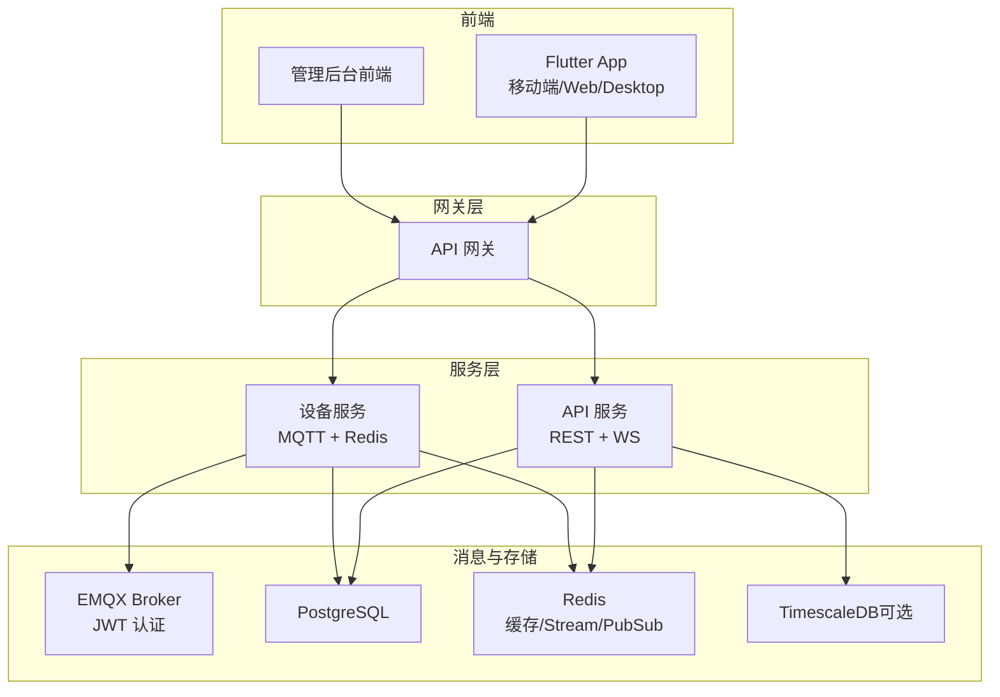
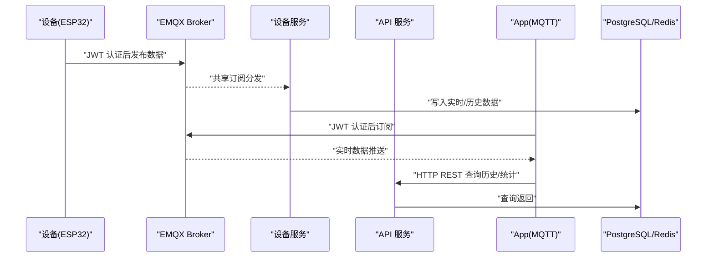
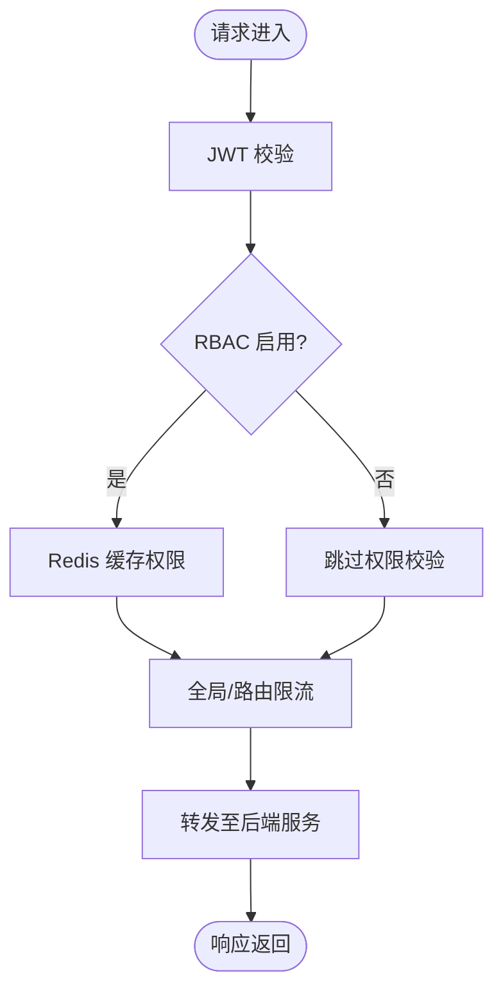
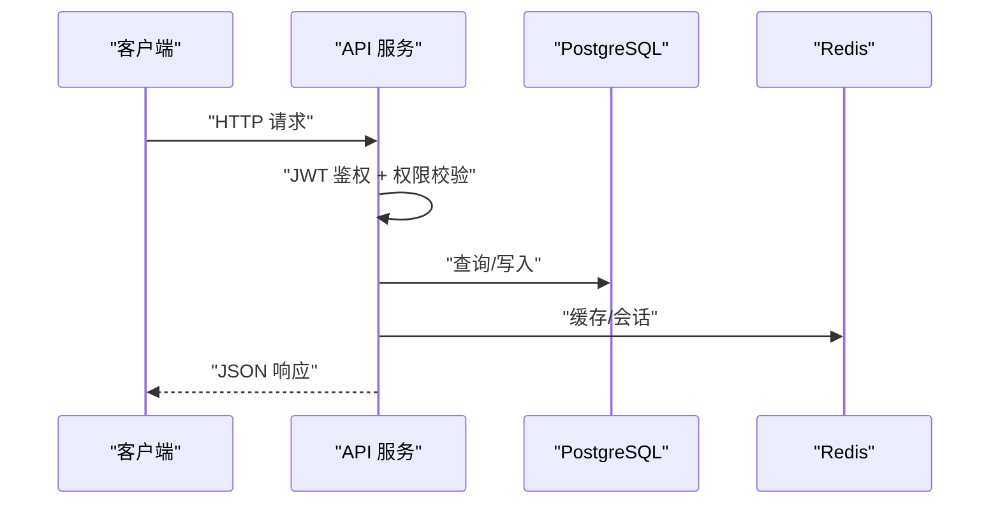
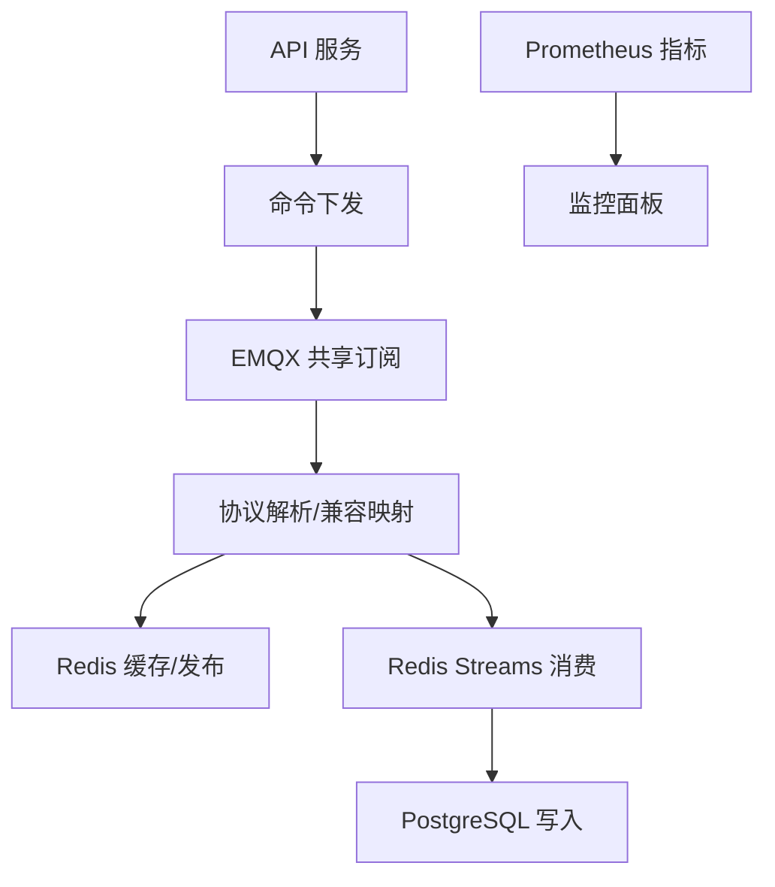
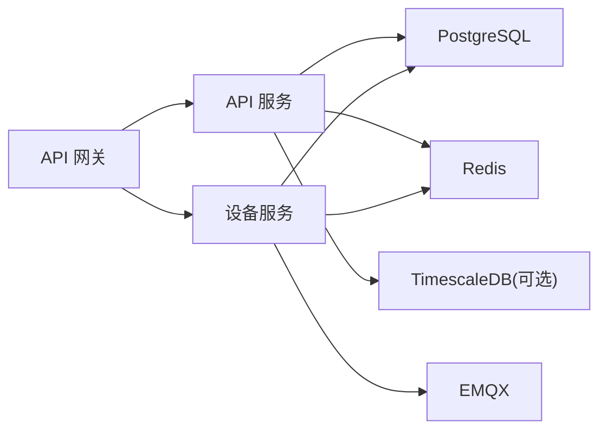

# 项目概述

<cite>
**本文引用的文件**
- [README.md](file://README.md)
- [api-gateway/main.go](file://api-gateway/main.go)
- [api-gateway/internal/config/config.go](file://api-gateway/internal/config/config.go)
- [inv_api_server/cmd/main.go](file://inv_api_server/cmd/main.go)
- [inv_api_server/internal/config/config.go](file://inv_api_server/internal/config/config.go)
- [inv_device_server/cmd/main.go](file://inv_device_server/cmd/main.go)
- [inv_device_server/internal/config/config.go](file://inv_device_server/internal/config/config.go)
- [deploy/docker-compose.yml](file://deploy/docker-compose.yml)
- [deploy/k8s-device-server.yaml](file://deploy/k8s-device-server.yaml)
- [docs/MQTT接口文档.md](file://docs/MQTT接口文档.md)
- [docs/架构升级任务清单.md](file://docs/架构升级任务清单.md)
- [database/schema.sql](file://database/schema.sql)
- [inv_app/pubspec.yaml](file://inv_app/pubspec.yaml)
- [tools/stress_test/main.go](file://tools/stress_test/main.go)
</cite>

## 目录
1. [简介](#简介)
2. [项目结构](#项目结构)
3. [核心组件](#核心组件)
4. [架构总览](#架构总览)
5. [详细组件分析](#详细组件分析)
6. [依赖关系分析](#依赖关系分析)
7. [性能考量](#性能考量)
8. [故障排查指南](#故障排查指南)
9. [结论](#结论)
10. [附录](#附录)

## 简介
INV-MQTT 是一个基于 MQTT 协议的光伏逆变器远程监控平台，支持万级设备接入、实时监控、告警管理、用户管理与 OTA 固件升级。系统采用“实时直连 + 历史查询”的双通道架构：设备通过 EMQX Broker 直接以 JWT 认证进行低延迟实时数据推送；历史与统计类数据通过 HTTP REST API 查询，确保安全与可扩展性。系统具备高可用、可伸缩与可观测性能力，适合大规模分布式部署。

## 项目结构
系统采用微服务分层架构，前后端分离，核心服务包括：
- API 网关：统一入口、鉴权、限流、RBAC 与后端路由
- API 服务：REST API、管理后台、WebSocket 推送、业务逻辑
- 设备服务：MQTT 共享订阅、数据解析、Redis 缓存与 Streams、命令下发
- 移动端：Flutter 跨平台 App，支持实时监控、告警、OTA、Wi-Fi 配网
- 数据层：PostgreSQL + Redis + 可选 TimescaleDB（时序优化）

**图表来源**
- [README.md: 35-110:35-110](file://README.md#L35-L110)
- [deploy/docker-compose.yml: 121-191:121-191](file://deploy/docker-compose.yml#L121-L191)

**章节来源**
- [README.md: 33-133:33-133](file://README.md#L33-L133)
- [deploy/docker-compose.yml: 1-274:1-274](file://deploy/docker-compose.yml#L1-274)

## 核心组件
- API 网关：集中鉴权、限流、RBAC、后端路由与健康检查，支持 Redis 缓存权限
- API 服务：REST API、管理后台、OTA 管理、WebSocket 推送、用户/设备/告警/统计等业务
- 设备服务：EMQX 共享订阅、数据解析与兼容映射、Redis 缓存与 Streams、命令下发、Prometheus 指标导出
- 移动端 App：BLoC 状态管理、MQTT 直连、图表渲染、OTA 进度展示、Wi-Fi 配网
- 数据层：PostgreSQL 存储元数据与关系型数据，Redis 提供缓存、Pub/Sub 与 Streams，可选 TimescaleDB 优化时序查询

**章节来源**
- [api-gateway/main.go: 21-94:21-94](file://api-gateway/main.go#L21-L94)
- [inv_api_server/cmd/main.go: 88-188:88-188](file://inv_api_server/cmd/main.go#L88-L188)
- [inv_device_server/cmd/main.go: 99-187:99-187](file://inv_device_server/cmd/main.go#L99-L187)
- [inv_app/pubspec.yaml: 11-71:11-71](file://inv_app/pubspec.yaml#L11-L71)

## 架构总览
系统遵循“实时直连、历史查询、安全认证”的设计原则：
- 实时链路：设备 → EMQX → 共享订阅 → 设备服务 → PostgreSQL/Redis；App 通过 MQTT 直连获取实时数据
- 历史链路：App → HTTP REST → API 服务 → PostgreSQL 查询返回
- 安全链路：EMQX 内置 JWT（HS256）认证，App 与 API 服务共享 Secret，过期自动断连

**图表来源**
- [README.md: 206-224:206-224](file://README.md#L206-L224)
- [docs/MQTT接口文档.md: 25-90:25-90](file://docs/MQTT接口文档.md#L25-L90)

**章节来源**
- [README.md: 206-224:206-224](file://README.md#L206-L224)
- [docs/MQTT接口文档.md: 1-200:1-200](file://docs/MQTT接口文档.md#L1-L200)

## 详细组件分析

### API 网关
- 职责：统一入口、JWT 鉴权、全局与路由级限流、RBAC 权限控制、后端服务路由
- 特性：支持 Redis 缓存 RBAC，降级模式下仅角色检查；优雅关闭；健康检查
- 配置：端口、JWT Secret、限流参数、后端地址、Redis 连接

**图表来源**
- [api-gateway/main.go: 34-70:34-70](file://api-gateway/main.go#L34-L70)
- [api-gateway/internal/config/config.go: 10-87:10-87](file://api-gateway/internal/config/config.go#L10-L87)

**章节来源**
- [api-gateway/main.go: 21-94:21-94](file://api-gateway/main.go#L21-L94)
- [api-gateway/internal/config/config.go: 1-87:1-87](file://api-gateway/internal/config/config.go#L1-L87)

### API 服务
- 职责：REST API、管理后台、WebSocket 推送、OTA 管理、天气/短信/邮件服务、心跳检测、权限校验
- 特性：Gin 路由、中间件链、数据库/Redis 连接池、结构化日志、健康检查、限流
- 路由：认证、用户、设备、告警、模型、仪表盘、告警规则、工单、OTA 等

**图表来源**
- [inv_api_server/cmd/main.go: 344-579:344-579](file://inv_api_server/cmd/main.go#L344-L579)
- [inv_api_server/internal/config/config.go: 99-199:99-199](file://inv_api_server/internal/config/config.go#L99-L199)

**章节来源**
- [inv_api_server/cmd/main.go: 88-188:88-188](file://inv_api_server/cmd/main.go#L88-L188)
- [inv_api_server/internal/config/config.go: 1-200:1-200](file://inv_api_server/internal/config/config.go#L1-L200)

### 设备服务
- 职责：EMQX 共享订阅、数据解析与 remap 兼容、Redis 缓存与 Streams、命令下发、健康检查与指标导出
- 特性：Kafka 桥接模式（可选）、OTA 状态回调、设备在线状态同步、Prometheus 指标
- 路由：健康检查、MQTT 指标、设备在线状态、实时数据查询、命令下发

**图表来源**
- [inv_device_server/cmd/main.go: 240-346:240-346](file://inv_device_server/cmd/main.go#L240-L346)
- [inv_device_server/internal/config/config.go: 82-163:82-163](file://inv_device_server/internal/config/config.go#L82-L163)

**章节来源**
- [inv_device_server/cmd/main.go: 99-187:99-187](file://inv_device_server/cmd/main.go#L99-L187)
- [inv_device_server/internal/config/config.go: 1-163:1-163](file://inv_device_server/internal/config/config.go#L1-L163)

### 移动端 App
- 职责：用户认证、设备监控、告警、统计、OTA、Wi-Fi 配网、图表展示
- 技术：Flutter + BLoC、go_router、Dio、mqtt_client、fl_chart、权限与本地存储
- 交互：MQTT 直连获取实时数据，HTTP REST 获取历史/统计

**章节来源**
- [inv_app/pubspec.yaml: 11-71:11-71](file://inv_app/pubspec.yaml#L11-L71)
- [README.md: 322-334:322-334](file://README.md#L322-L334)

### 数据库与时序优化
- PostgreSQL：存储用户、设备、告警、模型、操作日志等关系数据
- Redis：缓存、Pub/Sub 实时推送、Streams 消息缓冲
- TimescaleDB（可选）：超表 + 自动压缩 + 连续聚合，优化时序查询

**章节来源**
- [database/schema.sql: 1-200:1-200](file://database/schema.sql#L1-L200)
- [docs/架构升级任务清单.md: 92-102:92-102](file://docs/架构升级任务清单.md#L92-L102)

## 依赖关系分析
- 组件耦合：API 网关与 API/设备服务松耦合，通过后端地址配置；设备服务与 EMQX 强耦合（共享订阅）
- 外部依赖：EMQX（JWT 认证）、PostgreSQL、Redis、可选 TimescaleDB、Kafka（桥接模式）
- 配置管理：Viper/YAML 环境变量注入，Docker/K8s 部署

**图表来源**
- [deploy/docker-compose.yml: 121-191:121-191](file://deploy/docker-compose.yml#L121-L191)
- [docs/架构升级任务清单.md: 118-131:118-131](file://docs/架构升级任务清单.md#L118-L131)

**章节来源**
- [deploy/docker-compose.yml: 1-274:1-274](file://deploy/docker-compose.yml#L1-274)
- [docs/架构升级任务清单.md: 118-131:118-131](file://docs/架构升级任务清单.md#L118-L131)

## 性能考量
- 实时性：EMQX 共享订阅 + 直连推送，避免 HTTP 轮询；设备服务多实例水平扩展
- 可伸缩：K8s HPA 基于 CPU/内存自动扩缩（2~10 副本）；Kafka 桥接与 Redis Streams 缓冲削峰
- 可观测性：设备服务导出 Prometheus 指标；压测工具模拟万级设备并发；告警规则与监控面板
- 存储优化：PostgreSQL + Redis；可选 TimescaleDB 时序优化

**章节来源**
- [docs/架构升级任务清单.md: 63-75:63-75](file://docs/架构升级任务清单.md#L63-L75)
- [deploy/k8s-device-server.yaml: 101-126:101-126](file://deploy/k8s-device-server.yaml#L101-L126)
- [tools/stress_test/main.go: 21-49:21-49](file://tools/stress_test/main.go#L21-L49)

## 故障排查指南
- 网关问题：检查 JWT Secret、Redis 连接、RBAC 缓存 TTL；查看优雅关闭日志
- API 服务：确认数据库/Redis 连接池、JWT Secret、时区设置；健康检查端点
- 设备服务：MQTT 连接参数、Kafka 桥接状态、Redis Streams 消费组、Prometheus 指标
- MQTT 主题：核对设备上报主题与 payload 格式；OTA 命令与状态主题
- 数据一致性：SN 校验门禁、心跳离线检测、Redis 共享状态

**章节来源**
- [api-gateway/main.go: 96-129:96-129](file://api-gateway/main.go#L96-L129)
- [inv_api_server/cmd/main.go: 239-322:239-322](file://inv_api_server/cmd/main.go#L239-L322)
- [inv_device_server/cmd/main.go: 189-238:189-238](file://inv_device_server/cmd/main.go#L189-L238)
- [docs/MQTT接口文档.md: 40-90:40-90](file://docs/MQTT接口文档.md#L40-L90)

## 结论
INV-MQTT 通过“实时直连 + 历史查询 + 安全认证”的架构设计，实现了低延迟、高可靠、可扩展的光伏逆变器监控体系。微服务分层清晰，组件职责明确，结合 EMQX、Redis、PostgreSQL/TimescaleDB 与 K8s/Helm/Kafka 等技术栈，满足万级设备接入与大规模运维需求。建议按阶段推进架构升级，逐步引入 Redis Streams、TimescaleDB 与更完善的监控告警体系。

## 附录
- 系统边界：设备（ESP32）→ EMQX → 设备服务 → 数据库/缓存；App → API 网关 → API 服务
- 关键技术选型：EMQX（JWT）、Gin（API）、Go（设备服务）、Flutter（App）、PostgreSQL/Redis/TimescaleDB、Kafka（桥接）
- 架构演进路线：Phase 1（EMQX JWT + App 鉴权）→ Phase 2（共享订阅 + 多实例）→ Phase 3（Redis Streams）→ Phase 4（TimescaleDB）→ Phase 5（监控/K8s/压测）

**章节来源**
- [README.md: 355-367:355-367](file://README.md#L355-L367)
- [docs/架构升级任务清单.md: 134-142:134-142](file://docs/架构升级任务清单.md#L134-L142)