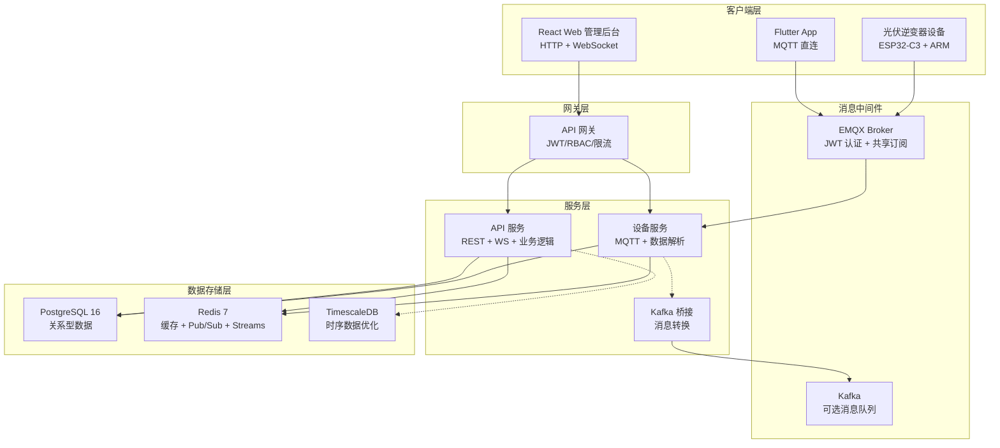

# 项目概述

<cite>
**本文引用的文件**
- [README.md](file://README.md)
- [api-gateway/main.go](file://api-gateway/main.go)
- [inv_api_server/cmd/main.go](file://inv_api_server/cmd/main.go)
- [inv_device_server/cmd/main.go](file://inv_device_server/cmd/main.go)
- [deploy/docker-compose.yml](file://deploy/docker-compose.yml)
- [Makefile](file://Makefile)
- [docs/架构升级任务清单.md](file://docs/架构升级任务清单.md)
</cite>

## 更新摘要
**变更内容**
- 基于全面重写的 README.md 更新系统架构和技术栈信息
- 新增 API 网关组件的详细功能说明
- 完善微服务分层架构的职责分工
- 更新部署和运维相关的操作指南
- 强化系统边界和关键技术选型说明

## 目录
1. [简介](#简介)
2. [核心价值与特性](#核心价值与特性)
3. [系统架构总览](#系统架构总览)
4. [微服务分层设计](#微服务分层设计)
5. [核心技术栈](#核心技术栈)
6. [关键设计原则](#关键设计原则)
7. [部署与运维](#部署与运维)
8. [性能与扩展性](#性能与扩展性)
9. [系统边界与集成](#系统边界与集成)
10. [架构演进路线](#架构演进路线)

## 简介
INV-MQTT 光伏逆变器物联网监控系统是一个基于 MQTT 协议的企业级远程监控平台，专为大规模分布式光伏设备管理而设计。系统支持万级设备并发接入，提供实时数据采集、OTA 固件升级、智能告警管理、多端协同（Flutter 移动端 + React Web 管理后台）等完整功能。

系统采用"实时直连 + 历史查询"的双通道架构：设备通过 EMQX Broker 以 JWT 认证进行低延迟实时数据推送；历史与统计类数据通过 HTTP REST API 查询，确保安全与可扩展性的完美结合。

## 核心价值与特性

### 企业级监控能力
- **万级设备接入**：EMQX 共享订阅 + 多实例水平扩展，支撑大规模设备并发
- **毫秒级实时推送**：MQTT 直连推送，避免 HTTP 轮询开销
- **全链路可观测性**：Prometheus 指标采集 + Grafana 仪表盘 + 结构化日志

### 智能化运维管理
- **OTA 固件升级**：ARM/ESP 双芯片远程升级，进度实时跟踪
- **智能告警系统**：实时告警检测、分级告警、多渠道通知
- **SN 编号校验**：16 位编码 + CRC16-Modbus 校验，确保设备身份安全

### 多端协同体验
- **Flutter 跨平台 App**：MQTT 直连获取实时数据，原生性能体验
- **React Web 管理后台**：WebSocket 推送，专业化管理界面
- **统一用户体系**：JWT 认证、RBAC 权限控制、设备分享机制

## 系统架构总览



**图表来源**
- [README.md: 24-36:24-36](file://README.md#L24-L36)
- [deploy/docker-compose.yml: 3-154:3-154](file://deploy/docker-compose.yml#L3-L154)

## 微服务分层设计

### API 网关层
API 网关作为系统的统一入口，承担以下核心职责：
- **统一鉴权**：JWT Token 验证，防止未授权访问
- **权限控制**：基于 Redis 缓存的 RBAC 权限检查
- **流量治理**：全局与路由级限流，保护后端服务
- **请求代理**：智能路由到 API 服务和设备服务
- **健康检查**：服务状态监控与优雅关闭

### API 服务层
API 服务是面向用户的 REST API 服务，提供完整的业务功能：
- **用户认证**：登录注册、JWT 签发与刷新、短信/邮箱验证
- **电站管理**：电站 CRUD、设备绑定、统计分析
- **设备管理**：设备详情、实时数据查询、控制命令下发
- **告警管理**：告警记录、处理流程、通知推送
- **OTA 管理**：固件上传、升级任务、进度跟踪
- **WebSocket 推送**：管理后台实时数据推送

### 设备服务层
设备服务专注于设备通信和数据处理的底层能力：
- **MQTT 连接管理**：EMQX 共享订阅、设备在线状态同步
- **数据解析**：协议适配、字段映射、兼容处理
- **Redis 缓存**：设备影子、实时数据缓存、Pub/Sub 推送
- **Streams 消费**：Redis Streams 消息缓冲与处理
- **内部 API**：为 API 服务提供设备状态查询和命令下发接口

### 消息桥接层
可选的 Kafka 桥接服务，用于高级消息处理场景：
- **协议转换**：MQTT → Kafka 消息格式转换
- **规则引擎**：基于 SQL 的数据过滤和转换
- **异步处理**：解耦设备上报与数据处理

**章节来源**
- [api-gateway/main.go: 1-168:1-168](file://api-gateway/main.go#L1-L168)
- [inv_api_server/cmd/main.go: 1-767:1-767](file://inv_api_server/cmd/main.go#L1-L767)
- [inv_device_server/cmd/main.go: 1-396:1-396](file://inv_device_server/cmd/main.go#L1-L396)

## 核心技术栈

### 后端服务技术
| 技术 | 版本 | 用途 |
|------|------|------|
| Go | 1.25+ | 高性能后端语言 |
| Gin | v1.9 | HTTP 框架与路由 |
| pgx | v5 | PostgreSQL 驱动 |
| go-redis | v9 | Redis 客户端 |
| paho.mqtt.golang | - | MQTT 客户端 |
| Viper | - | 配置管理 |
| Zap | - | 结构化日志 |
| Prometheus | - | 指标采集 |

### 前端与移动端技术
| 技术 | 版本 | 用途 |
|------|------|------|
| React | 18 | Web 管理后台 |
| TypeScript | 5.x | 类型安全 |
| Flutter | 3.x | 跨平台移动端 |
| Ant Design | v5 | UI 组件库 |
| ECharts | - | 数据可视化 |
| BLoC | - | 状态管理 |

### 基础设施技术
| 技术 | 版本 | 用途 |
|------|------|------|
| PostgreSQL | 16 | 关系型数据库 |
| TimescaleDB | - | 时序数据扩展 |
| Redis | 7 | 缓存 + 消息队列 |
| EMQX | 5.x | MQTT Broker |
| Docker Compose | - | 容器化编排 |

**章节来源**
- [README.md: 51-99:51-99](file://README.md#L51-L99)

## 关键设计原则

### 实时数据链路设计
系统遵循"实时走 MQTT，历史走 HTTP"的设计原则：
- **实时上行**：设备 → EMQX → 共享订阅 → Device Server → PostgreSQL + Redis
- **实时下行**：App MQTT 直连 EMQX（JWT 认证）→ 实时推送
- **历史查询**：App/Web → API Gateway → API Server → PostgreSQL
- **命令下发**：Web/App → API Server → Device Server → MQTT → 设备

### 高可用架构设计
- **共享订阅**：`$share/inv-group/` 前缀实现负载均衡
- **Redis 共享状态**：多实例通过 Redis 共享设备在线状态
- **Session 清理**：断开即清理会话，防止资源泄漏
- **K8s HPA**：基于 CPU/内存自动扩缩 2~10 副本

### 安全认证机制
- **EMQX 内置 JWT**：HS256 签名，过期自动断连
- **统一 Secret**：API Server 与 EMQX 共用密钥
- **RBAC 权限控制**：基于角色的访问控制
- **SN 编号校验**：CRC16-Modbus 校验确保设备身份

**章节来源**
- [README.md: 276-341:276-341](file://README.md#L276-L341)
- [docs/架构升级任务清单.md: 31-131:31-131](file://docs/架构升级任务清单.md#L31-L131)

## 部署与运维

### 快速启动
系统支持多种部署方式：

#### Docker Compose 一键部署
```bash
cd deploy
docker compose up -d
```

#### 本地开发环境
```bash
# 构建所有 Go 服务
make build-go

# 启动前端开发服务器
make dev-web

# 启动 Flutter 应用
cd inv_app && flutter run
```

### 服务端口规划
| 服务 | 内部端口 | 映射端口 | 说明 |
|------|---------|---------|------|
| API Gateway | 8080 | 8888 | 统一 HTTP 入口 |
| API Server | 8080 | - | REST API + WebSocket |
| Device Server | 8081 | - | 设备通信 + /metrics |
| Admin Frontend | 80 | 3000 | Web 管理后台 |
| PostgreSQL | 5432 | 5432 | 数据库 |
| Redis | 6379 | 6379 | 缓存 + 消息队列 |
| EMQX MQTT | 8883 | 8883 | MQTT SSL |

### 运维工具链
- **Makefile 统一构建**：标准化构建、测试、部署流程
- **Git Hooks**：pre-commit 和 commit-msg 钩子保证代码质量
- **健康检查**：各服务提供 /health 端点
- **指标监控**：Prometheus metrics 暴露

**章节来源**
- [README.md: 186-259:186-259](file://README.md#L186-L259)
- [deploy/docker-compose.yml: 1-201:1-201](file://deploy/docker-compose.yml#L1-201)
- [Makefile: 1-124:1-124](file://Makefile#L1-L124)

## 性能与扩展性

### 性能优化策略
- **Redis Streams 削峰**：消息缓冲，按服务节奏处理
- **TimescaleDB 时序优化**：超表 + 自动压缩 + 连续聚合
- **连接池优化**：数据库和 Redis 连接池配置
- **内存管理**：合理的 GC 参数和内存限制

### 水平扩展能力
- **无状态服务**：API 服务和设备服务均为无状态设计
- **共享订阅负载均衡**：EMQX 自动分发消息给多个实例
- **Redis 共享状态**：多实例共享设备状态和缓存数据
- **K8s 自动扩缩容**：基于指标的自动扩缩容

### 监控与告警
- **Prometheus 指标**：服务性能、业务指标、系统资源
- **Grafana 仪表盘**：可视化监控面板
- **结构化日志**：Zap 日志框架，便于日志收集和分析
- **健康检查**：服务依赖健康检查和降级处理

**章节来源**
- [README.md: 291-341:291-341](file://README.md#L291-L341)
- [docs/架构升级任务清单.md: 78-115:78-115](file://docs/架构升级任务清单.md#L78-L115)

## 系统边界与集成

### 外部系统集成
- **EMQX MQTT Broker**：负责设备连接管理和消息路由
- **PostgreSQL/TimescaleDB**：持久化存储关系型和时序数据
- **Redis**：缓存、会话管理、消息队列、实时推送
- **第三方服务**：短信、邮件、天气、地图等外部 API

### 设备接入规范
- **协议标准**：统一的 MQTT 主题和数据格式
- **认证机制**：JWT Token 认证，支持设备身份验证
- **数据校验**：SN 编号校验，确保数据完整性
- **错误处理**：标准化的错误码和重试机制

### 前后端交互协议
- **RESTful API**：标准的 HTTP REST 接口
- **WebSocket**：实时数据推送和管理后台交互
- **MQTT 主题**：规范的 MQTT 主题命名约定
- **数据格式**：统一的 JSON 数据格式规范

**章节来源**
- [README.md: 102-182:102-182](file://README.md#L102-L182)

## 架构演进路线

### Phase 1：基础架构（已完成）
- EMQX 内置 JWT 认证 + App 鉴权改造
- 基础微服务架构搭建
- 核心功能实现

### Phase 2：高可用架构（已完成）
- 共享订阅 + 多实例部署
- Redis 共享状态
- 负载均衡和故障转移

### Phase 3：消息缓冲（进行中）
- Redis Streams 削峰填谷
- 消费组 + ACK 机制
- 死信队列处理

### Phase 4：时序优化（按需）
- TimescaleDB 迁移
- 自动压缩策略
- 连续聚合优化

### Phase 5：运维完善（持续）
- Prometheus + Grafana 监控
- K8s 部署 + HPA
- 压测和容量规划

**章节来源**
- [docs/架构升级任务清单.md: 134-142:134-142](file://docs/架构升级任务清单.md#L134-L142)

---

INV-MQTT 通过精心设计的微服务架构和先进的技术选型，实现了低延迟、高可靠、可扩展的光伏逆变器监控体系。系统不仅满足当前万级设备接入的需求，更为未来的功能扩展和规模增长奠定了坚实的基础。建议按照既定的演进路线逐步推进架构升级，持续优化系统性能和运维效率。