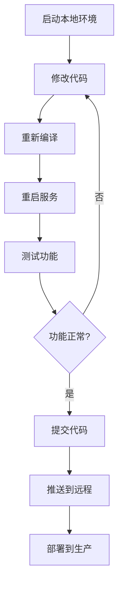

# 本地开发环境指南

## 概述

本文档说明如何配置和使用本地开发环境，确保开发环境与生产环境隔离，避免数据冲突和消息重复消费。

## 环境隔离策略

### 问题背景

本地开发环境和生产环境同时连接同一个 EMQX Broker 会导致：
- 消息重复消费（两个实例都订阅相同的 MQTT 主题）
- 数据库记录冲突
- Kafka 消费者组偏移量混乱
- 资源浪费（双倍的数据库连接和 Redis 操作）

### 解决方案

采用以下隔离策略：

| 配置项 | 生产环境 | 本地开发 | 说明 |
|--------|----------|----------|------|
| **MQTT Client ID** | `CSKJ-INV-SERVER-DEVICE` | `CSKJ-INV-SERVER-DEVICE-LOCAL-DEV` | 不同的客户端标识 |
| **Kafka 消费者组** | `inv-device-server-parser` | `inv-device-server-local-dev` | 独立消费者组，两边独立消费 |
| **数据库** | `inv_mqtt` | `inv_mqtt` | 共享同一个数据库 |
| **MQTT 端口** | 8883 (TLS) | 1883 (非 TLS) | 简化开发环境配置 |
| **日志级别** | info | debug | 开发时输出更多日志 |

## 快速开始

### 方式一：使用 PowerShell 脚本（推荐）

```powershell
# 基本启动（自动编译）
.\dev-start.ps1

# 跳过编译，直接启动
.\dev-start.ps1 -SkipBuild

# 使用 Docker 启动数据库服务
.\dev-start.ps1 -UseDockerDB

# 组合使用
.\dev-start.ps1 -SkipBuild -UseDockerDB
```

### 方式二：手动启动

#### 1. 启动数据库服务

**选项 A：使用本地数据库**
```bash
# 确保 PostgreSQL 已启动
# 创建开发数据库
psql -U postgres -c "CREATE DATABASE inv_mqtt_dev"

# 确保 Redis 已启动
redis-cli ping
```

**选项 B：使用 Docker**
```bash
cd deploy
docker compose up -d postgres redis
```

#### 2. 编译服务

```bash
cd device-communication
go mod download
go build -o ../bin/device-server.exe ./cmd
cd ..
```

#### 3. 启动服务

```bash
# 加载环境变量（PowerShell）
Get-Content ".env" | ForEach-Object {
    $line = $_.Trim()
    if ($line -and -not $line.StartsWith("#")) {
        $parts = $line -split "=", 2
        if ($parts.Length -eq 2) {
            [Environment]::SetEnvironmentVariable($parts[0].Trim(), $parts[1].Trim(), "Process")
        }
    }
}

# 启动服务
.\bin\device-server.exe -config device-communication/config.dev.yaml
```

## 配置文件说明

### `.env`（根目录）

本地开发环境变量，会被 Docker Compose 和启动脚本加载：

```env
# 数据库配置（本地）
DB_HOST=localhost
DB_NAME=inv_mqtt

# MQTT 配置
MQTT_BROKER=jiuxiaoyw.online
MQTT_PORT=1883
MQTT_CLIENT_ID=CSKJ-INV-SERVER-DEVICE-LOCAL-DEV
MQTT_USERNAME=CSKJ-INV-DEVICE-SERVER
MQTT_PASSWORD=CSKJINVDEVICESERVER

# Kafka 配置（启用，使用独立消费者组）
KAFKA_ENABLED=true
KAFKA_BROKER=broker.jiuxiaoyw.online:9092
KAFKA_CONSUMER_GROUP=inv-device-server-local-dev
```

### `device-communication/config.dev.yaml`

本地开发专用配置文件，特点：
- 连接本地数据库和 Redis
- 使用非 TLS 连接 EMQX
- **使用独立的 Kafka 消费者组**，与生产环境独立消费
- 启用 debug 日志级别

### `deploy/.env.prod`

生产环境配置，**不要修改**！

## 停止本地开发环境

### 停止本地服务

```powershell
# 在运行服务的终端按 Ctrl+C
```

### 停止 Docker 数据库服务（如果使用）

```bash
cd deploy
docker compose down
```

## 验证环境隔离

### 检查 MQTT 连接

启动服务后，检查 EMQX 控制台，应该看到：

| 客户端 ID | 用户名 | 状态 |
|-----------|--------|------|
| `CSKJ-INV-SERVER-DEVICE-LOCAL-DEV` | `CSKJ-INV-DEVICE-SERVER` | ✅ 已连接 |
| `CSKJ-INV-SERVER-DEVICE-<prod-id>` | `CSKJ-INV-DEVICE-SERVER` | ✅ 已连接 |

**关键点**：两个连接使用不同的客户端 ID，但都使用正确的用户名。

### 检查 Kafka 状态

本地开发实例的日志应该显示：

```
INFO  Kafka consumer started, group: inv-device-server-local-dev
INFO  Subscribed to topic: inv-telemetry
INFO  Subscribed to topic: inv-alerts
```

**验证要点**：
- 消费者组名称为 `inv-device-server-local-dev`（不是生产环境的 `inv-device-server-parser`）
- 成功连接到 Kafka broker
- 订阅了遥测和告警主题

### 检查数据库连接

```bash
# 连接到数据库
psql -U postgres -d inv_mqtt

# 检查表是否存在
\dt
```

## 常见问题

### Q1: 启动时提示 "connection refused"

**原因**：PostgreSQL 或 Redis 未启动

**解决**：
```bash
# 检查 PostgreSQL
pg_isready -h localhost -p 5432

# 检查 Redis
redis-cli -h localhost -p 6379 ping

# 如果使用 Docker
cd deploy
docker compose up -d postgres redis
```

### Q2: 提示 "database inv_mqtt does not exist"

**解决**：
```bash
psql -U postgres -c "CREATE DATABASE inv_mqtt"
```

### Q3: MQTT 连接失败

**检查**：
1. 网络是否能访问 `jiuxiaoyw.online:1883`
2. 用户名密码是否正确
3. 查看服务日志获取详细错误信息

### Q4: 生产环境数据被修改

**原因**：可能错误地连接到了生产数据库

**预防**：
- 检查 `.env` 文件中的 `DB_NAME` 是否为 `inv_mqtt_dev`
- 检查 `config.dev.yaml` 中的数据库配置
- 启动时注意日志中显示的数据库名称

## 开发工作流

### 典型开发流程



### 快速迭代技巧

1. **跳过编译**：如果只修改配置，使用 `-SkipBuild` 参数
2. **使用热重载**：安装 `air` 或 `CompileDaemon` 实现代码热重载
3. **查看实时日志**：服务日志在终端实时输出，便于调试

## 相关文档

- [部署指南](deploy/DEPLOY_GUIDE.md)
- [生产环境配置](deploy/.env.prod)
- [EMQX 配置](docs/emqx_rule_engine_sql.md)
- [MQTT 协议文档](README.md#mqtt-主题格式)

## 获取帮助

遇到问题？

1. 查看服务日志输出
2. 检查 [常见问题](#常见问题) 部分
3. 搜索项目文档
4. 联系项目维护者
