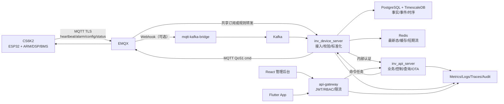
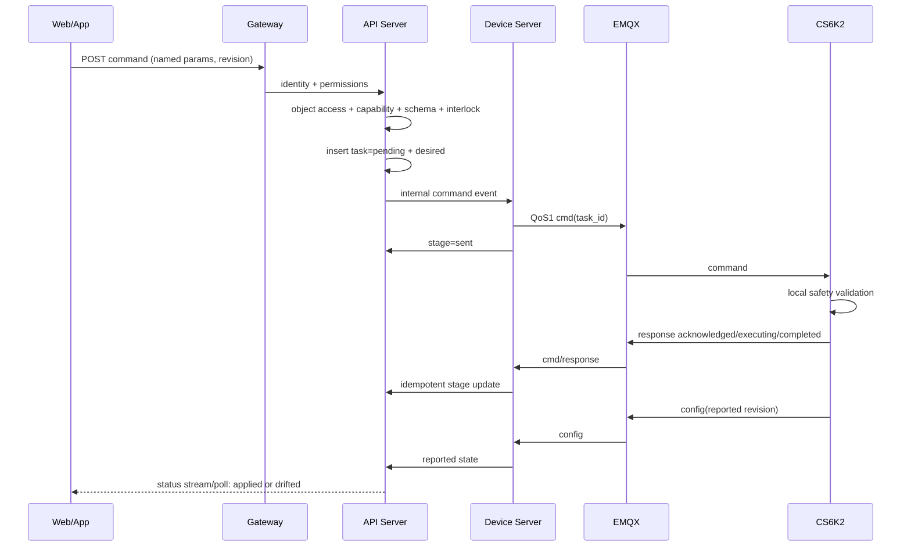

# CS6K2 系统支持端架构与数据指导

## 1. 目标架构



生产环境必须明确选择一种遥测主通道：

- **直接共享订阅**：EMQX → Device Server，适合当前规模，组件少。
- **Kafka 解耦**：EMQX Rule/Webhook → Bridge → Kafka → Device Server，适合需要削峰、重放和多消费者的规模。

两条链路可以保留降级能力，但同一消息不得在生产中双写两次。切换开关、消息来源和 data_hash 去重必须可观测。

## 2. 服务职责

| ID | 服务 | 必须负责 | 不应负责 |
|---|---|---|---|
| ARC-SVC-001 | API Gateway | 公网入口、JWT 验证、RBAC、限流、CORS、安全头、代理指标 | 设备协议解析、业务事务 |
| ARC-SVC-002 | API Server | 用户/电站/设备业务、对象授权、控制编排、查询、告警、OTA、审计 | 直接解析 heartbeat 数组、无记录地发 MQTT |
| ARC-SVC-003 | Device Server | MQTT/Kafka 消费、信封/schema 校验、标准化、幂等、命令下发与回复处理 | 用户角色判定、Web 页面 DTO 拼装 |
| ARC-SVC-004 | MQTT-Kafka Bridge | 校验 topic、保留原始 payload、以 SN 分区可靠转发 | 业务字段映射、数据库写入 |
| ARC-SVC-005 | Web/App | 展示、用户输入、客户端状态 | 安全范围最终判定、设备缩放换算、直接写 cmd topic |
| ARC-SVC-006 | PostgreSQL/TimescaleDB | 权威事实、关系、事件、时序、聚合和审计 | 实时推送总线 |
| ARC-SVC-007 | Redis | 最新态缓存、权限缓存、短期去重/流、在线状态 | 永久事实和唯一审计来源 |

## 3. 领域模块

API Server 按领域组织，禁止 handler 直接堆积 SQL 和设备协议逻辑：

```text
identity        用户、会话、角色、权限、分享
fleet           设备、型号、协议、能力、生命周期
station         电站、成员、时区、聚合
telemetry       最新态、历史、质量、导出
alarm           事件投影、通知、快照、工单
control         命令、策略、影子、联锁、审计
parallel        组网拓扑、事务、组级状态
ota             包、发布、任务、灰度、回滚
operations      系统健康、指标、审计、诊断
```

每个领域采用 handler → service/use-case → repository/connector 方向依赖。跨领域使用显式接口或事件，不共享可变全局状态。

## 4. 协议和标准模型

### 4.1 上行信封

所有设备业务消息使用稳定信封：

```json
{
  "t": 1784100000,
  "v": 1,
  "data": {}
}
```

要求：

| ID | 要求 |
|---|---|
| ARC-PRO-001 | `t` 为设备事件/采样 Unix 秒，原样保留；`received_at` 由服务端产生 |
| ARC-PRO-002 | `v` 选择 released 协议；未知版本进入隔离/DLQ，不按最近版本猜测 |
| ARC-PRO-003 | `raw_envelope` 完整保留；标准字段单独映射，扩展字段进入受控 `ext` |
| ARC-PRO-004 | 同一 field_key 在所有版本保持业务语义、方向和基础单位 |
| ARC-PRO-005 | 数据质量使用位标记，不通过静默钳位或丢弃伪装成正常值 |

### 4.2 消息幂等键

| 消息 | 幂等/排序键 | 终态规则 |
|---|---|---|
| heartbeat/cells | `sn + t + data_hash` | 旧样本写历史，不覆盖 latest |
| alarm | `sn + source + code + state + t` | 投影按事件序和规则推进 |
| config | `sn + rev` | 小于 reported revision 拒绝/记录乱序 |
| parallel/three_phase | `master_sn + t + data_hash` | 拓扑和三相分别有序 |
| cmd response | `task_id + stage` | success/failed/timeout/cancelled 不倒退 |
| OTA status | `task_id + state + progress` | 最终态不倒退，progress 不回退 |

## 5. 数据存储分层

### 5.1 权威关系与事件

- 用户、角色、权限、设备、电站、型号、协议、电池模板。
- 告警事件与当前投影、命令与配置事件、OTA 包与任务。
- 所有写入使用事务、外键/唯一约束和乐观 revision；禁止只靠应用内检查。

### 5.2 最新态

- Redis 提供低延迟读取，PostgreSQL `device_latest_state` 作为可恢复权威快照。
- 更新条件必须比较 event_time/data_hash，离线补传不得覆盖新值。
- 缓存 miss 回源数据库；Redis 清空后系统可自动恢复。

### 5.3 时序与聚合

| 层级 | 用途 | 建议策略 |
|---|---|---|
| 设备 5 秒原始 | 协议诊断/短期排障（如确需） | 设备侧/流侧短期，不作为常规长期表 |
| 3 分钟标准明细 | 近期曲线、故障分析 | 3 天后压缩，容量控制下最多约 90 天 |
| 小时聚合 | 日/周曲线、峰值、可用率 | 长期保留 |
| 日聚合 | 月/年报、能量统计 | 长期保留 |
| 月聚合 | 多年趋势 | 长期保留 |
| 事件/控制/OTA | 审计与售后追溯 | 默认 3 年，按合同/法规覆盖 |

聚合必须以设备事件时间和电站时区定义桶；能量增量处理设备累计值复位、溢出和乱序。

## 6. 控制架构



| ID | 要求 |
|---|---|
| ARC-CTL-001 | 创建 task 和 desired 更新在同一事务或可补偿事务中完成 |
| ARC-CTL-002 | API 到 Device Server 使用内部服务认证和重放防护 |
| ARC-CTL-003 | 设备保存近期 task_id 结果；重复命令返回原结果，不重复执行 |
| ARC-CTL-004 | 超时只表示云端未得到最终结果，不自动断言设备失败 |
| ARC-CTL-005 | 高风险命令不自动重试；查询类命令可有限重试 |

## 7. 一致性、并发和故障处理

### 7.1 一致性

- 用户/权限/设备归属：强一致数据库事务，缓存带版本和失效机制。
- 遥测：事件最终一致；同 SN 同数据流有序，不要求全局有序。
- 命令：task 状态强约束，设备 reported 最终一致。
- 告警：事件不可变，当前状态为可重建投影。

### 7.2 故障矩阵

| 故障 | 系统行为 |
|---|---|
| PostgreSQL 不可用 | 停止确认需持久化的消费；使用 broker/Kafka 重试，不在内存无限缓存 |
| Redis 不可用 | API 回源数据库；在线/推送降级；权限不得 fail-open |
| EMQX 不可用 | 设备本地自治；命令保持 queued/failed，不宣称成功 |
| Kafka 不可用 | 生产选定主通道按策略重试/DLQ；不得静默切双写产生重复 |
| API Server 不可用 | Gateway 返回可识别 503；设备上行可由 Device Server 继续落库 |
| Device Server 重启 | 共享订阅接管；未完成命令从数据库恢复/查询状态 |
| 时钟异常 | 保留原 t、标记 CLOCK_INVALID，使用 received_at 辅助而不改写证据 |

## 8. API 规范

- 统一 `/api/v1`，JSON 使用 snake_case 或既有约定但同一 DTO 不混用。
- 成功/错误 envelope 稳定；HTTP status 和业务 code 不互相矛盾。
- 列表使用 cursor 或 page/page_size，最大页大小明确；导出异步。
- 修改接口支持 idempotency key/revision；冲突返回 409。
- 错误返回稳定 `code`、安全的 `message`、`trace_id`，不回传 SQL/堆栈/秘密。
- OpenAPI/JSON Schema 与实现、测试同步生成或验证。

## 9. 可观测性

| ID | 指标/证据 |
|---|---|
| ARC-OBS-001 | API RED：请求量、错误率、p50/p95/p99、in-flight，按归一化路由而非 SN 标签 |
| ARC-OBS-002 | 消息：接收、校验失败、重复、乱序、重试、DLQ、端到端延迟、Kafka lag |
| ARC-OBS-003 | 数据库：连接池、事务、WAL、锁等待、chunk、压缩、聚合刷新、磁盘增长 |
| ARC-OBS-004 | 控制：各 stage 时长、超时率、拒绝码、reported 漂移 |
| ARC-OBS-005 | OTA：阶段、成功率、回滚率、版本分布、灰度自动暂停 |
| ARC-OBS-006 | 日志包含 trace_id/task_id/sn 的哈希或受控标识，不记录 token/密码/完整敏感 payload |

## 10. 架构演进要求

1. 先修复 fail-open 控制和 capability API，再扩大远控功能。
2. 明确生产主接入通道并删除/关闭重复消费路径。
3. 把 handler/repository 中的控制校验收敛到 control use-case。
4. 将当前静态 App 设置迁移到 capability 驱动。
5. 补齐 OpenAPI、事件 schema、数据库契约和架构决策记录（ADR）。

