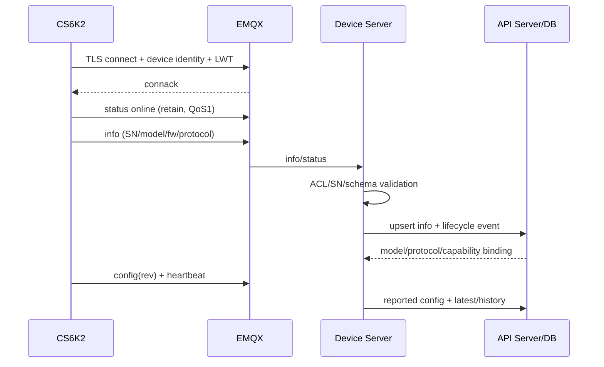

# CS6K2 全链路协议、状态机与一致性要求

## 1. 链路总表

| 链路 | 起点→终点 | 可靠性 | 关键关联键 |
|---|---|---|---|
| 设备身份/信息 | CS6K2→EMQX→Device Server→API/DB | QoS1/连接时 | SN、firmware、protocol v |
| 在线状态 | CS6K2/LWT→EMQX→平台 | QoS1 retain | SN、broker time |
| heartbeat | CS6K2→平台 | QoS0/1按协议，允许重复 | SN+t+data_hash |
| alarm | ARM→平台 | QoS1，必须确认处理 | SN+source+code+state+t |
| config | ARM→平台 | QoS1 | SN+rev |
| command | API→Device Server→CS6K2 | QoS1，幂等 | task_id |
| command response | CS6K2→平台 | QoS1 | task_id+stage |
| OTA | 平台↔ESP/ARM/DSP/BMS | QoS1+HTTP TLS | task_id+target+version |
| parallel | master→平台 | 按协议 | master SN+t+hash |
| three_phase | master→平台 | 按协议 | master SN+t+hash |

## 2. Topic 和 ACL

推荐稳定主题：

```text
上行
cs_inv/{sn}/info
cs_inv/{sn}/status
cs_inv/{sn}/heartbeat
cs_inv/{sn}/alarm
cs_inv/{sn}/config
cs_inv/{sn}/parallel
cs_inv/{sn}/three_phase
cs_inv/{sn}/cmd/response
cs_inv/{sn}/ota/status

下行
cs_inv/{sn}/cmd
cs_inv/{sn}/ota/cmd
```

旧 `data/ac`、`data/battery` 等分 topic 只在固件切换窗口兼容；平台内部尽早映射为统一 heartbeat。设备只能访问自身 SN；服务账号按订阅职责授权；App 不写 cmd。

## 3. 设备启动和接入



| ID | 要求 |
|---|---|
| E2E-ONB-001 | SN、设备身份和 payload SN 必须一致，任何不一致拒绝并告警 |
| E2E-ONB-002 | info 不自动赋予用户归属；首次设备为 pending/unclaimed |
| E2E-ONB-003 | 未识别型号/协议可保存隔离证据，但不进入正常控制能力 |
| E2E-ONB-004 | status retained/LWT 只表示网络连接，业务在线还需最近有效数据 |

## 4. 遥测链路

### 4.1 处理顺序

1. 校验 topic、SN、payload 大小、JSON/二进制 framing。
2. 校验 `{t,v,data}`、协议 released、数组长度、类型和枚举。
3. 计算 canonical data_hash；检查重复/乱序。
4. 按型号映射标准字段；计算质量标记和派生值。
5. 原始信封和标准样本持久化；更新 latest 需 event_time 更新。
6. 触发告警/聚合/推送；所有下游携带 trace/data_hash。

| ID | 要求 |
|---|---|
| E2E-TEL-001 | 重复 QoS 投递不产生重复历史和能量统计 |
| E2E-TEL-002 | 乱序数据保留历史并标记，但不覆盖 latest |
| E2E-TEL-003 | `t=0`、大幅未来/过去、倒退标记 CLOCK_INVALID，保留原值 |
| E2E-TEL-004 | 设备状态为停机/故障时允许相应 AC 值为 0，范围校验依赖状态 |
| E2E-TEL-005 | 原始/标准/Redis/API/Web/App 对电流符号、单位和字段语义一致 |
| E2E-TEL-006 | 数据写失败进入可观测重试/DLQ，不提前 ACK 为业务成功 |

## 5. 告警状态机

设备事件：`active`、`recovered`。人工状态：`unhandled`、`acknowledged`、`assigned`、`resolved/closed`，两者正交。

```text
设备 active ──→ 创建/更新活动投影 ──→ 通知
     │                         ├─ 人工确认/指派/处理
设备 recovered ─→ 记录恢复时间 ─────┘
```

| ID | 要求 |
|---|---|
| E2E-ALM-001 | 相同 active 重投不新建第二个活动告警 |
| E2E-ALM-002 | recovered 可先于迟到 active 到达，投影重放后结果确定且不倒退 |
| E2E-ALM-003 | active 捕获 before/at，recovered 捕获 after；缺失明确记录 |
| E2E-ALM-004 | 人工处理字段不从设备恢复事件推断或覆盖 |
| E2E-ALM-005 | 严重告警恢复前禁止相关危险控制，规则由错误码矩阵定义 |

## 6. 控制状态机

### 6.1 云端状态

```text
pending → queued → sent → acknowledged → executing → success
    │        │       │          │             └────→ failed
    │        │       │          └──────────────────→ timeout
    └────────┴───────┴─────────────────────────────→ cancelled
```

终态：success、failed、timeout、cancelled。迟到 response 作为证据记录；不得把 cancelled/failed 恢复成 executing。timeout 后若设备最终报告成功，可增加 `late_success` 事件并经业务规则修正展示，但不能篡改原超时证据。

### 6.2 设备处理

1. 验证协议版本、task_id、时间/TTL、命令和参数。
2. 查近期 task_id；重复则返回原阶段/结果。
3. 校验硬件状态、故障、BMS、SOC、温度、并机和本地安全范围。
4. 回复 acknowledged；安全地执行并按需要回复 executing。
5. 持久配置写入校验、原子切换并增加 rev；回复 completed/applied args。
6. 上报 config(reported rev)。

| ID | 要求 |
|---|---|
| E2E-CTL-001 | API 接收具名参数，只有服务端适配器生成设备 args |
| E2E-CTL-002 | task 写入成功后才允许发布；发布失败可恢复为 queued/failed |
| E2E-CTL-003 | 设备 applied_args 和 reported rev 是最终生效证据 |
| E2E-CTL-004 | 临时 override 同时含 issued_at/expires_at，设备本地计时 |
| E2E-CTL-005 | config revision 冲突不以最后写入静默覆盖 |

## 7. 并机组网事务

事务阶段：`draft → prechecked → prepared → synchronized → started`，任一阶段可进入 `failed/rolling_back/safe_stopped`。

- prepared 只写配置，不允许成员独立输出。
- 所有成员 prepared 后由 master 同步验证。
- start 只有组级 task；成员结果属于该 task 的 child result。
- 任一关键失败停止全组，记录哪些成员已回滚/需现场处理。

## 8. OTA 状态机

```text
created → prechecking → queued → accepted → downloading → verifying
→ installing → rebooting → health_check → succeeded
任一允许阶段 → cancelled
任一阶段 → failed → rolling_back → rolled_back/rollback_failed
```

| ID | 要求 |
|---|---|
| E2E-OTA-001 | progress 0–100 不倒退；阶段变化或≥5%变化上报 |
| E2E-OTA-002 | 下载前和安装前都验证签名/hash/型号/target/版本 |
| E2E-OTA-003 | reboot 后以设备 info 实际版本和健康状态判定成功 |
| E2E-OTA-004 | 并机组滚动升级保持兼容矩阵；不同时升级所有关键成员 |
| E2E-OTA-005 | 云端任务超时不能抹除设备后续回滚证据 |

## 9. 离线和补传

- 设备离线继续本地安全控制、时间计划和 override 到期。
- heartbeat 可按容量缓存并补传；告警、命令结果、config、OTA 必须优先可靠保留。
- 补传携带原始 t；不得伪造为当前数据；UI 曲线可显示，latest 不倒退。
- 缓存满采用明确优先级和丢弃计数，不能丢失后仍声称完整。

## 10. API/Web/App 一致性

| ID | 要求 |
|---|---|
| E2E-UI-001 | API 返回 `sample_time/received_at/quality/actual_granularity` |
| E2E-UI-002 | Web/App 不直接解析 heartbeat 数组，使用标准 DTO |
| E2E-UI-003 | 重连先拉最新态/revision，再订阅增量；旧增量不覆盖新快照 |
| E2E-UI-004 | 页面展示设备实际值和命令阶段，不从按钮点击乐观推断成功 |

## 11. 全链路证据

每个 E2E 用例记录：

```text
trace_id
device_sn（测试/脱敏）
task_id 或 data_hash
MQTT topic + protocol version
event_time + received_at
数据库主键/revision
API 响应 code
Web/App 最终状态
metrics/log/audit 关联
```

缺少任一关键环节时，不得称为全链路通过。

